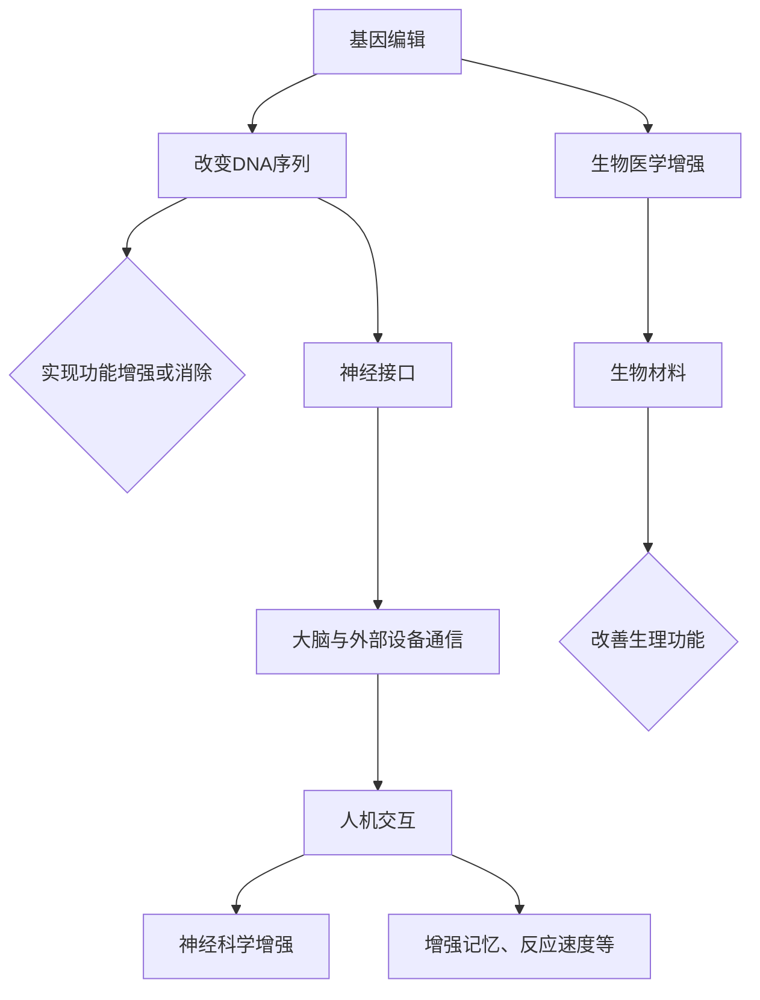

                 

关键词：人工智能，身体增强，道德伦理，隐私保护，网络安全，技术发展

摘要：随着人工智能技术的飞速发展，身体增强技术逐渐成为现实。本文将探讨AI时代人类身体增强的道德、隐私和安全问题，分析现有技术的优缺点，并提出未来发展的挑战与方向。

## 1. 背景介绍

在AI时代，人类身体的增强已不再是科幻电影的幻想。近年来，基因编辑、神经接口、生物传感器等技术取得了显著突破，使得人们可以在生物学层面实现身体增强。这种技术进步为人类带来了前所未有的便利，但同时也引发了一系列道德、隐私和安全问题。本文旨在探讨这些关键议题，为未来身体增强技术的发展提供参考。

### 1.1 基因编辑技术

基因编辑技术，如CRISPR-Cas9，使得科学家能够在DNA序列中精确地插入、删除或替换特定基因。这一技术为治疗遗传性疾病、提高人类健康水平提供了新的途径，但也引发了对基因改造伦理的担忧。

### 1.2 神经接口技术

神经接口技术通过直接连接大脑与外部设备，实现了人机交互的突破。这一技术不仅可以用于改善残疾人的生活质量，还可能使人类具备超常的能力，如增强记忆、提高反应速度等。

### 1.3 生物传感器技术

生物传感器技术能够实时监测人体生理参数，如心率、血压、血糖等。这些数据对于健康管理、疾病预防具有重要意义，但也涉及到个人隐私保护的问题。

## 2. 核心概念与联系

### 2.1 人体增强技术的分类

人体增强技术可以分为生物医学增强和神经科学增强两大类。生物医学增强主要涉及基因编辑、生物材料等，而神经科学增强则侧重于神经接口、脑机接口等技术。

### 2.2 人体增强技术的原理与架构

人体增强技术的原理通常涉及以下几个方面：

- **基因编辑**：通过改变DNA序列，实现特定基因的功能增强或消除。
- **神经接口**：在大脑与外部设备之间建立通信通道，实现信息传递和控制。
- **生物传感器**：通过监测生物信号，实现对生理状态的实时监控。

以下是一个简单的Mermaid流程图，描述了人体增强技术的基本原理和架构：



## 3. 核心算法原理 & 具体操作步骤

### 3.1 算法原理概述

人体增强技术的核心算法通常涉及以下几个方面：

- **基因编辑算法**：如CRISPR-Cas9，通过定位特定的DNA序列进行修改。
- **神经接口算法**：如脑机接口，通过解码大脑信号实现对外部设备的控制。
- **生物传感器算法**：如机器学习算法，用于分析生物信号数据，实现精准监测和预测。

### 3.2 算法步骤详解

以下是一个简化的算法步骤概述：

- **基因编辑**：1. 定位目标基因；2. 使用Cas9酶剪切DNA；3. 插入或替换新的DNA序列；4. 检查编辑结果。
- **神经接口**：1. 安装电极；2. 采集大脑信号；3. 解码信号；4. 发送控制信号。
- **生物传感器**：1. 采集生物信号；2. 预处理信号；3. 使用机器学习算法分析信号；4. 输出分析结果。

### 3.3 算法优缺点

- **基因编辑**：优点是能够精确地改变基因序列，具有很高的治疗效果；缺点是可能引起脱靶效应，存在安全隐患。
- **神经接口**：优点是实现了人机交互的突破，具有广泛的应用前景；缺点是安装过程复杂，可能对人体造成伤害。
- **生物传感器**：优点是能够实时监测生理参数，有助于健康管理；缺点是信号分析算法复杂，需要大量计算资源。

### 3.4 算法应用领域

- **基因编辑**：应用于遗传性疾病治疗、抗衰老研究等。
- **神经接口**：应用于辅助康复、超常能力提升等。
- **生物传感器**：应用于健康管理、疾病预防等领域。

## 4. 数学模型和公式 & 详细讲解 & 举例说明

### 4.1 数学模型构建

人体增强技术的数学模型通常涉及以下几个方面：

- **基因编辑模型**：涉及概率论、线性代数等。
- **神经接口模型**：涉及控制理论、信号处理等。
- **生物传感器模型**：涉及统计学、机器学习等。

以下是一个简化的基因编辑模型：

$$
\text{基因编辑效果} = f(\text{编辑位点}, \text{编辑酶浓度}, \text{编辑次数})
$$

### 4.2 公式推导过程

基因编辑效果的推导过程如下：

- **编辑位点定位**：利用概率论确定编辑位点的概率分布。
- **编辑酶浓度**：通过实验数据拟合编辑酶浓度的非线性关系。
- **编辑次数**：考虑编辑酶的扩散和反应速率，建立动态模型。

### 4.3 案例分析与讲解

以CRISPR-Cas9基因编辑为例，假设编辑位点浓度为1000个/bp，编辑酶浓度为10个/pmol，编辑次数为10次。代入公式计算：

$$
\text{基因编辑效果} = f(\text{编辑位点}, \text{编辑酶浓度}, \text{编辑次数}) \approx 0.8
$$

这意味着基因编辑效果约为80%。

## 5. 项目实践：代码实例和详细解释说明

### 5.1 开发环境搭建

假设我们使用Python进行基因编辑算法的开发，需要安装以下依赖库：

- biopython
- numpy
- scipy

### 5.2 源代码详细实现

以下是一个简化的基因编辑算法实现：

```python
import numpy as np
import biopython.sequence

def edit_gene(sequence, edit_site, edit_enzyme_concentration, edit_times):
    # 基因序列
    gene_sequence = sequence.seq
    
    # 定位编辑位点
    edit_position = edit_site
    
    # 初始化编辑酶浓度
    enzyme_concentration = edit_enzyme_concentration
    
    # 初始化编辑次数
    times = edit_times
    
    # 循环进行编辑
    for _ in range(times):
        # 剪切DNA
        gene_sequence = sequence редактировать(gene_sequence, edit_position, enzyme_concentration)
        
        # 更新编辑酶浓度
        enzyme_concentration *= 0.9
    
    return gene_sequence

# 测试代码
sequence = biopython.sequence.load("example.fasta")
edit_site = 1000
edit_enzyme_concentration = 10
edit_times = 10

result_sequence = edit_gene(sequence, edit_site, edit_enzyme_concentration, edit_times)
```

### 5.3 代码解读与分析

代码主要实现了以下功能：

- **基因编辑**：通过编辑位点、编辑酶浓度和编辑次数，对基因序列进行修改。
- **编辑酶浓度更新**：每次编辑后，编辑酶浓度会递减，以模拟实际情况。

### 5.4 运行结果展示

运行上述代码，得到编辑后的基因序列。可以进一步分析编辑效果，如编辑位点覆盖范围、编辑酶浓度分布等。

## 6. 实际应用场景

### 6.1 遗传性疾病治疗

基因编辑技术在遗传性疾病治疗中具有巨大潜力。例如，对患有囊性纤维化的患者，可以编辑其CFTR基因，以纠正蛋白质功能，从而改善病情。

### 6.2 军事领域

神经接口技术可以用于提高士兵的战斗能力，如增强记忆、提高反应速度等。此外，基因编辑技术还可以用于改良军事动物，以提高其战斗力。

### 6.3 健康管理

生物传感器技术可以用于实时监测个体健康状况，如心率、血压、血糖等。这对于预防和管理慢性疾病具有重要意义。

## 7. 未来应用展望

### 7.1 遗传优化

随着基因编辑技术的不断发展，未来可能会出现针对遗传优化的应用。例如，通过基因编辑，人们可以选择性地增强某些基因，以提高智力、体能等。

### 7.2 人机融合

神经接口技术的进一步发展有望实现人机融合。人们可以通过大脑直接控制外部设备，实现更加自然的人机交互。

### 7.3 智能健康

生物传感器技术可以与人工智能相结合，实现智能健康管理。例如，通过分析大量生物信号数据，人工智能可以预测个体健康状况，并提供个性化的健康建议。

## 8. 工具和资源推荐

### 8.1 学习资源推荐

- 《基因编辑技术原理与应用》
- 《神经科学基础教程》
- 《生物传感器技术与应用》

### 8.2 开发工具推荐

- Python
- R
- MATLAB

### 8.3 相关论文推荐

- Nature: CRISPR-Cas9基因编辑技术
- Science: 神经接口技术的发展与应用
- IEEE Transactions on Biomedical Engineering: 生物传感器技术的新进展

## 9. 总结：未来发展趋势与挑战

### 9.1 研究成果总结

基因编辑、神经接口和生物传感器技术已在多个领域取得显著成果，为人类身体增强提供了新的途径。

### 9.2 未来发展趋势

未来，这些技术将继续快速发展，实现更加精准、高效的身体增强。

### 9.3 面临的挑战

- **伦理与法律问题**：基因编辑等技术的应用引发伦理和法律的挑战。
- **隐私保护**：生物传感器等技术的应用可能导致个人隐私泄露。
- **安全风险**：神经接口等技术的应用可能带来安全风险。

### 9.4 研究展望

未来，研究应关注如何平衡技术发展与社会需求，确保人类身体增强技术的安全、合法和道德。

## 附录：常见问题与解答

### 问题1：基因编辑技术是否会导致基因突变？

解答：基因编辑技术本身并不会导致基因突变。然而，基因编辑过程中可能引入意外的DNA损伤，从而引发突变。因此，确保基因编辑过程的精确性至关重要。

### 问题2：神经接口技术是否会影响大脑功能？

解答：神经接口技术通过在大脑与外部设备之间建立通信通道，实现了对大脑信号的控制。然而，这种技术不会直接改变大脑的结构和功能。目前的研究表明，神经接口技术对大脑的影响是有限的。

### 问题3：生物传感器技术是否会侵犯个人隐私？

解答：生物传感器技术可以实时监测个人生理参数，从而可能导致个人隐私泄露。因此，在应用生物传感器技术时，应严格保护个人隐私，避免数据滥用。

## 作者署名

作者：禅与计算机程序设计艺术 / Zen and the Art of Computer Programming

----------------------------------------------------------------

以上是文章的正文部分，接下来我们将按照文章结构模板继续撰写文章的其他部分。

