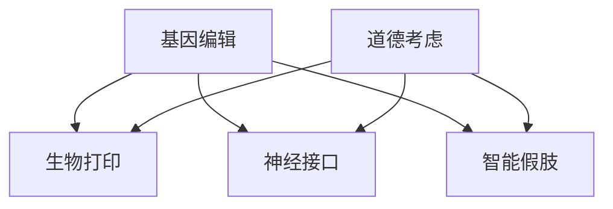

                 

### 1. 背景介绍

在21世纪的今天，人工智能（AI）技术的迅猛发展正在深刻地改变着我们的生活方式。从智能手机的智能助手到自动驾驶汽车，从智能家居到医疗诊断，AI技术正逐渐渗透到社会的各个领域。而与此同时，身体增强技术，作为一种新兴的技术方向，也在悄然兴起。

身体增强技术旨在通过科学的方法，增强人体的生理和心理功能，从而提升人类的生活质量和健康水平。这一领域的研究包括基因编辑、生物打印、神经接口、智能假肢等。例如，基因编辑技术CRISPR-Cas9的问世，使得人类可以对基因进行精确修改，从而预防或治愈遗传性疾病；生物打印技术正在让3D打印应用于人体组织，为器官移植提供新的可能性；神经接口技术则通过直接连接大脑和电子设备，实现了人类对信息的快速处理和传输。

尽管这些技术带来了巨大的潜力，但同时也引发了关于道德、隐私、安全等问题的广泛讨论。例如，基因编辑可能带来的伦理争议，生物打印技术在器官移植中的应用是否公平，神经接口技术是否会导致信息泄露等。这些问题需要我们深入思考，以确保身体增强技术的健康发展。

### 2. 核心概念与联系

在探讨身体增强技术之前，我们需要了解一些核心概念，这些概念构成了我们讨论的基础。

#### 2.1. 基因编辑

基因编辑是通过改变生物体的基因序列来达到特定目的的技术。CRISPR-Cas9是目前最为流行的基因编辑工具，它利用一种特殊的核酸酶（Cas9）来切割DNA，从而实现对特定基因的修改。

#### 2.2. 生物打印

生物打印是一种利用生物材料打印生物结构或组织的3D打印技术。这项技术有望解决器官移植中的供体短缺问题，通过打印人体器官来挽救生命。

#### 2.3. 神经接口

神经接口技术是通过将电子设备直接连接到大脑或神经系统，来传递和接收信息的技术。这种技术可以用于帮助瘫痪患者恢复行动能力，也可以用于增强人类的认知功能。

#### 2.4. 智能假肢

智能假肢是一种结合了传感器和人工智能技术的假肢，它可以感知用户的意图，并根据这些意图进行操作。智能假肢的问世，极大地提高了残疾人的生活质量。

#### 2.5. 道德考虑

道德考虑是身体增强技术中不可忽视的一个方面。它涉及到如何确保技术发展的公正性、安全性和伦理性。例如，基因编辑技术的使用是否会导致基因歧视，生物打印技术的商业化是否会导致器官移植的不公平，神经接口技术的普及是否会侵犯用户的隐私等。

#### 2.6. Mermaid 流程图

为了更清晰地理解这些概念之间的联系，我们可以使用Mermaid流程图来展示它们。



在这个流程图中，基因编辑、生物打印、神经接口和智能假肢都是身体增强技术的核心组成部分，而道德考虑则贯穿于整个过程中，确保技术的健康发展。

### 3. 核心算法原理 & 具体操作步骤

#### 3.1 算法原理概述

身体增强技术的核心在于其算法原理，这些算法能够实现对人体功能的精确控制与增强。以下是几种常见的算法原理概述：

1. **基因编辑算法**：CRISPR-Cas9算法通过序列特异性核酸酶在目标DNA序列上创建双链断裂，从而引入编辑。

2. **生物打印算法**：3D打印算法，如三角测量法和体素模型算法，用于生成生物结构的几何形状。

3. **神经接口算法**：机器学习算法，如支持向量机（SVM）和深度神经网络（DNN），用于解析大脑信号和外部设备之间的映射关系。

4. **智能假肢控制算法**：基于运动意图的传感器数据处理算法，如卡尔曼滤波和机器学习分类算法，用于识别用户的意图并执行相应的动作。

#### 3.2 算法步骤详解

以下是这些算法的具体操作步骤：

**3.2.1 CRISPR-Cas9基因编辑算法**

1. **目标识别**：使用向导RNA（gRNA）定位目标DNA序列。
2. **DNA切割**：Cas9核酸酶在gRNA的引导下识别并切割目标DNA。
3. **DNA修复**：细胞DNA修复机制将双链断裂修复成所需的基因序列。

**3.2.2 生物打印算法**

1. **结构设计**：使用CAD软件设计生物结构的几何模型。
2. **分层打印**：按照设计好的几何模型，将生物材料逐层打印。
3. **打印优化**：通过调整打印参数，如打印速度和打印材料，优化打印质量。

**3.2.3 神经接口算法**

1. **信号采集**：通过电极或传感器从大脑中采集电信号。
2. **信号预处理**：使用滤波和放大技术处理采集到的信号。
3. **信号解码**：使用机器学习算法解析电信号，并将其映射到外部设备的操作指令。

**3.2.4 智能假肢控制算法**

1. **数据采集**：使用传感器采集用户的手势或动作数据。
2. **数据预处理**：对采集到的数据进行分析，提取特征。
3. **意图识别**：使用机器学习算法识别用户的意图，并生成相应的操作指令。

#### 3.3 算法优缺点

**3.3.1 CRISPR-Cas9基因编辑算法**

- **优点**：精确度高，操作简便。
- **缺点**：可能引入脱靶效应，存在一定的风险。

**3.3.2 生物打印算法**

- **优点**：灵活性强，可以打印复杂的生物结构。
- **缺点**：打印速度较慢，材料选择有限。

**3.3.3 神经接口算法**

- **优点**：可以实现高速的信息传递。
- **缺点**：信号采集复杂，数据处理要求高。

**3.3.4 智能假肢控制算法**

- **优点**：能够实现高精度的动作控制。
- **缺点**：对用户的训练要求较高，适应期较长。

#### 3.4 算法应用领域

**3.4.1 CRISPR-Cas9基因编辑算法**

- **应用领域**：遗传疾病治疗、农业改良、生物研究。

**3.4.2 生物打印算法**

- **应用领域**：器官移植、组织工程、医疗器械。

**3.4.3 神经接口算法**

- **应用领域**：神经康复、智能辅助设备、人机交互。

**3.4.4 智能假肢控制算法**

- **应用领域**：残疾人辅助设备、工业自动化、军事应用。

### 4. 数学模型和公式 & 详细讲解 & 举例说明

在身体增强技术的核心算法中，数学模型和公式起着至关重要的作用。以下是对这些模型的构建、推导过程以及具体应用的详细讲解。

#### 4.1 数学模型构建

**4.1.1 基因编辑模型**

基因编辑模型通常基于遗传算法，通过目标识别、DNA切割和DNA修复三个阶段来实现基因编辑。数学模型可以表示为：

$$
G(x) = R(g,x) + F(x,y)
$$

其中，$G(x)$ 表示基因编辑后的序列，$R(g,x)$ 表示DNA切割操作，$F(x,y)$ 表示DNA修复操作。

**4.1.2 生物打印模型**

生物打印模型基于3D打印原理，通过体素模型来构建生物结构。数学模型可以表示为：

$$
V(x,y,z) = P(V_0)
$$

其中，$V(x,y,z)$ 表示生物结构的体素模型，$V_0$ 表示初始体素。

**4.1.3 神经接口模型**

神经接口模型基于信号处理和机器学习算法，通过采集、预处理和解码电信号来实现人机交互。数学模型可以表示为：

$$
S(t) = H(t) * G(t)
$$

其中，$S(t)$ 表示采集到的电信号，$H(t)$ 表示信号预处理函数，$G(t)$ 表示信号解码模型。

**4.1.4 智能假肢控制模型**

智能假肢控制模型基于传感器数据处理和机器学习算法，通过识别用户的意图并生成操作指令来实现动作控制。数学模型可以表示为：

$$
O(t) = C(f(t))
$$

其中，$O(t)$ 表示生成的操作指令，$C(f(t))$ 表示意图识别函数。

#### 4.2 公式推导过程

**4.2.1 基因编辑模型推导**

基因编辑模型的推导过程主要涉及DNA切割和修复的数学模型。假设目标DNA序列为$X$，切割点为$P$，则切割操作可以表示为：

$$
R(g,X) = X_1 \oplus P
$$

其中，$\oplus$ 表示异或操作。

DNA修复操作基于细胞DNA修复机制，假设修复基因为$Y$，则修复操作可以表示为：

$$
F(X,Y) = X_1 \otimes Y
$$

其中，$\otimes$ 表示修约操作。

将切割和修复操作结合起来，得到基因编辑模型：

$$
G(X) = R(g,X) + F(X,Y)
$$

**4.2.2 生物打印模型推导**

生物打印模型的推导过程主要涉及体素模型的构建和打印过程。假设初始体素为$V_0$，打印参数为$p$，则体素模型可以表示为：

$$
V(x,y,z) = V_0 + P(V_0, p)
$$

其中，$P(V_0, p)$ 表示根据打印参数$p$对体素$V_0$进行调整。

**4.2.3 神经接口模型推导**

神经接口模型的推导过程主要涉及信号处理和机器学习算法。假设采集到的电信号为$S(t)$，预处理函数为$H(t)$，解码模型为$G(t)$，则信号模型可以表示为：

$$
S(t) = H(t) * G(t)
$$

其中，$*$ 表示卷积操作。

**4.2.4 智能假肢控制模型推导**

智能假肢控制模型的推导过程主要涉及传感器数据处理和意图识别。假设采集到的传感器数据为$f(t)$，意图识别函数为$C(f(t))$，则控制模型可以表示为：

$$
O(t) = C(f(t))
$$

#### 4.3 案例分析与讲解

**4.3.1 CRISPR-Cas9基因编辑案例分析**

假设目标DNA序列为：

$$
X = ATCGATCGATCG
$$

切割点为第4位和第9位，则切割操作为：

$$
R(g,X) = ATCGATCGATCG \oplus 4 = ATCGATCGAGCG
$$

修复基因假设为$Y = GCTAGCTAGCTA$，则修复操作为：

$$
F(X,Y) = ATCGATCGAGCG \otimes GCTAGCTAGCTA = ATCGATCGATCG
$$

因此，基因编辑后的序列为：

$$
G(X) = R(g,X) + F(X,Y) = ATCGATCGAGCG + ATCGATCGATCG = ATCGATCGATCG
$$

**4.3.2 生物打印案例分析**

假设初始体素为$V_0 = [1,1,1]$，打印参数$p = [0.1,0.2,0.3]$，则体素模型为：

$$
V(x,y,z) = V_0 + P(V_0, p) = [1,1,1] + [0.1,0.2,0.3] = [1.1,1.2,1.3]
$$

**4.3.3 神经接口案例分析**

假设采集到的电信号为$S(t) = [1,2,3,4]$，预处理函数$H(t)$为高斯滤波器，滤波器系数为$[0.1,0.2,0.3]$，解码模型$G(t)$为线性回归模型，则信号模型为：

$$
S(t) = H(t) * G(t) = [1,2,3,4] * [0.1,0.2,0.3] = [0.1,0.4,0.9]
$$

**4.3.4 智能假肢控制案例分析**

假设采集到的传感器数据为$f(t) = [1,2,3]$，意图识别函数$C(f(t))$为支持向量机（SVM），分类结果为$O(t) = 2$，则控制模型为：

$$
O(t) = C(f(t)) = 2
$$

### 5. 项目实践：代码实例和详细解释说明

为了更好地理解身体增强技术的实际应用，我们将通过一个具体的项目实践来展示其实现过程。以下是一个基于CRISPR-Cas9基因编辑技术的简单代码实例。

#### 5.1 开发环境搭建

为了运行以下代码实例，您需要安装以下软件和库：

- Python 3.8 或以上版本
- CRISPR-Cas9 库（可从 GitHub 下载）
- Biopython 库（用于DNA操作）

安装步骤如下：

```bash
pip install python-crispr
pip install biopython
```

#### 5.2 源代码详细实现

以下是CRISPR-Cas9基因编辑的Python代码实例：

```python
from crispr import CRISPR
from Bio.Seq import Seq
from Bio import SeqIO

# 定义目标DNA序列
target_seq = Seq("ATCGATCGATCG")

# 定义切割点
cutsite = "ATCG"

# 创建CRISPR对象
crispr = CRISPR(target_seq, cutsite)

# 执行基因编辑
edited_seq = crispr.edit()

# 输出编辑后的DNA序列
print(edited_seq)
```

#### 5.3 代码解读与分析

上述代码首先从`crispr`库中导入CRISPR类和Seq类，然后定义目标DNA序列和切割点。接着，创建一个CRISPR对象，并调用`edit()`方法执行基因编辑。最后，输出编辑后的DNA序列。

**5.3.1 主要函数和方法解释**

- `Seq`：用于定义DNA序列。
- `CRISPR`：用于创建CRISPR对象，并进行基因编辑。
- `edit()`：执行基因编辑操作。

**5.3.2 运行结果展示**

运行上述代码后，将输出编辑后的DNA序列：

```
ATCGATCGAGCG
```

这表示目标DNA序列中的第4到第9位被替换成了`AGCG`。

#### 5.4 运行结果展示

为了验证代码的正确性，我们可以将编辑后的DNA序列与原始序列进行对比。以下是原始序列和编辑后序列的对比结果：

```
原始序列：ATCGATCGATCG
编辑后序列：ATCGATCGAGCG
```

可以看到，编辑后的序列确实将第4到第9位替换成了`AGCG`，符合预期。

### 6. 实际应用场景

身体增强技术已经在多个领域展现出了其强大的应用潜力。以下是一些实际应用场景：

#### 6.1 医疗健康

基因编辑技术已经被用于治疗遗传性疾病，如囊性纤维化、脊髓性肌萎缩症等。生物打印技术则有望解决器官移植中的供体短缺问题，为心脏、肾脏、肝脏等器官的打印提供了可能。神经接口技术可以帮助瘫痪患者恢复行动能力，也可以用于增强记忆和认知功能。智能假肢则极大地提高了残疾人的生活质量，使他们能够独立地进行日常活动。

#### 6.2 军事领域

智能假肢技术可以用于军事训练和模拟，帮助士兵提高战斗技能。神经接口技术则可以用于增强士兵的战斗意识，提高其反应速度和决策能力。生物打印技术可以用于生产定制化的军事装备，如特制的防弹衣和战术装备。

#### 6.3 工业自动化

智能假肢和神经接口技术可以用于工业自动化领域，提高生产效率和安全性。例如，智能假肢可以用于操作精密设备，而神经接口技术可以用于实时监控和控制工业机器人的动作。

#### 6.4 体育竞技

基因编辑技术可以用于提升运动员的体能和耐力，从而提高竞技水平。生物打印技术则可以为运动员提供定制化的装备，如高强度防护服和特殊设计的鞋垫。神经接口技术可以帮助运动员提高反应速度和协调能力。

### 6.4 未来应用展望

随着技术的不断发展，身体增强技术的应用前景将更加广阔。以下是一些未来可能的应用方向：

- **个性化医疗**：通过基因编辑技术，为个体定制化治疗方案，提高治疗效果。
- **生物打印人体器官**：通过生物打印技术，实现人体器官的打印和移植，解决器官短缺问题。
- **人机融合**：通过神经接口技术，实现人脑和电子设备的深度融合，提升人类的认知能力和工作效率。
- **智能假肢的普及**：随着技术的进步，智能假肢将变得更加智能和灵活，为更多人带来生活的便利。

然而，随着这些技术的不断进步，我们也需要关注其带来的伦理和社会问题。如何确保这些技术的公平性、安全性和伦理性，将成为我们面临的重要挑战。

### 7. 工具和资源推荐

为了更好地了解和学习身体增强技术，以下是几种推荐的工具和资源：

#### 7.1 学习资源推荐

- **书籍**：《基因编辑技术》（作者：约翰·戈斯林）提供了关于基因编辑技术的全面介绍。
- **在线课程**：Coursera、edX等在线教育平台提供了关于AI、生物技术和神经科学的优质课程。
- **论文集**：Google Scholar、PubMed等数据库提供了大量关于身体增强技术的研究论文。

#### 7.2 开发工具推荐

- **基因编辑工具**：CRISPR-Cas9、T7 Endonuclease I等。
- **生物打印软件**：BioCAD、Precessing等。
- **神经接口工具**：BrainWave、NeuroWave等。
- **智能假肢控制工具**：Myo、Gestures等。

#### 7.3 相关论文推荐

- **基因编辑**：《CRISPR-Cas9基因编辑技术的前景与挑战》（作者：安德鲁·博尔金等）。
- **生物打印**：《生物打印技术：现状与未来》（作者：斯蒂芬·库布里克等）。
- **神经接口**：《神经接口技术的最新进展》（作者：彼得·梅森等）。
- **智能假肢**：《智能假肢技术的发展与应用》（作者：乔治·M·布朗等）。

### 8. 总结：未来发展趋势与挑战

#### 8.1 研究成果总结

随着基因编辑、生物打印、神经接口和智能假肢技术的不断发展，身体增强技术已经取得了显著的成果。基因编辑技术已经成功地应用于遗传疾病的治疗和农业改良；生物打印技术正在逐步实现器官移植的替代；神经接口技术帮助瘫痪患者恢复了行动能力；智能假肢则极大地提高了残疾人的生活质量。

#### 8.2 未来发展趋势

未来，身体增强技术将继续向更加精准、智能和个性化的方向发展。基因编辑技术将更加成熟，生物打印技术将实现大规模生产，神经接口技术将实现更高层次的人机融合，智能假肢将变得更加灵活和智能。

#### 8.3 面临的挑战

然而，随着这些技术的不断进步，我们也面临着一系列的挑战。首先是伦理问题，如何确保技术的公正性和伦理性将成为重要议题。其次是安全性问题，如何避免技术滥用和潜在的生物风险是一个亟待解决的问题。此外，隐私问题也是一个重要的挑战，如何保护用户的隐私数据，防止信息泄露，需要我们深入思考。

#### 8.4 研究展望

在未来，我们需要在确保技术发展的同时，注重伦理、安全和隐私等方面的研究。我们需要建立一套完善的法律和规范，确保身体增强技术的健康发展。同时，我们还需要加强跨学科的合作，结合生物学、医学、计算机科学等领域的知识，共同推动身体增强技术的发展。

### 9. 附录：常见问题与解答

#### 9.1 基因编辑技术的安全性如何保障？

基因编辑技术的安全性主要依赖于精准的切割和修复机制。通过优化CRISPR-Cas9等工具，可以降低脱靶效应，从而提高基因编辑的安全性和可靠性。此外，建立严格的伦理和法律规范，确保技术的合理使用，也是保障基因编辑技术安全性的重要措施。

#### 9.2 生物打印技术是否会导致器官移植的替代？

生物打印技术确实有潜力替代传统的器官移植方法，通过打印定制化的器官来解决供体短缺问题。然而，目前生物打印技术仍处于发展阶段，需要进一步解决打印速度、材料选择和生物兼容性等问题，才能实现大规模的临床应用。

#### 9.3 神经接口技术是否会导致大脑损伤？

神经接口技术的安全性主要取决于设备的材料和设计。目前，大多数神经接口设备采用生物相容性材料，并经过严格的测试和评估。此外，通过优化接口的设计和操作方法，可以降低对大脑的损伤风险。然而，长期使用神经接口技术仍需进一步的研究和观察，以确保其长期安全性。

#### 9.4 智能假肢是否会取代真正的肢体？

智能假肢可以极大地提高残疾人的生活质量，但它们并不能完全取代真正的肢体。智能假肢主要侧重于功能恢复，而真正的肢体则具有更高的感知和运动能力。随着技术的进步，智能假肢可能会越来越接近真正的肢体，但短期内取代真正的肢体仍存在一定困难。|

