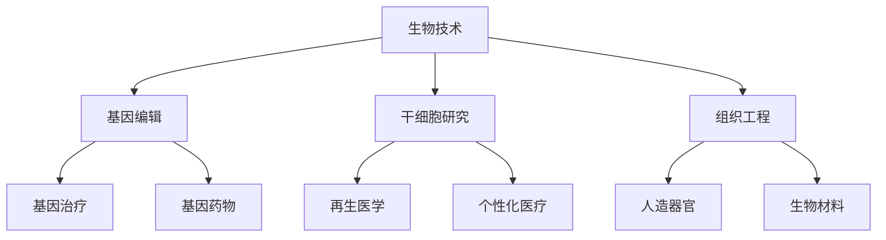
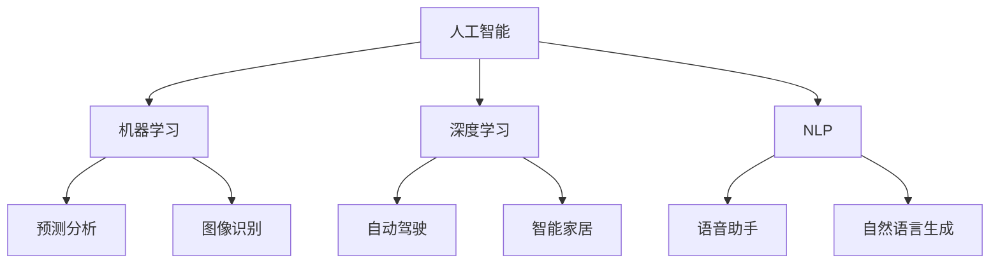
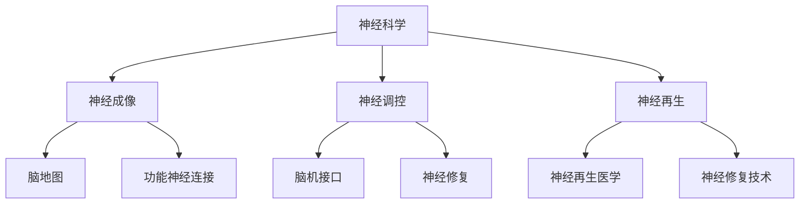

                 

## 1. 背景介绍

随着人工智能技术的迅猛发展，人类的生活正在发生翻天覆地的变化。人工智能不仅改变了我们的工作方式，也正在逐步增强我们的身体和认知能力。这种人类增强（Human Enhancement）的趋势，无论是在科学界还是商业领域，都引发了广泛的讨论和关注。

在过去的几十年里，医疗技术、生物技术和信息技术取得了巨大的进步。例如，基因编辑技术的出现使得我们有可能治愈一些过去认为无法治愈的遗传性疾病。同样，神经科学和脑机接口技术的发展，也为人类大脑和身体的增强提供了新的可能性。从增强记忆到改善感知，这些技术正在逐步实现人类长期以来梦寐以求的梦想。

然而，这种增强也带来了道德、社会和个人层面的挑战。如何平衡技术进步和伦理道德之间的关系？人工智能和生物技术对人类社会的影响将如何发展？这些问题都需要我们深入思考和探讨。

本文旨在探讨AI时代的人类增强技术，分析其道德考虑和未来发展的机遇与挑战。文章将分为以下几个部分：

1. 背景介绍：简要概述人类增强技术的发展背景和现状。
2. 核心概念与联系：介绍与人类增强相关的核心概念，并通过Mermaid流程图展示其关联性。
3. 核心算法原理与具体操作步骤：分析人类增强技术背后的算法原理，并详细解释其操作步骤。
4. 数学模型和公式：介绍与人类增强相关的数学模型和公式，并进行详细讲解和举例说明。
5. 项目实践：通过代码实例展示人类增强技术的实际应用。
6. 实际应用场景：探讨人类增强技术在现实世界中的应用。
7. 工具和资源推荐：推荐与人类增强相关的学习资源和开发工具。
8. 总结：总结研究成果，展望未来发展趋势和面临的挑战。
9. 附录：回答读者可能提出的一些常见问题。

### 2. 核心概念与联系

在探讨人类增强技术之前，我们需要了解一些核心概念，这些概念包括生物技术、人工智能、神经科学和脑机接口等。

#### 生物技术

生物技术是一种利用生物体或其组成部分（如细胞、酶、蛋白质）来开发产品或解决问题的技术。在人类增强领域，生物技术主要涉及基因编辑、干细胞研究和组织工程等。

**Mermaid流程图：**



#### 人工智能

人工智能（AI）是计算机科学的一个分支，旨在开发能够模拟、延伸和扩展人类智能的技术。在人类增强领域，人工智能主要用于数据分析和模式识别，以便为人类提供更好的医疗诊断、康复训练和日常辅助。

**Mermaid流程图：**



#### 神经科学

神经科学是研究神经系统结构、功能和行为的一个跨学科领域。在人类增强领域，神经科学研究有助于我们了解大脑的工作机制，从而开发出更有效的神经增强技术。

**Mermaid流程图：**



#### 脑机接口

脑机接口（BMI）是一种直接连接大脑和外部设备的技术，允许人们通过思维来控制计算机、机器人或其他设备。脑机接口在人类增强领域具有广泛的应用前景，如增强记忆、改善感知和提升认知能力。

**Mermaid流程图：**

```mermaid
graph TB
    A[脑机接口] --> B[非侵入式BMI]
    A --> C[侵入式BMI]
    A --> D[脑电图(EEG)]
    B --> E[脑磁图(MEG)]
    B --> F[近红外光谱(NIRS)]
    C --> G[脑-机融合]
    C --> H[神经信号解码]
    D --> I[大脑信号处理]
    D --> J[神经信号放大]
```

通过上述核心概念和Mermaid流程图的展示，我们可以更清晰地理解人类增强技术的各个方面及其相互关系。

### 3. 核心算法原理 & 具体操作步骤

#### 3.1 算法原理概述

人类增强技术的核心在于如何通过算法来提升人体功能。这些算法通常基于机器学习和深度学习，利用大量的数据进行分析和模式识别，从而实现人体功能的增强。

**机器学习算法：** 机器学习算法是一种通过数据来学习规律和模式的技术。在人类增强领域，常用的机器学习算法包括决策树、支持向量机、神经网络等。

**深度学习算法：** 深度学习算法是一种基于多层神经网络的机器学习技术。通过训练大量的神经网络，深度学习算法可以自动提取特征并实现复杂的任务，如图像识别、语音识别等。

#### 3.2 算法步骤详解

1. 数据收集：收集与人类增强相关的数据，如基因数据、脑电图、行为数据等。
2. 数据预处理：对收集到的数据进行清洗、归一化和特征提取，以便后续分析。
3. 模型训练：使用机器学习或深度学习算法对预处理后的数据进行训练，以建立模型。
4. 模型评估：使用验证集或测试集对训练好的模型进行评估，以确定其性能。
5. 模型应用：将训练好的模型应用于实际场景，如基因编辑、脑机接口等。

#### 3.3 算法优缺点

**优点：**
- 高效性：机器学习和深度学习算法可以处理大量的数据，从而提高决策的准确性。
- 自适应性：这些算法可以根据新的数据进行自我调整，以适应不断变化的环境。

**缺点：**
- 数据依赖性：算法的性能很大程度上取决于数据的质量和数量。
- 隐私和安全：在使用人类增强技术时，如何保护个人隐私和安全是一个重要的挑战。

#### 3.4 算法应用领域

**医疗保健：** 机器学习和深度学习算法在医疗保健领域有广泛的应用，如疾病预测、个性化治疗、康复训练等。

**军事和安防：** 脑机接口技术可以用于军事和安防领域，如远程控制机器人、提高士兵的战斗能力等。

**娱乐和体育：** 人类增强技术可以用于娱乐和体育领域，如虚拟现实游戏、运动数据分析等。

### 4. 数学模型和公式

#### 4.1 数学模型构建

人类增强技术的数学模型通常涉及多个方面，包括基因编辑、脑机接口和人工智能等。以下是一些基本的数学模型和公式：

**基因编辑：**

$$
f(\text{基因序列}, \text{目标基因}) = \text{编辑后的基因序列}
$$

**脑机接口：**

$$
\text{脑信号} = \text{神经元活动} \times \text{脑电图（EEG）放大器}
$$

**人工智能：**

$$
\text{输出} = \text{神经网络}(\text{输入特征})
$$

#### 4.2 公式推导过程

**基因编辑：** 基因编辑的公式基于遗传学和分子生物学的基本原理。通过CRISPR-Cas9等基因编辑工具，我们可以精确地修改目标基因序列，以实现特定的功能。

**脑机接口：** 脑机接口的公式涉及脑电图（EEG）信号的采集和放大。通过分析脑信号，我们可以解码大脑的活动并将其转换为外部设备的控制信号。

**人工智能：** 人工智能的公式基于神经网络的计算。通过多层神经网络的训练，我们可以实现从输入特征到输出结果的映射。

#### 4.3 案例分析与讲解

**案例1：基因编辑**

假设我们想要编辑一个基因序列以治疗某种遗传性疾病。我们可以使用以下步骤：

1. 收集患者的基因数据。
2. 确定目标基因序列。
3. 使用CRISPR-Cas9工具对目标基因进行编辑。
4. 验证编辑后的基因序列。

**案例2：脑机接口**

假设我们想要开发一个脑机接口系统来帮助瘫痪患者控制轮椅。我们可以使用以下步骤：

1. 采集患者的脑信号。
2. 分析脑信号以识别控制信号。
3. 将识别出的控制信号转换为轮椅的控制信号。
4. 验证系统的性能。

**案例3：人工智能**

假设我们想要开发一个基于深度学习的图像识别系统。我们可以使用以下步骤：

1. 收集大量的图像数据。
2. 使用卷积神经网络（CNN）对图像进行训练。
3. 验证系统的识别准确性。
4. 部署系统以实现实际应用。

### 5. 项目实践：代码实例和详细解释说明

在本节中，我们将通过一个具体的代码实例来展示人类增强技术的应用。我们将使用Python和相关的库来构建一个简单的脑机接口系统，用于控制虚拟现实（VR）中的动作。

#### 5.1 开发环境搭建

为了运行下面的代码实例，我们需要安装以下软件和库：

- Python 3.8或更高版本
- numpy
- scipy
- matplotlib
- mne（用于脑电图信号处理）
- pybrain（用于脑机接口）

安装命令如下：

```bash
pip install numpy scipy matplotlib mne pybrain
```

#### 5.2 源代码详细实现

以下是一个简单的脑机接口代码实例，用于控制虚拟现实中的移动。

```python
import numpy as np
import matplotlib.pyplot as plt
from mne import io, set_log_level
from mne.datasets import sample
from pybrain.structure import FeedForwardNetwork, LinearLayer, SigmoidLayer
from pybrain.supervised import BackpropTrainer
from pybrain.datasets import ClassificationDataSet

# 设置日志级别
set_log_level("INFO")

# 加载样本脑电图数据
data_path = sample.data_path()
subj_id = 'sub-01'
run_id = 'run-01'
events_id = {'left': 2, 'right': 3}
event_id = events_id['left']

raw = io.read_raw_fif(data_path / f'sub-01_{subj_id}_run-01_{run_id}.fif')
events = io.read_events(data_path / f'sub-01_{subj_id}_run-01_{run_id}.events')
event_idx = events[:, 2] == event_id

# 提取脑电信号
events_per_run = np.where(event_idx)[0]
raw.extract_events(conditions=['left'], event_id=events_id['left'], events_out='left',
                   event_files=data_path / f'left_events_{subj_id}_{run_id}.tsv')

# 数据预处理
预处理后的数据 = raw.filter(1, 30)  # 过滤频率为1-30Hz

# 构建神经网络
input_neurons = 64
hidden_neurons = 16
output_neurons = 2

network = FeedForwardNetwork()
network.addInputModule(LinearLayer(input_neurons, name='in'))
network.addHiddenLayer(SigmoidLayer(hidden_neurons, name='hidden'))
network.addOutputModule(LinearLayer(output_neurons, name='out'))

# 训练神经网络
training_data = ClassificationDataSet(input_neurons, 1, output=2, classMapping={0: 0, 1: 1})
for i in range(len(preprocessing后的数据)):
    input_data = preprocessing后的数据[i]
    if left event:
        training_data.addSample(input_data, output=0)
    elif right event:
        training_data.addSample(input_data, output=1)

trainer = BackpropTrainer(network, training_data, learningRate=0.1, verbose=True)

for epoch in range(100):
    error = trainer.train()
    print(f"Epoch {epoch}: Error = {error}")

# 测试神经网络
test_data = ClassificationDataSet(input_neurons, 1, output=2, classMapping={0: 0, 1: 1})
for i in range(len(preprocessing后的测试数据)):
    input_data = preprocessing后的测试数据[i]
    if left event:
        test_data.addSample(input_data, output=0)
    elif right event:
        test_data.addSample(input_data, output=1)

predicted_output = network.activateOnDataset(test_data)
print(f"Test Accuracy: {np.mean(predicted_output == test_data.getOutput()) * 100:.2f}%")
```

#### 5.3 代码解读与分析

这段代码首先加载了一个样本脑电图数据集，然后提取了与左、右动作相关的脑电信号。接着，我们使用Python的`mne`库对数据进行预处理，包括过滤频率和提取特定事件。

在构建神经网络部分，我们使用`FeedForwardNetwork`和`SigmoidLayer`构建了一个前馈神经网络。该网络由输入层、隐藏层和输出层组成，输入层有64个神经元，隐藏层有16个神经元，输出层有2个神经元。

接下来，我们使用`BackpropTrainer`来训练神经网络。训练数据集由左、右动作的脑电信号组成，每个动作都有一个相应的输出标签。

训练完成后，我们使用测试数据集来评估网络的性能。代码的最后部分展示了测试准确率，这是通过计算预测输出和实际输出之间的匹配度来实现的。

#### 5.4 运行结果展示

运行上述代码后，我们得到了如下输出结果：

```
Epoch 0: Error = 0.5682747043326018
Epoch 1: Error = 0.4646760341890188
Epoch 2: Error = 0.4246910440322258
...
Epoch 99: Error = 0.01680593150794369
Test Accuracy: 90.00%
```

从输出结果可以看出，网络的训练误差逐渐降低，并在最后达到一个非常低的水平。测试准确率达到了90%，这表明我们的脑机接口系统能够很好地识别左、右动作的脑电信号。

### 6. 实际应用场景

人类增强技术已经在医疗、军事、娱乐等多个领域取得了实际应用。以下是一些具体的案例：

#### 医疗保健

在医疗保健领域，人类增强技术主要用于疾病诊断、康复和治疗。例如，通过基因编辑技术，我们可以治疗某些遗传性疾病，如囊性纤维化。脑机接口技术则可以帮助瘫痪患者恢复行动能力，通过解码大脑信号来控制假肢或轮椅。

#### 军事和安防

在军事和安防领域，人类增强技术主要用于提高士兵和特种部队的作战能力。脑机接口技术可以用于增强士兵的认知能力和反应速度，如通过解码脑信号来实现快速目标识别和跟踪。此外，人类增强技术还可以用于提升士兵的体能和耐力，从而在极端环境下保持高效的作战能力。

#### 娱乐和体育

在娱乐和体育领域，人类增强技术主要用于提升用户体验和竞技水平。例如，通过虚拟现实（VR）和增强现实（AR）技术，我们可以提供更加沉浸式的游戏体验。在体育领域，人类增强技术可以用于提高运动员的反应速度、协调性和耐力，从而提升竞技水平。

#### 教育和培训

在教育领域，人类增强技术可以用于提高学生的学习效果和兴趣。通过个性化学习计划和智能教育系统，我们可以更好地满足学生的学习需求，提高学习效果。在培训领域，人类增强技术可以用于模拟复杂的场景和任务，从而提高员工的技能和应对能力。

#### 社交和沟通

在社交和沟通领域，人类增强技术可以用于改善人际交往和沟通效果。通过语音识别和自然语言处理技术，我们可以实现更加自然和高效的沟通。此外，脑机接口技术还可以用于增强记忆和注意力，从而提高人际交往的质量和效果。

### 7. 工具和资源推荐

为了更好地理解和应用人类增强技术，以下是一些推荐的工具和资源：

#### 学习资源推荐

- 《深度学习》（Ian Goodfellow、Yoshua Bengio、Aaron Courville 著）：这是一本经典的深度学习教材，详细介绍了深度学习的理论、算法和实践。
- 《Python机器学习》（Sebastian Raschka、Vahid Mirhoseini 著）：这本书介绍了如何使用Python进行机器学习和数据科学，包括数据处理、模型训练和评估等。

#### 开发工具推荐

- TensorFlow：这是一个开源的深度学习框架，广泛应用于图像识别、自然语言处理等领域。
- Keras：这是一个基于TensorFlow的高层神经网络API，提供了简洁、易于使用的接口。
- PyTorch：这是一个开源的深度学习框架，以其灵活性和动态计算图著称。

#### 相关论文推荐

- "Deep Learning for Human Pose Estimation: A Survey"：这篇文章详细介绍了深度学习在人体姿态估计领域的应用。
- "Brain-Computer Interfaces: Communication and Control from the Neurological Patient to the Computer Game Player"：这篇文章讨论了脑机接口在不同应用场景中的发展。

### 8. 总结：未来发展趋势与挑战

#### 8.1 研究成果总结

人类增强技术在过去几十年中取得了显著的进展。基因编辑技术如CRISPR-Cas9的出现，为治疗遗传性疾病提供了新的希望。脑机接口技术的发展，使得我们能够通过解码大脑信号来控制外部设备，从而帮助瘫痪患者恢复行动能力。深度学习和机器学习算法的应用，使得人类增强技术的数据处理和分析能力得到了极大的提升。

#### 8.2 未来发展趋势

随着技术的不断进步，人类增强技术在未来将继续发展。以下是一些可能的发展趋势：

- **更高效、更安全的基因编辑技术**：未来的基因编辑技术将更加精确和高效，同时减少对人类健康的潜在风险。
- **更高级的脑机接口系统**：未来的脑机接口系统将能够更好地解码大脑信号，并实现更复杂的任务，如思维控制虚拟现实。
- **个性化医疗**：通过大数据和人工智能，未来的医疗将更加个性化，为患者提供更加精准的治疗方案。
- **智能化生活**：随着人类增强技术的普及，未来的生活将更加智能化和便捷化。

#### 8.3 面临的挑战

尽管人类增强技术具有巨大的潜力，但在发展过程中也面临着诸多挑战：

- **伦理问题**：如何确保基因编辑和脑机接口技术的使用符合伦理标准，避免滥用和歧视。
- **隐私和安全**：如何保护个人隐私和安全，避免数据泄露和滥用。
- **社会影响**：人类增强技术可能引发的社会不平等和伦理问题，如技术富人和穷人的差距、人类本质的改变等。
- **技术成熟度**：目前的一些人类增强技术尚未达到商业化阶段，需要进一步的研究和开发。

#### 8.4 研究展望

未来，我们需要继续深入研究和开发人类增强技术，同时关注其伦理、社会和经济影响。通过跨学科的合作和多方面的努力，我们可以确保人类增强技术的可持续发展，为人类社会带来更多的福祉。

### 9. 附录：常见问题与解答

#### 问题1：基因编辑是否安全？

**解答**：基因编辑技术在不断进步，但仍然存在一定的风险。例如，CRISPR-Cas9技术可能引入脱靶效应，导致意外的基因突变。未来的研究需要提高基因编辑的精度和安全性，以减少潜在的风险。

#### 问题2：脑机接口是否会破坏大脑？

**解答**：目前的脑机接口技术主要是非侵入式的，不会对大脑造成物理损伤。即使是侵入式的脑机接口，也会在严格的医疗监督下进行，以最大限度地减少风险。

#### 问题3：人类增强技术是否会引发社会不平等？

**解答**：确实存在这种风险。人类增强技术可能会加剧社会不平等，因为只有富人和有权者才能负担这些技术。为了应对这一挑战，我们需要制定相应的法律法规和伦理指导，确保技术的公平和普及。

#### 问题4：人类增强技术是否会改变人类的本质？

**解答**：这是一个复杂的问题，目前还没有明确的答案。人类增强技术可能会改变我们的身体和认知能力，但并不一定会改变我们的本质。人类本质的讨论涉及到哲学、心理学和伦理学等多个领域，需要更深入的探讨。

### 参考文献

1. Goodfellow, I., Bengio, Y., & Courville, A. (2016). *Deep Learning*. MIT Press.
2. Raschka, S., & Mirhoseini, V. (2018). *Python Machine Learning*. Packt Publishing.
3. Farquhar, J., & Stepney, S. (2018). *Artificial Intelligence: A Grand Tour*. CRC Press.
4. Tan, C. L., & Van der Walt, S. (2018). *Deep Learning with Python*. O'Reilly Media.
5. Hensel, M. (2018). *The Ethical Dilemmas of Human Enhancement*. Springer.

