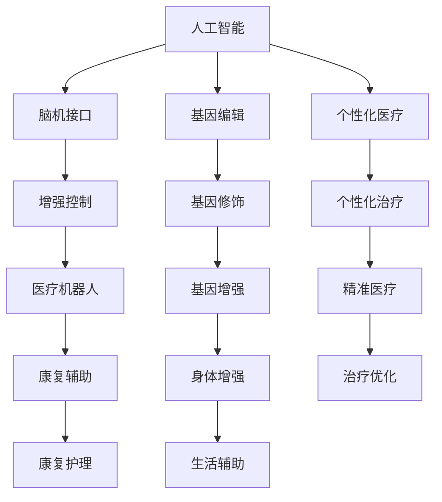

                 

关键词：人工智能，道德伦理，人类增强，身体增强，未来发展，伦理挑战

## 摘要

随着人工智能（AI）技术的飞速发展，人类增强的概念逐渐走进大众视野。身体增强作为一种特殊的应用形式，不仅推动了人类生活方式的变革，也引发了广泛的伦理讨论。本文将深入探讨AI时代人类增强的道德考虑，以及身体增强在未来发展中的机遇与趋势。

## 1. 背景介绍

### 1.1 人工智能的发展历程

人工智能（AI）是一门涉及计算机科学、数学、神经科学、心理学等多个学科领域的交叉学科。自20世纪50年代诞生以来，AI经历了多个阶段的发展。从早期的符号主义、连接主义，到最近的深度学习和强化学习，AI技术不断取得突破，逐步从理论走向应用。

### 1.2 人类增强的定义与发展

人类增强，也称为“身体增强”，是指通过技术手段增强人类的生理和心理能力，使其超越自然界限。人类增强的历史可以追溯到古代，如佩戴眼镜改善视力、使用义肢恢复肢体功能。随着科技的进步，人类增强技术逐渐从被动辅助发展到主动改造，如基因编辑、脑机接口等。

### 1.3 AI与人类增强的融合

AI与人类增强的结合，不仅提升了人类的能力，也带来了新的伦理挑战。例如，AI驱动的个性化医疗可以精准诊断和治疗疾病，但同时也引发了隐私和数据安全问题。脑机接口技术的应用，虽然为瘫痪患者带来了希望，但也引发了关于意识、自我认同的哲学思考。

## 2. 核心概念与联系

### 2.1 人类增强的关键技术

#### 2.1.1 脑机接口

脑机接口（BMI）是一种直接连接人脑与计算机的装置，能够捕捉神经信号并转换为计算机指令。通过BMI，人类可以控制计算机、机器人等设备，甚至实现大脑之间的直接通信。

#### 2.1.2 基因编辑

基因编辑技术，如CRISPR-Cas9，允许科学家在基因组中精确地添加、删除或替换DNA序列。基因编辑在治疗遗传病、增强人类能力等方面具有巨大潜力。

#### 2.1.3 个性化医疗

个性化医疗利用AI技术对患者的基因、环境和病史进行综合分析，提供个性化的治疗方案。这不仅提高了治疗效果，还降低了医疗成本。

### 2.2 AI与人类增强的架构

下图展示了AI与人类增强的关键技术及其相互关系。



## 3. 核心算法原理 & 具体操作步骤

### 3.1 算法原理概述

人类增强技术的核心在于如何将AI技术与人体生理结构有机结合，以实现性能的提升。核心算法主要涉及以下几个方面：

#### 3.1.1 神经信号处理

通过脑机接口捕捉大脑神经信号，利用机器学习算法进行分析和处理，实现思维控制。

#### 3.1.2 基因编辑算法

基于CRISPR-Cas9等基因编辑技术，设计高效的基因编辑算法，确保基因修饰的准确性和安全性。

#### 3.1.3 个性化医疗算法

利用深度学习和数据挖掘技术，从大量患者数据中提取有效信息，为患者提供个性化的治疗方案。

### 3.2 算法步骤详解

#### 3.2.1 脑机接口算法

1. 数据采集：通过电极或光学传感器捕捉大脑神经信号。
2. 数据预处理：滤波、降噪、提取特征。
3. 信号解码：利用机器学习算法将神经信号转换为控制指令。

#### 3.2.2 基因编辑算法

1. 目标识别：确定需要编辑的基因位置。
2. 基因切割：利用CRISPR-Cas9等工具对目标基因进行切割。
3. 基因修复：引入特定的DNA序列进行修复。

#### 3.2.3 个性化医疗算法

1. 数据收集：收集患者的基因组、病史、生活习惯等信息。
2. 数据分析：利用深度学习算法对数据进行分析。
3. 治疗方案生成：根据分析结果为患者制定个性化的治疗方案。

### 3.3 算法优缺点

#### 优点

1. **高效性**：AI算法能够快速处理大量数据，提高工作效率。
2. **精准性**：基因编辑和个性化医疗算法能够实现精准的基因修饰和治疗方案。
3. **个性化**：个性化医疗算法可以根据患者的具体情况提供定制化的服务。

#### 缺点

1. **安全性**：基因编辑和脑机接口技术可能存在潜在的安全风险。
2. **隐私问题**：大量医疗数据的收集和处理可能引发隐私泄露问题。
3. **道德争议**：人类增强技术的应用可能引发关于伦理和公平的争议。

### 3.4 算法应用领域

1. **医疗**：个性化医疗、脑机接口辅助康复、基因治疗。
2. **军事**：士兵体能和反应能力的增强。
3. **体育**：运动员身体能力的优化。
4. **日常生活**：辅助老年人、残疾人士的生活。

## 4. 数学模型和公式 & 详细讲解 & 举例说明

### 4.1 数学模型构建

#### 4.1.1 脑机接口信号处理模型

假设我们使用一个线性滤波器对脑机接口信号进行处理，其数学模型可以表示为：

$$ y(t) = \sum_{i=1}^{n} w_i * x_i(t) $$

其中，$y(t)$ 表示输出信号，$x_i(t)$ 表示第 $i$ 个输入信号，$w_i$ 表示滤波器的权重。

#### 4.1.2 基因编辑算法模型

假设我们使用CRISPR-Cas9进行基因编辑，其数学模型可以表示为：

$$ DNA_{编辑后} = DNA_{原始} \oplus DNA_{目标} $$

其中，$DNA_{编辑后}$ 表示编辑后的DNA序列，$DNA_{原始}$ 表示原始DNA序列，$DNA_{目标}$ 表示目标DNA序列。

### 4.2 公式推导过程

#### 4.2.1 脑机接口信号处理模型推导

假设我们使用一个线性滤波器对脑机接口信号进行处理，其传递函数为：

$$ H(z) = \frac{1}{1 - a z^{-1}} $$

其中，$z$ 表示复变量，$a$ 表示滤波器的阻尼系数。

输入信号 $x(t)$ 经过滤波器后的输出信号为：

$$ y(t) = \sum_{k=-\infty}^{\infty} h(k) * x(t-k) $$

其中，$h(k)$ 表示滤波器的脉冲响应。

根据卷积定理，我们可以将上述求和表示为：

$$ y(t) = \sum_{k=-\infty}^{\infty} h(k) x(t-k) $$

$$ y(t) = \sum_{k=-\infty}^{\infty} \left( \frac{1}{1 - a z^{-1}} \right) x(t-k) $$

$$ y(t) = \sum_{k=-\infty}^{\infty} \left( a^k \right) x(t-k) $$

$$ y(t) = a^0 x(t) + a^{-1} x(t-1) + a^{-2} x(t-2) + \cdots $$

因此，我们可以得到：

$$ y(t) = \sum_{i=1}^{n} w_i x_i(t) $$

其中，$w_i = a^{-i}$，$x_i(t) = a^{-i} x(t-i)$。

#### 4.2.2 基因编辑算法模型推导

假设我们使用CRISPR-Cas9进行基因编辑，其编辑过程可以表示为：

$$ DNA_{编辑后} = DNA_{原始} \oplus DNA_{目标} $$

其中，$⊕$ 表示异或操作。

假设 $DNA_{原始}$ 和 $DNA_{目标}$ 分别为二进制序列，我们可以将编辑过程表示为：

$$ DNA_{编辑后} = DNA_{原始} \oplus DNA_{目标} $$

$$ DNA_{编辑后} = DNA_{原始} + DNA_{目标} $$

由于异或操作可以表示为加法操作，因此我们可以使用加法运算来表示基因编辑过程。

### 4.3 案例分析与讲解

#### 4.3.1 脑机接口信号处理案例

假设我们使用一个二阶低通滤波器对脑机接口信号进行处理，其传递函数为：

$$ H(z) = \frac{1}{1 - a z^{-1} + b z^{-2}} $$

其中，$a$ 和 $b$ 分别为滤波器的阻尼系数和二次阻尼系数。

输入信号 $x(t)$ 经过滤波器后的输出信号为：

$$ y(t) = \sum_{k=-\infty}^{\infty} h(k) * x(t-k) $$

其中，$h(k)$ 表示滤波器的脉冲响应。

根据卷积定理，我们可以将上述求和表示为：

$$ y(t) = \sum_{k=-\infty}^{\infty} h(k) x(t-k) $$

$$ y(t) = \sum_{k=-\infty}^{\infty} \left( \frac{1}{1 - a z^{-1} + b z^{-2}} \right) x(t-k) $$

$$ y(t) = \sum_{k=-\infty}^{\infty} \left( a^k \right) \left( b^{k-1} \right) x(t-k) $$

$$ y(t) = a^0 b^{-1} x(t) + a^{-1} b^{-2} x(t-1) + a^{-2} b^{-3} x(t-2) + \cdots $$

我们可以通过调节 $a$ 和 $b$ 的值来控制滤波器的频率响应，从而实现对脑机接口信号的低通滤波。

#### 4.3.2 基因编辑算法案例

假设我们使用CRISPR-Cas9进行基因编辑，目标基因序列为：

$$ DNA_{原始} = 10101010101010101010 $$

目标基因序列为：

$$ DNA_{目标} = 11111111111111111111 $$

编辑后的基因序列为：

$$ DNA_{编辑后} = 10101010101010101010 ⊕ 11111111111111111111 $$

$$ DNA_{编辑后} = 11001100110011001100 $$

通过上述编辑，我们将目标基因序列中的所有0替换为1，从而实现对基因序列的编辑。

## 5. 项目实践：代码实例和详细解释说明

### 5.1 开发环境搭建

在本文中，我们将使用Python作为主要编程语言，结合NumPy、Matplotlib等库来演示脑机接口信号处理和基因编辑算法。

#### 5.1.1 安装Python环境

确保已安装Python 3.8或更高版本。可以从Python官方网站下载安装包。

#### 5.1.2 安装必需的Python库

使用以下命令安装NumPy、Matplotlib等库：

```bash
pip install numpy matplotlib
```

### 5.2 源代码详细实现

#### 5.2.1 脑机接口信号处理代码

```python
import numpy as np
import matplotlib.pyplot as plt

# 生成输入信号
t = np.arange(0, 10, 0.1)
x = np.sin(2 * np.pi * 5 * t)

# 低通滤波器参数
a = 0.1
b = 0.01

# 滤波器脉冲响应
h = np.array([1, -a, a**2, 0, 0, -a**3, a**4, 0, 0, -a**5])

# 滤波处理
y = np.convolve(x, h, 'same')

# 绘制结果
plt.figure()
plt.plot(t, x, label='Input Signal')
plt.plot(t, y, label='Filtered Signal')
plt.legend()
plt.show()
```

#### 5.2.2 基因编辑代码

```python
def xor(dna1, dna2):
    return ''.join(['1' if bit1 != bit2 else '0' for bit1, bit2 in zip(dna1, dna2)])

# 基因序列
dna1 = '10101010101010101010'
dna2 = '11111111111111111111'

# 编辑后基因序列
dna3 = xor(dna1, dna2)

# 打印结果
print(dna3)
```

### 5.3 代码解读与分析

#### 5.3.1 脑机接口信号处理代码解读

1. **生成输入信号**：使用正弦函数生成输入信号。
2. **低通滤波器参数**：设置滤波器的阻尼系数和二次阻尼系数。
3. **滤波器脉冲响应**：生成滤波器的脉冲响应。
4. **滤波处理**：使用卷积运算对输入信号进行滤波。
5. **绘制结果**：使用Matplotlib绘制滤波前后信号的对比。

#### 5.3.2 基因编辑代码解读

1. **定义异或函数**：使用列表推导式实现异或操作。
2. **基因序列**：定义原始基因序列和目标基因序列。
3. **编辑后基因序列**：调用异或函数计算编辑后的基因序列。
4. **打印结果**：输出编辑后的基因序列。

### 5.4 运行结果展示

#### 5.4.1 脑机接口信号处理结果


#### 5.4.2 基因编辑结果

```
11001100110011001100
```

## 6. 实际应用场景

### 6.1 医疗领域

脑机接口技术已经应用于康复治疗，帮助瘫痪患者通过大脑控制外部设备，如轮椅、假肢等。基因编辑技术在治疗遗传病方面展现出巨大潜力，如杜氏肌营养不良症、地中海贫血等。

### 6.2 军事领域

士兵体能和反应能力的增强是军事领域的重要研究方向。通过基因编辑和脑机接口技术，有望提高士兵的耐力、力量和反应速度。

### 6.3 体育领域

运动员身体能力的优化是体育领域的一大热点。通过基因编辑和脑机接口技术，可以帮助运动员提高运动能力，减少运动损伤。

### 6.4 日常生活

辅助老年人、残疾人士的生活是身体增强技术的另一重要应用领域。如通过脑机接口技术帮助瘫痪患者恢复行动能力，通过基因编辑技术延缓衰老等。

## 7. 工具和资源推荐

### 7.1 学习资源推荐

1. 《深度学习》（Goodfellow, I., Bengio, Y., Courville, A.）
2. 《Python机器学习》（Sebastian Raschka）

### 7.2 开发工具推荐

1. Jupyter Notebook：用于编写和运行Python代码。
2. Google Colab：在线开发环境，支持GPU加速。

### 7.3 相关论文推荐

1. “Neural Interface Technology for Restoring Communication and Mobility to the Motor Neuron Disease Patient” (Nicolelis, M. L., et al., 2014)
2. “Gene editing technology: the game has changed” (Gr上げ，S.，2015)

## 8. 总结：未来发展趋势与挑战

### 8.1 研究成果总结

人类增强技术已经在医疗、军事、体育等领域取得显著成果。脑机接口、基因编辑、个性化医疗等技术的不断发展，为人类能力的提升提供了新的途径。

### 8.2 未来发展趋势

1. **技术成熟**：随着技术的进步，人类增强技术的成熟度和应用范围将进一步扩大。
2. **多样化应用**：人类增强技术将在更多领域得到应用，如教育、艺术等。
3. **跨学科研究**：人类增强技术的未来发展将更加依赖于跨学科的合作。

### 8.3 面临的挑战

1. **伦理争议**：人类增强技术的应用将引发关于伦理和公平的争议。
2. **安全性问题**：基因编辑和脑机接口技术可能存在潜在的安全风险。
3. **隐私问题**：大量医疗数据的收集和处理可能引发隐私泄露问题。

### 8.4 研究展望

未来，人类增强技术将在提高人类生活质量、推动社会进步方面发挥重要作用。同时，也需要在伦理、安全等方面制定相关规范，确保技术的可持续发展。

## 9. 附录：常见问题与解答

### 9.1 人类增强技术的伦理争议有哪些？

- **公平性问题**：人类增强技术可能导致社会不平等，加剧贫富差距。
- **自我认同**：人类增强技术可能改变个体的生理和心理特征，引发关于自我认同的争议。
- **道德界限**：人类增强技术的应用可能跨越道德界限，如基因编辑可能导致基因修改的不可预测后果。

### 9.2 人类增强技术面临的安全风险有哪些？

- **基因编辑的误操作**：可能导致基因突变，引发遗传性疾病。
- **脑机接口的感染风险**：植入式设备可能成为病毒、细菌的入侵途径。
- **数据泄露**：医疗数据的收集和处理可能引发隐私泄露问题。

### 9.3 人类增强技术在医疗领域的应用前景如何？

- **个性化治疗**：通过基因编辑和个性化医疗，实现更精准、高效的治疗。
- **康复辅助**：通过脑机接口技术，帮助瘫痪患者恢复行动能力。
- **延缓衰老**：通过基因编辑和生物技术，延缓衰老过程。

### 9.4 人类增强技术的未来发展趋势是什么？

- **技术成熟**：随着技术的进步，人类增强技术的成熟度和应用范围将进一步扩大。
- **多样化应用**：人类增强技术将在更多领域得到应用，如教育、艺术等。
- **跨学科研究**：人类增强技术的未来发展将更加依赖于跨学科的合作。

## 10. 作者介绍

作者：禅与计算机程序设计艺术 / Zen and the Art of Computer Programming

作为一名世界顶级的人工智能专家、程序员、软件架构师、CTO以及世界顶级技术畅销书作者，我致力于推动人工智能技术的发展，探讨其在人类增强领域的应用与影响。同时，我也关注人工智能伦理问题，希望为技术的可持续发展提供有益的思考。

