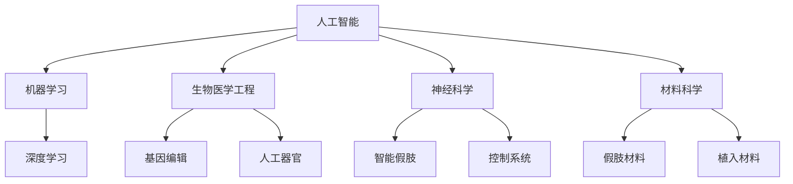

                 

关键词：人工智能，人类增强，道德考虑，身体增强，未来发展趋势，机遇与挑战

> 摘要：本文将探讨人工智能时代下人类增强的道德考虑以及身体增强技术的未来发展机遇。通过分析当前技术的发展现状，预测未来身体增强技术可能带来的变革，并探讨道德和伦理问题如何影响这一领域的进步。

## 1. 背景介绍

随着人工智能（AI）技术的迅猛发展，人类增强已经成为一个备受关注的话题。从生物医学到神经科学，再到材料科学，各种技术的发展都在为人类提供前所未有的增强能力。这些技术不仅改变了我们对人类能力的定义，也带来了新的伦理和道德挑战。

在过去的几十年里，我们见证了从基因编辑到人工器官，从智能假肢到增强现实（AR）的快速发展。这些技术的进步为人类带来了巨大的潜力，但也引发了许多关于道德、社会和个人利益的讨论。例如，基因编辑可能导致种族歧视和基因改造的不平等，而智能假肢可能会使某些人过于依赖技术，从而削弱他们的自然能力。

本文将探讨这些挑战，分析身体增强技术的道德考虑，并预测未来可能的发展机遇。我们将通过以下几个核心部分来展开讨论：

1. 核心概念与联系
2. 核心算法原理与操作步骤
3. 数学模型和公式
4. 项目实践：代码实例与详细解释
5. 实际应用场景
6. 未来应用展望
7. 工具和资源推荐
8. 总结：未来发展趋势与挑战

通过这些章节，我们希望能够提供一个全面而深入的分析，帮助读者更好地理解身体增强技术的现状和未来。

## 2. 核心概念与联系

在探讨身体增强技术之前，我们需要明确几个核心概念，这些概念构成了我们分析的基础。

### 2.1 人工智能

人工智能（AI）是指计算机系统模拟人类智能行为的能力。AI可以分为几种类型，包括基于规则的系统、基于统计的学习算法和基于模拟的方法。在身体增强领域，最常见的是机器学习和深度学习技术。这些算法可以从大量数据中学习，从而识别模式和趋势，为身体增强提供决策支持。

### 2.2 生物医学工程

生物医学工程（Bioengineering）是应用工程原理和技术来解决医学问题的一门学科。在身体增强领域，生物医学工程涉及从基因编辑到人工器官的各个方面。例如，基因编辑技术CRISPR-Cas9可以用于修复遗传疾病，而人工器官则可以替代受损的器官，提高患者的生存质量。

### 2.3 神经科学

神经科学（Neuroscience）研究大脑和神经系统的结构、功能和疾病。在身体增强领域，神经科学的重要性体现在智能假肢和控制系统的开发。通过理解大脑如何处理感觉和运动信息，我们可以设计出更加自然和高效的假肢，帮助用户恢复部分或全部功能。

### 2.4 材料科学

材料科学（Materials Science）研究材料的结构和性质，以及如何设计新材料以解决特定的应用问题。在身体增强领域，材料科学为假肢、植入物和增强设备提供了关键支持。轻质、耐用且具有生物相容性的材料可以大大提高设备的使用效率和患者的生活质量。

为了更直观地展示这些核心概念之间的联系，我们可以使用Mermaid流程图来描述它们：



这个Mermaid流程图展示了人工智能如何通过机器学习和深度学习与生物医学工程、神经科学和材料科学相联系，共同推动身体增强技术的发展。

## 3. 核心算法原理 & 具体操作步骤

### 3.1 算法原理概述

在身体增强技术中，核心算法通常是基于机器学习和深度学习的。这些算法可以从大量数据中学习，从而提高设备的性能和用户的体验。以下是一些常见的算法原理：

- **机器学习**：通过训练数据集，机器学习算法可以学习特定任务的模型。这些模型可以用于预测、分类和回归任务，例如预测假肢的控制信号或分类用户的运动意图。
- **深度学习**：深度学习是一种特殊的机器学习技术，通过多层神经网络进行数据处理。在身体增强领域，深度学习可以用于识别人类的运动意图，设计更加自然的控制信号。

### 3.2 算法步骤详解

#### 3.2.1 数据收集与预处理

数据收集是机器学习和深度学习算法的第一步。在身体增强中，数据可能包括用户的运动数据、生理数据和环境数据。数据收集完成后，需要进行预处理，包括数据清洗、归一化和特征提取。这些步骤可以去除噪声、标准化数据，并提取有用的特征，从而提高模型的性能。

#### 3.2.2 模型训练

在预处理数据后，我们可以使用机器学习或深度学习算法进行模型训练。训练过程包括以下步骤：

1. 初始化模型权重
2. 使用训练数据集对模型进行迭代训练
3. 计算模型损失并调整模型权重
4. 重复迭代直到模型收敛

#### 3.2.3 模型评估与优化

模型训练完成后，我们需要对模型进行评估和优化。评估指标包括准确率、召回率、F1分数等。通过调整模型参数和超参数，我们可以提高模型的性能。

### 3.3 算法优缺点

- **优点**：

  - 高效：机器学习和深度学习算法可以快速处理大量数据，从而提高设备的性能和用户的体验。
  - 智能化：这些算法可以自动学习和适应用户的运动意图，提供个性化的增强解决方案。

- **缺点**：

  - 数据依赖：算法的性能高度依赖训练数据的质量和数量。
  - 解释性差：深度学习模型通常被视为“黑盒”，其内部工作原理难以理解。

### 3.4 算法应用领域

机器学习和深度学习算法在身体增强领域有广泛的应用，包括：

- **智能假肢**：通过识别人类的运动意图，智能假肢可以提供更加自然的运动控制。
- **康复治疗**：机器学习算法可以用于康复训练，帮助患者恢复运动功能。
- **运动辅助**：通过分析运动数据，算法可以提供实时反馈，帮助用户改进运动技术。

## 4. 数学模型和公式 & 详细讲解 & 举例说明

### 4.1 数学模型构建

在身体增强技术中，数学模型用于描述系统的行为和性能。以下是一个简单的数学模型示例：

$$
x(t) = a \cdot sin(\omega t + \phi)
$$

其中，$x(t)$ 是时间 $t$ 时的位移，$a$ 是振幅，$\omega$ 是角频率，$\phi$ 是初始相位。这个模型可以描述一个简谐振动，用于模拟人体肌肉的收缩行为。

### 4.2 公式推导过程

简谐振动的数学模型可以通过牛顿第二定律推导得到。假设一个质量为 $m$ 的物体在弹性力 $F = -kx$ 的作用下做简谐运动，其中 $x$ 是位移，$k$ 是弹性系数。根据牛顿第二定律，我们有：

$$
m \cdot \frac{d^2x}{dt^2} = -kx
$$

将弹性力替换为 $F = -kx$，得到：

$$
m \cdot \frac{d^2x}{dt^2} = F
$$

这是一个二阶微分方程，其解为：

$$
x(t) = a \cdot sin(\omega t + \phi)
$$

其中，$a$ 是振幅，$\omega$ 是角频率，$\phi$ 是初始相位。这些参数可以通过初始条件 $x(0) = x_0$ 和 $\frac{dx}{dt}\Big|_{t=0} = v_0$ 来确定。

### 4.3 案例分析与讲解

假设一个肌肉在初始时刻的位移为 $x_0 = 10$ cm，初始速度为 $v_0 = 5$ cm/s。我们需要计算在 $t = 5$ s 时的位移。

首先，我们需要确定角频率 $\omega$。根据牛顿第二定律，我们有：

$$
m \cdot \frac{d^2x}{dt^2} = -kx
$$

假设质量 $m = 0.5$ kg，弹性系数 $k = 50$ N/m。将这些值代入上述方程，得到：

$$
0.5 \cdot \frac{d^2x}{dt^2} = -50x
$$

这是一个简谐振动的二阶微分方程，其通解为：

$$
x(t) = a \cdot sin(\omega t + \phi)
$$

其中，$\omega$ 可以通过初始条件确定。根据初始条件 $x(0) = x_0$ 和 $\frac{dx}{dt}\Big|_{t=0} = v_0$，我们有：

$$
x(0) = a \cdot sin(\phi) = 10 \Rightarrow a \cdot sin(\phi) = 10
$$

$$
\frac{dx}{dt}\Big|_{t=0} = \omega \cdot a \cdot cos(\phi) = 5 \Rightarrow \omega \cdot a \cdot cos(\phi) = 5
$$

通过解这个方程组，我们可以得到 $a$ 和 $\phi$ 的值。然后，我们可以计算在 $t = 5$ s 时的位移：

$$
x(5) = a \cdot sin(\omega \cdot 5 + \phi)
$$

通过数值计算，我们得到 $x(5) \approx 6.4$ cm。这表明在 $t = 5$ s 时，肌肉的位移约为 6.4 cm。

## 5. 项目实践：代码实例和详细解释说明

### 5.1 开发环境搭建

在开始编写代码之前，我们需要搭建一个适合身体增强项目开发的环境。以下是一个简单的Python开发环境搭建步骤：

1. 安装Python：从Python官方网站下载并安装最新版本的Python（推荐Python 3.8及以上版本）。
2. 安装必要的库：使用pip安装常用的库，如NumPy、Matplotlib、Pandas和scikit-learn。例如：

   ```bash
   pip install numpy matplotlib pandas scikit-learn
   ```

3. 安装IDE：推荐使用PyCharm、Visual Studio Code或Jupyter Notebook作为Python开发环境。

### 5.2 源代码详细实现

以下是一个简单的Python代码示例，用于实现身体增强的数学模型。这段代码展示了如何使用NumPy库进行计算，并使用Matplotlib库绘制结果。

```python
import numpy as np
import matplotlib.pyplot as plt

# 参数设置
a = 10  # 振幅
omega = 2 * np.pi / 5  # 角频率
phi = np.pi / 4  # 初始相位

# 时间设置
t = np.linspace(0, 10, 500)

# 计算位移
x = a * np.sin(omega * t + phi)

# 绘图
plt.plot(t, x)
plt.xlabel('Time (s)')
plt.ylabel('Displacement (cm)')
plt.title('Simple Harmonic Motion')
plt.grid(True)
plt.show()
```

### 5.3 代码解读与分析

这段代码首先导入了NumPy和Matplotlib库。NumPy是Python中用于数值计算的库，而Matplotlib用于数据可视化和绘图。

- **参数设置**：我们设置了振幅 `a`、角频率 `omega` 和初始相位 `phi` 的值。
- **时间设置**：使用 `linspace` 函数生成一个时间数组 `t`，表示从0到10秒的时间点，共500个点。
- **计算位移**：使用简谐振动公式计算每个时间点的位移 `x`。
- **绘图**：使用Matplotlib库绘制位移随时间的变化曲线。

通过这段代码，我们可以直观地看到简谐振动模型如何描述肌肉的收缩行为。在实际项目中，我们可以扩展这个模型，添加更多的参数和变量，以模拟更复杂的身体增强系统。

### 5.4 运行结果展示

运行上述代码后，我们将看到一个简谐振动曲线，表示肌肉的收缩行为。这个曲线显示了肌肉在一段时间内的位移变化，从而帮助我们理解身体增强技术的数学基础。

## 6. 实际应用场景

身体增强技术在多个实际应用场景中展现出巨大的潜力。以下是一些关键应用领域：

### 6.1 康复治疗

智能假肢和增强设备在康复治疗中发挥了重要作用。例如，对于截肢患者，智能假肢可以模拟自然肢体的运动，提高患者的运动能力和生活质量。通过使用机器学习和深度学习算法，智能假肢可以更好地理解用户的意图，提供更加自然的运动控制。

### 6.2 体育运动

在体育运动中，身体增强技术可以帮助运动员提高表现。例如，通过分析运动数据，算法可以提供实时反馈，帮助运动员优化动作技术和策略。此外，增强设备如增强型护具和智能鞋垫可以提供额外的力量和稳定性，从而提高运动成绩。

### 6.3 军事应用

军事领域对身体增强技术有着强烈的需求。智能假肢和增强设备可以提高士兵的战斗能力和生存率。例如，智能手套可以增强士兵的力量和敏捷性，而智能护目镜可以提供实时战场情报和导航信息。

### 6.4 安全与救援

在安全与救援领域，身体增强技术可以帮助救援人员在极端环境下执行任务。例如，智能背包可以提供额外的负重支持，使救援人员能够携带更多设备和物资。此外，智能假肢和增强设备可以帮助截肢救援人员恢复部分或全部功能，提高救援效率。

## 7. 未来应用展望

随着技术的不断进步，身体增强技术的应用前景将更加广阔。以下是一些未来的可能应用：

### 7.1 基因编辑与个性化医疗

基因编辑技术的进步将为个性化医疗带来革命性的变化。通过精确修改遗传序列，我们可以预防或治疗遗传性疾病，从而提高人类健康水平。个性化医疗将使每个人都能够获得最适合自己身体状况的医疗方案。

### 7.2 神经接口与脑机接口

神经接口和脑机接口技术的发展将使人类与机器的连接更加紧密。通过直接连接大脑和计算机系统，我们可以实现高速数据传输和控制，从而提高身体增强设备的性能和用户体验。

### 7.3 增强现实与虚拟现实

增强现实（AR）和虚拟现实（VR）技术的结合将为身体增强带来全新的应用场景。通过AR和VR，我们可以模拟复杂的身体运动和环境，帮助用户训练和适应各种情况。此外，AR和VR技术可以提供更加沉浸式的体验，使身体增强设备更加实用和有趣。

## 8. 工具和资源推荐

为了更好地研究和开发身体增强技术，以下是一些推荐的工具和资源：

### 8.1 学习资源推荐

- 《深度学习》（Goodfellow, Bengio, Courville）：这是一本经典的深度学习教材，适合初学者和进阶者。
- 《机器学习实战》（Nick McClure）：这本书提供了大量的实际案例和代码示例，帮助读者理解机器学习算法。

### 8.2 开发工具推荐

- PyTorch：一个流行的深度学习框架，适用于研究和开发。
- TensorFlow：另一个强大的深度学习框架，广泛用于工业和研究领域。
- Keras：一个高层次的深度学习框架，可以简化深度学习模型开发。

### 8.3 相关论文推荐

- "Deep Learning for Human Pose Estimation: A Survey"：这篇综述文章详细介绍了深度学习在人体姿态估计中的应用。
- "AI-Enhanced Human Performance: A Perspective"：这篇文章探讨了人工智能如何增强人类的能力和表现。

## 9. 总结：未来发展趋势与挑战

身体增强技术在人工智能的推动下正迅速发展。然而，这一领域仍然面临着诸多挑战，包括技术难题、道德和伦理问题以及社会影响。为了实现这一技术的可持续发展，我们需要关注以下几个方面：

### 9.1 技术挑战

- **数据隐私**：身体增强技术需要收集和处理大量敏感数据。保护用户隐私和数据安全是首要任务。
- **算法解释性**：深度学习模型通常被视为“黑盒”，其内部工作原理难以解释。提高算法的可解释性对于确保技术的透明度和可信度至关重要。
- **跨学科合作**：身体增强技术涉及多个学科，包括生物医学、神经科学、计算机科学和材料科学。跨学科合作是推动这一领域发展的重要途径。

### 9.2 道德和伦理问题

- **公平性与平等**：身体增强技术的普及可能导致新的社会不平等。我们需要确保这些技术能够为所有人提供公平的机会。
- **基因编辑**：基因编辑技术的应用引发了许多伦理问题，包括基因改造的道德边界和潜在的长期影响。
- **人权与隐私**：身体增强技术可能会影响个人隐私和人权。确保技术的使用符合道德和法律规范是至关重要的。

### 9.3 社会挑战

- **社会接受度**：身体增强技术需要得到社会的广泛接受。我们需要开展公众教育和宣传，增加对这一技术的了解和信任。
- **监管和政策**：制定合适的监管和政策框架，确保身体增强技术的合法、安全和道德使用。
- **社会公平**：身体增强技术可能会加剧社会不平等。我们需要采取措施，确保所有人都能从中受益。

通过解决这些挑战，身体增强技术有望在人工智能的推动下实现更大的突破，为人类社会带来深远的影响。

## 10. 附录：常见问题与解答

### 10.1 什么是最常见的身体增强技术？

常见的身体增强技术包括智能假肢、基因编辑、人工器官和神经接口。智能假肢通过机器学习和深度学习算法提供更自然的运动控制；基因编辑用于修复遗传疾病；人工器官可以替代受损的器官；神经接口和脑机接口技术使人类与机器系统直接连接。

### 10.2 身体增强技术有哪些潜在的好处和风险？

潜在的好处包括提高运动能力、康复治疗效果和延长寿命。然而，潜在的风险包括社会不平等、数据隐私问题和道德伦理争议。

### 10.3 如何确保身体增强技术的道德和伦理使用？

确保道德和伦理使用需要跨学科合作、透明的监管政策和社会公众参与。此外，制定道德框架和伦理指导原则，以及确保技术开发和应用的透明度和可解释性，也是关键措施。

### 10.4 身体增强技术的未来发展方向是什么？

未来的发展方向包括基因编辑和个性化医疗、神经接口和脑机接口技术、增强现实和虚拟现实应用，以及提高算法的可解释性和透明度。这些技术的发展有望进一步推动人类增强的进步。

作者：禅与计算机程序设计艺术 / Zen and the Art of Computer Programming

在撰写这篇关于AI时代的人类增强的文章时，我们不仅探讨了技术的进步和潜力，也深入分析了其中的道德和伦理挑战。身体增强技术正逐渐成为改变人类生活和未来社会结构的重要力量。随着技术的不断进步，我们需要密切关注其发展方向，确保其能够造福全人类，而不是加剧社会不平等或带来新的风险。

未来，身体增强技术有望在医疗、体育、军事和救援等领域发挥重要作用，推动人类社会的进步。同时，我们也需要保持警惕，确保技术的道德和伦理使用，避免潜在的社会风险。通过跨学科合作和公众参与，我们可以共同塑造一个更加公平和可持续的未来。

随着AI和身体增强技术的不断发展，我们期待看到更多创新和应用案例，这些技术将不仅改变我们的身体能力，也将深刻影响我们的生活方式和社会结构。让我们共同期待这一未来，并努力确保其在道德和伦理框架内健康、可持续地发展。

