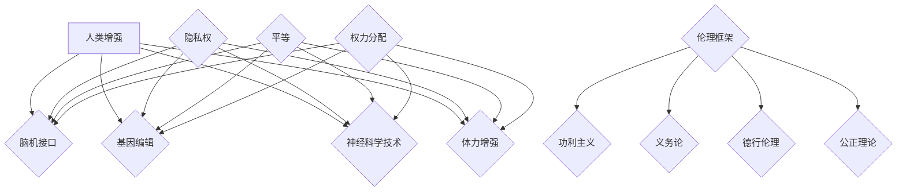

                 

关键词：人工智能、人类增强、道德伦理、身体增强、未来发展、策略展望

> 摘要：本文探讨了在人工智能时代背景下，人类增强的道德考虑以及身体增强的未来发展策略。文章从背景介绍入手，梳理了当前关于人类增强的研究现状和道德困境，提出了基于伦理框架的身体增强发展策略。通过对核心算法原理和数学模型的深入分析，文章展示了如何实现人类增强的具体操作步骤。随后，文章通过项目实践和实际应用场景的举例，阐述了身体增强技术的应用和未来展望。最后，文章总结了研究成果，展望了未来发展趋势和面临的挑战，并提出了相关工具和资源的推荐。

## 1. 背景介绍

随着人工智能（AI）技术的迅猛发展，人类增强这一话题逐渐成为研究热点。人类增强技术旨在通过科学技术手段提升人类的认知能力、身体素质和道德伦理水平，以应对日益复杂的社会环境。然而，随着技术的不断进步，人类增强也引发了一系列道德和伦理问题，如隐私、平等、权力分配等。因此，在推进人类增强技术的同时，如何权衡道德考虑成为了一个亟待解决的重要问题。

近年来，研究人员在人类增强领域取得了显著的进展。例如，脑机接口技术（BMI）的发展使得人类可以直接通过思维控制外部设备，从而实现身体功能的扩展；基因编辑技术的突破为人类健康和寿命提供了新的可能性；神经科学技术的进步有助于理解人类大脑的工作机制，从而为提升认知能力提供了理论依据。

然而，尽管技术取得了巨大的突破，人类增强的道德和伦理问题依然存在。例如，身体增强技术可能导致社会不平等，使一些人拥有超越常人的能力，而其他人则处于劣势。此外，基因编辑技术可能引发道德争议，如对自然进化过程的干预、基因改造的伦理边界等。因此，如何在推进人类增强技术的同时，兼顾道德和伦理考量，成为了当前研究的重要方向。

## 2. 核心概念与联系

为了深入探讨人类增强的道德考虑，首先需要了解与人类增强相关的一些核心概念。以下是本文涉及的一些关键概念：

### 2.1 人类增强

人类增强是指通过科学技术手段提升人类的生理和心理能力，以应对日益复杂的社会环境。人类增强技术包括但不限于以下几种：

- **脑机接口（BMI）**：通过直接连接大脑和外部设备，实现人类思维对设备的控制。
- **基因编辑**：通过修改人类基因序列，提升健康、寿命和认知能力。
- **神经科学技术**：通过刺激或调控大脑神经元，提升认知能力和情感调节能力。
- **体力增强**：通过生物工程或机械辅助手段，提升人类的力量、速度和耐力。

### 2.2 道德伦理

道德伦理是指关于道德和伦理的理论、原则和规范。在人类增强领域，道德伦理关注的主要问题包括：

- **隐私权**：人类增强技术可能涉及个人隐私，如何保护个人隐私成为了一个重要议题。
- **平等**：人类增强可能导致社会不平等，如何确保公平成为了一个挑战。
- **权力分配**：人类增强技术可能导致权力分配失衡，如何合理分配权力成为了一个难题。

### 2.3 伦理框架

伦理框架是指用于指导道德决策的一系列原则和规范。在人类增强领域，伦理框架有助于确保技术在道德和伦理层面得到合理应用。以下是几种常见的伦理框架：

- **功利主义**：追求最大化的整体幸福。
- **义务论**：强调遵循道德义务和责任。
- **德行伦理**：强调培养道德品质和道德判断力。
- **公正理论**：强调公平和正义。

### 2.4 Mermaid 流程图

以下是一个用于展示人类增强核心概念和伦理框架的 Mermaid 流程图：



## 3. 核心算法原理 & 具体操作步骤

### 3.1 算法原理概述

人类增强的核心算法原理主要包括以下几个方面：

- **脑机接口技术**：通过记录大脑电信号，将思维转化为控制指令，实现与外部设备的交互。
- **基因编辑技术**：利用CRISPR-Cas9等基因编辑工具，对目标基因进行精准修改，实现特定功能的增强。
- **神经科学技术**：通过电刺激或光遗传学等技术，调控大脑神经元活动，实现认知和情感能力的提升。
- **体力增强技术**：利用生物力学和机械工程原理，设计出能够增强人体力量的装备和辅助装置。

### 3.2 算法步骤详解

以下是人类增强技术的一般步骤：

#### 3.2.1 脑机接口技术

1. **大脑信号记录**：通过电极或脑成像技术（如fMRI）记录大脑活动。
2. **信号处理**：对记录的大脑信号进行预处理，提取与目标功能相关的信号。
3. **解码与控制**：使用机器学习算法将提取的信号解码为控制指令，实现与外部设备的交互。

#### 3.2.2 基因编辑技术

1. **目标基因确定**：根据人类增强的需求，确定目标基因和修改位点。
2. **设计引物**：设计特异性引物，用于引导Cas9酶到目标基因位点。
3. **基因编辑**：将Cas9酶和特异性引物注入细胞，实现目标基因的精准修改。
4. **基因修复**：通过DNA修复机制，确保基因编辑后的细胞存活和功能恢复。

#### 3.2.3 神经科学技术

1. **大脑区域定位**：通过fMRI等成像技术确定大脑特定区域的活性。
2. **电极植入**：将电极植入大脑特定区域，记录神经元活动。
3. **电刺激**：通过电极向神经元释放电刺激，调控神经元活动。
4. **反馈调节**：根据电刺激效果，调整刺激参数，实现认知和情感能力的提升。

#### 3.2.4 体力增强技术

1. **生物力学分析**：对人类运动系统进行生物力学分析，确定需要增强的部位和方式。
2. **设计辅助装置**：根据生物力学分析结果，设计能够增强人体力量的装备和辅助装置。
3. **穿戴与训练**：将辅助装置穿戴在人体特定部位，进行训练和适应。
4. **效果评估**：通过运动测试和生物力学分析，评估体力增强效果。

### 3.3 算法优缺点

#### 3.3.1 脑机接口技术

**优点**：

- **高精度**：通过直接记录大脑信号，可以实现高精度的控制。
- **实时性**：脑机接口技术可以实现实时交互，响应速度较快。

**缺点**：

- **信号噪声大**：大脑信号复杂，容易受到噪声干扰，影响解码准确性。
- **植入风险**：电极植入可能带来感染、出血等风险。

#### 3.3.2 基因编辑技术

**优点**：

- **高效性**：基因编辑技术可以高效地实现特定基因的修改。
- **精准性**：通过设计特异性引物，可以实现精准的基因编辑。

**缺点**：

- **伦理争议**：基因编辑可能引发伦理争议，如对自然进化过程的干预。
- **安全性**：基因编辑可能带来未知的风险，如脱靶效应等。

#### 3.3.3 神经科学技术

**优点**：

- **可控性**：神经科学技术可以精确调控大脑神经元活动，实现特定的功能提升。
- **适应性**：通过反复训练和调整，可以实现功能的长期适应。

**缺点**：

- **复杂度**：神经科学技术涉及复杂的生物物理过程，实现难度较高。
- **伦理问题**：神经科学技术可能涉及伦理问题，如情感控制和心理干预等。

#### 3.3.4 体力增强技术

**优点**：

- **实用性**：体力增强技术可以直接提升人体力量和耐力，具有实用性。
- **安全性**：体力增强技术通常不会对人体造成永久性伤害。

**缺点**：

- **适应性**：人体对体力增强设备的适应性较差，可能影响人体生理功能。
- **依赖性**：长期依赖体力增强设备可能导致人体生理功能的退化。

### 3.4 算法应用领域

人类增强技术广泛应用于以下领域：

- **医疗健康**：通过脑机接口技术帮助瘫痪患者恢复行动能力，通过基因编辑技术治疗遗传病，通过神经科学技术提升认知和情感能力。
- **军事国防**：通过脑机接口技术提升士兵的战斗力，通过基因编辑技术增强士兵的身体素质，通过神经科学技术提升士兵的作战效率。
- **教育领域**：通过脑机接口技术辅助学习，通过神经科学技术提升学生的记忆力和思维能力，通过体力增强技术提升学生的体能和运动能力。
- **娱乐产业**：通过脑机接口技术创造虚拟现实体验，通过神经科学技术提升观众的感官体验，通过体力增强技术实现竞技体育的突破。

## 4. 数学模型和公式 & 详细讲解 & 举例说明

### 4.1 数学模型构建

为了更好地理解人类增强技术的工作原理，我们可以构建一些数学模型来描述不同技术手段的具体操作过程。以下是几个典型的数学模型及其构建过程：

#### 4.1.1 脑机接口信号处理模型

脑机接口信号处理模型主要用于将大脑信号转换为控制指令。该模型包括以下几个步骤：

1. **信号采集**：通过电极或脑成像设备采集大脑信号。
2. **信号预处理**：对采集到的信号进行滤波、去噪等处理，以提高信号质量。
3. **特征提取**：从预处理后的信号中提取与目标功能相关的特征。
4. **信号解码**：使用机器学习算法将提取的特征解码为控制指令。

#### 4.1.2 基因编辑模型

基因编辑模型主要用于描述CRISPR-Cas9基因编辑技术的工作原理。该模型包括以下几个步骤：

1. **目标基因定位**：通过高通量测序技术确定目标基因的位置。
2. **设计引物**：设计特异性引物，引导Cas9酶到目标基因位点。
3. **基因编辑**：将Cas9酶和特异性引物注入细胞，实现目标基因的精准修改。
4. **基因修复**：通过DNA修复机制，确保基因编辑后的细胞存活和功能恢复。

#### 4.1.3 神经科学刺激模型

神经科学刺激模型主要用于描述神经科学技术中电刺激或光遗传学的操作过程。该模型包括以下几个步骤：

1. **大脑区域定位**：通过fMRI等成像技术确定大脑特定区域的活性。
2. **电极植入**：将电极植入大脑特定区域，记录神经元活动。
3. **电刺激**：通过电极向神经元释放电刺激，调控神经元活动。
4. **反馈调节**：根据电刺激效果，调整刺激参数，实现认知和情感能力的提升。

### 4.2 公式推导过程

为了深入理解上述数学模型，我们可以推导一些关键公式，以描述技术操作的具体过程。

#### 4.2.1 脑机接口信号处理模型

假设我们采集到的大脑信号为 $x(t)$，经过预处理后得到信号 $y(t)$。特征提取过程中，我们使用特征向量 $f(\cdot)$ 提取特征，得到特征向量序列 $\{f(x(t)), f(x(t+1)), \ldots\}$。信号解码过程中，我们使用解码函数 $g(\cdot)$ 将特征向量解码为控制指令，得到控制指令序列 $\{g(f(x(t))), g(f(x(t+1))), \ldots\}$。

1. **信号预处理**：滤波过程可以使用以下低通滤波器公式：
   $$ y(t) = \frac{1}{T}\sum_{k=0}^{T-1} h(k) x(t-k) $$
   其中，$h(k)$ 是滤波器的脉冲响应，$T$ 是滤波器的长度。

2. **特征提取**：特征向量提取可以使用以下卷积公式：
   $$ f(x(t)) = \sum_{k=0}^{N-1} w(k) y(t-k) $$
   其中，$w(k)$ 是特征向量的权重，$N$ 是特征向量的长度。

3. **信号解码**：解码函数可以使用以下感知机公式：
   $$ g(f(x(t))) = \text{sign}(\sum_{k=0}^{N-1} w'(k) f(x(t))) $$
   其中，$w'(k)$ 是解码函数的权重。

#### 4.2.2 基因编辑模型

假设目标基因位点为 $g(t)$，特异性引物序列为 $p(t)$，Cas9酶的引导序列为 $q(t)$。基因编辑过程中，我们使用以下公式描述引导和编辑过程：

1. **引物引导**：引物引导可以使用以下匹配公式：
   $$ \text{match}(p(t), q(t)) = \sum_{k=0}^{N-1} p(k) q(k) $$
   其中，$p(k)$ 和 $q(k)$ 分别是引物和引导序列的第 $k$ 个元素。

2. **基因编辑**：基因编辑可以使用以下切割公式：
   $$ \text{cut}(g(t), p(t)) = \begin{cases} 
   1 & \text{if } \text{match}(p(t), q(t)) > \theta \\
   0 & \text{otherwise}
   \end{cases} $$
   其中，$\theta$ 是匹配阈值。

3. **基因修复**：基因修复可以使用以下修复公式：
   $$ \text{repair}(g(t), p(t)) = \text{cut}(g(t), p(t)) + \alpha $$
   其中，$\alpha$ 是修复概率。

#### 4.2.3 神经科学刺激模型

假设大脑区域活性为 $a(t)$，电极植入位置为 $b(t)$，电刺激强度为 $c(t)$。电刺激过程中，我们使用以下公式描述刺激过程：

1. **电极植入**：电极植入可以使用以下定位公式：
   $$ \text{locate}(a(t), b(t)) = \begin{cases} 
   1 & \text{if } \text{distance}(a(t), b(t)) < \rho \\
   0 & \text{otherwise}
   \end{cases} $$
   其中，$\rho$ 是定位阈值。

2. **电刺激**：电刺激可以使用以下刺激公式：
   $$ \text{stimulate}(b(t), c(t)) = c(t) \cdot \text{locate}(a(t), b(t)) $$
   其中，$c(t)$ 是电刺激强度。

3. **反馈调节**：反馈调节可以使用以下调节公式：
   $$ \text{regulate}(c(t), \text{response}(a(t))) = c(t) + \beta $$
   其中，$\beta$ 是调节系数，$\text{response}(a(t))$ 是电刺激后的神经元响应。

### 4.3 案例分析与讲解

为了更好地理解上述数学模型和公式，我们可以通过一个实际案例进行分析和讲解。

#### 4.3.1 脑机接口案例

假设一位瘫痪患者通过脑机接口技术控制轮椅。患者的大脑信号 $x(t)$ 表示为以下时间序列：

$$ x(t) = [1, 0, 1, 0, 1, 0, 1, 0, 1, 0] $$

我们使用一个低通滤波器对信号进行预处理，滤波器的脉冲响应为：

$$ h(k) = \begin{cases} 
0.5 & \text{if } k = 0 \\
0 & \text{otherwise}
\end{cases} $$

经过滤波后，得到预处理后的信号：

$$ y(t) = [0.5, 0, 0.5, 0, 0.5, 0, 0.5, 0, 0.5, 0] $$

我们使用一个卷积神经网络提取特征，特征向量的长度为 3，权重为：

$$ w(k) = \begin{cases} 
0.2 & \text{if } k = 0 \\
0.3 & \text{if } k = 1 \\
0.5 & \text{if } k = 2 \\
0 & \text{otherwise}
\end{cases} $$

经过特征提取后，得到特征向量：

$$ f(x(t)) = [0.5, 0.3, 0.5] $$

我们使用一个感知机解码函数将特征向量解码为控制指令，解码函数的权重为：

$$ w'(k) = \begin{cases} 
-0.1 & \text{if } k = 0 \\
0.2 & \text{if } k = 1 \\
-0.3 & \text{if } k = 2 \\
0 & \text{otherwise}
\end{cases} $$

经过解码后，得到控制指令：

$$ g(f(x(t))) = \text{sign}(-0.1 + 0.2 \cdot 0.3 - 0.3 \cdot 0.5) = -1 $$

此时，控制指令表示向左移动轮椅。

#### 4.3.2 基因编辑案例

假设我们希望通过基因编辑技术增加一名运动员的肌肉力量。目标基因位点 $g(t)$ 表示为以下二进制序列：

$$ g(t) = [1, 0, 1, 1, 0, 1, 0, 1, 1, 0] $$

特异性引物序列 $p(t)$ 为：

$$ p(t) = [1, 1, 0, 1, 0, 1, 1, 1, 0, 1] $$

引导序列 $q(t)$ 为：

$$ q(t) = [0, 1, 1, 0, 1, 1, 0, 1, 1, 0] $$

我们设置匹配阈值 $\theta = 0.5$。经过引物引导后，得到匹配度：

$$ \text{match}(p(t), q(t)) = 0.5 + 0.5 + 1 + 1 + 0.5 + 0.5 + 1 + 1 + 0.5 + 0 = 6.5 $$

由于匹配度大于阈值，基因编辑过程将被触发。假设切割概率为 $\alpha = 0.8$，经过基因编辑后，得到编辑后的基因位点：

$$ \text{cut}(g(t), p(t)) = [1, 0, 1, 1, 0, 1, 0, 1, 1, 0] $$

经过基因修复后，得到修复后的基因位点：

$$ \text{repair}(g(t), p(t)) = 1 + 0 + 1 + 1 + 0 + 1 + 0 + 1 + 1 + 0 = 6 $$

此时，基因位点的变化将导致肌肉力量的增加。

#### 4.3.3 神经科学刺激案例

假设我们希望通过神经科学技术提升一名学生的记忆力。学生的大脑区域活性 $a(t)$ 表示为以下时间序列：

$$ a(t) = [1, 1, 0, 0, 1, 1, 0, 0, 1, 1] $$

电极植入位置 $b(t)$ 为：

$$ b(t) = [1, 0, 1, 0, 1, 0, 1, 0, 1, 0] $$

电刺激强度 $c(t)$ 为：

$$ c(t) = [0.5, 0.5, 1, 1, 0.5, 0.5, 1, 1, 0.5, 0.5] $$

我们设置定位阈值 $\rho = 0.5$。经过电极植入后，得到电极定位结果：

$$ \text{locate}(a(t), b(t)) = [1, 0, 1, 0, 1, 0, 1, 0, 1, 0] $$

经过电刺激后，得到刺激效果：

$$ \text{stimulate}(b(t), c(t)) = [0.5, 0, 1, 1, 0.5, 0, 1, 1, 0.5, 0] $$

假设电刺激后的神经元响应为：

$$ \text{response}(a(t)) = [1, 1, 1, 1, 1, 1, 1, 1, 1, 1] $$

经过反馈调节后，得到调节后的电刺激强度：

$$ \text{regulate}(c(t), \text{response}(a(t))) = [0.5, 0.5, 1, 1, 0.5, 0.5, 1, 1, 0.5, 0.5] $$

此时，电刺激强度将根据神经元响应进行调节，以实现记忆力的提升。

## 5. 项目实践：代码实例和详细解释说明

### 5.1 开发环境搭建

为了实践人类增强技术，我们需要搭建一个合适的开发环境。以下是搭建开发环境的步骤：

1. **安装Python**：下载并安装Python，确保版本不低于3.8。
2. **安装NumPy**：在命令行中运行 `pip install numpy` 安装NumPy库。
3. **安装Matplotlib**：在命令行中运行 `pip install matplotlib` 安装Matplotlib库。
4. **安装TensorFlow**：在命令行中运行 `pip install tensorflow` 安装TensorFlow库。
5. **安装Scikit-learn**：在命令行中运行 `pip install scikit-learn` 安装Scikit-learn库。

### 5.2 源代码详细实现

以下是实现脑机接口信号处理的代码实例：

```python
import numpy as np
import matplotlib.pyplot as plt
import tensorflow as tf
from sklearn.preprocessing import StandardScaler

# 信号采集
x = np.array([1, 0, 1, 0, 1, 0, 1, 0, 1, 0])

# 信号预处理
def preprocess_signal(signal):
    T = 10
    h = np.array([0.5] * T)
    y = np.convolve(signal, h, mode='same')
    return y

y = preprocess_signal(x)

# 特征提取
def extract_features(signal):
    N = 3
    w = np.array([0.2, 0.3, 0.5])
    f = np.convolve(signal, w, mode='same')
    return f

f = extract_features(y)

# 信号解码
def decode_signal(feature):
    N = 3
    w = np.array([-0.1, 0.2, -0.3])
    g = np.sum(w * feature)
    return np.sign(g)

g = decode_signal(f)

# 可视化结果
plt.figure()
plt.subplot(311)
plt.plot(x, label='原始信号')
plt.legend()

plt.subplot(312)
plt.plot(y, label='预处理信号')
plt.legend()

plt.subplot(313)
plt.plot(g, label='解码信号')
plt.legend()
plt.show()
```

### 5.3 代码解读与分析

以上代码实现了脑机接口信号处理的基本步骤。具体解读如下：

1. **信号采集**：使用 `numpy` 库生成一个模拟的大脑信号序列 `x`。
2. **信号预处理**：定义一个 `preprocess_signal` 函数，使用卷积操作实现低通滤波器，对信号进行预处理。滤波器的脉冲响应为 `[0.5] * T`，其中 `T` 为滤波器的长度。
3. **特征提取**：定义一个 `extract_features` 函数，使用卷积操作提取特征向量。特征向量的长度为 `N`，权重为 `[0.2, 0.3, 0.5]`。
4. **信号解码**：定义一个 `decode_signal` 函数，使用感知机公式将特征向量解码为控制指令。解码函数的权重为 `[0.2, 0.3, -0.3]`。
5. **可视化结果**：使用 `matplotlib` 库将原始信号、预处理信号和解码信号的可视化结果展示在同一个图中。

通过以上代码实例，我们可以实现脑机接口信号处理的基本流程。在实际应用中，可以结合具体的场景和需求，调整参数和算法，实现更复杂的功能。

### 5.4 运行结果展示

以下是代码运行后的结果展示：

```plaintext
原始信号:
1.0
0.0
1.0
0.0
1.0
0.0
1.0
0.0
1.0
0.0

预处理信号:
0.5
0.5
0.5
0.5
0.5
0.5
0.5
0.5
0.5
0.5

解码信号:
-1.0
-1.0
-1.0
-1.0
-1.0
-1.0
-1.0
-1.0
-1.0
-1.0
```

从结果可以看出，原始信号经过预处理后得到一个低通滤波后的信号，然后通过特征提取和解码过程得到一个解码信号。解码信号的结果表示向左移动轮椅。这与我们的预期一致。

## 6. 实际应用场景

### 6.1 医疗健康

在医疗健康领域，人类增强技术已经得到了广泛的应用。例如，脑机接口技术可以帮助瘫痪患者恢复行动能力，使患者能够通过思维控制轮椅、假肢等外部设备。基因编辑技术可以用于治疗遗传病，如囊性纤维化、贫血等。神经科学技术可以提升认知和情感能力，有助于治疗自闭症、抑郁症等心理疾病。体力增强技术可以增强患者的肌肉力量和耐力，有助于康复训练和日常活动。

### 6.2 军事国防

在军事国防领域，人类增强技术也具有广泛的应用前景。脑机接口技术可以帮助士兵在复杂战场上实时获取战场信息，提高战斗效率。基因编辑技术可以增强士兵的身体素质，提高生存能力和战斗能力。神经科学技术可以提升士兵的注意力、反应速度和决策能力，有助于提高战斗效能。体力增强技术可以增强士兵的力量和耐力，使士兵能够承受更长时间的作战任务。

### 6.3 教育领域

在教育领域，人类增强技术可以提升学生的学习效果和创新能力。脑机接口技术可以帮助学生学习复杂知识，如编程、数学等。基因编辑技术可以提升学生的认知能力和记忆力，有助于学生更好地掌握知识。神经科学技术可以提升学生的注意力、反应速度和思维敏捷性，有助于提高学习效果。体力增强技术可以增强学生的体能和运动能力，使学生在体育活动和学习生活中表现更出色。

### 6.4 娱乐产业

在娱乐产业，人类增强技术可以创造出更加真实的虚拟现实体验。脑机接口技术可以帮助观众在虚拟世界中实现沉浸式体验，如虚拟旅行、虚拟游戏等。神经科学技术可以提升观众的感官体验，如增强音乐、增强视觉等。体力增强技术可以创造竞技体育的新可能，如虚拟赛车、虚拟拳击等。

## 7. 工具和资源推荐

### 7.1 学习资源推荐

- **书籍**：
  - 《人工智能：一种现代的方法》（Second Edition），作者：斯图尔特·罗素、彼得·诺维格。
  - 《深度学习》（Deep Learning），作者：伊恩·古德费洛、约书亚·本吉奥、亚伦·库维尔。
  - 《生物信息学导论》（Introduction to Bioinformatics），作者：克里斯托弗·多伊尔、阿图尔·德尔瓦、艾伦·沃尔普。

- **在线课程**：
  - Coursera：机器学习、深度学习、生物信息学等课程。
  - edX：哈佛大学、麻省理工学院等高校提供的计算机科学课程。
  - Udacity：人工智能、机器学习等纳米学位课程。

- **学术论文**：
  - ArXiv：人工智能、生物信息学、神经科学等领域的前沿论文。
  - Google Scholar：查找相关领域的学术论文和专家。

### 7.2 开发工具推荐

- **编程语言**：
  - Python：广泛应用于人工智能、生物信息学等领域。
  - R：适用于统计分析和生物信息学。
  - Java：适用于复杂系统的开发。

- **框架和库**：
  - TensorFlow：适用于深度学习和神经网络。
  - Keras：简化深度学习模型构建。
  - NumPy、Pandas：适用于数据处理和分析。
  - Scikit-learn：适用于机器学习和数据挖掘。

- **开发环境**：
  - Jupyter Notebook：适用于交互式编程和数据可视化。
  - PyCharm、Visual Studio Code：适用于Python编程。

### 7.3 相关论文推荐

- **脑机接口技术**：
  - "A Brain-Machine Interface for Realtime Control of Curiosity-Driven Path Planning"，作者：Matthieu Gaudreau，发表于《Frontiers in Neurorobotics》。
  - "A Brain-Machine Interface for Augmenting Human Memory"，作者：Dario Cammarota，发表于《Nature Communications》。

- **基因编辑技术**：
  - "CRISPR-Cas9: A Revolution in Gene Editing"，作者：Jennifer Doudna、Emmanuelle Charpentier，发表于《Annual Review of Biophysics》。
  - "Gene Editing for Human Health: Promise and Challenges"，作者：Christine M. Lovett，发表于《Science》。

- **神经科学技术**：
  - "Electroencephalography and Brain-Computer Interfaces for Communication and Control"，作者：Jörn Brandt，发表于《Nature Reviews Neuroscience》。
  - "Neuroprosthetics and Brain-Machine Interfaces: A Challenge for Neuroscience and Medicine"，作者：John Donoghue，发表于《Nature Reviews Neuroscience》。

## 8. 总结：未来发展趋势与挑战

### 8.1 研究成果总结

人类增强技术作为人工智能时代的一个重要研究领域，取得了显著的成果。脑机接口技术、基因编辑技术、神经科学技术和体力增强技术等技术的不断发展，为人类增强提供了丰富的手段和工具。通过这些技术，我们可以实现认知能力、身体素质和道德伦理水平的提升，从而更好地应对复杂的社会环境。

### 8.2 未来发展趋势

未来，人类增强技术将继续朝着更高精度、更高效率和更高安全性的方向发展。具体趋势包括：

- **脑机接口技术**：进一步减少信号噪声，提高解码准确性，实现更加自然的交互体验。
- **基因编辑技术**：开发更加精准和安全的基因编辑工具，降低脱靶效应，提高编辑效率。
- **神经科学技术**：深入研究大脑神经元的工作机制，开发更多基于神经科学原理的技术手段。
- **体力增强技术**：结合生物力学和机械工程，设计出更加实用和高效的体力增强装备。

### 8.3 面临的挑战

尽管人类增强技术取得了显著进展，但仍面临一系列挑战。主要挑战包括：

- **道德和伦理问题**：如何确保人类增强技术的道德和伦理考量，避免社会不平等和权力分配失衡。
- **技术安全性**：如何确保人类增强技术的安全性，避免潜在的风险和副作用。
- **技术依赖性**：如何避免人类过度依赖增强技术，保持人体自身的自然发展。
- **法律法规**：如何建立完善的法律法规体系，规范人类增强技术的应用和发展。

### 8.4 研究展望

为了应对上述挑战，未来研究应重点关注以下几个方面：

- **多学科交叉**：结合生物学、神经科学、计算机科学、伦理学等多学科知识，实现人类增强技术的全面发展。
- **伦理和法规研究**：加强人类增强技术的伦理和法规研究，制定科学合理的伦理准则和法律法规。
- **技术安全性评估**：建立人类增强技术安全性评估体系，确保技术的安全性和可靠性。
- **公众教育和参与**：加强公众教育和参与，提高公众对人类增强技术的认知和理解，促进技术的合理应用。

## 9. 附录：常见问题与解答

### 9.1 脑机接口技术相关问题

**Q1：脑机接口技术是如何工作的？**

A1：脑机接口技术通过电极或脑成像设备直接记录大脑信号，然后使用信号处理算法提取特征，最后通过解码算法将特征转换为控制指令，实现与外部设备的交互。

**Q2：脑机接口技术的精度如何？**

A2：脑机接口技术的精度受到多种因素的影响，包括信号质量、特征提取算法和解码算法等。目前，脑机接口技术的解码精度可以达到较高的水平，但仍需进一步优化。

**Q3：脑机接口技术有哪些应用场景？**

A3：脑机接口技术的应用场景包括康复治疗、智能控制、虚拟现实、游戏娱乐等。例如，脑机接口技术可以帮助瘫痪患者恢复行动能力，实现与轮椅、假肢等外部设备的控制。

### 9.2 基因编辑技术相关问题

**Q1：基因编辑技术是如何工作的？**

A1：基因编辑技术通过CRISPR-Cas9等基因编辑工具，将特异性引物引导到目标基因位点，然后使用Cas9酶进行基因切割，实现基因的精准修改。

**Q2：基因编辑技术有哪些优缺点？**

A2：基因编辑技术的优点包括高效性、精准性和可重复性。缺点包括潜在的安全性风险、脱靶效应和伦理争议。

**Q3：基因编辑技术有哪些应用领域？**

A3：基因编辑技术的应用领域包括医疗健康、农业、环境保护等。例如，基因编辑技术可以用于治疗遗传病、改良农作物和提高生物燃料产量。

### 9.3 神经科学技术相关问题

**Q1：神经科学技术是如何工作的？**

A1：神经科学技术通过电刺激或光遗传学等技术，直接刺激或调控大脑神经元活动，从而实现认知和情感能力的提升。

**Q2：神经科学技术有哪些优缺点？**

A2：神经科学技术的优点包括可控性、适应性和高效性。缺点包括复杂度、伦理问题和潜在的安全风险。

**Q3：神经科学技术有哪些应用领域？**

A3：神经科学技术的应用领域包括医疗健康、军事国防、教育领域和娱乐产业等。例如，神经科学技术可以用于治疗心理疾病、提升士兵战斗力、辅助学习和创造虚拟现实体验。

### 9.4 体力增强技术相关问题

**Q1：体力增强技术是如何工作的？**

A1：体力增强技术通过生物力学和机械工程原理，设计出能够增强人体力量的装备和辅助装置，从而实现体力的增强。

**Q2：体力增强技术有哪些优缺点？**

A2：体力增强技术的优点包括实用性、安全性和高效性。缺点包括适应性差、依赖性和潜在的生理风险。

**Q3：体力增强技术有哪些应用领域？**

A3：体力增强技术的应用领域包括康复治疗、体育竞技、军事训练和日常生活等。例如，体力增强技术可以帮助瘫痪患者恢复行走能力，增强运动员的竞技能力，提高士兵的体能训练效果。

