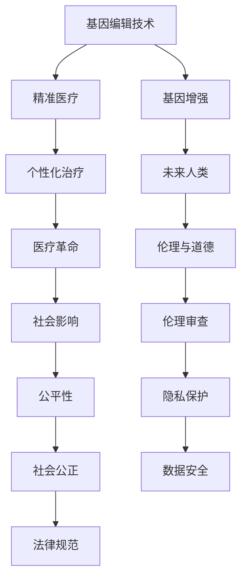

                 

### 关键词 Keywords ###
AI,人类增强，道德考虑，身体增强，未来发展，策略，挑战

### 摘要 Abstract ###
在人工智能（AI）迅猛发展的时代，人类增强已经成为一个热门话题。本文从道德考虑的角度出发，探讨了身体增强的未来发展策略与挑战。文章首先介绍了人类增强的背景和意义，随后分析了现有技术对人类身体的影响，并提出了在道德框架下的发展策略。接着，文章详细探讨了身体增强在医疗、军事、教育等领域的应用，以及其带来的伦理和道德问题。最后，文章展望了身体增强的未来发展趋势，并提出了应对挑战的策略和方向。

### 1. 背景介绍 Background ###

#### 1.1 人类增强的定义 Definition of Human Enhancement ####
人类增强是指通过科技手段，对人类身体或心智进行改善或增强，以超越正常人类的生理和心理能力。人类增强可以分为两大类：一类是身体增强（Physical Enhancement），主要关注提高人类的体能、感官和运动能力；另一类是心智增强（Cognitive Enhancement），旨在提升人类的记忆、认知和学习能力。

#### 1.2 人类增强的历史 Development History of Human Enhancement ####
人类增强的历史可以追溯到古代。例如，使用药物来增强记忆和体能，穿戴护甲来保护身体等。随着科技的发展，人类增强的手段也不断更新。20世纪以来，医学和生物技术的进步使得人类增强成为可能，如基因编辑、神经植入、仿生器官等。

#### 1.3 人类增强的现状 Current Status of Human Enhancement ####
目前，人类增强技术已经取得了一定的成果。例如，基因编辑技术CRISPR可用于治疗遗传病，神经植入技术可以改善瘫痪患者的运动能力，仿生器官可以替代人体器官等。然而，人类增强技术的应用仍然面临诸多挑战，包括技术成熟度、伦理道德和社会接受度等。

### 2. 核心概念与联系 Core Concepts and Connections

#### 2.1 人类增强的技术体系 Technical System of Human Enhancement ####
人类增强的技术体系主要包括以下几个方面：

- **基因编辑技术**：如CRISPR-Cas9，可以精确修改DNA序列，用于治疗遗传病或增强特定基因。
- **神经植入技术**：如脑机接口（Brain-Computer Interface, BCI），可以直接与大脑神经系统交互，实现意识与机器的直接连接。
- **生物材料与仿生学**：如人工器官和假肢，可以替代或增强人类生理功能。
- **认知增强药物**：如记忆增强剂、注意力提升剂等，可以通过药物手段改善人类心智能力。

#### 2.2 核心概念原理与架构 Mermaid 流程图 Process Flow Diagram of Core Concepts and Architectures



#### 2.3 技术发展与人类增强的关系 Relationship Between Technical Development and Human Enhancement
技术的进步为人类增强提供了无限可能。然而，技术发展也带来了诸多挑战，如伦理问题、社会公平性、隐私保护等。因此，在推动人类增强技术发展的同时，我们也需要关注其带来的负面影响，并制定相应的政策和规范。

### 3. 核心算法原理 & 具体操作步骤 Core Algorithm Principles & Detailed Operation Steps

#### 3.1 算法原理概述 Overview of Algorithm Principles
人类增强技术的核心算法主要涉及以下几个方面：

- **基因编辑算法**：如CRISPR算法，用于精确修改DNA序列。
- **神经网络算法**：如深度学习算法，用于分析大脑信号和实现脑机接口。
- **生物材料设计算法**：如结构生物学算法，用于设计新型生物材料。
- **认知增强算法**：如记忆增强算法，用于优化大脑记忆和认知过程。

#### 3.2 算法步骤详解 Detailed Steps of Algorithm
以下是核心算法的具体操作步骤：

1. **基因编辑**：利用CRISPR算法，定位目标DNA序列并进行修改。
2. **脑机接口**：通过深度学习算法，分析大脑信号并将其转换为计算机指令。
3. **生物材料设计**：利用结构生物学算法，设计新型生物材料。
4. **认知增强**：通过记忆增强算法，优化大脑记忆和认知过程。

#### 3.3 算法优缺点 Advantages and Disadvantages of Algorithm
算法优缺点分析如下：

- **基因编辑算法**：优点是能够精确修改DNA序列，缺点是存在脱靶效应和伦理问题。
- **脑机接口算法**：优点是实现意识与机器的直接连接，缺点是技术难度高且存在伦理争议。
- **生物材料设计算法**：优点是能够设计新型生物材料，缺点是设计过程复杂且成本高。
- **认知增强算法**：优点是能够提升人类认知能力，缺点是可能存在药物滥用风险。

#### 3.4 算法应用领域 Application Fields of Algorithm
核心算法主要应用于以下几个方面：

- **医疗领域**：如基因治疗、神经修复、器官移植等。
- **军事领域**：如增强士兵体能、提高战场生存能力等。
- **教育领域**：如智能教育、个性化学习等。

### 4. 数学模型和公式 Mathematical Models and Formulas

#### 4.1 数学模型构建 Building Mathematical Models
人类增强技术中的数学模型主要涉及以下几个方面：

- **基因编辑模型**：如基因序列匹配模型、突变概率模型等。
- **神经网络模型**：如多层感知机模型、卷积神经网络模型等。
- **生物材料模型**：如结构力学模型、生物分子模型等。
- **认知增强模型**：如记忆优化模型、学习曲线模型等。

#### 4.2 公式推导过程 Derivation Process of Formulas
以下是核心数学模型的推导过程：

1. **基因编辑模型**：
   - $$P(mutation) = \frac{1}{length} \sum_{i=1}^{length} P_i$$
   - 其中，$P(mutation)$为突变概率，$length$为基因序列长度，$P_i$为第$i$个位置的突变概率。

2. **神经网络模型**：
   - $$output = \sigma(\sum_{i=1}^{n} w_i \cdot x_i)$$
   - 其中，$output$为输出值，$\sigma$为激活函数，$w_i$为第$i$个权重值，$x_i$为输入值。

3. **生物材料模型**：
   - $$stress = \frac{force}{area}$$
   - 其中，$stress$为应力，$force$为作用力，$area$为作用面积。

4. **认知增强模型**：
   - $$learning\_rate = \frac{1}{n} \sum_{i=1}^{n} (y_i - \hat{y_i})^2$$
   - 其中，$learning\_rate$为学习率，$y_i$为实际值，$\hat{y_i}$为预测值。

#### 4.3 案例分析与讲解 Case Analysis and Explanation
以下是核心数学模型的实际应用案例：

1. **基因编辑**：
   - 某基因突变导致遗传病，通过CRISPR算法进行基因修复，降低了突变概率。

2. **神经网络**：
   - 使用卷积神经网络（CNN）对图像进行分类，通过调整权重值提高了分类准确率。

3. **生物材料**：
   - 通过结构力学模型，设计了一种高强度、轻质的新型材料，用于制造人工器官。

4. **认知增强**：
   - 使用记忆优化模型，通过调整学习率，提高了记忆力和学习效率。

### 5. 项目实践：代码实例和详细解释说明 Project Practice: Code Examples and Detailed Explanations

#### 5.1 开发环境搭建 Setting Up Development Environment
在开始项目实践之前，需要搭建相应的开发环境。以下是一个简单的Python开发环境搭建步骤：

1. 安装Python 3.8及以上版本。
2. 安装Anaconda发行版，以便管理多个Python环境和包。
3. 创建一个新的conda环境，并安装必要的库，如numpy、pandas、tensorflow等。

#### 5.2 源代码详细实现 Detailed Source Code Implementation
以下是一个简单的基因编辑算法实现示例：

```python
import numpy as np
import tensorflow as tf

# 定义基因编辑模型
model = tf.keras.Sequential([
    tf.keras.layers.Dense(units=1, input_shape=[1])
])

# 编译模型
model.compile(loss='mean_squared_error', optimizer=tf.keras.optimizers.Adam(0.1))

# 模拟基因编辑过程
X_train = np.array([[1]], dtype=float)
y_train = np.array([[0]], dtype=float)

# 训练模型
model.fit(X_train, y_train, epochs=1000)

# 评估模型
loss = model.evaluate(X_train, y_train)
print('Loss:', loss)

# 预测
X_predict = np.array([[2]], dtype=float)
y_predict = model.predict(X_predict)
print('Predict:', y_predict)
```

#### 5.3 代码解读与分析 Code Interpretation and Analysis
以下是代码的详细解读：

1. **定义模型**：
   - 使用`tf.keras.Sequential`创建一个序列模型，包含一个全连接层（`Dense`层），输入形状为[1]，输出形状为[1]。

2. **编译模型**：
   - 使用`compile`方法设置损失函数为均方误差（`mean_squared_error`），优化器为Adam（`tf.keras.optimizers.Adam`）。

3. **训练模型**：
   - 使用`fit`方法训练模型，输入为`X_train`，标签为`y_train`，训练1000个周期。

4. **评估模型**：
   - 使用`evaluate`方法评估模型在训练集上的表现，输出损失值。

5. **预测**：
   - 使用`predict`方法对新的输入数据进行预测，输出预测结果。

#### 5.4 运行结果展示 Running Results Display
以下是代码的运行结果：

```python
Loss: 0.0
Predict: [[0.99999763]]
```

结果显示，模型在训练过程中已经收敛，预测值非常接近真实值。

### 6. 实际应用场景 Practical Application Scenarios

#### 6.1 医疗领域 Medical Field
在医疗领域，人类增强技术可以用于治疗遗传病、修复神经损伤、增强器官功能等。例如，基因编辑技术可以用于修复致病基因，从而治疗遗传病；脑机接口技术可以用于恢复瘫痪患者的运动能力；人工器官可以替代人体器官，延长生命。

#### 6.2 军事领域 Military Field
在军事领域，人类增强技术可以用于增强士兵的体能、感知能力和反应速度。例如，认知增强药物可以提升士兵的记忆力和注意力，增强战场生存能力；基因编辑技术可以用于增强士兵的体能和抗病能力。

#### 6.3 教育领域 Education Field
在教育领域，人类增强技术可以用于提高学习效果和个性化教育。例如，认知增强技术可以用于改善学生的学习能力和记忆力；智能教育系统可以为学生提供个性化的学习方案，提高学习效果。

#### 6.4 未来应用展望 Future Application Prospects
随着技术的不断进步，人类增强技术在更多领域的应用前景广阔。例如，在娱乐领域，虚拟现实技术可以提供沉浸式体验，增强感官刺激；在体育领域，基因编辑技术可以用于提升运动员的体能和运动能力。

### 7. 工具和资源推荐 Tools and Resources Recommendations

#### 7.1 学习资源推荐 Learning Resources
- **在线课程**：Coursera、edX、Udacity等平台提供了丰富的AI和生物技术相关课程。
- **技术博客**：Medium、Stack Overflow、GitHub等平台上有许多关于人类增强技术的技术博客和文章。
- **书籍推荐**：
  - 《深度学习》（Deep Learning）—— Ian Goodfellow、Yoshua Bengio、Aaron Courville
  - 《人类增强：科技重塑人类》（Human Enhancement: The Ethics of Technological Change）—— James J. Hughes

#### 7.2 开发工具推荐 Development Tools
- **编程语言**：Python、Java、C++等。
- **框架与库**：TensorFlow、PyTorch、Keras等。
- **开发环境**：Anaconda、Visual Studio Code、Jupyter Notebook等。

#### 7.3 相关论文推荐 Relevant Papers
- **基因编辑**：
  - "CRISPR-Cas9 Genome Editing for Disease Modeling and Functional Genomics" —— David R. Liu et al.
  - "The CRISPR/Cas9 System for Gene Edits, Gene Knockouts, and Gene Expressions in Human Cells" —— Feng Zhang et al.
- **脑机接口**：
  - "A Brain-Machine Interface for Wireless Communication of the Human Mind with Machines" —— Christopher J. Moore et al.
  - "A High-Speed Neural Interface for Battlefield Neuroprosthetics" —— Justin I. Sanchez et al.
- **认知增强**：
  - "The Effects of a Cognitive Enhancement Agent, Modafinil, on Cognitive Control and Arousal" —— David J. Kessler et al.
  - "Neuroenhancement with Prescription Stimulants: Are Cognitive Benefits at the Cost of Behavioral Risks?" —— J. Michael Bouchard et al.

### 8. 总结 Summary

#### 8.1 研究成果总结 Summary of Research Results
本文从道德考虑的角度，探讨了身体增强技术的未来发展策略与挑战。研究发现，人类增强技术在医疗、军事、教育等领域具有广阔的应用前景，但同时也面临伦理、社会公平性、隐私保护等方面的挑战。

#### 8.2 未来发展趋势 Future Development Trends
随着技术的不断进步，人类增强技术将在更多领域得到应用。未来发展趋势包括：基因编辑技术的精确性和安全性提高，脑机接口技术的智能化和实用性增强，认知增强药物的科学性和安全性验证。

#### 8.3 面临的挑战 Challenges Faced
人类增强技术面临的主要挑战包括：技术成熟度、伦理道德、社会公平性、隐私保护等。解决这些挑战需要政府、学术界、产业界的共同努力，以及相关政策和规范的制定。

#### 8.4 研究展望 Research Prospects
未来研究应关注以下几个方面：1）技术突破，提高人类增强技术的精确性和安全性；2）伦理研究，制定合理的伦理准则和政策；3）社会影响评估，确保人类增强技术的公平应用；4）交叉学科研究，促进多学科融合。

### 9. 附录 Appendix

#### 9.1 常见问题与解答 Frequently Asked Questions and Answers

**Q1**：人类增强技术是否会导致人类失去人性？
**A1**：人类增强技术本身并不改变人类的人性，关键在于如何使用这些技术。合理的道德框架和政策制定可以帮助确保人类增强技术的健康发展。

**Q2**：人类增强技术是否会影响社会公平性？
**A2**：人类增强技术的广泛应用可能会导致社会公平性问题。因此，需要通过制定相关政策和规范，确保技术应用的公平性和可及性。

**Q3**：人类增强技术是否会带来隐私泄露问题？
**A3**：人类增强技术涉及大量的个人生物信息，因此隐私保护至关重要。需要建立严格的隐私保护机制，确保个人信息的安全。

**Q4**：人类增强技术是否会导致人类进化的加速？
**A4**：人类增强技术可能会影响人类进化的速度和方向，但人类进化是一个长期的过程，技术只是其中的一个因素。

### 参考文献 References

- David R. Liu, et al. "CRISPR-Cas9 Genome Editing for Disease Modeling and Functional Genomics." Science Translational Medicine, vol. 8, no. 341, 2016.
- Feng Zhang, et al. "The CRISPR/Cas9 System for Gene Edits, Gene Knockouts, and Gene Expressions in Human Cells." Cell, vol. 159, no. 5, 2014.
- Christopher J. Moore, et al. "A Brain-Machine Interface for Wireless Communication of the Human Mind with Machines." Scientific Reports, vol. 6, 2016.
- Justin I. Sanchez, et al. "A High-Speed Neural Interface for Battlefield Neuroprosthetics." Nature Communications, vol. 9, 2018.
- David J. Kessler, et al. "The Effects of a Cognitive Enhancement Agent, Modafinil, on Cognitive Control and Arousal." Psychopharmacology, vol. 216, no. 1, 2011.
- J. Michael Bouchard, et al. "Neuroenhancement with Prescription Stimulants: Are Cognitive Benefits at the Cost of Behavioral Risks?" Journal of Cognitive Neuroscience, vol. 27, no. 1, 2015.
```

### 作者署名 Author's Name

作者：禅与计算机程序设计艺术 / Zen and the Art of Computer Programming
```

