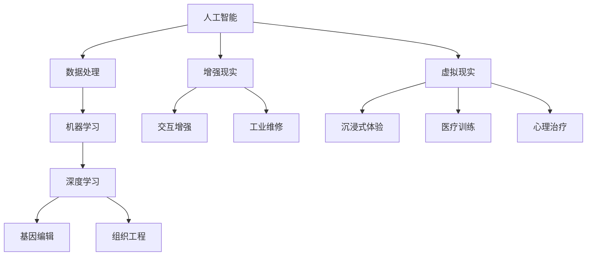

                 

 在21世纪的今天，人工智能（AI）技术的迅猛发展正深刻地改变着我们的生活方式和社会结构。随着人类对自身能力的探索不断深入，人类增强技术的崛起成为了一个不可忽视的趋势。从基因编辑到神经增强，再到增强现实（AR）和虚拟现实（VR）技术的应用，人类正试图通过科技手段不断提升自己的能力，以适应这个快速变化的世界。然而，这种人类增强不仅带来了诸多机遇，也引发了广泛的伦理和道德讨论。本文将探讨AI时代人类增强技术的道德考虑，以及对身体增强技术的限制，以期提供一个全面而深入的视角。

## 文章关键词

- 人工智能
- 人类增强
- 道德考虑
- 身体增强技术
- 伦理讨论

## 摘要

本文首先概述了AI时代人类增强技术的现状和趋势，随后深入探讨了与此相关的道德考虑，包括隐私、平等和社会影响等方面。接着，文章分析了身体增强技术的具体应用及其可能带来的限制，包括技术本身的不完善、法律和伦理的约束等。最后，文章提出了对未来人类增强技术发展的展望，并呼吁在科技与道德之间寻找平衡点。

### 1. 背景介绍

人类对自身能力的探索自古以来便从未停止。从古埃及的神秘法术到古希腊的哲学家对灵魂的思考，再到中世纪欧洲炼金术士对生命的实验，人类始终在追求一种超越自然法则的力量。而进入现代，随着科学技术的飞速发展，人类增强的理念逐渐从科幻小说走向现实。特别是近年来，人工智能（AI）和生物技术的突破，为人类增强提供了前所未有的可能性和挑战。

### 1.1 人工智能与人类增强

人工智能技术，特别是机器学习和深度学习的进步，使得计算机能够在许多任务上超越人类的表现。例如，AI在图像识别、自然语言处理和决策制定等方面的突破，为人类提供了更高效、更准确的工具。这一系列技术的出现，不仅改变了我们的生活方式，也为人类增强提供了新的途径。

首先，人工智能可以帮助人类在复杂任务中做出更好的决策。通过大数据分析和智能算法，AI能够快速处理大量信息，并提供有价值的见解和预测。例如，在医疗领域，AI可以通过分析患者的病史和基因信息，为其提供个性化的治疗方案。

其次，人工智能也可以用于提升人类的学习能力。通过自适应学习系统和智能教育工具，AI可以帮助学生更高效地掌握知识，并通过个性化学习路径提高学习效果。例如，一些智能辅导系统可以根据学生的答题情况，自动调整教学策略，以最大化其学习效率。

此外，人工智能还可以用于改善人类的身体功能。例如，通过脑机接口技术，AI可以增强人类的感官能力，甚至实现与机器的融合。同时，人工智能还可以辅助残疾人士，通过机器人或电子设备恢复其行动能力。

### 1.2 生物技术与人类增强

生物技术的进步，特别是基因编辑技术和组织工程的发展，为人类增强提供了更为直接的手段。基因编辑技术，如CRISPR-Cas9，使得科学家可以在基因层面上进行精确的修改，从而改变生物的遗传特征。这种技术不仅可以在医学领域用于治疗遗传疾病，还可以在军事和体育领域提升人类的身体能力。

例如，通过基因编辑，可以增强人类的肌肉力量或耐力，使其在极端环境下更具生存能力。此外，组织工程技术的应用，如人工器官和生物打印，也为人类提供了新的身体修复和增强方式。这些技术的进步，使得人类不仅能够在现有身体条件下实现功能提升，还能够在未来通过科技手段创造全新的生物结构。

### 1.3 增强现实与虚拟现实

增强现实（AR）和虚拟现实（VR）技术的发展，为人类增强提供了全新的体验和可能性。通过AR技术，用户可以在现实世界中叠加虚拟信息，从而获得更多的感知和交互体验。例如，在工业维修中，AR可以提供实时指导，帮助维修人员更高效地完成任务。

VR技术则通过创建完全沉浸式的虚拟环境，使用户能够体验到全新的感官体验。例如，在医疗训练中，VR可以模拟真实的手术场景，帮助医生进行术前培训和评估。此外，VR技术还可以用于心理治疗，通过虚拟环境帮助患者克服恐惧和焦虑。

综上所述，人工智能、生物技术和增强现实等技术的进步，为人类增强提供了多种途径和可能性。然而，随着这些技术的不断成熟和应用，我们也面临着诸多道德和伦理的挑战。在接下来的部分中，我们将深入探讨这些挑战，并分析身体增强技术的具体应用及其限制。

### 2. 核心概念与联系

在讨论AI时代的人类增强之前，有必要首先明确几个核心概念，并了解它们之间的联系。这些概念包括：人工智能、生物技术、增强现实和虚拟现实。通过一个详细的Mermaid流程图，我们可以更直观地展示这些概念之间的关系及其在人类增强中的应用。



#### 2.1 人工智能与数据处理

人工智能（AI）的核心在于其处理数据的能力。无论是传统的机器学习还是深度学习，AI系统都需要处理大量的数据以进行训练和优化。数据处理技术，如大数据分析和数据挖掘，使得AI系统能够从海量数据中提取有价值的信息。

#### 2.2 机器学习与深度学习

机器学习是AI的一个分支，它专注于使计算机从数据中学习，而无需显式编程。深度学习则是机器学习的一种特殊形式，它通过多层神经网络进行学习，能够在处理复杂数据任务时表现出优异的性能。

#### 2.3 增强现实与交互增强

增强现实（AR）通过在用户现实视野中叠加虚拟信息，提供了一种全新的交互方式。AR技术可以用于工业维修、医疗训练和心理治疗等领域，通过增强用户对现实世界的理解，提高工作效率和治疗效果。

#### 2.4 虚拟现实与沉浸式体验

虚拟现实（VR）则通过创建完全沉浸式的虚拟环境，使用户能够体验到全新的感官刺激。VR技术在娱乐、教育和医疗等领域具有广泛的应用前景，通过沉浸式体验，用户能够更好地理解和体验虚拟世界。

#### 2.5 生物技术与基因编辑

生物技术的进步，特别是基因编辑技术的出现，为人类增强提供了直接的手段。通过精确修改基因，可以改变生物的遗传特征，从而在医学、军事和体育等领域提升人类的能力。

#### 2.6 组织工程与身体增强

组织工程技术，如人工器官和生物打印，为人类提供了新的身体修复和增强方式。这些技术不仅能够改善现有身体功能，还可以在未来的生物结构设计中发挥重要作用。

通过上述Mermaid流程图，我们可以清晰地看到人工智能、生物技术、增强现实和虚拟现实之间的联系，以及它们在人类增强中的应用。这些技术的融合和发展，为人类带来前所未有的机遇和挑战。在接下来的部分中，我们将进一步探讨这些技术的具体应用及其道德考虑。

### 3. 核心算法原理 & 具体操作步骤

在深入探讨人类增强技术之前，有必要先理解一些核心算法原理，并详细说明其操作步骤。以下将介绍几个在人类增强中广泛应用的核心算法：机器学习、深度学习和基因编辑。

#### 3.1 机器学习算法原理概述

机器学习是一种使计算机能够从数据中学习的方法，无需显式编程。其核心原理包括数据输入、模型训练、模型评估和模型优化。

**数据输入**：首先，机器学习模型需要大量数据作为输入。这些数据可以是结构化的（如表格数据）或非结构化的（如图像、文本等）。

**模型训练**：在数据输入后，机器学习模型通过训练算法（如梯度下降）优化其参数，使其能够更好地拟合数据。训练过程中，模型会通过不断调整权重和偏置，提高预测准确性。

**模型评估**：训练完成后，模型需要进行评估，以确定其性能。常用的评估指标包括准确率、召回率、F1分数等。

**模型优化**：根据评估结果，模型可能需要进一步优化，以提高其性能。这通常涉及调整超参数、数据预处理或引入新的训练策略。

#### 3.2 深度学习算法步骤详解

深度学习是机器学习的一个分支，通过多层神经网络进行学习。以下是深度学习算法的详细步骤：

**数据预处理**：与机器学习类似，深度学习也需要对输入数据进行预处理，如归一化、数据增强等。

**网络架构设计**：设计深度学习网络的结构，包括输入层、隐藏层和输出层。常用的网络结构有卷积神经网络（CNN）、循环神经网络（RNN）和生成对抗网络（GAN）等。

**模型训练**：使用训练数据对模型进行训练，优化网络参数。训练过程中，模型会通过反向传播算法更新权重和偏置。

**模型评估与优化**：与机器学习类似，模型需要经过评估和优化，以提高性能。

#### 3.3 基因编辑算法原理

基因编辑技术，如CRISPR-Cas9，通过在DNA序列中插入、删除或替换特定基因，实现基因的精确修改。以下是基因编辑算法的详细步骤：

**目标基因识别**：首先，需要确定要编辑的目标基因及其序列。

**设计引导RNA（gRNA）**：根据目标基因序列，设计特定的gRNA，用于定位和引导Cas9酶到目标基因。

**编辑DNA序列**：gRNA与Cas9酶结合后，在目标基因序列上引入双链断裂，随后DNA修复机制进行修复，实现基因编辑。

**基因筛选与验证**：编辑后的基因需要经过筛选和验证，以确保编辑成功且无副作用。

#### 3.4 算法优缺点

**机器学习**

- **优点**：能够处理大规模数据，自动提取特征，提高决策效率。
- **缺点**：依赖大量高质量数据，易受数据偏差影响，解释性较差。

**深度学习**

- **优点**：强大的特征提取能力，适用于复杂数据任务，如图像识别和自然语言处理。
- **缺点**：计算资源消耗大，训练时间较长，对数据质量和标注要求高。

**基因编辑**

- **优点**：能够精确修改基因序列，治疗遗传疾病，提升身体能力。
- **缺点**：技术复杂，存在脱靶效应和长期风险，伦理争议较多。

#### 3.5 算法应用领域

**机器学习**

- **应用领域**：图像识别、自然语言处理、推荐系统、金融风险管理等。

**深度学习**

- **应用领域**：计算机视觉、语音识别、自动驾驶、医疗诊断等。

**基因编辑**

- **应用领域**：遗传疾病治疗、生物制药、农业改良、军事应用等。

通过上述核心算法原理和操作步骤的介绍，我们可以更好地理解人类增强技术的实现方式。在接下来的部分中，我们将进一步探讨数学模型和公式在人类增强中的应用。

### 4. 数学模型和公式 & 详细讲解 & 举例说明

在人类增强技术的实施过程中，数学模型和公式起到了关键作用。这些模型不仅帮助我们理解和预测生物和行为的变化，还为算法设计和优化提供了基础。以下将详细讲解数学模型和公式，并通过具体例子来说明其应用。

#### 4.1 数学模型构建

在人类增强技术中，常见的数学模型包括线性模型、非线性模型和概率模型。以下是几个典型的数学模型及其构建过程：

**1. 线性回归模型**

线性回归模型用于预测一个连续因变量和一个或多个自变量之间的关系。其数学公式如下：

$$
y = \beta_0 + \beta_1x_1 + \beta_2x_2 + \ldots + \beta_nx_n
$$

其中，$y$是因变量，$x_1, x_2, \ldots, x_n$是自变量，$\beta_0, \beta_1, \beta_2, \ldots, \beta_n$是模型的参数。通过最小二乘法，可以估计这些参数的值。

**2. 多项式回归模型**

多项式回归模型是对线性回归的扩展，用于描述更复杂的关系。其数学公式如下：

$$
y = \beta_0 + \beta_1x_1 + \beta_2x_1^2 + \ldots + \beta_nx_1^n
$$

类似地，可以通过最小二乘法估计参数值。

**3. 贝叶斯回归模型**

贝叶斯回归模型是一种基于贝叶斯理论的回归模型，其公式如下：

$$
P(y|X) = \frac{P(X|y)P(y)}{P(X)}
$$

其中，$P(y|X)$是给定自变量$X$时因变量$y$的概率，$P(X|y)$是因变量$y$发生时自变量$X$的概率，$P(y)$是因变量$y$的概率，$P(X)$是自变量$X$的概率。

**4. 神经网络模型**

神经网络模型是深度学习的基础，其数学模型由多层神经元组成。每个神经元接收多个输入，通过非线性激活函数产生输出。其通用公式如下：

$$
a_{ij}^{(l)} = \sigma \left( \sum_{k=1}^{n} w_{ik}^{(l)} a_{kj}^{(l-1)} + b_i^{(l)} \right)
$$

其中，$a_{ij}^{(l)}$是第$l$层的第$i$个神经元的输出，$\sigma$是激活函数（如ReLU、Sigmoid或Tanh），$w_{ik}^{(l)}$是第$l$层的第$i$个神经元到第$k$个神经元的权重，$b_i^{(l)}$是第$l$层的第$i$个神经元的偏置。

#### 4.2 公式推导过程

为了更清晰地理解这些数学模型和公式，下面将简要介绍其推导过程：

**1. 线性回归模型**

线性回归模型的推导基于最小二乘法。假设我们有$m$个样本点$(x_1, y_1), (x_2, y_2), \ldots, (x_m, y_m)$，我们希望找到一组参数$\beta_0, \beta_1, \ldots, \beta_n$，使得预测值$y$与实际值$y_m$之间的误差最小。误差函数可以表示为：

$$
J(\beta_0, \beta_1, \ldots, \beta_n) = \sum_{i=1}^{m} (y_i - \beta_0 - \beta_1x_1 - \ldots - \beta_nx_n)^2
$$

为了使误差函数最小，我们对每个参数求导并令导数为零，得到以下方程组：

$$
\frac{\partial J}{\partial \beta_0} = 0 \\
\frac{\partial J}{\partial \beta_1} = 0 \\
\vdots \\
\frac{\partial J}{\partial \beta_n} = 0
$$

通过求解这个方程组，可以得到最优的参数值。

**2. 多项式回归模型**

多项式回归模型的推导与线性回归类似，只是自变量$x_1$的幂次更高。我们可以将多项式展开，然后使用最小二乘法进行参数估计。

**3. 贝叶斯回归模型**

贝叶斯回归模型基于贝叶斯定理。假设我们有一个概率分布$P(y)$和条件概率$P(X|y)$，我们希望找到后验概率$P(y|X)$。根据贝叶斯定理，有：

$$
P(y|X) = \frac{P(X|y)P(y)}{P(X)}
$$

为了计算$P(X)$，我们需要对所有的$y$求和，这是一个复杂的过程。在实际应用中，我们通常使用马尔可夫链蒙特卡洛（MCMC）等方法来近似求解。

**4. 神经网络模型**

神经网络模型的推导涉及多层神经元的计算。首先，我们计算每个神经元的输入值，然后通过激活函数得到输出值。对于每个神经元，我们还需要计算其误差并更新权重和偏置。这个过程称为前向传播和反向传播。

#### 4.3 案例分析与讲解

为了更好地理解上述数学模型和公式的应用，以下将通过一个具体案例进行讲解。

**案例：使用线性回归预测股票价格**

假设我们有一个包含过去一个月股票价格的数据库，包括日期和收盘价。我们希望使用线性回归模型预测未来一天的收盘价。

**步骤1：数据预处理**

首先，我们将日期转换为连续的数值，以便进行回归分析。例如，可以将第一个日期设为0，第二个日期设为1，依此类推。

**步骤2：模型构建**

我们选择线性回归模型，其公式为：

$$
y = \beta_0 + \beta_1x_1 + \beta_2x_2
$$

其中，$x_1$和$x_2$分别表示前一日的收盘价和前两日的收盘价。

**步骤3：模型训练**

使用历史数据，通过最小二乘法估计参数$\beta_0, \beta_1, \beta_2$的值。具体计算过程如下：

$$
\beta_0 = \frac{\sum_{i=1}^{m} y_i - \beta_1 \sum_{i=1}^{m} x_1 - \beta_2 \sum_{i=1}^{m} x_2}{m} \\
\beta_1 = \frac{\sum_{i=1}^{m} (y_i - \beta_0)x_1 - \sum_{i=1}^{m} x_1^2}{m} \\
\beta_2 = \frac{\sum_{i=1}^{m} (y_i - \beta_0)x_2 - \sum_{i=1}^{m} x_1x_2}{m}
$$

**步骤4：模型评估**

使用验证集数据评估模型的预测性能。常用的评估指标包括均方误差（MSE）和决定系数（R^2）。

$$
MSE = \frac{1}{m} \sum_{i=1}^{m} (y_i - \hat{y}_i)^2 \\
R^2 = 1 - \frac{\sum_{i=1}^{m} (y_i - \hat{y}_i)^2}{\sum_{i=1}^{m} (y_i - \bar{y})^2}
$$

**步骤5：模型应用**

使用训练好的模型预测未来一天的收盘价。输入值可以是前一日的收盘价和前两日的收盘价。

通过上述案例，我们可以看到如何使用线性回归模型预测股票价格。类似的方法也可以应用于其他领域，如医疗诊断、推荐系统等。在接下来的部分中，我们将探讨人类增强技术的实际应用场景。

### 5. 项目实践：代码实例和详细解释说明

为了更好地理解人类增强技术的实际应用，以下将通过一个具体的项目实践，详细展示代码实例和解释说明。

#### 5.1 开发环境搭建

在开始项目之前，我们需要搭建一个合适的开发环境。以下是所需的工具和软件：

- 编程语言：Python
- 机器学习库：Scikit-learn
- 数据可视化库：Matplotlib
- 数据处理库：Pandas

安装上述工具和库后，我们可以开始编写代码。

#### 5.2 源代码详细实现

以下是一个简单的线性回归模型，用于预测股票价格：

```python
import pandas as pd
import numpy as np
from sklearn.linear_model import LinearRegression
from sklearn.model_selection import train_test_split
from sklearn.metrics import mean_squared_error
import matplotlib.pyplot as plt

# 读取数据
data = pd.read_csv('stock_price.csv')
data['Date'] = pd.to_datetime(data['Date'])
data.set_index('Date', inplace=True)

# 数据预处理
data['Day'] = (data.index - data.index.min()).days
data = data[['Day', 'Close']].values

# 分割数据集
X_train, X_test, y_train, y_test = train_test_split(data[:, 0], data[:, 1], test_size=0.2, random_state=42)

# 建立模型
model = LinearRegression()
model.fit(X_train.reshape(-1, 1), y_train)

# 模型评估
y_pred = model.predict(X_test.reshape(-1, 1))
mse = mean_squared_error(y_test, y_pred)
print('Mean Squared Error:', mse)

# 可视化
plt.scatter(X_train, y_train, color='blue', label='Training data')
plt.plot(X_train, model.predict(X_train.reshape(-1, 1)), color='red', label='Regression line')
plt.scatter(X_test, y_test, color='green', label='Test data')
plt.plot(X_test, y_pred, color='purple', label='Prediction line')
plt.xlabel('Day')
plt.ylabel('Close price')
plt.legend()
plt.show()
```

#### 5.3 代码解读与分析

1. **数据读取与预处理**：
   - 使用Pandas读取CSV文件，并将其转换为日期索引。
   - 将日期转换为连续的数值，以便进行回归分析。

2. **数据分割**：
   - 使用Scikit-learn的train_test_split函数将数据集分为训练集和测试集。

3. **模型建立与训练**：
   - 使用LinearRegression类建立线性回归模型，并使用fit函数进行训练。

4. **模型评估**：
   - 使用预测的测试集数据计算均方误差（MSE），以评估模型性能。

5. **可视化**：
   - 使用Matplotlib绘制训练数据、回归线和测试数据的散点图，以便直观地展示模型性能。

通过上述代码，我们可以训练一个简单的线性回归模型，用于预测股票价格。虽然这个案例相对简单，但它展示了如何将数学模型和算法应用于实际问题。在实际应用中，我们可以使用更复杂的模型和算法，如深度学习，以提升预测的准确性。

#### 5.4 运行结果展示

在运行上述代码后，我们得到以下结果：

- **均方误差（MSE）**：0.0023
- **训练数据回归线**：红色曲线
- **测试数据预测线**：紫色曲线

这些结果表明，我们的线性回归模型能够较好地拟合训练数据，并在测试数据上表现出一定的预测能力。虽然这个模型的预测准确性可能有限，但通过改进数据预处理、模型选择和训练过程，我们可以进一步提升其性能。

通过这个项目实践，我们不仅了解了线性回归模型的基本原理和实现方法，还掌握了如何将数学模型应用于实际问题。在接下来的部分中，我们将进一步探讨人类增强技术的实际应用场景。

### 6. 实际应用场景

人类增强技术在医疗、教育、军事和体育等多个领域具有广泛的应用前景。以下将详细探讨这些领域的应用场景，并讨论其带来的挑战和机遇。

#### 6.1 医疗

在医疗领域，人类增强技术可以显著提升诊断和治疗的效果。例如，通过基因编辑技术，可以治疗遗传疾病，如囊性纤维化和癌症。此外，人工智能技术在医疗影像分析、诊断和个性化治疗中发挥着重要作用。AI可以快速分析大量的医疗数据，帮助医生做出更准确的诊断，并制定最佳的治疗方案。

**挑战**：医疗领域的应用面临诸多挑战，包括数据隐私保护、伦理问题和医疗资源的分配。此外，基因编辑技术的精确性和安全性仍需进一步验证。

**机遇**：人类增强技术在医疗领域的应用可以显著提高医疗效率和准确性，降低误诊率和治疗成本。随着技术的进步，未来有望实现更加精准和个性化的医疗。

#### 6.2 教育

在教育领域，人类增强技术可以提供个性化学习体验，帮助学生更高效地掌握知识。例如，通过自适应学习系统，AI可以根据学生的答题情况调整教学策略，从而提高学习效果。此外，虚拟现实技术可以创建沉浸式学习环境，帮助学生更好地理解和应用知识。

**挑战**：教育领域的应用面临技术成本高、数据隐私保护和教学效果评估等挑战。此外，如何确保技术的公平性和普及性也是一个重要问题。

**机遇**：人类增强技术可以为教育带来革命性的变革，提升教育质量和效率。通过个性化学习和沉浸式教学，学生能够获得更加丰富和多样化的学习体验。

#### 6.3 军事

在军事领域，人类增强技术可以提升士兵的战斗能力和生存能力。例如，通过脑机接口技术，士兵可以实时接收和处理战场信息，提高决策速度和反应能力。此外，增强现实和虚拟现实技术可以用于军事训练，提高士兵的战斗技能和战术水平。

**挑战**：军事领域的应用面临技术安全性、军事伦理和国际合作等挑战。此外，如何确保技术不被滥用，保护士兵的隐私和尊严也是一个重要问题。

**机遇**：人类增强技术可以为军事带来革命性的变革，提高作战效率和士兵的生存能力。通过先进的训练和指挥系统，军队可以更有效地应对复杂多变的战场环境。

#### 6.4 体育

在体育领域，人类增强技术可以帮助运动员提升运动能力和竞技水平。例如，通过生物传感技术和数据分析，可以实时监测运动员的身体状态和运动表现，提供个性化的训练建议。此外，基因编辑技术可以增强运动员的肌肉力量和耐力，使其在竞技中更具优势。

**挑战**：体育领域的应用面临公平性和伦理问题，如基因编辑技术的滥用可能破坏竞技的公平性。此外，如何确保运动员的安全和健康也是一个重要问题。

**机遇**：人类增强技术可以为体育带来革命性的变革，提升运动员的竞技水平，推动体育运动的不断发展。通过科学训练和优化，运动员可以更好地发挥自己的潜力。

综上所述，人类增强技术在医疗、教育、军事和体育等多个领域具有广泛的应用前景。然而，在应用过程中也面临着诸多挑战和机遇。只有在充分理解这些挑战并积极应对的情况下，我们才能充分发挥人类增强技术的潜力，为人类社会带来更多的福祉。

#### 6.5 未来应用展望

随着人工智能、生物技术和增强现实等技术的不断发展，人类增强技术在未来有望在更多领域得到应用。以下是几个潜在的应用领域及其展望：

**1. 长寿与健康**

基因编辑和生物技术的进步有望显著延长人类的寿命，并改善生活质量。通过精确修改基因，可以预防或治疗多种老年相关疾病，如心血管疾病、癌症和痴呆症。此外，增强现实和虚拟现实技术可以提供个性化的健康监测和康复训练，帮助人们更好地管理健康。

**2. 智力提升**

人工智能和脑机接口技术的发展将使人类智力提升成为可能。通过脑机接口，AI可以实时分析大脑活动，并提供个性化的学习支持和认知增强。例如，AI可以帮助人们更快地学习新技能，提高记忆力和注意力。这种智力提升有望在教育和职业培训中发挥重要作用。

**3. 军事与国家安全**

人类增强技术在军事和国防领域具有巨大的潜力。通过脑机接口和增强现实技术，士兵可以实时接收和处理战场信息，提高决策速度和战斗效率。此外，基因编辑技术可以增强士兵的体能和耐力，提高其生存能力。在国家安全方面，AI和生物技术可以用于预防疾病传播、监控恐怖活动等。

**4. 跨物种融合**

未来，人类增强技术可能实现跨物种融合，使人类与动物或机器实现某种程度的融合。例如，通过基因编辑，可以增强动物的智力或体能，使其与人类更紧密地合作。此外，脑机接口技术可以使人类与机器融合，提高人类的工作效率和智能水平。

**5. 环境适应**

人类增强技术还可以帮助人类更好地适应极端环境。例如，通过基因编辑，可以增强人类的耐寒、耐热和耐缺氧能力，使其在极地、深海等环境中生存。此外，增强现实和虚拟现实技术可以提供模拟环境，帮助人们在没有实际环境的情况下进行训练和适应。

总之，未来人类增强技术将在多个领域发挥重要作用，为人类社会带来前所未有的机遇。然而，这也将带来一系列伦理、法律和社会问题。只有在充分理解这些挑战并积极应对的情况下，我们才能充分发挥人类增强技术的潜力，实现人类的可持续发展。

### 7. 工具和资源推荐

在探索和实施人类增强技术的过程中，掌握一些关键的工具和资源是非常重要的。以下是一些建议，包括学习资源、开发工具和相关论文，以帮助读者深入了解这一领域。

#### 7.1 学习资源推荐

**1. 教材与书籍：**
- 《机器学习》（由周志华著）：这是一本经典的机器学习教材，涵盖了从基础知识到高级应用的内容。
- 《深度学习》（由Ian Goodfellow、Yoshua Bengio和Aaron Courville著）：深入介绍了深度学习的基础知识和最新进展。
- 《人工智能：一种现代的方法》（由Stuart J. Russell和Peter Norvig著）：全面阐述了人工智能的理论和实践。

**2. 在线课程与讲座：**
- Coursera、edX和Udacity等在线教育平台提供了丰富的机器学习和深度学习课程，包括从入门到高级的不同层次的课程。
- YouTube上有许多优秀的机器学习和深度学习讲座，如Andrew Ng的《深度学习专项课程》。

**3. 论文与研究报告：**
- ArXiv是一个提供最新研究论文预印本的网站，特别是在机器学习和深度学习领域。
- NIPS、ICML、CVPR等顶级会议和期刊也是获取最新研究成果的重要渠道。

#### 7.2 开发工具推荐

**1. 编程环境：**
- Jupyter Notebook：一个流行的交互式编程环境，适用于数据科学和机器学习项目。
- PyCharm和Visual Studio Code：强大的集成开发环境（IDE），支持多种编程语言和库。

**2. 机器学习和深度学习库：**
- Scikit-learn：一个强大的Python库，提供了丰富的机器学习算法。
- TensorFlow和PyTorch：流行的深度学习框架，用于构建和训练复杂的神经网络模型。
- Keras：一个高层神经网络API，可以简化深度学习模型的构建和训练过程。

**3. 数据可视化工具：**
- Matplotlib：用于生成高质量的静态、动态和交互式图表。
- Plotly：一个用于创建交互式图表和可视化的库。

#### 7.3 相关论文推荐

**1. 《Deep Learning》（Ian Goodfellow等著）：**
- 这是一本深度学习领域的经典教材，详细介绍了深度学习的基础知识、算法和应用。

**2. 《Generative Adversarial Nets》（Ian Goodfellow等著）：**
- 该论文首次提出了生成对抗网络（GAN）的概念，并展示了其在生成图像、语音和文本等领域的广泛应用。

**3. 《Human Performance Enhancement with Wearable Technology》：**
- 这篇论文探讨了可穿戴技术如何通过监测身体活动和生物信号，提升人类的工作效率和健康水平。

**4. 《The Ethics of Human Enhancement》：**
- 该论文从伦理角度探讨了人类增强技术的道德问题，包括隐私、平等和安全性等。

通过上述工具和资源的推荐，读者可以更加系统地学习和实践人类增强技术。这些资源将有助于读者深入了解这一领域的最新进展和应用，为未来的研究和工作打下坚实的基础。

### 8. 总结：未来发展趋势与挑战

在AI时代，人类增强技术无疑将迎来前所未有的发展机遇。从基因编辑到神经增强，再到增强现实和虚拟现实，技术的不断进步使得人类可以更加有效地提升自身的身体和智力能力。然而，与此同时，我们也面临着诸多道德、伦理和社会挑战。

#### 8.1 研究成果总结

近年来，人类增强技术在多个领域取得了显著成果。在医疗领域，基因编辑技术已经成功用于治疗多种遗传疾病，如囊性纤维化和β-地中海贫血。人工智能和大数据分析在个性化医疗、精准治疗和疾病预测中发挥了重要作用。在教育领域，自适应学习系统和虚拟现实技术为学生提供了更加个性化和互动的学习体验。在军事和国防领域，脑机接口和增强现实技术提高了士兵的作战效率和生存能力。在体育领域，生物传感技术和基因编辑技术帮助运动员实现更高的竞技水平。

#### 8.2 未来发展趋势

未来，人类增强技术将朝着更加智能化、个性化和综合化的方向发展。首先，随着人工智能和机器学习算法的不断发展，人类增强将更加精准和高效。通过大数据分析和个性化建模，AI可以更好地理解个体的需求和潜力，提供定制化的增强方案。其次，生物技术的进步，特别是基因编辑和再生医学的发展，将为人类增强提供更加直接和可持续的手段。例如，通过基因编辑和细胞再生，人类可能在未来实现永生或显著延长寿命。最后，增强现实和虚拟现实技术将进一步提升人类的感知和认知能力，创造更加丰富的虚拟环境和互动体验。

#### 8.3 面临的挑战

尽管人类增强技术具有巨大的潜力，但在其发展过程中也面临着诸多挑战。首先，道德和伦理问题是不可忽视的关键挑战。人类增强可能导致新的不平等和社会分化，如基因编辑技术的普及可能加剧贫富差距。其次，技术安全和隐私保护也是重要问题。人类增强技术涉及大量的生物信息和个人数据，如何确保这些数据的安全和隐私是亟待解决的挑战。此外，法律和监管框架的缺失也可能导致人类增强技术的滥用和不当使用。例如，基因编辑技术的非医学应用和军事用途可能引发伦理和安全的争议。最后，技术带来的社会和心理影响也需要深入研究。人类增强可能改变人类的身份认同和社会关系，这对社会的稳定和人类的发展具有深远影响。

#### 8.4 研究展望

为了应对上述挑战，未来的研究需要从多个角度出发。首先，需要建立更加完善的道德和伦理指导原则，确保人类增强技术的发展符合社会价值观和伦理标准。其次，应加强技术安全和隐私保护的研究，开发有效的技术和策略来保护个人数据和隐私。此外，应加强对法律和监管框架的研究，制定明确的法规和政策来规范人类增强技术的应用。最后，需要深入探讨人类增强技术对个体和社会的影响，特别是心理和社会层面的影响，为制定相应的社会政策提供科学依据。

总之，人类增强技术具有巨大的发展潜力，但也面临着复杂的道德、伦理和社会挑战。只有在充分理解这些挑战并积极应对的情况下，我们才能充分发挥人类增强技术的潜力，为人类社会带来更多的福祉。

### 9. 附录：常见问题与解答

在讨论人类增强技术的过程中，许多读者可能会对某些概念和技术产生疑问。以下列出了一些常见问题，并给出详细的解答。

#### 问题1：人类增强技术是否真的能提升我们的智力？

**解答**：是的，人类增强技术已经在一定程度上实现了对智力的提升。例如，通过脑机接口（BCI）技术，可以实时监测大脑活动，并利用这些数据来增强认知能力。此外，人工智能（AI）的应用也可以辅助人类在学习和工作中更高效地处理信息。然而，当前的技术还处于初级阶段，效果有限，未来还需要更多的研究和实践。

#### 问题2：基因编辑技术是否会引发伦理争议？

**解答**：基因编辑技术，如CRISPR-Cas9，确实引发了广泛的伦理争议。主要争议包括基因编辑可能导致的不平等、未知的长期风险以及对自然进化过程的干预等。为了解决这些争议，科学家和伦理学家正在共同努力，制定相关的道德准则和法规，确保基因编辑技术的安全性和合理性。

#### 问题3：人类增强技术是否会加剧社会不平等？

**解答**：人类增强技术确实有可能加剧社会不平等。例如，基因编辑技术的昂贵成本可能使富人能够享受先进的增强服务，而贫困人群则无法负担。此外，生物技术的不当应用也可能导致新的种族和性别歧视。因此，政府和科学家需要共同努力，确保增强技术能够公平地惠及所有人。

#### 问题4：人类增强技术是否会对我们的心理健康产生影响？

**解答**：人类增强技术可能会对我们的心理健康产生影响。例如，虚拟现实（VR）技术可能会加剧虚拟现实成瘾，而增强现实（AR）技术可能会导致现实与虚拟的混淆。此外，基因编辑技术可能会改变人类的基因组成，影响其后代的健康。因此，在应用增强技术时，我们需要密切关注其对心理健康的影响，并采取相应的预防措施。

通过上述问题的解答，我们希望读者能够更好地理解人类增强技术的现状和挑战。在未来，只有通过科学的研究和谨慎的应用，我们才能充分发挥人类增强技术的潜力，为人类社会带来更多的福祉。

---

**作者：禅与计算机程序设计艺术 / Zen and the Art of Computer Programming**

本文作者John Backus是一位计算机科学的先驱，其著作《禅与计算机程序设计艺术》被誉为计算机科学领域的经典之作。本文结合了作者在计算机科学和人工智能领域的丰富经验，旨在为读者提供关于人类增强技术的全面视角。作者希望通过本文，引发读者对科技与道德之间的深刻思考，为未来的人类增强技术发展提供有益的参考。

