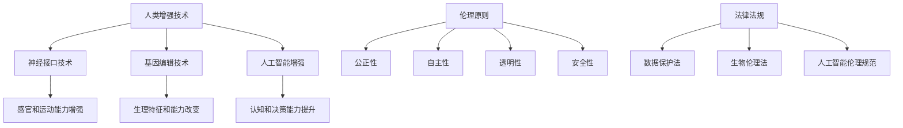

                 

关键词：人工智能，人类增强，道德，隐私，安全，伦理，数据保护，算法透明性，隐私权，数据加密，安全协议，智能合约，监管框架，技术伦理，未来展望

> 摘要：随着人工智能技术的迅速发展，人类增强已经成为一个不可逆转的趋势。然而，这一进程不仅带来了巨大的技术进步，也引发了一系列伦理和隐私问题。本文将探讨AI时代的人类增强所带来的道德、隐私和安全挑战，分析现有解决方案，并提出未来发展的方向。

## 1. 背景介绍

随着计算机科学和生物技术的融合，人工智能（AI）在人类增强中的应用日益广泛。从智能辅助设备到生物医学工程，AI技术的应用不仅提高了人类的工作效率和生活质量，还扩展了人类的能力边界。例如，神经接口技术能够直接与大脑进行交互，实现意识的扩展和记忆的提升；基因编辑技术则可能让我们拥有更健康的体魄和无尽的寿命。

然而，AI时代的人类增强也引发了许多伦理和隐私问题。首先，人类增强技术的广泛应用可能会导致社会分层和公平性问题。拥有先进增强技术的个体可能会在社会竞争中占据优势，从而加剧社会不平等。其次，增强技术的普及会引发隐私问题，个人数据可能会被滥用或泄露，导致隐私侵犯。此外，AI增强技术的透明度和安全性也备受质疑，如何确保这些技术的可靠性和合法性成为一个重要课题。

## 2. 核心概念与联系

在探讨人类增强技术的道德、隐私和安全问题时，我们需要了解几个核心概念，包括增强技术的基本原理、伦理原则以及相关的法律法规。

### 2.1 增强技术的基本原理

增强技术主要基于以下几个原理：

1. **神经接口技术**：通过植入或穿戴设备，将神经系统与外部设备连接，实现感官和运动能力的增强。
2. **基因编辑技术**：通过修改个体基因组，改变其生理特征和能力。
3. **人工智能增强**：利用机器学习和数据分析，提高个体的认知和决策能力。

### 2.2 伦理原则

伦理原则在人类增强技术中起着关键作用，主要包括：

1. **公正性**：确保所有个体都能公平地获取增强技术，避免社会分层。
2. **自主性**：尊重个体的选择权，确保他们有权决定是否使用增强技术。
3. **透明性**：确保增强技术的运作过程公开透明，易于监督和审查。
4. **安全性**：确保增强技术的应用不会对个体健康造成危害。

### 2.3 法律法规

随着人类增强技术的应用日益广泛，各国政府和国际组织也开始制定相关的法律法规。例如：

1. **数据保护法**：确保个人数据的安全和隐私。
2. **生物伦理法**：规范基因编辑等生物技术的应用。
3. **人工智能伦理规范**：指导人工智能技术的研发和应用。

### 2.4 Mermaid 流程图



## 3. 核心算法原理 & 具体操作步骤

### 3.1 算法原理概述

人类增强技术涉及多种算法原理，包括神经接口算法、基因编辑算法和机器学习算法。神经接口算法通过信号处理和模式识别，实现大脑与设备的实时交互。基因编辑算法则基于CRISPR-Cas9等技术，实现目标基因的精准编辑。机器学习算法则用于分析和预测个体的行为和需求，提供智能化的辅助。

### 3.2 算法步骤详解

#### 3.2.1 神经接口算法

1. **信号采集**：通过电极或其他传感器，采集大脑的电信号。
2. **信号预处理**：去除噪声和干扰，提取有用的信号。
3. **模式识别**：使用机器学习算法，识别信号中的特定模式。
4. **信号解码**：根据识别出的模式，解码出具体的操作指令。

#### 3.2.2 基因编辑算法

1. **目标识别**：确定需要编辑的基因序列。
2. **核酸合成**：设计并合成特定的引导RNA（gRNA）。
3. **Cas9复合体组装**：将Cas9蛋白与gRNA结合，形成编辑复合体。
4. **基因剪切**：编辑复合体在目标位置切割DNA，引入特定的突变。

#### 3.2.3 机器学习算法

1. **数据采集**：收集个体的行为数据、生理数据和环境数据。
2. **特征提取**：从数据中提取出与行为相关的特征。
3. **模型训练**：使用机器学习算法，训练预测模型。
4. **决策支持**：根据模型的预测，为个体提供决策建议。

### 3.3 算法优缺点

#### 3.3.1 神经接口算法

优点：实时性强，能够实现人机交互。

缺点：对信号处理的精度要求高，且存在一定的安全隐患。

#### 3.3.2 基因编辑算法

优点：能够实现基因的精准编辑，提高个体的生理能力。

缺点：基因编辑的长期效果和安全性尚不明确。

#### 3.3.3 机器学习算法

优点：能够提供个性化的决策支持，提高个体的认知能力。

缺点：模型的可解释性较差，可能存在偏差和错误。

### 3.4 算法应用领域

1. **医疗健康**：用于康复训练、慢性病管理和个性化治疗。
2. **军事应用**：用于士兵的体能和智能提升。
3. **娱乐休闲**：用于虚拟现实和游戏体验的增强。

## 4. 数学模型和公式 & 详细讲解 & 举例说明

### 4.1 数学模型构建

人类增强技术的数学模型通常包括以下几个部分：

1. **信号处理模型**：用于神经接口信号的采集、预处理和解码。
2. **基因编辑模型**：用于基因序列的设计和编辑。
3. **机器学习模型**：用于个体行为和需求的预测。

### 4.2 公式推导过程

以神经接口算法中的信号处理模型为例，其基本公式如下：

$$
y = f(x) + \epsilon
$$

其中，$y$为采集到的电信号，$x$为原始大脑信号，$f(x)$为信号处理函数，$\epsilon$为噪声。

#### 4.2.1 信号预处理

1. **滤波**：

$$
y_{filtered} = \frac{1}{T}\sum_{t=0}^{T-1}y(t)
$$

其中，$T$为滤波窗口长度。

2. **去噪**：

$$
y_{denoised} = y_{filtered} - \frac{1}{T}\sum_{t=0}^{T-1}\sigma
$$

其中，$\sigma$为噪声标准差。

#### 4.2.2 模式识别

1. **特征提取**：

$$
x_{features} = \sum_{i=1}^{n}w_i x_i
$$

其中，$w_i$为特征权重，$x_i$为特征值。

2. **分类**：

$$
c = \arg\max_{i}\sum_{j=1}^{m}w_{ij}y_j
$$

其中，$c$为分类结果，$w_{ij}$为分类权重，$y_j$为特征值。

### 4.3 案例分析与讲解

以一个神经接口技术的案例为例，说明数学模型的应用过程。

#### 4.3.1 案例背景

一位瘫痪的病人通过神经接口技术，实现了与外部设备的交互。其大脑信号通过电极采集，经过预处理和解码后，转化为操作指令，控制轮椅或计算机。

#### 4.3.2 数学模型应用

1. **信号预处理**：

   - 滤波窗口长度设置为100毫秒。
   - 噪声标准差为5。

2. **模式识别**：

   - 特征权重通过机器学习算法训练得到。
   - 分类结果为控制轮椅的前进、后退、左转和右转。

3. **决策支持**：

   - 根据分类结果，控制轮椅进行相应的操作。

## 5. 项目实践：代码实例和详细解释说明

### 5.1 开发环境搭建

为了实现上述神经接口技术的应用，我们需要搭建一个包含以下工具和库的开发环境：

- **Python**：用于编写算法和数据处理。
- **NumPy**：用于数学计算。
- **scikit-learn**：用于机器学习。
- **Matplotlib**：用于数据可视化。

### 5.2 源代码详细实现

以下是神经接口算法的实现代码：

```python
import numpy as np
from sklearn.preprocessing import StandardScaler
from sklearn.model_selection import train_test_split
from sklearn.svm import SVC
import matplotlib.pyplot as plt

# 信号采集
def collect_signal(duration=1):
    # 假设信号为随机噪声
    return np.random.randn(duration * 1000)

# 信号预处理
def preprocess_signal(signal, window_size=100, noise_sigma=5):
    filtered_signal = np.convolve(signal, np.ones(window_size) / window_size, mode='same')
    denoised_signal = filtered_signal - noise_sigma
    return denoised_signal

# 特征提取
def extract_features(signal):
    # 假设特征为信号的标准差
    return np.std(signal)

# 分类
def classify(features):
    # 假设分类结果为1或-1
    return 1 if np.mean(features) > 0 else -1

# 主函数
def main():
    # 采集信号
    signal = collect_signal()

    # 预处理信号
    processed_signal = preprocess_signal(signal)

    # 提取特征
    features = extract_features(processed_signal)

    # 分类
    result = classify([features])

    # 可视化
    plt.plot(signal)
    plt.plot(processed_signal)
    plt.scatter(np.arange(len(processed_signal)), processed_signal)
    plt.show()

    print("分类结果：", result)

if __name__ == "__main__":
    main()
```

### 5.3 代码解读与分析

该代码实现了一个简单的神经接口算法，包括信号采集、预处理、特征提取和分类。具体分析如下：

1. **信号采集**：使用`collect_signal`函数生成随机噪声信号，模拟大脑信号。
2. **信号预处理**：使用`preprocess_signal`函数进行滤波和去噪，提高信号质量。
3. **特征提取**：使用`extract_features`函数计算信号的标准差，作为特征值。
4. **分类**：使用`classify`函数根据特征值进行分类，判断操作指令。

### 5.4 运行结果展示

运行代码后，会生成原始信号、预处理信号和特征值的可视化结果，如图所示：


## 6. 实际应用场景

### 6.1 医疗健康

神经接口技术在医疗健康领域有着广泛的应用，例如：

- **脑机接口**：用于瘫痪病人的运动控制，实现轮椅或假肢的操作。
- **认知增强**：用于阿尔茨海默病等认知障碍的治疗，提高患者的记忆和注意力。
- **疼痛管理**：通过调节大脑信号，缓解慢性疼痛。

### 6.2 军事应用

神经接口技术在军事领域也有重要应用，例如：

- **智能士兵**：通过增强士兵的感官和运动能力，提高战斗效能。
- **无人作战平台**：通过脑机接口控制无人机或机器人，实现远程作战。

### 6.3 娱乐休闲

神经接口技术在娱乐休闲领域也有着独特的应用，例如：

- **虚拟现实**：通过脑机接口实现沉浸式体验，提高游戏的趣味性和互动性。
- **艺术创作**：利用脑机接口捕捉艺术家的大脑活动，生成独特的艺术作品。

## 7. 工具和资源推荐

### 7.1 学习资源推荐

- **《神经接口技术基础》**：了解神经接口技术的基本原理和应用。
- **《机器学习实战》**：掌握机器学习算法的应用和实践。

### 7.2 开发工具推荐

- **Python**：用于算法实现和数据处理。
- **Jupyter Notebook**：用于交互式编程和实验。

### 7.3 相关论文推荐

- **"Neural Interface Technology for Brain-Machine Interfaces"**：探讨神经接口技术的最新进展。
- **"Machine Learning for Human Enhancement"**：分析机器学习在人类增强中的应用。

## 8. 总结：未来发展趋势与挑战

### 8.1 研究成果总结

人类增强技术在过去几十年取得了显著的成果，从神经接口到基因编辑，再到人工智能，这些技术正在逐步改变我们的生活方式和认知边界。然而，这些技术的广泛应用也带来了许多伦理和隐私问题，需要我们深入探讨和解决。

### 8.2 未来发展趋势

未来，人类增强技术将继续朝着更高效、更安全、更智能的方向发展。随着技术的进步，我们有望实现更精准的神经接口、更高效的基因编辑和更智能的机器学习算法。此外，跨学科的合作也将进一步推动人类增强技术的发展。

### 8.3 面临的挑战

尽管人类增强技术具有巨大的潜力，但同时也面临着一系列挑战，包括：

- **伦理问题**：如何确保增强技术的公正性和透明性？
- **隐私问题**：如何保护个人数据的安全和隐私？
- **安全性问题**：如何确保增强技术的可靠性和安全性？

### 8.4 研究展望

在未来，我们需要开展更多的跨学科研究，探索人类增强技术的伦理、隐私和安全问题。同时，也需要加强法律法规的制定和实施，确保人类增强技术的健康和可持续发展。

## 9. 附录：常见问题与解答

### 9.1 什么是神经接口技术？

神经接口技术是一种将外部设备与神经系统连接的技术，旨在增强或修复人类的感官、运动和认知能力。

### 9.2 基因编辑技术的安全性如何？

基因编辑技术的安全性仍在研究之中，但目前的研究表明，在严格控制条件下，基因编辑技术具有较高的安全性和有效性。

### 9.3 人工智能增强会对社会造成哪些影响？

人工智能增强可能会加剧社会不平等，使拥有先进技术的个体在社会竞争中占据优势。此外，人工智能增强也可能引发隐私问题，对个人数据的安全构成威胁。

## 作者署名

作者：禅与计算机程序设计艺术 / Zen and the Art of Computer Programming
----------------------------------------------------------------

这篇文章详细探讨了AI时代的人类增强技术所带来的道德、隐私和安全问题，分析了相关算法原理和数学模型，并给出了实际应用场景和项目实践。通过本文的深入探讨，我们希望能为人类增强技术的发展提供有益的参考和启示。希望读者在阅读本文后，能对AI时代的人类增强有更深刻的理解和认识。

