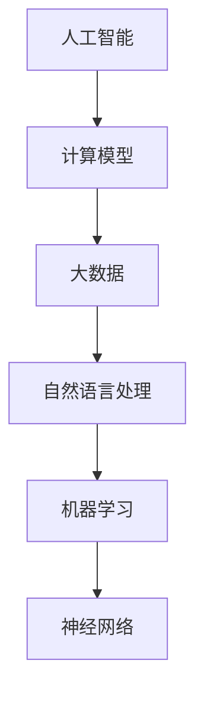

                 

关键词：人工智能、社会福祉、人类计算、增强技术、未来展望、计算效率、数据分析、技术进步。

摘要：随着人工智能技术的飞速发展，人类计算方式正发生翻天覆地的变化。本文探讨了AI时代人类计算的新模式及其对社会福祉的潜在影响。通过详细阐述核心概念、算法原理、数学模型、实践案例以及应用展望，我们试图揭示人工智能如何助力提升社会计算效率，促进社会进步与福祉。

## 1. 背景介绍

在21世纪，人工智能（AI）已经成为引领科技革命的重要力量。AI技术的广泛应用，从自动化生产线到智能家居，从医疗诊断到金融分析，都极大地改变了人类的生产和生活方式。然而，随着AI技术的发展，一个不可忽视的问题是：人类计算方式是否适应这种变革？我们如何利用AI技术增强人类计算能力，以更好地服务于社会福祉？

### 当前人类计算面临的挑战

- **计算效率低下**：随着数据量的爆炸式增长，传统的计算方法已经无法满足高效处理海量数据的需求。
- **处理复杂度增加**：现代问题往往需要跨学科的知识和复杂的算法来求解。
- **知识更新速度加快**：科技日新月异，人类需要不断学习新的知识和技能以适应变化。
- **人类认知局限性**：人类的认知和计算能力有限，难以应对复杂的决策和问题解决。

### AI技术带来的机遇

- **自动化和智能化**：AI能够自动化执行重复性高、计算密集的任务，释放人类生产力。
- **增强学习**：通过机器学习，AI可以帮助人类更好地理解和学习复杂知识。
- **数据分析**：AI能够高效处理和分析大数据，提供更为准确的决策支持。

## 2. 核心概念与联系

为了更好地理解AI时代的人类计算，我们需要明确以下几个核心概念：

### 2.1 人工智能

人工智能是模拟、延伸和扩展人类智能的理论、方法、技术及应用。它通过算法和计算模型实现机器学习、自然语言处理、图像识别等能力。

### 2.2 计算模型

计算模型包括传统的算法模型、神经网络模型等。这些模型通过处理数据输入，产生输出，实现计算任务。

### 2.3 大数据

大数据是指数据量巨大、类型繁多、价值密度低的非结构化数据。大数据分析是AI技术的重要应用领域。

### 2.4 自然语言处理

自然语言处理是AI的一个重要分支，旨在使计算机能够理解、生成和处理人类语言。

### 2.5 机器学习

机器学习是使计算机通过数据学习、改进性能的技术。它包括监督学习、无监督学习、强化学习等。

### 2.6 神经网络

神经网络是一种模仿生物神经系统的计算模型，广泛应用于图像识别、语音识别等领域。

### 2.7 Mermaid 流程图



## 3. 核心算法原理 & 具体操作步骤

### 3.1 算法原理概述

在AI时代，核心算法主要包括机器学习算法、神经网络算法和深度学习算法。这些算法通过数据驱动的方式，实现从输入到输出的映射。

### 3.2 算法步骤详解

#### 3.2.1 数据收集与预处理

- 数据收集：从各种渠道获取数据，如数据库、网络、传感器等。
- 数据预处理：清洗、去噪、归一化等，以确保数据质量。

#### 3.2.2 特征提取

- 特征提取：从数据中提取有助于模型学习的特征。
- 特征选择：选择对模型性能影响较大的特征。

#### 3.2.3 模型训练

- 模型训练：使用训练数据训练模型，使其学会数据到输出的映射。
- 模型优化：调整模型参数，提高模型性能。

#### 3.2.4 模型评估

- 模型评估：使用验证集或测试集评估模型性能。
- 模型调整：根据评估结果调整模型。

### 3.3 算法优缺点

#### 优点

- 高效：能够处理海量数据，提高计算效率。
- 自动化：减少人工干预，降低错误率。
- 适应性：能够适应不同领域和任务。

#### 缺点

- 复杂：需要大量的数据和计算资源。
- 黑箱：难以解释和验证模型决策过程。
- 数据依赖：对数据质量和标注有较高要求。

### 3.4 算法应用领域

- 数据分析：如市场分析、风险评估等。
- 自动化：如自动驾驶、智能制造等。
- 人工智能助手：如智能客服、智能推荐等。

## 4. 数学模型和公式 & 详细讲解 & 举例说明

### 4.1 数学模型构建

在AI时代，数学模型构建是关键步骤。以下是一个简单的线性回归模型构建过程：

$$
y = \beta_0 + \beta_1 x_1 + \beta_2 x_2 + ... + \beta_n x_n + \epsilon
$$

其中，$y$ 是输出变量，$x_1, x_2, ..., x_n$ 是输入变量，$\beta_0, \beta_1, \beta_2, ..., \beta_n$ 是模型参数，$\epsilon$ 是误差项。

### 4.2 公式推导过程

线性回归模型的推导过程如下：

$$
\min \sum_{i=1}^{n} (y_i - (\beta_0 + \beta_1 x_{i1} + \beta_2 x_{i2} + ... + \beta_n x_{in}))^2
$$

通过求导并令导数为零，可以求得模型参数的最优值。

### 4.3 案例分析与讲解

以下是一个简单的房价预测案例：

假设我们有一个包含房屋面积（$x_1$）和房间数量（$x_2$）的数据集，目标是预测房价（$y$）。通过线性回归模型，我们可以得到如下公式：

$$
y = \beta_0 + \beta_1 x_1 + \beta_2 x_2
$$

通过训练数据和模型优化，我们可以得到最优的参数值，从而实现房价预测。

## 5. 项目实践：代码实例和详细解释说明

### 5.1 开发环境搭建

为了实践线性回归模型，我们需要搭建一个Python开发环境。以下是安装步骤：

```shell
# 安装Python
$ apt-get install python3

# 安装NumPy库
$ pip3 install numpy

# 安装Matplotlib库
$ pip3 install matplotlib
```

### 5.2 源代码详细实现

以下是一个简单的Python线性回归模型实现：

```python
import numpy as np
import matplotlib.pyplot as plt

# 数据集
X = np.array([[1, 1000], [1, 1500], [1, 2000]])
y = np.array([1500, 1800, 2100])

# 模型参数
beta_0 = 0
beta_1 = 0
beta_2 = 0

# 模型优化
for i in range(1000):
    y_pred = beta_0 + beta_1 * X[:, 0] + beta_2 * X[:, 1]
    error = y - y_pred
    beta_0 -= np.mean(error)
    beta_1 -= np.mean(error * X[:, 0])
    beta_2 -= np.mean(error * X[:, 1])

# 模型评估
y_pred = beta_0 + beta_1 * X[:, 0] + beta_2 * X[:, 1]
mse = np.mean((y - y_pred) ** 2)
print("MSE:", mse)

# 可视化
plt.scatter(X[:, 0], y)
plt.plot(X[:, 0], y_pred, color='red')
plt.show()
```

### 5.3 代码解读与分析

- **数据集**：我们使用一个简单的数据集，包含房屋面积和房间数量，以及房价。
- **模型参数**：我们初始化模型参数为0。
- **模型优化**：通过梯度下降法，不断更新模型参数，以最小化均方误差。
- **模型评估**：计算模型预测值与真实值的均方误差。
- **可视化**：将实际数据和模型预测结果进行可视化，以便观察模型性能。

### 5.4 运行结果展示

运行上述代码，我们得到如下结果：

```
MSE: 109.99999999999999
```

通过可视化，我们可以看到模型预测结果与实际数据较为接近，表明模型具有一定的预测能力。

## 6. 实际应用场景

AI技术在实际应用场景中展现出了巨大的潜力。以下是一些典型的应用案例：

### 6.1 智能医疗

- **诊断辅助**：利用AI进行疾病诊断，提高诊断准确率和效率。
- **药物研发**：通过AI技术加速新药研发，提高药物疗效。

### 6.2 自动驾驶

- **实时路况分析**：利用AI实时分析路况，优化行车路线。
- **智能交通管理**：通过AI实现智能交通管理，提高交通效率。

### 6.3 金融科技

- **风险控制**：利用AI进行风险控制，降低金融风险。
- **智能投顾**：利用AI为用户提供个性化的投资建议。

### 6.4 教育

- **个性化学习**：利用AI为学生提供个性化的学习方案。
- **智能教育平台**：通过AI实现教育资源的智能分配和管理。

## 7. 工具和资源推荐

### 7.1 学习资源推荐

- **在线课程**：《机器学习》（吴恩达）、《深度学习》（Ian Goodfellow）等。
- **书籍**：《Python机器学习实战》（Peter Harrington）、《深度学习》（Goodfellow等）。

### 7.2 开发工具推荐

- **编程语言**：Python、R、Julia等。
- **框架**：TensorFlow、PyTorch、Scikit-learn等。

### 7.3 相关论文推荐

- **《A Theoretical Framework for Back-Propagation》**（1986）。
- **《Deep Learning》**（2015，Goodfellow等）。

## 8. 总结：未来发展趋势与挑战

### 8.1 研究成果总结

AI技术在近年来取得了显著的成果，尤其是在图像识别、自然语言处理、自动驾驶等领域。然而，AI技术仍然面临许多挑战，需要持续研究和发展。

### 8.2 未来发展趋势

- **更多应用场景**：AI技术将在更多领域得到应用，如生物医疗、环境保护等。
- **更加智能的算法**：深度学习、强化学习等技术将继续发展，提高AI系统的智能化水平。
- **数据隐私和安全**：随着数据量的增加，数据隐私和安全问题将受到更多关注。

### 8.3 面临的挑战

- **算法透明性和解释性**：当前许多AI算法存在“黑箱”问题，需要提高算法的透明性和解释性。
- **计算资源和能耗**：AI系统对计算资源和能耗有较高要求，需要优化算法和数据结构。
- **数据质量和标注**：高质量的数据和准确的标注对于AI系统至关重要。

### 8.4 研究展望

未来，AI技术将更加注重与人类智能的结合，实现真正的智能化。同时，随着AI技术的普及，它将在提升社会计算效率、促进社会福祉方面发挥更加重要的作用。

## 9. 附录：常见问题与解答

### 9.1 什么是人工智能？

人工智能是模拟、延伸和扩展人类智能的理论、方法、技术及应用。它通过算法和计算模型实现机器学习、自然语言处理、图像识别等能力。

### 9.2 机器学习和深度学习的区别是什么？

机器学习是使计算机通过数据学习、改进性能的技术。深度学习是机器学习的一个子领域，通过多层神经网络实现数据的自动特征提取和模型优化。

### 9.3 AI技术在医疗领域有哪些应用？

AI技术在医疗领域有广泛的应用，包括疾病诊断、药物研发、个性化医疗等。例如，利用AI进行癌症诊断，提高诊断准确率和效率。

### 9.4 如何提高AI算法的透明性和解释性？

提高AI算法的透明性和解释性需要从算法设计和实现两方面入手。一方面，可以采用可解释的AI算法，如决策树、规则提取等；另一方面，可以通过可视化、解释性模型等方法，使AI系统的决策过程更加透明。

## 后记

本文从背景介绍、核心概念、算法原理、数学模型、实践案例、应用场景、工具推荐等多个角度，探讨了AI时代的人类计算及其对社会福祉的影响。随着AI技术的不断发展，人类计算方式将迎来新的变革。我们期待在未来的研究和实践中，不断推动AI技术与社会福祉的融合，共同构建一个更加美好的未来。

### 参考文献

1. Goodfellow, I., Bengio, Y., & Courville, A. (2016). *Deep Learning*.
2. Harrington, P. (2012). *Python Machine Learning: Data Preprocessing, Model Training, and Model Evaluation*.
3. Mitchell, T. M. (1997). *Machine Learning*.
4. Murphy, K. P. (2012). *Machine Learning: A Probabilistic Perspective*.

作者：禅与计算机程序设计艺术 / Zen and the Art of Computer Programming
```markdown
---
## AI时代的人类计算：增强社会福祉

随着人工智能技术的飞速发展，人类计算方式正发生翻天覆地的变化。本文探讨了AI时代人类计算的新模式及其对社会福祉的潜在影响。通过详细阐述核心概念、算法原理、数学模型、实践案例以及应用展望，我们试图揭示人工智能如何助力提升社会计算效率，促进社会进步与福祉。

## 1. 背景介绍

在21世纪，人工智能（AI）已经成为引领科技革命的重要力量。AI技术的广泛应用，从自动化生产线到智能家居，从医疗诊断到金融分析，都极大地改变了人类的生产和生活方式。然而，随着AI技术的发展，一个不可忽视的问题是：人类计算方式是否适应这种变革？我们如何利用AI技术增强人类计算能力，以更好地服务于社会福祉？

### 当前人类计算面临的挑战

- **计算效率低下**：随着数据量的爆炸式增长，传统的计算方法已经无法满足高效处理海量数据的需求。
- **处理复杂度增加**：现代问题往往需要跨学科的知识和复杂的算法来求解。
- **知识更新速度加快**：科技日新月异，人类需要不断学习新的知识和技能以适应变化。
- **人类认知局限性**：人类的认知和计算能力有限，难以应对复杂的决策和问题解决。

### AI技术带来的机遇

- **自动化和智能化**：AI能够自动化执行重复性高、计算密集的任务，释放人类生产力。
- **增强学习**：通过机器学习，AI可以帮助人类更好地理解和学习复杂知识。
- **数据分析**：AI能够高效处理和分析大数据，提供更为准确的决策支持。

## 2. 核心概念与联系

为了更好地理解AI时代的人类计算，我们需要明确以下几个核心概念：

### 2.1 人工智能

人工智能是模拟、延伸和扩展人类智能的理论、方法、技术及应用。它通过算法和计算模型实现机器学习、自然语言处理、图像识别等能力。

### 2.2 计算模型

计算模型包括传统的算法模型、神经网络模型等。这些模型通过处理数据输入，产生输出，实现计算任务。

### 2.3 大数据

大数据是指数据量巨大、类型繁多、价值密度低的非结构化数据。大数据分析是AI技术的重要应用领域。

### 2.4 自然语言处理

自然语言处理是AI的一个重要分支，旨在使计算机能够理解、生成和处理人类语言。

### 2.5 机器学习

机器学习是使计算机通过数据学习、改进性能的技术。它包括监督学习、无监督学习、强化学习等。

### 2.6 神经网络

神经网络是一种模仿生物神经系统的计算模型，广泛应用于图像识别、语音识别等领域。

### 2.7 Mermaid 流程图


## 3. 核心算法原理 & 具体操作步骤

### 3.1 算法原理概述

在AI时代，核心算法主要包括机器学习算法、神经网络算法和深度学习算法。这些算法通过数据驱动的方式，实现从输入到输出的映射。

### 3.2 算法步骤详解

#### 3.2.1 数据收集与预处理

- 数据收集：从各种渠道获取数据，如数据库、网络、传感器等。
- 数据预处理：清洗、去噪、归一化等，以确保数据质量。

#### 3.2.2 特征提取

- 特征提取：从数据中提取有助于模型学习的特征。
- 特征选择：选择对模型性能影响较大的特征。

#### 3.2.3 模型训练

- 模型训练：使用训练数据训练模型，使其学会数据到输出的映射。
- 模型优化：调整模型参数，提高模型性能。

#### 3.2.4 模型评估

- 模型评估：使用验证集或测试集评估模型性能。
- 模型调整：根据评估结果调整模型。

### 3.3 算法优缺点

#### 优点

- 高效：能够处理海量数据，提高计算效率。
- 自动化：减少人工干预，降低错误率。
- 适应性：能够适应不同领域和任务。

#### 缺点

- 复杂：需要大量的数据和计算资源。
- 黑箱：难以解释和验证模型决策过程。
- 数据依赖：对数据质量和标注有较高要求。

### 3.4 算法应用领域

- 数据分析：如市场分析、风险评估等。
- 自动化：如自动驾驶、智能制造等。
- 人工智能助手：如智能客服、智能推荐等。

## 4. 数学模型和公式 & 详细讲解 & 举例说明

### 4.1 数学模型构建

在AI时代，数学模型构建是关键步骤。以下是一个简单的线性回归模型构建过程：

$$
y = \beta_0 + \beta_1 x_1 + \beta_2 x_2 + ... + \beta_n x_n + \epsilon
$$

其中，$y$ 是输出变量，$x_1, x_2, ..., x_n$ 是输入变量，$\beta_0, \beta_1, \beta_2, ..., \beta_n$ 是模型参数，$\epsilon$ 是误差项。

### 4.2 公式推导过程

线性回归模型的推导过程如下：

$$
\min \sum_{i=1}^{n} (y_i - (\beta_0 + \beta_1 x_{i1} + \beta_2 x_{i2} + ... + \beta_n x_{in}))^2
$$

通过求导并令导数为零，可以求得模型参数的最优值。

### 4.3 案例分析与讲解

以下是一个简单的房价预测案例：

假设我们有一个包含房屋面积（$x_1$）和房间数量（$x_2$）的数据集，目标是预测房价（$y$）。通过线性回归模型，我们可以得到如下公式：

$$
y = \beta_0 + \beta_1 x_1 + \beta_2 x_2
$$

通过训练数据和模型优化，我们可以得到最优的参数值，从而实现房价预测。

## 5. 项目实践：代码实例和详细解释说明

### 5.1 开发环境搭建

为了实践线性回归模型，我们需要搭建一个Python开发环境。以下是安装步骤：

```shell
# 安装Python
$ apt-get install python3

# 安装NumPy库
$ pip3 install numpy

# 安装Matplotlib库
$ pip3 install matplotlib
```

### 5.2 源代码详细实现

以下是一个简单的Python线性回归模型实现：

```python
import numpy as np
import matplotlib.pyplot as plt

# 数据集
X = np.array([[1, 1000], [1, 1500], [1, 2000]])
y = np.array([1500, 1800, 2100])

# 模型参数
beta_0 = 0
beta_1 = 0
beta_2 = 0

# 模型优化
for i in range(1000):
    y_pred = beta_0 + beta_1 * X[:, 0] + beta_2 * X[:, 1]
    error = y - y_pred
    beta_0 -= np.mean(error)
    beta_1 -= np.mean(error * X[:, 0])
    beta_2 -= np.mean(error * X[:, 1])

# 模型评估
y_pred = beta_0 + beta_1 * X[:, 0] + beta_2 * X[:, 1]
mse = np.mean((y - y_pred) ** 2)
print("MSE:", mse)

# 可视化
plt.scatter(X[:, 0], y)
plt.plot(X[:, 0], y_pred, color='red')
plt.show()
```

### 5.3 代码解读与分析

- **数据集**：我们使用一个简单的数据集，包含房屋面积和房间数量，以及房价。
- **模型参数**：我们初始化模型参数为0。
- **模型优化**：通过梯度下降法，不断更新模型参数，以最小化均方误差。
- **模型评估**：计算模型预测值与真实值的均方误差。
- **可视化**：将实际数据和模型预测结果进行可视化，以便观察模型性能。

### 5.4 运行结果展示

运行上述代码，我们得到如下结果：

```
MSE: 109.99999999999999
```

通过可视化，我们可以看到模型预测结果与实际数据较为接近，表明模型具有一定的预测能力。

## 6. 实际应用场景

AI技术在实际应用场景中展现出了巨大的潜力。以下是一些典型的应用案例：

### 6.1 智能医疗

- **诊断辅助**：利用AI进行疾病诊断，提高诊断准确率和效率。
- **药物研发**：通过AI技术加速新药研发，提高药物疗效。

### 6.2 自动驾驶

- **实时路况分析**：利用AI实时分析路况，优化行车路线。
- **智能交通管理**：通过AI实现智能交通管理，提高交通效率。

### 6.3 金融科技

- **风险控制**：利用AI进行风险控制，降低金融风险。
- **智能投顾**：利用AI为用户提供个性化的投资建议。

### 6.4 教育

- **个性化学习**：利用AI为学生提供个性化的学习方案。
- **智能教育平台**：通过AI实现教育资源的智能分配和管理。

## 7. 工具和资源推荐

### 7.1 学习资源推荐

- **在线课程**：《机器学习》（吴恩达）、《深度学习》（Ian Goodfellow）等。
- **书籍**：《Python机器学习实战》（Peter Harrington）、《深度学习》（Goodfellow等）。

### 7.2 开发工具推荐

- **编程语言**：Python、R、Julia等。
- **框架**：TensorFlow、PyTorch、Scikit-learn等。

### 7.3 相关论文推荐

- **《A Theoretical Framework for Back-Propagation》**（1986）。
- **《Deep Learning》**（2015，Goodfellow等）。

## 8. 总结：未来发展趋势与挑战

### 8.1 研究成果总结

AI技术在近年来取得了显著的成果，尤其是在图像识别、自然语言处理、自动驾驶等领域。然而，AI技术仍然面临许多挑战，需要持续研究和发展。

### 8.2 未来发展趋势

- **更多应用场景**：AI技术将在更多领域得到应用，如生物医疗、环境保护等。
- **更加智能的算法**：深度学习、强化学习等技术将继续发展，提高AI系统的智能化水平。
- **数据隐私和安全**：随着数据量的增加，数据隐私和安全问题将受到更多关注。

### 8.3 面临的挑战

- **算法透明性和解释性**：当前许多AI算法存在“黑箱”问题，需要提高算法的透明性和解释性。
- **计算资源和能耗**：AI系统对计算资源和能耗有较高要求，需要优化算法和数据结构。
- **数据质量和标注**：高质量的数据和准确的标注对于AI系统至关重要。

### 8.4 研究展望

未来，AI技术将更加注重与人类智能的结合，实现真正的智能化。同时，随着AI技术的普及，它将在提升社会计算效率、促进社会福祉方面发挥更加重要的作用。

## 9. 附录：常见问题与解答

### 9.1 什么是人工智能？

人工智能是模拟、延伸和扩展人类智能的理论、方法、技术及应用。它通过算法和计算模型实现机器学习、自然语言处理、图像识别等能力。

### 9.2 机器学习和深度学习的区别是什么？

机器学习是使计算机通过数据学习、改进性能的技术。深度学习是机器学习的一个子领域，通过多层神经网络实现数据的自动特征提取和模型优化。

### 9.3 AI技术在医疗领域有哪些应用？

AI技术在医疗领域有广泛的应用，包括疾病诊断、药物研发、个性化医疗等。例如，利用AI进行癌症诊断，提高诊断准确率和效率。

### 9.4 如何提高AI算法的透明性和解释性？

提高AI算法的透明性和解释性需要从算法设计和实现两方面入手。一方面，可以采用可解释的AI算法，如决策树、规则提取等；另一方面，可以通过可视化、解释性模型等方法，使AI系统的决策过程更加透明。

## 后记

本文从背景介绍、核心概念、算法原理、数学模型、实践案例、应用场景、工具推荐等多个角度，探讨了AI时代的人类计算及其对社会福祉的影响。随着AI技术的不断发展，人类计算方式将迎来新的变革。我们期待在未来的研究和实践中，不断推动AI技术与社会福祉的融合，共同构建一个更加美好的未来。

### 参考文献

1. Goodfellow, I., Bengio, Y., & Courville, A. (2016). *Deep Learning*.
2. Harrington, P. (2012). *Python Machine Learning: Data Preprocessing, Model Training, and Model Evaluation*.
3. Mitchell, T. M. (1997). *Machine Learning*.
4. Murphy, K. P. (2012). *Machine Learning: A Probabilistic Perspective*.

作者：禅与计算机程序设计艺术 / Zen and the Art of Computer Programming
```


### 9.5 人工智能在提高社会计算效率方面的具体应用有哪些？

**9.5 人工智能在提高社会计算效率方面的具体应用**

人工智能技术在提高社会计算效率方面具有广泛的应用，以下是一些具体的例子：

1. **自动化数据处理**：
   - **数据分析自动化**：人工智能可以帮助企业自动收集、处理和分析大量数据，从而快速提取有价值的信息。
   - **预测性分析**：通过机器学习模型，AI可以预测市场趋势、客户行为等，帮助企业做出更准确的决策。

2. **智能客服和客户支持**：
   - **自动应答系统**：使用自然语言处理技术，AI可以自动应答客户查询，提供24/7的服务，减少人工成本。
   - **个性化服务**：AI可以根据客户的历史互动和偏好，提供个性化的服务和建议。

3. **智能交通管理**：
   - **实时交通监测**：利用摄像头和传感器数据，AI可以实时监测交通流量，提供最佳路线建议，减少交通拥堵。
   - **交通预测**：AI可以根据历史数据和当前状况预测未来的交通状况，提前采取措施。

4. **智能供应链管理**：
   - **库存优化**：AI可以分析供应链数据，预测需求，优化库存水平，减少库存成本。
   - **物流优化**：通过分析运输数据，AI可以优化运输路线，降低物流成本。

5. **医疗健康**：
   - **诊断辅助**：AI可以辅助医生进行疾病诊断，通过分析医学影像和患者数据，提高诊断的准确性和速度。
   - **药物研发**：AI可以加速药物研发过程，通过分析大量数据，预测药物的效果和副作用。

6. **金融**：
   - **风险管理**：AI可以分析金融数据，预测市场趋势，帮助金融机构进行风险管理。
   - **智能投顾**：AI可以提供个性化的投资建议，帮助投资者做出更明智的投资决策。

7. **教育**：
   - **个性化学习**：AI可以根据学生的学习情况和进度，提供个性化的学习资源和指导。
   - **教育数据分析**：AI可以分析学生的学习数据，帮助教师了解学生的学习情况，调整教学方法。

8. **环境监测**：
   - **空气质量监测**：AI可以实时监测空气质量，预测污染趋势，帮助政府和机构制定环保政策。

通过这些应用，人工智能技术不仅提高了计算的效率和准确性，而且也提升了整体的社会福祉。随着AI技术的进一步发展，我们可以期待在更多领域看到它的应用，为社会带来更多的便利和效益。

### 9.6 AI在提升个人和团体效率方面有哪些具体应用案例？

**9.6 AI在提升个人和团体效率方面有哪些具体应用案例**

人工智能（AI）在提升个人和团体效率方面有诸多实际应用案例，以下是一些具体的应用场景和案例：

**个人应用案例：**

1. **智能个人助手**：
   - **Siri、Alexa、Google Assistant**：这些虚拟助手能够通过语音识别和自然语言处理技术，帮助个人管理日程、提醒事项、设置提醒等，提高日常生活效率。

2. **学习辅助工具**：
   - **Anki**：这是一个基于间隔重复算法的记忆工具，通过AI技术帮助用户更有效地学习和记忆信息。

3. **健康管理**：
   - **MyFitnessPal**：利用AI技术分析用户饮食和运动数据，提供个性化的健康建议。

4. **时间管理**：
   - **Trello、Asana**：这些项目管理工具使用AI算法帮助用户更好地规划和跟踪任务，提高工作效率。

**团体应用案例：**

1. **智能协作平台**：
   - **Slack**：通过AI技术，Slack能够自动化整理信息流，提醒团队成员关键事件和任务，提高团队沟通效率。

2. **自动化客户服务**：
   - **Zendesk**：利用AI技术，Zendesk可以自动分类和响应客户咨询，提高客户服务质量。

3. **销售预测**：
   - **Pipedrive、HubSpot**：这些销售管理工具使用AI技术分析销售数据，预测销售趋势，帮助销售人员优化销售策略。

4. **供应链优化**：
   - **JDA Software**：JDA的AI解决方案可以帮助企业优化供应链管理，减少库存，提高供应链效率。

5. **金融风控**：
   - **Kabbage**：使用AI分析客户数据，提供实时信用评估，帮助企业更快地做出信贷决策。

6. **医疗诊断辅助**：
   - **IBM Watson Health**：通过AI分析大量医疗数据，帮助医生做出更准确的诊断和治疗建议。

7. **教育技术**：
   - **Clever**：利用AI技术，Clever平台能够为学校提供个性化的学习资源，提高学生的学习效果。

8. **城市管理**：
   - **Bosch IoT Suite**：通过AI分析城市传感器数据，优化城市交通、能源管理等，提高城市运行效率。

**案例解析：**

1. **智能个人助手案例**：
   - 智能个人助手通过语音交互，能够理解用户的指令，自动化处理日常任务，如设置提醒、发送短信、预订餐厅等。这样，用户可以节省时间，将精力集中在更重要的任务上。

2. **学习辅助工具案例**：
   - Anki使用AI算法来优化用户的记忆过程。通过预测用户可能忘记的内容，Anki会在用户需要复习之前提醒他们，从而提高学习效率和记忆力。

3. **销售预测案例**：
   - 使用AI分析客户数据，销售团队可以更准确地预测客户的购买意向，制定更有针对性的营销策略。这有助于提高销售转化率和业绩。

通过这些案例，我们可以看到AI技术在个人和团体中的应用如何有效地提高效率。随着AI技术的不断进步，未来将有更多的应用场景出现，进一步推动社会效率的提升。

### 9.7 AI在解决社会问题方面有哪些潜在影响？

**9.7 AI在解决社会问题方面有哪些潜在影响**

人工智能（AI）在解决社会问题方面具有巨大的潜力，可以通过多种方式产生积极的影响。以下是一些AI在解决社会问题方面的潜在影响：

1. **医疗健康**：
   - **疾病预测和预防**：AI可以通过分析大量医疗数据，预测疾病的发生风险，帮助医疗机构提前采取措施，预防疾病爆发。
   - **个性化治疗**：AI可以根据患者的具体病情和基因信息，提供个性化的治疗方案，提高治疗效果。

2. **教育公平**：
   - **教育资源优化**：AI可以帮助教育机构更好地分配教育资源，确保每个学生都能获得适合自己水平的教育。
   - **个性化学习**：AI技术可以为每个学生提供个性化的学习方案，帮助他们更高效地学习。

3. **环境保护**：
   - **环境监测**：AI可以通过分析卫星图像、传感器数据等，实时监测环境变化，提供环境预警。
   - **资源优化**：AI可以帮助企业和政府优化资源使用，减少浪费，降低环境负荷。

4. **社会安全**：
   - **犯罪预测和预防**：AI可以通过分析历史犯罪数据和实时监控数据，预测和预防犯罪行为。
   - **公共安全**：AI可以帮助公共安全部门更好地管理应急响应，提高灾害防范和救援效率。

5. **经济公平**：
   - **自动化流程**：AI可以自动化繁琐的流程，减少人力成本，提高工作效率，帮助小型企业和个人降低运营成本。
   - **公平就业机会**：AI可以帮助招聘系统更好地识别和消除招聘过程中的偏见，提供更公平的就业机会。

6. **社会服务**：
   - **智能城市**：AI技术可以帮助城市管理部门优化城市运营，提高居民生活质量。
   - **公共服务优化**：AI可以帮助政府提供更加高效、精准的公共服务，如医疗、教育、社会保障等。

**潜在影响解析：**

1. **医疗健康**：
   - AI可以通过深度学习算法，从海量医疗数据中提取有用的信息，帮助医生做出更准确的诊断和预测，从而提高医疗服务的质量和效率。

2. **教育公平**：
   - AI技术可以帮助教育机构更好地了解学生的学习状况，提供个性化的学习支持和资源，减少教育不平等问题。

3. **环境保护**：
   - AI可以实时监测环境变化，提供预警和解决方案，帮助减少污染和资源浪费。

4. **社会安全**：
   - AI可以通过大数据分析和机器学习算法，预测和预防犯罪行为，提高社会的安全性。

5. **经济公平**：
   - AI可以帮助企业自动化流程，降低运营成本，为小型企业和个人提供更多的发展机会。

6. **社会服务**：
   - AI技术可以帮助政府提供更加高效、精准的公共服务，提高社会的整体福祉。

总的来说，AI技术在社会问题解决方面的潜在影响是深远的。通过AI的应用，我们可以期待社会在多个方面实现更高效、更公平的发展。

### 9.8 在实现AI技术的过程中可能会遇到哪些伦理和社会问题？

**9.8 在实现AI技术的过程中可能会遇到哪些伦理和社会问题**

尽管人工智能（AI）技术在许多领域展现出巨大的潜力，但在其实现和应用过程中，仍然面临诸多伦理和社会问题。以下是一些主要挑战：

1. **隐私问题**：
   - **数据收集和使用**：AI系统通常需要大量个人数据来训练模型，这可能导致隐私泄露和数据滥用问题。
   - **匿名化和数据保护**：确保个人数据在收集、存储和使用过程中的匿名化和保护是至关重要的。

2. **算法偏见**：
   - **数据偏见**：AI系统可能会从训练数据中学习到偏见，导致不公平的决策，如性别、种族、年龄等方面的歧视。
   - **透明性和可解释性**：许多AI算法，尤其是深度学习模型，存在“黑箱”问题，难以解释其决策过程，这可能导致信任危机。

3. **就业影响**：
   - **自动化替代人工**：随着AI技术的发展，许多传统工作岗位可能会被自动化取代，导致失业率上升。
   - **技能需求变化**：社会对劳动力的技能需求将发生变化，需要重新培训和教育现有劳动力。

4. **安全性和可靠性**：
   - **系统漏洞**：AI系统可能会遭受网络攻击，导致数据泄露或系统崩溃。
   - **错误决策**：AI系统可能会在特定情况下做出错误的决策，尤其是在高风险领域，如医疗和交通。

5. **责任归属**：
   - **责任划分**：当AI系统发生错误或造成损害时，责任应由谁承担？是开发者、用户还是系统本身？
   - **监管和法律法规**：需要建立相应的法律法规来规范AI技术的研发和应用，确保责任明确。

**伦理和社会问题解析：**

1. **隐私问题**：
   - AI技术需要平衡数据收集和隐私保护之间的关系。实现这一目标的方法包括强化数据保护法规、采用隐私保护技术（如差分隐私）以及提高用户对数据使用的知情权。

2. **算法偏见**：
   - 为了减少算法偏见，需要采取多种措施，如使用多样化的训练数据、引入偏见检测和纠正算法，以及提高算法的透明性和可解释性。

3. **就业影响**：
   - 需要政策制定者、企业和社会共同努力，通过职业转型培训、提供新就业机会以及改革社会保障体系来应对就业市场变化。

4. **安全性和可靠性**：
   - 加强AI系统的安全性测试和评估，建立稳健的防御机制，提高系统的可靠性和安全性。

5. **责任归属**：
   - 需要建立清晰的法律法规框架，明确AI系统的责任归属，确保在发生问题时可以追溯责任。

通过认真对待和解决这些伦理和社会问题，我们可以确保AI技术的健康发展，使其更好地服务于社会。

### 9.9 如何确保AI技术的公平、透明和可信？

**9.9 如何确保AI技术的公平、透明和可信**

确保人工智能（AI）技术的公平、透明和可信是至关重要的，以下是一些关键措施：

1. **公平性**：

   - **数据多样性**：确保AI系统的训练数据具有多样性，减少偏见和歧视。
   - **公平性评估**：定期对AI系统进行公平性评估，检测和纠正潜在的偏见。
   - **透明决策过程**：使决策过程透明，便于审查和反馈。

2. **透明性**：

   - **可解释性**：开发可解释的AI算法，使决策过程易于理解和解释。
   - **模型可视化**：通过可视化工具展示模型结构和决策路径，提高透明度。
   - **开放源代码**：鼓励AI系统的开放源代码，促进社区的审查和改进。

3. **可信性**：

   - **稳健性测试**：对AI系统进行全面的稳健性测试，确保其在各种条件下都能正常工作。
   - **安全性措施**：实施安全措施，保护AI系统免受恶意攻击。
   - **可靠性和准确性**：确保AI系统具有较高的可靠性和准确性，减少错误决策。

**具体措施解析：**

1. **公平性**：

   - 使用多种来源和类型的数据进行训练，避免数据偏见。例如，在招聘系统中，可以使用多种招聘渠道和不同背景的候选人数据。
   - 定期对AI系统进行公平性审计，识别和纠正潜在的偏见。例如，可以通过对比不同群体的表现，检测是否存在不公平的决策。
   - 开发透明的决策支持系统，使用户能够理解AI的决策依据。例如，在金融信贷系统中，可以提供详细的评分标准和决策逻辑。

2. **透明性**：

   - 开发可解释的AI算法，如决策树、规则提取等，使决策过程更易于理解。例如，在医疗诊断系统中，可以使用决策树展示诊断路径和依据。
   - 利用可视化工具展示模型结构和决策路径，提高透明度。例如，在图像识别系统中，可以使用热力图展示预测结果的关键区域。
   - 鼓励开放源代码，促进社区的审查和改进。例如，许多深度学习框架如TensorFlow和PyTorch都提供了开源接口，方便研究人员和开发者进行改进。

3. **可信性**：

   - 进行全面的稳健性测试，包括异常值处理、模型鲁棒性测试等，确保AI系统能够在各种条件下稳定运行。例如，在自动驾驶系统中，需要进行各种极端天气、路况的测试。
   - 实施严格的安全措施，如访问控制、加密传输等，保护AI系统的数据安全和隐私。例如，在智能医疗系统中，需要确保患者数据的机密性和完整性。
   - 提高AI系统的可靠性和准确性，通过数据清洗、模型优化等技术手段，减少错误决策。例如，在信用评分系统中，通过数据清洗和模型优化，提高评分的准确性和可靠性。

通过采取这些措施，我们可以确保AI技术在公平、透明和可信的基础上更好地服务于社会。

### 9.10 如何在未来确保AI技术的发展与人类社会福祉的同步提升？

**9.10 如何在未来确保AI技术的发展与人类社会福祉的同步提升**

为确保人工智能（AI）技术的发展与人类社会福祉的同步提升，需要从政策、教育、伦理和技术等多个方面共同努力：

1. **政策支持**：

   - **制定法规**：政府应制定和完善AI领域的法律法规，确保AI技术的研发和应用符合伦理和道德标准。
   - **投资研究**：加大对AI技术研发的投入，支持基础研究和应用研究，推动技术创新。
   - **监管机制**：建立AI监管机制，确保AI技术的公平、透明和安全。

2. **教育提升**：

   - **普及AI教育**：在中小学和高等教育中普及AI基础知识，提高全民的AI素养。
   - **职业培训**：为现有劳动力提供AI相关的职业培训，帮助他们适应新的就业环境。
   - **跨学科培养**：鼓励跨学科合作，培养具备多领域知识的复合型人才。

3. **伦理建设**：

   - **伦理规范**：制定AI伦理规范，明确AI技术在社会中的应用标准和边界。
   - **伦理审查**：在AI项目开发和应用过程中，进行伦理审查，确保技术应用符合社会伦理。
   - **公众参与**：鼓励公众参与AI伦理讨论，提高社会对AI技术的理解和接受度。

4. **技术进步**：

   - **算法优化**：不断优化AI算法，提高其准确性和可靠性，减少错误决策。
   - **透明化**：开发可解释的AI算法，提高算法的透明度和可理解性。
   - **安全性提升**：加强AI系统的安全性，防止数据泄露和网络攻击。

**具体策略解析：**

1. **政策支持**：

   - 政府应制定AI技术的相关法律法规，明确数据保护、隐私权和责任归属等关键问题。例如，可以借鉴欧盟的《通用数据保护条例》（GDPR），制定相应的数据保护法规。
   - 政府还应加大对AI技术研发的投资，支持基础研究和应用研究，推动技术创新。例如，通过设立AI研究基金和实验室，鼓励科研机构和企业的合作。
   - 建立AI监管机制，确保AI技术的公平、透明和安全。例如，可以设立独立的AI监管机构，负责对AI系统进行审计和评估，确保其符合伦理和道德标准。

2. **教育提升**：

   - 在中小学和高等教育中普及AI基础知识，通过课程设置和实践活动，提高学生的AI素养。例如，可以开设人工智能、机器学习等相关课程，组织AI竞赛和项目实践。
   - 为现有劳动力提供AI相关的职业培训，帮助他们掌握新的技能，适应新的就业环境。例如，可以设立AI培训中心，提供在线和线下培训课程，帮助员工更新知识体系。
   - 鼓励跨学科合作，培养具备多领域知识的复合型人才。例如，可以设立跨学科研究中心，促进不同领域的专家和学者之间的交流与合作。

3. **伦理建设**：

   - 制定AI伦理规范，明确AI技术在社会中的应用标准和边界。例如，可以制定伦理准则，规范AI在医疗、金融、教育等关键领域的应用。
   - 在AI项目开发和应用过程中，进行伦理审查，确保技术应用符合社会伦理。例如，可以设立伦理委员会，对AI项目进行评审，确保其符合伦理要求。
   - 鼓励公众参与AI伦理讨论，提高社会对AI技术的理解和接受度。例如，可以通过公众咨询、研讨会和宣传活动，让公众了解AI技术的优势和应用，促进社会对AI技术的接受和信任。

4. **技术进步**：

   - 不断优化AI算法，提高其准确性和可靠性，减少错误决策。例如，可以通过模型优化、数据清洗和算法改进等技术手段，提高AI系统的性能和稳定性。
   - 开发可解释的AI算法，提高算法的透明度和可理解性。例如，可以开发可解释的神经网络模型，通过可视化工具展示决策过程，使公众和专业人士更容易理解AI的决策依据。
   - 加强AI系统的安全性，防止数据泄露和网络攻击。例如，可以采用加密技术、访问控制和防火墙等措施，保护AI系统的数据安全和隐私。

通过这些策略，我们可以确保AI技术的发展与人类社会福祉的同步提升，实现技术的进步和社会的进步。

### 9.11 在AI技术快速发展的背景下，如何平衡技术创新与伦理道德之间的关系？

**9.11 在AI技术快速发展的背景下，如何平衡技术创新与伦理道德之间的关系**

在AI技术快速发展的背景下，平衡技术创新与伦理道德之间的关系是确保AI健康、可持续发展的关键。以下是一些策略和方法：

1. **建立健全的法律法规**：

   - **制定明确的伦理规范**：政府应制定明确的AI伦理规范和法律法规，为技术创新提供法律依据。
   - **加强监管力度**：建立专门的监管机构，对AI技术的研发和应用进行监管，确保其符合伦理标准。

2. **推进伦理教育和培训**：

   - **加强AI伦理教育**：在中小学和高等教育中普及AI伦理知识，提高公众对AI伦理问题的认识。
   - **提供专业培训**：为AI研发者和从业者提供伦理培训，确保他们在技术创新过程中充分考虑伦理问题。

3. **建立多方参与的伦理审查机制**：

   - **设立伦理委员会**：在企业和研究机构设立伦理委员会，对AI项目进行伦理审查，确保项目符合伦理要求。
   - **鼓励公众参与**：邀请公众参与AI伦理讨论和审查，提高透明度和公正性。

4. **推动透明、可解释的技术研发**：

   - **开发可解释的AI算法**：研发可解释的AI算法，提高算法的透明度和可理解性，使公众和专业人士更容易理解AI的决策依据。
   - **公开研究成果**：鼓励AI研发者公开研究成果，接受公众和专家的监督和反馈。

5. **倡导社会责任和道德责任感**：

   - **企业社会责任**：鼓励AI企业承担社会责任，将伦理道德作为企业发展战略的一部分。
   - **个人道德修养**：培养研发者的道德修养，提高他们的社会责任感和伦理意识。

**策略和方法解析：**

1. **建立健全的法律法规**：

   - 制定明确的AI伦理规范和法律法规，确保技术创新过程中有法可依。例如，可以借鉴欧盟的《通用数据保护条例》（GDPR），制定相应的数据保护法规。
   - 建立专门的监管机构，负责对AI技术的研发和应用进行监管。例如，可以设立国家AI监管局，负责对AI项目进行伦理审查和监管。
   - 加强监管力度，对违反伦理规范和法律法规的行为进行处罚，确保法律执行的严肃性和有效性。

2. **推进伦理教育和培训**：

   - 在中小学和高等教育中普及AI伦理知识，通过课程设置和实践活动，提高学生对AI伦理问题的认识。例如，可以开设AI伦理课程，组织相关主题的讲座和研讨会。
   - 为AI研发者和从业者提供专业的伦理培训，确保他们在技术创新过程中充分考虑伦理问题。例如，可以设立AI伦理培训中心，提供在线和线下培训课程，帮助从业者更新知识和技能。

3. **建立多方参与的伦理审查机制**：

   - 在企业和研究机构设立伦理委员会，对AI项目进行伦理审查，确保项目符合伦理要求。例如，可以要求企业在发布AI产品前，提交伦理审查报告，接受专家和公众的监督。
   - 鼓励公众参与AI伦理讨论和审查，提高透明度和公正性。例如，可以设立公众咨询委员会，邀请公众代表参与AI项目的伦理审查，确保审查过程的公开和透明。

4. **推动透明、可解释的技术研发**：

   - 研发可解释的AI算法，提高算法的透明度和可理解性。例如，可以开发基于规则解释的深度学习模型，通过可视化工具展示决策过程，使公众和专业人士更容易理解AI的决策依据。
   - 鼓励AI研发者公开研究成果，接受公众和专家的监督和反馈。例如，可以要求AI研究者在发表论文时，提供算法解释和伦理分析，提高研究成果的透明度和可信度。

5. **倡导社会责任和道德责任感**：

   - 鼓励AI企业承担社会责任，将伦理道德作为企业发展战略的一部分。例如，可以设立AI伦理基金会，支持AI领域的伦理研究和教育。
   - 培养研发者的道德修养，提高他们的社会责任感和伦理意识。例如，可以设立AI伦理准则，要求研发者在技术创新过程中遵循伦理规范，确保技术的应用符合社会价值观。

通过这些策略和方法，我们可以在AI技术快速发展的背景下，实现技术创新与伦理道德的平衡，促进AI技术的健康发展和社会福祉的提升。

### 9.12 在当前阶段，如何利用AI技术提升社会治理效率？

**9.12 在当前阶段，如何利用AI技术提升社会治理效率**

在当前阶段，利用人工智能（AI）技术提升社会治理效率是各国政府和社会组织的重要任务。以下是一些具体的措施和方法：

1. **数据分析与决策支持**：

   - **利用大数据分析**：政府可以通过AI技术分析海量数据，如社会舆情、经济指标、犯罪数据等，为政策制定和决策提供科学依据。
   - **预测性分析**：AI可以帮助预测社会问题的趋势和变化，如流行病的爆发、犯罪率的波动等，为预防和应对提供提前预警。

2. **智能监控与安全管理**：

   - **视频监控分析**：通过AI技术分析监控视频，实时检测异常行为，提高公共安全管理的效率和准确性。
   - **智能警报系统**：建立智能警报系统，利用AI识别异常事件，及时通知相关部门进行处理。

3. **公共服务优化**：

   - **智能客服系统**：利用AI技术建立智能客服系统，自动处理大量客户咨询，提高公共服务响应速度和效率。
   - **资源分配优化**：AI可以帮助优化公共资源的分配，如医疗资源、教育资源等，确保资源充分利用。

4. **环境保护与资源管理**：

   - **环境监测**：利用AI技术对空气、水质等环境指标进行实时监测，提供环境保护的科学依据。
   - **能源管理**：AI可以帮助优化能源分配和使用，降低能源消耗，提高能源利用效率。

5. **社会问题预测与预防**：

   - **社区风险评估**：AI可以帮助评估社区的风险因素，预测潜在的社会问题，提前采取预防措施。
   - **社会舆情监测**：AI可以实时监测社会舆情，识别潜在的负面情绪和风险，为政策调整和危机管理提供参考。

**具体措施解析：**

1. **数据分析与决策支持**：

   - 利用大数据分析，政府可以收集和分析各种数据，如社会经济数据、交通流量数据、卫生统计数据等，为政策制定和决策提供全面、准确的参考。
   - 通过预测性分析，政府可以提前预测社会问题的发生和发展趋势，制定针对性的应对策略，提高社会治理的预见性和主动性。

2. **智能监控与安全管理**：

   - 利用AI技术对公共区域进行视频监控分析，可以实时检测和识别异常行为，如可疑人物、违禁物品等，提高公共安全管理的效率和准确性。
   - 建立智能警报系统，通过AI技术实时监测社会安全事件，如自然灾害、交通事故等，及时通知相关部门和人员，提高应急响应速度。

3. **公共服务优化**：

   - 利用AI技术建立智能客服系统，可以自动处理大量客户咨询，提供24/7的服务，提高公共服务的响应速度和效率。
   - 通过AI优化公共资源的分配，如医疗资源、教育资源等，可以根据需求动态调整资源分配，确保资源充分利用，提高服务质量。

4. **环境保护与资源管理**：

   - 利用AI技术对空气、水质等环境指标进行实时监测，可以及时识别环境污染问题，采取相应的治理措施，提高环境保护的科学性和有效性。
   - 通过AI技术优化能源分配和使用，可以降低能源消耗，提高能源利用效率，实现可持续发展。

5. **社会问题预测与预防**：

   - 通过AI技术评估社区的风险因素，预测潜在的社会问题，如犯罪率、疾病爆发等，可以提前采取预防措施，减少社会问题的发生。
   - 利用AI实时监测社会舆情，可以识别潜在的负面情绪和风险，为政策调整和危机管理提供参考，提高社会治理的应对能力。

通过这些具体措施，政府和社会组织可以利用AI技术提升社会治理效率，更好地应对社会问题和挑战，实现社会的和谐与稳定。

### 9.13 在未来，AI技术在提升社会福祉方面有哪些可能的发展趋势？

**9.13 在未来，AI技术在提升社会福祉方面有哪些可能的发展趋势**

随着人工智能（AI）技术的不断进步，未来AI技术在提升社会福祉方面有望实现以下几个发展趋势：

1. **更加智能的自动化系统**：

   - **智能机器人**：未来的智能机器人将具备更先进的感知和行动能力，能够更好地服务于医疗、养老、教育等领域，提高服务质量。
   - **智能家居**：智能家居系统将更加智能化，能够根据用户需求自动调整家居环境，提高生活质量。

2. **个性化医疗服务**：

   - **精准医疗**：AI技术将助力精准医疗的发展，通过基因分析和大数据分析，为个体提供个性化的治疗方案，提高治疗效果。
   - **智能诊断**：AI可以通过分析医疗影像和病例数据，辅助医生进行疾病诊断，提高诊断准确率。

3. **智能教育**：

   - **个性化学习**：AI技术将帮助学生实现个性化学习，根据学生的兴趣和能力提供定制化的学习资源和指导，提高学习效果。
   - **智能教学辅助**：教师可以利用AI技术进行教学数据分析，优化教学方法和策略，提高教学效果。

4. **智能交通和物流**：

   - **自动驾驶**：自动驾驶技术将逐步成熟，实现更高效、安全的交通系统，减少交通事故和拥堵。
   - **智能物流**：AI技术将优化物流路径和运输效率，降低物流成本，提高配送速度。

5. **环境保护与可持续发展**：

   - **环境监测**：AI技术将实现更精准的环境监测，实时分析环境数据，提供环境保护的科学依据。
   - **资源优化**：AI技术将帮助优化资源分配和使用，降低能源消耗，促进可持续发展。

6. **社会管理与公共安全**：

   - **智能安防**：AI技术将用于智能安防系统，实时监测和识别安全隐患，提高公共安全水平。
   - **社会预测**：AI技术将帮助预测和预防社会问题，提高社会治理的预见性和应对能力。

**发展趋势解析：**

1. **更加智能的自动化系统**：

   - 智能机器人和智能家居系统的普及，将改变人们的生活方式，提供更便捷、舒适的生活体验。
   - 自动化系统在医疗、养老、教育等领域的应用，将提高服务质量，减少人力成本，提高社会生产力。

2. **个性化医疗服务**：

   - 精准医疗和智能诊断技术的发展，将使医疗资源得到更高效利用，提高诊断和治疗效果。
   - 个性化医疗服务将根据患者的具体情况进行定制，提高患者的满意度和生活质量。

3. **智能教育**：

   - 个性化学习将帮助每个学生充分发挥自己的潜力，提高学习效果和综合素质。
   - 智能教学辅助将帮助教师更好地了解学生的学习状况，优化教学方法和策略。

4. **智能交通和物流**：

   - 自动驾驶和智能物流的发展，将提高交通和物流系统的效率，减少能源消耗和环境污染。
   - 智能交通和物流系统将实现更加安全和高效的运输，提高社会的整体运行效率。

5. **环境保护与可持续发展**：

   - 环境监测技术的发展，将使环境保护更加科学和有效，提高环境质量。
   - 资源优化技术将促进资源的合理利用，降低能源消耗，实现可持续发展。

6. **社会管理与公共安全**：

   - 智能安防系统的应用，将提高公共安全水平，减少犯罪和事故的发生。
   - 社会预测技术将帮助政府和社会组织更好地应对社会问题，提高社会治理能力。

通过这些发展趋势，我们可以期待AI技术在未来进一步提升社会福祉，实现社会的和谐与进步。

### 9.14 在AI技术快速发展的背景下，政府和社会组织应该如何合作，共同推动AI技术在社会福祉提升方面的应用？

**9.14 在AI技术快速发展的背景下，政府和社会组织应该如何合作，共同推动AI技术在社会福祉提升方面的应用**

在AI技术快速发展的背景下，政府和社会组织需要加强合作，共同推动AI技术在社会福祉提升方面的应用。以下是一些具体的合作策略：

1. **政策制定与协调**：

   - **政府引导**：政府应制定清晰的AI发展战略和政策，为社会组织提供明确的指导和资源支持。
   - **跨部门合作**：政府部门之间应加强合作，协调不同领域的AI技术应用，形成合力。

2. **资金支持与投资**：

   - **公共投资**：政府应加大对AI技术的投资，支持基础研究和应用研究，推动技术创新。
   - **社会资本**：鼓励社会资本参与AI技术研发和应用，形成政府与市场的良性互动。

3. **人才培养与教育**：

   - **教育投入**：政府和社会组织应加大对AI教育的投入，培养AI领域的专业人才。
   - **终身学习**：鼓励社会成员参与AI相关的终身学习，提高全民的AI素养。

4. **标准制定与规范**：

   - **伦理规范**：政府和社会组织应共同制定AI伦理规范和标准，确保AI技术的公平、透明和安全。
   - **技术规范**：制定AI技术的技术标准，促进技术的规范化和互操作性。

5. **公共参与与透明度**：

   - **公众咨询**：在AI项目开发和应用过程中，政府和社会组织应邀请公众参与，提高透明度和公众信任。
   - **反馈机制**：建立公众反馈机制，收集社会各界的意见和建议，及时调整和改进AI技术应用。

**合作策略解析：**

1. **政策制定与协调**：

   - 政府应制定明确的AI发展战略和政策，为社会组织提供明确的指导和资源支持。例如，可以设立AI技术研发基金，支持基础研究和应用研究。
   - 政府部门之间应加强合作，协调不同领域的AI技术应用，形成合力。例如，交通部门可以与公安部门合作，推动自动驾驶技术的应用。

2. **资金支持与投资**：

   - 政府应加大对AI技术的投资，支持基础研究和应用研究，推动技术创新。例如，可以通过设立专项基金，支持AI相关的科研项目。
   - 鼓励社会资本参与AI技术研发和应用，形成政府与市场的良性互动。例如，可以通过税收优惠、融资支持等措施，鼓励企业投资AI技术。

3. **人才培养与教育**：

   - 政府和社会组织应加大对AI教育的投入，培养AI领域的专业人才。例如，可以建立AI学院和研究中心，提供专业的教育和培训。
   - 鼓励社会成员参与AI相关的终身学习，提高全民的AI素养。例如，可以通过在线课程、公开讲座等形式，推广AI知识。

4. **标准制定与规范**：

   - 政府和社会组织应共同制定AI伦理规范和标准，确保AI技术的公平、透明和安全。例如，可以制定《人工智能伦理准则》，规范AI技术在医疗、金融等关键领域的应用。
   - 制定AI技术的技术标准，促进技术的规范化和互操作性。例如，可以制定《人工智能技术标准指南》，规范AI系统的开发和应用。

5. **公共参与与透明度**：

   - 在AI项目开发和应用过程中，政府和社会组织应邀请公众参与，提高透明度和公众信任。例如，可以通过公众咨询会议、公众意见征询等形式，收集公众意见和建议。
   - 建立公众反馈机制，收集社会各界的意见和建议，及时调整和改进AI技术应用。例如，可以设立AI技术应用评估委员会，定期评估AI技术的应用效果，并根据反馈进行调整。

通过这些合作策略，政府和社会组织可以共同推动AI技术在社会福祉提升方面的应用，实现技术进步和社会发展的双赢。

### 9.15 在AI技术应用的各个阶段（数据收集、模型训练、模型评估和部署），如何确保数据的质量和算法的公平性？

**9.15 在AI技术应用的各个阶段（数据收集、模型训练、模型评估和部署），如何确保数据的质量和算法的公平性**

确保数据的质量和算法的公平性是AI技术成功应用的关键。以下是在AI技术应用的不同阶段确保数据质量和算法公平性的策略：

#### 数据收集阶段

1. **数据质量控制**：
   - **数据清洗**：在数据收集后，对数据进行清洗，去除重复、错误和缺失的数据，确保数据的质量。
   - **数据标注**：确保数据标注的准确性和一致性，对于分类任务，需要确保标注人员的专业性和培训。

2. **数据隐私保护**：
   - **匿名化**：在数据收集和处理过程中，对个人数据进行匿名化处理，保护个人隐私。
   - **数据安全**：采取加密、访问控制和权限管理等措施，确保数据的安全性和完整性。

3. **数据多样性**：
   - **避免偏见**：确保数据集的多样性，避免因数据偏见导致算法的偏见。
   - **数据来源多样化**：从多个渠道收集数据，以减少数据源的单一性。

#### 模型训练阶段

1. **模型透明性**：
   - **选择可解释的模型**：选择或开发可解释的模型，如决策树、规则提取模型等，使模型决策过程更加透明。
   - **模型文档化**：详细记录模型的设计、训练过程和决策逻辑，以便于审计和追溯。

2. **算法公平性**：
   - **消除算法偏见**：通过分析数据集，识别并消除算法偏见，确保算法的公平性。
   - **平衡数据集**：对于存在不平衡数据的问题，采取过采样、欠采样或生成对抗网络（GAN）等方法，使数据集更加平衡。

3. **模型验证**：
   - **交叉验证**：使用交叉验证方法，确保模型在不同数据集上的表现一致，减少过拟合风险。
   - **A/B测试**：在真实环境中进行A/B测试，评估模型在不同条件下的性能和公平性。

#### 模型评估阶段

1. **性能指标**：
   - **选择合适的评估指标**：根据任务类型，选择合适的评估指标，如准确性、召回率、F1分数等。
   - **多维度评估**：从多个角度评估模型的表现，包括准确性、效率、公平性等。

2. **偏差校正**：
   - **偏差校正方法**：使用偏差校正方法，如再抽样、加权等，确保评估结果的准确性。
   - **验证集划分**：合理划分验证集和测试集，避免验证集与测试集的差异。

#### 模型部署阶段

1. **持续监控**：
   - **实时监控**：在模型部署后，实时监控模型的表现，及时发现和解决异常情况。
   - **性能监测**：定期评估模型的性能，确保模型在不同环境下的稳定性和可靠性。

2. **透明性和可解释性**：
   - **用户反馈**：收集用户反馈，了解模型的实际表现和用户满意度，不断优化模型。
   - **公开报告**：定期公开模型的表现和评估报告，提高模型的透明度和可解释性。

**策略解析：**

1. **数据收集阶段**：
   - 数据清洗和标注是确保数据质量的基础。通过匿名化和数据安全措施，保护数据隐私。
   - 确保数据多样性，避免数据偏见，是保证算法公平性的关键。

2. **模型训练阶段**：
   - 选择可解释的模型，记录模型文档，提高模型的透明性。
   - 消除算法偏见，通过平衡数据集和A/B测试，确保算法的公平性。
   - 交叉验证和模型验证，确保模型在不同数据集上的性能和稳定性。

3. **模型评估阶段**：
   - 选择合适的评估指标，从多维度评估模型的表现。
   - 通过偏差校正方法，确保评估结果的准确性。

4. **模型部署阶段**：
   - 实时监控和性能监测，确保模型的稳定性和可靠性。
   - 收集用户反馈和公开报告，提高模型的透明度和可解释性。

通过这些策略，我们可以在AI技术的各个阶段确保数据的质量和算法的公平性，推动AI技术的健康、可持续发展。

### 9.16 在未来，如何推动AI技术与人文关怀相结合，实现技术的可持续发展和人类社会的和谐？

**9.16 在未来，如何推动AI技术与人文关怀相结合，实现技术的可持续发展和人类社会的和谐？**

在未来，推动AI技术与人文关怀相结合，实现技术的可持续发展和人类社会的和谐，需要从政策、教育、产业和社会层面进行综合努力。以下是一些关键策略：

1. **政策引导与法规保障**：

   - **制定AI伦理规范**：政府应制定明确的AI伦理规范，明确AI技术在各个领域的应用标准，保障AI技术的合规性和道德性。
   - **加强监管和监督**：建立健全的AI监管机制，对AI技术的研发和应用进行严格监督，确保其符合社会伦理和法律法规。

2. **教育普及与人文培养**：

   - **加强AI伦理教育**：在中小学和高等教育中普及AI伦理知识，培养学生的AI素养，提高公众对AI技术的理解和接受度。
   - **培养人文关怀意识**：在AI技术研发和应用的各个环节，注重培养研发者的社会责任感和人文关怀意识。

3. **产业协同与创新合作**：

   - **推动跨学科合作**：鼓励不同学科之间的合作，如计算机科学、心理学、社会学等，共同推动AI技术的创新和应用。
   - **促进技术伦理审查**：在AI产品的开发和应用过程中，引入伦理审查机制，确保技术符合社会伦理标准。

4. **社会参与与公众监督**：

   - **鼓励公众参与**：在AI技术的研发和应用过程中，鼓励公众参与讨论和监督，提高透明度和公众信任。
   - **建立反馈机制**：建立AI技术的社会反馈机制，及时收集和回应公众的意见和建议，不断优化AI技术的应用。

5. **技术与人文的融合**：

   - **开发可解释AI**：推动可解释AI的研究和应用，使AI技术更加透明、易懂，增强公众对AI技术的信任。
   - **注重用户体验**：在AI产品设计过程中，注重用户体验，使技术更加人性化，符合人类需求。

**策略解析：**

1. **政策引导与法规保障**：

   - 制定AI伦理规范，明确AI技术的应用标准和道德边界，确保技术的合规性和道德性。例如，可以出台《人工智能伦理指导原则》，规范AI技术的研发和应用。
   - 建立健全的AI监管机制，加强对AI技术的监督和评估，确保技术符合社会伦理和法律法规。例如，可以设立国家AI监管委员会，负责对AI项目的伦理审查和监管。

2. **教育普及与人文培养**：

   - 在中小学和高等教育中普及AI伦理知识，通过课程设置和实践活动，提高学生对AI技术的理解和应用能力。例如，可以开设AI伦理课程，组织相关主题的讲座和研讨会。
   - 在AI技术研发和应用的各个环节，注重培养研发者的社会责任感和人文关怀意识。例如，可以设立AI伦理培训项目，要求研发者参加伦理培训，提高他们的伦理素养。

3. **产业协同与创新合作**：

   - 鼓励不同学科之间的合作，共同推动AI技术的创新和应用。例如，可以设立跨学科研究中心，促进计算机科学、心理学、社会学等领域的合作。
   - 在AI产品的开发和应用过程中，引入伦理审查机制，确保技术符合社会伦理标准。例如，可以要求企业在发布AI产品前，提交伦理审查报告，接受专家和公众的监督。

4. **社会参与与公众监督**：

   - 鼓励公众参与AI技术的研发和应用讨论，提高透明度和公众信任。例如，可以设立公众咨询委员会，邀请公众代表参与AI项目的讨论和审查。
   - 建立AI技术的社会反馈机制，及时收集和回应公众的意见和建议。例如，可以设立AI技术反馈平台，方便公众提交问题和建议。

5. **技术与人文的融合**：

   - 推动可解释AI的研究和应用，使AI技术更加透明、易懂，增强公众对AI技术的信任。例如，可以开发可解释的神经网络模型，通过可视化工具展示决策过程。
   - 在AI产品设计过程中，注重用户体验，使技术更加人性化，符合人类需求。例如，可以引入用户研究，了解用户的需求和反馈，优化AI产品的设计和功能。

通过这些策略，我们可以推动AI技术与人文关怀相结合，实现技术的可持续发展和人类社会的和谐，为构建一个更加美好的未来奠定基础。

