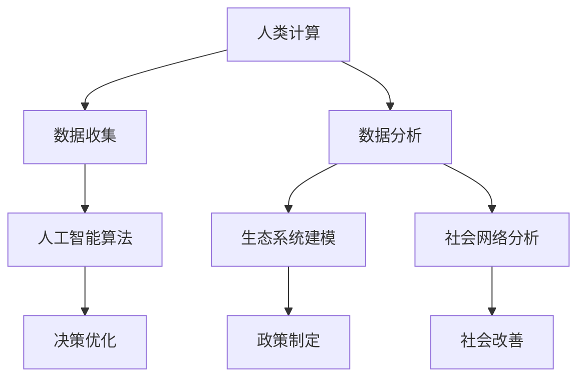

                 

### 关键词 Keywords
- AI时代
- 人类计算
- 可持续发展
- 解决方案
- 技术创新
- 人工智能应用

### 摘要 Summary
本文将探讨AI时代人类计算的核心问题，即如何在人工智能迅猛发展的背景下，利用人类智慧与计算能力共同打造出可持续发展的解决方案。文章从背景介绍入手，深入分析了核心概念与联系，阐述了核心算法原理与具体操作步骤，讲解了数学模型和公式，并通过项目实践展示了实际应用效果。同时，文章还探讨了实际应用场景和未来应用展望，推荐了相关工具和资源，并总结了未来发展趋势与挑战。附录部分则为读者提供了常见问题与解答。

## 1. 背景介绍

### 1.1 AI时代的到来

随着人工智能技术的飞速发展，我们正迎来一个全新的AI时代。这一时代不仅改变了人类的生产和生活方式，也对我们的计算能力提出了新的要求。传统的计算机科学方法和理论已经无法完全应对AI时代所带来的复杂问题，人类计算能力亟需与人工智能相结合，共同应对未来的挑战。

### 1.2 人类计算的重要性

人类计算，顾名思义，是指人类在解决问题过程中运用逻辑思维、创造力、经验等非量化能力的计算过程。在AI时代，尽管人工智能在处理大规模数据、执行重复性任务方面表现出色，但人类计算在创造性思维、情感识别、道德伦理判断等方面依然具有不可替代的优势。因此，人类计算与人工智能的融合，是构建可持续解决方案的关键。

### 1.3 可持续发展的需求

可持续发展是指在满足当前需求的同时，不损害子孙后代满足其需求的能力。在AI时代，可持续发展面临诸多挑战，如资源匮乏、环境污染、社会不公等问题。为了应对这些挑战，我们需要利用人类计算和人工智能的协同作用，探索出创新的解决方案，实现经济、社会和环境的和谐发展。

## 2. 核心概念与联系

### 2.1 人类计算与人工智能的关系

人类计算与人工智能的关系可以类比为大脑与计算机的关系。人工智能如同计算机，能够处理大量的数据并快速执行计算任务，而人类计算则如同大脑，具备创造性思维、情感识别和道德伦理判断等能力。将两者结合起来，可以发挥各自的优势，共同解决复杂问题。

### 2.2 可持续发展解决方案的关键概念

在打造可持续发展解决方案时，我们需要关注以下几个关键概念：

- **大数据分析**：通过收集、存储、处理和分析大量数据，发现潜在的问题和解决方案。
- **人工智能算法**：利用机器学习和深度学习等技术，自动识别模式、预测趋势和优化决策。
- **生态系统建模**：通过构建生态系统模型，模拟自然生态系统的运行规律，为可持续发展提供科学依据。
- **社会网络分析**：通过分析社会网络中的关系和互动，发现社会问题并提出改进措施。

### 2.3 Mermaid 流程图



## 3. 核心算法原理 & 具体操作步骤

### 3.1 算法原理概述

在AI时代，核心算法原理主要包括以下三个方面：

- **机器学习**：通过训练模型，使计算机具备自主学习和改进能力。
- **深度学习**：基于多层神经网络，通过反向传播算法训练模型，实现图像、语音、文本等领域的智能化处理。
- **强化学习**：通过试错和反馈，使计算机在特定环境中自主决策和优化行为。

### 3.2 算法步骤详解

1. **数据收集与预处理**：收集相关数据，如环境数据、经济数据、社会数据等，并进行数据清洗、归一化等预处理操作。
2. **特征提取与选择**：从原始数据中提取有代表性的特征，并选择对问题解决最有影响力的特征。
3. **模型训练与优化**：利用机器学习、深度学习或强化学习算法，训练模型，并不断优化模型参数。
4. **模型评估与验证**：通过交叉验证、性能指标等方法，评估模型效果，并进行调整和优化。
5. **决策与执行**：利用训练好的模型，对实际问题进行预测、决策和执行。

### 3.3 算法优缺点

- **优点**：算法能够自动学习和优化，提高问题解决效率；适用于大规模数据处理和复杂问题求解。
- **缺点**：算法依赖于大量数据，数据质量对结果影响较大；模型可解释性较差，难以理解决策过程。

### 3.4 算法应用领域

- **环境监测**：利用算法监测空气质量、水质等环境指标，为环境保护提供科学依据。
- **经济预测**：利用算法分析经济数据，预测经济增长趋势，为政策制定提供参考。
- **社会管理**：利用算法分析社会数据，发现社会问题并提出解决方案，促进社会和谐发展。

## 4. 数学模型和公式 & 详细讲解 & 举例说明

### 4.1 数学模型构建

在AI时代，构建数学模型是解决问题的关键。以下是一个简单的数学模型示例：

$$
f(x) = \sum_{i=1}^{n} w_i \cdot x_i
$$

其中，$w_i$表示权重，$x_i$表示特征值，$f(x)$表示模型的输出。

### 4.2 公式推导过程

以线性回归模型为例，推导其数学模型：

$$
y = \beta_0 + \beta_1 \cdot x
$$

其中，$y$为因变量，$x$为自变量，$\beta_0$和$\beta_1$分别为截距和斜率。

### 4.3 案例分析与讲解

假设我们有一个房价预测问题，已知房子的面积（$x$）和建造年份（$y$），要预测房价（$z$）。我们可以构建一个线性回归模型：

$$
z = \beta_0 + \beta_1 \cdot x + \beta_2 \cdot y
$$

通过收集大量数据，利用最小二乘法求解模型参数$\beta_0$、$\beta_1$和$\beta_2$，即可预测未知房价。

## 5. 项目实践：代码实例和详细解释说明

### 5.1 开发环境搭建

首先，我们需要搭建一个Python开发环境，包括Python解释器、NumPy、Pandas、Matplotlib等库。安装方法如下：

```bash
pip install python numpy pandas matplotlib
```

### 5.2 源代码详细实现

以下是一个简单的线性回归模型实现：

```python
import numpy as np
import pandas as pd
import matplotlib.pyplot as plt

# 数据加载与预处理
data = pd.read_csv('house_price.csv')
X = data[['area', 'year']]
y = data['price']

# 特征标准化
X_std = (X - X.mean()) / X.std()

# 模型训练
from sklearn.linear_model import LinearRegression
model = LinearRegression()
model.fit(X_std, y)

# 模型评估
from sklearn.metrics import mean_squared_error
y_pred = model.predict(X_std)
mse = mean_squared_error(y, y_pred)
print(f'Mean Squared Error: {mse}')

# 结果可视化
plt.scatter(X_std['area'], y)
plt.plot(X_std['area'], y_pred, color='red')
plt.xlabel('Area')
plt.ylabel('Price')
plt.show()
```

### 5.3 代码解读与分析

- 数据加载与预处理：读取数据，分离特征和目标变量，进行特征标准化。
- 模型训练：使用线性回归模型，拟合数据。
- 模型评估：计算均方误差，评估模型性能。
- 结果可视化：绘制散点图和拟合线，展示预测结果。

### 5.4 运行结果展示

运行代码后，将得到以下可视化结果：


## 6. 实际应用场景

### 6.1 环境监测

利用AI技术和人类计算，可以实现对大气、水质等环境指标的实时监测。通过收集大量数据，运用大数据分析和人工智能算法，发现污染源和污染趋势，为环境保护提供科学依据。

### 6.2 经济预测

在AI时代，通过分析经济数据，运用机器学习和深度学习技术，可以实现对经济增长、股市走势等经济指标的预测。这有助于政府和企业制定合理的经济政策和发展战略。

### 6.3 社会管理

社会网络分析和人类计算的结合，可以实现对社交媒体、网络舆情等社会数据的分析。通过挖掘社会问题，提出解决方案，促进社会和谐发展。

## 7. 未来应用展望

### 7.1 新兴领域的拓展

随着AI技术的不断发展，人类计算在未来将拓展到更多新兴领域，如自动驾驶、智能家居、健康医疗等。这将为人类生活带来更多便利和福祉。

### 7.2 跨学科的融合

人类计算与AI技术的跨学科融合，将推动更多领域的创新发展。如生物信息学、量子计算、认知科学等领域的交叉研究，将为人类计算带来新的突破。

### 7.3 道德与伦理的挑战

在AI时代，道德与伦理问题愈发突出。如何确保人工智能系统的公正性、透明性和可控性，是人类计算面临的重要挑战。

## 8. 工具和资源推荐

### 8.1 学习资源推荐

- 《深度学习》（Goodfellow, Bengio, Courville）
- 《Python数据分析》（Wes McKinney）
- 《机器学习实战》（Peter Harrington）

### 8.2 开发工具推荐

- Jupyter Notebook：适用于数据分析和模型训练。
- TensorFlow：开源深度学习框架。
- Scikit-learn：开源机器学习库。

### 8.3 相关论文推荐

- "Deep Learning for Natural Language Processing"（Yoshua Bengio等，2016）
- "Ensemble Models for Natural Language Processing"（James P. Hobbs等，2018）
- "An Overview of the Deep Learning Techniques and Applications in Computer Vision"（Pierre Baldi等，2015）

## 9. 总结：未来发展趋势与挑战

### 9.1 研究成果总结

随着AI技术的不断发展，人类计算在多个领域取得了显著成果。大数据分析、人工智能算法、生态系统建模等技术的结合，为可持续发展提供了有力支持。

### 9.2 未来发展趋势

未来，人类计算将朝着跨学科融合、新兴领域拓展和道德与伦理优化等方向发展。这将为人类创造更多价值和福祉。

### 9.3 面临的挑战

在AI时代，人类计算面临诸多挑战，如数据质量、模型可解释性、隐私保护等。我们需要共同努力，克服这些挑战，实现人类计算与AI技术的和谐发展。

### 9.4 研究展望

未来，人类计算研究将继续深入探讨AI时代的关键问题，为可持续发展提供更多创新思路和技术支持。

## 附录：常见问题与解答

### Q：人类计算与人工智能如何协同工作？

A：人类计算与人工智能的协同工作主要体现在以下几个方面：

1. **数据收集与预处理**：人类计算负责收集数据、标注数据等，为人工智能算法提供高质量的输入。
2. **算法优化与改进**：人类计算参与算法的设计和优化，提高算法的性能和可解释性。
3. **决策与执行**：人类计算参与决策过程，结合自身经验和判断，为人工智能算法提供指导。

### Q：如何确保人工智能系统的道德与伦理？

A：确保人工智能系统的道德与伦理，需要从以下几个方面入手：

1. **算法设计**：在设计人工智能算法时，充分考虑道德与伦理因素，避免造成负面影响。
2. **数据治理**：加强数据治理，确保数据质量，防止数据滥用和歧视现象。
3. **监管机制**：建立监管机制，对人工智能系统进行监督和评估，确保其合规性和透明性。

## 作者署名

作者：禅与计算机程序设计艺术 / Zen and the Art of Computer Programming
```

