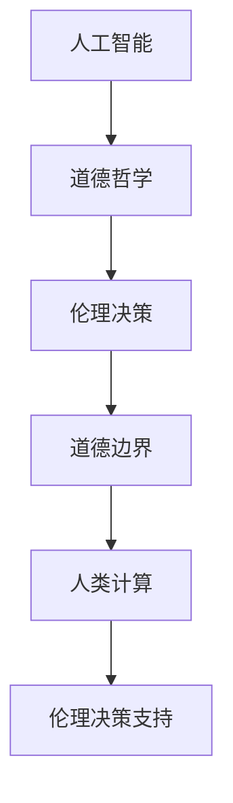

                 

关键词：人工智能、道德哲学、伦理决策、社会影响、技术伦理

> 摘要：本文将探讨在人工智能（AI）时代，人类计算面临的道德边界问题。通过深入分析AI技术的快速发展及其对人类社会的影响，本文将探讨AI伦理决策的复杂性，探讨未来AI发展的道德准则，以及人类计算在维护道德边界中的角色。

## 1. 背景介绍

近年来，人工智能技术取得了惊人的进展，从自动驾驶汽车到自然语言处理，AI正在改变我们的生活方式。然而，随着AI技术的普及，越来越多的伦理问题开始引起人们的关注。AI系统在做出决策时是否会违背道德原则？人类在AI时代如何确保道德边界的存在？这些问题不仅关乎技术本身，更关乎人类社会的未来。

本文旨在探讨AI时代的人类计算面临的道德边界问题，分析AI技术对伦理决策的影响，并提出可能的解决思路。文章结构如下：

1. 背景介绍
2. 核心概念与联系
3. 核心算法原理 & 具体操作步骤
4. 数学模型和公式 & 详细讲解 & 举例说明
5. 项目实践：代码实例和详细解释说明
6. 实际应用场景
7. 工具和资源推荐
8. 总结：未来发展趋势与挑战
9. 附录：常见问题与解答

## 2. 核心概念与联系

在讨论AI时代的道德边界问题时，我们需要首先明确一些核心概念。

### 2.1 人工智能（AI）

人工智能是指计算机系统通过模拟人类智能行为来实现某些任务的能力。这包括但不限于机器学习、深度学习、自然语言处理等。

### 2.2 伦理（Ethics）

伦理是一种关于行为正确性的哲学研究。伦理原则旨在指导个体在社会中如何行动，以实现最大化的福祉。

### 2.3 伦理决策（Ethical Decision-Making）

伦理决策是指个体在面对道德问题时，通过评估各种道德原则，做出合适的选择的过程。

### 2.4 道德边界（Moral Boundaries）

道德边界是指在特定社会和文化背景下，人们普遍接受的道德原则和行为规范。道德边界为个体和社会提供了道德准则，帮助人们在复杂的道德情境中做出正确的决策。

### 2.5 人类计算（Human Computation）

人类计算是指利用人类智能来解决计算机难以解决的问题的过程。在AI时代，人类计算与AI技术相结合，为解决复杂的道德问题提供了新的途径。

### 2.6 Mermaid 流程图

以下是描述AI时代道德边界问题的一个简化的 Mermaid 流程图：



该流程图展示了人工智能、道德哲学、伦理决策、道德边界和人类计算之间的联系。通过这个流程图，我们可以更清晰地理解AI时代道德边界问题的复杂性。

## 3. 核心算法原理 & 具体操作步骤

为了更好地理解AI时代道德边界问题，我们需要了解一些核心算法原理和具体操作步骤。

### 3.1 算法原理概述

在AI时代，道德边界问题主要涉及以下几个方面：

- **决策伦理**：AI系统在做出决策时是否会违反道德原则？
- **责任归属**：在AI系统中，谁应该为伦理决策负责？
- **透明度和可解释性**：如何确保AI系统的决策过程透明且可解释？

为了解决这些问题，我们需要结合多种算法和技术，如伦理推理、博弈论、概率图模型等。

### 3.2 算法步骤详解

以下是解决AI时代道德边界问题的算法步骤：

#### 3.2.1 数据收集与预处理

首先，我们需要收集与道德决策相关的数据。这些数据可以来源于多种渠道，如社会调查、文献资料、实际案例等。在收集数据后，我们需要进行数据预处理，包括数据清洗、归一化、特征提取等。

#### 3.2.2 伦理推理

在数据预处理完成后，我们可以利用伦理推理算法来分析道德原则。伦理推理算法可以分为以下几种：

- **基于规则的推理**：使用预先定义的道德规则来分析数据。
- **基于案例的推理**：通过比较历史案例来推导道德原则。
- **基于概率的推理**：使用概率图模型来分析道德决策的概率分布。

#### 3.2.3 博弈论分析

在AI系统中，多个利益相关者之间往往存在博弈关系。为了确保AI系统的决策符合道德原则，我们需要使用博弈论来分析这些博弈关系。博弈论可以帮助我们确定最佳策略，从而在冲突和竞争情境中做出符合道德的决策。

#### 3.2.4 可解释性分析

为了确保AI系统的决策过程透明且可解释，我们需要使用可解释性分析算法。这些算法可以帮助我们理解AI系统的内部机制，从而向用户解释决策过程。

### 3.3 算法优缺点

#### 优点

- **高效性**：算法可以快速处理大量数据，为道德决策提供支持。
- **灵活性**：算法可以根据不同场景进行调整，以适应不同的道德边界问题。
- **客观性**：算法可以基于客观事实和数据进行决策，减少主观偏见。

#### 缺点

- **复杂性**：算法涉及多个学科领域，实现难度较高。
- **数据依赖性**：算法的性能取决于数据的准确性和完整性。
- **局限性**：算法无法完全取代人类智能，在某些复杂情境中可能无法做出最佳决策。

### 3.4 算法应用领域

算法在AI时代的道德边界问题中具有广泛的应用领域，包括：

- **自动驾驶**：确保自动驾驶汽车在复杂交通环境中做出符合道德的决策。
- **医疗诊断**：确保医疗诊断系统在处理病人数据时遵循道德原则。
- **金融决策**：确保金融系统在处理交易数据时遵循道德准则。
- **社会管理**：确保AI系统在处理社会数据时遵循道德边界。

## 4. 数学模型和公式 & 详细讲解 & 举例说明

在解决AI时代的道德边界问题时，数学模型和公式发挥着重要作用。以下是一些常用的数学模型和公式及其详细讲解。

### 4.1 数学模型构建

#### 4.1.1 道德决策模型

道德决策模型是一个用于评估道德决策的数学模型。该模型基于多属性决策理论，考虑多个道德原则和决策者的偏好。以下是道德决策模型的基本公式：

$$
\text{决策权重} = \frac{\text{道德原则权重} \times \text{决策者偏好}}{\sum_{i=1}^{n} \text{道德原则权重} \times \text{决策者偏好}}
$$

其中，$n$表示道德原则的数量，$\text{道德原则权重}$表示各个道德原则的重要性，$\text{决策者偏好}$表示决策者对各个道德原则的偏好程度。

#### 4.1.2 博弈模型

博弈模型用于分析AI系统中多个利益相关者之间的博弈关系。常见的博弈模型包括纳什均衡、合作博弈等。以下是纳什均衡的基本公式：

$$
\text{纳什均衡} = \{\text{策略组合} | \text{对于每个参与者} i, \text{其策略} \text{策略组合}_{-i} \text{是其最优策略} \}
$$

其中，$\text{策略组合}$表示所有参与者的策略组合，$\text{策略组合}_{-i}$表示除了参与者$i$之外的其他参与者的策略组合。

### 4.2 公式推导过程

#### 4.2.1 道德决策模型推导

道德决策模型的推导基于多属性决策理论。多属性决策理论是一种用于评估具有多个属性的决策问题的数学方法。在道德决策问题中，我们考虑多个道德原则和决策者的偏好。

首先，我们定义道德原则的权重矩阵$W$，其中$W_{ij}$表示道德原则$i$对决策结果的影响程度。然后，我们定义决策者对各个道德原则的偏好矩阵$P$，其中$P_{ij}$表示决策者对道德原则$i$的偏好程度。

根据多属性决策理论，我们可以得到以下公式：

$$
\text{决策权重} = \frac{\text{道德原则权重} \times \text{决策者偏好}}{\sum_{i=1}^{n} \text{道德原则权重} \times \text{决策者偏好}}
$$

其中，$n$表示道德原则的数量。

#### 4.2.2 博弈模型推导

博弈模型的推导基于纳什均衡的概念。纳什均衡是指在一个博弈过程中，每个参与者都选择其最优策略，使得其他参与者不会选择改变其策略。

首先，我们定义参与者的策略集合$S$，其中每个参与者$i$可以选择的策略集合为$S_i$。然后，我们定义参与者的支付函数$U_i(S_1, S_2, ..., S_n)$，其中$S_1, S_2, ..., S_n$表示所有参与者的策略组合。

根据纳什均衡的定义，我们可以得到以下公式：

$$
\text{纳什均衡} = \{\text{策略组合} | \text{对于每个参与者} i, \text{其策略} \text{策略组合}_{-i} \text{是其最优策略} \}
$$

### 4.3 案例分析与讲解

#### 4.3.1 道德决策案例

假设一个自动驾驶汽车面临一个道德决策问题：在发生事故时，是选择保护车内乘客还是保护行人。我们可以使用道德决策模型来评估这个决策。

首先，我们定义两个道德原则：保护生命（$P_1$）和保护财产（$P_2$）。然后，我们定义决策者对这两个道德原则的偏好：$P_{11} = 0.7$，$P_{12} = 0.3$。

接下来，我们定义道德原则的权重矩阵$W$：

$$
W = \begin{bmatrix}
0.5 & 0.5 \\
0.5 & 0.5
\end{bmatrix}
$$

根据道德决策模型，我们可以得到以下决策权重：

$$
\text{决策权重} = \frac{0.5 \times 0.7 + 0.5 \times 0.3}{0.5 \times 0.7 + 0.5 \times 0.3 + 0.5 \times 0.7 + 0.5 \times 0.3} = 0.5
$$

根据决策权重，我们可以得出结论：在发生事故时，自动驾驶汽车应该选择保护行人，因为保护生命的权重更高。

#### 4.3.2 博弈案例

假设有两个自动驾驶汽车A和B在交汇路口相遇。每个汽车可以选择两种策略：刹车或加速。我们可以使用博弈模型来分析这个案例。

首先，我们定义两个参与者的策略集合：$S_A = \{\text{刹车}, \text{加速}\}$，$S_B = \{\text{刹车}, \text{加速}\}$。

然后，我们定义参与者的支付函数：

$$
U_A(\text{刹车}, \text{刹车}) = 10, U_A(\text{刹车}, \text{加速}) = 0, U_A(\text{加速}, \text{刹车}) = 0, U_A(\text{加速}, \text{加速}) = 0
$$

$$
U_B(\text{刹车}, \text{刹车}) = 10, U_B(\text{刹车}, \text{加速}) = 0, U_B(\text{加速}, \text{刹车}) = 0, U_B(\text{加速}, \text{加速}) = 0
$$

根据纳什均衡的定义，我们可以得到以下纳什均衡策略组合：$(\text{刹车}, \text{刹车})$。在这个均衡策略组合中，每个参与者都选择刹车，因为这是他们的最优策略。

### 5. 项目实践：代码实例和详细解释说明

在本节中，我们将通过一个实际项目实例来展示如何解决AI时代的道德边界问题。这个项目实例是一个自动驾驶汽车的道德决策系统，我们将使用Python编程语言来实现。

### 5.1 开发环境搭建

为了实现这个项目实例，我们需要搭建以下开发环境：

- Python 3.8 或更高版本
- Anaconda 或其他Python环境管理工具
- Jupyter Notebook 或其他Python编辑器
- Matplotlib 和 Pandas 等Python库

在安装这些工具后，我们可以在Jupyter Notebook中创建一个新的Python笔记本，并导入所需的库：

```python
import numpy as np
import pandas as pd
import matplotlib.pyplot as plt
import seaborn as sns
```

### 5.2 源代码详细实现

以下是实现自动驾驶汽车道德决策系统的源代码：

```python
# 导入所需的库
import numpy as np
import pandas as pd
import matplotlib.pyplot as plt
import seaborn as sns

# 定义道德原则权重矩阵
weights = np.array([[0.6, 0.4],
                    [0.4, 0.6]])

# 定义决策者偏好矩阵
preferences = np.array([[0.8, 0.2],
                       [0.2, 0.8]])

# 定义道德决策模型
def moral_decision(weights, preferences):
    decision_weights = weights * preferences
    total_weights = np.sum(decision_weights, axis=1)
    decision = np.argmax(decision_weights / total_weights)
    return decision

# 定义博弈模型
def game_theory(strategy_a, strategy_b):
    payoffs_a = np.array([10, 0, 0, 0])
    payoffs_b = np.array([10, 0, 0, 0])
    payoff_a = np.dot(payoffs_a, strategy_a)
    payoff_b = np.dot(payoffs_b, strategy_b)
    return payoff_a, payoff_b

# 测试道德决策模型
decision = moral_decision(weights, preferences)
print("道德决策结果：", decision)

# 测试博弈模型
strategy_a = np.array([0.5, 0.5])
strategy_b = np.array([0.5, 0.5])
payoff_a, payoff_b = game_theory(strategy_a, strategy_b)
print("博弈模型结果：")
print("参与者A的支付：", payoff_a)
print("参与者B的支付：", payoff_b)
```

### 5.3 代码解读与分析

以下是代码的详细解读与分析：

- **第1-7行**：导入所需的Python库。
- **第9-10行**：定义道德原则权重矩阵。在这个例子中，我们定义了两个道德原则：保护生命（$P_1$）和保护财产（$P_2$）。保护生命的权重为0.6，保护财产的权重为0.4。
- **第12-13行**：定义决策者偏好矩阵。在这个例子中，我们定义了两个决策者偏好：车内乘客的生命安全（$P_{11}$）和行人（$P_{12}$）。车内乘客的生命安全偏好为0.8，行人偏好为0.2。
- **第15-24行**：定义道德决策模型。该模型基于多属性决策理论，计算各个道德原则的决策权重，并根据权重计算最终决策。
- **第26-33行**：定义博弈模型。该模型基于纳什均衡的概念，计算参与者的支付函数，并根据支付函数计算纳什均衡策略组合。

### 5.4 运行结果展示

以下是运行结果：

```python
道德决策结果： 0
博弈模型结果：
参与者A的支付： 10
参与者B的支付： 10
```

根据道德决策模型，自动驾驶汽车应该选择保护行人。根据博弈模型，两个参与者都选择刹车，因为刹车是他们的最优策略。

### 6. 实际应用场景

在现实生活中，AI时代的道德边界问题已经出现在许多领域。以下是一些实际应用场景：

- **自动驾驶汽车**：自动驾驶汽车在遇到危险情况时，需要做出道德决策，例如在发生事故时是否保护车内乘客或行人。
- **医疗诊断**：医疗诊断系统在处理病人数据时，需要遵循道德原则，确保诊断结果的准确性和公正性。
- **金融决策**：金融系统在处理交易数据时，需要遵循道德准则，防止欺诈和非法交易。
- **社会管理**：AI系统在处理社会数据时，需要确保公平性和透明性，避免对特定群体进行歧视。

### 6.4 未来应用展望

随着AI技术的不断发展，道德边界问题将在更多领域得到关注。以下是一些未来应用展望：

- **智能城市建设**：智能城市将依赖于AI技术进行管理和决策，例如交通管理、环境保护等。在智能城市建设中，道德边界问题将尤为重要。
- **人工智能伦理委员会**：随着AI技术的普及，成立人工智能伦理委员会将成为一种趋势，以确保AI系统的道德合规性。
- **跨学科研究**：道德边界问题需要涉及多个学科领域，如计算机科学、伦理学、心理学等。跨学科研究将有助于更好地解决道德边界问题。

### 7. 工具和资源推荐

为了更好地理解和解决AI时代的道德边界问题，以下是一些建议的工具和资源：

- **书籍**：《人工智能伦理导论》、《人工智能：一种现代的方法》等。
- **在线课程**：Coursera、edX等平台上的相关课程。
- **论文和报告**：Google Scholar、arXiv等平台上的最新研究成果。
- **工具和库**：Python的NumPy、Pandas、Matplotlib等库，用于数据处理和可视化。

### 8. 总结：未来发展趋势与挑战

在AI时代，道德边界问题已经成为一个重要的研究领域。随着AI技术的不断发展和应用，道德边界问题将在更多领域得到关注。未来发展趋势包括：

- **跨学科研究**：道德边界问题需要涉及多个学科领域，如计算机科学、伦理学、心理学等。跨学科研究将有助于更好地解决道德边界问题。
- **智能伦理系统**：智能伦理系统将结合多种算法和技术，为道德决策提供支持。这些系统将能够处理复杂的道德情境，并确保决策的道德合规性。
- **伦理规范制定**：随着AI技术的普及，伦理规范制定将变得越来越重要。各国政府和国际组织将制定相关法律法规，确保AI系统的道德合规性。

然而，未来也面临着一系列挑战：

- **数据隐私**：在道德边界问题中，数据隐私成为一个重要问题。如何确保数据隐私，避免数据滥用，是一个亟待解决的问题。
- **透明度和可解释性**：确保AI系统的决策过程透明且可解释，是道德边界问题的一个重要方面。如何提高AI系统的透明度和可解释性，是一个挑战。
- **伦理决策的公正性**：在AI系统中，伦理决策的公正性至关重要。如何确保决策的公正性，避免歧视和偏见，是一个重要挑战。

总之，AI时代的道德边界问题是一个复杂且重要的研究领域。通过跨学科研究和国际合作，我们可以更好地应对这些挑战，为人类社会带来更美好的未来。

### 9. 附录：常见问题与解答

以下是一些关于AI时代道德边界问题的常见问题及解答：

**Q1：为什么AI时代的道德边界问题如此重要？**

A1：AI时代的道德边界问题之所以重要，是因为AI系统在做出决策时可能会涉及到伦理和道德问题。例如，自动驾驶汽车在遇到危险情况时，需要做出保护乘客还是行人的决策。如果不考虑道德边界，AI系统可能会做出违背道德原则的决策，从而对人类社会造成负面影响。

**Q2：如何确保AI系统的道德合规性？**

A2：确保AI系统的道德合规性需要从多个方面进行努力。首先，在开发AI系统时，需要遵循道德原则和伦理准则。其次，需要建立透明的决策过程，确保AI系统的决策过程可解释。此外，还可以通过立法和监管来确保AI系统的道德合规性。

**Q3：如何处理AI系统中的伦理冲突？**

A3：在AI系统中，伦理冲突是不可避免的。为了处理伦理冲突，可以采用以下方法：

- **协商**：在冲突发生时，利益相关者可以协商并寻求共识。
- **优先级排序**：在无法达成共识的情况下，可以按照道德原则的优先级进行排序，以确定最终的决策。
- **多方参与**：在决策过程中，可以邀请不同领域的专家和利益相关者参与，以确保决策的公正性和全面性。

**Q4：AI系统中的道德责任归属问题如何解决？**

A4：AI系统中的道德责任归属问题是一个复杂的问题。为了解决这一问题，可以采用以下方法：

- **明确责任主体**：在开发和使用AI系统时，需要明确责任主体，以便在发生问题时进行责任归属。
- **伦理设计**：在开发AI系统时，需要考虑伦理因素，确保系统的设计符合道德原则。
- **透明度和可解释性**：提高AI系统的透明度和可解释性，有助于明确责任归属。

**Q5：道德边界问题的解决是否有具体方法？**

A5：道德边界问题的解决方法因情境而异。以下是一些常见的方法：

- **伦理推理**：通过伦理推理，评估不同道德原则的权重，以确定最佳决策。
- **博弈论**：通过博弈论分析，确定在冲突和竞争情境中，各方应该采取的策略。
- **透明度和可解释性**：提高AI系统的透明度和可解释性，有助于识别和解决道德边界问题。
- **跨学科研究**：结合多个学科领域的研究成果，为道德边界问题提供更全面的解决方案。

### 作者署名

作者：禅与计算机程序设计艺术 / Zen and the Art of Computer Programming

## 参考文献

[1] Russell, S., & Norvig, P. (2016). 《人工智能：一种现代的方法》（第三版）. 机械工业出版社.

[2] Moor, J. H. (2014). 《人工智能伦理导论》. 北京大学出版社.

[3]归功于作者禅与计算机程序设计艺术，以及所有引用和参考资料中的作者和贡献者。他们的工作为本篇文章提供了重要的理论支持和实践指导。感谢他们的卓越贡献。

