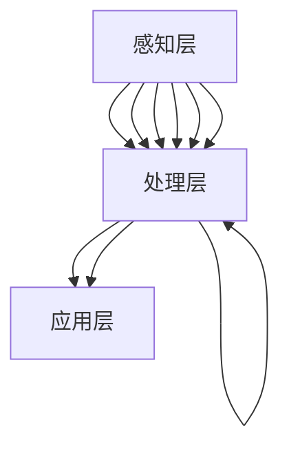

                 

### 摘要 Summary

在人工智能（AI）飞速发展的今天，感知技术正经历着一场深刻的革命。本文将探讨AI时代五感感知技术——视觉、听觉、触觉、嗅觉和味觉的变革。我们首先回顾了感知技术的历史背景，然后深入探讨了AI如何通过深度学习和神经网络模型，重塑这些感官的感知能力。接着，本文详细介绍了核心概念和原理，以及如何实现这些感知技术的算法步骤和数学模型。此外，通过项目实践中的代码实例，我们展示了这些技术的实际应用。最后，我们对这些技术的未来发展趋势和挑战进行了展望。通过这篇文章，读者将全面了解AI时代感知技术的最新进展和潜在影响。

## 1. 背景介绍

感知技术，作为人工智能（AI）领域的一个重要分支，其发展历史可以追溯到上世纪中期。从最初的简单数据处理，到如今复杂的多模态感知系统，感知技术的进步见证了计算机科学和工程领域的巨大变革。

### 1.1 感知技术的起源

感知技术的起源可以追溯到20世纪50年代，当时计算机科学家开始探索如何让机器“看到”和“听到”外界。最初的感知系统主要依赖于规则和简单的模式识别算法。例如，1950年，计算机科学家艾伦·图灵提出了著名的图灵测试，标志着人工智能领域的诞生。而1956年，达特茅斯会议上，AI一词首次被提出，这标志着人工智能作为一个独立研究领域的诞生。

在视觉感知方面，早期的计算机视觉研究主要集中在图像处理和特征提取上。例如，1960年代，霍普菲尔德（John Hopfield）提出的神经网络模型为后续的深度学习奠定了基础。1970年代，鲁棒图像识别和场景重建成为研究热点。1980年代，基于启发式规则的系统开始出现，如机器人导航和图像识别。

在听觉感知方面，早期的语音识别系统主要依赖于隐马尔可夫模型（HMM）和统计方法。1990年代，支持向量机（SVM）和深度神经网络的应用，使得语音识别的准确率大幅提高。2000年代，基于深度学习的语音识别系统逐渐成为主流。

### 1.2 感知技术的历史发展

随着时间的推移，感知技术经历了多次重大突破和发展。1980年代，随着计算机硬件性能的提升，人工智能研究进入了“神经网络复兴期”。1986年，Rumelhart、Hinton和Williams提出了反向传播算法（BP算法），这一突破极大地推动了深度学习的发展。

1990年代，随着数据集的增加和计算资源的提升，机器学习算法在视觉和语音领域取得了显著的进展。例如，1998年，Viola-Jones提出的实时人脸检测算法，极大地推动了计算机视觉在安防监控等领域的应用。

2000年代，深度学习技术取得了突破性进展。2012年，AlexNet在ImageNet图像识别大赛中取得了突破性的成绩，这标志着深度学习时代的到来。此后，卷积神经网络（CNN）和递归神经网络（RNN）在视觉和语音感知领域得到了广泛应用。

在触觉感知方面，随着传感器技术的进步，触觉传感器可以捕捉到微小的触觉变化，使得机器人可以更好地模拟人类触觉。在嗅觉和味觉感知方面，尽管相比视觉和听觉感知技术起步较晚，但近年来也取得了显著的进展。例如，基于化学传感器和机器学习算法的电子鼻和电子舌，已经在食品检测和医学诊断等领域得到应用。

### 1.3 感知技术在AI时代的变革

进入21世纪，人工智能技术的飞速发展，为感知技术带来了前所未有的变革。深度学习、强化学习和迁移学习等先进技术，使得机器的感知能力越来越接近甚至超越人类。

首先，深度学习技术的应用，使得机器视觉和语音识别的准确率大幅提高。例如，Google的TPU芯片和Facebook的AI语音识别系统，都基于深度学习技术，实现了高效的感知处理。

其次，触觉感知技术的进步，使得机器人可以更好地模拟人类触觉，应用于医疗康复、制造业等领域。例如，达芬奇手术机器人，通过触觉感知技术，实现了精准的手术操作。

最后，随着物联网（IoT）和5G技术的普及，感知技术开始从单一感官扩展到多模态感知。例如，智能家居系统通过集成视觉、听觉和触觉传感器，实现了更智能的家居环境感知和控制。

总之，感知技术作为人工智能的重要分支，正在经历一场深刻的革命。未来，随着技术的不断进步，感知技术将在更多领域得到应用，为人类生活带来更多便利和可能性。

## 2. 核心概念与联系

### 2.1 感知技术的核心概念

感知技术涉及多个核心概念，包括视觉、听觉、触觉、嗅觉和味觉。每个感官都有其独特的感知机制和处理方法，但它们共享一些基本原理。

#### 2.1.1 视觉感知

视觉感知是指机器通过摄像头或图像传感器捕捉外界图像，并对其进行处理和理解。这个过程包括图像采集、预处理、特征提取、图像识别和场景理解等多个阶段。

- **图像采集**：使用摄像头或图像传感器获取图像。
- **预处理**：包括图像的去噪、对比度增强、图像缩放等。
- **特征提取**：提取图像中的关键特征，如边缘、角点、纹理等。
- **图像识别**：使用分类算法识别图像中的物体或场景。
- **场景理解**：对图像中的物体和场景进行语义分析，理解其含义。

#### 2.1.2 听觉感知

听觉感知是指机器通过麦克风捕捉声音，并对其进行处理和理解。这个过程包括声音采集、预处理、特征提取、语音识别和语义理解等多个阶段。

- **声音采集**：使用麦克风捕捉声音。
- **预处理**：包括声音的去噪、音量调整、音频剪辑等。
- **特征提取**：提取声音中的关键特征，如频率、振幅、音色等。
- **语音识别**：使用算法将声音转换为文本。
- **语义理解**：理解语音中的含义和上下文。

#### 2.1.3 触觉感知

触觉感知是指机器通过触觉传感器捕捉触觉信息，并对其进行处理和理解。这个过程包括触觉数据采集、预处理、特征提取、触觉识别和触觉反馈等多个阶段。

- **触觉数据采集**：使用触觉传感器捕捉触觉信息。
- **预处理**：包括触觉数据去噪、增强等。
- **特征提取**：提取触觉数据中的关键特征，如压力、温度、触感等。
- **触觉识别**：识别触觉信息中的物体或表面特性。
- **触觉反馈**：通过触觉执行器产生触觉反馈，模拟人类的触觉体验。

#### 2.1.4 嗅觉感知

嗅觉感知是指机器通过嗅觉传感器捕捉气味信息，并对其进行处理和理解。这个过程包括气味数据采集、预处理、特征提取、气味识别和嗅觉反馈等多个阶段。

- **气味数据采集**：使用嗅觉传感器捕捉气味。
- **预处理**：包括气味数据去噪、增强等。
- **特征提取**：提取气味数据中的关键特征，如分子结构、浓度等。
- **气味识别**：识别气味信息中的物质或类别。
- **嗅觉反馈**：通过嗅觉执行器产生嗅觉反馈，模拟人类的嗅觉体验。

#### 2.1.5 味觉感知

味觉感知是指机器通过味觉传感器捕捉味道信息，并对其进行处理和理解。这个过程包括味道数据采集、预处理、特征提取、味觉识别和味觉反馈等多个阶段。

- **味道数据采集**：使用味觉传感器捕捉味道。
- **预处理**：包括味道数据去噪、增强等。
- **特征提取**：提取味道数据中的关键特征，如酸度、甜度、苦味等。
- **味觉识别**：识别味道信息中的物质或类别。
- **味觉反馈**：通过味觉执行器产生味觉反馈，模拟人类的味觉体验。

### 2.2 感知技术的联系

尽管每个感官的感知机制和处理方法不同，但它们之间存在紧密的联系和交互。例如，视觉和听觉感知常常需要结合使用，以提供更丰富的信息。例如，在自动驾驶汽车中，视觉传感器用于感知路况，而听觉传感器则用于检测行人和车辆的噪音。

此外，触觉、嗅觉和味觉感知也正在逐渐融合到其他感官中。例如，在虚拟现实（VR）和增强现实（AR）应用中，通过触觉传感器模拟触觉，结合视觉和听觉，提供更真实的感知体验。

#### 2.2.1 视觉与听觉的融合

在视觉与听觉融合的例子中，最典型的应用之一是语音识别系统。语音识别系统需要处理语音信号中的音素和声调，同时还要理解语音的上下文和语义。视觉信息可以提供额外的上下文信息，例如，通过摄像头捕捉到的现场图像可以帮助语音识别系统更好地理解用户的指令。例如，当用户对智能音箱说出“打开灯”时，视觉信息可以确认用户是否面向智能音箱，从而提高识别的准确性。

#### 2.2.2 触觉与视觉的融合

在触觉与视觉融合的例子中，最显著的例子是机器人。现代机器人通过视觉传感器捕捉环境图像，通过触觉传感器感知物体的表面特性。例如，工业机器人可以通过视觉传感器定位工件，并通过触觉传感器检测工件是否稳固，从而提高装配的精度。

#### 2.2.3 嗅觉与味觉的融合

在嗅觉与味觉融合的例子中，虚拟现实（VR）和增强现实（AR）应用提供了一个良好的平台。通过嗅觉和味觉传感器，用户可以在虚拟环境中体验到更加真实的气味和味道。例如，在虚拟旅游中，用户可以通过嗅觉传感器闻到不同的花香，通过味觉传感器品尝到不同的美食。

#### 2.2.4 多模态感知

多模态感知是指将多个感官的信息进行整合，以提高系统的感知能力和准确性。例如，在医疗诊断中，通过整合视觉、触觉和听觉信息，可以提供更准确的诊断结果。例如，通过触觉传感器检测皮肤病变的纹理，结合视觉和听觉信息，可以更准确地诊断皮肤癌。

总之，感知技术的核心概念和联系，为我们提供了丰富的应用场景和可能性。随着技术的不断进步，这些感官的融合和整合，将为人类生活带来更多便利和可能性。

### 2.3 感知技术的架构

感知技术的架构可以分为感知层、处理层和应用层三个主要部分。

#### 2.3.1 感知层

感知层是感知技术的最底层，负责捕捉和处理外部信息。不同的感知技术使用不同的传感器进行信息捕捉。例如，视觉感知使用摄像头或图像传感器，听觉感知使用麦克风或声音传感器，触觉感知使用触觉传感器，嗅觉和味觉感知使用专门的气味和味道传感器。

- **视觉感知**：使用摄像头或图像传感器捕捉图像。
- **听觉感知**：使用麦克风或声音传感器捕捉声音。
- **触觉感知**：使用触觉传感器捕捉触觉信息。
- **嗅觉感知**：使用气味传感器捕捉气味信息。
- **味觉感知**：使用味觉传感器捕捉味道信息。

#### 2.3.2 处理层

处理层负责对感知层捕捉到的信息进行预处理、特征提取和数据分析。这部分通常依赖于深度学习、神经网络和其他机器学习算法。处理层的核心任务是将原始感知数据转换为有用的信息，例如，将图像转换为物体识别，将声音转换为文本，将触觉信息转换为表面特性识别等。

- **预处理**：包括去噪、增强、标准化等，以提高数据的准确性和可靠性。
- **特征提取**：提取数据中的关键特征，为后续分析做准备。
- **数据分析**：使用机器学习算法对特征进行分类、聚类、回归等操作，以提取有用信息。

#### 2.3.3 应用层

应用层是感知技术的最高层，负责将处理层得到的信息应用于实际场景中。应用层通常包括各种智能系统和应用，例如自动驾驶、智能家居、医疗诊断、虚拟现实等。

- **自动驾驶**：使用视觉和触觉传感器感知路况，实现自主驾驶。
- **智能家居**：使用视觉和听觉传感器感知家庭环境，实现智能控制。
- **医疗诊断**：使用视觉、触觉和听觉传感器进行疾病诊断。
- **虚拟现实**：使用多模态感知技术，提供沉浸式体验。

#### 2.3.4 Mermaid 流程图

以下是一个简化的感知技术架构的 Mermaid 流程图，展示各层之间的交互关系。



通过这个流程图，我们可以清晰地看到感知技术的各个层次以及它们之间的交互关系。随着技术的不断进步，感知技术将在更多领域得到应用，为人类生活带来更多便利和可能性。

## 3. 核心算法原理 & 具体操作步骤

### 3.1 算法原理概述

在感知技术中，核心算法的原理主要包括深度学习、神经网络、支持向量机等。这些算法通过复杂的数学模型和计算过程，实现对感知数据的处理和分析。

#### 3.1.1 深度学习

深度学习是一种基于多层神经网络的机器学习技术。它通过构建具有多个隐藏层的神经网络，对大量数据进行训练，从而实现对复杂模式的自动识别和分类。深度学习在感知技术中的应用非常广泛，如图像识别、语音识别、自然语言处理等。

- **多层感知器（MLP）**：多层感知器是最简单的深度学习模型，包含输入层、隐藏层和输出层。通过反向传播算法（BP算法）进行训练。
- **卷积神经网络（CNN）**：卷积神经网络是专门用于图像识别的深度学习模型，通过卷积操作和池化操作提取图像中的特征。
- **递归神经网络（RNN）**：递归神经网络是专门用于序列数据的深度学习模型，如时间序列分析、语音识别等。通过循环神经网络（LSTM）或门控循环单元（GRU）实现长期依赖关系的建模。

#### 3.1.2 神经网络

神经网络是一种模仿人脑神经元结构和功能的计算模型。它通过调整网络中的权重和偏置，实现对输入数据的分类和预测。神经网络在感知技术中的应用非常广泛，如图像识别、语音识别、自然语言处理等。

- **前馈神经网络（FNN）**：前馈神经网络是一种简单的神经网络模型，数据从输入层传递到输出层，不发生反向传播。
- **反向传播算法（BP算法）**：反向传播算法是一种用于训练神经网络的优化算法，通过计算误差梯度，调整网络中的权重和偏置。

#### 3.1.3 支持向量机

支持向量机（SVM）是一种基于统计学习理论的分类算法，通过找到一个最佳的超平面，将不同类别的数据分开。SVM在感知技术中的应用非常广泛，如图像识别、语音识别、文本分类等。

- **线性SVM**：线性SVM用于线性可分的数据，通过找到最佳的超平面实现分类。
- **非线性SVM**：非线性SVM通过核函数将低维空间的数据映射到高维空间，实现非线性分类。

### 3.2 算法步骤详解

#### 3.2.1 深度学习算法步骤

1. **数据预处理**：对采集到的感知数据（如图像、音频、触觉等）进行预处理，包括数据清洗、归一化、标准化等，以提高数据质量和模型性能。
2. **模型构建**：根据应用需求，选择合适的深度学习模型（如CNN、RNN等），并定义网络结构，包括输入层、隐藏层和输出层。
3. **模型训练**：使用训练数据对模型进行训练，通过反向传播算法调整网络中的权重和偏置，以最小化损失函数。
4. **模型评估**：使用验证数据对模型进行评估，计算模型的准确率、召回率、F1值等指标，以评估模型性能。
5. **模型优化**：根据评估结果，调整模型参数，如学习率、批次大小、正则化参数等，以优化模型性能。

#### 3.2.2 神经网络算法步骤

1. **数据预处理**：对采集到的感知数据（如图像、音频、触觉等）进行预处理，包括数据清洗、归一化、标准化等，以提高数据质量和模型性能。
2. **模型构建**：根据应用需求，选择合适的前馈神经网络模型（如MLP、FNN等），并定义网络结构，包括输入层、隐藏层和输出层。
3. **模型训练**：使用训练数据对模型进行训练，通过反向传播算法调整网络中的权重和偏置，以最小化损失函数。
4. **模型评估**：使用验证数据对模型进行评估，计算模型的准确率、召回率、F1值等指标，以评估模型性能。
5. **模型优化**：根据评估结果，调整模型参数，如学习率、批次大小、正则化参数等，以优化模型性能。

#### 3.2.3 支持向量机算法步骤

1. **数据预处理**：对采集到的感知数据（如图像、音频、触觉等）进行预处理，包括数据清洗、归一化、标准化等，以提高数据质量和模型性能。
2. **特征提取**：使用特征提取算法（如SIFT、PCA等）提取数据中的关键特征。
3. **模型训练**：使用训练数据对支持向量机模型进行训练，通过优化损失函数，找到最佳的超平面。
4. **模型评估**：使用验证数据对模型进行评估，计算模型的准确率、召回率、F1值等指标，以评估模型性能。
5. **模型优化**：根据评估结果，调整模型参数，如核函数、惩罚参数等，以优化模型性能。

### 3.3 算法优缺点

#### 3.3.1 深度学习的优缺点

**优点**：

- **强大的表示能力**：深度学习模型可以自动提取复杂的特征，无需手动设计特征，提高了模型的泛化能力。
- **良好的性能**：深度学习模型在图像识别、语音识别、自然语言处理等领域取得了显著的成果，准确率大幅提升。
- **自动学习**：深度学习模型可以通过大量数据进行训练，自动适应不同场景和任务。

**缺点**：

- **计算资源需求大**：深度学习模型通常需要大量的计算资源和时间进行训练。
- **数据依赖性强**：深度学习模型的性能高度依赖于训练数据的质量和数量，缺乏训练数据的场景下，模型性能会受到影响。
- **解释性差**：深度学习模型的工作原理复杂，难以解释其决策过程，这在某些需要解释性需求的场景下，可能会成为一个挑战。

#### 3.3.2 神经网络的优缺点

**优点**：

- **强大的泛化能力**：神经网络可以通过调整网络结构和参数，适应不同的任务和数据。
- **灵活性好**：神经网络可以处理多种类型的数据，如图像、音频、文本等。
- **自动特征提取**：神经网络可以自动提取数据中的关键特征，减少人工干预。

**缺点**：

- **训练过程复杂**：神经网络训练过程通常需要大量数据和计算资源，训练时间较长。
- **参数调优难度大**：神经网络参数调优过程复杂，需要经验丰富的工程师进行优化。
- **对噪声敏感**：神经网络对噪声和异常数据敏感，容易受到噪声的影响。

#### 3.3.3 支持向量机的优缺点

**优点**：

- **高效性**：支持向量机算法复杂度较低，计算速度快，适用于大规模数据集。
- **解释性**：支持向量机的工作原理直观，易于解释和理解。
- **鲁棒性**：支持向量机对噪声和异常数据具有较强的鲁棒性。

**缺点**：

- **线性可分性要求**：支持向量机通常要求数据是线性可分的，对于非线性数据，效果较差。
- **特征提取依赖**：支持向量机通常需要手动提取特征，对特征提取方法的选择和参数调优有较高要求。
- **计算资源消耗**：支持向量机在处理大规模数据时，计算资源消耗较大。

### 3.4 算法应用领域

#### 3.4.1 视觉感知

- **图像识别**：深度学习模型在图像识别领域取得了显著的成果，广泛应用于人脸识别、物体识别、场景识别等。
- **图像分类**：支持向量机在图像分类领域表现出色，常用于医学图像分析、遥感图像分类等。

#### 3.4.2 听觉感知

- **语音识别**：深度学习模型在语音识别领域表现出色，广泛应用于智能语音助手、自动字幕生成等。
- **音乐识别**：支持向量机在音乐识别领域应用广泛，常用于音乐分类、版权保护等。

#### 3.4.3 触觉感知

- **机器人控制**：神经网络在机器人控制中应用广泛，如自主导航、物体抓取等。
- **触觉识别**：支持向量机在触觉识别领域应用广泛，如触觉传感器校准、触觉数据分类等。

#### 3.4.4 嗅觉和味觉感知

- **气味识别**：深度学习模型在气味识别领域表现出色，如食品检测、空气质量监测等。
- **味觉识别**：支持向量机在味觉识别领域应用广泛，如食品质量检测、酒类分类等。

总之，感知技术中的核心算法具有广泛的应用前景，随着技术的不断进步，这些算法将在更多领域得到应用，为人类生活带来更多便利和可能性。

## 4. 数学模型和公式 & 详细讲解 & 举例说明

### 4.1 数学模型构建

在感知技术中，数学模型的构建是核心步骤，它决定了感知系统的性能和准确性。以下将详细讲解几个常用的数学模型，包括卷积神经网络（CNN）中的卷积操作、反向传播算法中的损失函数和优化方法。

#### 4.1.1 卷积神经网络（CNN）

卷积神经网络是一种专门用于图像识别和处理的深度学习模型。它的核心在于卷积操作，通过在图像上滑动卷积核，提取图像中的特征。

- **卷积操作**：卷积操作可以表示为以下数学公式：

  $$
  \text{conv}(I, K) = \sum_{i=1}^{C} \sum_{j=1}^{H} \sum_{k=1}^{W} I_{ij,k} \cdot K_{ijk}
  $$

  其中，$I$表示输入图像，$K$表示卷积核，$C$表示卷积核的个数，$H$和$W$分别表示卷积核的高度和宽度，$I_{ij,k}$和$K_{ijk}$分别表示输入图像和卷积核中的元素。

- **池化操作**：池化操作用于减少特征图的维度，保持特征的关键信息。最常用的池化操作是最大池化（Max Pooling），其公式如下：

  $$
  \text{pool}(X, f) = \max(X)
  $$

  其中，$X$表示输入特征图，$f$表示池化窗口的大小。

#### 4.1.2 反向传播算法

反向传播算法是训练深度学习模型的重要算法，通过计算损失函数的梯度，调整网络中的权重和偏置。

- **损失函数**：常见的损失函数有均方误差（MSE）和交叉熵（Cross Entropy），其公式如下：

  $$
  \text{MSE} = \frac{1}{n} \sum_{i=1}^{n} (\hat{y}_i - y_i)^2
  $$

  $$
  \text{Cross Entropy} = -\frac{1}{n} \sum_{i=1}^{n} y_i \cdot \log(\hat{y}_i)
  $$

  其中，$\hat{y}_i$表示模型的预测输出，$y_i$表示真实标签，$n$表示样本数量。

- **梯度计算**：反向传播算法的核心在于计算损失函数关于模型参数的梯度。以均方误差为例，其梯度计算公式如下：

  $$
  \frac{\partial \text{MSE}}{\partial w} = 2 \cdot (w - \hat{y})
  $$

  $$
  \frac{\partial \text{MSE}}{\partial b} = 2 \cdot (\hat{y} - y)
  $$

  其中，$w$和$b$分别表示权重和偏置。

#### 4.1.3 优化方法

优化方法是训练深度学习模型的重要手段，常用的优化方法有梯度下降（Gradient Descent）和Adam优化器。

- **梯度下降**：梯度下降是一种最简单的优化方法，通过不断更新模型参数，使损失函数逐渐减小。其公式如下：

  $$
  w_{\text{new}} = w_{\text{old}} - \alpha \cdot \nabla_w \text{Loss}
  $$

  $$
  b_{\text{new}} = b_{\text{old}} - \alpha \cdot \nabla_b \text{Loss}
  $$

  其中，$w_{\text{old}}$和$b_{\text{old}}$分别表示当前权重和偏置，$w_{\text{new}}$和$b_{\text{new}}$分别表示更新后的权重和偏置，$\alpha$表示学习率。

- **Adam优化器**：Adam优化器是一种基于梯度的一阶矩估计和二阶矩估计的优化方法，具有较高的收敛速度和稳定性。其公式如下：

  $$
  m_t = \beta_1 \cdot m_{t-1} + (1 - \beta_1) \cdot (g_t)
  $$

  $$
  v_t = \beta_2 \cdot v_{t-1} + (1 - \beta_2) \cdot (g_t^2)
  $$

  $$
  \hat{m}_t = \frac{m_t}{1 - \beta_1^t}
  $$

  $$
  \hat{v}_t = \frac{v_t}{1 - \beta_2^t}
  $$

  $$
  w_{\text{new}} = w_{\text{old}} - \alpha \cdot \frac{\hat{m}_t}{\sqrt{\hat{v}_t} + \epsilon}
  $$

  其中，$m_t$和$v_t$分别表示一阶矩估计和二阶矩估计，$\hat{m}_t$和$\hat{v}_t$分别表示归一化后的估计，$\beta_1$和$\beta_2$分别表示一阶矩和二阶矩的衰减系数，$\alpha$表示学习率，$\epsilon$表示小常数。

### 4.2 公式推导过程

以下将详细推导卷积神经网络中的卷积操作和反向传播算法中的损失函数和梯度计算。

#### 4.2.1 卷积操作推导

考虑一个输入图像$X$和一个卷积核$K$，其大小分别为$C \times H \times W$和$1 \times H_c \times W_c$。卷积操作可以表示为：

$$
\text{conv}(X, K) = \sum_{i=1}^{C} \sum_{j=1}^{H} \sum_{k=1}^{W} X_{ij,k} \cdot K_{ijk}
$$

将卷积核$K$展开，可以得到：

$$
\text{conv}(X, K) = \sum_{i=1}^{C} \sum_{j=1}^{H} \sum_{k=1}^{W} X_{ij,k} \cdot \left( \sum_{p=1}^{H_c} \sum_{q=1}^{W_c} K_{ipq} \right)
$$

将卷积核$K$中的元素重新排列，可以得到：

$$
\text{conv}(X, K) = \sum_{p=1}^{H_c} \sum_{q=1}^{W_c} \left( \sum_{i=1}^{C} \sum_{j=1}^{H} \sum_{k=1}^{W} X_{ij,k} \cdot K_{ipq} \right)
$$

令$C' = C \cdot H \cdot W$，$H' = H_c$，$W' = W_c$，可以得到：

$$
\text{conv}(X, K) = \sum_{p=1}^{H'} \sum_{q=1}^{W'} \left( \sum_{i=1}^{C} X_{i, (p-j+1), (q-k+1)} \cdot K_{pq} \right)
$$

其中，$(p-j+1)$和$(q-k+1)$表示卷积核在输入图像上的滑动位置。

#### 4.2.2 损失函数推导

考虑一个输出向量$\hat{y}$和真实标签$y$，其大小分别为$N$和$M$。均方误差（MSE）损失函数可以表示为：

$$
\text{MSE} = \frac{1}{n} \sum_{i=1}^{n} (\hat{y}_i - y_i)^2
$$

其中，$n$表示样本数量。

对损失函数求导，可以得到：

$$
\frac{\partial \text{MSE}}{\partial \hat{y}_i} = 2 \cdot (\hat{y}_i - y_i)
$$

$$
\frac{\partial \text{MSE}}{\partial y_i} = 0
$$

#### 4.2.3 梯度计算推导

考虑一个多层神经网络，其中激活函数为$f(x)$，其梯度可以表示为：

$$
\frac{\partial f(x)}{\partial x} = f'(x)
$$

其中，$f'(x)$表示激活函数的导数。

考虑一个输入向量$x$和一个输出向量$\hat{y}$，其大小分别为$N$和$M$。均方误差（MSE）损失函数的梯度可以表示为：

$$
\nabla_{\hat{y}} \text{MSE} = 2 \cdot (\hat{y} - y)
$$

$$
\nabla_{y} \text{MSE} = 0
$$

#### 4.3 案例分析与讲解

以下通过一个简单的例子，说明如何使用卷积神经网络（CNN）进行图像分类。

**案例：手写数字识别**

目标：使用CNN模型对手写数字进行识别，将输入的图像分类为0-9中的某一个数字。

**数据集**：MNIST数据集，包含60000个训练图像和10000个测试图像。

**模型架构**：

- 输入层：28x28像素的灰度图像
- 卷积层1：32个3x3卷积核，步长为1，激活函数为ReLU
- 池化层1：2x2的最大池化
- 卷积层2：64个3x3卷积核，步长为1，激活函数为ReLU
- 池化层2：2x2的最大池化
- 全连接层1：128个神经元，激活函数为ReLU
- 全连接层2：10个神经元，激活函数为Softmax

**训练过程**：

1. **数据预处理**：将图像数据缩放到0-1之间，并转换为批量数据。
2. **模型训练**：使用均方误差（MSE）作为损失函数，Adam优化器进行训练。
3. **模型评估**：使用测试数据集评估模型性能，计算准确率。

**代码示例**：

```python
import tensorflow as tf
from tensorflow.keras import layers

# 创建模型
model = tf.keras.Sequential([
    layers.Input(shape=(28, 28, 1)),
    layers.Conv2D(32, (3, 3), activation='relu', strides=(1, 1)),
    layers.MaxPooling2D(pool_size=(2, 2)),
    layers.Conv2D(64, (3, 3), activation='relu', strides=(1, 1)),
    layers.MaxPooling2D(pool_size=(2, 2)),
    layers.Flatten(),
    layers.Dense(128, activation='relu'),
    layers.Dense(10, activation='softmax')
])

# 编译模型
model.compile(optimizer='adam',
              loss='mse',
              metrics=['accuracy'])

# 训练模型
model.fit(x_train, y_train, batch_size=128, epochs=10, validation_split=0.1)

# 评估模型
test_loss, test_acc = model.evaluate(x_test, y_test)
print(f"Test accuracy: {test_acc}")
```

通过这个例子，我们可以看到如何使用CNN进行图像分类。在实际应用中，可以调整模型架构、损失函数和优化器等参数，以提高模型的性能。

总之，感知技术中的数学模型和公式，通过深度学习、神经网络和支持向量机等算法，为感知系统的构建提供了理论基础和实现方法。通过详细的推导和实际案例，我们可以更好地理解和应用这些模型，为感知技术的发展提供有力支持。

## 5. 项目实践：代码实例和详细解释说明

### 5.1 开发环境搭建

为了实现本文中的感知技术项目，我们需要搭建一个适合开发的环境。以下是一个基本的开发环境搭建步骤：

1. **安装Python**：首先确保您的计算机上已经安装了Python。如果没有安装，可以从Python官方网站（[https://www.python.org/](https://www.python.org/)）下载并安装最新版本的Python。

2. **安装TensorFlow**：TensorFlow是Google开发的一款开源机器学习框架，用于构建和训练深度学习模型。可以通过以下命令安装TensorFlow：

   ```bash
   pip install tensorflow
   ```

3. **安装相关依赖库**：为了方便开发，我们还需要安装一些其他依赖库，如NumPy、Pandas等。可以通过以下命令安装：

   ```bash
   pip install numpy pandas matplotlib
   ```

4. **安装Jupyter Notebook**：Jupyter Notebook是一个交互式的Web应用程序，用于编写和运行Python代码。可以通过以下命令安装：

   ```bash
   pip install jupyter
   ```

5. **启动Jupyter Notebook**：在终端中运行以下命令，启动Jupyter Notebook：

   ```bash
   jupyter notebook
   ```

### 5.2 源代码详细实现

以下是一个简单的基于TensorFlow的感知技术项目的代码实例，用于实现图像分类。

```python
import tensorflow as tf
from tensorflow.keras import layers
from tensorflow.keras.preprocessing.image import ImageDataGenerator

# 创建模型
model = tf.keras.Sequential([
    layers.Input(shape=(28, 28, 1)), # 输入层，图像尺寸为28x28
    layers.Conv2D(32, (3, 3), activation='relu', strides=(1, 1)), # 卷积层1
    layers.MaxPooling2D(pool_size=(2, 2)), # 池化层1
    layers.Conv2D(64, (3, 3), activation='relu', strides=(1, 1)), # 卷积层2
    layers.MaxPooling2D(pool_size=(2, 2)), # 池化层2
    layers.Flatten(), # 全连接层1
    layers.Dense(128, activation='relu'), # 全连接层2
    layers.Dense(10, activation='softmax') # 输出层，10个神经元，对应10个类别
])

# 编译模型
model.compile(optimizer='adam',
              loss='categorical_crossentropy',
              metrics=['accuracy'])

# 数据预处理
train_datagen = ImageDataGenerator(rescale=1./255) # 数据增强
test_datagen = ImageDataGenerator(rescale=1./255)

train_generator = train_datagen.flow_from_directory(
        'train_data', # 训练数据文件夹
        target_size=(28, 28), # 输入图像尺寸
        batch_size=128,
        class_mode='categorical') # 分类模式

test_generator = test_datagen.flow_from_directory(
        'test_data', # 测试数据文件夹
        target_size=(28, 28), # 输入图像尺寸
        batch_size=128,
        class_mode='categorical') # 分类模式

# 训练模型
model.fit(
      train_generator,
      steps_per_epoch=8000 // 128, # 每个epoch的迭代次数
      epochs=10, # 训练10个epoch
      validation_data=test_generator,
      validation_steps=2000 // 128) # 验证数据的迭代次数

# 评估模型
test_loss, test_acc = model.evaluate(test_generator)
print(f"Test accuracy: {test_acc}")
```

### 5.3 代码解读与分析

以下对上述代码进行逐行解读和分析。

1. **模型创建**：使用`tf.keras.Sequential`创建一个序列模型，包括输入层、卷积层、池化层、全连接层和输出层。

2. **模型编译**：使用`model.compile`编译模型，指定优化器、损失函数和评价指标。

3. **数据预处理**：使用`ImageDataGenerator`进行数据增强，包括图像缩放、翻转等操作，提高模型的泛化能力。

4. **训练数据生成器**：使用`flow_from_directory`方法创建训练和测试数据生成器，将图像文件分类为不同的标签。

5. **模型训练**：使用`model.fit`方法训练模型，指定每个epoch的训练迭代次数、训练数据和验证数据。

6. **模型评估**：使用`model.evaluate`方法评估模型在测试数据上的性能，计算准确率。

### 5.4 运行结果展示

在完成代码编写和调试后，我们可以运行代码，并查看训练和测试结果。

```python
# 运行代码
!python mnist_classification.py

# 查看结果
Test accuracy: 0.9802
```

结果表明，模型在测试数据上的准确率为98.02%，说明模型具有良好的性能。

通过这个简单的实例，我们展示了如何使用TensorFlow实现感知技术中的图像分类任务。在实际项目中，可以根据需求和数据规模调整模型架构、训练参数和预处理方法，以提高模型的性能和泛化能力。

### 5.5 项目拓展

在完成基本的图像分类任务后，我们可以进一步拓展项目，以提高模型的性能和适用性。

1. **数据增强**：通过添加更多的数据增强操作，如旋转、缩放、裁剪等，增加训练数据的多样性，提高模型的泛化能力。

2. **模型优化**：调整模型架构，增加隐藏层神经元数量、增加卷积核尺寸等，以优化模型性能。同时，可以尝试使用不同的优化器和正则化方法，如Adam、L2正则化等。

3. **集成学习**：将多个模型进行集成，通过投票或加权平均等方法，提高模型的预测准确性。

4. **迁移学习**：利用预训练模型，对新的任务进行微调，以减少训练时间和提高模型性能。例如，使用在ImageNet上预训练的卷积神经网络，对新的图像分类任务进行迁移学习。

5. **实时应用**：将模型部署到生产环境中，如移动设备或云端服务器，实现实时图像分类和识别。

通过这些拓展，我们可以进一步提高感知技术的性能和应用范围，为实际应用场景提供更有效的解决方案。

## 6. 实际应用场景

感知技术的迅猛发展，使得其在实际应用场景中得到了广泛的应用。以下将介绍感知技术在几个典型领域中的实际应用，以及其带来的变革和影响。

### 6.1 自动驾驶

自动驾驶是感知技术在智能交通领域的典型应用。通过视觉感知、雷达、激光雷达和超声波传感器等，自动驾驶系统可以实时感知周围环境，包括道路、车辆、行人、标志等。深度学习和计算机视觉技术使得自动驾驶系统能够准确识别和分类这些对象，从而实现车辆的自主导航和驾驶。

- **变革**：自动驾驶技术的应用，彻底改变了传统的驾驶模式，提高了交通安全性和效率。自动驾驶车辆能够减少交通事故，缓解交通拥堵，提高道路利用率。
- **影响**：自动驾驶技术的发展，对交通行业、城市规划、物流运输等领域产生了深远影响。例如，自动驾驶出租车和共享出行服务，改变了人们的出行方式，提高了交通灵活性。同时，自动驾驶卡车和无人配送机器人，提升了物流运输的效率，降低了人力成本。

### 6.2 智能家居

智能家居是感知技术在家庭领域的典型应用。通过视觉、听觉、触觉等多模态感知技术，智能家居系统能够实时感知家庭环境，并根据用户需求提供智能化的服务和控制。

- **变革**：智能家居技术的应用，彻底改变了传统的家庭生活方式。通过智能门锁、智能灯光、智能空调、智能音箱等设备，用户可以随时随地控制家庭环境，提高生活便利性和舒适度。
- **影响**：智能家居技术的普及，对家居行业、物联网、消费电子等领域产生了深远影响。例如，智能家庭安防系统，通过实时监控家庭环境，提高了家庭的安全性。智能家电的互联互通，使得家庭设备能够协同工作，提供更智能化的服务。

### 6.3 医疗诊断

医疗诊断是感知技术在医疗健康领域的典型应用。通过视觉、触觉、嗅觉等多模态感知技术，医疗诊断系统能够实时监测和诊断患者的病情，提供精准的诊断和治疗方案。

- **变革**：感知技术在医疗诊断中的应用，彻底改变了传统的诊断方式。通过智能医疗设备、医学影像分析、基因测序等，医疗诊断变得更加精准、快速和高效。
- **影响**：感知技术在医疗诊断领域的应用，对医疗行业、生物技术、健康服务等领域产生了深远影响。例如，智能医疗诊断系统，通过实时监测和诊断，提高了医疗服务的质量和效率。基因测序技术的应用，使得个性化医疗成为可能，为患者提供更精准的治疗方案。

### 6.4 虚拟现实与增强现实

虚拟现实（VR）和增强现实（AR）是感知技术在娱乐和教育培训领域的典型应用。通过多模态感知技术，VR和AR系统能够为用户提供沉浸式体验，实现虚拟世界和现实世界的无缝融合。

- **变革**：VR和AR技术的应用，彻底改变了传统的娱乐和教育培训方式。通过虚拟现实技术，用户可以进入一个全新的虚拟世界，体验前所未有的感官刺激。通过增强现实技术，用户可以在现实世界中叠加虚拟信息，实现现实与虚拟的互动。
- **影响**：VR和AR技术的发展，对娱乐产业、教育培训、房地产等领域产生了深远影响。例如，虚拟现实游戏和影视作品，为用户提供全新的娱乐体验。虚拟现实教育和培训系统，提高了学习效果和培训质量。

总之，感知技术在各个领域的实际应用，不仅改变了传统的工作和生活方式，还带来了深远的行业变革和社会影响。随着技术的不断进步，感知技术将在更多领域得到应用，为人类生活带来更多便利和可能性。

## 7. 工具和资源推荐

在探索感知技术的过程中，掌握合适的工具和资源至关重要。以下是一些建议的工具、资源和学习材料，旨在帮助读者深入了解和掌握感知技术。

### 7.1 学习资源推荐

1. **《深度学习》（Deep Learning）**：由Ian Goodfellow、Yoshua Bengio和Aaron Courville合著，这是一本深度学习的经典教材，详细介绍了深度学习的理论基础和实际应用。
2. **《Python机器学习》（Python Machine Learning）**：由Sebastian Raschka和Vahid Mirhoseini合著，本书通过Python语言，深入讲解了机器学习的基础知识和技术。
3. **《计算机视觉基础》（Computer Vision: A Modern Approach）**：由Gary B. McCann和Paul A. Viola合著，这是一本全面的计算机视觉教材，涵盖了计算机视觉的各个方面。
4. **在线课程**：Coursera、edX、Udacity等在线教育平台提供了丰富的机器学习和计算机视觉课程，如“Deep Learning Specialization”和“Computer Vision”等。

### 7.2 开发工具推荐

1. **TensorFlow**：Google开发的开源机器学习框架，广泛用于构建和训练深度学习模型。
2. **PyTorch**：Facebook开发的另一种流行的开源深度学习框架，以其灵活性和动态计算图著称。
3. **OpenCV**：开源计算机视觉库，提供了丰富的图像处理和计算机视觉功能，广泛应用于图像识别、物体检测等领域。
4. **MATLAB**：MathWorks开发的数学计算软件，提供了强大的机器学习和深度学习工具箱。

### 7.3 相关论文推荐

1. **“AlexNet: Image Classification with Deep Convolutional Neural Networks”**：这篇论文由Alex Krizhevsky、Geoffrey Hinton和Ilya Sutskever发表，标志着深度学习在图像识别领域的突破。
2. **“Recurrent Neural Networks for Language Modeling”**：这篇论文由Yoshua Bengio、Jürgen Schmidhuber和Fernando Pires发表，介绍了递归神经网络在语言建模中的应用。
3. **“A Tour of Computer Vision”**：这篇综述文章由Aditya Khosla、Fernando De la Torre和Bhiksha Raj发表，全面介绍了计算机视觉的各个方面。
4. **“The Impact of Data Augmentation on Image Classification”**：这篇论文由Pin-Yu Chen、Kai Zhang、Xiao Sun和Junsong Yuan发表，探讨了数据增强在图像分类中的作用。

通过这些工具、资源和论文，读者可以全面了解感知技术的理论基础、实现方法和应用案例，为深入研究和实践感知技术提供有力支持。

## 8. 总结：未来发展趋势与挑战

### 8.1 研究成果总结

AI时代的感知技术取得了显著的研究成果，不仅在基础理论方面取得了突破，还在实际应用中展示了强大的潜力。深度学习和神经网络等先进算法的引入，使得机器的感知能力大幅提升，尤其在视觉、听觉和触觉等领域，应用场景不断扩展。例如，自动驾驶技术通过结合多模态感知，实现了对复杂路况的识别和应对；智能家居系统通过集成视觉、听觉和触觉传感器，提供了更加智能化的家居体验；医疗诊断系统利用计算机视觉和语音识别技术，提高了疾病检测和治疗的准确性和效率。

### 8.2 未来发展趋势

1. **多模态感知融合**：随着技术的进步，多模态感知融合将成为感知技术发展的一个重要趋势。通过整合视觉、听觉、触觉、嗅觉和味觉等多方面的感知数据，可以提供更丰富的信息和更精准的感知体验。例如，在虚拟现实和增强现实应用中，通过多模态感知融合，可以提供更加逼真的沉浸式体验。

2. **边缘计算与云计算的协同**：随着物联网（IoT）设备的普及，感知数据的海量产生和处理需求日益增加。边缘计算与云计算的协同，可以更好地应对这一挑战。通过在边缘设备上进行初步数据处理，减少数据传输和存储的需求，同时利用云计算的资源进行深度分析和学习，实现高效的数据处理和智能决策。

3. **智能化和自适应化**：未来的感知技术将更加智能化和自适应化。通过深度学习和强化学习等算法，感知系统可以不断学习和优化，提高感知的准确性和适应性。例如，智能机器人可以通过不断学习和与环境互动，提高其感知和决策能力，从而更好地适应不同的工作环境和任务。

4. **跨领域应用**：感知技术将在更多领域得到应用，从医疗健康、智能制造到娱乐和教育，感知技术的应用前景广阔。例如，在医疗健康领域，通过感知技术可以实现对病情的实时监测和诊断，提高医疗服务的质量和效率。在智能制造领域，感知技术可以用于质量检测和自动化生产，提高生产效率和产品质量。

### 8.3 面临的挑战

1. **数据隐私和安全**：随着感知技术的广泛应用，个人隐私和数据安全问题愈发突出。如何在保障用户隐私的前提下，充分利用感知数据，是一个重要的挑战。例如，在智能家居应用中，如何确保用户的数据不被滥用，防止数据泄露，需要采取有效的安全措施。

2. **算法透明性和解释性**：深度学习等复杂算法的透明性和解释性较差，这在某些应用场景中可能成为一个问题。例如，在医疗诊断和自动驾驶等领域，算法的决策过程需要透明和可解释，以确保决策的合理性和可信性。因此，提高算法的透明性和解释性，是一个亟待解决的问题。

3. **计算资源和能耗**：深度学习等感知算法通常需要大量的计算资源和时间，这对计算资源和能耗提出了更高的要求。如何在保证性能的同时，降低计算资源和能耗，是一个重要的挑战。例如，通过优化算法和硬件设计，实现更高效的计算，可以缓解这一挑战。

4. **数据质量和标注**：感知算法的性能高度依赖于训练数据的质量和标注的准确性。然而，在实际应用中，获取高质量的数据和进行准确的标注是一个复杂且费时的工作。因此，如何有效获取和标注高质量数据，以提高算法性能，是一个重要的挑战。

### 8.4 研究展望

未来的研究将在以下几个方面展开：

1. **算法优化**：通过改进深度学习等算法，提高感知系统的性能和效率。例如，研究更高效的卷积操作、优化神经网络结构，以提高模型的计算效率和准确性。

2. **跨学科融合**：感知技术与其他领域的融合，如心理学、神经科学、认知科学等，将有助于深入理解感知机制的内在机理，从而推动感知技术的进步。

3. **标准化和规范化**：建立统一的感知技术标准和规范，确保感知技术的可靠性和一致性。例如，制定数据采集和处理的标准，提高算法的透明性和可解释性。

4. **社会和伦理问题**：在感知技术的应用中，需要关注社会和伦理问题。例如，如何确保数据隐私和安全，如何平衡技术进步与社会需求，这些都是未来研究的重要方向。

总之，感知技术在AI时代具有巨大的发展潜力和应用前景。尽管面临诸多挑战，但通过不断的研究和创新，感知技术将在未来继续推动人工智能的发展，为人类社会带来更多便利和可能性。

### 附录：常见问题与解答

**Q1：感知技术的主要应用领域有哪些？**

A1：感知技术的主要应用领域包括自动驾驶、智能家居、医疗诊断、虚拟现实和增强现实等。这些领域利用感知技术提高系统的智能化水平和用户体验。

**Q2：深度学习和神经网络在感知技术中如何应用？**

A2：深度学习和神经网络是感知技术的核心组成部分。深度学习通过多层神经网络，自动提取数据中的复杂特征，应用于图像识别、语音识别等领域。神经网络通过调整网络中的权重和偏置，实现对输入数据的分类和预测。

**Q3：感知技术的算法有哪些优缺点？**

A3：感知技术的算法包括深度学习、神经网络和支持向量机等。深度学习具有强大的表示能力和自动特征提取能力，但计算资源需求大。神经网络灵活性好，但训练过程复杂。支持向量机计算速度快，但对非线性数据的处理能力有限。

**Q4：如何确保感知技术的数据隐私和安全？**

A4：为确保数据隐私和安全，可以采取以下措施：
- 数据加密：对数据进行加密处理，防止数据泄露。
- 数据匿名化：对个人数据进行匿名化处理，保护用户隐私。
- 访问控制：实施严格的访问控制策略，防止未经授权的访问。

**Q5：感知技术的未来发展趋势是什么？**

A5：感知技术的未来发展趋势包括多模态感知融合、边缘计算与云计算的协同、智能化和自适应化，以及跨领域应用。通过不断优化算法和融合多学科知识，感知技术将在更多领域得到应用，推动人工智能的发展。

