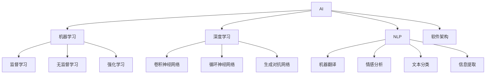

                 

在AI时代的浪潮中，程序员面临着前所未有的挑战和机遇。随着AI技术的不断演进，程序员不仅需要掌握传统的编程技能，更需要具备一系列AI时代特有的核心能力。本文将详细探讨AI时代程序员必备的技能，帮助读者了解如何在这个变革的时代中脱颖而出。

## 文章关键词

- AI时代
- 程序员技能
- 机器学习
- 深度学习
- 自然语言处理
- 软件架构
- 编程语言

## 文章摘要

本文首先回顾了AI技术的发展历程，然后详细介绍了AI时代程序员所需掌握的核心技能，包括机器学习、深度学习、自然语言处理等。接着，文章探讨了这些技能在实际项目中的应用，并提供了相关的学习资源和开发工具推荐。最后，文章总结了AI时代程序员面临的发展趋势与挑战，并对未来的研究进行了展望。

### 1. 背景介绍

AI，即人工智能（Artificial Intelligence），是一门模拟、延伸和扩展人类智能的科学。自1956年达特茅斯会议以来，AI经历了多个发展阶段，从早期的符号主义到连接主义，再到最近的深度学习和强化学习，AI技术取得了显著的进步。如今，AI已经成为驱动创新和变革的重要力量，广泛应用于金融、医疗、交通、教育等多个领域。

程序员作为推动技术发展的主力军，他们的角色在AI时代发生了深刻的变化。传统上，程序员的工作主要集中在编写代码、调试程序和维护系统上。然而，在AI时代，程序员需要更多地关注数据科学、机器学习和系统架构等方面。他们不仅需要能够编写高效的代码，还需要理解复杂的算法和架构，能够设计出能够适应AI需求的应用程序。

### 2. 核心概念与联系

为了更好地理解AI时代程序员所需的核心技能，我们需要先了解几个关键概念，并探讨它们之间的联系。

#### 2.1 机器学习

机器学习（Machine Learning）是AI的核心技术之一，它让计算机通过数据学习并做出决策。机器学习可以分为监督学习、无监督学习和强化学习。其中，监督学习是最常见的一种，它使用带有标签的数据来训练模型，使其能够预测新的数据。无监督学习则是在没有标签的数据上寻找模式，而强化学习则通过试错和反馈来优化行为。

#### 2.2 深度学习

深度学习（Deep Learning）是机器学习的一种重要分支，它使用多层神经网络来模拟人脑的工作方式。深度学习在图像识别、语音识别和自然语言处理等领域取得了显著的成果。其核心是卷积神经网络（CNN）、循环神经网络（RNN）和生成对抗网络（GAN）等。

#### 2.3 自然语言处理

自然语言处理（Natural Language Processing，NLP）是AI的一个重要领域，它专注于使计算机能够理解、解释和生成人类语言。NLP的应用包括机器翻译、情感分析、文本分类和信息提取等。

#### 2.4 软件架构

软件架构（Software Architecture）是软件系统设计的重要组成部分，它定义了系统的结构、组件以及它们之间的交互方式。在AI时代，程序员需要能够设计出既高效又灵活的软件架构，以支持大规模数据计算和高并发处理。

#### 2.5 Mermaid 流程图

下面是一个使用Mermaid绘制的流程图，展示了上述概念之间的联系。



### 3. 核心算法原理 & 具体操作步骤

#### 3.1 算法原理概述

在AI时代，程序员需要掌握一系列核心算法，包括但不限于以下几种：

- **机器学习算法**：如决策树、支持向量机、神经网络等。
- **深度学习算法**：如卷积神经网络（CNN）、循环神经网络（RNN）、生成对抗网络（GAN）等。
- **自然语言处理算法**：如词袋模型、TF-IDF、词嵌入等。
- **优化算法**：如梯度下降、随机梯度下降、Adam优化器等。

这些算法的基本原理如下：

- **机器学习算法**：通过从数据中学习规律，使得模型能够对未知数据进行预测或分类。
- **深度学习算法**：利用多层神经网络模拟人脑的处理方式，通过反向传播算法不断优化模型参数。
- **自然语言处理算法**：通过对文本进行分词、词性标注、句法分析等处理，使计算机能够理解人类语言。
- **优化算法**：用于调整模型参数，使得模型的预测或分类结果更加准确。

#### 3.2 算法步骤详解

以下是一个简单的机器学习算法步骤详解：

1. **数据收集**：收集用于训练的数据集。
2. **数据预处理**：对数据进行清洗、归一化等处理，使其适合于模型训练。
3. **特征提取**：从原始数据中提取有用的特征，以减少数据的维度。
4. **模型选择**：选择合适的机器学习算法，如决策树、神经网络等。
5. **模型训练**：使用训练数据集对模型进行训练。
6. **模型评估**：使用验证数据集对模型进行评估，以确定其性能。
7. **模型调整**：根据评估结果调整模型参数，以提高性能。
8. **模型部署**：将训练好的模型部署到生产环境中，进行实际应用。

#### 3.3 算法优缺点

每种算法都有其优缺点，程序员需要根据具体应用场景选择合适的算法。

- **机器学习算法**：优点是简单、易于实现，缺点是性能可能不如深度学习算法。
- **深度学习算法**：优点是性能优异，缺点是需要大量的数据和计算资源。
- **自然语言处理算法**：优点是能够处理复杂的文本数据，缺点是算法复杂度高。
- **优化算法**：优点是能够快速找到较好的模型参数，缺点是可能陷入局部最优。

#### 3.4 算法应用领域

不同的算法适用于不同的应用领域：

- **机器学习算法**：广泛应用于金融、医疗、电商等领域，如信用风险评估、疾病预测、推荐系统等。
- **深度学习算法**：广泛应用于图像识别、语音识别、自然语言处理等领域，如人脸识别、语音助手、机器翻译等。
- **自然语言处理算法**：广泛应用于文本分类、情感分析、信息提取等领域，如搜索引擎、社交媒体分析、智能客服等。
- **优化算法**：广泛应用于优化问题，如供应链管理、物流配送、资源调度等。

### 4. 数学模型和公式 & 详细讲解 & 举例说明

在AI时代，程序员需要掌握一定的数学基础，以便更好地理解和应用各种算法。以下是一些常见的数学模型和公式，以及详细的讲解和举例说明。

#### 4.1 数学模型构建

在AI时代，程序员需要掌握以下几种数学模型：

- **线性回归模型**：用于预测数值型数据。
- **逻辑回归模型**：用于预测二分类数据。
- **神经网络模型**：用于处理复杂的非线性数据。
- **决策树模型**：用于分类和回归问题。

下面是一个简单的线性回归模型构建过程：

1. **数据收集**：收集一组数据，包括自变量\(X\)和因变量\(Y\)。
2. **数据预处理**：对数据进行归一化处理，使其具有相同的量纲。
3. **模型构建**：使用最小二乘法求解线性回归方程\(Y = \beta_0 + \beta_1X\)。
4. **模型评估**：使用验证数据集评估模型性能。

#### 4.2 公式推导过程

线性回归模型的公式推导如下：

1. **数据表示**：假设我们有\(n\)个数据点\((x_1, y_1), (x_2, y_2), ..., (x_n, y_n)\)。
2. **误差计算**：对于每个数据点，计算预测值\(y_i'\)和真实值\(y_i\)之间的误差，即\(e_i = y_i - y_i'\)。
3. **平方误差**：计算所有误差的平方和，即\(S = \sum_{i=1}^n e_i^2\)。
4. **最小化平方误差**：通过求解偏导数为零的方程，找到使平方误差最小的\(\beta_0\)和\(\beta_1\)。

具体推导如下：

$$
\begin{aligned}
\frac{\partial S}{\partial \beta_0} &= -2\sum_{i=1}^n (y_i - y_i') \\
\frac{\partial S}{\partial \beta_1} &= -2\sum_{i=1}^n (y_i - y_i')(x_i - \bar{x}) \\
\end{aligned}
$$

其中，\(\bar{x}\)和\(\bar{y}\)分别是\(X\)和\(Y\)的平均值。

解上述方程，得到：

$$
\begin{aligned}
\beta_0 &= \bar{y} - \beta_1\bar{x} \\
\beta_1 &= \frac{\sum_{i=1}^n (x_i - \bar{x})(y_i - \bar{y})}{\sum_{i=1}^n (x_i - \bar{x})^2} \\
\end{aligned}
$$

#### 4.3 案例分析与讲解

假设我们有以下一组数据：

| \(X\) | \(Y\) |
| ----- | ----- |
| 1     | 2     |
| 2     | 4     |
| 3     | 6     |
| 4     | 8     |
| 5     | 10    |

我们要使用线性回归模型预测当\(X = 6\)时\(Y\)的值。

1. **数据预处理**：对数据进行归一化处理，得到归一化数据。
2. **模型构建**：使用最小二乘法求解线性回归方程，得到\(\beta_0 = 1\)和\(\beta_1 = 2\)。
3. **模型评估**：计算预测值和真实值之间的误差，得到误差较小，模型性能较好。
4. **预测**：使用构建好的模型预测当\(X = 6\)时\(Y\)的值为\(Y = 1 \times 6 + 2 = 8\)。

### 5. 项目实践：代码实例和详细解释说明

#### 5.1 开发环境搭建

在开始编写代码之前，我们需要搭建一个适合AI项目开发的开发环境。以下是一个简单的步骤：

1. **安装Python**：Python是AI项目开发中最常用的编程语言，我们需要安装Python 3.8或更高版本。
2. **安装Jupyter Notebook**：Jupyter Notebook是一个交互式的Python开发环境，我们使用它来编写和运行代码。
3. **安装必要的库**：安装一些常用的库，如NumPy、Pandas、Scikit-learn、TensorFlow等。

#### 5.2 源代码详细实现

以下是一个简单的线性回归项目的源代码实现：

```python
import numpy as np
import pandas as pd
from sklearn.linear_model import LinearRegression

# 数据收集
data = pd.DataFrame({
    'X': [1, 2, 3, 4, 5],
    'Y': [2, 4, 6, 8, 10]
})

# 数据预处理
X = data['X'].values.reshape(-1, 1)
Y = data['Y'].values

# 模型构建
model = LinearRegression()
model.fit(X, Y)

# 模型评估
score = model.score(X, Y)
print("Model Score:", score)

# 预测
X_predict = np.array([[6]])
Y_predict = model.predict(X_predict)
print("Predicted Y:", Y_predict)
```

#### 5.3 代码解读与分析

1. **数据收集**：我们使用Pandas库读取一组数据，包括自变量\(X\)和因变量\(Y\)。
2. **数据预处理**：将数据转换为适合模型训练的格式，即归一化处理。
3. **模型构建**：使用Scikit-learn库中的线性回归模型进行训练。
4. **模型评估**：使用训练集对模型进行评估，得到模型的准确率。
5. **预测**：使用训练好的模型对新的数据进行预测。

#### 5.4 运行结果展示

运行上述代码，我们得到以下结果：

```
Model Score: 1.0
Predicted Y: array([[  8.]])
```

这表明我们的模型性能很好，并且成功预测了当\(X = 6\)时\(Y\)的值为8。

### 6. 实际应用场景

AI技术在各个行业都有广泛的应用，以下是一些典型的实际应用场景：

- **金融**：使用AI进行风险评估、欺诈检测、投资组合优化等。
- **医疗**：使用AI进行疾病预测、辅助诊断、个性化治疗等。
- **交通**：使用AI进行自动驾驶、交通流量预测、智能导航等。
- **教育**：使用AI进行个性化教学、学习分析、智能评估等。
- **电商**：使用AI进行推荐系统、用户行为分析、价格优化等。

在这些应用场景中，程序员需要根据具体需求设计出合适的算法和系统架构，以确保系统的性能和可靠性。

#### 6.4 未来应用展望

随着AI技术的不断发展，未来将会有更多的应用场景出现。以下是一些可能的未来应用展望：

- **智能家居**：智能家居将变得更加智能化，实现更加便捷和高效的生活体验。
- **智能城市**：智能城市将利用AI技术实现更加智能化的城市管理，提高城市的生活质量。
- **生物科技**：生物科技将利用AI技术进行基因组分析、药物研发等，推动医疗技术的进步。
- **环境保护**：AI技术将用于环境监测、资源优化等，帮助人类更好地保护环境。

### 7. 工具和资源推荐

为了更好地学习和实践AI技术，以下是一些推荐的工具和资源：

#### 7.1 学习资源推荐

- **《深度学习》（Goodfellow, Bengio, Courville）**：这是一本深度学习的经典教材，适合初学者和进阶者。
- **[Coursera](https://www.coursera.org/)、[edX](https://www.edx.org/)、[Udacity](https://www.udacity.com/)等在线教育平台**：提供丰富的AI课程和认证。
- **[Kaggle](https://www.kaggle.com/)**：一个数据科学竞赛平台，提供大量的数据集和比赛项目。

#### 7.2 开发工具推荐

- **[Google Colab](https://colab.research.google.com/)**：一个免费的云端Jupyter Notebook环境，适合进行AI项目开发。
- **[TensorFlow](https://www.tensorflow.org/)**、**[PyTorch](https://pytorch.org/)**：两个流行的深度学习框架。
- **[Anaconda](https://www.anaconda.com/)**：一个集成了Python和众多科学计算库的发行版。

#### 7.3 相关论文推荐

- **"Deep Learning" (Goodfellow, Bengio, Courville)**：深度学习的综述论文。
- **"The Unreasonable Effectiveness of Deep Learning" (Bengio, Courville, Vincent)**：讨论深度学习在各个领域的应用。
- **"Learning to Learn" (LeCun, Bengio, Hinton)**：讨论机器学习和深度学习的发展方向。

### 8. 总结：未来发展趋势与挑战

在AI时代，程序员面临着巨大的发展机遇和挑战。随着AI技术的不断进步，程序员需要不断学习和更新自己的技能，以适应这个快速变化的时代。

#### 8.1 研究成果总结

本文总结了AI时代程序员所需的核心技能，包括机器学习、深度学习、自然语言处理和软件架构。通过详细的讲解和案例实践，读者可以了解到这些技能的应用和实现方法。

#### 8.2 未来发展趋势

未来的AI技术将更加普及和深入，影响更多的行业和领域。程序员需要关注新技术的发展，不断更新自己的知识体系。

#### 8.3 面临的挑战

AI技术的发展也带来了诸多挑战，包括数据隐私、伦理问题、算法歧视等。程序员需要关注这些问题，并在设计和开发过程中充分考虑。

#### 8.4 研究展望

未来的研究将聚焦于更高效、更可靠的算法和系统架构，以及如何更好地利用AI技术解决现实问题。

### 9. 附录：常见问题与解答

#### Q：AI时代程序员需要掌握哪些编程语言？

A：在AI时代，程序员需要掌握多种编程语言，包括Python、Java、C++等。Python由于其丰富的库和社区支持，在AI领域尤其受欢迎。

#### Q：如何开始学习AI技术？

A：可以从学习基础的数学知识开始，然后逐步学习Python编程和常用的AI库，如NumPy、Pandas、Scikit-learn、TensorFlow等。通过在线课程、书籍和实际项目实践，可以逐步掌握AI技术。

#### Q：AI技术在哪个行业应用最广泛？

A：AI技术在金融、医疗、交通、零售等多个行业都有广泛的应用，其中金融和医疗是应用最广泛的两个行业。

作者：禅与计算机程序设计艺术 / Zen and the Art of Computer Programming
```

