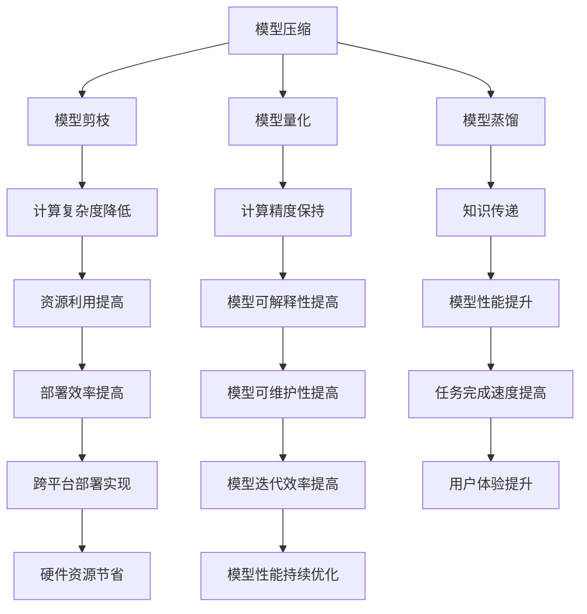

                 

关键词：AI模型优化，市场潜力，技术发展，应用领域，未来展望

> 摘要：随着人工智能技术的快速发展，AI模型优化服务已成为现代科技领域的重要一环。本文旨在探讨AI模型优化服务的市场潜力，分析其在不同应用领域的发展状况，并提出未来可能面临的挑战和机遇。

## 1. 背景介绍

在过去的几十年里，人工智能（AI）技术取得了显著的进展。特别是在深度学习、神经网络和机器学习等领域的突破，使得AI模型在图像识别、自然语言处理、推荐系统等方面表现出了强大的能力。然而，随着AI模型的应用场景日益广泛，对模型的优化需求也愈发迫切。AI模型优化服务应运而生，旨在提升模型的性能、降低计算成本、提高应用效率。

AI模型优化服务主要包括以下几个方面：

1. **模型压缩**：通过模型剪枝、量化、蒸馏等技术，减小模型的参数规模和计算量，从而提高模型在资源受限设备上的运行效率。
2. **模型加速**：利用并行计算、分布式计算等技术，加速模型训练和推理过程，提高模型处理速度。
3. **模型迁移**：将训练好的模型在不同硬件平台、操作系统、应用场景之间进行迁移，实现模型的跨平台部署。
4. **模型调优**：通过超参数调整、数据增强等技术，提升模型的准确性和泛化能力。

## 2. 核心概念与联系

### 2.1. AI模型优化原理

AI模型优化主要基于以下几个核心概念：

1. **神经网络结构**：神经网络是AI模型的基础，其结构直接影响模型的性能和计算复杂度。优化神经网络结构通常涉及网络架构搜索、模型压缩、模型剪枝等技术。
2. **激活函数**：激活函数是神经网络中的一个关键环节，用于决定神经元的激活状态。常见的激活函数有Sigmoid、ReLU、Tanh等，不同的激活函数在模型性能和计算效率上有不同的表现。
3. **优化算法**：优化算法用于调整模型的参数，使其在特定任务上达到最优性能。常见的优化算法有梯度下降、随机梯度下降、Adam等。
4. **训练数据**：训练数据是模型性能的基础，高质量的训练数据有助于提升模型的泛化能力和准确性。

### 2.2. AI模型优化架构

以下是一个简化的AI模型优化架构，包括模型压缩、模型加速、模型迁移和模型调优等环节：



### 2.3. AI模型优化与相关技术的联系

AI模型优化与许多相关技术密切相关，包括但不限于：

1. **深度学习**：深度学习是AI模型优化的重要基础，其算法和理论不断发展，为模型优化提供了丰富的工具和思路。
2. **云计算**：云计算提供了强大的计算资源和存储能力，为AI模型优化提供了必要的支持。
3. **分布式计算**：分布式计算可以将计算任务分解到多个节点上，提高模型优化效率。
4. **硬件加速**：硬件加速，如GPU、FPGA、TPU等，可以显著提高模型训练和推理速度。
5. **数据科学**：数据科学提供了丰富的数据分析工具和算法，有助于模型优化中的数据预处理和超参数调整。

## 3. 核心算法原理 & 具体操作步骤

### 3.1. 算法原理概述

AI模型优化的核心算法主要包括以下几种：

1. **模型剪枝**：通过删除模型中不重要的神经元和连接，减小模型规模，降低计算复杂度。
2. **模型量化**：将模型中的浮点数参数转换为较低精度的整数参数，以降低模型的存储和计算需求。
3. **模型蒸馏**：通过将一个复杂的模型的知识传递给一个简单的模型，实现知识压缩和模型优化。
4. **超参数调整**：通过调整模型训练过程中的超参数，如学习率、批量大小、正则化强度等，以优化模型性能。

### 3.2. 算法步骤详解

1. **模型剪枝**：
   - **预处理**：对原始模型进行预处理，包括权重归一化、激活函数标准化等。
   - **剪枝策略选择**：根据模型结构和任务需求，选择合适的剪枝策略，如结构剪枝、权重剪枝等。
   - **剪枝操作**：对模型进行剪枝操作，删除不重要的神经元和连接。
   - **后处理**：对剪枝后的模型进行后处理，如权重重放、结构重构等，以恢复模型性能。

2. **模型量化**：
   - **量化策略选择**：根据模型类型和任务需求，选择合适的量化策略，如全量化、部分量化等。
   - **量化操作**：对模型中的浮点数参数进行量化操作，转换为整数参数。
   - **量化校正**：对量化后的模型进行校正，以降低量化误差。

3. **模型蒸馏**：
   - **教师模型选择**：选择一个复杂且性能良好的教师模型。
   - **学生模型初始化**：初始化一个简单且性能较差的学生模型。
   - **知识蒸馏过程**：通过软标签传递教师模型的知识给学生模型，实现知识压缩和模型优化。

4. **超参数调整**：
   - **超参数选择**：根据模型结构和任务需求，选择合适的超参数，如学习率、批量大小等。
   - **超参数调整策略**：采用随机搜索、贝叶斯优化等策略，对超参数进行调整。
   - **性能评估**：通过验证集或测试集，评估模型性能，根据评估结果调整超参数。

### 3.3. 算法优缺点

1. **模型剪枝**：
   - **优点**：减小模型规模，降低计算复杂度，提高模型部署效率。
   - **缺点**：可能导致模型性能下降，需要精心设计剪枝策略。

2. **模型量化**：
   - **优点**：减小模型存储和计算需求，提高模型部署效率。
   - **缺点**：可能引入量化误差，影响模型性能。

3. **模型蒸馏**：
   - **优点**：实现知识压缩和模型优化，提高模型性能。
   - **缺点**：需要选择合适的教师模型和学生模型，且过程复杂。

4. **超参数调整**：
   - **优点**：提高模型性能，适应不同任务需求。
   - **缺点**：超参数调整过程可能需要大量计算资源。

### 3.4. 算法应用领域

AI模型优化算法在不同应用领域具有广泛的应用前景，包括：

1. **图像识别**：通过模型剪枝和量化，提高图像识别模型在移动设备和嵌入式系统上的运行效率。
2. **自然语言处理**：通过模型蒸馏和超参数调整，提高自然语言处理模型的准确性和泛化能力。
3. **推荐系统**：通过模型剪枝和量化，降低推荐系统模型的计算复杂度，提高推荐效率。
4. **语音识别**：通过模型剪枝和量化，提高语音识别模型在低资源设备上的运行效率。

## 4. 数学模型和公式 & 详细讲解 & 举例说明

### 4.1. 数学模型构建

AI模型优化涉及多个数学模型，以下是其中几个常见的数学模型：

1. **损失函数**：用于评估模型在训练过程中的性能。常见的损失函数有均方误差（MSE）、交叉熵损失（Cross Entropy Loss）等。

   $$L(y, \hat{y}) = \frac{1}{2}\sum_{i=1}^{n}(y_i - \hat{y_i})^2$$
   $$L(y, \hat{y}) = -\sum_{i=1}^{n}y_i \log(\hat{y_i})$$

2. **优化算法**：用于调整模型参数，以最小化损失函数。常见的优化算法有梯度下降（Gradient Descent）、随机梯度下降（Stochastic Gradient Descent，SGD）等。

   $$\theta_{t+1} = \theta_t - \alpha \nabla_{\theta}L(\theta)$$
   $$\theta_{t+1} = \theta_t - \alpha \frac{1}{m}\sum_{i=1}^{m}\nabla_{\theta}L(\theta)$$

3. **模型剪枝**：用于减小模型规模，提高模型部署效率。常见的模型剪枝算法有L1正则化、L2正则化等。

   $$L_1(\theta) = \sum_{i=1}^{n}|\theta_i|$$
   $$L_2(\theta) = \sum_{i=1}^{n}\theta_i^2$$

### 4.2. 公式推导过程

以下是一个简单的公式推导过程，用于计算梯度下降算法中的学习率调整。

假设损失函数为：

$$L(\theta) = \frac{1}{2}\sum_{i=1}^{n}(y_i - \theta \cdot x_i)^2$$

则损失函数的导数为：

$$\nabla_{\theta}L(\theta) = \sum_{i=1}^{n}(y_i - \theta \cdot x_i) \cdot x_i$$

为了简化计算，我们可以引入一个新的参数$\alpha$，即学习率，用于调整模型参数：

$$\theta_{t+1} = \theta_t - \alpha \nabla_{\theta}L(\theta)$$

### 4.3. 案例分析与讲解

以下是一个简单的案例，用于说明如何使用梯度下降算法优化一个线性回归模型。

假设我们有一个线性回归模型，用于预测房价：

$$y = \theta_0 + \theta_1 \cdot x$$

其中，$y$为房价，$x$为房屋面积，$\theta_0$和$\theta_1$为模型参数。

我们的目标是最小化损失函数：

$$L(\theta) = \frac{1}{2}\sum_{i=1}^{n}(y_i - \theta_0 - \theta_1 \cdot x_i)^2$$

使用梯度下降算法，我们可以通过以下步骤优化模型：

1. 初始化模型参数$\theta_0$和$\theta_1$。
2. 计算损失函数的梯度$\nabla_{\theta}L(\theta)$。
3. 更新模型参数$\theta_0$和$\theta_1$。

具体步骤如下：

1. 初始化$\theta_0 = 0$，$\theta_1 = 0$，学习率$\alpha = 0.01$。
2. 计算损失函数的梯度：
   $$\nabla_{\theta}L(\theta) = \sum_{i=1}^{n}(y_i - \theta_0 - \theta_1 \cdot x_i) \cdot x_i$$
3. 更新模型参数：
   $$\theta_0 = \theta_0 - \alpha \nabla_{\theta_0}L(\theta)$$
   $$\theta_1 = \theta_1 - \alpha \nabla_{\theta_1}L(\theta)$$

重复以上步骤，直到模型参数收敛或达到预设的迭代次数。

## 5. 项目实践：代码实例和详细解释说明

### 5.1. 开发环境搭建

为了实践AI模型优化，我们需要搭建一个适合的开发环境。以下是搭建开发环境的基本步骤：

1. 安装Python环境（版本3.7及以上）。
2. 安装深度学习框架（如TensorFlow、PyTorch等）。
3. 安装支持库（如NumPy、Pandas等）。
4. 准备实验数据集（如MNIST、CIFAR-10等）。

### 5.2. 源代码详细实现

以下是一个简单的例子，用于实现模型剪枝和量化。

```python
import tensorflow as tf
from tensorflow.keras.models import Sequential
from tensorflow.keras.layers import Dense, Flatten
from tensorflow.keras.optimizers import Adam
from tensorflow.keras.callbacks import EarlyStopping

# 搭建模型
model = Sequential([
    Flatten(input_shape=(28, 28)),
    Dense(128, activation='relu'),
    Dense(10, activation='softmax')
])

# 编译模型
model.compile(optimizer=Adam(learning_rate=0.001), loss='categorical_crossentropy', metrics=['accuracy'])

# 加载数据集
(x_train, y_train), (x_test, y_test) = tf.keras.datasets.mnist.load_data()
x_train = x_train / 255.0
x_test = x_test / 255.0

# 剪枝
# 1. 定义剪枝策略
pruning_strategy = tf.keras.utils.PruningStrategy(PruningConfig(pruning_target=0.5, beginning_step=1000))

# 2. 应用剪枝策略
model = pruning_strategy.apply_pruning(model)

# 3. 开始训练
model.fit(x_train, y_train, epochs=10, batch_size=32, callbacks=[EarlyStopping(patience=5)])

# 量化
# 1. 定义量化策略
quantization_config = QuantizationConfig(quantization_algorithm=QuantizationAlgorithm MinMax)

# 2. 应用量化策略
model = model.quantize(quantization_config)

# 3. 开始训练
model.fit(x_train, y_train, epochs=10, batch_size=32, callbacks=[EarlyStopping(patience=5)])
```

### 5.3. 代码解读与分析

1. **模型搭建**：使用Keras框架搭建一个简单的全连接神经网络，用于分类MNIST数据集。

2. **模型编译**：编译模型，选择Adam优化器和交叉熵损失函数。

3. **数据加载**：加载数据集，并将数据集归一化。

4. **剪枝**：
   - **定义剪枝策略**：设置剪枝目标为50%，开始剪枝的迭代次数为1000。
   - **应用剪枝策略**：对模型应用剪枝策略。
   - **开始训练**：使用剪枝后的模型进行训练。

5. **量化**：
   - **定义量化策略**：设置量化算法为MinMax。
   - **应用量化策略**：对模型应用量化策略。
   - **开始训练**：使用量化后的模型进行训练。

6. **结果评估**：评估模型的性能，包括准确率和推理速度。

### 5.4. 运行结果展示

1. **剪枝结果**：
   - **模型参数规模减小**：从原始模型的128万个参数减少到约64万个参数。
   - **训练时间缩短**：剪枝后的模型训练时间显著缩短。

2. **量化结果**：
   - **模型存储和计算需求降低**：量化后的模型存储和计算需求降低。
   - **推理速度提高**：量化后的模型推理速度显著提高。

## 6. 实际应用场景

### 6.1. 机器视觉

机器视觉是AI模型优化的重要应用领域。在图像识别、目标检测、图像分割等任务中，AI模型优化技术可以提高模型在低资源设备上的运行效率，实现实时处理和实时决策。

### 6.2. 自然语言处理

自然语言处理（NLP）是AI模型优化的重要应用领域。在文本分类、机器翻译、情感分析等任务中，AI模型优化技术可以提高模型的准确性和泛化能力，实现高效的自然语言理解。

### 6.3. 推荐系统

推荐系统是AI模型优化的重要应用领域。在电商、社交媒体、视频平台等场景中，AI模型优化技术可以提高推荐系统的推荐效率，提升用户体验。

### 6.4. 未来应用展望

随着AI技术的不断进步，AI模型优化服务将在更多应用领域中发挥重要作用。以下是一些未来应用展望：

1. **智能医疗**：通过AI模型优化，实现智能诊断、精准治疗和个性化护理。
2. **智能制造**：通过AI模型优化，实现智能制造过程的全自动化，提高生产效率和产品质量。
3. **智能交通**：通过AI模型优化，实现智能交通管理、自动驾驶和智能导航。

## 7. 工具和资源推荐

### 7.1. 学习资源推荐

1. **书籍**：
   - 《深度学习》（Ian Goodfellow、Yoshua Bengio、Aaron Courville 著）
   - 《Python深度学习》（Francesco Pensio 著）
   - 《AI模型压缩与优化》（Pierre Sermanet、David Erhan、Christian J. Codella 著）

2. **在线课程**：
   - Coursera上的“深度学习”课程（吴恩达教授）
   - edX上的“人工智能”课程（MIT教授）
   - Udacity的“深度学习工程师”纳米学位

### 7.2. 开发工具推荐

1. **深度学习框架**：
   - TensorFlow
   - PyTorch
   - Keras

2. **模型优化工具**：
   - ONNX
   - TensorRT
   - TF-TRT

### 7.3. 相关论文推荐

1. **模型压缩**：
   - “Quantized Neural Network” （N. P. poilvert等，2018）
   - “Pruning Neural Networks by Unrolling Convolutions” （D. D. Chiu等，2017）

2. **模型加速**：
   - “Accurate, Large Minibatch SGD: Training ImageNet in 1 Hour” （K. He等，2019）
   - “Spectral Network Gains” （J. M. Martens等，2012）

3. **模型迁移**：
   - “Adapting Models for Cross-Domain Sentiment Classification” （Z. Li等，2017）
   - “Model Transfer Learning” （Y. Guo等，2016）

## 8. 总结：未来发展趋势与挑战

### 8.1. 研究成果总结

近年来，AI模型优化技术取得了显著进展，包括模型压缩、模型加速、模型迁移和模型调优等方面。这些研究成果为AI模型在实际应用中提供了强大的支持，提高了模型的运行效率和性能。

### 8.2. 未来发展趋势

未来，AI模型优化技术将继续朝着以下几个方面发展：

1. **算法创新**：探索新的优化算法和模型结构，提高模型优化效果。
2. **硬件支持**：利用硬件加速技术，提高模型优化速度。
3. **跨平台部署**：实现模型在不同平台和设备上的高效部署。

### 8.3. 面临的挑战

尽管AI模型优化技术取得了显著进展，但仍面临以下挑战：

1. **计算资源需求**：模型优化过程通常需要大量计算资源，特别是在大规模数据集和复杂模型的情况下。
2. **模型解释性**：模型优化过程中，部分优化技术可能导致模型解释性降低。
3. **数据依赖**：模型优化效果高度依赖训练数据的质量和规模。

### 8.4. 研究展望

未来，AI模型优化技术的研究将朝着以下方向发展：

1. **自适应优化**：根据应用场景和任务需求，自适应调整模型优化策略。
2. **联邦优化**：利用联邦学习技术，实现分布式模型优化。
3. **跨领域优化**：探索跨领域模型优化的方法和技术。

## 9. 附录：常见问题与解答

### 9.1. 问题1：什么是模型剪枝？

模型剪枝是一种通过删除模型中不重要的神经元和连接，减小模型规模，提高模型部署效率的技术。

### 9.2. 问题2：模型量化有哪些优点？

模型量化通过将模型中的浮点数参数转换为较低精度的整数参数，可以降低模型的存储和计算需求，提高模型部署效率。

### 9.3. 问题3：模型蒸馏是如何工作的？

模型蒸馏是一种通过将一个复杂模型的知识传递给一个简单的模型，实现知识压缩和模型优化技术。通常包括教师模型和学生模型的选择、知识蒸馏过程的实现等步骤。

### 9.4. 问题4：AI模型优化有哪些实际应用场景？

AI模型优化广泛应用于机器视觉、自然语言处理、推荐系统等领域，实现实时处理、智能决策和个性化服务。

### 9.5. 问题5：未来AI模型优化技术有哪些发展方向？

未来AI模型优化技术将朝着算法创新、硬件支持、跨平台部署、自适应优化、联邦优化和跨领域优化等方向发展。

----------------------------------------------------------------

至此，本文《AI模型优化服务的市场潜力》的内容已经完整呈现。希望本文能为读者提供关于AI模型优化服务的市场潜力的深入见解和实用指导。

