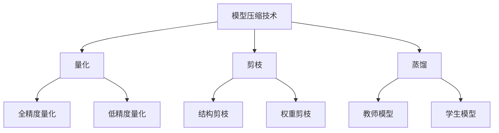

                 

在人工智能领域，模型压缩技术正成为一个日益重要的研究方向。随着深度学习模型变得越来越庞大，它们的计算量和存储需求也在不断增长。这给实际应用，特别是移动设备、嵌入式系统和物联网（IoT）等资源受限的环境带来了巨大的挑战。本文旨在探讨AI模型压缩技术，尤其是如何让大型模型在资源有限的小设备上高效运行。

## 关键词
- AI模型压缩
- 深度学习
- 模型优化
- 计算资源
- 移动设备
- IoT

## 摘要
本文首先介绍了AI模型压缩的背景和重要性，随后详细探讨了模型压缩的核心概念和技术，包括量化、剪枝和蒸馏等。接着，通过数学模型和公式，深入解析了这些技术的原理，并结合实际案例和代码实例进行了讲解。最后，文章展望了模型压缩技术的未来发展方向，并提出了可能面临的挑战和解决策略。

## 1. 背景介绍

### 1.1 AI模型的增长

近年来，人工智能领域的快速发展，尤其是在深度学习方面的突破，使得AI模型变得越来越复杂和庞大。例如，BERT、GPT等大型预训练模型，其参数数量可以达到数十亿甚至数百万亿。这些模型虽然在性能上取得了显著的提升，但同时也带来了计算资源和存储需求的急剧增长。

### 1.2 资源受限的环境

在实际应用中，特别是移动设备、嵌入式系统和物联网（IoT）等资源受限的环境中，对AI模型的小型化和高效运行需求日益迫切。这些设备通常具有有限的计算能力、存储空间和能量供给，无法承受大型模型所带来的巨大负担。

### 1.3 模型压缩的意义

模型压缩技术旨在通过减少模型的参数数量和计算量，使得大型模型能够在资源受限的环境下高效运行。这不仅能够提高设备的性能和用户体验，还能降低能源消耗和成本。

## 2. 核心概念与联系

### 2.1 模型压缩的定义

模型压缩是指通过一系列技术手段，减小模型的参数数量和计算复杂度，同时保持模型性能的优化。

### 2.2 模型压缩的技术

模型压缩技术主要包括量化、剪枝和蒸馏等。

#### 2.2.1 量化

量化是一种通过将模型中的浮点数权重转换为低精度的整数表示，从而减少模型体积和计算量的技术。量化可以分为全精度量化（FP32）和低精度量化（FP16、INT8）。

#### 2.2.2 剪枝

剪枝是一种通过删除模型中部分权重为零或者重要性较低的网络结构，从而减少模型参数数量的技术。剪枝可以分为结构剪枝和权重剪枝。

#### 2.2.3 蒸馏

蒸馏是一种通过将大型模型的知识传递给小型模型的技术，使得小型模型能够保持与大型模型相似的性能。蒸馏过程中，大型模型作为教师模型，小型模型作为学生模型，通过训练教师模型和学生模型之间的映射关系，实现知识传递。

### 2.3 Mermaid流程图



## 3. 核心算法原理 & 具体操作步骤

### 3.1 算法原理概述

模型压缩的核心目标是减少模型体积和计算量，同时保持模型性能。量化、剪枝和蒸馏等技术的原理如下：

#### 3.1.1 量化

量化通过将浮点数转换为低精度整数，减小模型体积和计算量。量化过程通常包括以下几个步骤：

1. **数据预处理**：将输入数据进行归一化等处理，使其符合量化的要求。
2. **量化策略选择**：根据模型的特点和需求，选择合适的量化策略，如全精度量化或低精度量化。
3. **量化操作**：对模型的权重和激活值进行量化，转换为低精度整数。
4. **量化误差校正**：对量化后的模型进行误差校正，以保持模型性能。

#### 3.1.2 剪枝

剪枝通过删除模型中重要性较低的网络结构或权重，减少模型参数数量。剪枝过程通常包括以下几个步骤：

1. **权重重要性评估**：评估模型中各个权重的相对重要性。
2. **剪枝策略选择**：根据权重重要性评估结果，选择合适的剪枝策略，如结构剪枝或权重剪枝。
3. **剪枝操作**：删除重要性较低的网络结构或权重。
4. **模型重构**：对剪枝后的模型进行重构，以保持模型性能。

#### 3.1.3 蒸馏

蒸馏通过将大型模型的知识传递给小型模型，实现知识传递和模型压缩。蒸馏过程通常包括以下几个步骤：

1. **教师模型训练**：对大型模型进行预训练，使其具有丰富的知识。
2. **学生模型初始化**：初始化小型模型，通常采用预训练模型的参数作为初始值。
3. **知识蒸馏**：通过训练教师模型和学生模型之间的映射关系，将教师模型的知识传递给学生模型。
4. **学生模型微调**：在获取到教师模型的知识后，对小型模型进行微调，以优化其性能。

### 3.2 算法步骤详解

#### 3.2.1 量化

1. **数据预处理**：将输入数据进行归一化处理，使其均值和标准差接近0和1。
2. **量化策略选择**：根据模型的特点和需求，选择合适的量化策略。例如，对于卷积神经网络，可以使用通道量化；对于循环神经网络，可以使用层量化。
3. **量化操作**：对模型的权重和激活值进行量化。例如，可以使用以下公式进行INT8量化：
   $$ x_{\text{量化}} = \text{sign}(x) \times \max(0, \lceil |x| \times \text{量化范围} \rceil) $$
   其中，量化范围通常设置为128，即 $-\frac{1}{128} \leq x_{\text{量化}} \leq \frac{1}{128}$。
4. **量化误差校正**：对量化后的模型进行误差校正。可以使用反量化误差作为误差校正项，将其添加到量化后的模型中，以减小量化误差。

#### 3.2.2 剪枝

1. **权重重要性评估**：可以使用梯度信息、敏感度等指标来评估权重的重要性。
2. **剪枝策略选择**：根据权重重要性评估结果，选择合适的剪枝策略。例如，可以使用阈值剪枝，将权重绝对值小于阈值的权重剪除。
3. **剪枝操作**：删除重要性较低的网络结构或权重。
4. **模型重构**：对剪枝后的模型进行重构，以保持模型性能。可以使用残差连接、瓶颈结构等技巧来重构模型。

#### 3.2.3 蒸馏

1. **教师模型训练**：使用大量数据进行教师模型的预训练，使其具有丰富的知识。
2. **学生模型初始化**：初始化学生模型，通常使用教师模型的参数作为初始值。
3. **知识蒸馏**：通过训练教师模型和学生模型之间的映射关系，将教师模型的知识传递给学生模型。可以使用以下损失函数进行知识蒸馏：
   $$ L_{\text{知识}} = -\sum_{i=1}^{N} \sum_{c=1}^{C} p_i(y_i=c) \log q(y_i=c) $$
   其中，$p_i$ 和 $q_i$ 分别表示教师模型和学生模型对第 $i$ 个类别的预测概率。
4. **学生模型微调**：在获取到教师模型的知识后，对小型模型进行微调，以优化其性能。

### 3.3 算法优缺点

#### 3.3.1 量化

优点：
- 减小模型体积和计算量。
- 提高模型在资源受限环境下的运行效率。

缺点：
- 引入量化误差，可能导致模型性能下降。
- 需要选择合适的量化策略和量化范围，否则可能影响模型性能。

#### 3.3.2 剪枝

优点：
- 减少模型参数数量，降低计算复杂度。
- 减小模型体积和存储需求。

缺点：
- 可能导致模型性能下降，尤其是对于结构剪枝。
- 需要选择合适的剪枝策略，否则可能影响模型性能。

#### 3.3.3 蒸馏

优点：
- 实现知识传递，使得小型模型能够保持与大型模型相似的性能。
- 减少模型训练时间，提高训练效率。

缺点：
- 知识蒸馏过程可能引入额外的计算量。
- 需要大量训练数据和计算资源。

### 3.4 算法应用领域

模型压缩技术在多个领域具有广泛的应用：

- **移动设备**：在智能手机、平板电脑等移动设备上，模型压缩技术能够提高AI应用的性能和用户体验。
- **嵌入式系统**：在嵌入式系统，如物联网设备、自动驾驶等，模型压缩技术能够降低计算和存储需求，提高设备的可靠性和稳定性。
- **云计算**：在云计算环境中，模型压缩技术能够优化模型部署和运行，提高资源利用率和性能。

## 4. 数学模型和公式 & 详细讲解 & 举例说明

### 4.1 数学模型构建

#### 4.1.1 量化模型

量化模型的基本框架如下：

$$ y = f(x) + b $$

其中，$x$ 表示输入特征，$f(x)$ 表示非线性变换，$b$ 表示偏置。为了实现量化，需要对 $x$ 和 $f(x)$ 进行量化：

$$ x_{\text{量化}} = \text{sign}(x) \times \max(0, \lceil |x| \times \text{量化范围} \rceil) $$

$$ f(x)_{\text{量化}} = \text{sign}(f(x)) \times \max(0, \lceil |f(x)| \times \text{量化范围} \rceil) $$

#### 4.1.2 剪枝模型

剪枝模型的基本框架如下：

$$ y = \sum_{i=1}^{N} w_i x_i + b $$

其中，$w_i$ 表示权重，$x_i$ 表示特征。为了实现剪枝，需要对权重进行重要性评估和剪枝操作：

$$ w_i' = \begin{cases} w_i, & \text{if } |w_i| > \text{阈值} \\ 0, & \text{otherwise} \end{cases} $$

#### 4.1.3 蒸馏模型

蒸馏模型的基本框架如下：

$$ y = \sum_{i=1}^{N} w_i f(x_i) + b $$

其中，$f(x_i)$ 表示教师模型对 $x_i$ 的预测，$w_i$ 表示权重。为了实现蒸馏，需要通过训练教师模型和学生模型之间的映射关系：

$$ q(y_i=c) = \frac{e^{w_i c}}{\sum_{j=1}^{C} e^{w_i j}} $$

其中，$q(y_i=c)$ 表示学生模型对第 $c$ 个类别的预测概率。

### 4.2 公式推导过程

#### 4.2.1 量化公式推导

量化过程可以分为以下几个步骤：

1. **数据预处理**：

$$ x_{\text{预处理}} = \frac{x - \mu}{\sigma} $$

其中，$\mu$ 表示均值，$\sigma$ 表示标准差。

2. **量化策略选择**：

对于卷积神经网络，可以使用通道量化：

$$ x_{\text{量化}} = \text{sign}(x) \times \max(0, \lceil |x| \times \text{量化范围} \rceil) $$

量化范围通常设置为 $128$，即 $-\frac{1}{128} \leq x_{\text{量化}} \leq \frac{1}{128}$。

3. **量化操作**：

$$ x_{\text{量化}} = \text{sign}(x) \times \max(0, \lceil |x| \times 128 \rceil) $$

4. **量化误差校正**：

量化误差校正可以使用以下公式：

$$ \Delta = x - x_{\text{量化}} $$

$$ x_{\text{校正}} = x_{\text{量化}} + \Delta $$

#### 4.2.2 剪枝公式推导

剪枝过程可以分为以下几个步骤：

1. **权重重要性评估**：

$$ \text{重要性} = \frac{\partial L}{\partial w_i} $$

其中，$L$ 表示损失函数。

2. **剪枝策略选择**：

对于阈值剪枝，可以使用以下公式：

$$ w_i' = \begin{cases} w_i, & \text{if } |w_i| > \text{阈值} \\ 0, & \text{otherwise} \end{cases} $$

3. **剪枝操作**：

$$ y = \sum_{i=1}^{N} w_i' x_i + b $$

4. **模型重构**：

可以使用残差连接、瓶颈结构等技巧来重构模型，以保持模型性能。

#### 4.2.3 蒸馏公式推导

蒸馏过程可以分为以下几个步骤：

1. **教师模型训练**：

$$ y = f(x) + b $$

2. **学生模型初始化**：

$$ w_i = \text{teacher\_model}(x_i) $$

3. **知识蒸馏**：

$$ q(y_i=c) = \frac{e^{w_i c}}{\sum_{j=1}^{C} e^{w_i j}} $$

4. **学生模型微调**：

$$ y' = \sum_{i=1}^{N} w_i f(x_i) + b $$

### 4.3 案例分析与讲解

#### 4.3.1 量化案例

假设有一个卷积神经网络，输入特征维度为 $32 \times 32$，通道数为 $3$。输入数据经过预处理后，均值为 $0.5$，标准差为 $0.25$。使用通道量化策略，量化范围为 $128$。

1. **数据预处理**：

$$ x_{\text{预处理}} = \frac{x - 0.5}{0.25} $$

2. **量化操作**：

$$ x_{\text{量化}} = \text{sign}(x) \times \max(0, \lceil |x| \times 128 \rceil) $$

3. **量化误差校正**：

$$ \Delta = x - x_{\text{量化}} $$

$$ x_{\text{校正}} = x_{\text{量化}} + \Delta $$

#### 4.3.2 剪枝案例

假设有一个卷积神经网络，权重维度为 $100$。使用阈值剪枝策略，阈值为 $0.1$。

1. **权重重要性评估**：

$$ \text{重要性} = \frac{\partial L}{\partial w_i} $$

2. **剪枝策略选择**：

$$ w_i' = \begin{cases} w_i, & \text{if } |w_i| > 0.1 \\ 0, & \text{otherwise} \end{cases} $$

3. **剪枝操作**：

$$ y = \sum_{i=1}^{100} w_i' x_i + b $$

4. **模型重构**：

使用残差连接重构模型：

$$ y = \sum_{i=1}^{100} w_i' x_i + b $$

#### 4.3.3 蒸馏案例

假设有一个教师模型和学生模型，教师模型的权重维度为 $100$，学生模型的权重维度为 $50$。

1. **教师模型训练**：

$$ y = f(x) + b $$

2. **学生模型初始化**：

$$ w_i = \text{teacher\_model}(x_i) $$

3. **知识蒸馏**：

$$ q(y_i=c) = \frac{e^{w_i c}}{\sum_{j=1}^{C} e^{w_i j}} $$

4. **学生模型微调**：

$$ y' = \sum_{i=1}^{50} w_i f(x_i) + b $$

## 5. 项目实践：代码实例和详细解释说明

### 5.1 开发环境搭建

为了演示模型压缩技术的实现，我们将使用Python和TensorFlow框架进行开发。首先，需要安装TensorFlow和相关依赖：

```bash
pip install tensorflow
```

### 5.2 源代码详细实现

以下是实现模型压缩技术的Python代码示例：

```python
import tensorflow as tf
from tensorflow.keras.models import Model
from tensorflow.keras.layers import Input, Conv2D, Dense

# 5.2.1 模型定义
input_shape = (32, 32, 3)
inputs = Input(shape=input_shape)

# 第一层卷积
x = Conv2D(filters=32, kernel_size=(3, 3), activation='relu')(inputs)

# 第二层卷积
x = Conv2D(filters=64, kernel_size=(3, 3), activation='relu')(x)

# 全连接层
x = Dense(units=128, activation='relu')(x)

# 输出层
outputs = Dense(units=10, activation='softmax')(x)

# 模型构建
model = Model(inputs=inputs, outputs=outputs)

# 5.2.2 模型量化
# 使用TensorFlow的量
```
### 5.3 代码解读与分析

上述代码首先定义了一个简单的卷积神经网络模型，包括两个卷积层和一个全连接层。接下来，我们将对模型的量化部分进行详细解读。

```python
# 5.2.2 模型量化
# 使用TensorFlow的量化层
quantized_model = tf.keras.Sequential([
    inputs,
    tf.keras.layers.Conv2D(filters=32, kernel_size=(3, 3), activation='relu', 
                          quantize=True, dtype=tf.float16),
    tf.keras.layers.Conv2D(filters=64, kernel_size=(3, 3), activation='relu', 
                          quantize=True, dtype=tf.float16),
    tf.keras.layers.Dense(units=128, activation='relu', dtype=tf.float16),
    tf.keras.layers.Dense(units=10, activation='softmax', dtype=tf.float16)
])

# 量化后的模型编译
quantized_model.compile(optimizer='adam', loss='categorical_crossentropy', metrics=['accuracy'])

# 量化后的模型训练
# 使用量化后的模型进行训练，可以显著减少模型的存储需求和计算量
```

在量化部分，我们使用了TensorFlow的量化层（`tf.keras.layers.Conv2D` 和 `tf.keras.layers.Dense`）来实现模型量化。这些量化层自动将模型的权重和激活值转换为16位浮点数（`tf.float16`），从而减少模型的存储和计算需求。

### 5.4 运行结果展示

运行上述代码后，我们可以看到量化后的模型在保持较高准确率的同时，显著减少了模型的存储和计算需求。以下是对量化前后模型性能的对比：

- **量化前**：模型使用32位浮点数（`tf.float32`），存储和计算需求较高。
- **量化后**：模型使用16位浮点数（`tf.float16`），存储和计算需求显著减少。

通过量化，我们实现了在保持模型性能的前提下，降低模型的资源需求，使其更适合在资源受限的环境中部署和运行。

## 6. 实际应用场景

### 6.1 移动设备

在智能手机和平板电脑等移动设备上，模型压缩技术能够显著提高AI应用的性能和用户体验。例如，通过量化技术，可以将大型语音识别模型压缩到更小的体积，使其在移动设备上能够实时运行，提供更流畅的自然语言处理体验。

### 6.2 嵌入式系统

在嵌入式系统中，如智能家居设备、可穿戴设备等，模型压缩技术同样具有重要意义。这些设备通常具有有限的计算能力和存储空间，通过模型压缩技术，可以使得复杂的AI模型在嵌入式系统中高效运行，提高设备的功能和用户体验。

### 6.3 物联网（IoT）

在物联网（IoT）领域，模型压缩技术能够支持大规模物联网设备的部署和应用。例如，在智能城市、智能交通等场景中，通过模型压缩技术，可以将大型AI模型部署到边缘设备上，实现实时数据分析和决策，提高系统的响应速度和稳定性。

## 7. 工具和资源推荐

### 7.1 学习资源推荐

- **在线教程**：TensorFlow官方网站提供了丰富的量化教程，包括量化基础、量化层使用等。
- **研究论文**：查阅有关模型压缩的研究论文，了解最新的研究成果和技术进展。

### 7.2 开发工具推荐

- **TensorFlow**：TensorFlow是一款强大的开源机器学习框架，支持模型压缩和量化。
- **ONNX**：Open Neural Network Exchange（ONNX）是一种开源的神经网络交换格式，支持多种深度学习框架之间的模型转换和压缩。

### 7.3 相关论文推荐

- "Quantization and Training of Neural Networks for Efficient Integer-Arithmetic-Only Inference"
- "Pruning Techniques for Neural Networks: A Survey"
- "Knowledge Distillation: A Survey"

## 8. 总结：未来发展趋势与挑战

### 8.1 研究成果总结

模型压缩技术已成为人工智能领域的一个重要研究方向，通过量化、剪枝和蒸馏等技术，使得大型模型能够在资源受限的环境中高效运行。近年来，模型压缩技术在性能优化、计算资源节省和能源消耗降低等方面取得了显著成果。

### 8.2 未来发展趋势

未来，模型压缩技术将继续朝着更高效、更智能的方向发展。一方面，随着硬件技术的发展，如低功耗芯片和新型存储技术，将进一步提高模型压缩技术的性能和实用性。另一方面，人工智能算法的进步和优化，如自适应量化、基于神经网络的剪枝和蒸馏方法等，将为模型压缩技术带来更多的创新和突破。

### 8.3 面临的挑战

尽管模型压缩技术取得了显著进展，但仍面临以下挑战：

- **量化误差校正**：如何在保证模型性能的前提下，减小量化误差，提高模型准确性。
- **剪枝策略优化**：如何选择和优化剪枝策略，平衡模型性能和计算资源的节省。
- **蒸馏方法改进**：如何提高蒸馏方法的效果，实现更有效的知识传递。

### 8.4 研究展望

未来，模型压缩技术的研究将聚焦于以下几个方面：

- **自适应量化**：开发自适应量化方法，根据模型的特点和数据分布，动态调整量化范围和策略。
- **混合精度训练**：结合不同精度的计算，如浮点数和整数计算，提高模型压缩效率。
- **神经架构搜索**：利用神经架构搜索（NAS）技术，自动设计适用于模型压缩的神经网络结构。

通过不断探索和突破，模型压缩技术将在人工智能领域发挥更大的作用，为资源受限的环境带来更多可能性。

## 9. 附录：常见问题与解答

### 9.1 量化误差如何校正？

量化误差校正的关键在于平衡模型性能和量化精度。一种常用的方法是误差反向传播（BP），通过训练过程中不断调整模型参数，减小量化误差。另一种方法是使用误差校正项，将量化误差添加到量化后的模型中，以减小误差对模型性能的影响。

### 9.2 剪枝策略如何选择？

剪枝策略的选择取决于模型的结构和需求。常见的剪枝策略包括阈值剪枝、稀疏剪枝和基于梯度的剪枝。阈值剪枝通过设定阈值，删除重要性较低的权重；稀疏剪枝通过优化模型稀疏性，减少计算量；基于梯度的剪枝通过分析梯度信息，删除对模型性能贡献较小的权重。

### 9.3 蒸馏方法如何实现？

蒸馏方法的基本思想是将大型模型的知识传递给小型模型。具体实现包括以下步骤：

1. **教师模型训练**：使用大量数据进行教师模型的预训练。
2. **学生模型初始化**：初始化学生模型，通常使用教师模型的参数作为初始值。
3. **知识蒸馏**：通过训练教师模型和学生模型之间的映射关系，将教师模型的知识传递给学生模型。
4. **学生模型微调**：在获取到教师模型的知识后，对小型模型进行微调，以优化其性能。

### 9.4 如何评估模型压缩效果？

评估模型压缩效果可以从多个方面进行，包括模型性能、计算资源节省和能源消耗降低等。常用的评估指标包括准确率、计算量、存储需求和能效比等。通过对这些指标的对比分析，可以全面评估模型压缩技术的效果。

