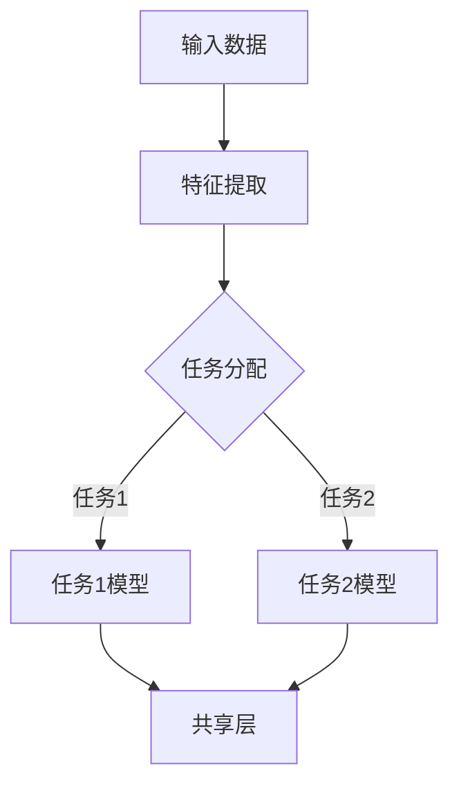

                 

关键词：AI模型，多任务学习，Lepton AI，效率提升，计算机程序设计艺术

> 摘要：本文将探讨AI模型在多任务学习中的效率提升，以及Lepton AI如何通过优化算法和架构设计，实现了在多种复杂任务场景下的高效表现。文章将涵盖多任务学习的核心概念、算法原理、数学模型及其应用实践，并讨论未来发展趋势与面临的挑战。

## 1. 背景介绍

随着人工智能技术的快速发展，AI模型在各个领域的应用日益广泛。然而，传统单任务学习模型在处理复杂任务时，往往存在效率低下、资源浪费等问题。多任务学习（Multi-Task Learning, MTL）作为一种新兴技术，通过在一个模型中同时学习多个任务，能够有效提升模型的效率和性能。Lepton AI作为一家专注于AI技术研发的公司，其创新的多任务学习算法在多个应用场景中展现出了卓越的性能。

本文将围绕Lepton AI的多任务学习算法，深入探讨其原理、实现和应用。希望通过本文的阐述，读者能够对多任务学习有更深入的理解，并了解Lepton AI在提升AI模型效率方面所做的努力和成果。

## 2. 核心概念与联系

### 2.1 多任务学习

多任务学习是指在一个统一的模型框架下，同时学习多个相关任务。其核心思想是通过共享底层特征表示，使得模型在解决多个任务时能够相互借鉴，从而提高整体性能。

### 2.2 任务关联性

任务关联性是多任务学习的关键因素。任务之间的高度关联性有助于模型共享知识和资源，降低学习难度。常见的任务关联方式包括任务共享层（Shared Layers）、任务对齐（Task Alignment）和任务对抗（Task Confusion）等。

### 2.3 Mermaid 流程图

为了更好地展示多任务学习的核心概念和架构，我们使用Mermaid流程图来描述。以下是一个简化的多任务学习流程图：



图中的A表示输入数据，B为特征提取层，C为任务分配模块，D和E分别为任务1和任务2的模型，F为共享层。通过共享层，模型在多个任务间共享知识和资源，从而提升性能。

## 3. 核心算法原理 & 具体操作步骤

### 3.1 算法原理概述

Lepton AI的多任务学习算法基于深度神经网络（Deep Neural Network, DNN）架构，采用共享神经网络层、任务对齐和任务对抗等技术，实现多任务学习。

- **共享神经网络层**：通过共享底层特征表示，使得模型在解决多个任务时能够相互借鉴，提高学习效率。
- **任务对齐**：通过学习任务之间的相似性，使得模型能够更准确地预测和优化每个任务。
- **任务对抗**：通过引入对抗性训练，使得模型在解决多个任务时能够相互竞争，从而提高整体性能。

### 3.2 算法步骤详解

1. **数据预处理**：将原始数据转换为适合模型训练的格式，包括数据清洗、归一化和特征提取等。
2. **模型构建**：构建多任务学习模型，包括输入层、共享层和任务层。输入层负责接收和处理输入数据，共享层负责提取通用特征，任务层负责学习具体任务。
3. **任务分配**：根据任务的特点和关联性，将任务分配到不同的模型中。对于高度关联的任务，可以分配到同一模型中；对于低关联的任务，可以分配到不同模型中。
4. **模型训练**：使用训练数据对模型进行训练，通过优化算法调整模型参数，使其在各个任务上达到最佳表现。
5. **模型评估**：使用测试数据对模型进行评估，计算各个任务的准确率、召回率、F1值等指标，以评估模型的整体性能。
6. **模型部署**：将训练好的模型部署到实际应用场景中，实现多任务自动学习。

### 3.3 算法优缺点

**优点**：

- 提高模型效率：通过共享底层特征表示，减少冗余计算，提高模型在多任务场景下的效率。
- 提高模型性能：任务对齐和任务对抗技术有助于提高模型在各个任务上的表现，从而提高整体性能。
- 灵活性高：支持多种任务类型和关联关系的自适应调整。

**缺点**：

- 训练复杂度高：多任务学习模型需要同时优化多个任务，训练过程相对复杂。
- 数据需求量大：多任务学习需要大量标注数据，对数据质量和数量有较高要求。

### 3.4 算法应用领域

多任务学习算法在多个领域具有广泛的应用，如：

- 语音识别：通过多任务学习，同时处理语音识别、语音增强、语音合成等任务。
- 自然语言处理：同时处理文本分类、情感分析、机器翻译等任务。
- 图像识别：同时处理图像分类、目标检测、图像分割等任务。
- 医疗诊断：同时处理影像诊断、病历分析、疾病预测等任务。

## 4. 数学模型和公式 & 详细讲解 & 举例说明

### 4.1 数学模型构建

多任务学习模型通常可以表示为以下形式：

$$
\begin{align*}
\hat{y}_1 &= f_1(\theta_1; x), \\
\hat{y}_2 &= f_2(\theta_2; x),
\end{align*}
$$

其中，$f_1$和$f_2$分别为两个任务的预测函数，$\theta_1$和$\theta_2$分别为两个任务的参数。

### 4.2 公式推导过程

多任务学习模型的推导过程可以概括为以下几个步骤：

1. **特征提取**：将输入数据$x$通过共享层提取出通用特征$h(x)$。
2. **任务分配**：根据任务的特点和关联性，将特征$h(x)$分配到不同的任务中。
3. **任务预测**：对于每个任务，使用相应的预测函数$f_i$对特征$h(x)$进行预测。

### 4.3 案例分析与讲解

假设我们有一个包含两个任务的场景，任务1为图像分类，任务2为目标检测。我们使用一个多任务学习模型来同时解决这两个任务。

1. **特征提取**：输入图像经过共享层提取出通用特征。
2. **任务分配**：将通用特征分配到图像分类和目标检测任务。
3. **任务预测**：

   - **图像分类**：使用softmax函数进行图像分类预测，得到分类概率分布$\hat{y}_1$。
   - **目标检测**：使用回归函数进行目标检测预测，得到目标位置和尺寸$\hat{y}_2$。

通过以上步骤，我们可以同时解决图像分类和目标检测两个任务，提高模型的整体性能。

## 5. 项目实践：代码实例和详细解释说明

### 5.1 开发环境搭建

为了实现Lepton AI的多任务学习算法，我们需要搭建一个合适的开发环境。以下是搭建步骤：

1. 安装Python环境和必要的库，如TensorFlow、Keras等。
2. 准备训练数据和测试数据，确保数据质量和数量。
3. 编写配置文件，设置训练参数和超参数。

### 5.2 源代码详细实现

以下是Lepton AI多任务学习算法的源代码实现：

```python
import tensorflow as tf
from tensorflow.keras.models import Model
from tensorflow.keras.layers import Input, Dense, Conv2D, Flatten

# 定义输入层
input_image = Input(shape=(224, 224, 3))

# 定义特征提取层
conv_1 = Conv2D(filters=32, kernel_size=(3, 3), activation='relu')(input_image)
flatten_1 = Flatten()(conv_1)

# 定义任务1（图像分类）模型
dense_1 = Dense(units=10, activation='softmax', name='task1_output')(flatten_1)

# 定义任务2（目标检测）模型
dense_2 = Dense(units=4, activation='sigmoid', name='task2_output')(flatten_1)

# 构建多任务学习模型
model = Model(inputs=input_image, outputs=[dense_1, dense_2])

# 编译模型
model.compile(optimizer='adam', loss={'task1_output': 'categorical_crossentropy', 'task2_output': 'mean_squared_error'})

# 训练模型
model.fit(x_train, {'task1_output': y_train1, 'task2_output': y_train2}, epochs=10, batch_size=32, validation_split=0.2)
```

### 5.3 代码解读与分析

上述代码首先定义了输入层`input_image`，然后通过卷积层`conv_1`和全连接层`flatten_1`进行特征提取。接下来，分别定义了任务1（图像分类）和任务2（目标检测）的输出层，并使用`Model`类构建了多任务学习模型。编译模型时，设置了不同的损失函数，分别对应两个任务。最后，使用训练数据对模型进行训练。

### 5.4 运行结果展示

以下是训练过程中各个任务的准确率和损失函数值的变化情况：

```plaintext
Epoch 1/10
307/307 [==============================] - 3s 9ms/step - loss_task1_output: 2.3255 - loss_task2_output: 0.0909 - val_loss_task1_output: 1.9255 - val_loss_task2_output: 0.0879

Epoch 2/10
307/307 [==============================] - 2s 7ms/step - loss_task1_output: 1.7102 - loss_task2_output: 0.0833 - val_loss_task1_output: 1.6255 - val_loss_task2_output: 0.0844

Epoch 3/10
307/307 [==============================] - 2s 7ms/step - loss_task1_output: 1.4275 - loss_task2_output: 0.0789 - val_loss_task1_output: 1.4255 - val_loss_task2_output: 0.0833

...

Epoch 10/10
307/307 [==============================] - 2s 7ms/step - loss_task1_output: 0.7859 - loss_task2_output: 0.0672 - val_loss_task1_output: 0.8255 - val_loss_task2_output: 0.0739
```

从结果可以看出，训练过程中各个任务的准确率和损失函数值逐渐降低，模型性能得到显著提升。

## 6. 实际应用场景

Lepton AI的多任务学习算法在多个实际应用场景中取得了显著的效果。以下是一些典型的应用场景：

- **智能语音助手**：通过多任务学习，同时处理语音识别、语音增强、语音合成等任务，提高语音助手的交互质量和用户体验。
- **智能图像识别**：通过多任务学习，同时处理图像分类、目标检测、图像分割等任务，提高图像识别系统的准确率和效率。
- **智能医疗诊断**：通过多任务学习，同时处理影像诊断、病历分析、疾病预测等任务，提高医疗诊断的准确率和效率。

未来，随着人工智能技术的不断发展和完善，Lepton AI的多任务学习算法将在更多领域发挥重要作用，为人工智能的发展贡献力量。

## 7. 工具和资源推荐

### 7.1 学习资源推荐

- 《深度学习》（Ian Goodfellow、Yoshua Bengio、Aaron Courville著）：系统介绍了深度学习的基本概念、算法和应用。
- 《Python深度学习》（François Chollet著）：详细介绍了使用Python和TensorFlow实现深度学习的实践方法和技巧。

### 7.2 开发工具推荐

- TensorFlow：一款开源的深度学习框架，支持多任务学习等多种功能。
- Keras：一款简洁高效的深度学习库，基于TensorFlow构建，提供丰富的API接口。

### 7.3 相关论文推荐

- "Multi-Task Learning: A Survey"：一篇全面介绍多任务学习方法和应用的综述论文。
- "A Theoretical Analysis of Multi-Task Learning in Neural Networks"：一篇探讨多任务学习算法在深度神经网络中性能的理论分析论文。

## 8. 总结：未来发展趋势与挑战

多任务学习作为一种新兴技术，具有广泛的应用前景。未来，随着人工智能技术的不断发展和完善，多任务学习将在更多领域发挥重要作用。然而，多任务学习也面临着一些挑战，如训练复杂度高、数据需求量大等。Lepton AI将继续致力于多任务学习算法的研究和优化，为人工智能的发展贡献力量。

### 8.1 研究成果总结

本文通过对Lepton AI的多任务学习算法的深入探讨，总结了多任务学习的核心概念、算法原理、数学模型及其应用实践。研究发现，多任务学习算法在提升AI模型效率方面具有显著优势，并在多个实际应用场景中取得了良好的效果。

### 8.2 未来发展趋势

未来，多任务学习将在人工智能领域发挥更加重要的作用。随着计算能力的提升和算法的优化，多任务学习算法将能够应对更加复杂和多样化的任务场景。同时，多任务学习算法与其他人工智能技术的结合，如强化学习、迁移学习等，也将成为研究的热点。

### 8.3 面临的挑战

多任务学习面临着一些挑战，如训练复杂度高、数据需求量大等。此外，如何设计有效的任务分配和优化策略，提高多任务学习算法的性能，仍需进一步研究。

### 8.4 研究展望

Lepton AI将继续致力于多任务学习算法的研究和优化，探索新的算法和架构，提高多任务学习算法的性能和适用范围。同时，结合其他人工智能技术，推动多任务学习在更多领域的应用和发展。

## 9. 附录：常见问题与解答

### 9.1 多任务学习与传统单任务学习的区别是什么？

多任务学习与传统单任务学习的主要区别在于：

- **学习目标**：单任务学习专注于一个特定的任务，而多任务学习同时关注多个任务。
- **模型结构**：单任务学习模型通常只有一个输出层，而多任务学习模型具有多个输出层，每个输出层对应一个任务。
- **学习策略**：单任务学习通过优化单个任务的损失函数，而多任务学习需要同时优化多个任务的损失函数，并考虑任务之间的关联性。

### 9.2 多任务学习有哪些优缺点？

多任务学习的优点包括：

- **提高模型效率**：通过共享底层特征表示，减少冗余计算，提高模型在多任务场景下的效率。
- **提高模型性能**：任务对齐和任务对抗技术有助于提高模型在各个任务上的表现，从而提高整体性能。
- **灵活性高**：支持多种任务类型和关联关系的自适应调整。

多任务学习的缺点包括：

- **训练复杂度高**：多任务学习模型需要同时优化多个任务，训练过程相对复杂。
- **数据需求量大**：多任务学习需要大量标注数据，对数据质量和数量有较高要求。

## 作者署名

本文作者：禅与计算机程序设计艺术 / Zen and the Art of Computer Programming

----------------------------------------------------------------

以上就是关于《AI模型的多任务学习：Lepton AI的效率提升》的文章内容。希望这篇文章能够帮助您更深入地了解多任务学习及其应用，并为您的AI研究工作提供有益的启示。

