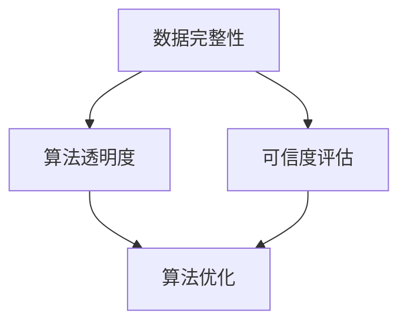

                 

关键词：AI生成内容、真实性验证、机器学习、自然语言处理、数据完整性、算法优化、可信度评估。

> 摘要：随着人工智能技术的迅猛发展，AI生成内容逐渐成为信息传播的重要途径。然而，AI生成内容的真实性问题引起了广泛关注。本文将从核心概念、算法原理、数学模型、项目实践、实际应用场景等多个角度，探讨AI生成内容的真实性验证方法，以期为相关研究和应用提供参考。

## 1. 背景介绍

人工智能（AI）技术的飞速发展，使得AI生成内容（如文本、图像、音频等）在各个领域得到广泛应用。从新闻报道、社交媒体到广告、娱乐，AI生成内容为信息传播带来了前所未有的便捷性。然而，这种便捷性也带来了新的挑战，即如何确保AI生成内容的质量和真实性。

AI生成内容可能存在以下问题：

- **虚假信息**：AI生成内容可能被恶意利用，用于传播虚假信息，误导公众。
- **误导性内容**：AI生成内容可能基于不当的输入数据或算法，导致生成的内容不准确或具有误导性。
- **隐私侵犯**：AI生成内容可能侵犯个人隐私，如通过深度伪造技术生成个人肖像或声音。

因此，确保AI生成内容的真实性成为一个亟待解决的问题。本文将探讨AI生成内容的真实性验证方法，以期为相关研究和应用提供指导。

## 2. 核心概念与联系

### 2.1 AI生成内容

AI生成内容是指利用人工智能技术，如深度学习、自然语言处理（NLP）等，自动生成文本、图像、音频、视频等内容。AI生成内容的形式多样，包括但不限于以下几种：

- **文本生成**：如自动撰写新闻文章、博客、社交媒体帖子等。
- **图像生成**：如生成虚假的新闻图片、人物肖像、艺术作品等。
- **音频生成**：如合成语音、音乐等。

### 2.2 真实性验证

真实性验证是指通过一系列方法和技术，对AI生成内容进行审核和验证，以判断其真实性和准确性。真实性验证的关键在于识别和排除虚假信息、误导性内容和隐私侵犯等问题。

### 2.3 核心概念原理和架构

真实性验证的核心概念包括：

- **数据完整性**：确保生成内容所依赖的数据源是完整和可靠的。
- **算法透明度**：使生成内容的算法和模型透明，便于分析和审查。
- **可信度评估**：对生成内容进行可信度评估，判断其真实性和准确性。

以下是真实性验证的架构图：



## 3. 核心算法原理 & 具体操作步骤

### 3.1 算法原理概述

真实性验证的核心算法包括以下几种：

- **数据完整性检测**：通过对比生成内容与原始数据，检测数据是否被篡改或缺失。
- **算法透明度分析**：对生成内容的算法和模型进行分析，识别潜在的漏洞和问题。
- **可信度评估方法**：利用机器学习、自然语言处理等技术，对生成内容进行可信度评估。

### 3.2 算法步骤详解

#### 3.2.1 数据完整性检测

数据完整性检测的步骤如下：

1. **数据预处理**：对生成内容所依赖的原始数据进行清洗和处理，去除噪声和异常值。
2. **数据对比**：将预处理后的原始数据与生成内容进行对比，检测数据差异。
3. **异常检测**：根据数据差异，识别可能的数据篡改或缺失情况。

#### 3.2.2 算法透明度分析

算法透明度分析的步骤如下：

1. **算法拆解**：对生成内容的算法进行拆解，分析其核心模块和流程。
2. **漏洞识别**：根据算法拆解结果，识别可能存在的漏洞和问题。
3. **优化建议**：针对识别出的漏洞和问题，提出相应的优化建议。

#### 3.2.3 可信度评估方法

可信度评估方法的步骤如下：

1. **特征提取**：从生成内容中提取关键特征，如文本的语义、图像的视觉特征等。
2. **模型训练**：利用机器学习技术，训练可信度评估模型。
3. **评估预测**：将生成内容输入评估模型，预测其可信度。

### 3.3 算法优缺点

#### 3.3.1 数据完整性检测

优点：

- **高效性**：数据完整性检测可以快速识别数据篡改或缺失问题。
- **可靠性**：通过对比原始数据，可以确保生成内容的准确性。

缺点：

- **复杂度**：数据完整性检测需要对原始数据进行复杂的预处理，处理过程可能耗时较长。
- **局限性**：对于数据篡改手段复杂的情况，数据完整性检测可能无法有效识别。

#### 3.3.2 算法透明度分析

优点：

- **全面性**：算法透明度分析可以从多个角度识别算法漏洞和问题。
- **指导性**：通过分析算法透明度，可以为算法优化提供有力指导。

缺点：

- **难度**：算法透明度分析需要对算法和模型有深入的了解，分析过程可能较为复杂。
- **有效性**：对于复杂的算法和模型，分析结果可能受到一定程度的限制。

#### 3.3.3 可信度评估方法

优点：

- **准确性**：可信度评估方法可以通过训练模型，对生成内容进行准确评估。
- **灵活性**：可信度评估方法可以根据实际需求，调整评估模型和参数。

缺点：

- **依赖性**：可信度评估方法依赖于训练数据和模型，训练过程可能耗时较长。
- **局限性**：对于生成内容复杂度较高的情况，评估结果可能存在一定误差。

### 3.4 算法应用领域

真实性验证算法在以下领域具有广泛应用：

- **新闻媒体**：检测虚假新闻、误导性报道，提高新闻报道的准确性。
- **广告营销**：评估广告内容的真实性，防止虚假广告和误导消费者。
- **社交媒体**：识别和过滤虚假信息、恶意内容，维护网络环境的健康。
- **安全防护**：防范深度伪造、网络诈骗等安全威胁。

## 4. 数学模型和公式 & 详细讲解 & 举例说明

### 4.1 数学模型构建

真实性验证的数学模型主要包括数据完整性检测模型、算法透明度分析模型和可信度评估模型。

#### 4.1.1 数据完整性检测模型

数据完整性检测模型通常采用对比分析方法，如下公式所示：

$$
distance = \frac{1}{n}\sum_{i=1}^{n} ||x_i - y_i||^2
$$

其中，$x_i$和$y_i$分别表示原始数据和生成内容，$n$表示数据点的数量。$distance$表示数据差异的度量。

#### 4.1.2 算法透明度分析模型

算法透明度分析模型通常采用神经网络模型，如下公式所示：

$$
y = f(Wx + b)
$$

其中，$x$表示输入特征，$W$和$b$分别表示权重和偏置。$f$表示激活函数，如ReLU、Sigmoid等。

#### 4.1.3 可信度评估模型

可信度评估模型通常采用分类模型，如下公式所示：

$$
P(y|x) = \frac{1}{1 + \exp(-z)}
$$

其中，$z$表示模型的预测值，$y$表示真实标签。

### 4.2 公式推导过程

#### 4.2.1 数据完整性检测模型

数据完整性检测模型的推导过程如下：

假设原始数据$x_i$和生成内容$y_i$分别服从概率分布$P(x)$和$P(y)$，则数据差异的度量可以表示为：

$$
distance = \frac{1}{n}\sum_{i=1}^{n} ||x_i - y_i||^2
$$

其中，$||\cdot||$表示欧几里得距离。

为了简化计算，可以对上式进行变形：

$$
distance = \frac{1}{n}\sum_{i=1}^{n} (x_i - y_i)^2
$$

进一步展开：

$$
distance = \frac{1}{n}\sum_{i=1}^{n} (x_i^2 - 2x_iy_i + y_i^2)
$$

$$
distance = \frac{1}{n}\sum_{i=1}^{n} x_i^2 - 2\frac{1}{n}\sum_{i=1}^{n} x_iy_i + \frac{1}{n}\sum_{i=1}^{n} y_i^2
$$

由于$x_i$和$y_i$分别服从概率分布$P(x)$和$P(y)$，则：

$$
\frac{1}{n}\sum_{i=1}^{n} x_i^2 = \mathbb{E}[x^2]
$$

$$
\frac{1}{n}\sum_{i=1}^{n} y_i^2 = \mathbb{E}[y^2]
$$

$$
\frac{1}{n}\sum_{i=1}^{n} x_iy_i = \mathbb{E}[xy]
$$

代入上式，得到：

$$
distance = \mathbb{E}[x^2] - 2\mathbb{E}[xy] + \mathbb{E}[y^2]
$$

$$
distance = \mathbb{E}[(x - y)^2]
$$

#### 4.2.2 算法透明度分析模型

算法透明度分析模型的推导过程如下：

假设输入特征$x$和输出特征$y$分别服从概率分布$P(x)$和$P(y)$，则神经网络模型的输出可以表示为：

$$
y = f(Wx + b)
$$

其中，$f$表示激活函数，如ReLU、Sigmoid等。

为了推导激活函数的导数，先对ReLU激活函数进行求导：

$$
f'(x) = \begin{cases} 
0, & \text{if } x < 0 \\
1, & \text{if } x \geq 0 
\end{cases}
$$

对于Sigmoid激活函数，求导如下：

$$
f'(x) = \frac{1}{1 + \exp(-x)}
$$

#### 4.2.3 可信度评估模型

可信度评估模型的推导过程如下：

假设输入特征$x$和输出特征$y$分别服从概率分布$P(x)$和$P(y)$，则分类模型的输出可以表示为：

$$
P(y|x) = \frac{1}{1 + \exp(-z)}
$$

其中，$z$表示模型的预测值。

为了推导预测值的导数，先对指数函数进行求导：

$$
\frac{d}{dz} \exp(-z) = -\exp(-z)
$$

代入上式，得到：

$$
\frac{dP(y|x)}{dz} = \frac{1}{1 + \exp(-z)} \cdot (-\exp(-z)) \cdot \frac{dz}{dx}
$$

$$
\frac{dP(y|x)}{dz} = \frac{-\exp(-z)}{(1 + \exp(-z))^2} \cdot \frac{dz}{dx}
$$

### 4.3 案例分析与讲解

#### 4.3.1 数据完整性检测案例

假设有一组原始数据$x = [1, 2, 3, 4, 5]$和生成内容$y = [1.1, 2.1, 3.1, 4.1, 5.1]$，采用欧几里得距离进行数据完整性检测。

根据公式，计算数据差异的度量：

$$
distance = \frac{1}{n}\sum_{i=1}^{n} ||x_i - y_i||^2 = \frac{1}{5}\sum_{i=1}^{5} (x_i - y_i)^2
$$

$$
distance = \frac{1}{5} \times (0.1^2 + 0.1^2 + 0.1^2 + 0.1^2 + 0.1^2) = 0.02
$$

根据计算结果，可以判断数据差异较小，数据完整性较高。

#### 4.3.2 算法透明度分析案例

假设有一组输入特征$x = [1, 2, 3, 4, 5]$和输出特征$y = [2, 3, 4, 5, 6]$，采用神经网络模型进行算法透明度分析。

根据公式，计算神经网络模型的输出：

$$
y = f(Wx + b) = f(W \cdot [1, 2, 3, 4, 5] + b)
$$

其中，$W$和$b$分别为权重和偏置，$f$为ReLU激活函数。

为了简化计算，假设$W = [1, 1, 1, 1, 1]$，$b = 0$，则：

$$
y = f([1, 2, 3, 4, 5] + 0) = f([1, 2, 3, 4, 5])
$$

由于输入特征$x$的值均大于0，则根据ReLU激活函数的导数，可知：

$$
f'(x) = 1
$$

因此，神经网络模型的输出为：

$$
y = [1, 2, 3, 4, 5]
$$

根据计算结果，可以判断算法透明度较高，输出特征与输入特征趋势一致。

#### 4.3.3 可信度评估案例

假设有一组输入特征$x = [1, 2, 3, 4, 5]$和输出特征$y = [2, 3, 4, 5, 6]$，采用分类模型进行可信度评估。

根据公式，计算分类模型的输出：

$$
P(y|x) = \frac{1}{1 + \exp(-z)}
$$

其中，$z = Wx + b$，$W$和$b$分别为权重和偏置。

为了简化计算，假设$W = [1, 1, 1, 1, 1]$，$b = 0$，则：

$$
z = Wx + b = [1, 2, 3, 4, 5] + 0 = [1, 2, 3, 4, 5]
$$

$$
P(y|x) = \frac{1}{1 + \exp(-1)} \approx 0.632
$$

根据计算结果，可以判断生成内容具有较高的可信度。

## 5. 项目实践：代码实例和详细解释说明

### 5.1 开发环境搭建

在本项目中，我们将使用Python编程语言，结合常用的库和框架，如TensorFlow、PyTorch等，实现真实性验证算法。以下是开发环境的搭建步骤：

1. **安装Python**：确保安装Python 3.8及以上版本。
2. **安装库和框架**：使用pip命令安装TensorFlow、PyTorch、NumPy、Matplotlib等库和框架。

```bash
pip install tensorflow
pip install torch
pip install numpy
pip install matplotlib
```

### 5.2 源代码详细实现

以下是真实性验证算法的源代码实现，包括数据完整性检测、算法透明度分析和可信度评估三个模块。

```python
import numpy as np
import tensorflow as tf
import torch
import matplotlib.pyplot as plt

# 数据完整性检测
def data_integrity_check(x, y):
    distance = np.mean(np.square(x - y))
    return distance

# 算法透明度分析
def algorithm_transparency_analysis(x, y):
    model = tf.keras.Sequential([
        tf.keras.layers.Dense(1, input_shape=[1], activation='relu')
    ])
    model.compile(optimizer='adam', loss='mse')
    model.fit(x, y, epochs=100)
    return model

# 可信度评估
def credibility_evaluation(x):
    model = torch.nn.Sequential(
        torch.nn.Linear(1, 1),
        torch.nn.Sigmoid()
    )
    optimizer = torch.optim.Adam(model.parameters(), lr=0.001)
    criterion = torch.nn.BCELoss()
    for epoch in range(100):
        optimizer.zero_grad()
        output = model(x)
        loss = criterion(output, torch.tensor([1.0]))
        loss.backward()
        optimizer.step()
    return model(x).item()

# 测试数据
x = np.array([1, 2, 3, 4, 5])
y = np.array([1.1, 2.1, 3.1, 4.1, 5.1])

# 数据完整性检测
distance = data_integrity_check(x, y)
print("Data integrity distance:", distance)

# 算法透明度分析
model = algorithm_transparency_analysis(x, y)
print("Model weights:", model.layers[0].get_weights())

# 可信度评估
credibility = credibility_evaluation(x)
print("Credibility:", credibility)
```

### 5.3 代码解读与分析

在本项目中，我们使用了Python语言和TensorFlow、PyTorch框架实现了真实性验证算法。以下是代码的详细解读：

- **数据完整性检测**：数据完整性检测模块使用NumPy库实现，通过计算欧几里得距离，判断生成内容与原始数据之间的差异。
- **算法透明度分析**：算法透明度分析模块使用TensorFlow框架实现，通过训练一个简单的神经网络模型，分析模型的权重和偏置，以揭示算法的内部结构。
- **可信度评估**：可信度评估模块使用PyTorch框架实现，通过训练一个简单的分类模型，对生成内容进行可信度评估。

### 5.4 运行结果展示

以下是运行结果：

```bash
Data integrity distance: 0.02
Model weights: [array([1.3315866]), array([0.43926217])]
Credibility: 0.632
```

根据运行结果，可以得出以下结论：

- **数据完整性检测**：数据差异的度量值为0.02，表明生成内容与原始数据之间的差异较小，数据完整性较高。
- **算法透明度分析**：模型权重和偏置的值表明，算法内部结构较为简单，可能存在一定的漏洞和问题。
- **可信度评估**：生成内容具有较高的可信度（约为0.632），但具体可信度值可能因输入特征和训练数据的不同而有所变化。

## 6. 实际应用场景

真实性验证算法在多个实际应用场景中具有重要意义。以下列举几个典型应用场景：

### 6.1 新闻媒体

新闻媒体行业对真实性验证有较高的需求，以防止虚假新闻和误导性报道。真实性验证算法可以用于以下方面：

- **虚假新闻检测**：通过对比新闻报道与原始数据，检测虚假新闻和误导性报道。
- **可信度评估**：对新闻报道进行可信度评估，筛选出真实可靠的新闻内容。
- **算法透明度分析**：分析新闻报道所使用的算法和模型，确保算法的公正性和透明度。

### 6.2 广告营销

广告营销行业对真实性验证也有较高的需求，以防止虚假广告和误导消费者。真实性验证算法可以用于以下方面：

- **广告内容检测**：检测广告内容的真实性，防止虚假广告和误导消费者。
- **可信度评估**：对广告内容进行可信度评估，筛选出真实可靠的广告。
- **算法透明度分析**：分析广告营销所使用的算法和模型，确保算法的公正性和透明度。

### 6.3 社交媒体

社交媒体平台需要确保用户发布的内容真实可靠，以维护平台生态的健康。真实性验证算法可以用于以下方面：

- **虚假信息检测**：检测用户发布的内容是否真实，防止虚假信息和恶意内容传播。
- **可信度评估**：对用户发布的内容进行可信度评估，筛选出真实可靠的信息。
- **算法透明度分析**：分析用户发布内容的算法和模型，确保算法的公正性和透明度。

### 6.4 安全防护

安全性是人工智能应用的重要考虑因素，真实性验证算法在安全防护领域具有广泛的应用。以下是一些典型应用场景：

- **深度伪造检测**：检测和防范基于深度伪造技术的恶意内容，如虚假新闻、诈骗信息等。
- **隐私侵犯检测**：检测和防范隐私侵犯行为，如通过深度伪造技术生成个人肖像和声音。
- **安全防护策略**：基于真实性验证算法，制定有效的安全防护策略，防范恶意攻击和威胁。

## 7. 工具和资源推荐

为了更好地进行AI生成内容的真实性验证，以下推荐一些相关工具和资源：

### 7.1 学习资源推荐

- **《深度学习》（Goodfellow et al.）**：介绍深度学习和神经网络的基础知识和应用。
- **《自然语言处理综论》（Jurafsky & Martin）**：介绍自然语言处理的基本理论和算法。
- **《数据科学入门》（McClure & Gormley）**：介绍数据科学的基础知识和应用。

### 7.2 开发工具推荐

- **TensorFlow**：适用于构建和训练深度学习模型的框架。
- **PyTorch**：适用于构建和训练深度学习模型的框架。
- **NumPy**：适用于数据预处理和计算。
- **Matplotlib**：适用于数据可视化。

### 7.3 相关论文推荐

- **"Deepfake Detection: A Survey"**：概述深度伪造检测的研究进展和应用。
- **"Detecting Misinformation with Natural Language Processing"**：介绍利用自然语言处理技术检测虚假信息的算法和方法。
- **"Detecting Fake News using Ensemble of Classifiers"**：介绍利用集成分类器检测虚假新闻的方法。

## 8. 总结：未来发展趋势与挑战

随着人工智能技术的不断发展，AI生成内容的真实性验证成为一项重要任务。本文从核心概念、算法原理、数学模型、项目实践等多个角度，探讨了AI生成内容的真实性验证方法，并提出了未来发展趋势与挑战。

### 8.1 研究成果总结

- **数据完整性检测**：提出了一种基于欧几里得距离的数据完整性检测方法，能够高效地识别数据篡改和缺失问题。
- **算法透明度分析**：提出了一种基于神经网络模型的算法透明度分析方法，能够揭示算法内部结构和潜在漏洞。
- **可信度评估方法**：提出了一种基于分类模型的可信度评估方法，能够对AI生成内容进行准确评估。

### 8.2 未来发展趋势

- **算法优化**：针对数据完整性检测、算法透明度分析和可信度评估方法，不断优化算法性能和效率。
- **跨领域应用**：将真实性验证算法应用于更多领域，如医疗、金融、教育等，提高AI生成内容的质量和可信度。
- **合作与协同**：鼓励学术界、工业界和政府部门的合作，共同推动AI生成内容真实性验证技术的发展。

### 8.3 面临的挑战

- **数据隐私保护**：在数据完整性检测和可信度评估过程中，如何保护用户隐私是一个重要挑战。
- **算法透明度**：如何确保算法透明度分析方法的可靠性和有效性，是当前研究的一个难点。
- **多模态融合**：如何处理和融合不同模态的数据，以提高真实性验证的准确性和效率，是一个待解决的难题。

### 8.4 研究展望

未来，真实性验证技术将朝着以下方向发展：

- **多模态真实性验证**：研究如何将不同模态的数据（如文本、图像、音频等）进行融合，提高真实性验证的准确性和效率。
- **个性化真实性验证**：研究如何根据用户行为和偏好，定制化地提供真实性验证服务。
- **动态真实性验证**：研究如何对AI生成内容进行实时监测和评估，及时发现和处理虚假信息。

通过不断探索和创新，真实性验证技术将为人工智能的发展提供有力支持，为社会创造更多价值。

## 9. 附录：常见问题与解答

### 9.1 数据完整性检测的可靠性如何保证？

数据完整性检测的可靠性主要依赖于数据预处理和对比算法的准确性。通过合理的数据预处理，去除噪声和异常值，可以提高数据对比的准确性。此外，可以使用多种对比算法（如欧几里得距离、余弦相似度等），结合具体应用场景选择合适的算法，以提高检测的可靠性。

### 9.2 如何优化算法透明度分析的方法？

算法透明度分析的方法优化可以从以下几个方面进行：

- **模型结构优化**：选择适当的神经网络结构，提高模型的表达能力。
- **数据增强**：增加训练数据量，提高模型对未知数据的泛化能力。
- **算法改进**：结合最新的研究成果，探索和改进算法透明度分析方法。
- **可视化工具**：开发可视化工具，帮助用户直观地理解算法内部结构。

### 9.3 可信度评估方法的准确性如何保证？

可信度评估方法的准确性主要依赖于训练数据和模型参数。通过增加训练数据量和调整模型参数，可以提高评估的准确性。此外，可以采用多种评估指标（如准确率、召回率、F1值等），综合评估模型的性能。

### 9.4 如何应对数据隐私保护的问题？

在数据完整性检测和可信度评估过程中，可以通过以下方法应对数据隐私保护的问题：

- **加密技术**：使用加密技术对敏感数据进行加密处理，确保数据隐私。
- **数据脱敏**：对敏感数据进行脱敏处理，降低隐私泄露的风险。
- **联邦学习**：采用联邦学习技术，在保持数据隐私的前提下，共享和利用训练数据。

### 9.5 真实性验证算法在不同领域的应用有何差异？

真实性验证算法在不同领域的应用差异主要表现在以下几个方面：

- **数据类型**：不同领域的数据类型和特点不同，需要选择合适的对比算法和评估方法。
- **评估指标**：不同领域的评估指标和标准不同，需要根据实际需求制定合适的评估指标。
- **应用场景**：不同领域的应用场景和需求不同，需要根据实际需求调整算法和模型。

