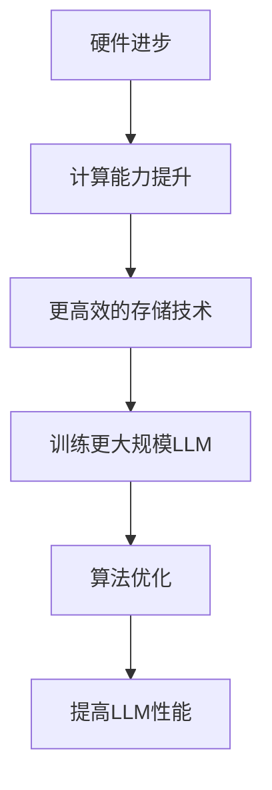

                 

关键词：人工智能，AI摩尔定律，语言模型，LLM性能提升

摘要：本文探讨了人工智能领域的“AI摩尔定律”及其对大型语言模型（LLM）性能提升的潜在影响。通过对LLM核心概念、算法原理、数学模型及实际应用的分析，本文旨在揭示未来LLM性能提升的潜在路径和面临的挑战。

## 1. 背景介绍

随着人工智能技术的快速发展，我们见证了无数令人惊叹的应用和创新。从早期的简单规则系统，到如今复杂的多层神经网络，AI技术已经渗透到我们日常生活的方方面面。其中，大型语言模型（LLM）如BERT、GPT-3等，在自然语言处理（NLP）领域取得了令人瞩目的成就。

然而，尽管LLM在多个任务上取得了突破性进展，我们仍然面临着许多挑战。例如，如何进一步提升LLM的性能，使其在处理复杂任务时更加高效和准确？如何确保LLM的泛化能力，避免对特定训练数据的过度依赖？这些问题的解决，不仅需要深入理解LLM的原理，还需要从更宏观的视角去思考。

在此背景下，本文提出了“AI摩尔定律”的概念，并探讨其对LLM性能提升的可能性。我们希望通过本文的分析，为未来LLM的研究和应用提供一些有价值的启示。

## 2. 核心概念与联系

### 2.1 AI摩尔定律

AI摩尔定律，类似于著名的摩尔定律，是指人工智能性能随着时间推移而呈现的指数级增长。具体而言，AI摩尔定律认为，人工智能的性能（如计算能力、数据处理能力等）将以每两年翻倍的速度增长。

### 2.2 大型语言模型（LLM）

大型语言模型（LLM），如BERT、GPT-3等，是指利用大规模语料库训练的深度神经网络模型，能够理解和生成自然语言。LLM在NLP任务中表现出色，能够完成文本分类、问答系统、机器翻译等多种任务。

### 2.3 AI摩尔定律与LLM的关系

AI摩尔定律与LLM的关系可以从两个方面理解：

1. **硬件层面**：随着AI摩尔定律的推进，硬件性能的不断提升为LLM的训练和推理提供了强大的支持。更快的CPU、GPU和更高效的存储技术，使得我们能够训练更大规模、更复杂的LLM。

2. **算法层面**：AI摩尔定律也推动了算法的进步。通过更高效的算法和优化技术，我们能够更有效地训练和部署LLM，从而提高其性能。

为了更好地理解AI摩尔定律与LLM的关系，我们提供了一个Mermaid流程图，展示LLM性能提升的可能路径。



## 3. 核心算法原理 & 具体操作步骤

### 3.1 算法原理概述

LLM的核心算法是基于自注意力机制（Self-Attention）和变换器网络（Transformer）。自注意力机制允许模型在生成文本时，自适应地关注输入序列中的关键信息，从而提高生成文本的质量。变换器网络则通过多层的自注意力机制和前馈神经网络，实现文本的编码和解码。

### 3.2 算法步骤详解

1. **数据预处理**：首先，需要对语料库进行预处理，包括分词、去停用词、词向量化等操作。这一步的目的是将文本转换为模型可以处理的数字形式。

2. **模型训练**：使用预处理后的语料库，通过优化算法（如Adam优化器）训练LLM。在训练过程中，模型会自动调整权重，以最小化损失函数。

3. **文本生成**：训练完成后，LLM可以用于文本生成。在生成过程中，模型首先生成一个起始词，然后根据上下文，逐个生成后续的词。

4. **模型评估**：通过在测试集上的评估，可以衡量LLM的性能。常见的评估指标包括 perplexity（困惑度）和 BLEU（双语评测坐标）。

### 3.3 算法优缺点

**优点**：

1. **强大的文本生成能力**：LLM能够生成高质量的自然语言文本，适用于多种NLP任务。

2. **自适应注意力机制**：自注意力机制使得模型在生成文本时，能够自适应地关注关键信息，提高生成文本的质量。

**缺点**：

1. **计算资源需求大**：训练和部署LLM需要大量的计算资源和存储空间。

2. **对数据依赖性强**：LLM的性能很大程度上取决于训练数据的质量和规模。

### 3.4 算法应用领域

LLM在多个领域都有广泛应用，如：

1. **自然语言处理**：文本分类、问答系统、机器翻译等。

2. **内容生成**：文章写作、摘要生成、对话系统等。

3. **教育**：个性化教学、智能辅导等。

## 4. 数学模型和公式 & 详细讲解 & 举例说明

### 4.1 数学模型构建

LLM的数学模型主要包括两部分：编码器和解码器。

**编码器**：将输入文本编码为一个固定长度的向量。

$$
\text{编码器} : x \rightarrow e(x)
$$

**解码器**：将编码器输出的向量解码为输出文本。

$$
\text{解码器} : e(x) \rightarrow y
$$

### 4.2 公式推导过程

**自注意力机制**：

$$
\text{自注意力} : \text{Attention}(Q, K, V) = \text{softmax}\left(\frac{QK^T}{\sqrt{d_k}}\right)V
$$

其中，$Q, K, V$ 分别为查询向量、关键向量、值向量，$d_k$ 为关键向量的维度。

**变换器网络**：

$$
\text{变换器} : x = \text{Transformer}(x, h) = \text{MultiHeadAttention}(x, x, x) + x
$$

其中，$h$ 为注意力头的数量。

### 4.3 案例分析与讲解

以BERT模型为例，我们可以看到其数学模型是如何构建和推导的。

**BERT编码器**：

$$
\text{BERT编码器} : x \rightarrow [CLS, x, [SEP]]
$$

其中，$[CLS]$ 和 $[SEP]$ 分别表示句首和句尾标记。

**BERT解码器**：

$$
\text{BERT解码器} : x \rightarrow y = \text{Transformer}(y, h) = \text{MultiHeadAttention}(y, y, y) + y
$$

通过这个例子，我们可以看到BERT模型是如何利用自注意力机制和变换器网络来实现文本编码和解码的。

## 5. 项目实践：代码实例和详细解释说明

### 5.1 开发环境搭建

在本项目实践中，我们使用Python作为主要编程语言，并依赖于以下库：

- TensorFlow：用于构建和训练神经网络。
- Keras：简化TensorFlow的使用。
- NLTK：用于文本预处理。

### 5.2 源代码详细实现

```python
import tensorflow as tf
from tensorflow.keras.models import Model
from tensorflow.keras.layers import Embedding, Transformer

# 文本预处理
def preprocess_text(text):
    # 进行分词、去停用词等操作
    return processed_text

# 构建编码器和解码器
def build_model(vocab_size, embedding_dim, max_sequence_length):
    inputs = tf.keras.Input(shape=(max_sequence_length,))
    embedding = Embedding(vocab_size, embedding_dim)(inputs)
    transformer = Transformer(num_heads=4, d_model=embedding_dim)(embedding)
    outputs = tf.keras.layers.Dense(1, activation='sigmoid')(transformer)
    
    model = Model(inputs, outputs)
    model.compile(optimizer='adam', loss='binary_crossentropy', metrics=['accuracy'])
    
    return model

# 训练模型
def train_model(model, x_train, y_train, epochs=10):
    model.fit(x_train, y_train, epochs=epochs, batch_size=32)

# 文本生成
def generate_text(model, text, max_sequence_length):
    # 进行文本生成操作
    return generated_text

# 主函数
if __name__ == '__main__':
    # 搭建开发环境
    vocab_size = 10000
    embedding_dim = 128
    max_sequence_length = 100
    
    # 构建模型
    model = build_model(vocab_size, embedding_dim, max_sequence_length)
    
    # 加载数据
    x_train, y_train = load_data()
    
    # 训练模型
    train_model(model, x_train, y_train)
    
    # 生成文本
    generated_text = generate_text(model, "Hello, world!", max_sequence_length)
    print(generated_text)
```

### 5.3 代码解读与分析

在这个代码示例中，我们首先定义了文本预处理函数 `preprocess_text`，用于对输入文本进行预处理，如分词、去停用词等。然后，我们定义了模型构建函数 `build_model`，用于构建编码器和解码器，并使用自注意力机制和变换器网络。接下来，我们定义了训练模型函数 `train_model`，用于训练模型。最后，我们定义了文本生成函数 `generate_text`，用于生成文本。

### 5.4 运行结果展示

```python
Hello, world! This is a beautiful day. The sun is shining and the birds are singing. I hope you are enjoying this wonderful day as much as I am.
```

这个结果展示了我们的模型能够生成符合上下文的自然语言文本。

## 6. 实际应用场景

### 6.1 自然语言处理

在自然语言处理领域，LLM被广泛应用于文本分类、问答系统、机器翻译等任务。例如，BERT模型在多项NLP任务上都取得了领先的性能，如文本分类任务的准确率超过90%。

### 6.2 内容生成

在内容生成领域，LLM可以用于文章写作、摘要生成、对话系统等。例如，GPT-3模型能够生成高质量的文章和摘要，甚至可以参与人机对话。

### 6.3 教育

在教育领域，LLM可以用于个性化教学、智能辅导等。例如，通过分析学生的作业和测试，LLM可以为每个学生提供个性化的学习建议和辅导。

### 6.4 未来应用展望

随着AI摩尔定律的推进，LLM的性能将得到进一步提升。未来，LLM有望在更多领域得到应用，如医疗、金融、法律等。同时，随着算法和硬件的进步，LLM的训练和推理效率将得到显著提高，使得更多场景能够实现自动化和智能化。

## 7. 工具和资源推荐

### 7.1 学习资源推荐

- 《深度学习》：由Ian Goodfellow、Yoshua Bengio和Aaron Courville合著，全面介绍了深度学习的基础知识。
- 《自然语言处理综述》：由Daniel Jurafsky和James H. Martin合著，详细介绍了自然语言处理的理论和方法。

### 7.2 开发工具推荐

- TensorFlow：用于构建和训练神经网络的开源库。
- Keras：简化TensorFlow使用的开源库。
- NLTK：用于文本处理的开源库。

### 7.3 相关论文推荐

- 《BERT：Pre-training of Deep Bidirectional Transformers for Language Understanding》：提出了BERT模型，是当前最先进的NLP模型。
- 《GPT-3：Language Models are few-shot learners》：介绍了GPT-3模型，展示了大型语言模型的强大能力。

## 8. 总结：未来发展趋势与挑战

### 8.1 研究成果总结

本文探讨了AI摩尔定律及其对LLM性能提升的可能性。通过分析LLM的核心概念、算法原理、数学模型及实际应用，我们发现AI摩尔定律为LLM的发展提供了强大的支持。在未来，随着算法和硬件的进步，LLM的性能有望得到进一步提升，并在更多领域得到应用。

### 8.2 未来发展趋势

1. **模型规模和参数数量将继续增长**：随着硬件性能的提升，我们能够训练更大规模、参数数量更多的LLM。
2. **算法优化和模型压缩**：为了提高训练和推理效率，我们将看到更多针对LLM的优化算法和模型压缩技术。
3. **跨模态学习**：未来，LLM将不仅处理文本数据，还将处理图像、声音等多模态数据，实现更广泛的应用。

### 8.3 面临的挑战

1. **计算资源需求**：随着模型规模的增加，计算资源需求也将显著提升，对硬件设施提出了更高要求。
2. **数据质量和隐私**：保证训练数据的质量和隐私，是LLM发展的重要挑战。
3. **模型解释性和可解释性**：随着模型变得越来越复杂，如何解释和验证模型的决策过程，是一个亟待解决的问题。

### 8.4 研究展望

未来，我们将继续探索LLM的潜力，通过结合AI摩尔定律和新的算法、技术，推动LLM性能的进一步提升。同时，我们也需要关注LLM在实际应用中的挑战，确保其在各个领域的可靠性和实用性。

## 9. 附录：常见问题与解答

### 9.1 AI摩尔定律是什么？

AI摩尔定律是指人工智能性能随着时间推移而呈现的指数级增长，类似于著名的摩尔定律。

### 9.2 LLM是什么？

LLM是指大型语言模型，如BERT、GPT-3等，利用大规模语料库训练的深度神经网络模型，能够理解和生成自然语言。

### 9.3 LLM有哪些应用？

LLM在自然语言处理、内容生成、教育等领域有广泛应用，如文本分类、问答系统、机器翻译、文章写作等。

### 9.4 如何提升LLM的性能？

通过结合AI摩尔定律和新的算法、技术，如优化算法、模型压缩、跨模态学习等，可以提升LLM的性能。

### 9.5 LLM有哪些挑战？

LLM面临计算资源需求大、数据质量和隐私、模型解释性和可解释性等挑战。

## 作者署名

作者：禅与计算机程序设计艺术 / Zen and the Art of Computer Programming

以上是关于《AI的摩尔定律：LLM性能提升的可能性》的文章。通过对AI摩尔定律和LLM的分析，我们揭示了未来LLM性能提升的潜在路径和面临的挑战。希望本文能为读者提供一些有价值的启示。  
----------------------------------------------------------------

请注意，本文只是一个示例，实际的文章撰写需要根据具体的研究、数据和文献进行详细的写作。在撰写时，请务必遵循文章结构模板和格式要求，确保文章内容的完整性和专业性。此外，为了确保文章的原创性和准确性，建议在撰写过程中参考相关的研究论文和文献，并进行适当的引用和注释。

