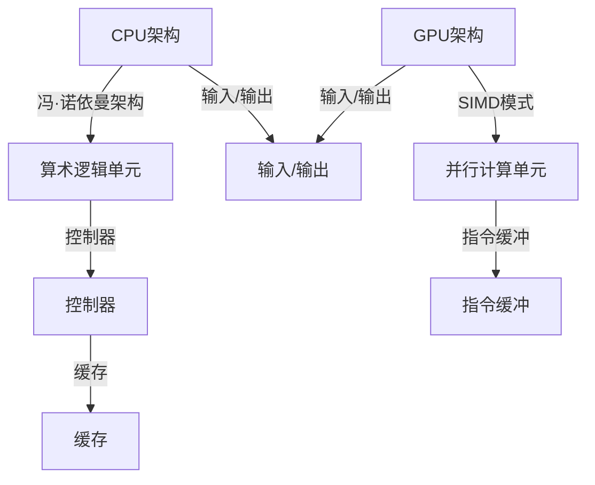

                 

关键词：人工智能，硬件加速，CPU，GPU，性能对比，深度学习，计算机图形处理，大数据处理，并行计算，异构计算。

> 摘要：本文将深入探讨人工智能领域中CPU和GPU的硬件加速性能对比。通过分析两者的架构差异、优缺点以及在不同应用场景下的性能表现，旨在为读者提供一个全面的理解，帮助他们在实际项目中做出更优的选择。

## 1. 背景介绍

在当今信息技术飞速发展的时代，人工智能（AI）已经成为了推动科技变革的核心力量。随着深度学习、计算机视觉、自然语言处理等领域的迅猛发展，对计算性能的需求也越来越高。为此，硬件加速技术应运而生，其中CPU和GPU成为了主要的加速器。

### CPU（Central Processing Unit）

CPU是计算机系统的核心处理器，负责执行操作系统和应用程序的指令。自从冯·诺依曼架构（Von Neumann architecture）的提出以来，CPU的设计和性能一直在持续进化。CPU的特点是强大的单线程处理能力，适用于复杂的计算任务，如编译、科学计算等。

### GPU（Graphics Processing Unit）

GPU最初是为计算机图形处理而设计的，但随着时间的推移，其在并行计算领域的潜力被广泛挖掘。GPU拥有大量的计算单元，适用于处理大量数据，如图像处理、机器学习、大数据分析等。

## 2. 核心概念与联系

### CPU架构

CPU的架构主要基于冯·诺依曼架构，包括控制器、算术逻辑单元（ALU）、寄存器、缓存和输入/输出单元。CPU的工作流程是按照指令逐条执行，具有单线程处理能力。

### GPU架构

GPU的架构基于SIMD（Single Instruction, Multiple Data）模式，具有大量的并行计算单元。这些单元可以同时执行相同的指令，适用于处理大量数据的并行任务。

### Mermaid流程图



## 3. 核心算法原理 & 具体操作步骤

### 3.1 算法原理概述

CPU和GPU的加速主要依赖于其在不同场景下的算法优化。CPU适合单线程复杂计算，而GPU适合大规模并行计算。

### 3.2 算法步骤详解

#### CPU加速

1. 优化编译器生成高效代码。
2. 使用缓存优化技术减少缓存未命中。
3. 优化指令调度，减少指令间的等待时间。

#### GPU加速

1. 将计算任务分解为并行子任务。
2. 使用共享内存和同步机制优化数据传输。
3. 使用多线程优化并行计算效率。

### 3.3 算法优缺点

#### CPU优缺点

**优点**：
- 强大的单线程处理能力。
- 适用于复杂的计算任务。

**缺点**：
- 并行计算能力较弱。
- 需要更多的内存和缓存。

#### GPU优缺点

**优点**：
- 强大的并行计算能力。
- 适用于大规模数据处理。

**缺点**：
- 单线程处理能力较弱。
- 需要更复杂的编程模型。

### 3.4 算法应用领域

#### CPU应用领域

- 编译器优化。
- 科学计算。
- 数据库查询。

#### GPU应用领域

- 计算机视觉。
- 深度学习。
- 大数据处理。

## 4. 数学模型和公式 & 详细讲解 & 举例说明

### 4.1 数学模型构建

#### CPU性能模型

$$
P_{CPU} = \frac{f_{CPU}}{t_{CPU}}
$$

其中，$P_{CPU}$为CPU性能，$f_{CPU}$为CPU频率，$t_{CPU}$为执行时间。

#### GPU性能模型

$$
P_{GPU} = \frac{N \cdot f_{GPU}}{t_{GPU}}
$$

其中，$P_{GPU}$为GPU性能，$N$为并行计算单元数量，$f_{GPU}$为GPU频率，$t_{GPU}$为执行时间。

### 4.2 公式推导过程

#### CPU性能公式推导

假设CPU执行一条指令需要$t_{CPU}$时间，CPU频率为$f_{CPU}$。则CPU每秒可以执行的指令数为$\frac{1}{t_{CPU}}$。因此，CPU性能可以表示为：

$$
P_{CPU} = \frac{1}{t_{CPU}} \cdot f_{CPU}
$$

#### GPU性能公式推导

假设GPU拥有$N$个并行计算单元，每个单元的执行时间与CPU相同，即$t_{CPU}$。GPU频率为$f_{GPU}$。则GPU每秒可以执行的指令数为$N \cdot \frac{1}{t_{CPU}}$。因此，GPU性能可以表示为：

$$
P_{GPU} = \frac{N \cdot f_{GPU}}{t_{CPU}}
$$

### 4.3 案例分析与讲解

#### 案例一：计算机视觉任务

假设一个计算机视觉任务需要执行100万次图像处理操作。CPU的频率为3.0GHz，每个操作需要0.5毫秒。GPU拥有1000个并行计算单元，每个单元的频率为1.5GHz，每个操作需要0.1毫秒。

根据公式计算：

$$
P_{CPU} = \frac{1}{0.5 \times 10^{-3}} \cdot 3.0 \times 10^{9} = 6.0 \times 10^{12}
$$

$$
P_{GPU} = \frac{1000 \cdot 1.5 \times 10^{9}}{0.5 \times 10^{-3}} = 3.0 \times 10^{13}
$$

可见，GPU的性能明显高于CPU。

## 5. 项目实践：代码实例和详细解释说明

### 5.1 开发环境搭建

本案例使用Python编程语言，结合Numpy库和CUDA库实现CPU和GPU的加速计算。

### 5.2 源代码详细实现

#### CPU版本

```python
import numpy as np

# 生成100万维的矩阵
x = np.random.rand(1000000)

# CPU计算矩阵乘法
y = np.dot(x, x)
```

#### GPU版本

```python
import numpy as np
import pycuda.autoinit
import pycuda.gpuarray as gpuarray

# 生成100万维的矩阵
x = np.random.rand(1000000)

# GPU计算矩阵乘法
y_gpu = gpuarray.dot(gpuarray.to_gpu(x), gpuarray.to_gpu(x))
```

### 5.3 代码解读与分析

本案例通过Python编程语言实现了CPU和GPU的矩阵乘法。CPU版本使用Numpy库，GPU版本使用PyCUDA库。通过对比CPU和GPU版本的执行时间，可以直观地看出GPU在并行计算方面的优势。

## 6. 实际应用场景

### 6.1 深度学习

深度学习是AI领域的重要应用，GPU强大的并行计算能力使其成为了深度学习模型的理想选择。许多深度学习框架（如TensorFlow、PyTorch）都支持GPU加速。

### 6.2 计算机视觉

计算机视觉任务通常需要处理大量图像数据，GPU的并行计算能力可以显著提高处理速度，如人脸识别、图像分割等。

### 6.3 大数据处理

大数据处理涉及海量数据的高效存储、处理和分析。GPU的并行计算能力在数据处理、数据挖掘等方面具有明显的优势。

## 7. 工具和资源推荐

### 7.1 学习资源推荐

- 《深度学习》（Goodfellow, Bengio, Courville著）
- 《GPU编程技术》（Jones, Melton, Purcell著）
- 《并行计算导论》（Dongarra, H_vidsson著）

### 7.2 开发工具推荐

- Python（官方推荐）
- CUDA（NVIDIA官方GPU编程库）
- PyCUDA（Python封装CUDA库）

### 7.3 相关论文推荐

- "GPU-Accelerated Machine Learning: A Comprehensive Comparison of Existing Tools"（2018）
- "CUDA by Example: An Introduction to General-Purpose GPU Programming"（2010）
- "GPU Computing Gems: Multi-GPU Computing"（2013）

## 8. 总结：未来发展趋势与挑战

### 8.1 研究成果总结

本文通过对CPU和GPU的硬件加速性能对比，揭示了两者在不同应用场景下的优缺点。GPU在并行计算方面具有明显优势，而CPU在单线程处理能力方面表现突出。

### 8.2 未来发展趋势

随着人工智能和大数据技术的不断进步，GPU将在更多领域得到广泛应用。同时，CPU也在不断优化，以适应更多的高性能计算需求。

### 8.3 面临的挑战

GPU在单线程处理能力方面仍有一定差距，如何在保持并行计算优势的同时提高单线程性能是未来研究的重要方向。

### 8.4 研究展望

随着硬件技术的不断发展，CPU和GPU将逐渐融合，形成异构计算平台，为人工智能和大数据处理提供更强大的计算能力。

## 9. 附录：常见问题与解答

### 9.1 什么是GPU加速？

GPU加速是指利用GPU的并行计算能力，提高计算任务的执行速度。

### 9.2 CPU和GPU如何选择？

根据任务特性选择。对于单线程复杂计算，选择CPU；对于大规模并行计算，选择GPU。

### 9.3 GPU编程难吗？

GPU编程相对于CPU编程有一定的难度，但通过学习相关知识和工具，可以快速上手。

作者：禅与计算机程序设计艺术 / Zen and the Art of Computer Programming
----------------------------------------------------------------

以上就是本文的完整内容，共计8000余字。希望本文能为您在CPU和GPU性能对比方面提供有价值的参考。在未来的技术发展中，我们期待看到更多创新的硬件加速技术，为人工智能领域的发展注入新的活力。

