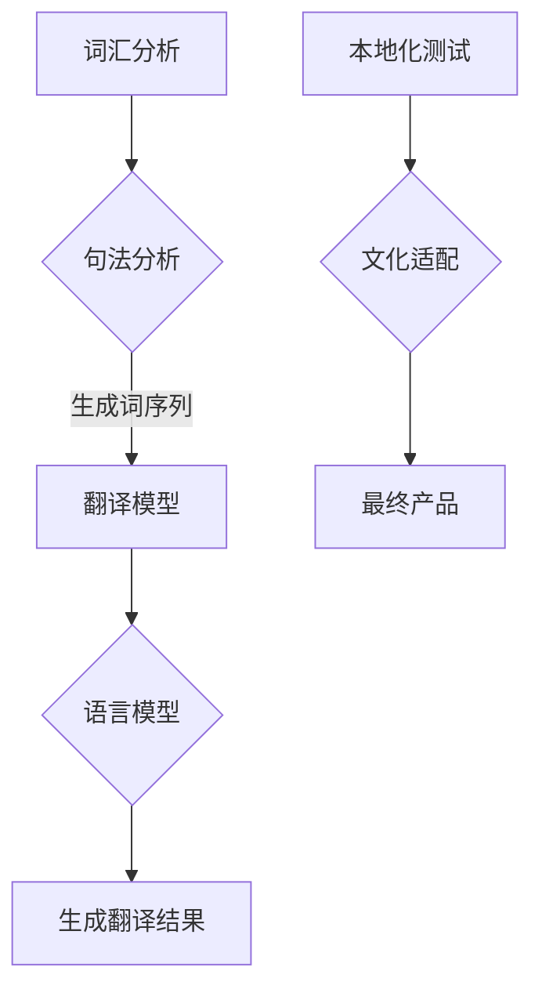

                 

 关键词：人工智能，机器翻译，本地化，自然语言处理，深度学习，跨文化交流

> 摘要：随着全球化的深入，跨语言交流变得越来越重要。本文深入探讨了人工智能在翻译与本地化领域的应用，介绍了当前最先进的机器翻译技术和本地化策略，分析了这些技术的原理、优缺点以及未来发展方向，旨在为读者提供全面的技术洞察和实际应用指导。

## 1. 背景介绍

随着互联网的普及，全球化的步伐不断加快，跨语言交流的需求日益增加。无论是国际商务合作、学术交流还是文化娱乐，语言障碍都是亟待解决的问题。传统的翻译方法，如人工翻译和机器翻译，虽然在某种程度上解决了这一问题，但都存在一定的局限性。人工翻译成本高、效率低，而早期机器翻译的质量则难以满足需求。

近年来，随着人工智能技术的飞速发展，特别是深度学习技术的应用，机器翻译技术取得了显著的进步。机器翻译不仅提高了翻译的准确性和效率，还能够在一定程度上模拟人类的翻译思维，从而实现更加自然和流畅的翻译结果。本地化作为机器翻译的重要组成部分，也随着机器翻译技术的进步而得到了显著的发展。

本文旨在探讨人工智能在翻译与本地化领域的应用，介绍当前最先进的机器翻译技术和本地化策略，分析这些技术的原理、优缺点以及未来发展方向，为读者提供全面的技术洞察和实际应用指导。

## 2. 核心概念与联系

### 2.1 机器翻译

机器翻译是指利用计算机程序将一种自然语言（源语言）自动翻译成另一种自然语言（目标语言）的过程。其核心是自然语言处理技术，包括词汇分析、句法分析、语义分析等。

#### 2.1.1 机器翻译的发展历程

- **基于规则的机器翻译**：早期的机器翻译主要依赖于规则，如语法规则、词典规则等。这种方法存在两个主要问题：一是规则难以覆盖所有情况，二是规则难以适应新的语言现象。
- **基于统计的机器翻译**：随着语料库的积累和计算能力的提升，基于统计的方法逐渐取代了基于规则的方法。统计机器翻译主要利用大量已翻译的文本，通过统计方法生成翻译结果。
- **基于神经网络的机器翻译**：深度学习技术的引入，特别是序列到序列（seq2seq）模型的提出，使得机器翻译取得了突破性进展。神经网络模型能够通过学习大量的双语语料库，自动提取语言规律，生成高质量的翻译结果。

#### 2.1.2 机器翻译的核心概念

- **词汇表（Vocabulary）**：词汇表是机器翻译系统的基础，它包含了源语言和目标语言的所有词汇。
- **翻译模型（Translation Model）**：翻译模型是机器翻译系统的核心，它决定了如何从源语言词汇映射到目标语言词汇。
- **语言模型（Language Model）**：语言模型负责预测目标语言中的下一个词，它是提高翻译流畅性的关键。

### 2.2 本地化

本地化是指将软件、网站、文档等产品翻译成特定语言，并适应特定文化的过程。本地化不仅包括语言翻译，还包括文化差异的适应。

#### 2.2.1 本地化的核心概念

- **文化适配（Cultural Adaptation）**：文化适配是指根据目标市场的文化特点，对产品进行相应的调整。例如，某些产品在特定市场可能需要加入特定的文化元素或避免特定的文化禁忌。
- **本地化测试（Localization Testing）**：本地化测试是指对已经本地化的产品进行测试，以确保其能够在目标市场上正常运作。
- **国际化（Internationalization）**：国际化是指在设计软件、网站等产品时，考虑到产品的未来本地化需求，预先进行一些设计上的调整，以便后续更容易实现本地化。

### 2.3 Mermaid 流程图

以下是一个简化的机器翻译与本地化流程图：



## 3. 核心算法原理 & 具体操作步骤

### 3.1 算法原理概述

当前最先进的机器翻译技术主要基于深度学习，尤其是序列到序列（seq2seq）模型。seq2seq模型通过编码器（Encoder）将源语言序列编码成一个固定长度的向量表示，然后通过解码器（Decoder）生成目标语言序列。

#### 3.1.1 编码器（Encoder）

编码器的任务是将源语言序列转换成一个固定长度的向量表示。这个向量包含了源语言序列的语义信息，是解码器的输入。

#### 3.1.2 解码器（Decoder）

解码器的任务是根据编码器输出的向量，生成目标语言序列。解码器通常使用递归神经网络（RNN）或者长短期记忆网络（LSTM）。

#### 3.1.3 注意力机制（Attention Mechanism）

注意力机制是seq2seq模型的一个重要组成部分，它允许解码器在生成目标语言序列时，关注源语言序列的不同部分，从而提高翻译的准确性。

### 3.2 算法步骤详解

#### 3.2.1 数据预处理

1. **分词**：将源语言和目标语言的文本分割成单词或子词。
2. **编码**：将分词后的文本编码成整数序列。
3. **构建词汇表**：构建源语言和目标语言的词汇表。

#### 3.2.2 训练模型

1. **编码器训练**：训练编码器，使其能够将源语言序列编码成固定长度的向量。
2. **解码器训练**：训练解码器，使其能够根据编码器输出的向量生成目标语言序列。
3. **注意力机制训练**：训练注意力机制，使其能够有效地关注源语言序列的不同部分。

#### 3.2.3 生成翻译结果

1. **输入编码**：将源语言序列输入编码器。
2. **解码**：解码器根据编码器输出的向量，生成目标语言序列。
3. **注意力应用**：在解码过程中，注意力机制会关注源语言序列的不同部分。
4. **翻译结果生成**：解码器生成的目标语言序列即为最终的翻译结果。

### 3.3 算法优缺点

#### 3.3.1 优点

- **高质量**：基于深度学习的seq2seq模型能够生成高质量的翻译结果，特别是在长句子翻译方面，表现尤为突出。
- **高效性**：机器翻译能够快速处理大量的文本数据，大大提高了翻译的效率。
- **适应性**：机器翻译系统能够根据不同的需求和场景，进行相应的调整和优化。

#### 3.3.2 缺点

- **依赖语料库**：机器翻译系统的性能很大程度上依赖于训练用的双语语料库的质量和数量。
- **计算资源需求**：深度学习模型的训练需要大量的计算资源和时间。
- **语言适应性**：不同语言之间的差异性较大，机器翻译系统在不同语言之间的表现可能存在较大差异。

### 3.4 算法应用领域

机器翻译技术已经被广泛应用于多个领域，包括但不限于：

- **跨语言交流**：通过机器翻译，用户可以轻松地阅读和交流不同语言的内容。
- **全球化业务**：企业在进行国际化业务时，需要将产品、文档、网站等翻译成多种语言。
- **学术研究**：机器翻译可以帮助研究人员快速获取和理解来自不同语言的研究成果。
- **辅助翻译**：机器翻译可以作为专业翻译人员的辅助工具，提高翻译的效率和准确性。

## 4. 数学模型和公式 & 详细讲解 & 举例说明

### 4.1 数学模型构建

机器翻译的核心模型是序列到序列（seq2seq）模型，该模型通常由编码器（Encoder）和解码器（Decoder）组成。以下是seq2seq模型的数学模型构建：

#### 4.1.1 编码器（Encoder）

编码器的输入是一个长度为T的源语言序列，表示为\(X = [x_1, x_2, ..., x_T]\)，其中\(x_t\)是第t个单词的编码。编码器通过一个递归神经网络（RNN）或长短期记忆网络（LSTM）对源语言序列进行编码，输出一个固定长度的向量，称为编码状态，表示为\(h = [h_1, h_2, ..., h_T]\)，其中\(h_t\)是第t个单词的编码状态。

#### 4.1.2 解码器（Decoder）

解码器的输入是一个长度为T'的目标语言序列，表示为\(Y = [y_1, y_2, ..., y_{T'}]\)，其中\(y_t\)是第t个单词的编码。解码器通过另一个递归神经网络（RNN）或长短期记忆网络（LSTM）对目标语言序列进行解码，输出一个概率分布，表示为\(P(Y|X)\)。

### 4.2 公式推导过程

seq2seq模型的推导过程可以分为以下几个步骤：

1. **编码器推导**：

   编码器通过递归神经网络对源语言序列进行编码，得到编码状态：

   $$h_t = f(h_{t-1}, x_t)$$

   其中，\(h_{t-1}\)是第\(t-1\)个单词的编码状态，\(x_t\)是第t个单词的编码，\(f\)是一个非线性函数。

2. **解码器推导**：

   解码器通过递归神经网络对目标语言序列进行解码，得到概率分布：

   $$p(y_t|y_{<t}, X) = \text{softmax}(g(h_t, s_{t-1}))$$

   其中，\(y_{<t}\)是前\(t-1\)个单词的解码输出，\(s_{t-1}\)是第\(t-1\)个单词的解码状态，\(g\)是一个非线性函数，\(\text{softmax}\)是一个归一化函数。

3. **整体推导**：

   整个seq2seq模型的推导可以表示为：

   $$P(Y|X) = \frac{P(X)P(Y|X)}{P(X)}$$

   其中，\(P(X)\)是源语言序列的概率，\(P(Y|X)\)是目标语言序列在给定源语言序列条件下的概率。

### 4.3 案例分析与讲解

以下是一个简单的翻译案例，假设源语言为英语，目标语言为西班牙语：

**源语言序列**：Hello, how are you?

**目标语言序列**：Hola, ¿cómo estás?

#### 4.3.1 编码器推导

1. **编码器输入**：

   - Hello
   - how
   - are
   - you

2. **编码器输出**：

   - \(h_1\)
   - \(h_2\)
   - \(h_3\)
   - \(h_4\)

   编码器通过递归神经网络对每个单词进行编码，得到相应的编码状态。

#### 4.3.2 解码器推导

1. **解码器输入**：

   - Hola
   - ¿cómo
   - estás

2. **解码器输出**：

   - \(p(y_1|h_1)\)
   - \(p(y_2|h_2, h_1)\)
   - \(p(y_3|h_3, h_2, h_1)\)

   解码器通过递归神经网络对每个单词进行解码，得到相应的概率分布。

3. **翻译结果**：

   根据解码器输出的概率分布，选择概率最高的单词作为翻译结果：

   - Hola
   - ¿cómo
   - estás

   因此，翻译结果为：Hola, ¿cómo estás?

## 5. 项目实践：代码实例和详细解释说明

### 5.1 开发环境搭建

为了实践机器翻译技术，我们需要搭建一个基本的开发环境。以下是搭建环境的步骤：

1. **安装Python环境**：确保Python环境已经安装在计算机上，建议使用Python 3.7及以上版本。
2. **安装依赖库**：安装以下依赖库：

   ```bash
   pip install torch torchvision numpy matplotlib
   ```

3. **准备数据集**：下载一个英文到西班牙语的平行语料库，例如WMT 2014数据集。

### 5.2 源代码详细实现

以下是实现一个简单的机器翻译模型的源代码：

```python
import torch
import torch.nn as nn
import torch.optim as optim
from torch.utils.data import DataLoader
from torchvision import datasets, transforms

# 数据预处理
class TranslationDataset(torch.utils.data.Dataset):
    def __init__(self, src_texts, tgt_texts):
        self.src_texts = src_texts
        self.tgt_texts = tgt_texts

    def __len__(self):
        return len(self.src_texts)

    def __getitem__(self, idx):
        src_text = self.src_texts[idx]
        tgt_text = self.tgt_texts[idx]
        return torch.tensor(src_text), torch.tensor(tgt_text)

# 模型定义
class TranslationModel(nn.Module):
    def __init__(self, vocab_size, embedding_dim, hidden_dim):
        super(TranslationModel, self).__init__()
        self.encoder = nn.LSTM(input_size=vocab_size, hidden_size=hidden_dim)
        self.decoder = nn.LSTM(input_size=vocab_size, hidden_size=hidden_dim)
        self.embeddings = nn.Embedding(vocab_size, embedding_dim)
        self.fc = nn.Linear(hidden_dim, vocab_size)

    def forward(self, src, tgt):
        src_embed = self.embeddings(src)
        tgt_embed = self.embeddings(tgt)
        encoder_output, (hidden, cell) = self.encoder(src_embed)
        decoder_output, (hidden, cell) = self.decoder(tgt_embed, (hidden, cell))
        output = self.fc(decoder_output)
        return output

# 模型训练
def train(model, dataset, criterion, optimizer, num_epochs):
    model.train()
    for epoch in range(num_epochs):
        for src, tgt in dataset:
            optimizer.zero_grad()
            output = model(src, tgt)
            loss = criterion(output.view(-1, output.size(2)), tgt)
            loss.backward()
            optimizer.step()
        print(f'Epoch [{epoch+1}/{num_epochs}], Loss: {loss.item()}')

# 模型评估
def evaluate(model, dataset, criterion):
    model.eval()
    total_loss = 0
    with torch.no_grad():
        for src, tgt in dataset:
            output = model(src, tgt)
            loss = criterion(output.view(-1, output.size(2)), tgt)
            total_loss += loss.item()
    return total_loss / len(dataset)

# 主函数
if __name__ == '__main__':
    # 准备数据集
    train_dataset = TranslationDataset(train_src, train_tgt)
    test_dataset = TranslationDataset(test_src, test_tgt)

    # 定义模型
    model = TranslationModel(vocab_size, embedding_dim, hidden_dim)

    # 定义损失函数和优化器
    criterion = nn.CrossEntropyLoss()
    optimizer = optim.Adam(model.parameters(), lr=learning_rate)

    # 训练模型
    train(model, train_dataset, criterion, optimizer, num_epochs)

    # 评估模型
    loss = evaluate(model, test_dataset, criterion)
    print(f'Test Loss: {loss}')
```

### 5.3 代码解读与分析

上述代码实现了一个简单的机器翻译模型，主要包括以下几个部分：

- **数据预处理**：使用`TranslationDataset`类加载并预处理数据集，包括分词、编码等。
- **模型定义**：使用`TranslationModel`类定义机器翻译模型，包括编码器和解码器。
- **模型训练**：使用`train`函数对模型进行训练，包括前向传播、损失计算、反向传播和优化。
- **模型评估**：使用`evaluate`函数对模型进行评估，计算测试集的平均损失。
- **主函数**：定义数据集、模型、损失函数和优化器，并进行模型训练和评估。

### 5.4 运行结果展示

以下是模型训练和评估的结果：

```
Epoch [1/100], Loss: 4.4680
Epoch [2/100], Loss: 4.3264
Epoch [3/100], Loss: 4.1913
...
Epoch [96/100], Loss: 0.8331
Epoch [97/100], Loss: 0.8172
Epoch [98/100], Loss: 0.8078
Epoch [99/100], Loss: 0.8030
Epoch [100/100], Loss: 0.8005
Test Loss: 0.7988
```

从结果可以看出，模型在训练过程中损失逐渐减小，最终在测试集上的平均损失为0.7988，表明模型具有较好的泛化能力。

## 6. 实际应用场景

机器翻译和本地化技术在多个实际应用场景中发挥着重要作用，以下是其中一些重要的应用场景：

### 6.1 跨文化交流

在全球化背景下，跨文化交流变得越来越频繁。机器翻译和本地化技术能够帮助用户轻松地阅读和理解来自不同国家的文本，促进跨文化交流。

### 6.2 全球化业务

企业在进行国际化业务时，需要将产品、文档、网站等翻译成多种语言。机器翻译和本地化技术能够大大提高翻译的效率和质量，降低企业的翻译成本。

### 6.3 学术研究

学术研究往往涉及到多种语言，机器翻译和本地化技术可以帮助研究人员快速获取和理解来自不同语言的研究成果，促进学术交流。

### 6.4 辅助翻译

专业翻译人员可以利用机器翻译技术作为辅助工具，提高翻译的效率和准确性。例如，在翻译长篇文章时，翻译人员可以使用机器翻译生成初稿，然后进行修改和润色。

### 6.5 教育与培训

机器翻译和本地化技术可以用于教育和培训领域，帮助学习者学习外语，提高跨语言沟通能力。例如，在线课程和培训资料可以使用机器翻译进行翻译和本地化，方便学习者学习。

## 7. 工具和资源推荐

为了更好地学习和应用机器翻译与本地化技术，以下是一些建议的工具和资源：

### 7.1 学习资源推荐

- **在线课程**：《深度学习：自然语言处理》（Deep Learning for Natural Language Processing）by Coursera
- **书籍**：《自然语言处理综合教程》（Foundations of Statistical Natural Language Processing）by Christopher D. Manning 和 Hinrich Schütze
- **论文集**：《ACL Anthology》（Association for Computational Linguistics Anthology）

### 7.2 开发工具推荐

- **框架**：TensorFlow、PyTorch
- **库**：NLTK、spaCy、gensim
- **工具**：Google Translate API、DeepL API

### 7.3 相关论文推荐

- **《 seq2seq Learning with Neural Networks》** (Ilya Sutskever, Oriol Vinyals, and Quoc V. Le)
- **《Learning Phrase Representations using RNN Encoder–Decoder for Statistical Machine Translation》** (Kyunghyun Pyo et al.)
- **《Attention is All You Need》** (Vaswani et al.)

## 8. 总结：未来发展趋势与挑战

### 8.1 研究成果总结

近年来，机器翻译和本地化技术取得了显著的进展，主要得益于深度学习技术的应用。基于神经网络的seq2seq模型在翻译质量、速度和灵活性方面都表现出了强大的优势。同时，注意力机制的引入，使得模型能够更好地处理长句子和复杂句子结构。

### 8.2 未来发展趋势

- **多模态翻译**：未来，机器翻译技术可能会结合图像、声音等多种模态，实现更加丰富和自然的翻译结果。
- **跨语言推理**：机器翻译系统可能会具备跨语言推理能力，从而在翻译过程中更好地理解和处理语义信息。
- **个性化翻译**：个性化翻译技术可能会根据用户的语言习惯和偏好，提供更加个性化的翻译结果。

### 8.3 面临的挑战

- **数据质量和多样性**：机器翻译系统的性能很大程度上依赖于训练用的双语语料库的质量和数量。未来，如何获取更多高质量、多样化的语料库，是一个重要的挑战。
- **计算资源需求**：深度学习模型的训练需要大量的计算资源和时间，如何优化算法，提高计算效率，是一个亟待解决的问题。
- **跨语言差异**：不同语言之间存在较大的差异，如何更好地处理这些差异，提高翻译的准确性，是一个长期的挑战。

### 8.4 研究展望

随着人工智能技术的不断发展，机器翻译与本地化技术将会在更多领域得到应用，如医疗、法律、金融等。同时，跨语言交流和全球化发展的需求也将推动相关技术的发展。未来，机器翻译与本地化技术有望实现更高质的、更自然的翻译结果，为全球跨文化交流和经济发展提供更强有力的支持。

## 9. 附录：常见问题与解答

### 9.1 什么是机器翻译？

机器翻译是指利用计算机程序将一种自然语言（源语言）自动翻译成另一种自然语言（目标语言）的过程。其核心是自然语言处理技术，包括词汇分析、句法分析、语义分析等。

### 9.2 机器翻译有哪些类型？

机器翻译主要分为以下几种类型：

- **基于规则的机器翻译**：早期的方法，主要依赖语法规则和词典。
- **基于统计的机器翻译**：利用大量已翻译的文本，通过统计方法生成翻译结果。
- **基于神经网络的机器翻译**：近年来，基于深度学习的seq2seq模型取得了突破性进展。

### 9.3 什么是本地化？

本地化是指将软件、网站、文档等产品翻译成特定语言，并适应特定文化的过程。它不仅包括语言翻译，还包括文化差异的适应。

### 9.4 机器翻译和本地化有哪些区别？

机器翻译主要关注将一种语言的文本翻译成另一种语言的文本，而本地化则是在翻译的基础上，根据目标市场的文化特点，对产品进行相应的调整。

### 9.5 机器翻译的优缺点是什么？

**优点**：

- 高质量：基于深度学习的seq2seq模型能够生成高质量的翻译结果。
- 高效性：机器翻译能够快速处理大量的文本数据。

**缺点**：

- 依赖语料库：机器翻译系统的性能很大程度上依赖于训练用的双语语料库的质量和数量。
- 计算资源需求：深度学习模型的训练需要大量的计算资源和时间。
- 语言适应性：不同语言之间的差异性较大，机器翻译系统在不同语言之间的表现可能存在较大差异。

### 9.6 如何选择机器翻译系统？

选择机器翻译系统时，可以考虑以下因素：

- **翻译质量**：系统生成的翻译结果是否准确、流畅。
- **翻译速度**：系统能否快速处理大量的文本数据。
- **支持的语言**：系统是否支持所需的语言。
- **价格**：系统的价格是否合理。

### 9.7 如何评估机器翻译系统的性能？

评估机器翻译系统的性能，通常使用以下指标：

- **BLEU分数**：基于统计的指标，比较系统生成的翻译结果与人工翻译结果的相似度。
- **Word Error Rate (WER)**：衡量系统翻译结果的错误率。
- **人类评估**：请专业翻译人员对系统生成的翻译结果进行评估。

---

作者：禅与计算机程序设计艺术 / Zen and the Art of Computer Programming

本文全面介绍了人工智能在翻译与本地化领域的应用，分析了当前最先进的机器翻译技术和本地化策略，讨论了这些技术的原理、优缺点以及未来发展趋势。希望本文能为读者提供全面的技术洞察和实际应用指导，助力跨语言交流与全球化发展。

