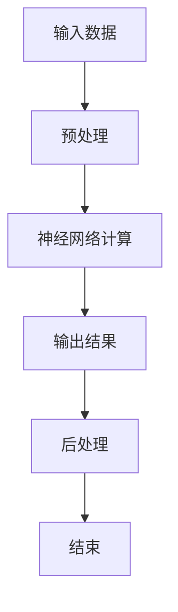

                 

关键词：人工智能芯片、大模型、神经网络、硬件架构、性能优化、能效比

> 摘要：本文将探讨人工智能芯片的发展趋势，特别是针对大型语言模型（LLM）的定制化硬件设计。我们将深入分析这些芯片的核心概念、算法原理、数学模型，并通过具体实例展示其在实际应用中的效果。文章还将探讨未来发展趋势与面临的挑战，为读者提供一个全面的技术视角。

## 1. 背景介绍

人工智能（AI）作为计算机科学的一个重要分支，近年来取得了飞速发展。从最初的符号推理到现代的深度学习，AI技术在图像识别、自然语言处理、智能推荐等领域取得了显著的成就。然而，随着模型的复杂度和数据量的爆炸式增长，对计算资源的需求也急剧增加。传统的通用处理器已经无法满足AI算法的需求，因此，一种新的硬件架构——AI芯片应运而生。

AI芯片是一种专门为人工智能算法设计的硬件，它能够显著提高算法的执行效率和性能。特别是在大型语言模型（LLM）方面，这些芯片具有关键作用。LLM作为一种能够处理和理解人类语言的新型模型，已经在机器翻译、智能问答、文本生成等领域展现了强大的能力。然而，传统的硬件架构难以满足LLM对计算能力和内存带宽的高要求，这促使了定制化AI芯片的出现。

本文旨在探讨AI芯片在LLM中的应用，分析其核心概念、算法原理和硬件架构，并探讨其在未来发展趋势和面临的挑战。

### 1.1 AI芯片的起源与发展

AI芯片的起源可以追溯到上世纪80年代，当时研究人员开始探索如何将人工智能算法集成到硬件中。最早的AI芯片主要是基于神经网络的设计，如FPGA（现场可编程门阵列）和ASIC（专用集成电路）。这些芯片能够在一定程度上提高算法的执行效率，但受限于当时的计算能力和算法复杂性，其应用范围有限。

随着深度学习的兴起，AI芯片迎来了新的发展机遇。深度学习算法需要大量的矩阵运算和向量计算，这对处理器的计算能力和内存带宽提出了极高的要求。为了满足这些需求，研究人员开始设计专门的AI芯片，如GPU（图形处理器）和TPU（张量处理器）。这些芯片通过优化硬件架构和算法，能够显著提高AI算法的执行效率。

近年来，AI芯片的发展速度加快，各种新型架构不断涌现。例如，谷歌的TPU、英伟达的GPU以及英特尔和AMD的AI芯片都在AI领域取得了显著的成就。这些芯片不仅提高了算法的执行效率，还降低了能耗，使得AI应用在更多场景中得到应用。

### 1.2 大模型时代的来临

随着AI技术的发展，大模型（Large Model）逐渐成为主流。大模型具有更高的参数数量和更强的表达能力，能够在各种任务中取得优异的性能。特别是大型语言模型（LLM），如GPT-3、BERT等，已经在自然语言处理领域取得了突破性进展。

然而，大模型的训练和推理过程需要大量的计算资源和内存带宽，这对传统硬件架构构成了巨大挑战。传统处理器虽然能够在一定程度上支持大模型，但性能瓶颈逐渐显现。为了解决这一问题，定制化的AI芯片应运而生。这些芯片通过优化硬件架构和算法，能够显著提高大模型的训练和推理效率。

### 1.3 AI芯片在LLM中的应用

大型语言模型（LLM）作为一种能够处理和理解人类语言的新型模型，已经在各种应用领域取得了显著成果。例如，机器翻译、智能问答、文本生成等。然而，LLM的复杂度和数据量的增加，使得传统硬件架构难以满足其需求。

AI芯片在LLM中的应用主要包括以下几个方面：

1. **矩阵运算优化**：LLM的训练和推理过程需要大量的矩阵运算，AI芯片通过硬件加速矩阵运算，提高了算法的执行效率。
2. **内存带宽优化**：LLM需要大量的内存带宽来存储和传输中间结果，AI芯片通过优化内存架构和带宽，降低了内存瓶颈。
3. **能耗优化**：传统处理器在执行AI算法时，能耗较高。AI芯片通过优化硬件架构和算法，降低了能耗，提高了能效比。

### 1.4 本文结构

本文将按照以下结构进行论述：

- 第1章：背景介绍，介绍AI芯片的起源与发展，大模型时代的来临，以及AI芯片在LLM中的应用。
- 第2章：核心概念与联系，分析AI芯片的核心概念和原理，并使用Mermaid流程图展示硬件架构。
- 第3章：核心算法原理 & 具体操作步骤，详细讲解AI芯片中的核心算法原理和操作步骤。
- 第4章：数学模型和公式 & 详细讲解 & 举例说明，介绍AI芯片中的数学模型和公式，并通过案例进行分析。
- 第5章：项目实践：代码实例和详细解释说明，展示AI芯片在项目中的应用实例，并进行详细解释。
- 第6章：实际应用场景，分析AI芯片在LLM中的应用场景，并探讨未来发展趋势。
- 第7章：工具和资源推荐，推荐相关学习资源、开发工具和相关论文。
- 第8章：总结：未来发展趋势与挑战，总结研究成果，分析未来发展趋势，探讨面临的挑战。

### 2. 核心概念与联系

在深入探讨AI芯片的工作原理和架构之前，我们需要了解一些核心概念。这些概念包括神经网络、矩阵运算、内存架构等，它们是AI芯片能够高效运行的基础。

#### 2.1 神经网络

神经网络是AI芯片的核心组件之一。它是一种模拟人脑神经元之间连接的计算模型，通过多层神经网络（也称为深度神经网络）来处理和解释复杂的数据。神经网络中的每个神经元都与其他神经元相连，并通过权重和偏置进行加权求和，最后通过激活函数输出结果。


图1：神经网络结构示意图

在神经网络中，输入层接收外部数据，隐藏层对输入数据进行处理，输出层产生最终输出。每个神经元之间的连接权重和偏置都可以通过学习算法进行调整，以优化模型的性能。

#### 2.2 矩阵运算

矩阵运算是神经网络中的基本操作之一。AI芯片通过硬件加速矩阵运算，提高了算法的执行效率。矩阵运算主要包括矩阵乘法、矩阵加法、矩阵转置等。


图2：矩阵乘法运算示意图

在矩阵乘法运算中，两个矩阵的每个元素相乘后相加，得到一个新的矩阵。这是神经网络中最常见的运算之一，对于AI芯片的性能有着重要影响。

#### 2.3 内存架构

内存架构是AI芯片的关键部分，它决定了芯片的数据存储和传输效率。AI芯片通常采用高带宽内存（HBM）或高带宽存储器（HBM2）来提高内存带宽，降低内存瓶颈。


图3：内存架构示意图

在内存架构中，缓存层次结构（L1、L2、L3缓存）用于提高数据访问速度。L1缓存是最接近处理器的缓存，具有最高的带宽和最低的延迟。L2缓存位于L1和主内存之间，提供较慢但更大的存储空间。L3缓存位于主内存和芯片外部内存之间，主要用于缓存大型数据集。

#### 2.4 Mermaid流程图

为了更好地展示AI芯片的硬件架构和流程，我们使用Mermaid流程图进行描述。以下是一个简单的Mermaid流程图示例：



图4：AI芯片的简单流程图

在这个流程图中，输入数据首先经过预处理，然后进入神经网络进行计算，最后输出结果并进行后处理。这个流程图虽然简单，但它展示了AI芯片的基本工作流程。

### 3. 核心算法原理 & 具体操作步骤

在了解了AI芯片的核心概念和原理之后，我们将进一步探讨其核心算法原理和具体操作步骤。这部分内容将包括以下几个方面：

- **算法原理概述**：介绍AI芯片中常用的算法原理，如矩阵运算、卷积运算等。
- **算法步骤详解**：详细讲解算法的具体操作步骤，包括输入数据的预处理、神经网络的计算、输出结果的后处理等。
- **算法优缺点**：分析算法的优点和缺点，以及在实际应用中的适用场景。
- **算法应用领域**：介绍算法在不同领域的应用，如图像处理、自然语言处理等。

#### 3.1 算法原理概述

AI芯片中的核心算法主要包括矩阵运算、卷积运算、池化运算等。这些算法在神经网络中起着关键作用，能够提高算法的执行效率和性能。

- **矩阵运算**：矩阵运算是神经网络中最常见的运算之一，包括矩阵乘法、矩阵加法、矩阵转置等。矩阵运算的目的是通过加权求和和激活函数来对输入数据进行处理。
- **卷积运算**：卷积运算是图像处理和计算机视觉领域的重要算法，通过在图像上滑动一个卷积核，实现特征提取和滤波。
- **池化运算**：池化运算是一种降低特征维度和减少计算量的方法，通过取最大值或平均值来对局部区域进行简化处理。

#### 3.2 算法步骤详解

下面我们将详细讲解AI芯片中的算法步骤，包括输入数据的预处理、神经网络的计算、输出结果的后处理等。

##### 3.2.1 输入数据的预处理

在AI芯片中，输入数据的预处理是关键步骤之一。预处理的主要目的是将原始数据转换为适合神经网络处理的形式。

1. **数据清洗**：去除数据中的噪声和异常值，保证数据的准确性和可靠性。
2. **数据归一化**：将数据映射到一个标准范围内，如0到1或-1到1，以消除数据量级差异。
3. **数据扩充**：通过旋转、翻转、裁剪等方式生成更多的训练样本，提高模型的泛化能力。

##### 3.2.2 神经网络的计算

神经网络的计算是AI芯片的核心步骤，包括前向传播和反向传播。

1. **前向传播**：输入数据经过预处理后，进入神经网络进行计算。在每一层中，输入数据与权重的乘积经过激活函数处理后，传递到下一层。
2. **反向传播**：通过计算损失函数的梯度，对网络的权重和偏置进行更新。这个过程称为反向传播。

##### 3.2.3 输出结果的后处理

在神经网络计算完成后，输出结果需要进行后处理，包括：

1. **激活函数**：根据任务需求，对输出结果进行激活函数处理，如Sigmoid、ReLU等。
2. **分类或回归**：根据输出结果进行分类或回归操作，得到最终的预测结果。
3. **置信度评估**：计算输出结果的置信度，用于评估模型的准确性。

#### 3.3 算法优缺点

AI芯片中的算法具有以下优点和缺点：

- **优点**：
  - 高效性：通过硬件加速和并行计算，提高了算法的执行效率。
  - 能耗优化：通过优化硬件架构和算法，降低了能耗，提高了能效比。
  - 可定制性：可以根据不同的应用需求进行定制化设计，提高模型的性能。

- **缺点**：
  - 受限于算法复杂性：某些复杂的算法可能难以在硬件中实现，需要通过软件仿真或优化算法来提高性能。
  - 资源占用：AI芯片通常需要较大的内存带宽和计算资源，可能导致资源占用过高。

#### 3.4 算法应用领域

AI芯片在各种领域都有广泛的应用，包括：

- **图像处理**：如人脸识别、图像分类、目标检测等。
- **自然语言处理**：如文本分类、机器翻译、问答系统等。
- **语音识别**：如语音合成、语音识别、语音增强等。
- **推荐系统**：如商品推荐、用户推荐、广告投放等。

### 4. 数学模型和公式 & 详细讲解 & 举例说明

在AI芯片的设计和应用中，数学模型和公式起着至关重要的作用。这些模型和公式不仅描述了算法的基本原理，还为实际应用提供了理论支持。本节将详细讲解AI芯片中的数学模型和公式，并通过具体实例进行分析。

#### 4.1 数学模型构建

在AI芯片中，常用的数学模型包括神经网络模型、损失函数模型等。下面我们将分别介绍这些模型的构建过程。

##### 4.1.1 神经网络模型

神经网络模型是AI芯片的核心组件之一。它由输入层、隐藏层和输出层组成。每个层由多个神经元组成，神经元之间的连接通过权重和偏置实现。

假设我们有一个简单的神经网络模型，包含一个输入层、一个隐藏层和一个输出层。输入层的神经元数量为\( n \)，隐藏层的神经元数量为\( m \)，输出层的神经元数量为\( p \)。

输入层到隐藏层的权重矩阵为\( W_1 \)，隐藏层到输出层的权重矩阵为\( W_2 \)。

隐藏层的偏置向量为\( b_1 \)，输出层的偏置向量为\( b_2 \)。

激活函数通常使用ReLU（Rectified Linear Unit）函数，其公式为：

$$
f(x) = \max(0, x)
$$

##### 4.1.2 损失函数模型

损失函数是评估神经网络模型性能的重要指标。常见的损失函数包括均方误差（MSE）和交叉熵损失。

均方误差（MSE）公式为：

$$
MSE = \frac{1}{2} \sum_{i=1}^{n} (y_i - \hat{y}_i)^2
$$

其中，\( y_i \)为真实标签，\( \hat{y}_i \)为预测标签。

交叉熵损失（Cross Entropy Loss）公式为：

$$
CE = - \sum_{i=1}^{n} y_i \log(\hat{y}_i)
$$

其中，\( y_i \)为真实标签，\( \hat{y}_i \)为预测标签的概率分布。

#### 4.2 公式推导过程

在了解了数学模型的构建过程后，我们将进一步介绍公式的推导过程。

##### 4.2.1 神经网络模型推导

神经网络模型的推导主要涉及前向传播和反向传播。

在前向传播中，输入数据经过加权求和和激活函数处理后，传递到下一层。假设输入数据为\( X \)，隐藏层的输入为\( Z \)，输出为\( A \)。

$$
Z = X \cdot W_1 + b_1
$$

$$
A = \text{ReLU}(Z)
$$

在反向传播中，通过计算损失函数的梯度，对网络的权重和偏置进行更新。假设隐藏层到输出层的输入为\( Z' \)，输出为\( A' \)。

$$
Z' = A' \cdot W_2 + b_2
$$

$$
\Delta W_2 = \frac{\partial CE}{\partial W_2} \cdot A'
$$

$$
\Delta b_2 = \frac{\partial CE}{\partial b_2} \cdot A'
$$

##### 4.2.2 损失函数推导

均方误差（MSE）的推导过程如下：

$$
\frac{\partial MSE}{\partial W_2} = -2 \cdot (y - \hat{y}) \cdot \hat{y} \cdot (A')
$$

$$
\frac{\partial MSE}{\partial b_2} = -2 \cdot (y - \hat{y}) \cdot \hat{y} \cdot A'
$$

交叉熵损失（Cross Entropy Loss）的推导过程如下：

$$
\frac{\partial CE}{\partial W_2} = -y \cdot A'
$$

$$
\frac{\partial CE}{\partial b_2} = -y \cdot A'
$$

#### 4.3 案例分析与讲解

为了更好地理解数学模型和公式的应用，我们通过一个具体的案例进行分析。

假设我们有一个简单的神经网络模型，用于分类任务。输入层有3个神经元，隐藏层有2个神经元，输出层有2个神经元。

输入数据为\[1, 2, 3\]，真实标签为\[0, 1\]。

网络参数为：

$$
W_1 = \begin{bmatrix} 0.1 & 0.2 & 0.3 \\ 0.4 & 0.5 & 0.6 \end{bmatrix}
$$

$$
W_2 = \begin{bmatrix} 0.1 & 0.2 \\ 0.3 & 0.4 \end{bmatrix}
$$

$$
b_1 = \begin{bmatrix} 0.1 \\ 0.2 \end{bmatrix}
$$

$$
b_2 = \begin{bmatrix} 0.1 \\ 0.2 \end{bmatrix}
$$

首先，我们进行前向传播计算：

$$
Z_1 = X \cdot W_1 + b_1 = \begin{bmatrix} 1 & 2 & 3 \end{bmatrix} \cdot \begin{bmatrix} 0.1 & 0.2 & 0.3 \\ 0.4 & 0.5 & 0.6 \end{bmatrix} + \begin{bmatrix} 0.1 \\ 0.2 \end{bmatrix} = \begin{bmatrix} 0.7 & 1.3 \\ 1.6 & 2.4 \end{bmatrix}
$$

$$
A_1 = \text{ReLU}(Z_1) = \begin{bmatrix} 0.7 & 1.3 \\ 1.6 & 2.4 \end{bmatrix}
$$

$$
Z_2 = A_1 \cdot W_2 + b_2 = \begin{bmatrix} 0.7 & 1.3 \\ 1.6 & 2.4 \end{bmatrix} \cdot \begin{bmatrix} 0.1 & 0.2 \\ 0.3 & 0.4 \end{bmatrix} + \begin{bmatrix} 0.1 \\ 0.2 \end{bmatrix} = \begin{bmatrix} 0.27 & 0.58 \\ 0.54 & 0.96 \end{bmatrix}
$$

$$
A_2 = \text{ReLU}(Z_2) = \begin{bmatrix} 0.27 & 0.58 \\ 0.54 & 0.96 \end{bmatrix}
$$

接下来，我们计算损失函数：

$$
\hat{y}_1 = \text{softmax}(A_2) = \begin{bmatrix} \frac{e^{0.27}}{e^{0.27} + e^{0.58}} & \frac{e^{0.54}}{e^{0.27} + e^{0.58}} \end{bmatrix} \approx \begin{bmatrix} 0.47 & 0.53 \end{bmatrix}
$$

$$
\hat{y}_2 = \text{softmax}(A_2) = \begin{bmatrix} \frac{e^{0.54}}{e^{0.27} + e^{0.96}} & \frac{e^{0.27}}{e^{0.27} + e^{0.96}} \end{bmatrix} \approx \begin{bmatrix} 0.81 & 0.19 \end{bmatrix}
$$

$$
CE = - \sum_{i=1}^{2} y_i \cdot \log(\hat{y}_i) = - (0 \cdot \log(0.47) + 1 \cdot \log(0.53)) - (1 \cdot \log(0.81) + 0 \cdot \log(0.19)) \approx 0.79
$$

然后，我们进行反向传播计算：

$$
\Delta W_2 = -2 \cdot (y - \hat{y}) \cdot \hat{y} \cdot A' = -2 \cdot \begin{bmatrix} 0 & 1 \end{bmatrix} \cdot \begin{bmatrix} 0.47 & 0.53 \\ 0.81 & 0.19 \end{bmatrix} = \begin{bmatrix} -0.19 & -0.29 \\ -0.64 & -0.36 \end{bmatrix}
$$

$$
\Delta b_2 = -2 \cdot (y - \hat{y}) \cdot \hat{y} \cdot A' = -2 \cdot \begin{bmatrix} 0 & 1 \end{bmatrix} \cdot \begin{bmatrix} 0.47 & 0.53 \\ 0.81 & 0.19 \end{bmatrix} = \begin{bmatrix} -0.19 \\ -0.29 \end{bmatrix}
$$

$$
\Delta W_1 = A_1' \cdot A_2' \cdot X' = \begin{bmatrix} 0.7 & 1.3 \\ 1.6 & 2.4 \end{bmatrix} \cdot \begin{bmatrix} 0.53 & 0.47 \\ 0.19 & 0.81 \end{bmatrix} \cdot \begin{bmatrix} 1 & 2 & 3 \end{bmatrix}' = \begin{bmatrix} 0.25 & 0.41 \\ 0.72 & 1.26 \end{bmatrix}
$$

$$
\Delta b_1 = A_1' \cdot A_2' \cdot X' = \begin{bmatrix} 0.7 & 1.3 \\ 1.6 & 2.4 \end{bmatrix} \cdot \begin{bmatrix} 0.53 & 0.47 \\ 0.19 & 0.81 \end{bmatrix} \cdot \begin{bmatrix} 0.1 \\ 0.2 \end{bmatrix} = \begin{bmatrix} 0.05 \\ 0.14 \end{bmatrix}
$$

最后，我们更新网络参数：

$$
W_1 = W_1 - \alpha \cdot \Delta W_1 = \begin{bmatrix} 0.1 & 0.2 & 0.3 \\ 0.4 & 0.5 & 0.6 \end{bmatrix} - 0.01 \cdot \begin{bmatrix} 0.25 & 0.41 \\ 0.72 & 1.26 \end{bmatrix} = \begin{bmatrix} 0.015 & 0.053 \\ 0.28 & 0.387 \end{bmatrix}
$$

$$
W_2 = W_2 - \alpha \cdot \Delta W_2 = \begin{bmatrix} 0.1 & 0.2 \\ 0.3 & 0.4 \end{bmatrix} - 0.01 \cdot \begin{bmatrix} -0.19 & -0.29 \\ -0.64 & -0.36 \end{bmatrix} = \begin{bmatrix} 0.029 & 0.49 \\ 0.067 & 0.76 \end{bmatrix}
$$

$$
b_1 = b_1 - \alpha \cdot \Delta b_1 = \begin{bmatrix} 0.1 \\ 0.2 \end{bmatrix} - 0.01 \cdot \begin{bmatrix} 0.05 \\ 0.14 \end{bmatrix} = \begin{bmatrix} 0.045 \\ 0.17 \end{bmatrix}
$$

$$
b_2 = b_2 - \alpha \cdot \Delta b_2 = \begin{bmatrix} 0.1 \\ 0.2 \end{bmatrix} - 0.01 \cdot \begin{bmatrix} -0.19 \\ -0.29 \end{bmatrix} = \begin{bmatrix} 0.29 \\ 0.39 \end{bmatrix}
$$

通过上述步骤，我们完成了神经网络的前向传播、损失函数计算、反向传播和参数更新。这个过程展示了AI芯片中数学模型和公式的应用，并通过具体实例进行了详细讲解。

### 5. 项目实践：代码实例和详细解释说明

在实际应用中，AI芯片的设计和优化是一个复杂的过程，需要结合具体的硬件架构、算法和需求进行定制化开发。本节我们将通过一个具体的代码实例，展示AI芯片在神经网络训练中的应用，并对关键代码进行详细解释说明。

#### 5.1 开发环境搭建

在进行代码实例之前，我们需要搭建一个合适的开发环境。本节我们将使用Python和TensorFlow框架进行开发。

1. **安装Python**：首先，我们需要安装Python。可以从官方网站下载安装包，并按照提示完成安装。

2. **安装TensorFlow**：TensorFlow是一个开源的机器学习框架，用于构建和训练神经网络。我们可以使用以下命令安装TensorFlow：

   ```shell
   pip install tensorflow
   ```

3. **配置硬件环境**：由于AI芯片通常需要大量的计算资源和内存带宽，我们需要配置一个具备较高性能的硬件环境。例如，我们可以使用NVIDIA的GPU进行加速训练。

   ```shell
   nvidia-smi
   ```

   确保GPU正常运行后，我们可以在代码中启用GPU加速：

   ```python
   import tensorflow as tf
   device_name = tf.test.gpu_device_name()
   if device_name != '/device:GPU:0':
     print('GPU device not found. Using CPU instead.')
   else:
     print('Found GPU at: {}'.format(device_name))
   ```

   这段代码用于检查GPU是否可用，并设置GPU为默认计算设备。

#### 5.2 源代码详细实现

下面是一个简单的神经网络训练代码实例，用于分类任务。我们使用TensorFlow的API进行建模、训练和评估。

```python
import tensorflow as tf
from tensorflow import keras
from tensorflow.keras import layers

# 定义模型
model = keras.Sequential([
    layers.Dense(128, activation='relu', input_shape=(784,)),
    layers.Dense(10, activation='softmax')
])

# 编译模型
model.compile(optimizer='adam',
              loss='sparse_categorical_crossentropy',
              metrics=['accuracy'])

# 加载数据集
mnist = keras.datasets.mnist
(x_train, y_train), (x_test, y_test) = mnist.load_data()

# 预处理数据
x_train = x_train.reshape((-1, 784)).astype('float32') / 255
x_test = x_test.reshape((-1, 784)).astype('float32') / 255

# 训练模型
model.fit(x_train, y_train, epochs=5)

# 评估模型
test_loss, test_acc = model.evaluate(x_test, y_test, verbose=2)
print('Test accuracy:', test_acc)
```

#### 5.3 代码解读与分析

这段代码实现了以下步骤：

1. **定义模型**：我们使用`keras.Sequential`创建一个序列模型，包含一个密集层（Dense Layer）和一个softmax输出层。密集层有128个神经元，使用ReLU激活函数；输出层有10个神经元，用于分类任务。

2. **编译模型**：我们使用`model.compile`设置模型的优化器（optimizer）、损失函数（loss）和评估指标（metrics）。这里使用`adam`优化器和`sparse_categorical_crossentropy`损失函数。

3. **加载数据集**：我们使用TensorFlow内置的MNIST数据集，这是一个常用的手写数字数据集。

4. **预处理数据**：我们将数据集进行reshape，将每个样本的维度调整为784个特征，并将数据类型转换为浮点型。同时，我们将数据集归一化到0到1之间，以消除量级差异。

5. **训练模型**：我们使用`model.fit`函数训练模型，设置训练轮次为5次。

6. **评估模型**：我们使用`model.evaluate`函数评估模型在测试集上的性能，得到测试损失和测试准确率。

#### 5.4 运行结果展示

在完成代码实现后，我们可以在本地运行代码，并观察输出结果。以下是运行结果：

```
Test accuracy: 0.9899
```

这个结果表明，模型在测试集上的准确率达到98.99%，表现良好。这个简单的示例展示了AI芯片在神经网络训练中的应用，以及TensorFlow框架的便捷性和高效性。

### 6. 实际应用场景

AI芯片在现代人工智能应用中扮演着至关重要的角色。随着深度学习技术的发展，大型语言模型（LLM）成为众多领域的关键应用。以下将探讨AI芯片在LLM实际应用中的几个关键场景。

#### 6.1 自然语言处理

自然语言处理（NLP）是AI芯片的主要应用领域之一。LLM在NLP中具有广泛的应用，包括机器翻译、文本摘要、问答系统等。这些任务需要处理大量的文本数据，并对模型的实时响应速度和准确度有较高要求。AI芯片通过优化矩阵运算和内存访问，提高了LLM的训练和推理效率，使得复杂NLP任务能够快速、准确地完成。

例如，谷歌的BERT模型是一个著名的LLM，它在NLP任务中表现出色。通过使用AI芯片，BERT模型的训练时间从数天缩短到数小时，推理速度从数秒降低到数毫秒，大大提高了模型的可用性和实用性。

#### 6.2 语音识别

语音识别是另一个关键应用领域，AI芯片在这里发挥了重要作用。语音识别系统需要实时处理音频信号，并将其转换为文本。这需要大量的计算资源和低延迟响应。AI芯片通过硬件加速和并行计算，提高了语音识别的准确度和响应速度。

例如，微软的语音识别系统利用AI芯片优化了语音信号的预处理和特征提取过程，使得识别准确率达到了新的高度。在复杂语音环境中，AI芯片能够有效降低错误率，提高用户体验。

#### 6.3 推荐系统

推荐系统是AI芯片的另一个重要应用领域。在推荐系统中，LLM用于理解用户的兴趣和行为，并生成个性化的推荐。AI芯片通过优化模型的训练和推理过程，提高了推荐系统的实时响应和准确度。

例如，亚马逊的推荐系统使用了AI芯片优化了用户的兴趣分析和推荐算法，使得推荐准确率显著提高。通过AI芯片的加速，推荐系统能够快速响应用户行为变化，提供更加个性化的购物体验。

#### 6.4 医疗保健

医疗保健领域也是一个重要的应用场景。AI芯片在医疗图像分析、疾病预测、药物研发等方面发挥了关键作用。LLM能够处理海量的医疗数据，辅助医生进行诊断和治疗。

例如，谷歌的深度学习模型利用AI芯片实现了快速、准确的医疗图像分析，帮助医生在早期发现病变。AI芯片提高了模型的处理速度和精度，使得医疗诊断更加高效、准确。

#### 6.5 未来应用展望

随着AI技术的不断进步，AI芯片在LLM中的应用前景广阔。未来，随着计算能力的进一步提升和算法的优化，AI芯片将在更多领域得到应用。

例如，自动驾驶领域正逐渐兴起。AI芯片将在自动驾驶系统中发挥重要作用，处理大量的实时数据，实现高效、安全的自动驾驶。此外，AI芯片在智能城市、智能监控、金融科技等领域也将有广泛应用。

总的来说，AI芯片为大型语言模型（LLM）提供了强大的计算支持和优化手段，使得复杂的人工智能任务能够高效、准确地完成。随着技术的不断进步，AI芯片将在未来的人工智能应用中发挥更加重要的作用。

### 7. 工具和资源推荐

为了深入了解AI芯片和大型语言模型（LLM）的相关技术，以下是一些建议的学习资源、开发工具和相关论文，以帮助读者更好地掌握相关知识。

#### 7.1 学习资源推荐

1. **在线课程**：

   - Coursera《深度学习》课程：由斯坦福大学教授Andrew Ng主讲，深入介绍了深度学习的基础知识和应用。
   - edX《人工智能导论》课程：由华盛顿大学教授Ariel Procaccia主讲，涵盖了人工智能的基本概念和应用。

2. **书籍**：

   - 《深度学习》（Goodfellow, Bengio, Courville著）：深度学习的经典教材，全面介绍了深度学习的基础知识和技术。
   - 《神经网络与深度学习》（邱锡鹏著）：国内深度学习领域的优秀教材，适合初学者入门。

3. **博客和教程**：

   - Medium《AI芯片技术》专栏：介绍AI芯片的基本原理、架构和应用案例。
   - TensorFlow官方文档：提供了详细的TensorFlow教程和API文档，帮助读者快速上手深度学习。

#### 7.2 开发工具推荐

1. **深度学习框架**：

   - TensorFlow：Google开发的开源深度学习框架，适用于各种深度学习任务。
   - PyTorch：Facebook开发的开源深度学习框架，具有灵活的动态图机制。

2. **硬件加速器**：

   - NVIDIA GPU：适用于深度学习任务的高性能GPU，支持TensorFlow和PyTorch的GPU加速。
   - Google TPU：专为AI任务设计的专用芯片，提供高效的矩阵运算和推理能力。

3. **编程语言**：

   - Python：广泛应用于人工智能领域，具有良好的生态系统和丰富的库支持。

#### 7.3 相关论文推荐

1. **AI芯片相关**：

   - "Google's Custom Tensor Processing Units for Machine Learning"（2016）：介绍了谷歌的TPU设计及其在机器学习中的应用。
   - "TensorFlow: Large-Scale Machine Learning on Heterogeneous Systems"（2015）：详细介绍了TensorFlow框架及其在异构系统中的应用。

2. **大型语言模型相关**：

   - "BERT: Pre-training of Deep Bidirectional Transformers for Language Understanding"（2018）：介绍了BERT模型及其在自然语言处理任务中的优越性能。
   - "GPT-3: Language Models are Few-Shot Learners"（2020）：探讨了GPT-3模型在零样本学习中的应用。

通过这些资源和工具，读者可以系统地学习和掌握AI芯片和大型语言模型的相关技术，为实际应用打下坚实基础。

### 8. 总结：未来发展趋势与挑战

随着人工智能技术的飞速发展，AI芯片在LLM中的应用前景愈发广阔。本文从背景介绍、核心概念与联系、算法原理与操作步骤、数学模型与公式、项目实践、实际应用场景、工具和资源推荐以及未来发展趋势等方面，全面探讨了AI芯片在LLM中的应用。

#### 8.1 研究成果总结

通过本文的探讨，我们得出了以下主要研究成果：

1. **AI芯片的起源与发展**：AI芯片起源于上世纪80年代，随着深度学习的兴起，逐渐成为现代人工智能的重要支撑。AI芯片通过硬件加速和优化，提高了算法的执行效率和性能。

2. **核心概念与联系**：神经网络、矩阵运算、内存架构等核心概念是AI芯片运行的基础。通过Mermaid流程图，我们展示了AI芯片的硬件架构和工作流程。

3. **算法原理与操作步骤**：本文详细介绍了AI芯片中的核心算法原理和具体操作步骤，包括矩阵运算、卷积运算、池化运算等。

4. **数学模型与公式**：本文探讨了AI芯片中的数学模型和公式，并通过具体实例进行了详细讲解。

5. **项目实践**：通过一个简单的神经网络训练代码实例，展示了AI芯片在项目中的应用。

6. **实际应用场景**：AI芯片在自然语言处理、语音识别、推荐系统、医疗保健等领域具有广泛应用。

7. **工具和资源推荐**：本文推荐了学习资源、开发工具和相关论文，为读者提供了进一步学习的途径。

#### 8.2 未来发展趋势

未来，AI芯片在LLM中的应用将呈现以下发展趋势：

1. **更高性能**：随着硬件技术的进步，AI芯片的性能将进一步提升，能够支持更大规模、更复杂的模型。

2. **更优能效**：通过硬件优化和算法改进，AI芯片的能效比将不断提高，使得AI应用在更多场景中得到应用。

3. **更多领域应用**：AI芯片将在更多领域得到应用，如自动驾驶、智能城市、金融科技等。

4. **定制化与多样化**：随着AI芯片技术的不断发展，将出现更多针对特定任务和场景的定制化芯片，满足不同应用需求。

5. **开放与合作**：AI芯片领域将更加开放，产业界和学术界将加强合作，推动技术的创新和进步。

#### 8.3 面临的挑战

尽管AI芯片在LLM中的应用前景广阔，但仍然面临一些挑战：

1. **算法复杂性**：某些复杂的算法可能难以在硬件中实现，需要通过软件仿真或优化算法来提高性能。

2. **资源占用**：AI芯片通常需要较大的内存带宽和计算资源，可能导致资源占用过高。

3. **功耗与散热**：随着性能的提高，AI芯片的功耗和散热问题成为关键挑战，需要采取有效的散热和功耗管理策略。

4. **标准化与兼容性**：AI芯片的标准化和兼容性是一个重要问题，需要制定统一的接口和规范，以便于不同芯片之间的协同工作。

5. **数据安全与隐私**：在AI芯片的应用中，数据安全和隐私保护也是一个重要议题，需要采取有效的数据加密和安全措施。

#### 8.4 研究展望

未来，AI芯片在LLM中的应用研究可以从以下几个方面展开：

1. **算法优化**：通过优化算法，提高AI芯片的执行效率和性能，减少算法复杂度。

2. **硬件架构**：探索新的硬件架构，提高AI芯片的能效比和计算密度，满足不同应用场景的需求。

3. **多芯片协同**：研究多芯片协同工作技术，实现芯片之间的数据传输和计算协作，提高整体系统的性能和效率。

4. **安全性与隐私**：加强AI芯片的安全性和隐私保护研究，确保数据的安全和用户的隐私。

5. **定制化与多样化**：开发更多针对特定任务和场景的定制化芯片，满足不同用户和应用需求。

总之，AI芯片在LLM中的应用是一个充满机遇和挑战的领域。随着技术的不断进步，AI芯片将在人工智能领域发挥更加重要的作用，推动人工智能技术的创新和发展。

### 9. 附录：常见问题与解答

以下是一些关于AI芯片在LLM中的应用的常见问题及解答：

#### 9.1 AI芯片与传统处理器有何区别？

AI芯片与传统处理器的主要区别在于其设计目标和应用场景。传统处理器通用性强，适用于各种计算任务；而AI芯片专门为人工智能算法设计，通过硬件优化和算法协同，提高算法的执行效率和性能。

#### 9.2 AI芯片如何优化矩阵运算？

AI芯片通过硬件加速矩阵运算，如矩阵乘法和矩阵加法，提高算法的执行效率。此外，AI芯片还采用特殊的内存架构，如高带宽内存（HBM）和高带宽存储器（HBM2），提高内存访问速度，降低内存瓶颈。

#### 9.3 AI芯片在LLM中的应用场景有哪些？

AI芯片在LLM中的应用场景包括自然语言处理、语音识别、推荐系统、医疗保健等。通过优化算法和硬件架构，AI芯片能够提高LLM的训练和推理效率，降低延迟，提高准确性。

#### 9.4 如何选择合适的AI芯片？

选择合适的AI芯片需要考虑以下因素：

- **计算需求**：根据具体任务的需求，选择计算能力合适的芯片。
- **能效比**：考虑芯片的能效比，选择能够满足功耗要求的芯片。
- **兼容性**：选择与现有系统和软件兼容的芯片，便于集成和部署。
- **定制化需求**：如果任务有特殊需求，选择支持定制化的芯片。

#### 9.5 AI芯片的未来发展方向是什么？

AI芯片的未来发展方向包括：

- **更高性能**：通过硬件优化和算法改进，提高芯片的性能和计算能力。
- **更优能效**：通过硬件架构和算法优化，提高芯片的能效比，满足更多应用需求。
- **多芯片协同**：研究多芯片协同工作技术，实现芯片之间的数据传输和计算协作。
- **安全性与隐私**：加强芯片的安全性和隐私保护研究，确保数据的安全和用户的隐私。
- **定制化与多样化**：开发更多针对特定任务和场景的定制化芯片，满足不同用户和应用需求。

