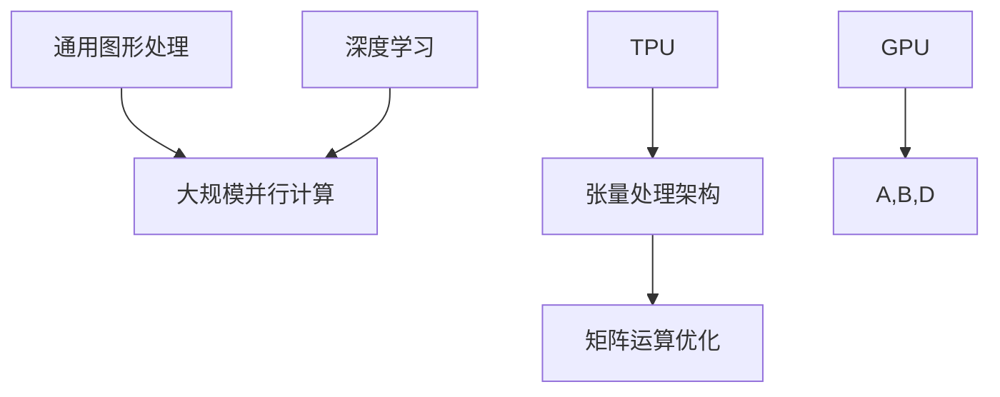

                 

关键词：AI芯片，GPU，TPU，计算架构，深度学习，神经网络，硬件加速

> 摘要：本文将深入探讨AI芯片的发展历程，从GPU到TPU的变革。通过分析两者的设计理念、核心特性及应用场景，揭示AI芯片如何推动人工智能的进步。同时，本文还将展望未来AI芯片的发展趋势和面临的挑战。

## 1. 背景介绍

随着人工智能（AI）技术的快速发展，AI芯片的需求日益增长。AI芯片是一种专门用于加速人工智能计算任务的硬件，它能够显著提高深度学习、图像处理和自然语言处理等领域的计算效率。在AI芯片的演进过程中，GPU（图形处理单元）和TPU（张量处理单元）扮演了重要角色。

### 1.1 GPU的崛起

GPU最早是为了满足图形渲染的需求而设计的，它具有高度并行计算的能力，适合处理大量简单运算任务。随着深度学习技术的兴起，GPU逐渐成为AI计算的热门选择。GPU通过其大规模的流处理器阵列，能够并行处理大量的矩阵运算，从而加速深度神经网络的训练。

### 1.2 TPU的诞生

TPU是谷歌专门为深度学习任务设计的一款AI芯片。TPU的设计理念与GPU不同，它专注于高吞吐量和低延迟的运算。TPU采用了张量处理架构，能够高效地进行矩阵乘法和加法等操作，这是深度学习中的基本运算。TPU的出现，标志着AI芯片从通用图形处理向专用张量处理的发展。

## 2. 核心概念与联系

为了更好地理解GPU和TPU的设计理念和核心特性，我们首先需要了解一些核心概念和它们的架构联系。以下是一个Mermaid流程图，用于描述这些概念和架构之间的联系。



### 2.1 通用图形处理

通用图形处理是指GPU最初的设计目的，即用于渲染图形。它依赖于大规模的并行计算架构，能够同时处理大量的简单运算任务。

### 2.2 大规模并行计算

大规模并行计算是GPU的核心特性之一，它使得GPU能够高效地执行深度学习算法中的矩阵运算。

### 2.3 深度学习

深度学习是一种利用神经网络进行数据建模的方法。深度学习对计算性能有极高的要求，因此GPU和TPU应运而生。

### 2.4 张量处理架构

张量处理架构是TPU的核心特性，它专注于高效地进行矩阵乘法和加法等操作，这是深度学习中的基本运算。

### 2.5 GPU与TPU的联系

GPU和TPU虽然有不同的设计理念，但它们都是用于加速深度学习任务的AI芯片。GPU通过大规模并行计算和通用图形处理来提升深度学习性能，而TPU则通过张量处理架构实现高效矩阵运算。

## 3. 核心算法原理 & 具体操作步骤

### 3.1 算法原理概述

GPU和TPU的核心算法原理主要涉及矩阵运算和并行计算。GPU利用大规模的流处理器阵列并行处理大量的矩阵运算，而TPU则专注于高效的张量处理。

### 3.2 算法步骤详解

#### 3.2.1 GPU算法步骤

1. 数据准备：将输入数据加载到GPU内存中。
2. 矩阵运算：通过GPU流处理器阵列并行执行矩阵乘法和加法等操作。
3. 结果存储：将运算结果存储到GPU内存中，并传输回CPU进行处理。

#### 3.2.2 TPU算法步骤

1. 数据准备：将输入数据加载到TPU内存中。
2. 张量处理：通过TPU张量处理单元执行高效的矩阵乘法和加法等操作。
3. 结果存储：将运算结果存储到TPU内存中，并传输回CPU进行处理。

### 3.3 算法优缺点

#### 3.3.1 GPU的优点

- 高并行计算能力
- 适用于多种AI任务
- 丰富的开发工具和资源

#### 3.3.1 GPU的缺点

- 矩阵运算效率相对较低
- 不适合高吞吐量任务

#### 3.3.2 TPU的优点

- 高效的矩阵运算
- 适用于大规模深度学习任务
- 专为AI设计

#### 3.3.2 TPU的缺点

- 开发难度较高
- 适用范围较窄

### 3.4 算法应用领域

#### 3.4.1 GPU的应用领域

- 图形渲染
- 自然语言处理
- 计算机视觉

#### 3.4.2 TPU的应用领域

- 大规模深度学习任务
- 数据中心计算
- 智能推理

## 4. 数学模型和公式 & 详细讲解 & 举例说明

### 4.1 数学模型构建

在深度学习中，我们通常使用反向传播算法来训练神经网络。以下是反向传播算法的核心数学模型。

### 4.2 公式推导过程

反向传播算法的核心在于计算损失函数关于网络参数的梯度。以下是一个简化的推导过程。

$$
\begin{aligned}
\frac{\partial L}{\partial w} &= \sum_{i=1}^{n} \frac{\partial L}{\partial z_i} \frac{\partial z_i}{\partial w} \\
\frac{\partial L}{\partial b} &= \sum_{i=1}^{n} \frac{\partial L}{\partial z_i} \frac{\partial z_i}{\partial b}
\end{aligned}
$$

其中，$L$ 是损失函数，$w$ 和 $b$ 分别是权重和偏置。

### 4.3 案例分析与讲解

假设我们有一个简单的线性回归模型，输入为 $x$，输出为 $y$。我们的目标是找到最佳的权重 $w$ 和偏置 $b$，使得预测值 $y'$ 最接近实际值 $y$。

$$
y' = wx + b
$$

损失函数可以选择均方误差（MSE）：

$$
L = \frac{1}{2} (y - y')^2
$$

通过反向传播算法，我们可以计算出关于 $w$ 和 $b$ 的梯度，并使用梯度下降法进行优化。

## 5. 项目实践：代码实例和详细解释说明

### 5.1 开发环境搭建

在本项目实践中，我们将使用 TensorFlow 作为深度学习框架，并利用 GPU 或 TPU 进行计算加速。

### 5.2 源代码详细实现

以下是一个简单的 TensorFlow 代码实例，用于训练一个线性回归模型。

```python
import tensorflow as tf

# 定义输入和输出
x = tf.placeholder(tf.float32, shape=[None, 1])
y = tf.placeholder(tf.float32, shape=[None, 1])

# 定义权重和偏置
w = tf.Variable(tf.random_normal([1, 1]))
b = tf.Variable(tf.random_normal([1, 1]))

# 定义线性模型
y_pred = tf.matmul(x, w) + b

# 定义损失函数
loss = tf.reduce_mean(tf.square(y - y_pred))

# 定义优化器
optimizer = tf.train.GradientDescentOptimizer(learning_rate=0.1)
train_op = optimizer.minimize(loss)

# 搭建计算图
with tf.Session() as sess:
  sess.run(tf.global_variables_initializer())
  
  # 训练模型
  for i in range(1000):
    sess.run(train_op, feed_dict={x: x_data, y: y_data})
    
  # 输出最佳权重和偏置
  best_w, best_b = sess.run([w, b])
  print("Best weights:", best_w)
  print("Best bias:", best_b)
```

### 5.3 代码解读与分析

在这个代码实例中，我们首先定义了输入和输出，然后定义了权重和偏置。接下来，我们定义了线性模型和损失函数。最后，我们使用梯度下降法训练模型，并输出最佳权重和偏置。

### 5.4 运行结果展示

在运行这个代码实例后，我们得到了最佳权重和偏置。这些权重和偏置使得预测值 $y'$ 最接近实际值 $y$。这表明我们的模型已经训练完成。

## 6. 实际应用场景

### 6.1 图形渲染

GPU在图形渲染领域有着广泛的应用，例如游戏开发、虚拟现实和增强现实等。

### 6.2 自然语言处理

GPU在自然语言处理任务中也发挥着重要作用，例如机器翻译、语音识别和文本生成等。

### 6.3 计算机视觉

GPU在计算机视觉任务中也有广泛应用，例如目标检测、图像分类和图像分割等。

### 6.4 大规模深度学习

TPU在大型深度学习任务中有着显著的优势，例如谷歌的翻译系统和推荐系统等。

## 7. 工具和资源推荐

### 7.1 学习资源推荐

- 《深度学习》（Goodfellow, Bengio, Courville）
- 《GPU Pro》：系列图书，涵盖了 GPU 图形编程的各个方面

### 7.2 开发工具推荐

- TensorFlow：用于构建和训练深度学习模型的框架
- PyTorch：另一种流行的深度学习框架

### 7.3 相关论文推荐

- "Tensor Processing Units: Data-Parallel Algorithms on a Manycore Architecture"
- "Google's Custom Tensor Processing Unit for Machine Learning"

## 8. 总结：未来发展趋势与挑战

### 8.1 研究成果总结

GPU和TPU的崛起标志着AI芯片在人工智能领域的重要性。它们通过不同的设计理念，分别解决了通用图形处理和专用张量处理的需求。

### 8.2 未来发展趋势

随着人工智能技术的不断进步，AI芯片将继续朝着更高性能、更低功耗和更广泛适用性的方向发展。

### 8.3 面临的挑战

AI芯片在未来的发展过程中，将面临如何在确保高性能的同时降低功耗、提高能效的挑战。

### 8.4 研究展望

未来，AI芯片的研究将聚焦于如何更好地支持多样化的AI应用，并探索新的计算架构和算法，以满足不断增长的计算需求。

## 9. 附录：常见问题与解答

### 9.1 GPU和CPU的区别是什么？

GPU（图形处理单元）与CPU（中央处理单元）在设计上有着显著的不同。CPU旨在执行多种类型的计算任务，而GPU则专注于并行处理大量简单运算。这使得GPU在深度学习和其他需要大量并行计算的AI任务中具有显著的优势。

### 9.2 TPU的优势是什么？

TPU（张量处理单元）是谷歌专门为深度学习任务设计的AI芯片。TPU的优势在于其高效的张量处理能力，能够在低延迟和高吞吐量的情况下执行矩阵运算。这使得TPU在处理大规模深度学习任务时具有显著优势。

### 9.3 GPU和TPU在应用中的优缺点是什么？

GPU适用于多种AI任务，具有丰富的开发工具和资源，但矩阵运算效率相对较低，不适合高吞吐量任务。TPU则专注于大规模深度学习任务，具有高效的张量处理能力，但开发难度较高，适用范围较窄。

### 9.4 如何选择合适的AI芯片？

在选择AI芯片时，需要根据具体的应用需求进行评估。如果应用涉及多种类型的AI任务，可以选择GPU。如果应用是大规模深度学习任务，可以选择TPU。此外，还需要考虑开发难度、适用范围和预算等因素。


----------------------------------------------------------------
作者：禅与计算机程序设计艺术 / Zen and the Art of Computer Programming

