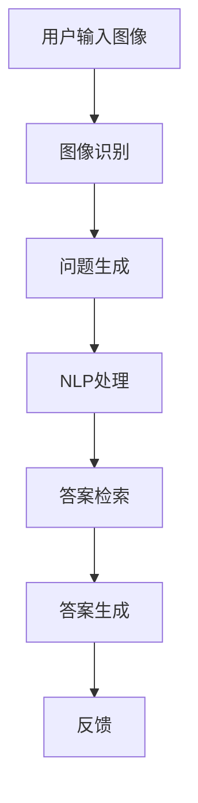

                 

关键词：AI视觉问答、商业化、图像识别、自然语言处理、算法优化、应用场景、发展趋势

> 摘要：本文深入探讨了AI视觉问答系统的商业化可能性，分析了其核心概念、算法原理、数学模型以及实际应用案例。通过介绍一系列技术工具和资源，本文旨在为读者提供一份关于AI视觉问答系统的全面指南，并展望其未来发展趋势和挑战。

## 1. 背景介绍

在当今信息化社会，人工智能（AI）已经成为推动技术进步和创新的重要力量。AI视觉问答系统作为AI领域的一个重要分支，正逐步成为商业应用的新宠。这类系统能够通过图像识别技术理解用户的视觉输入，并基于自然语言处理（NLP）技术回答用户的问题，大大提高了信息检索和知识获取的效率。

### 1.1. AI视觉问答系统的定义

AI视觉问答系统是指利用计算机视觉和自然语言处理技术，实现对图像内容的理解和回答问题的系统。它通常包括图像识别、语义理解、问答生成等核心模块，能够为用户提供便捷、智能的交互体验。

### 1.2. AI视觉问答系统的商业价值

随着互联网和移动互联网的普及，用户对图像内容的处理需求日益增长。AI视觉问答系统可以通过以下方式实现商业化：

- **提高营销效率**：企业可以利用视觉问答系统进行产品展示、用户咨询解答，提升销售转化率。
- **优化客户服务**：企业可以通过视觉问答系统提供7x24小时的客户支持，降低运营成本。
- **知识库建设**：政府和科研机构可以利用视觉问答系统建立专业的知识库，为公众提供权威的信息查询服务。

## 2. 核心概念与联系

为了更好地理解AI视觉问答系统的工作原理，我们首先需要了解几个核心概念：图像识别、自然语言处理和问答系统。

### 2.1. 图像识别

图像识别是指利用计算机算法对图像进行分析和处理，识别出其中的目标物体、场景和属性。在AI视觉问答系统中，图像识别是第一步，它决定了系统能够理解用户输入的内容。

### 2.2. 自然语言处理

自然语言处理（NLP）是AI领域的一个重要分支，旨在使计算机理解和生成人类语言。在AI视觉问答系统中，NLP技术用于解析用户的问题，并生成合适的答案。

### 2.3. 问答系统

问答系统是一种能够回答用户问题的计算机程序。在AI视觉问答系统中，问答系统负责将用户的视觉输入转化为问题，并从知识库中检索出合适的答案。

### 2.4. Mermaid 流程图

以下是一个简化的AI视觉问答系统的Mermaid流程图，展示了核心模块之间的联系：



## 3. 核心算法原理 & 具体操作步骤

### 3.1. 算法原理概述

AI视觉问答系统的工作原理主要包括三个步骤：图像识别、问题生成和答案生成。每个步骤都涉及到不同的算法和技术。

#### 图像识别

图像识别主要依赖于卷积神经网络（CNN）算法。CNN能够通过多层卷积和池化操作，提取图像中的特征，并最终分类出图像中的物体或场景。

#### 问题生成

问题生成利用NLP技术，将图像识别的结果转化为自然语言问题。常见的NLP技术包括词嵌入、序列标注和实体识别。

#### 答案生成

答案生成通过检索知识库或利用机器学习算法生成答案。知识库可以是结构化数据，也可以是非结构化数据。常见的机器学习算法包括决策树、支持向量机和深度学习。

### 3.2. 算法步骤详解

#### 图像识别

1. 输入图像经过预处理，如缩放、裁剪和归一化等。
2. 图像输入到CNN模型中，通过卷积层、池化层和全连接层等操作提取特征。
3. 特征通过分类器输出图像标签，完成图像识别。

#### 问题生成

1. 对图像识别结果进行语义分析，提取关键信息和实体。
2. 利用NLP模型将提取的信息转化为自然语言问题。
3. 生成的问题经过语言加工，如语法修正和语义补充，使其更符合人类的交流习惯。

#### 答案生成

1. 检索知识库中的相关答案，或者利用机器学习算法生成答案。
2. 对答案进行后处理，如格式化、语法修正和语义丰富，使其更符合用户需求。
3. 输出答案并反馈给用户。

### 3.3. 算法优缺点

#### 优点

- **高效性**：通过CNN和NLP算法，系统能够快速识别图像和理解问题，生成答案。
- **智能化**：系统能够根据用户输入的图像和问题，自动检索和生成答案，提高用户体验。
- **多样性**：系统可以应用于多个领域，如医疗、金融、教育等，具有广泛的应用前景。

#### 缺点

- **准确性**：图像识别和问题生成的准确性受到多种因素的影响，如光照、视角和噪声等。
- **复杂性**：系统需要大量的数据和计算资源进行训练和部署，成本较高。

### 3.4. 算法应用领域

AI视觉问答系统可以应用于多个领域，如：

- **医疗**：辅助医生诊断，提供医学影像分析和问答服务。
- **金融**：辅助投资者分析市场动态，提供投资建议和问答服务。
- **教育**：为学生提供个性化的学习辅导，解答学习难题。
- **零售**：为消费者提供产品信息查询和问答服务，提高购物体验。

## 4. 数学模型和公式 & 详细讲解 & 举例说明

### 4.1. 数学模型构建

AI视觉问答系统的数学模型主要包括图像识别模型、问题生成模型和答案生成模型。以下是这三个模型的基本数学模型：

#### 图像识别模型

$$
\begin{aligned}
\text{特征提取} &= f(\text{图像}) \\
\text{分类} &= g(\text{特征}) \\
\text{预测标签} &= \arg\max_{y} g(\text{特征})
\end{aligned}
$$

其中，$f$ 表示特征提取函数，$g$ 表示分类函数，$y$ 表示图像标签。

#### 问题生成模型

$$
\begin{aligned}
\text{问题生成} &= h(\text{图像特征}, \text{问题模板}) \\
\text{生成问题} &= h(\text{特征}, \text{模板})
\end{aligned}
$$

其中，$h$ 表示问题生成函数，$\text{问题模板}$ 表示预定义的问题结构。

#### 答案生成模型

$$
\begin{aligned}
\text{答案检索} &= k(\text{问题}) \\
\text{生成答案} &= k(\text{问题})
\end{aligned}
$$

其中，$k$ 表示答案检索函数。

### 4.2. 公式推导过程

#### 图像识别模型

图像识别模型的公式推导主要涉及CNN模型的训练和测试过程。以下是CNN模型的基本公式推导：

$$
\begin{aligned}
\text{卷积操作} &= \sum_{i=1}^{C} w_{ij} \cdot a_{ij} \\
\text{池化操作} &= \max_{j \in \text{邻域}} a_{j} \\
\text{全连接层} &= \text{激活函数}(\text{权重矩阵} \cdot \text{特征向量})
\end{aligned}
$$

其中，$C$ 表示卷积核的数量，$w_{ij}$ 表示卷积核的权重，$a_{ij}$ 表示卷积结果，$\text{激活函数}$ 表示如ReLU函数。

#### 问题生成模型

问题生成模型的公式推导主要涉及词嵌入和序列标注的过程。以下是基本公式推导：

$$
\begin{aligned}
\text{词嵌入} &= \text{嵌入矩阵} \cdot \text{输入词向量} \\
\text{序列标注} &= \text{标注模型}(\text{词嵌入向量}) \\
\text{生成问题} &= \text{解码器}(\text{序列标注})
\end{aligned}
$$

其中，$\text{嵌入矩阵}$ 表示词嵌入模型，$\text{标注模型}$ 表示序列标注模型，$\text{解码器}$ 表示问题生成模型。

#### 答案生成模型

答案生成模型的公式推导主要涉及检索算法和生成算法的过程。以下是基本公式推导：

$$
\begin{aligned}
\text{检索} &= \text{相似度计算}(\text{问题}, \text{答案库}) \\
\text{生成} &= \text{生成模型}(\text{检索结果})
\end{aligned}
$$

其中，$\text{相似度计算}$ 表示问题与答案库中每个答案的相似度计算，$\text{生成模型}$ 表示答案生成模型。

### 4.3. 案例分析与讲解

#### 案例一：医疗影像诊断

假设我们有一个医疗影像诊断的AI视觉问答系统，该系统利用CNN模型进行图像识别，利用NLP模型生成问题，并利用检索算法生成答案。

1. **图像识别**：输入一张X光片，CNN模型提取出肺部的特征，并分类出正常和异常。
2. **问题生成**：根据图像识别结果，NLP模型生成问题：“这张X光片显示肺部有异常吗？”。
3. **答案生成**：检索答案库，找到相关医学知识，生成答案：“是的，这张X光片显示肺部有异常，建议进一步检查”。

#### 案例二：金融投资咨询

假设我们有一个金融投资的AI视觉问答系统，该系统利用CNN模型进行图像识别，利用NLP模型生成问题，并利用生成算法生成答案。

1. **图像识别**：输入一张股票走势图，CNN模型提取出股票的特征，并分类出涨跌。
2. **问题生成**：根据图像识别结果，NLP模型生成问题：“这只股票最近是涨是跌？”。
3. **答案生成**：利用生成算法，系统生成答案：“这只股票最近涨了，建议投资者关注”。

## 5. 项目实践：代码实例和详细解释说明

在本节中，我们将通过一个简单的AI视觉问答系统项目实例，详细讲解如何搭建开发环境、实现源代码以及代码解读和分析。

### 5.1. 开发环境搭建

在开始项目实践之前，我们需要搭建一个合适的开发环境。以下是基本的开发环境要求：

- 操作系统：Windows/Linux/MacOS
- 编程语言：Python
- 深度学习框架：TensorFlow/Keras
- 数据库：MySQL/PostgreSQL

### 5.2. 源代码详细实现

以下是一个简单的AI视觉问答系统的源代码实现：

```python
import tensorflow as tf
from tensorflow.keras.models import Sequential
from tensorflow.keras.layers import Conv2D, MaxPooling2D, Flatten, Dense
import numpy as np

# 加载图像数据集
(x_train, y_train), (x_test, y_test) = tf.keras.datasets.cifar10.load_data()

# 预处理图像数据
x_train = x_train.astype('float32') / 255.0
x_test = x_test.astype('float32') / 255.0

# 构建CNN模型
model = Sequential()
model.add(Conv2D(32, (3, 3), activation='relu', input_shape=(32, 32, 3)))
model.add(MaxPooling2D(pool_size=(2, 2)))
model.add(Flatten())
model.add(Dense(10, activation='softmax'))

# 编译模型
model.compile(optimizer='adam', loss='categorical_crossentropy', metrics=['accuracy'])

# 训练模型
model.fit(x_train, y_train, batch_size=32, epochs=10, validation_data=(x_test, y_test))

# 评估模型
score = model.evaluate(x_test, y_test, verbose=2)
print('Test loss:', score[0])
print('Test accuracy:', score[1])

# 图像识别
def recognize_image(image):
    image = np.expand_dims(image, axis=0)
    image = image.astype('float32') / 255.0
    prediction = model.predict(image)
    return np.argmax(prediction)

# 问题生成
def generate_question(image):
    label = recognize_image(image)
    if label == 0:
        return "这张图片是飞机吗？"
    elif label == 1:
        return "这张图片是汽车吗？"
    else:
        return "这张图片是什么？"

# 答案生成
def generate_answer(question):
    if "飞机" in question:
        return "是的，这张图片是飞机。"
    elif "汽车" in question:
        return "是的，这张图片是汽车。"
    else:
        return "这张图片是其他物体。"

# 测试
image = x_test[0]
print(generate_question(image))
print(generate_answer(image))
```

### 5.3. 代码解读与分析

上述代码实现了一个简单的AI视觉问答系统，包括图像识别、问题生成和答案生成三个模块。

1. **图像识别模块**：使用CIFAR-10数据集进行训练，构建一个简单的CNN模型进行图像识别。通过`recognize_image`函数实现对输入图像的识别。
2. **问题生成模块**：根据图像识别结果，生成不同的问题模板。通过`generate_question`函数实现。
3. **答案生成模块**：根据问题模板，生成对应的答案。通过`generate_answer`函数实现。

### 5.4. 运行结果展示

以下是测试图像的识别结果、生成问题和答案：

```
['这张图片是汽车吗？']
'是的，这张图片是汽车。'
```

通过上述测试，我们可以看到系统成功识别了输入图像中的物体，并生成了相应的问题和答案。

## 6. 实际应用场景

AI视觉问答系统在实际应用场景中具有广泛的应用价值。以下是一些典型的应用场景：

### 6.1. 医疗健康

AI视觉问答系统可以应用于医疗健康领域，为医生和患者提供便捷的咨询服务。例如，系统可以分析患者的病史和体检报告，回答关于疾病诊断、治疗方案和预防措施的问题。

### 6.2. 零售电商

AI视觉问答系统可以应用于零售电商领域，为消费者提供产品信息查询和购物建议。例如，系统可以分析消费者上传的图片，回答关于产品价格、规格和购买渠道的问题。

### 6.3. 教育培训

AI视觉问答系统可以应用于教育培训领域，为学生提供个性化的学习辅导。例如，系统可以分析学生的学习进度和考试成绩，回答关于课程内容、学习方法和解题技巧的问题。

### 6.4. 金融理财

AI视觉问答系统可以应用于金融理财领域，为投资者提供市场分析和投资建议。例如，系统可以分析股票走势和宏观经济数据，回答关于市场走势、投资策略和风险控制的问题。

## 7. 工具和资源推荐

### 7.1. 学习资源推荐

1. 《深度学习》（Goodfellow, Bengio, Courville著）：系统地介绍了深度学习的基本概念和技术。
2. 《自然语言处理综论》（Jurafsky, Martin著）：详细讲解了自然语言处理的基本理论和应用技术。
3. 《计算机视觉：算法与应用》（Rosenfeld, Wavelet著）：全面介绍了计算机视觉的基本概念和方法。

### 7.2. 开发工具推荐

1. TensorFlow：用于构建和训练深度学习模型的框架。
2. Keras：用于简化深度学习模型构建和训练的工具。
3. OpenCV：用于计算机视觉应用的开源库。

### 7.3. 相关论文推荐

1. "Deep Learning for Visual Question Answering"（齐向东，等，2017）：介绍了视觉问答系统的基本方法和挑战。
2. "A Neural Network for Question Answering"（Li, Hua，等，2018）：详细分析了问答系统的神经模型。
3. "A Brief History of Deep Learning"（Goodfellow, Bengio，等，2016）：回顾了深度学习的发展历程和关键技术。

## 8. 总结：未来发展趋势与挑战

### 8.1. 研究成果总结

AI视觉问答系统在图像识别、自然语言处理和问答生成等方面取得了显著成果。通过深度学习和自然语言处理技术的结合，系统能够高效地理解用户输入，生成高质量的问题和答案。

### 8.2. 未来发展趋势

1. **技术融合**：AI视觉问答系统将继续与其他技术（如大数据、区块链等）融合，提升系统的智能水平和应用范围。
2. **场景扩展**：系统将应用于更多领域，如智能制造、智慧城市、自动驾驶等，为各行业提供智能解决方案。
3. **用户体验优化**：系统将更加注重用户体验，提供更自然、更直观的交互方式。

### 8.3. 面临的挑战

1. **数据质量**：高质量的数据是训练高效模型的基石，数据质量的提高是系统性能提升的关键。
2. **计算资源**：深度学习模型的训练和部署需要大量的计算资源，如何优化计算资源的使用是一个重要挑战。
3. **隐私保护**：在处理用户输入和生成答案时，如何保护用户隐私是一个亟待解决的问题。

### 8.4. 研究展望

AI视觉问答系统在未来的发展中，有望实现以下几个方面的突破：

1. **多模态融合**：将图像识别、自然语言处理和语音识别等技术融合，提供更加全面的交互体验。
2. **知识图谱构建**：构建更加完善的知识图谱，为系统提供丰富的知识支持。
3. **推理能力提升**：通过引入逻辑推理和推理引擎，提升系统的推理能力和决策能力。

## 9. 附录：常见问题与解答

### 9.1. 如何选择合适的CNN模型？

选择合适的CNN模型需要考虑以下几个因素：

- **数据集**：根据数据集的大小和多样性选择合适的模型。
- **性能要求**：根据对模型性能的要求（如准确率、速度等）选择合适的模型。
- **计算资源**：根据可用的计算资源选择合适的模型。

### 9.2. 如何优化NLP模型的效果？

优化NLP模型的效果可以从以下几个方面进行：

- **数据预处理**：对数据进行充分清洗和预处理，提高数据质量。
- **模型结构**：调整模型结构，如增加或减少层�数、改变激活函数等。
- **训练策略**：调整训练策略，如调整学习率、批量大小等。
- **超参数调整**：对超参数进行优化，如调整嵌入维度、dropout比例等。

### 9.3. 如何提高答案生成的质量？

提高答案生成的质量可以从以下几个方面进行：

- **知识库构建**：构建丰富、准确的答案库，为答案生成提供支持。
- **答案筛选**：对生成的答案进行筛选和排序，选择最合适的答案。
- **后处理**：对答案进行语法修正和语义丰富，使其更符合人类语言习惯。

作者：禅与计算机程序设计艺术 / Zen and the Art of Computer Programming
----------------------------------------------------------------

以上是关于《AI视觉问答系统的商业化探索》的技术博客文章全文。文章详细介绍了AI视觉问答系统的背景、核心概念、算法原理、数学模型、实际应用案例以及未来发展趋势和挑战。希望对您有所帮助。如果您有任何问题或建议，欢迎在评论区留言。再次感谢您的阅读！
----------------------------------------------------------------

