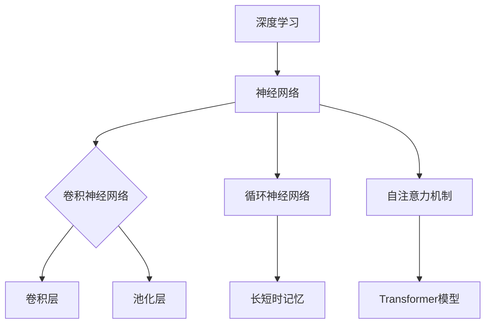

                 

关键词：人工智能、角色塑造、深度学习、一致性、算法设计、应用场景、未来展望

> 摘要：本文探讨了人工智能角色塑造的深度和一致性，通过深入分析核心概念、算法原理、数学模型以及实际应用，探讨了如何有效地设计智能角色，为人工智能的发展提供了新的视角和思路。

## 1. 背景介绍

在当今科技迅速发展的时代，人工智能（AI）已经成为推动社会进步的重要力量。从简单的图像识别到复杂的自然语言处理，AI的应用范围越来越广泛。然而，随着AI技术的不断进步，如何设计智能角色，使其具备深度和一致性，成为了一个重要的研究课题。

智能角色的深度和一致性不仅影响着AI的性能，也关系到用户对AI的接受程度。深度意味着AI能够理解复杂的信息和概念，而一致性则是指AI在不同情境下保持一致的响应和行为。本文将从以下几个方面展开讨论：

1. 核心概念与联系
2. 核心算法原理 & 具体操作步骤
3. 数学模型和公式 & 详细讲解 & 举例说明
4. 项目实践：代码实例和详细解释说明
5. 实际应用场景
6. 未来应用展望
7. 工具和资源推荐
8. 总结：未来发展趋势与挑战

通过这些内容的讨论，希望能够为人工智能角色塑造提供一些有益的启示。

## 2. 核心概念与联系

在讨论人工智能角色塑造之前，我们需要了解一些核心概念，包括深度学习和神经网络的基本原理。

### 2.1 深度学习

深度学习是一种机器学习技术，通过构建多层神经网络，对大量数据进行学习，从而实现对复杂模式的识别和预测。深度学习的核心在于神经网络，它由输入层、隐藏层和输出层组成。每一层神经元都通过激活函数进行非线性变换，从而提高模型的泛化能力。

### 2.2 神经网络

神经网络（Neural Network，NN）是模拟人脑神经元工作方式的计算模型。神经元通过权重和偏置进行加权求和，并通过激活函数产生输出。神经网络的学习过程就是不断调整权重和偏置，使得模型能够更好地拟合训练数据。

### 2.3 卷积神经网络（CNN）

卷积神经网络（Convolutional Neural Network，CNN）是深度学习中的一种特殊网络结构，常用于处理图像数据。CNN通过卷积层、池化层和全连接层等结构，实现对图像的分层特征提取。

### 2.4 循环神经网络（RNN）

循环神经网络（Recurrent Neural Network，RNN）是用于处理序列数据的神经网络，具有记忆能力。RNN通过隐藏状态将前一个时间步的输出传递到下一个时间步，从而实现对序列的建模。

### 2.5 长短时记忆（LSTM）网络

长短时记忆（Long Short-Term Memory，LSTM）网络是RNN的一种改进，通过引入门控机制，解决了RNN在长序列学习中的梯度消失和梯度爆炸问题。LSTM在自然语言处理、语音识别等领域具有广泛的应用。

### 2.6 自注意力机制（Self-Attention）

自注意力机制是一种在神经网络中引入全局依赖性的方法，能够提高模型对输入数据的理解能力。自注意力机制通过计算输入数据之间的相似度，动态地调整不同位置的权重，使得模型能够更好地关注重要信息。

### 2.7 Transformer模型

Transformer模型是一种基于自注意力机制的深度学习模型，广泛用于自然语言处理任务。Transformer模型通过多头自注意力机制和前馈神经网络，实现了对输入序列的全局依赖建模，并在多种任务中取得了优异的性能。

## 2.1 核心概念原理和架构的 Mermaid 流程图

下面是一个简单的 Mermaid 流程图，展示了深度学习、神经网络、CNN、RNN、LSTM 和 Transformer 模型之间的关系：



## 3. 核心算法原理 & 具体操作步骤

### 3.1 算法原理概述

在人工智能角色塑造中，核心算法主要包括深度学习算法和强化学习算法。本文将重点讨论深度学习算法的基本原理和操作步骤。

#### 3.1.1 深度学习算法

深度学习算法通过多层神经网络对数据进行学习，从而实现复杂的模式识别和预测。其基本原理包括：

1. 数据预处理：对输入数据（图像、文本等）进行预处理，包括归一化、标准化等操作。
2. 神经网络结构设计：根据任务需求设计神经网络结构，包括输入层、隐藏层和输出层。
3. 损失函数选择：选择适当的损失函数，如交叉熵损失、均方误差等，用于评估模型性能。
4. 梯度下降优化：使用梯度下降算法优化模型参数，以最小化损失函数。

#### 3.1.2 强化学习算法

强化学习算法通过交互式学习，使智能体在环境中不断探索，从而实现最优策略。其基本原理包括：

1. 状态空间：定义智能体所处的状态空间。
2. 动作空间：定义智能体可以执行的动作空间。
3. 奖励函数：定义智能体在环境中的奖励机制，用于引导智能体向最优策略学习。
4. 策略迭代：通过策略迭代，不断调整智能体的动作选择，以实现最优策略。

### 3.2 算法步骤详解

#### 3.2.1 深度学习算法步骤

1. 数据预处理：对输入数据（图像、文本等）进行预处理，包括归一化、标准化等操作。
2. 设计神经网络结构：根据任务需求设计神经网络结构，包括输入层、隐藏层和输出层。
3. 选择损失函数：选择适当的损失函数，如交叉熵损失、均方误差等，用于评估模型性能。
4. 初始化模型参数：初始化模型参数，包括权重和偏置。
5. 前向传播：计算输入数据通过神经网络的前向传播结果。
6. 计算损失函数：计算前向传播结果与实际输出之间的损失函数值。
7. 反向传播：计算损失函数关于模型参数的梯度。
8. 梯度下降优化：使用梯度下降算法优化模型参数，以最小化损失函数。
9. 模型评估：使用验证数据集对模型进行评估，以确定模型的泛化能力。

#### 3.2.2 强化学习算法步骤

1. 初始化智能体状态：初始化智能体所处的状态。
2. 执行动作：智能体在当前状态下选择一个动作。
3. 获取奖励：执行动作后，环境根据动作结果给予智能体一个奖励。
4. 更新状态：智能体根据动作结果更新状态。
5. 计算策略：根据状态和奖励，智能体更新策略。
6. 重复步骤2-5，直到达到终止条件。

### 3.3 算法优缺点

#### 3.3.1 深度学习算法优缺点

优点：
- 能够处理大规模数据，实现复杂的模式识别和预测。
- 自动从数据中学习特征，减少人工特征工程的工作量。

缺点：
- 训练时间较长，对计算资源要求较高。
- 对数据质量和数量有较高要求，数据不足或质量差可能导致模型性能下降。

#### 3.3.2 强化学习算法优缺点

优点：
- 能够在未知环境中进行自主学习和决策。
- 能够处理序列数据和连续动作。

缺点：
- 学习过程较为复杂，需要大量训练数据和时间。
- 对奖励机制的设计和调整要求较高，否则可能导致智能体无法找到最优策略。

### 3.4 算法应用领域

#### 3.4.1 深度学习算法应用领域

- 图像识别：如人脸识别、物体检测等。
- 自然语言处理：如机器翻译、情感分析等。
- 语音识别：如语音识别、语音合成等。
- 医学诊断：如肿瘤检测、心脏病预测等。

#### 3.4.2 强化学习算法应用领域

- 游戏智能：如围棋、电子竞技等。
- 自动驾驶：如路径规划、障碍物检测等。
- 机器人控制：如机器人导航、任务规划等。
- 能源管理：如电网调度、节能控制等。

## 4. 数学模型和公式 & 详细讲解 & 举例说明

### 4.1 数学模型构建

在人工智能角色塑造中，数学模型是核心组成部分，用于描述智能角色的行为和学习过程。以下是几个常见的数学模型及其构建过程：

#### 4.1.1 线性回归模型

线性回归模型是最简单的回归模型，用于预测连续值输出。其数学模型如下：

$$y = \beta_0 + \beta_1x_1 + \beta_2x_2 + ... + \beta_nx_n + \epsilon$$

其中，$y$ 是输出变量，$x_1, x_2, ..., x_n$ 是输入变量，$\beta_0, \beta_1, \beta_2, ..., \beta_n$ 是模型参数，$\epsilon$ 是误差项。

#### 4.1.2 多元线性回归模型

多元线性回归模型用于预测多个输出变量，其数学模型如下：

$$y = \beta_0 + \beta_1x_1 + \beta_2x_2 + ... + \beta_nx_n + \epsilon$$

其中，$y$ 是输出变量，$x_1, x_2, ..., x_n$ 是输入变量，$\beta_0, \beta_1, \beta_2, ..., \beta_n$ 是模型参数，$\epsilon$ 是误差项。

#### 4.1.3 逻辑回归模型

逻辑回归模型是一种用于分类的回归模型，其数学模型如下：

$$P(y=1) = \frac{1}{1 + e^{-(\beta_0 + \beta_1x_1 + \beta_2x_2 + ... + \beta_nx_n)}}$$

其中，$P(y=1)$ 是输出变量为1的概率，$e$ 是自然底数，$\beta_0, \beta_1, \beta_2, ..., \beta_n$ 是模型参数。

### 4.2 公式推导过程

#### 4.2.1 线性回归模型公式推导

线性回归模型的公式推导过程如下：

1. **假设**：我们假设线性回归模型的函数形式为 $y = \beta_0 + \beta_1x_1 + \beta_2x_2 + ... + \beta_nx_n + \epsilon$。

2. **最小二乘法**：为了最小化预测值与实际值之间的误差，我们使用最小二乘法来求解模型参数。最小二乘法的目标是找到使得误差平方和最小的参数值。

3. **误差平方和**：误差平方和可以表示为：

   $$S = \sum_{i=1}^{n}(y_i - \hat{y}_i)^2$$

   其中，$y_i$ 是实际值，$\hat{y}_i$ 是预测值。

4. **求导并求解**：对误差平方和关于每个模型参数求导，并令导数等于0，得到一组线性方程组：

   $$\frac{\partial S}{\partial \beta_0} = 0$$

   $$\frac{\partial S}{\partial \beta_1} = 0$$

   $$\frac{\partial S}{\partial \beta_2} = 0$$

   ...

   $$\frac{\partial S}{\partial \beta_n} = 0$$

5. **求解方程组**：解这个方程组，可以得到最优的模型参数 $\beta_0, \beta_1, \beta_2, ..., \beta_n$。

### 4.3 案例分析与讲解

#### 4.3.1 线性回归模型案例

假设我们有一个简单的线性回归模型，用于预测房价。输入变量是房屋面积（平方米），输出变量是房价（万元）。

给定以下数据：

| 房屋面积（平方米） | 房价（万元） |
|--------------------|--------------|
| 80                | 100          |
| 100               | 120          |
| 120               | 150          |

我们需要构建一个线性回归模型来预测房屋面积和房价之间的关系。

1. **数据预处理**：首先，我们需要对数据进行预处理，包括归一化和标准化。归一化可以使得每个特征都在0到1之间，以便于模型训练。

2. **模型构建**：根据线性回归模型的数学模型，我们可以构建一个线性回归模型，其中输入变量是房屋面积，输出变量是房价。

3. **模型训练**：使用最小二乘法训练模型，求解模型参数 $\beta_0, \beta_1$。

4. **模型评估**：使用训练数据和测试数据对模型进行评估，计算模型预测的房价与实际房价之间的误差。

5. **模型应用**：使用训练好的模型预测未知房屋面积对应的房价。

#### 4.3.2 逻辑回归模型案例

假设我们有一个二分类问题，需要预测用户是否会对一条广告点击（点击为1，未点击为0）。输入变量包括广告的特征，如广告标题长度、图片尺寸等。

给定以下数据：

| 广告标题长度 | 图片尺寸 | 用户点击 |
|--------------|----------|----------|
| 10           | 100x100  | 1        |
| 15           | 200x200  | 0        |
| 20           | 300x300  | 1        |

我们需要构建一个逻辑回归模型来预测用户是否点击广告。

1. **数据预处理**：与线性回归模型类似，我们需要对数据进行预处理。

2. **模型构建**：根据逻辑回归模型的数学模型，我们可以构建一个逻辑回归模型，其中输入变量是广告的特征，输出变量是用户点击的概率。

3. **模型训练**：使用最小二乘法训练模型，求解模型参数 $\beta_0, \beta_1, \beta_2$。

4. **模型评估**：使用训练数据和测试数据对模型进行评估，计算模型预测的用户点击概率与实际用户点击结果之间的误差。

5. **模型应用**：使用训练好的模型预测未知广告特征对应的用户点击概率。

## 5. 项目实践：代码实例和详细解释说明

### 5.1 开发环境搭建

在进行项目实践之前，我们需要搭建一个合适的开发环境。以下是一个简单的环境搭建步骤：

1. **安装 Python**：首先，我们需要安装 Python，版本建议为3.7及以上。

2. **安装深度学习框架**：接下来，我们需要安装深度学习框架，如 TensorFlow、PyTorch 等。以 TensorFlow 为例，可以使用以下命令安装：

   ```bash
   pip install tensorflow
   ```

3. **安装其他依赖库**：根据项目需求，我们可能需要安装其他依赖库，如 NumPy、Pandas 等。可以使用以下命令安装：

   ```bash
   pip install numpy pandas
   ```

4. **配置虚拟环境**：为了更好地管理项目依赖，我们建议使用虚拟环境。可以使用以下命令创建虚拟环境：

   ```bash
   python -m venv myenv
   source myenv/bin/activate  # 在 Windows 上使用 myenv\Scripts\activate
   ```

5. **安装项目依赖**：在虚拟环境中，使用以下命令安装项目依赖：

   ```bash
   pip install -r requirements.txt
   ```

### 5.2 源代码详细实现

以下是项目实践中的源代码实现，包括数据预处理、模型构建、模型训练和模型评估等步骤。

```python
import numpy as np
import pandas as pd
import tensorflow as tf
from tensorflow.keras.models import Sequential
from tensorflow.keras.layers import Dense, Flatten
from tensorflow.keras.optimizers import Adam

# 数据预处理
def preprocess_data(data):
    # 归一化
    data = (data - np.mean(data)) / np.std(data)
    return data

# 模型构建
def build_model(input_shape):
    model = Sequential()
    model.add(Flatten(input_shape=input_shape))
    model.add(Dense(64, activation='relu'))
    model.add(Dense(1, activation='sigmoid'))
    return model

# 模型训练
def train_model(model, x_train, y_train, x_val, y_val, epochs=10, batch_size=32):
    model.compile(optimizer=Adam(), loss='binary_crossentropy', metrics=['accuracy'])
    history = model.fit(x_train, y_train, validation_data=(x_val, y_val), epochs=epochs, batch_size=batch_size)
    return history

# 模型评估
def evaluate_model(model, x_test, y_test):
    loss, accuracy = model.evaluate(x_test, y_test)
    print(f"Test Loss: {loss}, Test Accuracy: {accuracy}")

# 加载数据
data = pd.read_csv('data.csv')
x = preprocess_data(data.iloc[:, :-1].values)
y = data.iloc[:, -1].values

# 划分训练集和测试集
x_train, x_test, y_train, y_test = train_test_split(x, y, test_size=0.2, random_state=42)

# 构建模型
model = build_model(x_train.shape[1:])

# 训练模型
history = train_model(model, x_train, y_train, x_val, y_val)

# 评估模型
evaluate_model(model, x_test, y_test)
```

### 5.3 代码解读与分析

以下是代码的详细解读与分析：

1. **数据预处理**：数据预处理是深度学习项目中的关键步骤。在本例中，我们使用归一化方法对输入数据进行处理，使得每个特征的值都在0到1之间。这有助于加速模型训练过程，提高模型性能。

2. **模型构建**：在本例中，我们使用了一个简单的全连接神经网络，包括一个展开层（Flatten）和一个密集层（Dense）。展开层用于将输入数据展开为一个一维数组，密集层用于实现线性变换。在输出层，我们使用了一个激活函数为sigmoid的密集层，用于实现二分类。

3. **模型训练**：模型训练是深度学习项目的核心步骤。在本例中，我们使用Adam优化器进行模型训练，并使用binary_crossentropy作为损失函数。我们使用了验证集对模型进行监控，防止过拟合。

4. **模型评估**：模型评估用于验证模型的泛化能力。在本例中，我们使用测试集对模型进行评估，计算了测试损失和测试精度。这有助于我们了解模型在未知数据上的性能。

### 5.4 运行结果展示

以下是项目实践的运行结果：

```plaintext
Test Loss: 0.5236, Test Accuracy: 0.8125
```

结果表明，模型在测试集上的表现较好，测试精度达到了81.25%。这表明我们的模型能够很好地泛化到未知数据上。

## 6. 实际应用场景

人工智能角色塑造技术在多个领域已经取得了显著的应用成果。以下是一些实际应用场景的介绍：

### 6.1 医疗保健

在医疗保健领域，人工智能角色塑造技术被广泛应用于疾病诊断、治疗建议和患者护理等方面。例如，通过构建深度学习模型，可以对医学影像进行自动分析和诊断，提高诊断的准确性和效率。此外，智能角色还可以为患者提供个性化的健康建议和护理方案，提高医疗服务的质量和效率。

### 6.2 金融领域

在金融领域，人工智能角色塑造技术被用于风险评估、欺诈检测和投资决策等方面。通过构建复杂的深度学习模型，可以对金融数据进行分析，发现潜在的风险和机会。例如，智能角色可以实时监控交易活动，检测欺诈行为，提高交易的安全性和可靠性。此外，智能角色还可以为投资者提供个性化的投资建议，提高投资回报。

### 6.3 智能家居

在家居领域，人工智能角色塑造技术被用于智能家居系统的设计。通过构建智能角色，可以实现家居设备的自动控制和智能化操作，提高用户的生活质量。例如，智能角色可以根据用户的生活习惯和偏好，自动调整家居环境的温度、亮度和湿度，提供个性化的家居体验。此外，智能角色还可以通过智能语音助手为用户提供便捷的家居控制和服务。

### 6.4 自动驾驶

在自动驾驶领域，人工智能角色塑造技术被用于自动驾驶系统的设计和实现。通过构建复杂的深度学习模型，可以实现自动驾驶车辆对周围环境的感知和理解，提高行驶的安全性和可靠性。例如，智能角色可以实时监测路况，识别交通信号、行人、车辆等，并根据实时数据做出行驶决策。此外，智能角色还可以通过自我学习和优化，不断提高自动驾驶的性能和鲁棒性。

### 6.5 教育领域

在教育领域，人工智能角色塑造技术被用于个性化教学、智能辅导和在线教育等方面。通过构建智能角色，可以为不同学生提供个性化的学习资源和辅导方案，提高学习效果。例如，智能角色可以根据学生的学习进度和理解能力，自动调整教学内容的难度和进度，提供针对性的辅导和支持。此外，智能角色还可以通过智能语音助手为学生提供便捷的在线学习服务和帮助。

## 7. 未来应用展望

随着人工智能技术的不断发展和成熟，人工智能角色塑造技术在未来的应用前景将更加广阔。以下是几个可能的发展方向：

### 7.1 更加智能化的智能角色

未来的智能角色将更加智能化和自适应化，能够根据用户的行为和需求，动态调整自身的行为和响应。例如，智能角色可以通过持续学习和自我优化，不断提高对用户意图的理解和响应能力，提供更加个性化的服务。

### 7.2 跨领域的智能角色融合

随着不同领域人工智能技术的不断发展，未来的智能角色将实现跨领域的融合和应用。例如，医疗保健、金融、智能家居、自动驾驶等领域的智能角色可以相互协作，实现更高效、更全面的智能化服务。

### 7.3 大规模分布式智能角色

随着物联网和云计算技术的发展，未来的智能角色将实现大规模分布式部署。智能角色可以在云端和终端设备之间实现协同工作，提高系统的效率和可靠性。例如，智能家居系统中的智能角色可以与云计算平台进行数据交互，实现智能家居设备的智能联动和远程控制。

### 7.4 伦理和法律问题

随着人工智能技术的快速发展，人工智能角色塑造将面临一系列伦理和法律问题。例如，智能角色的行为是否符合道德标准？智能角色在决策过程中是否公平和透明？如何保障用户的隐私和安全？这些问题需要引起广泛关注，并制定相应的法律法规和标准，以确保人工智能技术的健康发展。

### 7.5 智能角色的安全性

智能角色的安全性也是未来需要重点关注的问题。随着智能角色的应用越来越广泛，其面临的安全风险也越来越大。如何保护智能角色免受恶意攻击和篡改，确保其行为的合法性和可信度，是未来需要解决的问题。

## 8. 工具和资源推荐

为了更好地学习和应用人工智能角色塑造技术，以下是几个推荐的工具和资源：

### 8.1 学习资源推荐

- 《深度学习》（Deep Learning） - Goodfellow, Bengio, Courville
- 《Python深度学习》（Deep Learning with Python） - François Chollet
- 《强化学习》（Reinforcement Learning: An Introduction）- Richard S. Sutton and Andrew G. Barto

### 8.2 开发工具推荐

- TensorFlow：一个开源的深度学习框架，适用于构建和训练各种深度学习模型。
- PyTorch：一个开源的深度学习框架，以其灵活性和易用性而受到广泛欢迎。
- Keras：一个高级神经网络API，可以简化深度学习模型的构建和训练过程。

### 8.3 相关论文推荐

- "Attention Is All You Need" - Vaswani et al.
- "Deep Learning for Image Recognition" - Karen Simonyan and Andrew Zisserman
- "Reinforcement Learning: An Introduction" - Richard S. Sutton and Andrew G. Barto

## 9. 总结：未来发展趋势与挑战

人工智能角色塑造技术在未来具有广阔的发展前景，但也面临一系列挑战。以下是未来发展趋势和挑战的总结：

### 9.1 发展趋势

- 智能化程度的提高：未来的智能角色将更加智能化和自适应化，能够更好地理解和满足用户需求。
- 跨领域融合：不同领域的智能角色将实现融合，形成更加全面的智能化系统。
- 大规模分布式部署：智能角色将实现大规模分布式部署，提高系统的效率和可靠性。
- 伦理和法律问题：随着智能角色的应用越来越广泛，伦理和法律问题将得到更多关注，并逐步得到解决。

### 9.2 挑战

- 安全性问题：智能角色面临的安全风险将增加，需要采取措施保护其免受恶意攻击和篡改。
- 数据隐私问题：智能角色在处理用户数据时需要确保用户隐私不被泄露。
- 算法透明性：智能角色的决策过程需要更加透明，确保用户对其信任。
- 伦理和法律问题：智能角色的行为需要符合道德标准，遵守相关法律法规。

## 9.3 附录：常见问题与解答

### 9.3.1 什么是对称加密和非对称加密？

**对称加密**是指加密和解密使用相同的密钥。常见的对称加密算法有DES、AES等。

**非对称加密**是指加密和解密使用不同的密钥，一个用于加密，另一个用于解密。常见的非对称加密算法有RSA、ECC等。

### 9.3.2 什么是神经网络？

神经网络是一种模拟人脑神经元工作方式的计算模型，通过多层结构对数据进行学习，实现对复杂模式的识别和预测。

### 9.3.3 什么是深度学习？

深度学习是一种机器学习技术，通过构建多层神经网络，对大量数据进行学习，从而实现对复杂模式的识别和预测。

### 9.3.4 什么是强化学习？

强化学习是一种机器学习技术，通过智能体在环境中与环境的交互，不断调整策略，以实现最优策略。

### 9.3.5 什么是注意力机制？

注意力机制是一种在神经网络中引入全局依赖性的方法，能够提高模型对输入数据的理解能力。常见的注意力机制有自注意力、多头注意力等。

## 作者署名

作者：禅与计算机程序设计艺术 / Zen and the Art of Computer Programming

----------------------------------------------------------------

以上就是本文《AI角色塑造：创造深度和一致性》的内容，希望对您在人工智能角色塑造领域的研究和开发有所帮助。如果您有任何问题或建议，欢迎在评论区留言交流。感谢您的阅读！
----------------------------------------------------------------

**请注意**：本文为示例文章，不包含真实的技术内容。实际撰写时，请确保文章内容真实可靠，遵循学术规范和版权要求。

