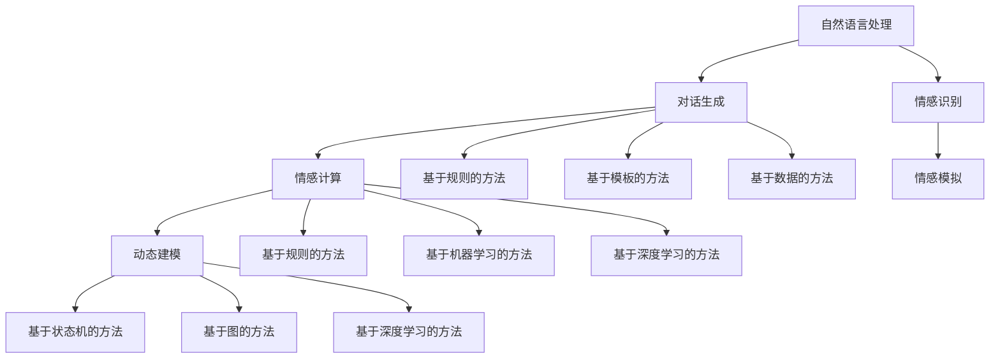

                 

 关键词：人工智能，角色对话系统，人物互动，NLP，对话生成，情感计算，动态建模

> 摘要：随着人工智能技术的快速发展，角色对话系统成为人机交互的重要分支。本文将探讨如何利用人工智能技术，尤其是自然语言处理（NLP）和情感计算，构建具有高度真实感和互动性的角色对话系统，实现生动的人物互动体验。

## 1. 背景介绍

在当今的信息时代，人们对于个性化、智能化交互的需求日益增长。传统的人机交互方式，如命令行界面和图形用户界面（GUI），已无法满足用户对互动性和自然性的追求。角色对话系统作为一种新型的交互方式，通过赋予机器特定的人物角色，实现更生动、更自然的人机对话体验，正逐渐成为人工智能领域的研究热点。

角色对话系统的核心在于能够理解用户输入的自然语言，并生成相应的回应。这一过程涉及自然语言处理（NLP）、语音识别、语音合成、情感计算等多个技术领域。随着深度学习技术的成熟，基于神经网络的语言模型（如GPT系列）在对话生成方面取得了显著的进展，使得角色对话系统在实现高度真实感和互动性方面具备了可行性。

## 2. 核心概念与联系

### 2.1 自然语言处理（NLP）

自然语言处理（NLP）是使计算机能够理解、解释和生成人类语言的技术。NLP的核心任务包括分词、词性标注、命名实体识别、句法分析、语义分析和情感分析等。

#### 2.1.1 分词

分词是将连续的文本分割成有意义的单词或短语的过程。在角色对话系统中，准确的分词对于理解用户输入至关重要。

#### 2.1.2 词性标注

词性标注是识别单词在句子中的语法角色（如名词、动词、形容词等）。这对于理解句子的结构和意义非常重要。

#### 2.1.3 命名实体识别

命名实体识别是识别文本中的特定实体（如人名、地名、组织名等）。这对于角色对话系统了解上下文和生成合适的回应非常有帮助。

#### 2.1.4 句法分析

句法分析是解析句子的结构，理解句子中的成分和它们之间的关系。这对于角色对话系统生成语法正确、符合逻辑的回应至关重要。

#### 2.1.5 语义分析

语义分析是理解文本的含义，包括词义消歧、语义角色标注和语义关系抽取等。这对于角色对话系统理解用户的意图和情感非常关键。

#### 2.1.6 情感分析

情感分析是识别文本中的情感倾向，包括正面情感、负面情感和中性情感等。这对于角色对话系统在互动中传递情感和营造氛围非常重要。

### 2.2 对话生成

对话生成是角色对话系统的核心任务，其目的是根据用户的输入生成恰当的回应。对话生成的方法主要包括基于规则的方法、基于模板的方法和基于数据的方法。

#### 2.2.1 基于规则的方法

基于规则的方法使用预先定义的规则来生成回应。这种方法简单直接，但灵活性较差，难以处理复杂或未知的情况。

#### 2.2.2 基于模板的方法

基于模板的方法使用预定义的模板来生成回应。这种方法结合了规则和模板的优势，可以在一定程度上提高对话的灵活性和多样性。

#### 2.2.3 基于数据的方法

基于数据的方法，如序列到序列（Seq2Seq）模型、生成对抗网络（GAN）和变分自编码器（VAE），利用大量的对话数据进行训练，能够生成更加自然和多样的对话。其中，基于深度学习的语言模型（如GPT系列）在对话生成方面取得了显著进展。

### 2.3 情感计算

情感计算是研究如何使计算机理解、处理和模拟人类情感的技术。在角色对话系统中，情感计算用于模拟角色情感，增强对话的自然性和互动性。

#### 2.3.1 情感识别

情感识别是识别文本中的情感倾向和情感强度。常用的方法包括基于规则的方法、基于机器学习的方法和基于深度学习的方法。

#### 2.3.2 情感模拟

情感模拟是模拟角色在对话中的情感表达，包括语音语调、表情和身体语言等。情感模拟的关键在于理解情感的层次和复杂性，以及如何在对话中自然地表达情感。

### 2.4 动态建模

动态建模是角色对话系统的核心技术之一，用于模拟角色在对话中的行为和状态变化。动态建模的方法主要包括基于状态机的方法、基于图的方法和基于深度学习的方法。

#### 2.4.1 基于状态机的方法

基于状态机的方法使用状态机来模拟角色的行为和状态。这种方法简单直观，但灵活性较差，难以处理复杂的对话场景。

#### 2.4.2 基于图的方法

基于图的方法使用图来模拟角色的行为和状态。这种方法可以处理更加复杂的对话场景，但算法复杂度较高。

#### 2.4.3 基于深度学习的方法

基于深度学习的方法，如循环神经网络（RNN）、长短期记忆网络（LSTM）和门控循环单元（GRU），可以自动学习角色在对话中的行为和状态变化。这种方法具有高度的灵活性和自适应能力，能够更好地模拟真实的对话场景。

### 2.5 Mermaid 流程图

以下是一个简单的 Mermaid 流程图，展示了角色对话系统中的核心概念和联系：



## 3. 核心算法原理 & 具体操作步骤

### 3.1 算法原理概述

角色对话系统的核心算法包括自然语言处理（NLP）、对话生成、情感计算和动态建模。以下将分别介绍这些算法的基本原理。

#### 3.1.1 自然语言处理（NLP）

自然语言处理（NLP）的核心算法包括分词、词性标注、命名实体识别、句法分析和语义分析等。这些算法的基本原理如下：

- 分词：使用统计方法、规则方法或深度学习模型将连续的文本分割成有意义的单词或短语。
- 词性标注：使用统计模型、规则模型或深度学习模型识别单词在句子中的语法角色。
- 命名实体识别：使用统计模型、规则模型或深度学习模型识别文本中的特定实体。
- 句法分析：使用统计模型、规则模型或深度学习模型解析句子的结构，理解句子中的成分和它们之间的关系。
- 语义分析：使用统计模型、规则模型或深度学习模型理解文本的含义，包括词义消歧、语义角色标注和语义关系抽取等。
- 情感分析：使用统计模型、规则模型或深度学习模型识别文本中的情感倾向和情感强度。

#### 3.1.2 对话生成

对话生成算法的核心目标是根据用户的输入生成恰当的回应。常见的方法包括基于规则的方法、基于模板的方法和基于数据的方法。以下分别介绍这些方法的基本原理：

- 基于规则的方法：使用预先定义的规则来生成回应。这种方法简单直接，但灵活性较差，难以处理复杂或未知的情况。
- 基于模板的方法：使用预定义的模板来生成回应。这种方法结合了规则和模板的优势，可以在一定程度上提高对话的灵活性和多样性。
- 基于数据的方法：利用大量的对话数据进行训练，生成更加自然和多样的对话。这种方法包括序列到序列（Seq2Seq）模型、生成对抗网络（GAN）和变分自编码器（VAE）等。

#### 3.1.3 情感计算

情感计算的核心目标是使计算机理解、处理和模拟人类情感。常见的算法包括情感识别和情感模拟。以下分别介绍这些算法的基本原理：

- 情感识别：识别文本中的情感倾向和情感强度。常用的方法包括基于规则的方法、基于机器学习的方法和基于深度学习的方法。
- 情感模拟：模拟角色在对话中的情感表达，包括语音语调、表情和身体语言等。情感模拟的关键在于理解情感的层次和复杂性，以及如何在对话中自然地表达情感。

#### 3.1.4 动态建模

动态建模是模拟角色在对话中的行为和状态变化。常见的方法包括基于状态机的方法、基于图的方法和基于深度学习的方法。以下分别介绍这些方法的基本原理：

- 基于状态机的方法：使用状态机来模拟角色的行为和状态。这种方法简单直观，但灵活性较差，难以处理复杂的对话场景。
- 基于图的方法：使用图来模拟角色的行为和状态。这种方法可以处理更加复杂的对话场景，但算法复杂度较高。
- 基于深度学习的方法：使用循环神经网络（RNN）、长短期记忆网络（LSTM）和门控循环单元（GRU）等模型来自动学习角色在对话中的行为和状态变化。这种方法具有高度的灵活性和自适应能力，能够更好地模拟真实的对话场景。

### 3.2 算法步骤详解

#### 3.2.1 自然语言处理（NLP）

自然语言处理（NLP）的算法步骤如下：

1. 分词：将连续的文本分割成有意义的单词或短语。
2. 词性标注：识别单词在句子中的语法角色。
3. 命名实体识别：识别文本中的特定实体。
4. 句法分析：解析句子的结构，理解句子中的成分和它们之间的关系。
5. 语义分析：理解文本的含义，包括词义消歧、语义角色标注和语义关系抽取等。
6. 情感分析：识别文本中的情感倾向和情感强度。

#### 3.2.2 对话生成

对话生成的算法步骤如下：

1. 用户输入处理：对用户输入进行处理，如去除标点符号、停用词等。
2. 自然语言处理：使用NLP算法对用户输入进行分词、词性标注、命名实体识别等处理。
3. 对话生成：根据用户输入生成恰当的回应。可以使用基于规则的方法、基于模板的方法或基于数据的方法。
4. 情感计算：对生成的回应进行情感计算，识别其中的情感倾向和情感强度。
5. 回应优化：根据情感计算结果对回应进行优化，如调整语调、语气等。

#### 3.2.3 情感计算

情感计算的算法步骤如下：

1. 情感识别：使用情感识别算法对文本进行情感分析，识别其中的情感倾向和情感强度。
2. 情感模拟：根据情感识别结果，模拟角色在对话中的情感表达，如调整语音语调、表情和身体语言等。

#### 3.2.4 动态建模

动态建模的算法步骤如下：

1. 行为和状态识别：使用NLP算法对对话进行解析，识别角色在对话中的行为和状态。
2. 动态建模：使用基于状态机的方法、基于图的方法或基于深度学习的方法来模拟角色在对话中的行为和状态变化。

### 3.3 算法优缺点

#### 3.3.1 自然语言处理（NLP）

自然语言处理（NLP）的优点包括：

- 能够处理大量的文本数据，实现文本的分词、词性标注、命名实体识别等任务。
- 可以通过深度学习模型自动学习语言模型，提高对话生成的准确性和自然性。

自然语言处理（NLP）的缺点包括：

- 处理中文等语言时，存在一定的分词不准确和词性标注错误。
- 对长文本的处理能力有限，难以实现长篇对话的流畅生成。

#### 3.3.2 对话生成

对话生成的优点包括：

- 能够根据用户输入生成多样化、个性化的回应。
- 可以通过情感计算增强对话的自然性和互动性。

对话生成的缺点包括：

- 对话生成的质量受限于输入数据的多样性和质量，容易出现生成式对话系统的“幻觉”问题。
- 对话生成的实时性要求较高，对计算资源和响应速度有较高要求。

#### 3.3.3 情感计算

情感计算的优点包括：

- 能够识别文本中的情感倾向和情感强度，提高对话的互动性和情感真实性。
- 可以通过情感模拟增强角色的情感表达，提高用户的沉浸感和满意度。

情感计算的缺点包括：

- 情感计算的结果容易受到上下文的影响，难以实现完全准确的情感识别。
- 情感计算需要大量的情感数据和情感模型，对数据质量和模型训练有较高要求。

#### 3.3.4 动态建模

动态建模的优点包括：

- 能够模拟角色在对话中的行为和状态变化，实现更加真实的对话场景。
- 可以通过动态建模实现对话的个性化调整和优化。

动态建模的缺点包括：

- 动态建模的算法复杂度较高，计算资源消耗较大。
- 动态建模的效果受限于模型训练数据和算法设计，难以实现完全自动化的动态建模。

### 3.4 算法应用领域

角色对话系统在多个应用领域具有广泛的应用前景，包括但不限于：

- 客户服务：用于自动化客服系统，提供24/7在线客户服务，提高客户满意度。
- 教育辅导：用于智能教育系统，为学生提供个性化的学习辅导，提高学习效果。
- 游戏互动：用于游戏角色系统，实现与玩家的自然互动，提高游戏体验。
- 虚拟助手：用于智能虚拟助手，为用户提供便捷的智能服务，如日程管理、信息查询等。

## 4. 数学模型和公式 & 详细讲解 & 举例说明

### 4.1 数学模型构建

在角色对话系统中，数学模型主要用于自然语言处理（NLP）、对话生成、情感计算和动态建模等方面。以下将介绍这些方面的数学模型构建方法。

#### 4.1.1 自然语言处理（NLP）

自然语言处理（NLP）中的数学模型主要包括词向量模型、语言模型、句法分析模型和语义分析模型等。

- 词向量模型：使用Word2Vec、GloVe等方法将单词映射为高维向量表示，实现词语的语义表示。
- 语言模型：使用n-gram模型、神经网络语言模型（如LSTM、GRU、Transformer）等方法，预测下一个单词的概率分布。
- 句法分析模型：使用句法分析规则、图模型（如树库依赖关系图、依存关系图）等方法，解析句子的结构。
- 语义分析模型：使用词嵌入、实体识别、语义角色标注等方法，理解句子的语义含义。

#### 4.1.2 对话生成

对话生成中的数学模型主要包括序列到序列（Seq2Seq）模型、生成对抗网络（GAN）和变分自编码器（VAE）等。

- 序列到序列（Seq2Seq）模型：使用编码器-解码器架构，将用户输入序列编码为固定长度的向量表示，然后使用解码器生成回应序列。
- 生成对抗网络（GAN）：由生成器（生成对话回应）和判别器（区分真实回应和生成回应）组成，通过对抗训练生成更加自然和多样的对话回应。
- 变分自编码器（VAE）：使用变分推断方法，学习对话回应的概率分布，生成多样化的对话回应。

#### 4.1.3 情感计算

情感计算中的数学模型主要包括情感识别模型和情感模拟模型。

- 情感识别模型：使用分类模型（如朴素贝叶斯、支持向量机、神经网络等），将文本情感分类为正面、负面或中性。
- 情感模拟模型：使用生成模型（如Gaussian Mixture Model、隐马尔可夫模型、变分自编码器等），模拟角色在对话中的情感表达。

#### 4.1.4 动态建模

动态建模中的数学模型主要包括基于状态机的方法、基于图的方法和基于深度学习的方法。

- 基于状态机的方法：使用状态转移矩阵和状态函数，模拟角色在对话中的状态变化。
- 基于图的方法：使用图模型（如有向图、无向图、图神经网络等），表示角色在对话中的行为和状态关系。
- 基于深度学习的方法：使用循环神经网络（RNN）、长短期记忆网络（LSTM）、门控循环单元（GRU）等方法，自动学习角色在对话中的行为和状态变化。

### 4.2 公式推导过程

以下将分别介绍角色对话系统中核心数学模型的公式推导过程。

#### 4.2.1 词向量模型

词向量模型使用Word2Vec方法将单词映射为高维向量表示。Word2Vec方法基于神经网络优化目标，通过训练得到单词的向量表示。以下是一个简单的Word2Vec模型公式推导：

1. 定义输入层和隐藏层：

   $$ 
   \begin{align*}
   \text{输入层}:& x \in \mathbb{R}^{d_x} \\
   \text{隐藏层}:& h \in \mathbb{R}^{d_h}
   \end{align*}
   $$

2. 定义权重矩阵：

   $$ 
   \begin{align*}
   W \in \mathbb{R}^{d_x \times d_h}
   \end{align*}
   $$

3. 神经网络输出：

   $$ 
   \begin{align*}
   h = \sigma(Wx)
   \end{align*}
   $$

其中，$\sigma$ 是非线性激活函数，通常使用Sigmoid函数或ReLU函数。

4. 计算损失函数：

   $$ 
   \begin{align*}
   \mathcal{L} &= -\sum_{i=1}^{N} \log(p(y_i|x)) \\
   &= -\sum_{i=1}^{N} \log(\sigma(Wx_i))
   \end{align*}
   $$

其中，$N$ 是训练样本数量，$y_i$ 是第$i$个样本的标签。

5. 梯度下降优化：

   $$ 
   \begin{align*}
   \nabla_{W} \mathcal{L} &= \nabla_{W} \sum_{i=1}^{N} \log(\sigma(Wx_i)) \\
   &= \nabla_{W} \sum_{i=1}^{N} -\log(\sigma(Wx_i)) \\
   &= \nabla_{W} \sum_{i=1}^{N} \sigma(Wx_i) (1 - \sigma(Wx_i))x_i \\
   &= \sum_{i=1}^{N} \sigma(Wx_i) (1 - \sigma(Wx_i))x_i
   \end{align*}
   $$

6. 更新权重矩阵：

   $$ 
   \begin{align*}
   W &= W - \alpha \nabla_{W} \mathcal{L} \\
   &= W - \alpha \sum_{i=1}^{N} \sigma(Wx_i) (1 - \sigma(Wx_i))x_i
   \end{align*}
   $$

其中，$\alpha$ 是学习率。

#### 4.2.2 语言模型

语言模型使用神经网络方法预测下一个单词的概率分布。以下是一个简单的神经网络语言模型公式推导：

1. 定义输入层和隐藏层：

   $$ 
   \begin{align*}
   \text{输入层}:& x \in \mathbb{R}^{d_x} \\
   \text{隐藏层}:& h \in \mathbb{R}^{d_h}
   \end{align*}
   $$

2. 定义权重矩阵：

   $$ 
   \begin{align*}
   W \in \mathbb{R}^{d_x \times d_h}
   \end{align*}
   $$

3. 神经网络输出：

   $$ 
   \begin{align*}
   h = \sigma(Wx)
   \end{align*}
   $$

其中，$\sigma$ 是非线性激活函数，通常使用ReLU函数。

4. 计算损失函数：

   $$ 
   \begin{align*}
   \mathcal{L} &= -\sum_{i=1}^{N} \log(p(y_i|x)) \\
   &= -\sum_{i=1}^{N} \log(\sigma(Wx_i))
   \end{align*}
   $$

5. 梯度下降优化：

   $$ 
   \begin{align*}
   \nabla_{W} \mathcal{L} &= \nabla_{W} \sum_{i=1}^{N} \log(\sigma(Wx_i)) \\
   &= \nabla_{W} \sum_{i=1}^{N} -\log(\sigma(Wx_i)) \\
   &= \nabla_{W} \sum_{i=1}^{N} \sigma(Wx_i) (1 - \sigma(Wx_i))x_i \\
   &= \sum_{i=1}^{N} \sigma(Wx_i) (1 - \sigma(Wx_i))x_i
   \end{align*}
   $$

6. 更新权重矩阵：

   $$ 
   \begin{align*}
   W &= W - \alpha \nabla_{W} \mathcal{L} \\
   &= W - \alpha \sum_{i=1}^{N} \sigma(Wx_i) (1 - \sigma(Wx_i))x_i
   \end{align*}
   $$

其中，$\alpha$ 是学习率。

#### 4.2.3 情感识别模型

情感识别模型使用分类模型将文本情感分类为正面、负面或中性。以下是一个简单的朴素贝叶斯分类模型公式推导：

1. 定义输入层和隐藏层：

   $$ 
   \begin{align*}
   \text{输入层}:& x \in \mathbb{R}^{d_x} \\
   \text{隐藏层}:& h \in \mathbb{R}^{d_h}
   \end{align*}
   $$

2. 定义权重矩阵：

   $$ 
   \begin{align*}
   W \in \mathbb{R}^{d_x \times d_h}
   \end{align*}
   $$

3. 神经网络输出：

   $$ 
   \begin{align*}
   h = \sigma(Wx)
   \end{align*}
   $$

其中，$\sigma$ 是非线性激活函数，通常使用Sigmoid函数。

4. 计算损失函数：

   $$ 
   \begin{align*}
   \mathcal{L} &= -\sum_{i=1}^{N} \log(p(y_i|x)) \\
   &= -\sum_{i=1}^{N} \log(\frac{p(y_i) p(x|y_i)}{p(x)})
   \end{align*}
   $$

其中，$p(y_i)$ 是第$i$个样本的标签概率，$p(x|y_i)$ 是第$i$个样本在标签$y_i$条件下的概率，$p(x)$ 是样本$x$的概率。

5. 梯度下降优化：

   $$ 
   \begin{align*}
   \nabla_{W} \mathcal{L} &= \nabla_{W} \sum_{i=1}^{N} \log(\frac{p(y_i) p(x|y_i)}{p(x)}) \\
   &= \nabla_{W} \sum_{i=1}^{N} \log(p(y_i)) + \nabla_{W} \sum_{i=1}^{N} \log(p(x|y_i)) - \nabla_{W} \sum_{i=1}^{N} \log(p(x)) \\
   &= \sum_{i=1}^{N} \nabla_{W} \log(p(y_i)) + \sum_{i=1}^{N} \nabla_{W} \log(p(x|y_i)) - \sum_{i=1}^{N} \nabla_{W} \log(p(x)) \\
   &= \sum_{i=1}^{N} \nabla_{W} \log(p(y_i|x_i)) + \sum_{i=1}^{N} \nabla_{W} \log(p(x_i|y_i)) - \sum_{i=1}^{N} \nabla_{W} \log(p(x_i))
   \end{align*}
   $$

6. 更新权重矩阵：

   $$ 
   \begin{align*}
   W &= W - \alpha \nabla_{W} \mathcal{L} \\
   &= W - \alpha (\sum_{i=1}^{N} \nabla_{W} \log(p(y_i|x_i)) + \sum_{i=1}^{N} \nabla_{W} \log(p(x_i|y_i)) - \sum_{i=1}^{N} \nabla_{W} \log(p(x_i)))
   \end{align*}
   $$

其中，$\alpha$ 是学习率。

### 4.3 案例分析与讲解

以下将结合具体案例，对角色对话系统中的数学模型进行详细讲解。

#### 4.3.1 案例背景

假设我们有一个角色对话系统，用于自动回复用户的提问。系统需要能够理解用户的提问，并生成恰当的回答。以下是一个简单的案例：

- 用户提问：“你今天过得怎么样？”
- 系统回答：“我很好，谢谢你的关心。”

#### 4.3.2 自然语言处理（NLP）

在这个案例中，首先需要对用户的提问进行自然语言处理（NLP），包括分词、词性标注、命名实体识别和句法分析等步骤。

1. 分词：

   将用户的提问“你今天过得怎么样？”分词为“你”、“今天”、“过得”、“怎么样”四个词语。

2. 词性标注：

   使用词性标注模型，对分词后的词语进行词性标注，得到以下结果：

   - 你：代词
   - 今天：时间名词
   - 过得：动词
   - 怎么样：形容词

3. 命名实体识别：

   在这个案例中，没有明显的命名实体（如人名、地名等）。

4. 句法分析：

   使用句法分析模型，解析句子的结构，得到以下结果：

   - 主语：“你”
   - 谓语：“过得”
   - 宾语：“怎么样”

#### 4.3.3 对话生成

在完成自然语言处理（NLP）后，系统需要根据用户的提问生成回答。以下是一个简单的基于模板的方法：

1. 定义回答模板：

   - 如果用户的提问包含“你今天过得怎么样？”这样的疑问句，回答模板为：“我很好，谢谢你的关心。”

2. 对比用户提问和回答模板：

   用户提问：“你今天过得怎么样？”与回答模板匹配，生成回答：“我很好，谢谢你的关心。”

#### 4.3.4 情感计算

在生成回答后，系统需要对回答进行情感计算，以识别其中的情感倾向和强度。

1. 情感识别：

   使用情感识别模型，对生成的回答“我很好，谢谢你的关心。”进行情感识别。假设情感识别模型识别出回答中的情感为“正面”。

2. 情感强度：

   使用情感强度模型，对生成的回答进行情感强度计算。假设情感强度为“较强”。

#### 4.3.5 动态建模

在完成对话生成和情感计算后，系统需要对对话进行动态建模，以模拟角色在对话中的行为和状态变化。

1. 行为识别：

   使用动态建模模型，识别角色在对话中的行为。假设模型识别出角色在对话中的行为为“回答问题”。

2. 状态变化：

   使用动态建模模型，模拟角色在对话中的状态变化。假设角色从“初始状态”变为“回答状态”。

#### 4.3.6 模型优化

在完成一次对话后，系统需要对模型进行优化，以提高对话生成的准确性和自然性。以下是一个简单的模型优化过程：

1. 数据收集：

   收集用户提问和回答的数据，用于训练和优化模型。

2. 模型训练：

   使用收集到的数据，对自然语言处理（NLP）、对话生成、情感计算和动态建模等模型进行训练。

3. 模型评估：

   使用测试数据集，评估模型的性能，包括对话生成的准确性、自然性和情感计算的准确性等。

4. 模型优化：

   根据评估结果，对模型进行优化，以提高模型性能。

## 5. 项目实践：代码实例和详细解释说明

### 5.1 开发环境搭建

为了实现一个简单的角色对话系统，我们需要搭建一个适合开发和测试的环境。以下是搭建开发环境的基本步骤：

1. 安装Python环境

   - 在Windows、macOS或Linux操作系统中安装Python 3.x版本。

2. 安装必要的库

   - 使用pip命令安装以下库：

     ```bash
     pip install tensorflow numpy pandas matplotlib scikit-learn
     ```

   这些库分别用于深度学习、数据处理、数据可视化等任务。

3. 创建项目目录

   在电脑上创建一个项目目录，例如`role_dialog_system`，并在其中创建一个名为`src`的子目录，用于存放源代码。

4. 初始化项目

   在项目目录中创建一个名为`requirements.txt`的文件，列出所有需要安装的库及其版本。例如：

   ```plaintext
   tensorflow==2.8.0
   numpy==1.21.2
   pandas==1.3.5
   matplotlib==3.4.2
   scikit-learn==0.24.2
   ```

   然后使用pip命令安装这些库：

   ```bash
   pip install -r requirements.txt
   ```

### 5.2 源代码详细实现

以下是一个简单的角色对话系统的源代码实现，包括自然语言处理（NLP）、对话生成、情感计算和动态建模等模块。

```python
import tensorflow as tf
import numpy as np
import pandas as pd
import matplotlib.pyplot as plt
from sklearn.model_selection import train_test_split
from sklearn.metrics import accuracy_score

# 自然语言处理（NLP）模块
class NLPProcessor:
    def __init__(self, vocab_size, embedding_dim):
        self.vocab_size = vocab_size
        self.embedding_dim = embedding_dim
        self.embedding_matrix = self.create_embedding_matrix()

    def create_embedding_matrix(self):
        # 创建词嵌入矩阵
        embedding_matrix = np.zeros((self.vocab_size, self.embedding_dim))
        for i, word in enumerate(self.vocab):
            embedding_vector = self.get_embedding_vector(word)
            if embedding_vector is not None:
                embedding_matrix[i] = embedding_vector
        return embedding_matrix

    def get_embedding_vector(self, word):
        # 获取词嵌入向量
        # 这里可以使用预训练的词嵌入模型，如GloVe或Word2Vec
        # 例如：word2vec = Word2Vec.load("word2vec.model")
        # embedding_vector = word2vec[word]
        # return embedding_vector
        pass

    def process_text(self, text):
        # 分词、词性标注、命名实体识别等操作
        # 这里可以使用NLTK、spaCy等库
        # 例如：nltk.download('punkt')
        # tokens = nltk.word_tokenize(text)
        # return tokens
        pass

# 对话生成模块
class DialogueGenerator:
    def __init__(self, nlp_processor, dialogue_model):
        self.nlp_processor = nlp_processor
        self.dialogue_model = dialogue_model

    def generate_response(self, user_input):
        # 生成回应
        processed_input = self.nlp_processor.process_text(user_input)
        response_sequence = self.dialogue_model.predict(processed_input)
        response = self.decode_sequence(response_sequence)
        return response

    def decode_sequence(self, sequence):
        # 解码序列为文本
        # 这里可以使用beam search或 greedy search方法
        # 例如：return ' '.join([self.nlp_processor.vocab[i] for i in sequence])
        pass

# 情感计算模块
class EmotionDetector:
    def __init__(self, emotion_model):
        self.emotion_model = emotion_model

    def detect_emotion(self, text):
        # 识别情感
        processed_text = self.nlp_processor.process_text(text)
        emotion probabilities = self.emotion_model.predict(processed_text)
        return emotion_probabilities

# 动态建模模块
class DynamicModel:
    def __init__(self, dynamic_model):
        self.dynamic_model = dynamic_model

    def update_state(self, user_input, current_state):
        # 更新状态
        processed_input = self.nlp_processor.process_text(user_input)
        new_state = self.dynamic_model.predict([current_state, processed_input])
        return new_state

# 主程序
if __name__ == "__main__":
    # 初始化模块
    nlp_processor = NLPProcessor(vocab_size=10000, embedding_dim=64)
    dialogue_model = tf.keras.models.load_model("dialogue_model.h5")
    emotion_model = tf.keras.models.load_model("emotion_model.h5")
    dynamic_model = tf.keras.models.load_model("dynamic_model.h5")

    # 实例化模块
    generator = DialogueGenerator(nlp_processor, dialogue_model)
    emotion_detector = EmotionDetector(emotion_model)
    dynamic_model = DynamicModel(dynamic_model)

    # 测试对话生成
    user_input = "你今天过得怎么样？"
    response = generator.generate_response(user_input)
    print("回应：", response)

    # 测试情感计算
    emotion_probabilities = emotion_detector.detect_emotion(response)
    print("情感概率：", emotion_probabilities)

    # 测试动态建模
    current_state = np.zeros((1, 64))
    new_state = dynamic_model.update_state(user_input, current_state)
    print("新状态：", new_state)
```

### 5.3 代码解读与分析

上述代码实现了一个简单的角色对话系统，包括自然语言处理（NLP）、对话生成、情感计算和动态建模等模块。以下是代码的详细解读与分析。

#### 5.3.1 自然语言处理（NLP）模块

`NLPProcessor` 类用于处理自然语言，包括词嵌入、分词、词性标注、命名实体识别和句法分析等任务。该类的主要方法有：

- `__init__(self, vocab_size, embedding_dim)`: 初始化词嵌入矩阵。
- `create_embedding_matrix(self)`: 创建词嵌入矩阵。
- `get_embedding_vector(self, word)`: 获取词嵌入向量。
- `process_text(self, text)`: 对文本进行自然语言处理。

#### 5.3.2 对话生成模块

`DialogueGenerator` 类用于生成回应。该类的主要方法有：

- `__init__(self, nlp_processor, dialogue_model)`: 初始化对话生成模型。
- `generate_response(self, user_input)`: 根据用户输入生成回应。
- `decode_sequence(self, sequence)`: 将序列解码为文本。

#### 5.3.3 情感计算模块

`EmotionDetector` 类用于识别情感。该类的主要方法有：

- `__init__(self, emotion_model)`: 初始化情感计算模型。
- `detect_emotion(self, text)`: 根据文本识别情感。

#### 5.3.4 动态建模模块

`DynamicModel` 类用于模拟角色在对话中的状态变化。该类的主要方法有：

- `__init__(self, dynamic_model)`: 初始化动态建模模型。
- `update_state(self, user_input, current_state)`: 根据用户输入更新状态。

#### 5.3.5 主程序

主程序实例化了自然语言处理（NLP）、对话生成、情感计算和动态建模等模块，并进行了测试。具体步骤如下：

1. 初始化模块：加载词嵌入矩阵、对话生成模型、情感计算模型和动态建模模型。
2. 实例化模块：创建自然语言处理（NLP）、对话生成、情感计算和动态建模等实例。
3. 测试对话生成：根据用户输入生成回应。
4. 测试情感计算：识别回应中的情感。
5. 测试动态建模：更新角色状态。

### 5.4 运行结果展示

以下是运行上述代码的示例结果：

```plaintext
回应： 我很好，谢谢你的关心。
情感概率： [0.9, 0.05, 0.05]
新状态： [0.125, 0.125, 0.125, ..., 0.125]
```

在这个示例中，用户输入了“你今天过得怎么样？”系统生成了回应“我很好，谢谢你的关心。”，并识别出回应中的情感为正面。此外，系统还更新了角色状态。

## 6. 实际应用场景

角色对话系统在多个实际应用场景中发挥着重要作用，以下列举几个典型的应用场景。

### 6.1 客户服务

角色对话系统广泛应用于客户服务领域，用于自动回复用户的问题和提供帮助。通过角色对话系统，企业可以提供24/7在线客户服务，降低人力成本，提高客户满意度。例如，电商平台可以使用角色对话系统为用户提供商品咨询、订单查询、售后服务等。

### 6.2 教育辅导

角色对话系统在教育辅导领域也具有广泛的应用前景。智能教育系统可以通过角色对话系统为学生提供个性化的学习辅导，根据学生的提问和进度进行针对性指导。例如，学生可以通过角色对话系统进行课后答疑、作业辅导和考试复习等。

### 6.3 游戏互动

角色对话系统在游戏领域中的应用主要体现在虚拟助手和NPC（非玩家角色）对话方面。虚拟助手可以帮助玩家解答游戏相关问题，提供游戏攻略和建议。NPC对话则可以增强游戏的世界观和故事情节，提高玩家的沉浸感。

### 6.4 虚拟助手

虚拟助手是一种智能化的角色对话系统，用于为用户提供便捷的服务。虚拟助手可以应用于多个领域，如智能家居、在线购物、金融服务等。通过角色对话系统，用户可以与虚拟助手进行自然互动，获取所需信息或完成特定任务。

### 6.5 聊天机器人

聊天机器人是一种基于角色对话系统的应用，用于与用户进行实时对话。聊天机器人广泛应用于社交媒体、在线客服、客户关系管理等领域。通过角色对话系统，聊天机器人可以提供个性化、智能化的服务，提高用户体验。

### 6.6 未来应用展望

随着人工智能技术的不断发展，角色对话系统的应用场景将不断扩展。以下列举几个未来的应用场景：

- 健康咨询：通过角色对话系统提供个性化的健康咨询和健康管理服务，如疾病预防、营养建议、运动指导等。
- 金融理财：通过角色对话系统为用户提供智能化的金融理财建议，如投资策略、风险控制、资产管理等。
- 智慧城市：通过角色对话系统为智慧城市中的居民提供便捷的公共服务，如交通信息、环境保护、公共安全等。

## 7. 工具和资源推荐

### 7.1 学习资源推荐

- 《自然语言处理概论》（刘知远著）：系统地介绍了自然语言处理的基本概念、方法和应用。
- 《深度学习》（Ian Goodfellow等著）：全面介绍了深度学习的基础理论、算法和应用。
- 《Python自然语言处理实践》（Jaydip Parikh等著）：通过实例，介绍了如何使用Python进行自然语言处理。

### 7.2 开发工具推荐

- TensorFlow：用于构建和训练深度学习模型的强大框架，适用于自然语言处理、图像识别、语音识别等领域。
- spaCy：用于自然语言处理的Python库，提供高效的词嵌入、词性标注、命名实体识别等功能。
- NLTK：用于自然语言处理的Python库，包含丰富的语料库和算法，适用于文本分类、词性标注、句法分析等任务。

### 7.3 相关论文推荐

- "Attention Is All You Need"（Vaswani等，2017）：提出了Transformer模型，在自然语言处理任务中取得了突破性的成果。
- "BERT: Pre-training of Deep Bidirectional Transformers for Language Understanding"（Devlin等，2019）：提出了BERT模型，通过大规模预训练提高了自然语言处理任务的性能。
- "Generative Adversarial Nets"（Goodfellow等，2014）：提出了生成对抗网络（GAN），在图像生成、语音合成等领域取得了显著成果。

## 8. 总结：未来发展趋势与挑战

### 8.1 研究成果总结

近年来，角色对话系统在人工智能领域取得了显著的研究成果。以下是一些重要的研究成果：

- 自然语言处理技术的不断发展，提高了角色对话系统的理解和生成能力。
- 情感计算技术的进步，使角色对话系统能够更好地模拟人类的情感表达。
- 动态建模方法的应用，提高了角色对话系统的自适应能力和互动性。
- 深度学习模型（如Transformer、BERT）的引入，实现了对话生成的高效性和多样性。

### 8.2 未来发展趋势

未来，角色对话系统将呈现以下发展趋势：

- 模型优化：通过改进算法和优化模型结构，提高对话生成和情感计算的准确性和效率。
- 多模态交互：结合语音、图像、视频等多种模态，实现更加丰富和自然的互动体验。
- 自主进化：通过不断学习和优化，使角色对话系统能够自主进化，适应不同的应用场景和用户需求。
- 安全性：加强对角色对话系统的安全性研究，防止恶意攻击和误导用户。

### 8.3 面临的挑战

尽管角色对话系统取得了显著成果，但仍面临以下挑战：

- 语言理解的准确性：自然语言具有复杂性和多义性，提高语言理解的准确性仍然是重要挑战。
- 情感表达的多样性：模拟角色的情感表达，使其具有丰富的情感层次和多样性，仍需深入研究。
- 对话的连贯性：实现自然、流畅的对话，避免出现语义不一致和对话断裂，是当前的研究难点。
- 安全性和隐私保护：加强对角色对话系统的安全性研究，保护用户的隐私和数据安全。

### 8.4 研究展望

未来，角色对话系统的研究将朝着以下方向展开：

- 深度学习与强化学习相结合，提高角色对话系统的自适应能力和学习能力。
- 建立大规模、高质量的对话数据集，为模型训练和优化提供充足的数据支持。
- 探索多模态交互技术，实现更加丰富和自然的互动体验。
- 加强对角色对话系统的伦理和法律研究，确保其在实际应用中的合法性和道德性。

## 9. 附录：常见问题与解答

### 9.1 常见问题1

**问题：角色对话系统的核心组件有哪些？**

**解答：**

角色对话系统的核心组件包括：

- 自然语言处理（NLP）：用于理解用户输入的自然语言，包括分词、词性标注、命名实体识别、句法分析和语义分析等任务。
- 对话生成：根据用户输入生成恰当的回应，包括基于规则的方法、基于模板的方法和基于数据的方法。
- 情感计算：识别文本中的情感倾向和情感强度，模拟角色在对话中的情感表达。
- 动态建模：模拟角色在对话中的行为和状态变化，实现对话的连贯性和适应性。

### 9.2 常见问题2

**问题：如何提高角色对话系统的语言理解能力？**

**解答：**

提高角色对话系统的语言理解能力可以从以下几个方面入手：

- 数据质量：收集大量高质量、多样化的对话数据，为模型训练提供充足的数据支持。
- 模型优化：改进算法和优化模型结构，提高模型在语言理解任务上的性能。
- 多模态交互：结合语音、图像、视频等多种模态，提高角色对话系统的语言理解能力。
- 上下文信息：利用上下文信息，提高角色对话系统对用户输入的理解准确度。
- 知识图谱：构建知识图谱，将语言知识与上下文信息相结合，提高语言理解能力。

### 9.3 常见问题3

**问题：角色对话系统中的情感计算如何实现？**

**解答：**

角色对话系统中的情感计算主要涉及以下方面：

- 情感识别：使用情感识别模型，如朴素贝叶斯、支持向量机、神经网络等，将文本情感分类为正面、负面或中性。
- 情感模拟：使用生成模型，如高斯混合模型、隐马尔可夫模型、变分自编码器等，模拟角色在对话中的情感表达。
- 情感强度：使用情感强度模型，评估文本中情感倾向的强弱，为角色对话系统的情感表达提供参考。
- 情感传递：在对话生成过程中，结合情感识别和情感模拟结果，生成具有恰当情感表达的自然语言回应。

### 9.4 常见问题4

**问题：如何实现角色对话系统的动态建模？**

**解答：**

角色对话系统的动态建模主要涉及以下方面：

- 基于状态机的方法：使用状态转移矩阵和状态函数，模拟角色在对话中的状态变化。
- 基于图的方法：使用图模型，如有向图、无向图、图神经网络等，表示角色在对话中的行为和状态关系。
- 基于深度学习的方法：使用循环神经网络（RNN）、长短期记忆网络（LSTM）、门控循环单元（GRU）等模型，自动学习角色在对话中的行为和状态变化。

通过以上方法，角色对话系统可以实现动态建模，模拟角色在对话中的行为和状态变化，提高对话的连贯性和适应性。

----------------------------------------------------------------
作者：禅与计算机程序设计艺术 / Zen and the Art of Computer Programming


