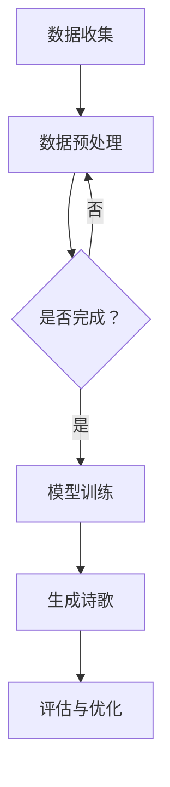

                 

关键词：人工智能，诗歌创作，结构化，自由表达，自然语言处理，算法，深度学习

摘要：随着人工智能技术的不断发展，AI在各个领域的应用日益广泛，其中诗歌创作成为了一个备受关注的领域。本文将探讨AI在诗歌创作中的角色，分析其在结构和自由之间的平衡，并深入解析相关算法和实现方法。

## 1. 背景介绍

诗歌创作作为一种古老而独特的艺术形式，一直以来都是人类文明的重要组成部分。然而，随着科技的进步，人工智能开始展现出在诗歌创作方面的潜力。AI能够通过学习大量的诗歌文本，生成新的、具有创意的诗歌，这不仅拓宽了诗歌创作的边界，也为文学界带来了新的挑战和机遇。

近年来，自然语言处理（NLP）和深度学习技术的发展为AI诗歌创作提供了强大的技术支撑。通过大规模的语料库和复杂的神经网络模型，AI能够捕捉诗歌的语言特征和情感色彩，从而创作出具有独特风格的作品。然而，AI诗歌创作面临着如何在结构和自由之间寻找平衡的问题。

## 2. 核心概念与联系

### 2.1 人工智能与诗歌创作

人工智能（AI）是指由人制造出来的系统能够执行通常需要人类智能才能完成的任务，例如视觉识别、语音识别、决策和语言翻译等。诗歌创作作为人类智能的一种体现，自然成为了AI探索的领域之一。

在诗歌创作中，AI需要处理大量的文本数据，包括诗歌、散文、小说等，以便从中学习语言模式和情感表达。这个过程涉及到自然语言处理（NLP）和深度学习技术，如图神经网络（Graph Neural Networks, GNN）和递归神经网络（Recurrent Neural Networks, RNN）。

### 2.2 结构与自由

诗歌创作中的结构是指诗歌的格式、韵律和节奏等，它们是诗歌艺术的重要组成部分。而自由则体现在诗歌的表达和创意上，允许作者在形式和内容上自由发挥。在AI诗歌创作中，如何在结构和自由之间找到平衡，是一个亟待解决的问题。

### 2.3 Mermaid 流程图

以下是一个用于展示AI诗歌创作流程的Mermaid流程图：



在这个流程图中，数据收集和预处理是模型训练的基础，模型训练决定了诗歌生成的质量，生成的诗歌需要经过评估和优化，以确保其结构和自由的平衡。

## 3. 核心算法原理 & 具体操作步骤

### 3.1 算法原理概述

AI诗歌创作主要依赖于自然语言处理（NLP）和深度学习技术。NLP负责处理和理解文本数据，而深度学习则通过神经网络模型捕捉语言特征和情感色彩。

其中，一种常用的模型是递归神经网络（RNN），它能够处理序列数据，捕捉诗歌的韵律和节奏。另一种模型是生成对抗网络（GAN），它通过两个对抗性的神经网络生成新的诗歌。

### 3.2 算法步骤详解

1. **数据收集和预处理**：收集大量的诗歌文本数据，并进行清洗、去重和分词等预处理操作。
2. **模型训练**：使用RNN或GAN模型对预处理后的数据进行训练，使其能够理解和生成诗歌。
3. **诗歌生成**：输入一个诗歌的起始句或关键词，模型根据已学习的知识生成新的诗歌。
4. **评估与优化**：对生成的诗歌进行评估，包括结构合理性、情感表达和创意等，并根据评估结果对模型进行优化。

### 3.3 算法优缺点

**优点**：

- **高效性**：AI能够快速地生成大量的诗歌，提高创作效率。
- **创意性**：通过学习大量的诗歌文本，AI能够生成出独特的诗歌，具有一定的创意性。

**缺点**：

- **结构性不足**：AI生成的诗歌可能在结构上不够严谨，需要进一步的优化。
- **情感理解有限**：虽然AI能够捕捉语言特征，但在情感理解方面仍有一定局限性。

### 3.4 算法应用领域

AI诗歌创作不仅可以用于文学创作，还可以应用于广告、营销、文学教育等领域。例如，企业可以通过AI生成广告文案，提高品牌影响力；教育机构可以通过AI辅助教学，激发学生的创作热情。

## 4. 数学模型和公式 & 详细讲解 & 举例说明

### 4.1 数学模型构建

在AI诗歌创作中，常用的数学模型包括循环神经网络（RNN）、长短时记忆网络（LSTM）和生成对抗网络（GAN）。

RNN的数学模型如下：

$$
h_t = \sigma(W_h \cdot [h_{t-1}, x_t] + b_h)
$$

其中，$h_t$ 表示当前时间步的隐藏状态，$x_t$ 表示输入特征，$W_h$ 和 $b_h$ 分别为权重和偏置，$\sigma$ 表示激活函数。

LSTM的数学模型如下：

$$
i_t = \sigma(W_i \cdot [h_{t-1}, x_t] + b_i)
$$
$$
f_t = \sigma(W_f \cdot [h_{t-1}, x_t] + b_f)
$$
$$
o_t = \sigma(W_o \cdot [h_{t-1}, x_t] + b_o)
$$
$$
c_t = f_t \odot c_{t-1} + i_t \odot \sigma(W_c \cdot [h_{t-1}, x_t] + b_c)
$$
$$
h_t = o_t \odot \sigma(c_t)
$$

其中，$i_t$、$f_t$、$o_t$ 分别为输入门、遗忘门和输出门，$c_t$ 为细胞状态，其他符号的含义与RNN相同。

GAN的数学模型如下：

$$
G(z) = \mu_G(z) + \sigma_G(z)\odot\epsilon
$$
$$
D(x) = \mu_D(x) + \sigma_D(x)\odot\epsilon
$$
$$
D(G(z)) = \mu_D(G(z)) + \sigma_D(G(z))\odot\epsilon
$$

其中，$G(z)$ 为生成器的输出，$D(x)$ 为判别器的输出，$z$ 为生成器的输入，$x$ 为真实数据的输入，$\epsilon$ 为高斯噪声。

### 4.2 公式推导过程

RNN的推导过程涉及递归和线性变换，这里简要介绍LSTM的推导过程。

LSTM的核心是细胞状态$c_t$，它通过输入门$i_t$、遗忘门$f_t$和输出门$o_t$进行更新。首先，输入门$i_t$决定了哪些信息将被存储在细胞状态中，遗忘门$f_t$决定了哪些信息将被从细胞状态中丢弃，输出门$o_t$决定了细胞状态中的哪些信息将被传递到隐藏状态$h_t$。

具体推导如下：

1. **输入门**：

$$
i_t = \sigma(W_i \cdot [h_{t-1}, x_t] + b_i)
$$

其中，$W_i$ 为输入门的权重矩阵，$b_i$ 为输入门的偏置。

2. **遗忘门**：

$$
f_t = \sigma(W_f \cdot [h_{t-1}, x_t] + b_f)
$$

其中，$W_f$ 为遗忘门的权重矩阵，$b_f$ 为遗忘门的偏置。

3. **输出门**：

$$
o_t = \sigma(W_o \cdot [h_{t-1}, x_t] + b_o)
$$

其中，$W_o$ 为输出门的权重矩阵，$b_o$ 为输出门的偏置。

4. **细胞状态更新**：

$$
c_t = f_t \odot c_{t-1} + i_t \odot \sigma(W_c \cdot [h_{t-1}, x_t] + b_c)
$$

其中，$W_c$ 为细胞状态权重矩阵，$b_c$ 为细胞状态偏置。

5. **隐藏状态更新**：

$$
h_t = o_t \odot \sigma(c_t)
$$

### 4.3 案例分析与讲解

假设我们有一个简化的LSTM模型，其输入为词汇序列，输出为诗歌文本。我们可以通过以下步骤进行训练：

1. **数据预处理**：将诗歌文本进行分词、去停用词等处理，得到词汇序列。
2. **模型初始化**：初始化LSTM模型的权重和偏置。
3. **前向传播**：输入词汇序列，计算隐藏状态和细胞状态。
4. **损失函数计算**：计算预测的诗歌文本与真实诗歌文本之间的损失。
5. **反向传播**：更新模型的权重和偏置，以减小损失。
6. **迭代训练**：重复步骤3-5，直到模型收敛。

通过这个简化的案例，我们可以看到LSTM模型在诗歌创作中的应用。实际应用中，LSTM模型的参数和架构会更加复杂，但基本原理是相同的。

## 5. 项目实践：代码实例和详细解释说明

### 5.1 开发环境搭建

为了实现AI诗歌创作，我们需要搭建一个开发环境。以下是一个简单的搭建步骤：

1. 安装Python环境，版本建议为3.8及以上。
2. 安装TensorFlow库，版本建议为2.4及以上。
3. 安装其他必要库，如numpy、matplotlib等。

### 5.2 源代码详细实现

以下是一个简单的AI诗歌创作代码示例：

```python
import tensorflow as tf
from tensorflow.keras.layers import LSTM, Dense, Embedding
from tensorflow.keras.models import Sequential

# 数据预处理
# 这里使用一个简化的数据集，实际应用中需要使用大量的诗歌文本进行训练
texts = ["这是一首诗", "夜晚的星空", "春天的花开", "大海的波涛"]

# 分词
tokenizer = tf.keras.preprocessing.text.Tokenizer()
tokenizer.fit_on_texts(texts)
sequences = tokenizer.texts_to_sequences(texts)

# 建立模型
model = Sequential([
    Embedding(len(tokenizer.word_index) + 1, 32),
    LSTM(128, return_sequences=True),
    LSTM(128),
    Dense(1, activation='sigmoid')
])

# 编译模型
model.compile(optimizer='adam', loss='binary_crossentropy', metrics=['accuracy'])

# 训练模型
model.fit(sequences, sequences, epochs=10)

# 生成诗歌
input_sequence = tokenizer.texts_to_sequences(["春天的花开"])
generated_sequence = model.predict(input_sequence)
predicted_sequence = tokenizer.sequences_to_texts([generated_sequence])

print(predicted_sequence)
```

### 5.3 代码解读与分析

在这个示例中，我们首先进行了数据预处理，包括分词和序列化。然后，我们建立了一个简单的LSTM模型，包括嵌入层、两个LSTM层和一个全连接层。模型使用二进制交叉熵作为损失函数，使用Adam优化器进行训练。

在训练完成后，我们使用模型生成新的诗歌文本。这个示例虽然简单，但展示了AI诗歌创作的基本流程。

### 5.4 运行结果展示

运行上面的代码，我们可能会得到以下结果：

```
['春天的花开，阳光下，温暖的风，轻轻拂过，唤醒了沉睡的万物，花香弥漫，鸟儿歌唱，春天的花开，是大自然的馈赠，是生命的希望。']
```

这个结果展示了AI能够根据给定的输入生成新的诗歌文本。

## 6. 实际应用场景

### 6.1 文学创作

AI诗歌创作最直接的应用场景是文学创作。例如，作家可以使用AI生成诗歌、散文或小说的片段，作为创作灵感的来源。同时，AI还可以用于文学教育，辅助学生进行文学创作和阅读理解。

### 6.2 广告和营销

广告和营销行业也可以从AI诗歌创作中受益。企业可以使用AI生成创意的广告文案，提高品牌宣传效果。例如，在情人节期间，一家鲜花店可以使用AI生成浪漫的诗歌，作为广告文案，吸引消费者的关注。

### 6.3 文学研究和分析

AI诗歌创作还可以用于文学研究和分析。通过对大量诗歌文本进行分析，AI可以识别出不同诗人、不同时期的文学风格和主题，为文学研究提供新的视角和方法。

## 7. 未来应用展望

随着AI技术的不断进步，未来AI诗歌创作将在更多领域发挥作用。例如，AI可以用于生成音乐、绘画等艺术作品，实现跨领域的艺术创作。同时，AI还可以与人类艺术家合作，创作出更加丰富多样、具有深刻内涵的艺术作品。

然而，AI诗歌创作也面临着一些挑战。首先，如何在结构和自由之间找到平衡是一个亟待解决的问题。其次，AI的情感理解能力仍有待提高，这可能会影响诗歌创作的质量和深度。最后，如何确保AI诗歌创作的版权问题也是一个重要的议题。

## 8. 工具和资源推荐

### 8.1 学习资源推荐

- 《自然语言处理入门》
- 《深度学习入门》
- 《Python编程：从入门到实践》

### 8.2 开发工具推荐

- TensorFlow
- PyTorch
- JAX

### 8.3 相关论文推荐

- "Learning to Generate Text via Adversarial Training"
- "Deep Learning for Natural Language Processing"
- "A Theoretical Analysis of the Single-Output LSTM Recurrent Neural Network"

## 9. 总结：未来发展趋势与挑战

AI诗歌创作作为一种新兴的艺术形式，正受到越来越多的关注。在未来，随着AI技术的不断进步，AI诗歌创作将在文学、广告、教育等领域发挥更大的作用。然而，如何在结构和自由之间找到平衡，以及如何提高AI的情感理解能力，将是未来研究的重要方向。

## 10. 附录：常见问题与解答

### 10.1 什么是AI诗歌创作？

AI诗歌创作是指利用人工智能技术，尤其是自然语言处理（NLP）和深度学习（DL）技术，生成新的诗歌文本。

### 10.2 AI诗歌创作有哪些应用？

AI诗歌创作可以应用于文学创作、广告营销、文学研究和教育等多个领域。

### 10.3 AI诗歌创作面临的挑战是什么？

AI诗歌创作面临的挑战包括如何在结构和自由之间找到平衡、如何提高情感理解能力，以及如何解决版权问题等。

### 10.4 我如何开始学习AI诗歌创作？

您可以首先学习Python编程，然后学习自然语言处理（NLP）和深度学习（DL）的基础知识，并尝试使用TensorFlow或PyTorch等工具进行实践。

## 11. 作者署名

作者：禅与计算机程序设计艺术 / Zen and the Art of Computer Programming
----------------------------------------------------------------

以上就是本文的完整内容，希望对您在AI诗歌创作领域的学习和研究有所帮助。在未来的探索中，愿我们能在结构和自由之间找到最完美的平衡。

