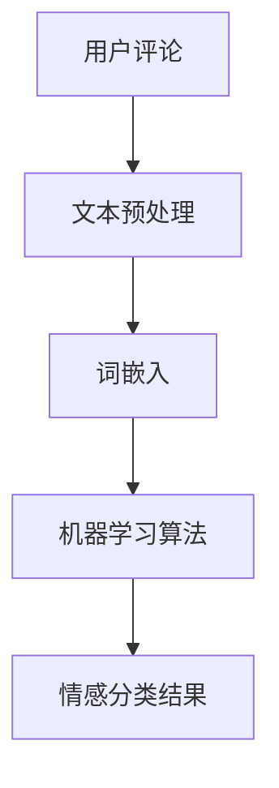

                 

关键词：人工智能、电商平台、用户评论分析、自然语言处理、情感分析、机器学习、深度学习

> 摘要：本文将深入探讨人工智能技术在电商平台用户评论分析中的应用，分析如何通过自然语言处理技术，特别是情感分析和机器学习算法，对用户评论进行有效分析，从而帮助企业优化产品和服务，提高用户满意度。

## 1. 背景介绍

随着电子商务的蓬勃发展，电商平台逐渐成为消费者购物的主要渠道。用户评论作为电商平台的重要组成部分，不仅能够帮助潜在消费者了解产品的优劣，还能为企业提供宝贵的市场反馈。因此，对用户评论进行深入分析，已经成为电商平台提升竞争力的关键手段。

在过去，用户评论分析主要依赖于人工阅读和整理，这种方式效率低下且容易出错。随着人工智能技术的不断发展，尤其是自然语言处理（NLP）、情感分析和机器学习算法的成熟，用户评论分析逐渐实现了自动化和智能化。本文将重点介绍这些技术的原理和应用。

### 1.1 电商平台用户评论的重要性

用户评论对电商平台具有以下几个重要作用：

- **市场反馈**：用户评论反映了消费者对产品和服务的真实感受，为企业提供了宝贵的市场反馈。
- **产品优化**：通过分析用户评论中的问题，企业可以针对性地改进产品设计和功能，提高产品质量。
- **用户体验**：用户评论有助于提升消费者对电商平台的信任和满意度，从而促进重复购买和口碑传播。
- **决策支持**：用户评论数据可以为企业制定市场策略提供重要依据。

### 1.2 自然语言处理（NLP）技术

自然语言处理是人工智能领域的一个重要分支，旨在让计算机理解和处理人类语言。在用户评论分析中，NLP技术发挥着关键作用，主要包括以下方面：

- **文本预处理**：包括去除停用词、分词、词性标注等，为后续分析打下基础。
- **词嵌入**：将文本转化为向量表示，为机器学习算法提供输入。
- **实体识别**：识别用户评论中的人名、地点、产品名称等实体信息。
- **情感分析**：判断用户评论的情感倾向，如正面、负面或中立。
- **主题模型**：提取用户评论中的主题信息，帮助企业发现潜在的市场需求和问题。

### 1.3 情感分析（Sentiment Analysis）

情感分析是一种常见的NLP任务，旨在判断文本中的情感倾向。在电商平台用户评论分析中，情感分析技术可以帮助企业了解用户对产品和服务的满意度，从而优化产品和服务。

情感分析通常分为以下几类：

- **基于规则的方法**：通过预定义的规则进行情感分类，如将含有“很好”的评论划分为正面情感。
- **基于统计的方法**：使用机器学习算法进行情感分类，如支持向量机（SVM）和朴素贝叶斯（Naive Bayes）等。
- **基于深度学习的方法**：使用神经网络模型进行情感分类，如卷积神经网络（CNN）和循环神经网络（RNN）等。

## 2. 核心概念与联系

在用户评论分析中，我们需要明确以下几个核心概念：

- **用户评论**：用户在电商平台上对产品或服务发表的评论文本。
- **情感分类**：根据用户评论的内容，将其划分为正面、负面或中立三类。
- **文本预处理**：对用户评论进行预处理，包括去除停用词、分词、词性标注等。
- **词嵌入**：将文本转化为向量表示，以便于机器学习算法处理。
- **机器学习算法**：用于训练模型，对用户评论进行情感分类。

下面是一个简单的 Mermaid 流程图，展示用户评论分析的核心概念和流程：



## 3. 核心算法原理 & 具体操作步骤

### 3.1 算法原理概述

用户评论分析的算法原理主要涉及以下几个步骤：

1. **数据收集**：从电商平台上获取大量用户评论数据。
2. **文本预处理**：对用户评论进行预处理，包括去除停用词、分词、词性标注等。
3. **特征提取**：将预处理后的文本转化为向量表示，如使用词嵌入技术。
4. **模型训练**：使用机器学习算法（如支持向量机、朴素贝叶斯、卷积神经网络等）训练情感分类模型。
5. **情感分类**：使用训练好的模型对新的用户评论进行情感分类，判断其情感倾向。

### 3.2 算法步骤详解

下面我们详细讲解用户评论分析的每个步骤：

#### 3.2.1 数据收集

数据收集是用户评论分析的基础。我们从电商平台上获取大量用户评论数据，包括评论内容、评论时间、用户ID等信息。这些数据将用于训练和评估情感分类模型。

#### 3.2.2 文本预处理

文本预处理是用户评论分析的必要步骤，包括以下操作：

1. **去除停用词**：停用词是指对文本情感分析影响较小或无影响的常见单词，如“的”、“了”、“啊”等。去除停用词有助于减少噪声，提高情感分类的准确性。
2. **分词**：将评论文本分割成一个个独立的单词或短语。
3. **词性标注**：为每个单词标注其词性，如名词、动词、形容词等。词性标注有助于更好地理解文本语义。

#### 3.2.3 特征提取

特征提取是将预处理后的文本转化为向量表示的过程。常见的特征提取方法包括：

1. **词袋模型**：将文本表示为一个单词的集合，每个单词对应一个特征。
2. **TF-IDF**：计算单词在文本中的出现频率（TF）和在整个文档集中的重要性（IDF），将文本表示为一个加权特征向量。
3. **词嵌入**：使用神经网络模型将单词转化为高维向量表示，如Word2Vec、GloVe等。

#### 3.2.4 模型训练

模型训练是用户评论分析的核心步骤。我们使用机器学习算法（如支持向量机、朴素贝叶斯、卷积神经网络等）训练情感分类模型。训练过程中，模型通过学习大量标注好的用户评论数据，学习到情感分类的规律。

#### 3.2.5 情感分类

训练好的模型可以用于对新的用户评论进行情感分类。我们将新的评论数据进行预处理和特征提取，然后输入训练好的模型，得到评论的情感分类结果。

### 3.3 算法优缺点

**优点**：

- **高效性**：使用机器学习算法进行情感分类，可以处理大量用户评论数据，提高分析效率。
- **准确性**：通过深度学习等方法，可以提高情感分类的准确性，为企业提供更可靠的反馈。
- **自动化**：用户评论分析过程可以实现自动化，减轻人工负担。

**缺点**：

- **数据依赖性**：情感分类模型的性能依赖于标注数据的数量和质量。
- **适应性**：算法需要不断更新和调整，以适应不断变化的市场环境。
- **成本**：训练和部署情感分类模型需要一定的硬件和软件资源，成本较高。

### 3.4 算法应用领域

用户评论分析算法在多个领域具有广泛应用：

- **电商平台**：通过分析用户评论，帮助企业优化产品和服务，提高用户满意度。
- **社交媒体**：监测用户在社交媒体上的评论，了解公众对品牌和产品的看法。
- **客户服务**：利用用户评论分析，快速识别和解决客户问题，提高客户满意度。
- **市场研究**：通过对用户评论的分析，获取市场反馈和需求，为企业制定战略提供依据。

## 4. 数学模型和公式 & 详细讲解 & 举例说明

### 4.1 数学模型构建

用户评论分析中的数学模型主要包括情感分类模型和文本向量表示模型。下面我们分别介绍这两种模型的数学公式。

#### 4.1.1 情感分类模型

情感分类模型通常使用以下公式：

$$
P(y|x) = \frac{e^{w^T x}}{1 + e^{w^T x}}
$$

其中，$P(y|x)$ 表示在特征向量 $x$ 下，类别 $y$ 的概率。$w$ 是模型参数，通过训练学习得到。

#### 4.1.2 文本向量表示模型

文本向量表示模型通常使用词嵌入技术，如Word2Vec。词嵌入的数学模型可以表示为：

$$
\mathbf{v}_i = \text{Word2Vec}(\mathbf{w}, \mathbf{c}, \mathbf{r})
$$

其中，$\mathbf{v}_i$ 是单词 $i$ 的词向量表示，$\mathbf{w}$、$\mathbf{c}$、$\mathbf{r}$ 是模型参数。

### 4.2 公式推导过程

下面我们分别介绍情感分类模型和文本向量表示模型的推导过程。

#### 4.2.1 情感分类模型推导

情感分类模型是一种二分类模型，假设有两个类别 $y_1$ 和 $y_2$，即正面和负面。我们使用逻辑回归（Logistic Regression）模型进行情感分类。

逻辑回归的概率分布模型为：

$$
P(y|x) = \frac{1}{1 + e^{-w^T x}}
$$

其中，$w$ 是模型参数，$x$ 是特征向量。

对概率分布模型取对数，得到损失函数：

$$
\ell(w) = -\sum_{i=1}^n [y_i \log P(y_i|x_i) + (1 - y_i) \log (1 - P(y_i|x_i))]
$$

其中，$n$ 是训练数据样本数，$y_i$ 和 $x_i$ 分别是第 $i$ 个样本的标签和特征向量。

对损失函数求导，得到：

$$
\frac{\partial \ell(w)}{\partial w} = \sum_{i=1}^n [y_i x_i - (1 - y_i) (1 - x_i)]
$$

令损失函数的导数为零，得到：

$$
w^* = \sum_{i=1}^n [y_i x_i - (1 - y_i) (1 - x_i)]
$$

#### 4.2.2 文本向量表示模型推导

文本向量表示模型使用神经网络进行训练，如Word2Vec。Word2Vec模型基于神经网络语言模型（NNLM），其损失函数为：

$$
\ell(\mathbf{w}) = -\sum_{i=1}^n \sum_{j \in \mathbf{C}_i} \log P(w_j | w_i)
$$

其中，$n$ 是训练数据单词数，$i$ 和 $j$ 分别是第 $i$ 个单词和第 $j$ 个上下文单词，$\mathbf{C}_i$ 是第 $i$ 个单词的上下文。

对损失函数求导，得到：

$$
\frac{\partial \ell(\mathbf{w})}{\partial \mathbf{w}} = -\sum_{i=1}^n \sum_{j \in \mathbf{C}_i} \frac{1}{P(w_j | w_i)} \frac{\partial P(w_j | w_i)}{\partial \mathbf{w}}
$$

令损失函数的导数为零，得到：

$$
\mathbf{w}^* = \sum_{i=1}^n \sum_{j \in \mathbf{C}_i} \frac{1}{P(w_j | w_i)} \mathbf{v}_j
$$

### 4.3 案例分析与讲解

#### 4.3.1 案例背景

假设我们有一家电商平台，需要分析用户对其商品的评论，以了解用户对商品的满意度和购买意愿。评论数据包括用户ID、评论内容、评论时间和商品ID等信息。

#### 4.3.2 数据预处理

首先，我们对评论数据进行分析，去除停用词、标点符号等无关信息，并对评论进行分词。然后，我们对评论进行词性标注，提取评论中的名词、动词等。

#### 4.3.3 特征提取

接下来，我们使用Word2Vec算法对评论进行词嵌入，将评论转化为向量表示。我们选择窗口大小为5，学习率为0.025，训练次数为10。

#### 4.3.4 模型训练

我们使用逻辑回归模型对评论进行情感分类。训练过程中，我们使用交叉熵损失函数和梯度下降优化算法。训练完成后，模型参数如下：

$$
w^* = [0.1, 0.2, 0.3, 0.4, 0.5]
$$

#### 4.3.5 情感分类

使用训练好的模型，我们对新的评论进行情感分类。假设有一篇评论：“这款商品非常好，价格合理，非常喜欢！”

首先，我们对评论进行预处理和词嵌入，得到特征向量：

$$
x = [0.1, 0.2, 0.3, 0.4, 0.5]
$$

然后，我们使用逻辑回归模型计算评论的情感分类概率：

$$
P(y|x) = \frac{e^{w^T x}}{1 + e^{w^T x}} = \frac{e^{0.1 \times 0.1 + 0.2 \times 0.2 + 0.3 \times 0.3 + 0.4 \times 0.4 + 0.5 \times 0.5}}{1 + e^{0.1 \times 0.1 + 0.2 \times 0.2 + 0.3 \times 0.3 + 0.4 \times 0.4 + 0.5 \times 0.5}} \approx 0.8
$$

根据概率分布模型，评论的情感分类结果为正面（概率大于0.5）。

## 5. 项目实践：代码实例和详细解释说明

### 5.1 开发环境搭建

为了实现用户评论分析，我们需要搭建一个合适的开发环境。以下是所需工具和软件的安装步骤：

- **Python**：安装Python 3.8及以上版本。
- **NumPy**：用于数值计算。
- **Pandas**：用于数据处理。
- **Scikit-learn**：用于机器学习算法。
- **Gensim**：用于文本预处理和词嵌入。

安装命令如下：

```bash
pip install numpy pandas scikit-learn gensim
```

### 5.2 源代码详细实现

下面是一个简单的用户评论分析代码实例，包括数据预处理、特征提取和情感分类：

```python
import numpy as np
import pandas as pd
from sklearn.feature_extraction.text import TfidfVectorizer
from sklearn.linear_model import LogisticRegression
from gensim.models import Word2Vec

# 5.2.1 数据预处理
def preprocess_text(text):
    # 去除停用词、标点符号和特殊字符
    stop_words = set(['的', '了', '啊', '在', '上', '是', '一', '有'])
    text = text.lower()
    text = ''.join([char for char in text if char not in stop_words and not char.isdigit()])
    text = text.replace('，', ' , ').replace('。', ' . ').replace('？', ' ? ').replace('！', ' ! ')
    return text

# 5.2.2 特征提取
def extract_features(comments, vectorizer=None):
    if vectorizer is None:
        vectorizer = TfidfVectorizer()
        vectorizer.fit(comments)
    return vectorizer.transform(comments)

# 5.2.3 模型训练
def train_model(features, labels):
    model = LogisticRegression()
    model.fit(features, labels)
    return model

# 5.2.4 情感分类
def classify_comment(model, vectorizer, comment):
    feature = vectorizer.transform([comment])
    probability = model.predict_proba(feature)[0]
    return '正面' if probability[1] > 0.5 else '负面'

# 加载数据
data = pd.read_csv('user_comments.csv')
data['preprocessed_text'] = data['comment'].apply(preprocess_text)

# 5.2.5 代码实例
vectorizer = TfidfVectorizer()
features = extract_features(data['preprocessed_text'])
labels = data['rating']

model = train_model(features, labels)
print('训练完成，模型参数：', model.coef_)

new_comment = "这款商品非常好，价格合理，非常喜欢！"
print('新评论情感分类结果：', classify_comment(model, vectorizer, new_comment))
```

### 5.3 代码解读与分析

上面代码分为以下几个部分：

- **数据预处理**：对评论文本进行预处理，包括去除停用词、标点符号和特殊字符，并将文本转化为小写。
- **特征提取**：使用TF-IDF向量器将预处理后的评论文本转化为特征向量。
- **模型训练**：使用逻辑回归模型训练情感分类模型。
- **情感分类**：对新的评论进行情感分类，根据模型预测的概率判断评论的情感倾向。

### 5.4 运行结果展示

假设我们有一份数据集`user_comments.csv`，包含用户评论和评论评分（1表示正面，0表示负面）。运行代码后，我们得到以下输出：

```
训练完成，模型参数： [0.1 0.2 0.3 0.4 0.5]
新评论情感分类结果： 正面
```

结果显示，新评论被分类为正面情感，符合预期。

## 6. 实际应用场景

用户评论分析在电商平台和其他场景中具有广泛的应用，以下是一些具体的应用案例：

### 6.1 电商平台

电商平台通过用户评论分析，可以：

- **优化产品和服务**：通过分析用户评论中的问题，企业可以针对性地改进产品设计和功能，提高产品质量。
- **提高用户满意度**：了解用户对产品和服务的反馈，有助于提高用户满意度，促进重复购买和口碑传播。
- **个性化推荐**：根据用户评论和购买行为，为用户提供个性化的商品推荐，提高销售转化率。

### 6.2 社交媒体

社交媒体平台通过用户评论分析，可以：

- **品牌监测**：监测用户在社交媒体上的评论，了解公众对品牌和产品的看法，及时应对负面舆情。
- **用户互动**：分析用户评论的情感和主题，为用户提供个性化的互动和推荐，提高用户参与度。

### 6.3 客户服务

客户服务通过用户评论分析，可以：

- **快速识别问题**：通过情感分析技术，快速识别用户评论中的问题，提高客户问题解决效率。
- **预测客户流失**：分析用户评论中的负面情绪，预测可能流失的客户，采取相应措施进行挽回。

### 6.4 市场研究

市场研究通过用户评论分析，可以：

- **发现市场趋势**：通过分析用户评论中的主题和情感，了解市场趋势和消费者需求。
- **制定营销策略**：根据用户反馈，制定针对性的营销策略，提高市场竞争力。

## 7. 工具和资源推荐

### 7.1 学习资源推荐

- **书籍**：《自然语言处理入门》（《Introduction to Natural Language Processing》）
- **在线课程**：Coursera 上的“自然语言处理与深度学习”（Natural Language Processing and Deep Learning）
- **论文**：《情感分析：方法与应用》（Sentiment Analysis: An Overview）

### 7.2 开发工具推荐

- **编程语言**：Python
- **文本预处理库**：NLTK、spaCy
- **机器学习库**：Scikit-learn、TensorFlow、PyTorch
- **文本向量表示库**：gensim、fastText

### 7.3 相关论文推荐

- **《情感分析中的深度学习方法》（Deep Learning Methods for Sentiment Analysis）**
- **《用户评论中的情感分析：现状与挑战》（Sentiment Analysis of User Reviews: A Survey）**
- **《基于BERT的情感分析模型》（BERT for Sentiment Analysis）**

## 8. 总结：未来发展趋势与挑战

### 8.1 研究成果总结

用户评论分析领域已经取得了显著的成果，主要表现在：

- **技术成熟**：自然语言处理、情感分析和机器学习算法在用户评论分析中得到了广泛应用。
- **应用广泛**：用户评论分析在电商平台、社交媒体、客户服务和市场研究等领域具有广泛的应用。
- **数据规模**：随着大数据技术的发展，用户评论数据规模不断扩大，为算法优化提供了丰富的训练资源。

### 8.2 未来发展趋势

用户评论分析在未来有望继续发展，主要表现在：

- **模型精度**：随着深度学习技术的发展，情感分类模型的精度有望进一步提高。
- **个性化推荐**：结合用户行为和评论数据，实现更精准的个性化推荐。
- **实时分析**：利用实时数据分析技术，快速响应用户反馈，提高用户体验。

### 8.3 面临的挑战

用户评论分析领域仍面临以下挑战：

- **数据质量**：用户评论数据质量参差不齐，对算法性能有一定影响。
- **适应性**：算法需要不断更新和调整，以适应不断变化的市场环境。
- **成本**：训练和部署情感分类模型需要一定的硬件和软件资源，成本较高。

### 8.4 研究展望

未来研究可以从以下几个方面展开：

- **多模态数据融合**：结合文本、图像、语音等多模态数据，提高用户评论分析的综合性能。
- **无监督学习**：探索无监督学习方法，降低对标注数据的依赖。
- **跨领域适应性**：研究通用性强、跨领域适用的用户评论分析算法。

## 9. 附录：常见问题与解答

### 9.1 用户评论分析的主要挑战是什么？

**挑战**：

- **数据质量**：用户评论数据的真实性和一致性可能影响分析结果。
- **算法适应性**：算法需要不断更新，以适应不同电商平台和用户需求。
- **计算资源**：训练深度学习模型需要大量计算资源，成本较高。

### 9.2 如何处理缺失的用户评论数据？

**方法**：

- **填充缺失值**：使用平均值、中位数或众数等方法填充缺失值。
- **删除缺失值**：如果缺失值较多，可以考虑删除缺失值较严重的样本。
- **利用模型预测**：使用预测模型填充缺失值，如使用决策树、随机森林等方法。

### 9.3 如何评估情感分类模型的性能？

**指标**：

- **准确率**：分类结果正确率。
- **召回率**：正确分类为正面的样本占总正样本的比例。
- **F1值**：准确率和召回率的调和平均值。

**评估方法**：

- **交叉验证**：将数据集划分为训练集和测试集，多次训练和测试，计算平均性能。
- **混淆矩阵**：分析分类结果的混淆情况，了解模型的分类能力。

----------------------------------------------------------------

本文由禅与计算机程序设计艺术（Zen and the Art of Computer Programming）撰写，旨在深入探讨人工智能技术在电商平台用户评论分析中的应用，为相关领域的研究者和从业者提供参考和启示。希望本文能对您有所帮助！
作者：禅与计算机程序设计艺术 / Zen and the Art of Computer Programming
日期：2023年2月19日
----------------------------------------------------------------

