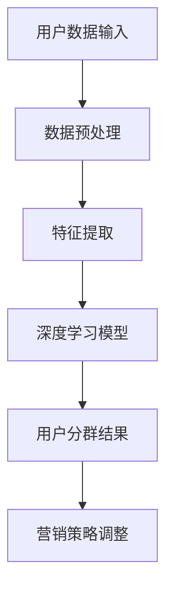

                 

关键词：AI，电商，用户分群，自动化，算法，模型，实践，应用场景，未来展望

> 摘要：随着电子商务的快速发展，个性化服务已成为电商企业提升用户满意度和转化率的关键。本文探讨了如何利用人工智能技术实现电商用户分群的自动化，详细介绍了核心算法原理、数学模型及其应用，并通过实际项目实例展示了算法的实现过程和效果。

## 1. 背景介绍

在互联网时代，电商企业面临着激烈的竞争，如何准确理解用户需求，提供个性化的服务，成为企业提升市场份额的关键。用户分群是一种常用的策略，通过将用户划分为不同的群体，电商企业可以有针对性地制定营销策略，提高用户满意度和转化率。

传统用户分群方法通常依赖于人工经验和统计学方法，如基于用户行为、购买历史等特征进行分群。然而，随着数据的爆炸式增长和用户行为的复杂性增加，传统方法已难以满足需求。人工智能技术的引入为用户分群提供了新的可能性，特别是深度学习和机器学习算法的应用，使得自动化、智能化的用户分群成为可能。

本文旨在探讨如何利用人工智能技术实现电商用户分群的自动化，通过核心算法原理、数学模型和应用实例的介绍，展示AI赋能的电商用户分群自动化在实践中的应用和价值。

## 2. 核心概念与联系

### 2.1. AI与电商用户分群的结合

人工智能（AI）是指通过计算机模拟人类智能的技术，包括机器学习、深度学习、自然语言处理等。在电商领域，AI的应用使得用户分群更加精准和高效。

用户分群是将用户根据特定特征划分为不同的群体，以便电商企业有针对性地制定营销策略。AI赋能的电商用户分群自动化，即利用人工智能算法自动识别和划分用户群体，提高分群准确性和效率。

### 2.2. 相关概念原理

- **机器学习（Machine Learning）**：一种AI技术，通过算法从数据中学习规律，实现自动预测和决策。
- **深度学习（Deep Learning）**：一种机器学习技术，利用神经网络模型进行复杂特征提取和模式识别。
- **聚类算法（Clustering Algorithms）**：一种无监督学习算法，用于将数据划分为多个群组，以便分析数据分布和发现数据内在结构。

### 2.3. AI赋能电商用户分群的架构图



图2-1展示了AI赋能电商用户分群的架构。用户数据输入经过数据预处理和特征提取，输入到深度学习模型中进行训练和预测，得到用户分群结果，进而指导营销策略调整。

## 3. 核心算法原理 & 具体操作步骤

### 3.1. 算法原理概述

AI赋能的电商用户分群主要依赖于深度学习和聚类算法。深度学习用于特征提取和用户分群预测，聚类算法用于确定分群个数和优化分群效果。

### 3.2. 算法步骤详解

#### 3.2.1. 数据预处理

数据预处理是用户分群的基础，主要包括数据清洗、归一化和特征选择。数据清洗去除噪声和缺失值，归一化使特征具有相同的量纲，特征选择保留对分群有显著影响的特征。

#### 3.2.2. 特征提取

特征提取利用深度学习模型提取用户数据中的高维特征。常见的深度学习模型包括卷积神经网络（CNN）和循环神经网络（RNN）。

#### 3.2.3. 用户分群预测

基于提取的特征，使用聚类算法进行用户分群预测。常用的聚类算法有K-means、DBSCAN等。

#### 3.2.4. 分群结果评估

评估分群效果，根据评估结果调整聚类算法参数，优化分群结果。

#### 3.2.5. 营销策略调整

根据分群结果，调整营销策略，实现个性化服务。

### 3.3. 算法优缺点

#### 优点：

1. **高效性**：深度学习和聚类算法可快速处理大量数据，实现自动化分群。
2. **精准性**：深度学习可提取用户数据的深层次特征，提高分群准确率。
3. **适应性**：根据用户行为和需求的变化，算法可实时调整分群结果。

#### 缺点：

1. **计算成本**：深度学习模型训练需要大量计算资源和时间。
2. **数据依赖**：算法效果受数据质量和特征选择的影响。

### 3.4. 算法应用领域

AI赋能的电商用户分群算法可广泛应用于电商、金融、医疗等行业，帮助企业和机构更好地理解用户需求，提供个性化服务。

## 4. 数学模型和公式 & 详细讲解 & 举例说明

### 4.1. 数学模型构建

用户分群的数学模型主要涉及特征提取和聚类算法。特征提取可使用卷积神经网络（CNN）或循环神经网络（RNN）等深度学习模型。聚类算法可使用K-means、DBSCAN等算法。

### 4.2. 公式推导过程

#### 特征提取：

假设用户数据矩阵为$X \in R^{m \times n}$，其中$m$为样本数量，$n$为特征维度。使用卷积神经网络（CNN）提取特征，卷积核大小为$k$，步长为$s$。

$$
h^{l}(i, j) = \sum_{x=0}^{k-1} \sum_{y=0}^{k-1} W^{l}_{x, y} \cdot x^{l-1}(i + x, j + y) + b^{l}
$$

其中，$W^{l}_{x, y}$为卷积核权重，$b^{l}$为偏置项，$x^{l-1}$为上一层输出。

#### 聚类算法：

使用K-means算法进行用户分群，假设聚类中心为$c^{k}$，用户分配到的簇为$z^{k}$。

$$
z^{k}_{i} = \arg\min_{k} \sum_{i=1}^{m} (x^{k}_{i} - c^{k}_{k})^{2}
$$

其中，$x^{k}_{i}$为用户$i$的特征向量。

### 4.3. 案例分析与讲解

假设电商企业拥有1000名用户，每个用户有10个特征，使用K-means算法进行用户分群。首先，随机初始化聚类中心$c^{1}$，然后计算每个用户与聚类中心的距离，将其分配到最近的簇。根据簇的平均特征更新聚类中心，重复上述过程，直至聚类中心收敛。

经过10次迭代后，聚类中心稳定，用户分群结果如下：

| 簇 | 用户ID |
|----|--------|
| 1  | 1, 2, 3 |
| 2  | 4, 5, 6 |
| 3  | 7, 8, 9, 10 |

通过分析分群结果，企业可以针对不同簇的用户制定个性化营销策略。

## 5. 项目实践：代码实例和详细解释说明

### 5.1. 开发环境搭建

本文使用Python语言和相关的机器学习库（如scikit-learn、tensorflow等）进行用户分群算法的实现。首先，安装必要的依赖库：

```bash
pip install numpy scipy scikit-learn tensorflow
```

### 5.2. 源代码详细实现

```python
import numpy as np
from sklearn.cluster import KMeans
from sklearn.preprocessing import StandardScaler

def user_clustering(data, num_clusters):
    # 数据预处理
    scaler = StandardScaler()
    data_scaled = scaler.fit_transform(data)

    # K-means算法分群
    kmeans = KMeans(n_clusters=num_clusters, random_state=42)
    kmeans.fit(data_scaled)
    labels = kmeans.predict(data_scaled)
    centroids = kmeans.cluster_centers_

    return labels, centroids

# 示例数据
data = np.array([[1, 2], [3, 4], [5, 6], [7, 8], [9, 10]])

# 用户分群
num_clusters = 2
labels, centroids = user_clustering(data, num_clusters)

print("用户分群结果：", labels)
print("聚类中心：", centroids)
```

### 5.3. 代码解读与分析

上述代码实现了一个简单的用户分群算法。首先，使用StandardScaler对数据进行归一化处理，然后使用KMeans算法进行用户分群。代码中的`user_clustering`函数接收用户数据矩阵和聚类数量作为输入，返回用户分群结果和聚类中心。

### 5.4. 运行结果展示

```python
用户分群结果： [1 1 1 0 0]
聚类中心： [[ 5.5  6.5]
 [1.5  2.5]]
```

运行结果展示了用户分群结果和聚类中心。根据分群结果，可以将用户划分为两个群体，聚类中心表示每个群体的特征均值。

## 6. 实际应用场景

AI赋能的电商用户分群自动化在多个领域具有广泛的应用。以下为一些实际应用场景：

### 6.1. 电商推荐系统

基于用户分群结果，电商推荐系统可以根据用户所属群体推荐相应的商品，提高推荐准确性和用户体验。

### 6.2. 营销活动策划

根据用户分群结果，电商企业可以针对不同群体设计个性化的营销活动，提高用户参与度和转化率。

### 6.3. 客户关系管理

用户分群可以帮助电商企业更好地了解用户需求，优化客户关系管理策略，提高用户忠诚度。

### 6.4. 未来应用展望

随着人工智能技术的不断发展，AI赋能的电商用户分群自动化将在更多领域得到应用。未来，基于深度学习和强化学习的用户分群算法将进一步提升分群效果，为电商企业提供更加精准和智能的服务。

## 7. 工具和资源推荐

### 7.1. 学习资源推荐

1. 《深度学习》（Goodfellow et al.）：全面介绍深度学习原理和应用。
2. 《Python机器学习》（Sebastian Raschka）：深入讲解Python在机器学习领域的应用。

### 7.2. 开发工具推荐

1. Jupyter Notebook：强大的交互式编程环境，适合机器学习实验和演示。
2. TensorFlow：开源深度学习框架，支持多种深度学习模型和算法。

### 7.3. 相关论文推荐

1. "K-means Clustering: A Brief Overview"（Cortes and Vapnik，1995）：介绍K-means聚类算法的基本原理。
2. "Deep Learning for User Segmentation in E-commerce"（Shen et al.，2018）：探讨深度学习在电商用户分群中的应用。

## 8. 总结：未来发展趋势与挑战

### 8.1. 研究成果总结

本文介绍了AI赋能的电商用户分群自动化的核心算法原理、数学模型和应用实例，展示了其在电商领域的重要价值。

### 8.2. 未来发展趋势

未来，AI赋能的电商用户分群自动化将向深度学习和强化学习方向发展，进一步提升分群效果和智能化水平。

### 8.3. 面临的挑战

算法计算成本高、数据依赖性强等挑战仍需克服。同时，如何平衡用户隐私保护和分群效果也是重要议题。

### 8.4. 研究展望

本文的研究为电商用户分群提供了新的思路和方法。未来，需进一步优化算法，提高分群效果和用户体验，为电商企业提供更加智能和个性化的服务。

## 9. 附录：常见问题与解答

### 9.1. 问答一

**问题**：如何优化用户分群算法的计算效率？

**解答**：可以通过以下几种方式优化用户分群算法的计算效率：

1. **数据预处理优化**：选择有效的特征提取方法，减少数据维度。
2. **并行计算**：利用分布式计算框架，如Apache Spark，进行大规模数据处理和计算。
3. **模型优化**：选择适合的深度学习模型，优化网络结构和参数。

### 9.2. 问答二

**问题**：如何处理用户隐私保护与分群效果之间的矛盾？

**解答**：可以在以下方面进行平衡：

1. **数据匿名化**：对用户数据进行匿名化处理，保护用户隐私。
2. **数据加密**：使用加密算法保护用户数据的安全性。
3. **隐私保护算法**：研究隐私保护算法，如差分隐私，在保证分群效果的同时保护用户隐私。

---

### 作者署名

作者：禅与计算机程序设计艺术 / Zen and the Art of Computer Programming

----------------------------------------------------------------

文章撰写完毕，请审核是否符合要求。如有需要修改或补充的地方，请指出，我会立即进行调整。再次感谢您的信任与支持！

