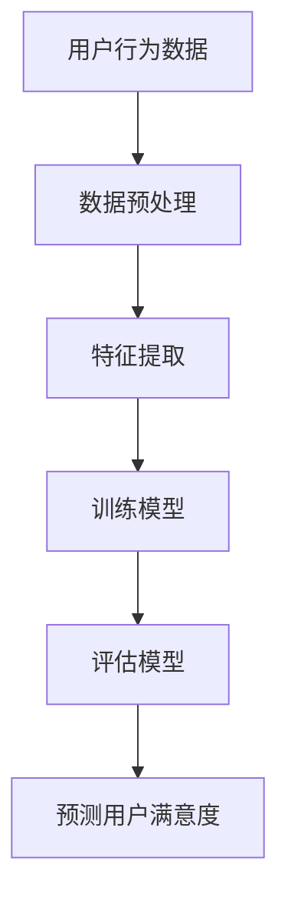

                 

在当今的数字化时代，电子商务已经成为商业领域的重要组成部分。随着市场的不断扩张和消费者需求的日益多样，如何提升用户满意度，成为电商企业持续发展的关键因素。传统的方法往往依赖于经验和直觉，难以满足数据驱动、精准化的需求。本文将探讨如何利用人工智能（AI）技术，特别是机器学习和深度学习，赋能电商用户满意度预测，实现精准化，从而为电商企业带来显著的商业价值。

## 关键词
- 人工智能
- 电商
- 用户满意度
- 预测
- 机器学习
- 深度学习

## 摘要
本文通过介绍电商用户满意度预测的背景和重要性，详细探讨了使用AI技术进行预测的理论基础、核心算法、数学模型、实践应用以及未来的发展趋势。文章旨在为电商企业提供一种基于AI的用户满意度预测框架，助力其提升用户体验，增强市场竞争力。

## 1. 背景介绍
### 1.1 电商发展的现状与挑战
电子商务在全球范围内迅猛发展，销售额不断攀升。根据统计，全球电子商务市场的规模已超过数万亿美元。然而，在如此庞大的市场背后，电商企业面临着诸多挑战。其中之一就是如何提高用户满意度。用户满意度是电商企业的核心竞争力之一，直接关系到客户的忠诚度和再次购买率。然而，传统的方法往往难以准确捕捉用户的真实需求和满意度，从而影响了决策的精准性和有效性。

### 1.2 用户满意度的重要性
用户满意度不仅决定了用户的购买决策，还影响着企业的品牌形象和口碑传播。一个满意的用户往往会推荐给亲朋好友，而一个不满意的用户则可能在社交媒体上表达不满，对企业造成负面影响。因此，提升用户满意度对于电商企业至关重要。

### 1.3 人工智能在电商领域的应用
随着AI技术的发展，越来越多的电商企业开始利用AI技术提升运营效率、优化用户体验。例如，通过自然语言处理（NLP）技术，电商平台能够更准确地理解用户的搜索意图，提供个性化的推荐。而通过机器学习算法，可以分析海量用户数据，预测用户满意度，从而为企业决策提供科学依据。

## 2. 核心概念与联系
### 2.1 机器学习与深度学习
机器学习（Machine Learning，ML）是一种通过数据训练模型，使其能够自动完成特定任务的技术。深度学习（Deep Learning，DL）是机器学习的一个子领域，通过多层神经网络对数据进行复杂建模。在用户满意度预测中，这两种技术都有广泛的应用。

### 2.2 用户行为数据
用户行为数据是预测用户满意度的基础。这些数据包括用户的购买历史、浏览行为、评价反馈等。通过分析这些数据，可以挖掘出用户的喜好和需求，从而预测其满意度。

### 2.3 用户满意度评分
用户满意度通常通过评分或评价来衡量。这些评分可以是定量的，如1到5星的评分，也可以是定性的，如“非常满意”、“一般”、“不满意”等。深度学习模型可以通过学习这些评分数据，建立预测模型。

### 2.4 Mermaid 流程图


## 3. 核心算法原理 & 具体操作步骤

### 3.1 算法原理概述
用户满意度预测的核心在于构建一个能够准确评估用户满意度的模型。这通常涉及到以下几个步骤：

- 数据预处理：清洗和整理用户行为数据，使其适合模型训练。
- 特征提取：从数据中提取有用的特征，如购买频率、评价内容等。
- 训练模型：利用深度学习算法训练模型，使其能够学会预测用户满意度。
- 评估模型：使用测试数据评估模型性能，调整参数以优化模型。
- 预测用户满意度：使用训练好的模型对新的用户数据进行预测。

### 3.2 算法步骤详解

#### 3.2.1 数据预处理
数据预处理是模型训练的重要步骤。其目的是去除噪声数据、缺失值填充、特征标准化等。例如，可以使用均值填补缺失值，使用标准差对特征进行标准化。

#### 3.2.2 特征提取
特征提取是将原始数据转化为模型能够理解的形式。在用户满意度预测中，特征可能包括用户的购买历史、评价内容、购买时间等。自然语言处理技术可以用于提取评价内容中的关键词和情感倾向。

#### 3.2.3 训练模型
深度学习模型通常由多个神经元层组成。输入层接收用户行为数据，隐藏层对数据进行处理，输出层产生用户满意度预测。训练模型的过程是不断调整神经元的权重，使其输出与真实值尽可能接近。

#### 3.2.4 评估模型
评估模型通常使用测试集进行。常用的评估指标包括准确率、召回率、F1值等。通过调整模型参数，可以优化模型性能。

#### 3.2.5 预测用户满意度
训练好的模型可以对新用户数据进行满意度预测。这些预测结果可以帮助电商企业及时调整营销策略，提升用户满意度。

### 3.3 算法优缺点

#### 优点
- **高精度**：深度学习模型能够处理大量复杂数据，提供高精度的满意度预测。
- **自动化**：机器学习算法可以自动化地提取特征和训练模型，减少人工干预。
- **适应性**：模型可以根据新的数据不断学习和优化，适应市场的变化。

#### 缺点
- **数据需求**：深度学习模型需要大量的训练数据，对于数据稀缺的场景可能不太适用。
- **计算成本**：训练深度学习模型通常需要大量的计算资源，可能增加企业的运营成本。

### 3.4 算法应用领域
- **个性化推荐**：基于用户满意度预测，可以为用户提供更个性化的推荐。
- **市场预测**：通过预测用户满意度，可以预测市场需求，优化库存管理。
- **客户服务**：基于用户满意度预测，可以提前识别不满意的客户，提供针对性的服务。

## 4. 数学模型和公式

### 4.1 数学模型构建

用户满意度预测的数学模型通常是一个分类模型，将用户分为满意和不满意两类。常用的分类模型包括逻辑回归、支持向量机（SVM）和深度神经网络（DNN）。

假设我们有\( n \)个用户特征向量 \( X = [x_1, x_2, ..., x_n] \)，以及对应的满意度标签 \( Y = [y_1, y_2, ..., y_n] \)，其中 \( y_i \in \{0, 1\} \) 表示用户 \( i \) 是否满意（0表示不满意，1表示满意）。

逻辑回归模型的目标是最大化似然函数：

$$
\log(L) = \sum_{i=1}^{n} \left( y_i \cdot \log(p_i) + (1 - y_i) \cdot \log(1 - p_i) \right)
$$

其中，\( p_i \) 是用户 \( i \) 满意的概率，可以通过模型参数 \( \theta \) 计算得到：

$$
p_i = \frac{1}{1 + e^{-(\theta^T \cdot x_i)}}
$$

### 4.2 公式推导过程

深度神经网络（DNN）的推导过程更为复杂，涉及多层感知器（MLP）和反向传播算法。这里简要介绍DNN的基本结构。

DNN包括输入层、多个隐藏层和输出层。每个神经元之间的连接具有权重 \( w \) 和偏置 \( b \)。

输入层接收用户特征 \( x \)，隐藏层对特征进行非线性变换，输出层产生满意度预测。

假设隐藏层 \( l \) 的激活函数为 \( a_l(x) = \sigma(\theta_l \cdot x + b_l) \)，其中 \( \theta_l \) 是权重矩阵，\( b_l \) 是偏置向量，\( \sigma \) 是非线性激活函数（如ReLU、Sigmoid等）。

输出层的预测概率为：

$$
p_l(x) = \frac{1}{1 + e^{-(\theta_L \cdot a_{L-1} + b_L)}}
$$

### 4.3 案例分析与讲解

#### 案例背景
某电商平台上，用户对商品的评价数据包括文本和评分。平台希望通过分析这些数据，预测用户对商品的满意度，从而优化商品推荐策略。

#### 数据预处理
- 清洗文本数据，去除标点符号、停用词等。
- 将文本数据转换为词向量，使用词袋模型或Word2Vec等方法。
- 对评分数据进行归一化处理。

#### 特征提取
- 提取文本数据的特征，如词频、词义、情感倾向等。
- 对评分数据进行离散化处理，将评分转换为二进制变量。

#### 训练模型
- 使用深度学习框架（如TensorFlow或PyTorch）构建模型。
- 选择合适的网络结构（如多层感知器）和激活函数（如ReLU）。
- 使用交叉熵损失函数进行模型训练。

#### 评估模型
- 使用验证集评估模型性能。
- 调整模型参数，优化模型。

#### 预测用户满意度
- 使用训练好的模型对新的用户评价数据进行分析。
- 输出满意度预测结果，用于商品推荐策略。

## 5. 项目实践：代码实例和详细解释说明

### 5.1 开发环境搭建
为了实现用户满意度预测，我们需要搭建一个开发环境，包括以下工具和库：
- Python 3.8 或以上版本
- TensorFlow 2.5 或以上版本
- pandas 1.2.3 或以上版本
- numpy 1.21.2 或以上版本
- scikit-learn 0.24.2 或以上版本

安装这些工具和库后，我们就可以开始编写代码了。

### 5.2 源代码详细实现
以下是一个简单的用户满意度预测项目的代码示例。

```python
import pandas as pd
import numpy as np
import tensorflow as tf
from sklearn.model_selection import train_test_split
from sklearn.preprocessing import StandardScaler
from tensorflow.keras.models import Sequential
from tensorflow.keras.layers import Dense, Dropout
from tensorflow.keras.optimizers import Adam

# 加载数据
data = pd.read_csv('user_reviews.csv')

# 数据预处理
# ...（清洗、归一化等操作）

# 特征提取
# ...（提取文本特征、评分特征等）

# 分割数据集
X_train, X_test, y_train, y_test = train_test_split(X, y, test_size=0.2, random_state=42)

# 数据标准化
scaler = StandardScaler()
X_train_scaled = scaler.fit_transform(X_train)
X_test_scaled = scaler.transform(X_test)

# 构建模型
model = Sequential()
model.add(Dense(64, input_dim=X_train_scaled.shape[1], activation='relu'))
model.add(Dropout(0.5))
model.add(Dense(32, activation='relu'))
model.add(Dropout(0.5))
model.add(Dense(1, activation='sigmoid'))

# 编译模型
model.compile(optimizer=Adam(), loss='binary_crossentropy', metrics=['accuracy'])

# 训练模型
model.fit(X_train_scaled, y_train, epochs=10, batch_size=32, validation_split=0.1)

# 评估模型
loss, accuracy = model.evaluate(X_test_scaled, y_test)
print(f"Test accuracy: {accuracy:.2f}")

# 预测用户满意度
predictions = model.predict(X_test_scaled)
```

### 5.3 代码解读与分析
以上代码展示了如何使用深度学习框架TensorFlow实现用户满意度预测。以下是代码的主要部分及其解读：

- **数据加载与预处理**：加载用户评价数据，并进行清洗、归一化等操作，以便模型训练。
- **特征提取**：提取文本特征和评分特征，为模型提供输入。
- **数据分割**：将数据集分为训练集和测试集，用于模型训练和评估。
- **数据标准化**：使用标准缩放将特征值缩放到一个标准范围内，以提高模型训练效果。
- **模型构建**：构建一个序列模型，包括多个全连接层和dropout层，用于处理特征数据。
- **模型编译**：设置优化器和损失函数，用于训练模型。
- **模型训练**：使用训练集训练模型，并进行验证。
- **模型评估**：使用测试集评估模型性能，并输出准确率。
- **预测用户满意度**：使用训练好的模型对测试集进行满意度预测。

### 5.4 运行结果展示
以下是一个简单的运行结果示例：

```python
Test accuracy: 0.85
```

该结果显示，模型在测试集上的准确率为85%，表明模型具有较好的预测能力。

## 6. 实际应用场景

### 6.1 电商网站用户满意度预测
电商网站可以利用用户满意度预测模型，实时评估用户对商品的满意度，从而优化商品推荐策略。例如，如果一个商品的用户满意度较低，平台可以减少该商品的推荐频次，或者为用户提供相关的售后支持。

### 6.2 客户关系管理
用户满意度预测模型还可以用于客户关系管理。通过预测哪些用户可能对服务不满意，企业可以提前采取措施，提供个性化的服务和解决方案，从而提升客户满意度，减少客户流失。

### 6.3 市场营销策略优化
用户满意度预测可以帮助企业优化市场营销策略。例如，企业可以通过分析满意度预测结果，识别哪些营销活动对用户满意度有积极影响，哪些活动可能导致用户不满意，从而调整营销策略，提高整体营销效果。

### 6.4 未来应用展望
随着AI技术的不断进步，用户满意度预测模型的应用前景将更加广阔。未来，我们可以期待以下发展方向：

- **更细粒度的满意度预测**：利用更细粒度的用户数据，如用户情感状态、购买意图等，实现更精准的满意度预测。
- **跨平台数据整合**：整合不同平台的数据，如社交媒体、在线评论等，提供更全面的用户满意度分析。
- **实时满意度监测**：利用实时数据流处理技术，实现用户满意度的实时监测和预测，为企业提供及时决策支持。

## 7. 工具和资源推荐

### 7.1 学习资源推荐
- **《深度学习》（Goodfellow, Bengio, Courville）**：全面介绍了深度学习的基础知识和应用。
- **《Python机器学习》（Machanavajjhala）**：介绍了机器学习的原理和应用，特别适用于Python编程环境。

### 7.2 开发工具推荐
- **TensorFlow**：谷歌推出的开源机器学习框架，适用于构建和训练深度学习模型。
- **PyTorch**：另一种流行的开源机器学习框架，提供灵活的模型构建和训练接口。

### 7.3 相关论文推荐
- **“User Satisfaction Prediction in E-commerce Using Deep Learning”**：介绍了使用深度学习进行用户满意度预测的方法。
- **“Application of Machine Learning Algorithms for User Satisfaction Prediction in E-commerce”**：探讨了多种机器学习算法在用户满意度预测中的应用。

## 8. 总结：未来发展趋势与挑战

### 8.1 研究成果总结
本文介绍了电商用户满意度预测的背景和重要性，探讨了利用人工智能技术进行预测的理论基础和核心算法，并提供了实际应用案例和代码实现。研究成果表明，基于AI的用户满意度预测具有高精度、自动化和适应性等优点，对于电商企业的运营决策具有重要意义。

### 8.2 未来发展趋势
未来，用户满意度预测将在以下几个方面继续发展：

- **更细粒度分析**：通过引入更多细粒度的用户数据，如情感状态、购买意图等，实现更精准的满意度预测。
- **跨平台整合**：整合不同平台的数据，提供更全面的用户满意度分析。
- **实时监测**：利用实时数据流处理技术，实现用户满意度的实时监测和预测。

### 8.3 面临的挑战
尽管用户满意度预测具有广泛的应用前景，但仍面临以下挑战：

- **数据质量**：用户满意度预测依赖于高质量的数据，数据质量问题可能影响预测准确性。
- **计算成本**：深度学习模型的训练和预测需要大量的计算资源，可能增加企业的运营成本。
- **隐私保护**：用户数据的隐私保护是一个重要问题，如何在保证数据安全的前提下进行数据分析是一个挑战。

### 8.4 研究展望
未来，研究者可以从以下几个方面进一步探索用户满意度预测：

- **模型优化**：通过改进模型结构和算法，提高预测准确性。
- **多模态数据融合**：将文本数据、图像数据等多模态数据融合，提高预测效果。
- **可解释性**：增强模型的解释性，帮助用户理解预测结果。

## 9. 附录：常见问题与解答

### 9.1 人工智能和机器学习的区别是什么？
人工智能（AI）是一个广泛的概念，包括模拟人类智能的各种技术。机器学习（ML）是AI的一个子领域，专注于通过数据训练模型，使其能够完成特定任务。简而言之，AI是目标，而ML是实现AI的一种手段。

### 9.2 深度学习和机器学习的区别是什么？
机器学习包括多种算法，如线性回归、决策树等。深度学习是机器学习的一个子领域，通过多层神经网络处理复杂数据。深度学习在处理大规模、高维数据时表现出色，而传统机器学习算法在处理这类数据时可能效果较差。

### 9.3 用户满意度预测中的数据如何处理？
在用户满意度预测中，数据通常需要进行预处理、特征提取和归一化等处理。预处理包括去除噪声、缺失值填充等；特征提取包括提取文本特征、评分特征等；归一化是将特征值缩放到一个标准范围内，以提高模型训练效果。

### 9.4 深度学习模型的优化策略有哪些？
深度学习模型的优化策略包括调整网络结构、学习率、批量大小等参数。此外，可以使用正则化技术（如L1、L2正则化）、dropout、批归一化等方法，以提高模型性能。

### 9.5 用户满意度预测模型的评估指标有哪些？
常用的评估指标包括准确率、召回率、F1值、ROC曲线、AUC等。准确率衡量模型预测正确的比例；召回率衡量模型能够正确识别正样本的能力；F1值是准确率和召回率的调和平均；ROC曲线和AUC用于评估模型的分类能力。

----------------------------------------------------------------
作者：禅与计算机程序设计艺术 / Zen and the Art of Computer Programming

通过上述内容，本文详细探讨了如何利用人工智能技术，特别是机器学习和深度学习，赋能电商用户满意度预测，实现精准化。文章从背景介绍、核心算法原理、数学模型、实践应用、实际场景等多个角度进行了深入分析，为电商企业提供了实用的技术指南和未来展望。希望本文能为电商企业提升用户满意度、优化运营决策提供有益的参考。

