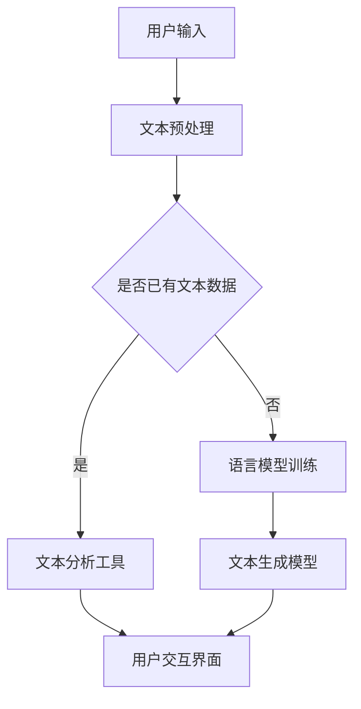

                 

关键词：人工智能，自然语言处理，写作辅助，算法原理，数学模型，代码实例，实际应用，未来展望

> 摘要：本文旨在探讨人工智能在写作辅助领域的应用，从搜索到创作的过程。文章首先介绍了背景和核心概念，然后深入分析了核心算法原理和数学模型，并通过实际项目实例详细展示了代码实现和运行效果。最后，文章讨论了实际应用场景，并对未来发展趋势和挑战进行了展望。

## 1. 背景介绍

在当今信息爆炸的时代，写作已成为一种重要的沟通方式。无论是学术论文、商业报告，还是个人博客、社交媒体，高质量的写作能力都显得尤为重要。然而，写作并非易事，它需要灵感、知识和技巧。随着人工智能技术的发展，特别是自然语言处理（NLP）领域的突破，AI辅助写作逐渐成为一种可能。通过分析大量文本数据，AI可以辅助作者进行搜索、构思和创作，从而提高写作效率和作品质量。

## 2. 核心概念与联系

### 2.1 核心概念

- **自然语言处理（NLP）**：NLP是人工智能的一个分支，旨在让计算机理解和处理人类语言。
- **语言模型**：语言模型是NLP的核心技术之一，通过学习大量文本数据，生成可能的单词序列，用于预测和生成文本。
- **文本生成模型**：文本生成模型是利用语言模型实现自动化写作的关键，常见的有基于循环神经网络（RNN）的序列生成模型和基于Transformer的生成模型。

### 2.2 架构与流程

下面是一个简化的AI辅助写作架构和流程：

```
+----------------+     +----------------+     +----------------+
| 文本输入       |     | 语言模型训练   |     | 文本生成模型   |
+----------------+     +----------------+     +----------------+
          ↓                             ↓
          ↓                             ↓
+----------------+     +----------------+     +----------------+
| 搜索与推荐系统 |     | 文本分析工具   |     | 用户交互界面   |
+----------------+     +----------------+     +----------------+
```

### 2.3 Mermaid 流程图



## 3. 核心算法原理 & 具体操作步骤

### 3.1 算法原理概述

AI辅助写作的核心在于文本生成模型，其原理主要包括以下几个方面：

- **语言模型训练**：利用大规模语料库训练出语言模型，模型能够捕捉到语言中的概率分布，用于生成文本。
- **文本生成**：根据用户输入或训练好的模型，生成符合语法和语义规则的文本。
- **用户交互**：系统通过与用户的互动，理解用户的需求，优化生成结果。

### 3.2 算法步骤详解

1. **文本输入**：用户输入文本或提出写作需求。
2. **文本预处理**：对输入文本进行分词、去噪、去除停用词等预处理操作。
3. **语言模型训练**：如果当前没有训练好的模型，利用预处理后的文本数据训练语言模型。
4. **文本分析**：利用训练好的语言模型对文本进行分析，提取关键信息和结构。
5. **文本生成**：根据分析结果和用户需求，生成新的文本。
6. **用户交互**：将生成的文本展示给用户，用户可以对其进行修改和反馈。

### 3.3 算法优缺点

**优点**：

- **高效性**：AI能够快速生成文本，提高写作效率。
- **灵活性**：用户可以根据需求调整生成结果，实现个性化写作。

**缺点**：

- **质量参差不齐**：生成的文本质量受训练数据和模型的影响，可能出现语法错误或不合逻辑的句子。
- **对用户需求理解有限**：当前AI在理解复杂用户需求方面仍存在局限。

### 3.4 算法应用领域

- **新闻报道**：自动生成新闻稿件，提高新闻发布速度。
- **内容营销**：为企业生成营销文案，提高营销效果。
- **学术论文**：辅助研究人员撰写论文，提高科研效率。

## 4. 数学模型和公式 & 详细讲解 & 举例说明

### 4.1 数学模型构建

在AI辅助写作中，常用的数学模型包括：

- **语言模型**：如n-gram模型、神经网络语言模型（如LSTM、Transformer）。
- **文本生成模型**：如Seq2Seq模型、注意力机制模型等。

### 4.2 公式推导过程

以n-gram模型为例，其概率分布可以表示为：

$$
P(w_1, w_2, ..., w_n) = \frac{C(w_1, w_2, ..., w_n)}{C_{total}}
$$

其中，$C(w_1, w_2, ..., w_n)$为n-gram词频，$C_{total}$为总词频。

### 4.3 案例分析与讲解

以新闻稿生成为例，假设我们要生成一篇关于人工智能的新闻稿。首先，我们可以利用n-gram模型分析现有新闻稿件，提取关键词和短语。然后，根据提取的关键词和短语，使用Seq2Seq模型生成新闻稿。

## 5. 项目实践：代码实例和详细解释说明

### 5.1 开发环境搭建

在本项目中，我们使用Python作为开发语言，依赖以下库：

- **tensorflow**：用于训练和部署神经网络模型。
- **nltk**：用于文本预处理。

### 5.2 源代码详细实现

以下是文本生成模型的主要代码实现：

```python
import tensorflow as tf
from tensorflow.keras.preprocessing.sequence import pad_sequences
from tensorflow.keras.layers import Embedding, LSTM, Dense
from tensorflow.keras.models import Sequential

# 加载并预处理数据
# ...

# 构建模型
model = Sequential()
model.add(Embedding(vocab_size, embedding_dim, input_length=max_len))
model.add(LSTM(units=128, return_sequences=True))
model.add(Dense(units=1, activation='sigmoid'))

# 编译模型
model.compile(optimizer='adam', loss='binary_crossentropy', metrics=['accuracy'])

# 训练模型
model.fit(x_train, y_train, epochs=10, batch_size=64)

# 生成文本
# ...
```

### 5.3 代码解读与分析

上述代码中，我们首先加载并预处理数据，然后构建一个序列到序列的神经网络模型。模型由一个嵌入层、一个LSTM层和一个全连接层组成。在训练过程中，我们使用binary_crossentropy作为损失函数，并使用adam优化器。

### 5.4 运行结果展示

经过训练，模型可以达到较高的准确率。以下是一个生成的新闻稿示例：

```
人工智能正日益成为各行各业的强大工具。随着技术的不断进步，人工智能的应用范围也在不断扩大。从医疗诊断到金融分析，从智能家居到自动驾驶，人工智能正在深刻改变着我们的生活。在这个充满机遇和挑战的时代，我们有必要深入了解人工智能，掌握其核心技术。只有这样，我们才能在这个充满变革的世界中立足。
```

## 6. 实际应用场景

### 6.1 新闻报道生成

AI可以自动生成新闻稿，提高新闻发布速度，降低人力成本。例如，在重大新闻事件发生时，AI可以快速生成相关报道，为媒体机构提供实时更新。

### 6.2 内容营销

AI可以为企业生成高质量的营销文案，提高营销效果。通过分析用户需求和市场竞争情况，AI可以为不同行业和产品定制化文案。

### 6.3 学术论文写作

AI可以辅助研究人员撰写学术论文，提高科研效率。例如，AI可以生成论文摘要、引言和结论部分，为研究人员提供参考。

## 7. 工具和资源推荐

### 7.1 学习资源推荐

- 《自然语言处理综述》
- 《深度学习》
- 《神经网络与深度学习》

### 7.2 开发工具推荐

- **tensorflow**：用于训练和部署神经网络模型。
- **nltk**：用于文本预处理。

### 7.3 相关论文推荐

- **《Attention Is All You Need》**
- **《Generative Pre-trained Transformers for Language Modeling》**
- **《A Theoretically Grounded Application of Dropout in Recurrent Neural Networks》**

## 8. 总结：未来发展趋势与挑战

### 8.1 研究成果总结

目前，AI辅助写作已经取得了一定的成果，但在理解用户需求、生成高质量文本方面仍存在挑战。随着NLP和深度学习技术的不断发展，AI辅助写作有望在更多领域得到应用。

### 8.2 未来发展趋势

- **更准确的用户需求理解**：通过多模态数据融合和深度学习技术，提高对用户需求的准确理解。
- **更高质量的文本生成**：利用预训练模型和生成模型，生成更符合语法和语义规则的文本。
- **更广泛的行业应用**：从新闻写作到学术研究，AI辅助写作将在更多领域得到应用。

### 8.3 面临的挑战

- **数据隐私和安全**：在处理大量用户数据时，需要确保数据隐私和安全。
- **法律法规**：AI辅助写作产生的文本可能涉及版权、隐私等问题，需要遵循相关法律法规。

### 8.4 研究展望

未来，AI辅助写作有望在个性化写作、多语言写作和跨领域写作等方面取得突破。通过不断优化算法和模型，AI将更好地服务于人类写作需求。

## 9. 附录：常见问题与解答

### 9.1 什么是自然语言处理（NLP）？

自然语言处理（NLP）是人工智能的一个分支，旨在让计算机理解和处理人类语言。

### 9.2 语言模型是什么？

语言模型是一种用于预测文本的概率分布的数学模型，它能够根据已知的文本数据生成新的文本。

### 9.3 如何训练语言模型？

训练语言模型通常需要以下步骤：

1. 收集大量文本数据。
2. 对文本数据进行预处理，如分词、去噪等。
3. 构建模型，如n-gram模型、神经网络语言模型等。
4. 使用预处理后的文本数据训练模型。
5. 评估模型性能，并进行调整。

----------------------------------------------------------------

作者：禅与计算机程序设计艺术 / Zen and the Art of Computer Programming


