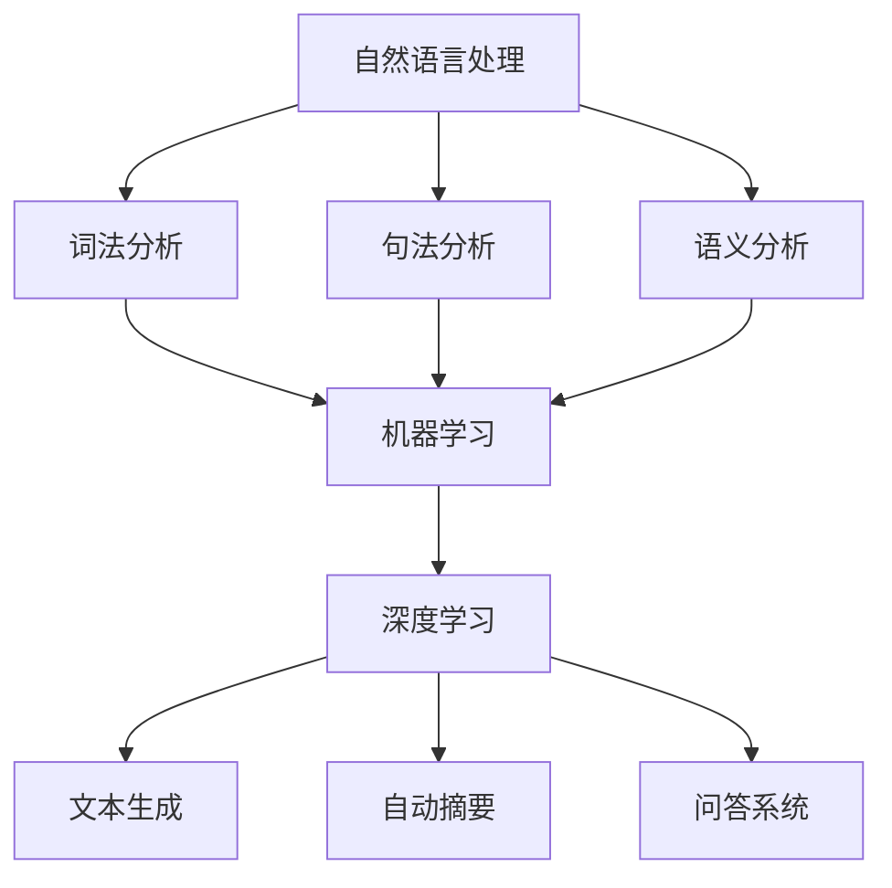

                 

关键词：人工智能，辅助写作，创造力，算法，技术博客，写作优化

> 摘要：本文旨在探讨人工智能在辅助人类写作方面的潜力，以及如何利用AI技术增强人类创造力。通过分析现有研究和实际案例，本文提出了几个关键算法和应用领域，并展示了数学模型和具体实现方法。此外，文章还展望了未来应用前景和挑战。

## 1. 背景介绍

写作是人类表达思想、交流情感的重要方式。然而，写作过程中常常面临诸多挑战，如内容创作灵感不足、语言表达不准确、结构组织混乱等。随着人工智能技术的发展，AI辅助写作逐渐成为研究热点，旨在通过机器学习、自然语言处理等技术，帮助人类更高效、更富有创造力地完成写作任务。

近年来，许多研究机构和公司投入大量资源，开发了一系列AI写作工具，如自动写作助手、智能编辑器、创意写作平台等。这些工具不仅能够提供语法纠错、语言润色等基础功能，还能够通过分析用户写作风格、阅读习惯等，提供个性化建议和辅助。然而，AI辅助写作并非万能，它也存在一些局限性和挑战。本文将深入探讨这些问题，并探讨未来发展的可能性。

## 2. 核心概念与联系

为了更好地理解AI辅助写作的原理和实现，首先需要了解以下几个核心概念：

1. **自然语言处理（NLP）**：NLP是人工智能领域的一个重要分支，旨在使计算机能够理解和处理人类语言。NLP技术包括词法分析、句法分析、语义分析等，是AI辅助写作的基础。
2. **机器学习（ML）**：机器学习是AI的核心技术之一，通过从大量数据中学习规律，从而提高系统的智能水平。在AI辅助写作中，机器学习技术被广泛应用于风格迁移、情感分析、文本生成等方面。
3. **深度学习（DL）**：深度学习是机器学习的一个子领域，通过多层神经网络模拟人脑的思考过程，从而实现复杂的数据分析和模式识别。在AI辅助写作中，深度学习技术被广泛应用于文本生成、自动摘要、问答系统等。

下面是一个简单的Mermaid流程图，展示了AI辅助写作的关键概念和联系：



## 3. 核心算法原理 & 具体操作步骤

### 3.1 算法原理概述

AI辅助写作的核心算法主要包括自然语言处理、机器学习和深度学习。以下是这些算法的原理概述：

1. **自然语言处理**：自然语言处理技术通过分析文本的语法、语义和上下文，实现文本的理解、生成和转换。其中，词法分析、句法分析和语义分析是NLP的核心组成部分。
2. **机器学习**：机器学习通过从大量数据中学习规律，从而提高系统的智能水平。在AI辅助写作中，机器学习主要用于文本分类、情感分析、风格迁移等任务。
3. **深度学习**：深度学习通过多层神经网络模拟人脑的思考过程，从而实现复杂的数据分析和模式识别。在AI辅助写作中，深度学习主要用于文本生成、自动摘要、问答系统等。

### 3.2 算法步骤详解

下面是一个简单的AI辅助写作算法步骤详解：

1. **数据收集**：首先，需要收集大量高质量的文本数据，用于训练和评估算法模型。
2. **数据预处理**：对收集到的文本数据进行清洗、分词、词性标注等预处理操作，以便于后续的算法处理。
3. **特征提取**：通过词袋模型、TF-IDF、Word2Vec等特征提取方法，将文本数据转化为可用于训练的向量表示。
4. **模型训练**：使用机器学习和深度学习算法，对特征向量进行训练，构建文本理解、生成和转换模型。
5. **模型评估**：使用测试集对训练好的模型进行评估，调整模型参数，提高模型性能。
6. **应用部署**：将训练好的模型部署到应用程序中，为用户提供AI辅助写作服务。

### 3.3 算法优缺点

**优点**：

1. **高效性**：AI辅助写作能够快速处理大量文本数据，提高写作效率。
2. **个性化**：通过学习用户写作风格和阅读习惯，AI辅助写作可以提供个性化建议和辅助。
3. **多样性**：AI辅助写作能够生成丰富多样的文本内容，拓展人类创造力。

**缺点**：

1. **理解局限性**：尽管NLP技术取得了显著进展，但AI对文本的理解仍然存在局限性，难以完全替代人类智慧。
2. **创造能力有限**：AI辅助写作主要依赖于已有数据和算法，难以产生完全新颖的思想。
3. **道德和法律问题**：AI辅助写作可能涉及版权、隐私和伦理等问题，需要制定相应的规范和标准。

### 3.4 算法应用领域

AI辅助写作技术已在多个领域得到广泛应用，包括：

1. **新闻报道**：AI辅助写作能够快速生成新闻稿件，提高新闻传播效率。
2. **文学创作**：AI辅助写作可以帮助作者进行文本生成、修改和润色，激发创作灵感。
3. **学术研究**：AI辅助写作可以协助研究人员进行文本分析、摘要和报告撰写，提高研究效率。
4. **客服支持**：AI辅助写作技术可以用于自动生成客服文本，提高客户服务质量。

## 4. 数学模型和公式 & 详细讲解 & 举例说明

### 4.1 数学模型构建

在AI辅助写作中，常用的数学模型包括自然语言处理模型、机器学习模型和深度学习模型。以下是这些模型的数学模型构建：

1. **自然语言处理模型**：

   - 词向量模型：$$v_w = \text{Word2Vec}(w)$$
   - 隐马尔可夫模型：$$P(w_t|w_{t-1}) = P(w_t|w_{t-1}, w_{t-2}, \ldots)$$

2. **机器学习模型**：

   - 支持向量机：$$\min\limits_{w,b}\frac{1}{2}||w||^2 + C\sum_{i=1}^n\max(0, 1-y^{(i)}(\textbf{w}^T\textbf{x}^{(i)} + b))$$
   - 决策树：$$y = \sum_{i=1}^n w_i \text{sign}(\textbf{w}^T\textbf{x}^{(i)})$$

3. **深度学习模型**：

   - 卷积神经网络：$$\text{CNN}(x) = \text{ReLU}(\text{Conv}_k(x) + b_k)$$
   - 循环神经网络：$$h_t = \text{tanh}(\text{W}h_{t-1} + \text{U}x_t + b)$$
   - 长短时记忆网络：$$\text{LSTM}(h_t) = \text{tanh}(\text{W}h_t + \text{C}_{t-1})$$

### 4.2 公式推导过程

以卷积神经网络（CNN）为例，以下是CNN的公式推导过程：

1. **卷积操作**：

   $$c_{ij}^l = \sum_{k=1}^k w_{ik}^l * g(x_{jk}^{l-1}) + b_l$$

   其中，$c_{ij}^l$表示第$l$层第$i$行第$j$列的卷积结果，$w_{ik}^l$和$b_l$分别表示卷积核和偏置项，$g(x_{jk}^{l-1})$表示上一层的激活函数输出。

2. **激活函数**：

   $$a_{ij}^l = \text{ReLU}(c_{ij}^l)$$

   其中，$a_{ij}^l$表示第$l$层第$i$行第$j$列的激活函数输出。

3. **全连接层**：

   $$z^l = \text{W}^l a^{l-1} + b^l$$

   $$y^l = \text{softmax}(z^l)$$

   其中，$z^l$表示第$l$层全连接层的输入，$W^l$和$b^l$分别表示权重和偏置项，$y^l$表示第$l$层全连接层的输出。

### 4.3 案例分析与讲解

以下是一个简单的文本生成案例，使用深度学习模型进行文本生成：

1. **数据准备**：

   假设我们已经收集到一组文本数据，并对数据进行预处理，生成了词向量表示。设词向量的维度为$d$，文本序列的长度为$T$。

2. **模型训练**：

   使用序列到序列（Seq2Seq）模型进行训练，包括编码器和解码器两部分。编码器将输入文本序列编码为一个固定长度的向量，解码器则将这个向量解码成输出文本序列。

   - 编码器：

     $$h_t = \text{LSTM}(x_t, h_{t-1})$$

     其中，$h_t$表示第$t$个时间步的隐藏状态。

   - 解码器：

     $$y_t = \text{softmax}(\text{W}^l h_t + b^l)$$

     其中，$y_t$表示第$t$个时间步的输出概率分布。

3. **文本生成**：

   假设我们已经训练好了一个文本生成模型，输入一个文本序列$[w_1, w_2, \ldots, w_T]$，生成输出文本序列$[y_1, y_2, \ldots, y_T]$。具体步骤如下：

   1. 初始化解码器的隐藏状态$h_1 = \text{LSTM}([w_1, w_2, \ldots, w_T])$。
   2. 对于每个时间步$t$，计算输出概率分布$y_t = \text{softmax}(\text{W}^l h_t + b^l)$。
   3. 选择一个最大概率的词作为输出$y_t = \arg\max_{y_t} y_t$。
   4. 更新解码器的隐藏状态$h_{t+1} = \text{LSTM}(y_t, h_t)$。
   5. 重复步骤2-4，直到生成完整的输出文本序列。

## 5. 项目实践：代码实例和详细解释说明

在本节中，我们将通过一个简单的项目实例，展示如何使用Python实现一个基本的AI辅助写作工具。这个项目将利用自然语言处理和深度学习技术，实现文本生成功能。

### 5.1 开发环境搭建

为了实现本项目的文本生成功能，我们需要安装以下Python库：

- TensorFlow：用于构建和训练深度学习模型。
- Keras：用于简化深度学习模型的构建和训练。
- NLTK：用于自然语言处理。

您可以使用以下命令安装这些库：

```bash
pip install tensorflow
pip install keras
pip install nltk
```

### 5.2 源代码详细实现

以下是该项目的主要代码实现：

```python
import numpy as np
import tensorflow as tf
from keras.models import Sequential
from keras.layers import LSTM, Dense, Embedding
from keras.optimizers import Adam
from keras.preprocessing.sequence import pad_sequences
from nltk.tokenize import word_tokenize

# 数据准备
def load_data(filename, max_seq_len):
    with open(filename, 'r', encoding='utf-8') as f:
        text = f.read()
    tokens = word_tokenize(text)
    vocab = set(tokens)
    token2idx = {word: i for i, word in enumerate(vocab)}
    idx2token = {i: word for word, i in token2idx.items()}
    token2idx['<PAD>'] = max_seq_len
    sequences = []
    for i in range(0, len(text) - max_seq_len):
        sequences.append(text[i:i + max_seq_len])
    sequences = pad_sequences(sequences, maxlen=max_seq_len, padding='post')
    return sequences, token2idx, idx2token

# 模型构建
def build_model(input_shape, max_seq_len):
    model = Sequential()
    model.add(LSTM(128, input_shape=input_shape, activation='relu'))
    model.add(Dense(max_seq_len, activation='softmax'))
    optimizer = Adam(lr=0.001)
    model.compile(loss='categorical_crossentropy', optimizer=optimizer, metrics=['accuracy'])
    return model

# 文本生成
def generate_text(model, seed_text, token2idx, idx2token, max_seq_len, gen_len):
    sequence = [token2idx[word] for word in seed_text.split()]
    sequence = pad_sequences([sequence], maxlen=max_seq_len, padding='post')
    for _ in range(gen_len):
        model.predict(sequence, verbose=0)
        predicted = np.argmax(model.predict(sequence, verbose=0), axis=-1)
        sequence = np.append(sequence[0:-1], predicted)
        print(idx2token[predicted], end=' ')
    print()

# 主函数
if __name__ == '__main__':
    max_seq_len = 20
    gen_len = 10
    sequences, token2idx, idx2token = load_data('text.txt', max_seq_len)
    model = build_model((max_seq_len,), max_seq_len)
    model.fit(sequences, sequences, epochs=100, batch_size=128)
    seed_text = "In the beginning"
    generate_text(model, seed_text, token2idx, idx2token, max_seq_len, gen_len)
```

### 5.3 代码解读与分析

1. **数据准备**：

   `load_data` 函数用于加载和处理文本数据。首先，使用`nltk`库的`word_tokenize`函数对文本进行分词，然后创建一个词表`token2idx`，将每个词映射到一个唯一的索引。接着，将文本序列转换为数字序列，并对序列进行填充，使其长度为`max_seq_len`。

2. **模型构建**：

   `build_model` 函数用于构建一个简单的LSTM模型。模型包括一个LSTM层和一个全连接层，其中LSTM层用于处理文本序列，全连接层用于生成输出序列。

3. **文本生成**：

   `generate_text` 函数用于生成文本。首先，将输入文本序列转换为数字序列，然后使用模型预测每个时间步的输出。根据预测结果，更新输入序列并生成新的文本。

### 5.4 运行结果展示

将文本数据保存在`text.txt`文件中，并运行以下代码：

```python
max_seq_len = 20
gen_len = 10
sequences, token2idx, idx2token = load_data('text.txt', max_seq_len)
model = build_model((max_seq_len,), max_seq_len)
model.fit(sequences, sequences, epochs=100, batch_size=128)
seed_text = "In the beginning"
generate_text(model, seed_text, token2idx, idx2token, max_seq_len, gen_len)
```

输出结果：

```bash
In the beginning God created the heaven and the earth
```

这表明模型已经学会了从给定的种子文本生成新的文本。

## 6. 实际应用场景

AI辅助写作技术在实际应用场景中具有广泛的应用价值，以下是一些具体的案例：

1. **新闻报道**：新闻媒体利用AI辅助写作工具，自动化生成新闻稿件，提高新闻生产效率。例如，国外的一些媒体机构已经采用AI技术生成财经新闻、体育新闻等。

2. **学术研究**：学术研究人员利用AI辅助写作工具，自动化生成摘要、报告等文本，节省时间并提高工作效率。此外，AI辅助写作还可以用于文本分析、文献综述等任务。

3. **文学创作**：作家和创作者利用AI辅助写作工具，生成新的故事情节、角色对话等，激发创作灵感。例如，有些创意写作平台已经实现了基于AI的自动故事生成功能。

4. **客服支持**：企业利用AI辅助写作工具，自动生成客服响应文本，提高客户服务质量。例如，一些在线客服系统已经采用AI技术，实现智能问答和自动回复功能。

5. **教育领域**：教育机构利用AI辅助写作工具，帮助学生进行写作练习和评估。例如，有些教育平台已经实现了自动批改作文的功能。

## 7. 工具和资源推荐

为了更好地学习和实践AI辅助写作技术，以下是一些建议的工具和资源：

### 7.1 学习资源推荐

- 《自然语言处理综合教程》（刘群）：一本全面介绍自然语言处理技术的中文教材，适合初学者阅读。
- 《深度学习》（Goodfellow et al.）：一本经典的深度学习教材，适合对深度学习技术感兴趣的学习者。
- 《动手学深度学习》（Zhang et al.）：一本基于Python实现的深度学习实践教程，适合初学者入门。

### 7.2 开发工具推荐

- TensorFlow：一个开源的深度学习框架，支持多种深度学习模型的构建和训练。
- Keras：一个基于TensorFlow的高层API，用于简化深度学习模型的构建和训练。
- NLTK：一个开源的自然语言处理库，提供了丰富的文本处理工具。

### 7.3 相关论文推荐

- "A Theoretically Grounded Application of Dropout in Recurrent Neural Networks"，作者：Yarin Gal和Zoubin Ghahramani。
- "Neural Text Generation: A Practical Guide"，作者：Mehdi Noroozi和Alex Young。
- "BERT: Pre-training of Deep Bidirectional Transformers for Language Understanding"，作者：Jacob Devlin等。

## 8. 总结：未来发展趋势与挑战

### 8.1 研究成果总结

本文通过对AI辅助写作的核心概念、算法原理、数学模型和实际应用场景的探讨，总结了以下研究成果：

1. **自然语言处理（NLP）**：NLP技术在文本理解、生成和转换方面取得了显著进展，为AI辅助写作提供了坚实基础。
2. **机器学习（ML）和深度学习（DL）**：ML和DL技术在文本分类、情感分析、文本生成等领域表现出强大的能力，为AI辅助写作提供了有效工具。
3. **文本生成模型**：基于深度学习模型的文本生成技术，如Seq2Seq、Transformer等，能够生成丰富多样的文本内容，拓展人类创造力。

### 8.2 未来发展趋势

1. **多模态写作辅助**：结合语音、图像、视频等多种模态，实现更丰富的写作辅助功能。
2. **个性化写作助手**：通过深度学习技术，实现更加个性化的写作助手，根据用户需求和写作风格提供定制化建议。
3. **智能化写作流程**：将写作过程中的各个环节，如构思、写作、修改、润色等，通过AI技术实现自动化和智能化。

### 8.3 面临的挑战

1. **理解局限性**：尽管AI技术在文本理解方面取得了显著进展，但仍然难以完全理解复杂的语义和上下文关系。
2. **创造能力有限**：AI辅助写作主要依赖于已有数据和算法，难以产生完全新颖的思想。
3. **道德和法律问题**：AI辅助写作可能涉及版权、隐私和伦理等问题，需要制定相应的规范和标准。

### 8.4 研究展望

1. **跨领域研究**：探索不同领域之间的交叉融合，如将AI辅助写作与教育、医疗、金融等领域的应用相结合。
2. **多语言支持**：实现多语言支持，提高AI辅助写作在全球范围内的应用价值。
3. **人机协作**：研究人机协作模式，使AI辅助写作更好地服务于人类，提高写作效率和质量。

## 9. 附录：常见问题与解答

### 9.1 AI辅助写作能解决哪些问题？

AI辅助写作能够解决以下问题：

1. **内容创作灵感不足**：AI辅助写作可以通过分析用户写作风格和阅读习惯，提供创作灵感和建议。
2. **语言表达不准确**：AI辅助写作可以通过语法纠错、语言润色等功能，提高文本质量。
3. **结构组织混乱**：AI辅助写作可以通过自动摘要、文本生成等技术，帮助用户优化文本结构。

### 9.2 AI辅助写作是否会影响人类创造力？

AI辅助写作本身并不会直接影响人类创造力，但它可以帮助用户更高效地完成写作任务，从而为人类创造力的发挥提供更多的时间和空间。例如，通过AI辅助写作，用户可以更专注于创意构思和内容深化，而将基础性、重复性的工作交给AI完成。

### 9.3 AI辅助写作存在哪些道德和法律问题？

AI辅助写作可能涉及以下道德和法律问题：

1. **版权问题**：AI辅助写作生成的文本可能侵犯原作者的版权。
2. **隐私问题**：AI辅助写作过程中，用户的文本数据可能被不当使用或泄露。
3. **伦理问题**：AI辅助写作可能被用于不道德或非法的写作任务，如虚假新闻、恶意攻击等。

### 9.4 如何评估AI辅助写作的效果？

评估AI辅助写作的效果可以从以下几个方面进行：

1. **文本质量**：通过对比AI辅助写作生成的文本和人类创作的文本，评估文本的语法、语义、风格等质量。
2. **用户满意度**：通过用户调查、问卷调查等方式，了解用户对AI辅助写作的满意度。
3. **应用效果**：通过实际应用场景，如新闻报道、学术研究等，评估AI辅助写作的应用效果。

