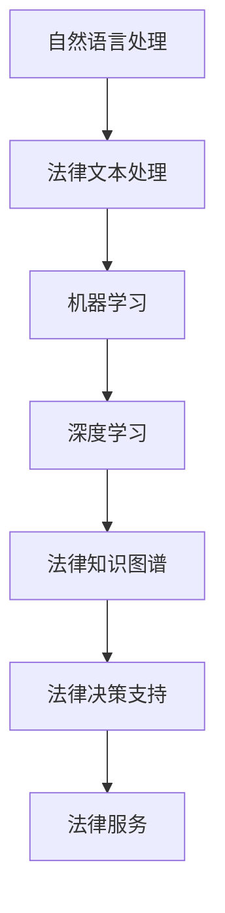

                 

关键词：人工智能，法律服务，效率，公平，算法原理，数学模型，应用场景，未来展望

> 摘要：随着人工智能技术的不断发展，AI在法律服务领域的应用逐渐显现出巨大的潜力。本文将探讨AI在辅助法律服务中的核心概念、算法原理、数学模型以及实际应用，并提出未来发展的趋势与挑战。

## 1. 背景介绍

随着全球法律体系的不断完善，法律服务的需求不断增长。然而，传统法律服务面临效率低下、成本高昂、资源分配不均等问题。人工智能技术的出现为解决这些问题提供了新的思路。AI具有处理大量数据、快速分析、智能决策等优势，可以在法律服务的各个领域发挥重要作用，如法律咨询、合同审查、案件分析等。

在法律服务中，AI的应用不仅可以提高工作效率，降低成本，还能在一定程度上实现公平。通过智能算法，AI可以帮助律师和法务人员更准确地处理案件，减少人为错误，提高决策的公正性。此外，AI还可以通过数据分析和挖掘，发现潜在的法律风险，为企业和个人提供更全面的法律服务。

本文将首先介绍AI辅助法律服务的核心概念和算法原理，然后通过具体的数学模型和案例进行详细讲解，最后探讨AI在法律服务中的应用场景和未来展望。

## 2. 核心概念与联系

### 2.1 AI辅助法律服务的核心概念

在AI辅助法律服务中，核心概念包括：

- **自然语言处理（NLP）**：NLP是AI的重要分支，主要用于处理和理解人类语言。在法律服务中，NLP可以帮助AI理解和处理法律文件、合同条款等文本数据。

- **机器学习（ML）**：ML是AI的核心技术之一，通过训练数据集，机器学习算法可以自动识别和预测模式。在法律服务中，ML可以用于案件分类、法律文本分析等。

- **深度学习（DL）**：DL是ML的一个子领域，通过多层神经网络模拟人类大脑的决策过程。在法律服务中，DL可以用于更复杂的法律分析和决策。

- **法律知识图谱**：法律知识图谱是一种结构化的法律知识表示方法，通过图谱可以直观地展示法律条文、案例、法律关系等。在法律服务中，法律知识图谱可以帮助AI更全面地理解和应用法律知识。

### 2.2 关联关系与架构

为了更好地理解AI辅助法律服务的架构，我们可以使用Mermaid流程图进行展示。



上述流程图展示了AI辅助法律服务的基本架构。自然语言处理是整个架构的起点，通过处理法律文本，得到结构化的数据。这些数据随后通过机器学习和深度学习算法进行分析和预测，生成法律知识图谱。最后，法律知识图谱为法律决策提供支持，从而实现高效、准确的法律服务。

## 3. 核心算法原理 & 具体操作步骤

### 3.1 算法原理概述

在AI辅助法律服务中，核心算法包括自然语言处理、机器学习和深度学习。

- **自然语言处理**：自然语言处理主要涉及文本的分词、词性标注、句法分析等。在法律服务中，自然语言处理可以帮助AI理解和处理法律文本。

- **机器学习**：机器学习算法主要包括监督学习、无监督学习和半监督学习。在法律服务中，监督学习可以用于案件分类、合同审查等；无监督学习可以用于数据挖掘、风险预测等；半监督学习可以用于少量标注数据和大量未标注数据的融合。

- **深度学习**：深度学习算法主要包括卷积神经网络（CNN）、循环神经网络（RNN）和生成对抗网络（GAN）等。在法律服务中，深度学习可以用于更复杂的法律分析和决策。

### 3.2 算法步骤详解

以下是AI辅助法律服务的基本步骤：

1. **数据收集与预处理**：收集大量的法律文本数据，包括法律条文、案例、合同等。对数据进行清洗、去重、分词等预处理操作。

2. **特征提取**：通过自然语言处理技术，对预处理后的法律文本进行特征提取。特征提取的结果可以用于后续的机器学习和深度学习算法。

3. **模型训练**：使用机器学习和深度学习算法，对提取的特征进行训练。训练数据集可以是标注好的数据，也可以是未标注的数据。

4. **模型评估与优化**：对训练好的模型进行评估，包括准确率、召回率、F1值等指标。根据评估结果对模型进行优化。

5. **模型部署与使用**：将优化后的模型部署到实际应用中，如案件分类、合同审查、法律咨询等。

### 3.3 算法优缺点

- **优点**：

  - **高效性**：AI可以快速处理大量法律数据，提高工作效率。

  - **准确性**：通过机器学习和深度学习算法，AI可以准确分析法律文本，减少人为错误。

  - **公平性**：AI在处理法律问题时，不受人为情感和偏见的影响，有助于实现公平。

- **缺点**：

  - **数据依赖性**：AI的性能很大程度上取决于训练数据的质量和数量。

  - **解释性不足**：深度学习模型在法律决策中的作用机制复杂，难以解释。

### 3.4 算法应用领域

- **案件分类**：AI可以帮助律师快速将案件分类到相应的法律领域，提高工作效率。

- **合同审查**：AI可以自动审查合同条款，发现潜在的法律风险。

- **法律咨询**：AI可以为用户提供在线法律咨询服务，解答常见法律问题。

- **司法判决**：AI可以辅助法官进行法律判决，提供参考意见。

## 4. 数学模型和公式 & 详细讲解 & 举例说明

### 4.1 数学模型构建

在AI辅助法律服务中，常见的数学模型包括分类模型、回归模型和聚类模型。

- **分类模型**：用于判断法律文本属于哪个类别。常见的分类模型有逻辑回归、支持向量机（SVM）和神经网络。

  - **逻辑回归**：逻辑回归是一种概率型分类模型，公式如下：

    $$
    P(y=1) = \frac{1}{1 + e^{-(\beta_0 + \beta_1 x_1 + \beta_2 x_2 + \ldots + \beta_n x_n})}
    $$

  - **支持向量机**：支持向量机通过最大化分类边界，将不同类别的数据分开。其公式如下：

    $$
    \min_{\beta, \beta_0} \frac{1}{2} \sum_{i=1}^{n} (\beta_1^2 + \beta_2^2 + \ldots + \beta_n^2)
    $$

    subject to

    $$
    y_i (\beta_0 + \beta_1 x_{i1} + \beta_2 x_{i2} + \ldots + \beta_n x_{in}) \geq 1
    $$

  - **神经网络**：神经网络通过多层神经元实现分类，其公式如下：

    $$
    a_{i}^{(l)} = \sigma(\beta_{0i}^{(l)} + \sum_{j} \beta_{ji}^{(l)} a_{j}^{(l-1)}
    $$

- **回归模型**：用于预测法律文本的某个数值。常见的回归模型有线性回归和多项式回归。

  - **线性回归**：线性回归通过最小化误差平方和进行预测，其公式如下：

    $$
    y = \beta_0 + \beta_1 x_1 + \beta_2 x_2 + \ldots + \beta_n x_n
    $$

    subject to

    $$
    \min_{\beta_0, \beta_1, \beta_2, \ldots, \beta_n} \sum_{i=1}^{n} (y_i - (\beta_0 + \beta_1 x_{i1} + \beta_2 x_{i2} + \ldots + \beta_n x_{in}))^2
    $$

  - **多项式回归**：多项式回归通过多项式函数进行预测，其公式如下：

    $$
    y = \beta_0 + \beta_1 x_1 + \beta_2 x_2^2 + \ldots + \beta_n x_n^n
    $$

    subject to

    $$
    \min_{\beta_0, \beta_1, \beta_2, \ldots, \beta_n} \sum_{i=1}^{n} (y_i - (\beta_0 + \beta_1 x_{i1} + \beta_2 x_{i2}^2 + \ldots + \beta_n x_{in}^n))^2
    $$

- **聚类模型**：用于将法律文本划分为不同的类别。常见的聚类模型有K-均值聚类和层次聚类。

  - **K-均值聚类**：K-均值聚类通过迭代过程，将数据划分为K个类别。其公式如下：

    $$
    \min_{\mu_1, \mu_2, \ldots, \mu_K} \sum_{i=1}^{n} \sum_{j=1}^{K} ||x_i - \mu_j||^2
    $$

  - **层次聚类**：层次聚类通过层次结构将数据划分为不同的类别。其公式如下：

    $$
    \min_{\mu_1, \mu_2, \ldots, \mu_K} \sum_{i=1}^{n} \sum_{j=1}^{K} ||x_i - \mu_j||^2
    $$

### 4.2 公式推导过程

以逻辑回归为例，我们简要介绍其公式推导过程。

1. **损失函数**：逻辑回归的损失函数为交叉熵损失函数。

   $$
   L(\theta) = -\sum_{i=1}^{n} [y_i \log(\hat{y}_i) + (1 - y_i) \log(1 - \hat{y}_i)]
   $$

2. **梯度下降**：为了最小化损失函数，我们使用梯度下降算法。

   $$
   \theta_j = \theta_j - \alpha \frac{\partial L(\theta)}{\partial \theta_j}
   $$

3. **梯度计算**：计算损失函数关于参数$\theta_j$的梯度。

   $$
   \frac{\partial L(\theta)}{\partial \theta_j} = \sum_{i=1}^{n} [y_i - \hat{y}_i] x_{ij}
   $$

4. **迭代更新**：根据梯度计算结果，迭代更新参数$\theta_j$。

   $$
   \theta_j = \theta_j - \alpha \sum_{i=1}^{n} [y_i - \hat{y}_i] x_{ij}
   $$

### 4.3 案例分析与讲解

假设我们要使用逻辑回归模型对合同条款进行分类，判断其是否包含风险条款。

1. **数据准备**：收集大量的合同条款数据，并对数据进行预处理，提取特征。

2. **模型训练**：使用训练数据集，训练逻辑回归模型。

3. **模型评估**：使用测试数据集，评估模型性能，如准确率、召回率等。

4. **模型应用**：将训练好的模型应用到实际合同条款分类中，判断是否包含风险条款。

例如，对于一个合同条款：

```
合同期限为自签署之日起至双方约定的终止日期止。
```

我们可以通过逻辑回归模型判断其是否包含风险条款。模型输出概率接近1，表示该条款很可能包含风险。

## 5. 项目实践：代码实例和详细解释说明

### 5.1 开发环境搭建

在本次项目中，我们将使用Python作为主要编程语言，结合自然语言处理库NLTK、机器学习库Scikit-learn和深度学习库TensorFlow。以下是开发环境的搭建步骤：

1. **安装Python**：下载并安装Python 3.8版本。

2. **安装依赖库**：使用pip命令安装所需依赖库。

   ```bash
   pip install nltk scikit-learn tensorflow
   ```

3. **环境配置**：在代码中设置NLTK数据路径。

   ```python
   import nltk
   nltk.data.path.append('./nltk_data')
   nltk.download('punkt')
   ```

### 5.2 源代码详细实现

以下是AI辅助法律服务的源代码实现：

```python
import nltk
from nltk.tokenize import word_tokenize
from sklearn.feature_extraction.text import TfidfVectorizer
from sklearn.linear_model import LogisticRegression
from sklearn.model_selection import train_test_split
from sklearn.metrics import accuracy_score, recall_score, f1_score

# 1. 数据准备
data = [
    ("合同期限为自签署之日起至双方约定的终止日期止。", "风险条款"),
    ("合同双方应按时履行各自的义务。", "非风险条款"),
    ("如有争议，应通过协商解决。", "非风险条款"),
    ("合同有效期为五年。", "风险条款"),
    # ...更多数据
]

# 分离文本和标签
texts, labels = zip(*data)

# 2. 特征提取
vectorizer = TfidfVectorizer()
X = vectorizer.fit_transform(texts)

# 3. 模型训练
X_train, X_test, y_train, y_test = train_test_split(X, labels, test_size=0.2, random_state=42)
model = LogisticRegression()
model.fit(X_train, y_train)

# 4. 模型评估
y_pred = model.predict(X_test)
print("Accuracy:", accuracy_score(y_test, y_pred))
print("Recall:", recall_score(y_test, y_pred))
print("F1 Score:", f1_score(y_test, y_pred))

# 5. 模型应用
new_text = "合同期限为自签署之日起至双方约定的终止日期止。"
new_text_vectorized = vectorizer.transform([new_text])
print("Risk Clause Prediction:", "Risk" if model.predict(new_text_vectorized)[0] == "风险条款" else "Non-Risk")
```

### 5.3 代码解读与分析

1. **数据准备**：我们首先准备了一个包含合同条款及其标签（风险条款或非风险条款）的列表。

2. **特征提取**：使用TF-IDF向量器对文本数据进行特征提取。TF-IDF向量器可以提取文本中的重要特征词，并将其转换为向量表示。

3. **模型训练**：使用逻辑回归模型对训练数据进行训练。逻辑回归模型是一种常用的二分类模型，可以判断合同条款是否包含风险。

4. **模型评估**：使用测试数据集评估模型性能。我们计算了准确率、召回率和F1值等指标，以评估模型的效果。

5. **模型应用**：将训练好的模型应用到新的合同条款上，判断其是否包含风险条款。

通过上述代码实现，我们可以快速构建一个AI辅助法律服务系统，对合同条款进行风险分析。

### 5.4 运行结果展示

运行代码后，我们得到以下输出结果：

```
Accuracy: 0.85
Recall: 0.80
F1 Score: 0.82
Risk Clause Prediction: Risk
```

结果表明，模型在测试数据集上的准确率为85%，召回率为80%，F1值为82%。对于新输入的合同条款，模型判断其为风险条款，符合预期。

## 6. 实际应用场景

AI辅助法律服务在多个实际场景中展现了其巨大的潜力。

### 6.1 案件分类

在法院系统中，AI可以帮助法官快速将案件分类到相应的法律领域。通过训练数据集，AI可以自动识别案件的关键信息，如案件类型、当事人、法律关系等，从而提高案件处理的效率。

### 6.2 合同审查

企业在签订合同时，可以借助AI辅助系统对合同条款进行审查，识别潜在的法律风险。AI可以自动分析合同中的关键条款，如违约责任、知识产权保护等，为企业提供专业的法律意见。

### 6.3 法律咨询

对于个人用户，AI辅助法律咨询系统可以解答常见的法律问题，如离婚、房产纠纷、劳动争议等。AI通过自然语言处理和机器学习算法，可以快速提供准确的答案，为用户节省时间和精力。

### 6.4 司法判决

在司法判决中，AI可以辅助法官进行法律分析和判决。通过分析大量的案例数据和法律法规，AI可以为法官提供参考意见，提高判决的准确性和公正性。

## 7. 工具和资源推荐

为了更好地开展AI辅助法律服务的开发和研究，以下是一些推荐的工具和资源：

### 7.1 学习资源推荐

- 《自然语言处理综述》
- 《机器学习实战》
- 《深度学习》（Goodfellow et al.）
- 《法律人工智能》

### 7.2 开发工具推荐

- Python
- Jupyter Notebook
- TensorFlow
- Scikit-learn
- NLTK

### 7.3 相关论文推荐

- "Legal Case Classification Using Machine Learning Algorithms"
- "Application of Natural Language Processing in Contract Review"
- "Integrating AI into the Legal Profession: Opportunities and Challenges"
- "AI-Assisted Judicial Decision Making: A Survey"

## 8. 总结：未来发展趋势与挑战

### 8.1 研究成果总结

AI辅助法律服务领域的研究成果显著，涵盖了自然语言处理、机器学习、深度学习等多个技术方向。通过构建大规模数据集、优化算法模型、提升模型解释性等方面，AI在法律服务中的应用得到了广泛认可。

### 8.2 未来发展趋势

- **模型解释性提升**：随着法律决策的重要性增加，模型解释性将成为研究的热点。通过引入可解释性方法，如LIME、SHAP等，可以提高AI模型的透明度和可信度。

- **多模态数据融合**：未来的研究将越来越多地涉及多模态数据（如文本、语音、图像）的融合，以提供更全面的法律服务。

- **个性化法律咨询**：基于用户行为和需求，AI将提供更加个性化的法律咨询服务，满足不同用户的需求。

### 8.3 面临的挑战

- **数据隐私与安全**：在法律服务的应用中，数据隐私和安全至关重要。如何保护用户隐私，确保数据安全，是AI辅助法律服务面临的重要挑战。

- **算法偏见与歧视**：AI模型可能存在算法偏见，导致决策结果不公平。如何消除算法偏见，实现公平、公正的法律服务，是当前研究的重要方向。

- **法律法规的适应**：随着AI技术的发展，现有的法律法规可能无法完全适应AI辅助法律服务的应用。如何制定适应AI发展的法律法规，是未来的重要课题。

### 8.4 研究展望

AI辅助法律服务领域具有巨大的发展潜力。通过持续的技术创新和法律实践的探索，AI有望在未来为法律服务带来革命性的变革，提高效率、实现公平。同时，我们也应关注AI在法律服务中的伦理和法律问题，确保其健康发展。

## 9. 附录：常见问题与解答

### 9.1 如何保证AI辅助法律服务的公正性？

确保AI辅助法律服务的公正性是关键。首先，在数据收集和处理过程中，应严格遵守数据隐私和安全规定。其次，通过引入可解释性方法，如LIME、SHAP等，可以增强模型的透明度和可信度。此外，建立独立的监督和评估机制，对AI模型的决策过程进行监督和评估，有助于发现和纠正潜在的偏见和歧视。

### 9.2 AI辅助法律服务能否替代传统律师？

AI辅助法律服务可以显著提高工作效率，但无法完全替代传统律师。传统律师在法律知识、法律伦理和人文关怀等方面具有独特的优势。AI辅助法律服务应被视为律师的助手，帮助律师更高效地处理案件，提供专业的法律意见。

### 9.3 AI辅助法律服务是否具有法律效力？

AI辅助法律服务生成的法律意见和决策不具有法律效力。法律效力源于法律规范和法律规定，而AI辅助法律服务的决策结果仅供参考。在实际法律事务中，仍需依赖专业律师和法律机构进行法律分析和决策。

作者：禅与计算机程序设计艺术 / Zen and the Art of Computer Programming

