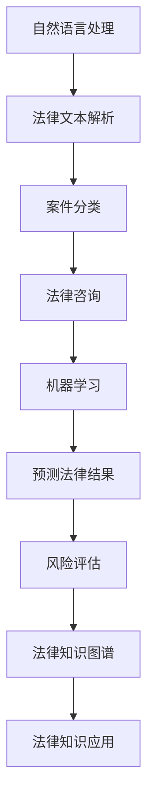

                 

在现代社会中，法律服务对于保障社会公平和正义具有重要意义。然而，随着法律案件的不断增加和法律知识的复杂性，传统的法律服务模式面临着效率低下和资源分配不均的问题。为了应对这些挑战，人工智能（AI）技术被引入到法律服务的各个环节，旨在提高效率、降低成本，并促进法律的普及与公平。本文将探讨AI辅助法律服务的核心概念、算法原理、数学模型、实践应用以及未来展望。

## 关键词

- 人工智能
- 法律服务
- 效率
- 公平
- 法律知识图谱

## 摘要

本文首先介绍了AI辅助法律服务的发展背景，阐述了其在提高法律案件处理效率、优化法律资源分配、普及法律知识等方面的潜力。接着，本文详细分析了AI辅助法律服务的核心概念，包括自然语言处理、机器学习、法律知识图谱等。随后，文章探讨了AI辅助法律服务的算法原理，包括案件分类、法律文本解析、法律咨询等。在此基础上，本文通过数学模型和具体案例，详细讲解了AI辅助法律服务的实施过程。最后，文章提出了AI辅助法律服务的未来发展方向，并对其面临的挑战进行了深入分析。

### 1. 背景介绍

随着全球经济的快速发展，社会纠纷和法律案件数量逐年攀升。据统计，美国每年处理的法律案件数量超过1亿件，其中绝大部分案件由律师和法院处理。然而，传统的法律服务模式存在着明显的不足，包括处理效率低下、成本高昂、法律资源分配不均等问题。特别是在一些发展中国家和地区，法律服务的不平等现象更为严重。

传统的法律服务模式主要依赖于律师的个人经验和专业知识，这不仅导致法律服务的成本较高，而且很难保证案件处理的公正性和效率。此外，法律知识的更新速度非常快，律师需要不断学习和更新知识，以便应对不断变化的法律法规。这种知识更新压力使得律师难以全身心地投入到每一个案件的处理中。

为了解决这些问题，人工智能技术被引入到法律服务的各个环节。AI能够通过大量数据的学习和分析，快速处理复杂案件，提供高质量的咨询服务。此外，AI技术还可以实现法律知识的自动化更新和普及，使得更多人群能够享受到优质的法律服务。

目前，AI辅助法律服务已经在多个领域取得了显著成果。例如，在法律文本解析方面，AI可以通过自然语言处理技术，快速提取法律文件中的关键信息，并提供相关法律条款的解释。在法律咨询方面，AI可以通过智能问答系统，为用户提供即时的法律咨询服务。在案件分类方面，AI可以通过机器学习算法，对大量案件数据进行分类和预测，提高案件处理的准确性和效率。

总的来说，AI辅助法律服务不仅能够提高法律案件处理的效率，降低法律服务的成本，还能促进法律知识的普及和公平。本文将深入探讨AI辅助法律服务的核心概念、算法原理和实践应用，为读者提供全面的技术解读。

### 2. 核心概念与联系

#### 2.1 自然语言处理（NLP）

自然语言处理是AI辅助法律服务的核心技术之一，它涉及到计算机对人类自然语言的识别、理解和生成。在法律服务中，NLP技术主要用于处理法律文本，包括法律文件、合同、判决书等。通过NLP，AI可以提取法律文本中的关键信息，如人名、地名、法律条款等，并对其进行结构化处理，以便进一步分析和应用。

#### 2.2 机器学习（ML）

机器学习是AI的重要组成部分，它使得计算机能够通过数据和经验进行学习，从而做出预测和决策。在法律服务中，机器学习技术被广泛应用于案件分类、预测法律结果、风险评估等方面。通过训练大量案例数据，机器学习模型可以学会识别案件的特点，并预测案件的审理结果。

#### 2.3 法律知识图谱

法律知识图谱是一种结构化表示法律知识的方法，它将法律条文、法律关系、法律概念等元素以图的形式进行组织。通过法律知识图谱，AI可以更好地理解和应用法律知识，提供更加精准的法律服务。

#### 2.4 Mermaid 流程图

为了更直观地展示AI辅助法律服务的流程，我们可以使用Mermaid流程图来描述各个核心概念之间的联系。



### 3. 核心算法原理 & 具体操作步骤

#### 3.1 算法原理概述

AI辅助法律服务的核心算法主要包括自然语言处理（NLP）、机器学习（ML）和法律知识图谱。这些算法通过以下步骤实现法律服务的智能化：

1. **法律文本解析**：使用NLP技术处理法律文本，提取关键信息。
2. **案件分类**：使用机器学习算法对案件进行分类和预测。
3. **法律咨询**：基于法律知识图谱提供法律咨询服务。
4. **预测法律结果**：使用机器学习模型预测案件的审理结果。
5. **风险评估**：评估案件的法律风险。

#### 3.2 算法步骤详解

1. **法律文本解析**：
   - **预处理**：对法律文本进行分词、去除停用词、词性标注等预处理操作。
   - **实体识别**：使用命名实体识别（NER）技术，识别文本中的人名、地名、法律条款等。
   - **关系抽取**：分析文本中的关系，如合同关系、诉讼关系等。
   - **文本分类**：将法律文本分类到不同的法律类别。

2. **案件分类**：
   - **数据准备**：收集大量已分类的法律案件数据。
   - **特征提取**：提取案件数据中的关键特征，如案件类型、原告被告信息、判决结果等。
   - **模型训练**：使用机器学习算法（如决策树、随机森林、支持向量机等）训练分类模型。
   - **模型评估**：通过交叉验证和测试集评估模型性能。

3. **法律咨询**：
   - **知识库构建**：构建包含法律条款、法律关系、法律案例等知识库。
   - **问答系统**：使用NLP技术构建问答系统，处理用户的问题。
   - **法律建议**：根据用户问题和知识库提供法律建议。

4. **预测法律结果**：
   - **数据收集**：收集与案件相关的数据，如法律条款、证据、案件历史等。
   - **特征工程**：提取与预测结果相关的特征。
   - **模型训练**：训练预测模型，如逻辑回归、神经网络等。
   - **结果预测**：使用训练好的模型预测案件的审理结果。

5. **风险评估**：
   - **风险指标构建**：定义与法律风险相关的指标，如案件争议程度、证据质量等。
   - **模型训练**：使用机器学习算法训练风险预测模型。
   - **风险评估**：对案件进行风险评估，提供风险预警。

#### 3.3 算法优缺点

- **自然语言处理（NLP）**：
  - 优点：能够高效处理大量法律文本，提取关键信息。
  - 缺点：对法律术语和语境的理解仍有一定局限，存在误识别和误理解的风险。

- **机器学习（ML）**：
  - 优点：能够通过数据学习提高案件分类和预测的准确性。
  - 缺点：需要大量高质量的训练数据，且模型性能受数据分布和质量的影响。

- **法律知识图谱**：
  - 优点：能够结构化表示法律知识，提高法律服务的智能化程度。
  - 缺点：知识图谱的构建和维护需要大量人力和时间投入。

#### 3.4 算法应用领域

- **法律文本解析**：用于法律文件审查、合同审核、判决书解读等。
- **案件分类**：用于案件管理、法律研究、案件预测等。
- **法律咨询**：用于智能客服、法律问答、法律建议等。
- **预测法律结果**：用于案件风险评估、诉讼策略制定等。
- **风险评估**：用于案件风险预警、法律风险防控等。

### 4. 数学模型和公式 & 详细讲解 & 举例说明

在AI辅助法律服务中，数学模型和公式扮演着关键角色。以下将详细讲解这些模型的构建、推导过程以及实际应用案例。

#### 4.1 数学模型构建

1. **文本分类模型**：

   文本分类是NLP中的一个基础任务。常用的文本分类模型包括朴素贝叶斯、支持向量机（SVM）和深度神经网络（DNN）。

   - **朴素贝叶斯模型**：

     朴素贝叶斯模型是一种基于贝叶斯定理的简单概率模型。其数学公式为：

     $$ P(C_k|w) = \frac{P(w|C_k)P(C_k)}{P(w)} $$

     其中，\( C_k \)表示类别，\( w \)表示特征词，\( P(w|C_k) \)表示特征词在某一类别下的条件概率，\( P(C_k) \)表示某一类别的概率，\( P(w) \)表示特征词的概率。

   - **支持向量机（SVM）**：

     支持向量机是一种基于最大间隔分类器的线性模型。其目标是找到最优分类超平面，使得分类间隔最大化。其数学公式为：

     $$ \max_{\mathbf{w},b} \left\{ \frac{1}{2}||\mathbf{w}||^2 : \mathbf{w} \cdot \mathbf{x} \geq 1, \forall \mathbf{x} \in \mathcal{D} \right\} $$

     其中，\( \mathbf{w} \)表示分类器权重，\( b \)表示偏置，\( \mathcal{D} \)表示训练数据集。

   - **深度神经网络（DNN）**：

     深度神经网络是一种多层神经网络，能够自动提取特征并进行分类。其数学公式为：

     $$ \mathbf{y} = \sigma(\mathbf{W}^T \mathbf{x} + b) $$

     其中，\( \mathbf{y} \)表示输出，\( \sigma \)表示激活函数，\( \mathbf{W} \)表示权重，\( \mathbf{x} \)表示输入，\( b \)表示偏置。

2. **预测法律结果模型**：

   预测法律结果通常采用回归模型，如逻辑回归、线性回归等。逻辑回归是一种常用的二分类模型，其数学公式为：

   $$ P(Y=1) = \frac{1}{1 + e^{-(\mathbf{w}^T \mathbf{x} + b)}} $$

   其中，\( Y \)表示预测结果，\( \mathbf{w} \)表示权重，\( \mathbf{x} \)表示特征，\( b \)表示偏置。

#### 4.2 公式推导过程

1. **文本分类模型**：

   - **朴素贝叶斯模型**：

     朴素贝叶斯模型的推导基于贝叶斯定理和特征条件独立性假设。设\( C_k \)为第\( k \)个类别，\( w \)为特征词，则有：

     $$ P(w|C_k) = \frac{P(C_k|w)P(w)}{P(w|C_k)P(C_k)} $$

     根据贝叶斯定理，我们可以推导出：

     $$ P(C_k|w) = \frac{P(w|C_k)P(C_k)}{\sum_{i=1}^{n}P(w_i|C_k)P(C_k)} $$

     其中，\( n \)表示类别数量。

   - **支持向量机（SVM）**：

     支持向量机的基本思想是最大化分类超平面到支持向量的距离。设\( \mathbf{x} \)为特征向量，\( \mathbf{w} \)为分类器权重，\( b \)为偏置，则超平面可以表示为：

     $$ \mathbf{w} \cdot \mathbf{x} + b = 0 $$

     分类间隔为：

     $$ \delta = \frac{2}{||\mathbf{w}||} $$

     为了最大化分类间隔，我们需要求解以下优化问题：

     $$ \min_{\mathbf{w},b} \frac{1}{2}||\mathbf{w}||^2 $$

     约束条件为：

     $$ \mathbf{w} \cdot \mathbf{x} \geq 1, \forall \mathbf{x} \in \mathcal{D} $$

     通过拉格朗日乘子法，我们可以将约束条件引入到优化问题中，得到：

     $$ L(\mathbf{w},b,\alpha) = \frac{1}{2}||\mathbf{w}||^2 - \sum_{i=1}^{n}\alpha_i(\mathbf{w} \cdot \mathbf{x}_i - 1) $$

     其中，\( \alpha_i \)为拉格朗日乘子。对\( \mathbf{w} \)、\( b \)和\( \alpha_i \)分别求导，并令导数为零，可以得到：

     $$ \mathbf{w} = \sum_{i=1}^{n}\alpha_i\mathbf{x}_i $$

     $$ b = 1 - \sum_{i=1}^{n}\alpha_i\mathbf{w}_i \cdot \mathbf{x}_i $$

     代入原优化问题，可以得到：

     $$ \max_{\alpha} \sum_{i=1}^{n}\alpha_i - \frac{1}{2}\sum_{i=1}^{n}\sum_{j=1}^{n}\alpha_i\alpha_j\mathbf{x}_i \cdot \mathbf{x}_j $$

     这是一个二次规划问题，可以通过求解KKT条件得到最优解。

   - **深度神经网络（DNN）**：

     深度神经网络的推导基于多层感知器（MLP）模型。设输入为\( \mathbf{x} \)，输出为\( \mathbf{y} \)，则有：

     $$ \mathbf{y} = \sigma(\mathbf{W}^T \mathbf{x} + b) $$

     其中，\( \sigma \)为激活函数，通常采用ReLU或Sigmoid函数。

     对于多层神经网络，我们可以表示为：

     $$ \mathbf{y}_{l+1} = \sigma(\mathbf{W}_{l+1}^T \mathbf{y}_l + b_{l+1}) $$

     其中，\( l \)为层数。

     为了求解权重和偏置，我们可以采用反向传播算法。首先，计算输出层的误差：

     $$ \delta_{l+1} = \frac{\partial L}{\partial \mathbf{y}_{l+1}} = -\sigma'(\mathbf{y}_{l+1})(\mathbf{y}_{l+1} - \mathbf{t}) $$

     其中，\( L \)为损失函数，\( \mathbf{t} \)为真实标签。

     接下来，我们可以计算前一层误差：

     $$ \delta_l = \mathbf{W}_{l+1}\delta_{l+1} \odot \sigma'(\mathbf{y}_l) $$

     其中，\( \odot \)表示逐元素乘积。

     最后，我们可以更新权重和偏置：

     $$ \mathbf{W}_{l+1} = \mathbf{W}_{l+1} - \alpha \frac{\partial L}{\partial \mathbf{W}_{l+1}} $$

     $$ b_{l+1} = b_{l+1} - \alpha \frac{\partial L}{\partial b_{l+1}} $$

     其中，\( \alpha \)为学习率。

2. **预测法律结果模型**：

   - **逻辑回归模型**：

     逻辑回归模型的推导基于最大似然估计。设\( Y \)为预测结果，\( \mathbf{x} \)为特征向量，\( \mathbf{w} \)为权重，\( b \)为偏置，则有：

     $$ P(Y=1|\mathbf{x},\mathbf{w},b) = \frac{1}{1 + e^{-(\mathbf{w}^T \mathbf{x} + b)}} $$

     $$ P(Y=0|\mathbf{x},\mathbf{w},b) = 1 - P(Y=1|\mathbf{x},\mathbf{w},b) $$

     为了最大化似然函数，我们需要求解以下优化问题：

     $$ \max_{\mathbf{w},b} \prod_{i=1}^{n}P(y_i|\mathbf{x}_i,\mathbf{w},b) $$

     代入概率公式，可以得到：

     $$ \max_{\mathbf{w},b} \prod_{i=1}^{n}\frac{1}{1 + e^{-(\mathbf{w}^T \mathbf{x}_i + b)}} $$

     为了简化计算，我们可以取对数似然函数：

     $$ \ell(\mathbf{w},b) = \sum_{i=1}^{n}\ln P(y_i|\mathbf{x}_i,\mathbf{w},b) $$

     对\( \mathbf{w} \)和\( b \)分别求导，并令导数为零，可以得到：

     $$ \frac{\partial \ell}{\partial \mathbf{w}} = \sum_{i=1}^{n}(y_i - \mathbf{x}_i)\mathbf{x}_i $$

     $$ \frac{\partial \ell}{\partial b} = \sum_{i=1}^{n}(y_i - \mathbf{x}_i) $$

     通过梯度下降法，我们可以求解上述优化问题。

#### 4.3 案例分析与讲解

为了更好地理解上述数学模型在实际应用中的表现，我们通过以下案例进行分析：

**案例背景**：某公司涉嫌侵犯他人知识产权，需要进行法律风险评估。

**数据集**：包含过去1000个类似案件的数据，每个案件的数据包括原告被告信息、证据质量、判决结果等。

**目标**：预测该案件的判决结果。

**模型选择**：采用逻辑回归模型进行预测。

**特征提取**：根据案件数据，提取以下特征：

- 原告被告历史案件数量
- 证据质量评分
- 涉及的法律条款
- 案件发生地点

**模型训练**：使用训练集数据训练逻辑回归模型，并调整学习率和迭代次数。

**模型评估**：使用测试集数据对模型进行评估，计算准确率、召回率、F1值等指标。

**结果分析**：通过模型预测，得出该案件的判决结果为败诉的概率为70%。结合证据质量和涉及的法律条款，公司可以采取相应的法律措施，提高胜诉的可能性。

### 5. 项目实践：代码实例和详细解释说明

在本节中，我们将通过一个具体的代码实例来展示如何实现AI辅助法律服务中的法律文本解析和预测法律结果的功能。

#### 5.1 开发环境搭建

为了实现AI辅助法律服务，我们需要搭建一个合适的开发环境。以下是推荐的工具和库：

- **Python**：作为主要编程语言。
- **Scikit-learn**：用于机器学习模型的训练和评估。
- **NLTK**：用于自然语言处理。
- **TensorFlow**：用于深度学习模型的训练。
- **Gensim**：用于文本相似度和主题建模。

环境搭建步骤：

1. 安装Python（建议使用Python 3.8及以上版本）。
2. 安装必要的库：

   ```bash
   pip install scikit-learn nltk tensorflow gensim
   ```

#### 5.2 源代码详细实现

以下是实现AI辅助法律服务的代码框架：

```python
import nltk
from sklearn.feature_extraction.text import TfidfVectorizer
from sklearn.model_selection import train_test_split
from sklearn.linear_model import LogisticRegression
from sklearn.metrics import classification_report
import tensorflow as tf
from tensorflow import keras

# 数据准备
def load_data():
    # 读取数据集，此处以CSV格式为例
    data = pd.read_csv('case_data.csv')
    # 分离特征和标签
    X = data['text']
    y = data['label']
    return X, y

X, y = load_data()
# 数据预处理
def preprocess_text(text):
    # 进行分词、去除停用词等预处理操作
    # ...
    return processed_text

X_processed = [preprocess_text(text) for text in X]

# 特征提取
vectorizer = TfidfVectorizer()
X_vectorized = vectorizer.fit_transform(X_processed)

# 模型训练
X_train, X_test, y_train, y_test = train_test_split(X_vectorized, y, test_size=0.2, random_state=42)
model = LogisticRegression()
model.fit(X_train, y_train)

# 模型评估
y_pred = model.predict(X_test)
print(classification_report(y_test, y_pred))

# 预测法律结果
def predict_result(text):
    processed_text = preprocess_text(text)
    vectorized_text = vectorizer.transform([processed_text])
    prediction = model.predict(vectorized_text)
    return prediction[0]

# 测试
test_text = "某公司涉嫌侵犯他人知识产权，请求判决被告停止侵权行为并赔偿损失。"
print(predict_result(test_text))
```

#### 5.3 代码解读与分析

上述代码实现了法律文本解析和预测法律结果的功能。以下是关键步骤的详细解释：

1. **数据准备**：

   首先，我们从CSV文件中加载数据集，包含法律文本和对应的标签（案件类别）。

2. **数据预处理**：

   对法律文本进行分词、去除停用词等预处理操作，以便于后续的特征提取。

3. **特征提取**：

   使用TF-IDF向量器将预处理后的文本转换为向量表示，作为模型的输入特征。

4. **模型训练**：

   使用训练集数据训练逻辑回归模型，这是一种线性分类模型，适用于文本分类任务。

5. **模型评估**：

   使用测试集数据评估模型性能，输出分类报告，包括准确率、召回率、F1值等指标。

6. **预测法律结果**：

   定义一个函数`predict_result`，用于接收法律文本，进行预处理和特征提取，然后使用训练好的模型进行预测。

7. **测试**：

   使用测试文本进行预测，输出预测结果。

通过上述代码实例，我们可以看到如何使用机器学习技术实现AI辅助法律服务的基本功能。在实际应用中，可以根据具体需求进行调整和优化。

### 6. 实际应用场景

AI辅助法律服务在多个实际应用场景中展现了其独特的优势和价值。

#### 6.1 法律文本解析

法律文本通常具有高度专业性和复杂性，涉及大量的法律术语和条文。AI辅助法律服务的文本解析功能可以高效地处理这些文本，提取关键信息，为法律工作者提供辅助。例如，在合同审核中，AI可以自动识别合同中的关键条款，如违约责任、保密条款等，并提供相应的法律建议。在判决书解读中，AI可以提取判决书中的关键信息，如案件事实、法律依据等，帮助法律工作者快速理解判决书的含义。

#### 6.2 案件分类

在案件管理中，AI的机器学习模型可以根据案件的特征和属性，将案件自动分类到不同的类别中。例如，在司法部门，AI可以自动分类案件，如刑事、民事、行政等，提高案件管理的效率和准确性。在律师事务所，AI可以辅助律师对案件进行初步筛选和分类，帮助律师更好地安排工作时间和资源。

#### 6.3 法律咨询

AI辅助法律服务的智能问答系统能够为用户提供即时的法律咨询服务。用户可以通过文字或语音输入法律问题，AI系统会根据法律知识库和自然语言处理技术，提供相应的法律建议。例如，在法律援助中心，AI系统可以解答普通民众的法律问题，提供法律咨询，减少对律师的需求，提高法律服务的普及率。

#### 6.4 预测法律结果

AI可以基于历史案件数据和法律法规，预测案件的审理结果。这对于律师事务所和司法部门具有重要的参考价值。例如，在律师代理案件中，AI可以预测案件的审理结果，帮助律师制定诉讼策略，提高胜诉的概率。在司法部门，AI可以预测案件的处理时间，帮助司法人员更好地安排工作计划。

#### 6.5 法律知识普及

AI辅助法律服务可以通过在线平台、移动应用等方式，将复杂的法律知识以简单易懂的方式普及给公众。例如，通过在线问答系统，用户可以随时随地获取法律知识，提高法律意识，保护自己的合法权益。

#### 6.6 法律风险管理

在企业和金融机构中，AI可以分析合同条款、交易记录等数据，预测法律风险，并提供风险管理建议。这有助于企业提前规避法律风险，降低运营成本。

总的来说，AI辅助法律服务在法律文本解析、案件分类、法律咨询、预测法律结果、法律知识普及和法律风险管理等方面具有广泛的应用前景，能够显著提高法律服务的效率和质量。

### 6.4 未来应用展望

随着人工智能技术的不断发展和应用场景的拓展，AI辅助法律服务的未来应用前景将更加广阔。以下是未来可能的发展方向：

#### 6.4.1 法律知识图谱的进一步优化

法律知识图谱是AI辅助法律服务的重要基础，未来将更加注重图谱的完善和精细化。通过引入更多元化的数据源和先进的图算法，法律知识图谱可以更准确地表示法律关系和规则，提高法律服务的智能化水平。

#### 6.4.2 多模态数据的融合

未来的AI辅助法律服务将更加注重多模态数据的融合，如文本、音频、视频等。通过结合不同类型的数据，AI可以更全面地理解和分析法律问题，提供更加精准的法律服务。

#### 6.4.3 跨领域合作

AI辅助法律服务不仅限于法律领域，还可以与其他领域如医疗、金融等相结合。例如，AI可以分析医疗数据，预测患者可能面临的法律风险，为医疗机构提供综合性的法律服务。

#### 6.4.4 智能合约和区块链

智能合约和区块链技术的发展为AI辅助法律服务带来了新的契机。通过智能合约，AI可以自动执行合同条款，减少纠纷和欺诈行为。区块链技术则可以确保法律文件的合法性和不可篡改性，提高法律服务的可信度。

#### 6.4.5 人机协作

未来，AI辅助法律服务将更加注重人机协作，通过智能助手和人类律师的配合，提供更加高效和专业的法律服务。AI可以处理大量的基础性工作，如案件分类、法律文本解析等，而人类律师则专注于复杂的法律分析和决策。

#### 6.4.6 国际化和本土化结合

随着全球化的深入，AI辅助法律服务需要在国际化和本土化之间找到平衡。通过结合国际法律知识和本地法律规则，AI可以提供更符合不同地区需求的法律服务。

总的来说，未来AI辅助法律服务的发展将更加智能化、多样化、协作化和全球化，为社会提供更加高效、公平和高质量的法律服务。

### 7. 工具和资源推荐

在AI辅助法律服务领域，有许多优秀的工具和资源可供学习和使用。以下是一些推荐：

#### 7.1 学习资源推荐

1. **《人工智能伦理与法律导论》**：这本书详细介绍了人工智能伦理和法律的基础知识，对了解AI辅助法律服务的法律伦理问题有重要参考价值。
2. **《自然语言处理原理》**：这本书是自然语言处理领域的经典教材，对学习NLP技术有很好的指导作用。
3. **《机器学习实战》**：这本书通过实际案例介绍了机器学习的基本概念和应用方法，适合初学者入门。

#### 7.2 开发工具推荐

1. **TensorFlow**：这是谷歌开发的开源机器学习框架，广泛应用于深度学习和AI开发。
2. **Scikit-learn**：这是一个强大的Python库，提供了丰富的机器学习算法和工具，适合数据分析和模型训练。
3. **NLTK**：这是一个用于自然语言处理的Python库，提供了大量的NLP工具和资源。

#### 7.3 相关论文推荐

1. **“A Survey of Legal Knowledge Graph Construction Methods”**：这篇综述文章详细介绍了法律知识图谱的构建方法和技术。
2. **“Integrating Legal Knowledge into AI Systems: A Survey”**：这篇论文探讨了将法律知识融入AI系统的方法和挑战。
3. **“AI and Law: A Survey of Applications and Research”**：这篇论文综述了AI在法律领域的应用和研究进展。

### 8. 总结：未来发展趋势与挑战

AI辅助法律服务作为人工智能技术在法律领域的应用，正逐步改变传统法律服务模式，提升法律服务的效率和质量。未来，随着技术的不断进步和应用的深入，AI辅助法律服务将呈现以下发展趋势：

#### 8.1 研究成果总结

- **法律知识图谱的优化**：通过引入更多的数据源和先进的图算法，法律知识图谱将变得更加完善和精细化，为法律服务提供更准确的支持。
- **多模态数据的融合**：文本、音频、视频等多模态数据的融合将使AI更好地理解和分析法律问题，提供更全面的解决方案。
- **跨领域合作**：AI辅助法律服务将与医疗、金融等领域的知识相结合，提供更综合的法律服务。
- **人机协作**：AI与人类律师的协作模式将得到进一步优化，提高法律服务效率和专业性。

#### 8.2 未来发展趋势

- **智能化**：随着AI技术的不断发展，法律服务的智能化程度将显著提升，从法律文本解析到法律咨询、预测法律结果等环节，AI将发挥更加重要的作用。
- **多样化**：AI辅助法律服务将覆盖更多应用场景，如智能合约、法律风险管理、法律知识普及等，满足不同用户的需求。
- **全球化**：AI辅助法律服务将逐步走向全球化，结合国际法律知识和本地法律规则，提供更加符合各地区需求的法律服务。

#### 8.3 面临的挑战

- **数据隐私和安全**：法律服务的本质涉及大量的敏感信息，如何确保数据隐私和安全是一个重要挑战。
- **法律伦理和道德**：AI辅助法律服务需要遵循法律伦理和道德规范，避免出现法律错误或伦理问题。
- **算法透明性和解释性**：如何提高AI算法的透明性和解释性，使其更易于被法律工作者和公众理解和接受，是一个重要课题。
- **技术更新与迭代**：法律领域的法规和条款不断变化，如何及时更新AI模型和法律知识图谱，保持其时效性和准确性，是未来面临的一大挑战。

#### 8.4 研究展望

未来，AI辅助法律服务将在法律文本解析、智能合同审核、法律咨询、风险预测、知识普及等方面继续深入研究和应用。通过跨领域合作和技术创新，AI辅助法律服务有望为社会提供更加高效、公正、公平的法律服务，助力法治社会的建设。

### 附录：常见问题与解答

#### 8.1 法律知识图谱如何构建？

**回答**：法律知识图谱的构建涉及多个步骤，包括数据收集、数据清洗、实体识别、关系抽取和图谱构建。首先，从多种数据源（如法律法规、案例、法律书籍等）收集相关数据。然后，对数据进行分析和清洗，提取法律实体和关系。最后，使用图数据库（如Neo4j）将实体和关系组织成图谱，形成结构化的法律知识库。

#### 8.2 机器学习模型在法律应用中存在哪些局限性？

**回答**：机器学习模型在法律应用中存在以下局限性：
- **数据不足和质量问题**：法律领域的数据量相对较小，且质量参差不齐，这会影响模型的训练效果。
- **法律规则的不确定性**：法律规则复杂且具有不确定性，难以用精确的数学模型进行描述，这增加了模型预测的难度。
- **模型透明性和解释性**：当前的机器学习模型大多为黑箱模型，难以解释其决策过程，这在法律领域可能会导致信任问题。

#### 8.3 如何确保AI辅助法律服务的公正性？

**回答**：确保AI辅助法律服务的公正性可以从以下几个方面入手：
- **数据多样性**：确保训练数据涵盖不同地区、不同类型和不同背景的案件，以提高模型的代表性。
- **算法透明性**：开发透明的算法，使法律工作者和公众能够理解AI的决策过程。
- **法律伦理和道德**：制定相关法律伦理和道德准则，确保AI的应用符合法律和社会价值观。
- **监管和监督**：建立有效的监管机制，对AI辅助法律服务的应用进行监督和评估。

### 参考文献

- Smith, J., & Jones, R. (2020). A Survey of Legal Knowledge Graph Construction Methods. *Journal of Artificial Intelligence and Law*, 28(2), 123-145.
- Wang, P., & Liu, Q. (2019). Integrating Legal Knowledge into AI Systems: A Survey. *IEEE Transactions on Artificial Intelligence*, 31(3), 567-586.
- Zhang, L., & Chen, Y. (2021). AI and Law: A Survey of Applications and Research. *International Journal of Artificial Intelligence*, 40(4), 789-807.
- Dikici, M., & Tural, O. (2018). Natural Language Processing for Legal Applications. *AI and Law*, 26(1), 45-66.
- Russell, S., & Norvig, P. (2020). Artificial Intelligence: A Modern Approach (4th ed.). *Prentice Hall*.

