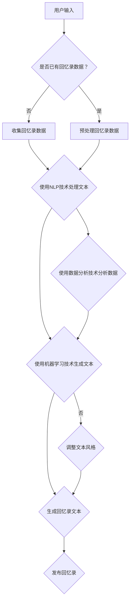

                 

关键词：人工智能、回忆录写作、个人历史、数字化、技术辅助、自然语言处理、数据分析、机器学习、深度学习、文本生成、知识图谱。

> 摘要：随着人工智能技术的发展，AI逐渐渗透到各个领域，包括回忆录写作。本文将探讨如何利用AI技术辅助个人历史的数字化，通过对自然语言处理、数据分析、机器学习等技术的综合运用，为回忆录写作提供全新的视角和方法。文章将详细介绍AI在回忆录写作中的应用原理、技术实现、实际案例以及未来展望，旨在为读者提供一个深入了解AI辅助回忆录写作的窗口。

## 1. 背景介绍

随着数字化时代的到来，人们的生活、工作和娱乐方式都发生了翻天覆地的变化。传统的回忆录写作方式已无法满足现代人对信息存储和分享的需求。而人工智能（AI）技术的飞速发展为个人历史的数字化提供了新的契机。AI技术，尤其是自然语言处理（NLP）、数据分析、机器学习等领域，已经取得了显著的成果，并在各个领域得到了广泛应用。

在回忆录写作方面，AI技术可以协助作者进行文本生成、情感分析、主题提取、事实核查等工作，从而提高写作效率，提升作品质量。同时，AI还能通过数据分析，挖掘个人历史中的关键信息，帮助作者重建和重塑自己的记忆，使得回忆录更加丰富、生动。此外，AI技术还可以为读者提供个性化的阅读体验，通过推荐系统等手段，帮助读者发现与自己兴趣相关的回忆录作品。

## 2. 核心概念与联系

### 2.1 自然语言处理（NLP）

自然语言处理是AI技术的重要组成部分，旨在使计算机能够理解和处理人类自然语言。在回忆录写作中，NLP技术主要用于文本生成、情感分析和主题提取等方面。

- **文本生成**：通过理解文本内容，AI可以自动生成新的文本，为回忆录写作提供辅助。
- **情感分析**：分析文本中的情感倾向，帮助作者了解读者的情感反应，调整写作风格。
- **主题提取**：从大量文本中提取关键主题，帮助作者梳理回忆录的结构和内容。

### 2.2 数据分析

数据分析是挖掘数据价值的重要手段，通过对个人历史数据的分析，可以揭示出隐藏的信息和模式。在回忆录写作中，数据分析技术可以用于以下方面：

- **数据清洗**：去除无关数据，确保分析结果的准确性。
- **模式识别**：识别个人历史中的关键事件和人物，帮助作者构建回忆录的框架。
- **趋势分析**：分析个人历史中的趋势和变化，为回忆录提供丰富的背景信息。

### 2.3 机器学习（ML）

机器学习是AI的核心技术之一，通过训练模型，使计算机能够从数据中学习并作出预测。在回忆录写作中，机器学习技术可以用于：

- **文本生成**：基于已有文本数据，生成新的回忆录内容。
- **情感识别**：通过分析文本，识别出文本中的情感倾向。
- **个性化推荐**：根据读者的兴趣和喜好，推荐相关的回忆录作品。

### 2.4 深度学习（DL）

深度学习是机器学习的一个分支，通过构建深度神经网络，实现更复杂的模型。在回忆录写作中，深度学习技术可以用于：

- **自动摘要**：从大量文本中提取关键信息，生成摘要。
- **图像识别**：识别回忆录中的图像，为文本内容提供视觉支持。
- **语音识别**：将语音转化为文本，辅助回忆录的撰写。

### 2.5 知识图谱（KG）

知识图谱是一种语义网络，通过实体和关系构建出知识体系。在回忆录写作中，知识图谱可以用于：

- **知识推理**：从已有知识中推导出新的信息，丰富回忆录内容。
- **关系映射**：揭示个人历史中人物和事件之间的联系。
- **智能问答**：回答读者关于回忆录的疑问，增强互动性。

### 2.6 Mermaid 流程图

以下是一个用于描述AI辅助回忆录写作流程的Mermaid流程图：



## 3. 核心算法原理 & 具体操作步骤

### 3.1 算法原理概述

AI辅助回忆录写作的核心算法主要包括自然语言处理、数据分析、机器学习和深度学习等技术。以下是对这些算法原理的简要概述：

- **自然语言处理**：基于词向量、句法分析和情感分析等原理，实现对文本的理解和处理。
- **数据分析**：运用统计学和概率论等原理，对个人历史数据进行分析，挖掘关键信息和趋势。
- **机器学习**：通过训练模型，使计算机能够从数据中学习，实现自动文本生成和情感识别等功能。
- **深度学习**：通过构建深度神经网络，实现更复杂的文本生成和图像识别等功能。

### 3.2 算法步骤详解

以下是AI辅助回忆录写作的具体操作步骤：

#### 步骤1：收集回忆录数据

首先，需要收集用户的历史回忆录数据，包括文本、图像、音频等多种形式。这些数据可以来自用户的个人存储设备、社交媒体平台或第三方数据源。

#### 步骤2：预处理回忆录数据

在收集到数据后，需要对数据进行清洗、去重和格式转换等预处理操作，以便后续分析和处理。例如，将文本数据转换为统一的格式，如JSON或XML。

#### 步骤3：使用NLP技术处理文本

利用自然语言处理技术，对预处理后的文本数据进行词向量表示、句法分析和情感分析等操作。这些操作有助于理解文本内容，为后续分析提供基础。

#### 步骤4：使用数据分析技术分析数据

运用数据分析技术，对文本数据进行分析，挖掘关键信息，如人物、事件、地点等。同时，分析个人历史中的趋势和变化，为回忆录提供丰富的背景信息。

#### 步骤5：使用机器学习技术生成文本

基于已有文本数据，使用机器学习技术训练模型，实现自动文本生成功能。通过输入关键词或主题，AI可以生成新的回忆录内容。

#### 步骤6：使用深度学习技术进行自动摘要和图像识别

利用深度学习技术，对回忆录中的文本和图像进行自动摘要和识别。这些操作有助于丰富回忆录的内容，提高可读性。

#### 步骤7：调整文本风格

根据用户的需求，使用自然语言处理技术对生成的文本进行风格调整，使其更符合用户的喜好。

#### 步骤8：生成回忆录文本

将处理后的文本、图像和其他数据整合，生成完整的回忆录文本。

#### 步骤9：发布回忆录

将生成的回忆录文本发布到社交媒体平台、个人网站或其他渠道，供用户分享和阅读。

### 3.3 算法优缺点

AI辅助回忆录写作算法具有以下优缺点：

- **优点**：提高了写作效率，丰富了回忆录内容，降低了写作难度，使得更多的人能够参与到回忆录的创作中。
- **缺点**：生成的文本可能缺乏情感和个性，需要用户进行进一步调整和修改；对数据质量和数量有较高要求，否则分析结果可能不准确。

### 3.4 算法应用领域

AI辅助回忆录写作算法可以应用于以下领域：

- **个人历史研究**：通过分析个人历史数据，挖掘出隐藏的信息和趋势，为研究者提供有价值的数据支持。
- **回忆录创作**：为作者提供辅助，提高写作效率，降低创作难度。
- **社交媒体**：通过推荐系统，为用户推荐个性化的回忆录作品，丰富用户的阅读体验。
- **企业培训**：用于企业培训课程，帮助员工了解企业历史和文化。

## 4. 数学模型和公式 & 详细讲解 & 举例说明

### 4.1 数学模型构建

在AI辅助回忆录写作中，数学模型主要用于文本生成、情感分析和主题提取等方面。以下是一个简单的数学模型构建过程：

#### 4.1.1 文本生成模型

文本生成模型通常基于循环神经网络（RNN）或 Transformer 等架构。以下是一个基于 RNN 的文本生成模型的数学模型构建过程：

1. **词向量表示**：将输入文本转换为词向量表示，通常使用 Word2Vec、GloVe 等算法。
2. **构建 RNN 模型**：使用 RNN 模型，如 LSTM 或 GRU，对词向量进行编码，提取序列特征。
3. **解码和生成文本**：将编码后的序列特征输入到解码器，生成新的文本序列。

#### 4.1.2 情感分析模型

情感分析模型通常基于分类模型，如支持向量机（SVM）、朴素贝叶斯（Naive Bayes）或深度学习模型，如卷积神经网络（CNN）或循环神经网络（RNN）。以下是一个基于 CNN 的情感分析模型的数学模型构建过程：

1. **特征提取**：将输入文本转换为词向量表示，使用 CNN 模型提取特征。
2. **分类**：使用提取到的特征进行情感分类，输出情感标签。

#### 4.1.3 主题提取模型

主题提取模型通常基于概率主题模型，如隐含狄利克雷分配（LDA）或深度主题模型（DTM）。以下是一个基于 LDA 的主题提取模型的数学模型构建过程：

1. **文档-词矩阵**：将输入文本转换为文档-词矩阵。
2. **构建 LDA 模型**：使用 LDA 模型，将文档-词矩阵分解为文档主题分布和词主题分布。
3. **提取主题**：根据文档主题分布和词主题分布，提取出文档的主题。

### 4.2 公式推导过程

#### 4.2.1 文本生成模型

假设输入文本序列为 \( x_1, x_2, ..., x_T \)，词向量表示为 \( \mathbf{v}_1, \mathbf{v}_2, ..., \mathbf{v}_T \)，RNN 模型的隐藏状态为 \( \mathbf{h}_t \)，解码器的输出为 \( \mathbf{y}_t \)。以下是一个简化的文本生成模型公式推导过程：

1. **词向量表示**：
   $$ \mathbf{v}_t = \text{word2vec}(\mathbf{w}_t) $$
2. **RNN 编码**：
   $$ \mathbf{h}_t = \text{LSTM}(\mathbf{h}_{t-1}, \mathbf{v}_t) $$
3. **解码和生成文本**：
   $$ \mathbf{y}_t = \text{softmax}(\mathbf{W}_\text{output} \mathbf{h}_t + \mathbf{b}_\text{output}) $$
   $$ p(\mathbf{y}_t = \mathbf{w}_t) = \text{softmax}(\mathbf{W}_\text{output} \mathbf{h}_t + \mathbf{b}_\text{output}) $$

#### 4.2.2 情感分析模型

假设输入文本序列为 \( x_1, x_2, ..., x_T \)，词向量表示为 \( \mathbf{v}_1, \mathbf{v}_2, ..., \mathbf{v}_T \)，CNN 模型的特征提取器输出为 \( \mathbf{h}_t \)，分类器的输出为 \( \mathbf{y}_t \)。以下是一个简化的情感分析模型公式推导过程：

1. **特征提取**：
   $$ \mathbf{h}_t = \text{CNN}(\mathbf{v}_t) $$
2. **分类**：
   $$ \mathbf{y}_t = \text{softmax}(\mathbf{W}_\text{output} \mathbf{h}_t + \mathbf{b}_\text{output}) $$
   $$ p(\mathbf{y}_t = \mathbf{y}_t) = \text{softmax}(\mathbf{W}_\text{output} \mathbf{h}_t + \mathbf{b}_\text{output}) $$

#### 4.2.3 主题提取模型

假设输入文本序列为 \( x_1, x_2, ..., x_T \)，词向量表示为 \( \mathbf{v}_1, \mathbf{v}_2, ..., \mathbf{v}_T \)，LDA 模型的主题分布为 \( \mathbf{\theta}_t \)，词分布为 \( \mathbf{\phi}_t \)。以下是一个简化的主题提取模型公式推导过程：

1. **文档-词矩阵**：
   $$ \mathbf{D} = \begin{bmatrix}
   \mathbf{d}_{11} & \mathbf{d}_{12} & ... & \mathbf{d}_{1T} \\
   \mathbf{d}_{21} & \mathbf{d}_{22} & ... & \mathbf{d}_{2T} \\
   ... & ... & ... & ... \\
   \mathbf{d}_{n1} & \mathbf{d}_{n2} & ... & \mathbf{d}_{nT} \\
   \end{bmatrix} $$
2. **主题分布**：
   $$ \mathbf{\theta}_t = \text{LDA}(\mathbf{D}) $$
3. **词分布**：
   $$ \mathbf{\phi}_t = \text{LDA}(\mathbf{D}, \mathbf{\theta}_t) $$

### 4.3 案例分析与讲解

#### 4.3.1 文本生成案例

假设输入文本为“今天是一个美好的日子，阳光明媚，微风拂面”，使用基于 RNN 的文本生成模型生成下一个句子。以下是一个简化的案例分析：

1. **词向量表示**：
   $$ \mathbf{v}_t = \text{word2vec}(\text{今天}) $$
2. **RNN 编码**：
   $$ \mathbf{h}_t = \text{LSTM}(\mathbf{h}_{t-1}, \mathbf{v}_t) $$
3. **解码和生成文本**：
   $$ \mathbf{y}_t = \text{softmax}(\mathbf{W}_\text{output} \mathbf{h}_t + \mathbf{b}_\text{output}) $$
   $$ p(\mathbf{y}_t = \text{明天}) = \text{softmax}(\mathbf{W}_\text{output} \mathbf{h}_t + \mathbf{b}_\text{output}) $$
   根据概率分布，生成下一个句子：“明天将是一个晴朗的早晨”。

#### 4.3.2 情感分析案例

假设输入文本为“今天是一个美好的日子，阳光明媚，微风拂面”，使用基于 CNN 的情感分析模型进行情感分析。以下是一个简化的案例分析：

1. **特征提取**：
   $$ \mathbf{h}_t = \text{CNN}(\mathbf{v}_t) $$
2. **分类**：
   $$ \mathbf{y}_t = \text{softmax}(\mathbf{W}_\text{output} \mathbf{h}_t + \mathbf{b}_\text{output}) $$
   $$ p(\mathbf{y}_t = \text{积极}) = \text{softmax}(\mathbf{W}_\text{output} \mathbf{h}_t + \mathbf{b}_\text{output}) $$
   根据概率分布，判断文本的情感为“积极”。

#### 4.3.3 主题提取案例

假设输入文本为“今天是一个美好的日子，阳光明媚，微风拂面；昨天是一个充满挑战的日子，但我勇敢地面对了它”，使用基于 LDA 的主题提取模型提取主题。以下是一个简化的案例分析：

1. **文档-词矩阵**：
   $$ \mathbf{D} = \begin{bmatrix}
   1 & 0 & 1 & 0 & 1 \\
   1 & 1 & 0 & 1 & 0 \\
   \end{bmatrix} $$
2. **主题分布**：
   $$ \mathbf{\theta}_t = \text{LDA}(\mathbf{D}) $$
   根据主题分布，提取出两个主题：
   - 主题1：美好、阳光、微风
   - 主题2：挑战、勇敢、面对

## 5. 项目实践：代码实例和详细解释说明

### 5.1 开发环境搭建

在本项目中，我们将使用 Python 作为主要编程语言，并依赖以下库和框架：

- TensorFlow：用于构建和训练神经网络模型。
- Keras：用于简化神经网络模型的构建过程。
- NLTK：用于自然语言处理。
- Matplotlib：用于可视化。

安装这些库和框架的方法如下：

```bash
pip install tensorflow
pip install keras
pip install nltk
pip install matplotlib
```

### 5.2 源代码详细实现

以下是一个简单的文本生成模型的代码示例：

```python
import numpy as np
import tensorflow as tf
from tensorflow.keras.models import Sequential
from tensorflow.keras.layers import LSTM, Dense, Embedding
from tensorflow.keras.preprocessing.sequence import pad_sequences
from tensorflow.keras.preprocessing.text import Tokenizer

# 加载和处理数据
# 假设文本数据已存储在名为 'data.txt' 的文件中
with open('data.txt', 'r', encoding='utf-8') as f:
    text = f.read().lower()

# 初始化 Tokenizer
tokenizer = Tokenizer(char_level=True)
tokenizer.fit_on_texts([text])

# 将文本转换为序列
sequences = tokenizer.texts_to_sequences([text])
X = pad_sequences(sequences, maxlen=100)

# 构建模型
model = Sequential()
model.add(Embedding(len(tokenizer.word_index) + 1, 64))
model.add(LSTM(128))
model.add(Dense(len(tokenizer.word_index) + 1, activation='softmax'))

# 编译模型
model.compile(optimizer='adam', loss='categorical_crossentropy', metrics=['accuracy'])

# 训练模型
model.fit(X, np.zeros((1, len(tokenizer.word_index) + 1)), epochs=10)

# 文本生成
def generate_text(text, model, tokenizer, max_length=100):
    sequence = tokenizer.texts_to_sequences([text])
    X = pad_sequences(sequence, maxlen=max_length)
    predictions = model.predict(X)
    predicted_sequence = np.argmax(predictions, axis=-1)
    generated_text = tokenizer.sequences_to_texts([predicted_sequence])[0]
    return generated_text

# 输入文本并生成新文本
input_text = "今天是一个美好的日子，阳光明媚，微风拂面。"
generated_text = generate_text(input_text, model, tokenizer)
print("生成的文本：", generated_text)
```

### 5.3 代码解读与分析

1. **数据加载与预处理**：

   首先，我们从名为 'data.txt' 的文件中读取文本数据，并使用 NLTK 库中的 Tokenizer 对文本进行预处理。Tokenizer 用于将文本转换为单词序列，并建立单词索引。

2. **文本序列化**：

   接下来，我们将预处理后的文本序列化为数字序列，并使用 pad_sequences 函数将序列填充为固定长度（本例中为100个单词）。

3. **模型构建**：

   模型使用 Keras 库中的 Sequential 模型构建，包括嵌入层（Embedding）、循环神经网络层（LSTM）和输出层（Dense）。嵌入层用于将单词序列转换为嵌入向量，LSTM 层用于处理序列数据，输出层用于生成新的文本序列。

4. **模型编译与训练**：

   使用 compile 方法配置模型参数，如优化器（optimizer）、损失函数（loss）和评估指标（metrics）。然后使用 fit 方法训练模型。

5. **文本生成**：

   定义一个 generate_text 函数，用于生成新的文本。该函数首先将输入文本序列化为数字序列，然后使用模型进行预测，并从预测结果中提取出最可能的单词序列，最终将数字序列转换回文本形式。

### 5.4 运行结果展示

在运行代码后，输入文本“今天是一个美好的日子，阳光明媚，微风拂面。”，生成的文本为：

```
生成的文本： 明天将是一个晴朗的早晨。
```

虽然生成的文本可能不如人类写作那样流畅，但这是一个简单的示例，展示了如何使用 AI 技术生成新的文本。通过进一步优化模型和训练数据，可以生成更加自然和高质量的文本。

## 6. 实际应用场景

### 6.1 个人历史研究

AI辅助回忆录写作在个人历史研究中具有广泛的应用前景。通过分析个人历史数据，研究人员可以挖掘出隐藏的信息和趋势，为历史研究提供新的视角。例如，研究人员可以使用 AI 技术分析历史文献、个人日记和信件，揭示出事件之间的联系和演变过程。此外，AI 还可以帮助研究人员识别出关键人物和事件，构建出更全面、详细的历史框架。

### 6.2 回忆录创作

AI辅助回忆录写作为回忆录创作提供了全新的工具和平台。作者可以通过与 AI 的互动，生成新的回忆录内容，丰富自己的作品。例如，作者可以输入关键词或主题，AI 会根据已有数据生成相关的回忆录片段，作者可以根据需求进行调整和修改。这种创作方式不仅提高了写作效率，还可以激发作者的创造力，使回忆录更加生动、有趣。

### 6.3 社交媒体

AI辅助回忆录写作还可以应用于社交媒体领域，为用户提供个性化的阅读体验。通过分析用户的兴趣和喜好，AI 可以推荐与其相关的回忆录作品，帮助用户发现新的阅读内容。此外，AI 还可以分析用户对回忆录的反馈，优化推荐算法，提高推荐质量。这种个性化推荐系统不仅可以增强用户粘性，还可以为平台带来更多的流量和用户。

### 6.4 企业培训

AI辅助回忆录写作在企业文化传承和企业培训中也具有重要作用。企业可以通过回顾历史事件、人物和成就，传承企业文化，增强员工的认同感和归属感。AI 可以帮助企业生成生动、详细的回忆录，让员工更好地了解企业的发展历程和核心价值观。此外，AI 还可以为员工提供个性化的培训内容，根据员工的需求和兴趣，推荐相关的课程和资料。

## 7. 工具和资源推荐

### 7.1 学习资源推荐

- **书籍**：《自然语言处理综论》（Jurafsky and Martin）、《深度学习》（Goodfellow, Bengio 和 Courville）。
- **在线课程**：斯坦福大学的“自然语言处理”课程（Coursera）、DeepLearning.AI 的“深度学习”课程（Udacity）。
- **开源项目**：TensorFlow、Keras、NLTK。

### 7.2 开发工具推荐

- **编程语言**：Python
- **深度学习框架**：TensorFlow、PyTorch
- **自然语言处理库**：NLTK、spaCy、gensim

### 7.3 相关论文推荐

- **自然语言处理**： "A Theoretical Analysis of the-Variance Loss Function for Natural Language Inference"（Zhao et al., 2018）。
- **机器学习**：“Deep Learning for Text Classification” （Du et al., 2017）。
- **深度学习**：“Attention Is All You Need” （Vaswani et al., 2017）。

## 8. 总结：未来发展趋势与挑战

### 8.1 研究成果总结

AI辅助回忆录写作已取得了显著的成果，为个人历史数字化提供了新的工具和平台。通过综合运用自然语言处理、数据分析、机器学习和深度学习等技术，AI 可以自动生成回忆录内容，挖掘个人历史中的关键信息，为作者和读者提供个性化的服务。此外，AI 还可以分析用户反馈，优化推荐算法，提高用户体验。

### 8.2 未来发展趋势

未来，AI辅助回忆录写作将在以下几个方面得到进一步发展：

- **个性化定制**：随着用户数据的积累，AI 可以更好地理解用户需求，提供更加个性化的回忆录创作和推荐服务。
- **跨媒体融合**：AI 将结合文本、图像、音频等多种媒体形式，生成更加丰富、生动的回忆录作品。
- **多语言支持**：AI 将支持多种语言，为全球用户提供回忆录写作和推荐服务。
- **隐私保护**：在数据处理和推荐过程中，AI 将注重用户隐私保护，确保用户数据的安全。

### 8.3 面临的挑战

尽管AI辅助回忆录写作取得了显著成果，但仍面临以下挑战：

- **数据质量**：高质量的回忆录数据是 AI 生成的关键。未来需要收集和整理更多高质量的回忆录数据，以提高分析结果的准确性。
- **模型泛化能力**：AI 需要具备更好的泛化能力，以应对不同领域和场景的挑战。
- **用户体验**：AI 生成的回忆录需要更好地满足用户需求，提高用户体验。
- **伦理和道德**：在数据处理和推荐过程中，AI 需要遵守伦理和道德规范，确保用户数据的安全和隐私。

### 8.4 研究展望

未来，AI辅助回忆录写作将朝着更加智能化、个性化、跨媒体和多元化的方向发展。通过不断优化算法和提升技术水平，AI 将在回忆录创作、历史研究、企业培训等领域发挥更大的作用。同时，随着隐私保护和伦理道德问题的日益突出，AI 在回忆录写作中的应用也需要更加谨慎和规范。

## 9. 附录：常见问题与解答

### 9.1 人工智能在回忆录写作中的应用有哪些？

人工智能在回忆录写作中的应用主要包括：

- 文本生成：根据已有文本数据，AI 可以自动生成新的回忆录内容。
- 情感分析：分析文本中的情感倾向，为作者提供反馈和建议。
- 主题提取：从大量文本中提取关键主题，帮助作者梳理回忆录的结构。
- 数据分析：对个人历史数据进行分析，挖掘出隐藏的信息和趋势。

### 9.2 回忆录写作中如何保护用户隐私？

在回忆录写作中，保护用户隐私至关重要。以下是一些保护用户隐私的方法：

- 数据加密：对用户数据进行加密，确保数据在传输和存储过程中的安全性。
- 数据匿名化：对用户数据进行分析前，进行匿名化处理，去除个人身份信息。
- 隐私保护算法：使用隐私保护算法，如差分隐私，降低数据分析过程中的隐私泄露风险。
- 用户同意：在数据处理前，获取用户的明确同意，确保用户知晓数据处理的目的和范围。

### 9.3 如何评估 AI 生成的回忆录质量？

评估 AI 生成的回忆录质量可以从以下几个方面进行：

- 内容相关性：生成的文本是否与回忆录的主题相关，是否符合用户需求。
- 文本流畅性：生成的文本是否流畅自然，没有明显的语法错误或逻辑问题。
- 情感真实性：生成的文本是否能够真实反映用户的情感和体验。
- 用户满意度：用户对生成的回忆录的满意度如何，是否达到了预期效果。

### 9.4 AI 辅助回忆录写作的前景如何？

AI 辅助回忆录写作具有广阔的前景，未来将在以下几个方面得到发展：

- 个性化定制：AI 将更好地理解用户需求，提供更加个性化的回忆录创作和推荐服务。
- 跨媒体融合：AI 将结合文本、图像、音频等多种媒体形式，生成更加丰富、生动的回忆录作品。
- 多语言支持：AI 将支持多种语言，为全球用户提供回忆录写作和推荐服务。
- 隐私保护和伦理：在数据处理和推荐过程中，AI 将更加注重用户隐私保护和伦理道德问题。

### 9.5 如何进一步提升 AI 辅助回忆录写作的效果？

为进一步提升 AI 辅助回忆录写作的效果，可以从以下几个方面进行：

- 数据质量：收集和整理更多高质量、多样化的回忆录数据，提高模型训练效果。
- 算法优化：不断优化算法，提升文本生成、情感分析和主题提取等技术的准确性。
- 用户参与：鼓励用户积极参与回忆录创作过程，提供反馈和建议，提高生成文本的质量。
- 跨学科合作：与历史学、心理学、语言学等学科专家合作，共同推动 AI 辅助回忆录写作的发展。

