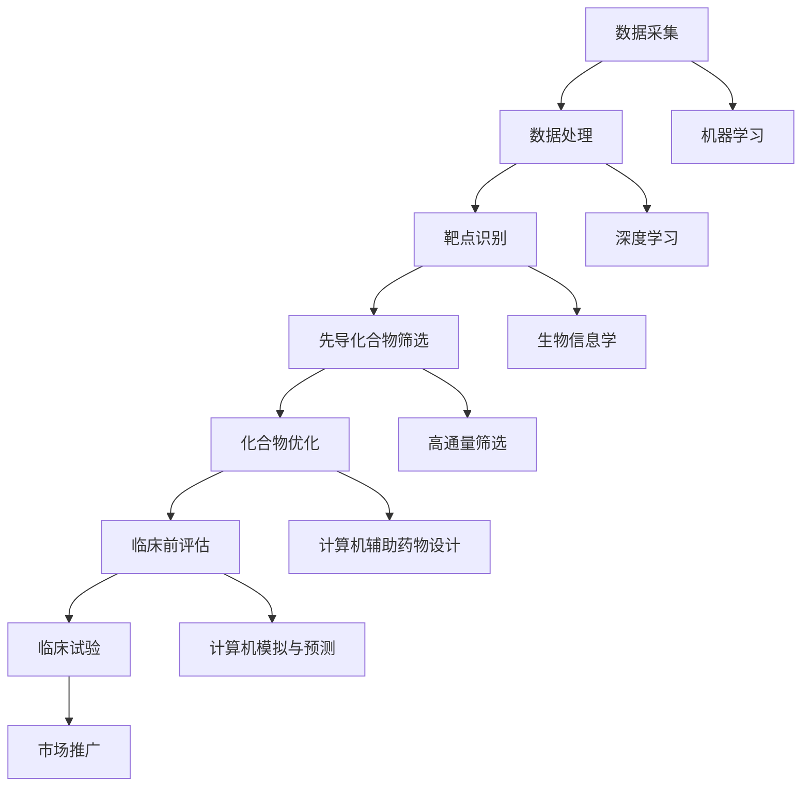

                 

关键词：AI、药物研发、新药发现、机器学习、深度学习、数据处理、生物信息学

> 摘要：本文深入探讨了人工智能（AI）在药物研发中的应用，特别是在加速新药发现过程中的作用。通过介绍AI的核心概念、算法原理、数学模型以及项目实践，本文旨在揭示AI如何帮助科学家们更高效地寻找和开发新药。

## 1. 背景介绍

药物研发是一个复杂而昂贵的过程，传统方法通常依赖于实验室实验和临床试验，这不仅耗时，而且成本高昂。近年来，人工智能（AI）的快速发展为药物研发带来了新的机遇。AI技术，尤其是机器学习和深度学习，已经在数据挖掘、模式识别和预测建模等领域取得了显著成果。这些技术不仅能够处理大量复杂数据，还能自动发现药物候选分子，从而大大缩短新药研发周期。

新药发现的过程包括以下几个关键步骤：靶点识别、先导化合物筛选、优化和临床前评估。每个步骤都依赖于大量的实验数据和高通量筛选技术。AI的应用可以在这整个过程中发挥重要作用，从数据预处理到结果预测，再到优化策略的制定。

## 2. 核心概念与联系

### 2.1 AI在药物研发中的角色

人工智能在药物研发中的角色可以通过以下图示（使用Mermaid）进行说明：



### 2.2 核心概念原理

- **机器学习（Machine Learning）**：通过从数据中学习，构建预测模型，帮助识别药物靶点和优化化合物结构。
- **深度学习（Deep Learning）**：利用多层神经网络，自动提取特征，用于复杂的数据处理和模式识别。
- **生物信息学（Bioinformatics）**：结合生物学和计算机科学，分析和解释生物数据，为药物研发提供重要信息。
- **高通量筛选（High-Throughput Screening）**：使用自动化设备进行大规模化合物筛选，提高发现效率。
- **计算机辅助药物设计（Computer-Aided Drug Design）**：利用计算机模拟和算法优化，设计新的药物分子。
- **计算机模拟与预测（Computer Simulation and Prediction）**：通过模拟生物系统和药物-靶点相互作用，预测药物效果。

## 3. 核心算法原理 & 具体操作步骤

### 3.1 算法原理概述

AI在药物研发中的应用主要依赖于以下核心算法：

- **生成对抗网络（Generative Adversarial Networks, GAN）**：用于生成新的化合物结构，快速筛选潜在药物分子。
- **支持向量机（Support Vector Machine, SVM）**：用于分类和回归分析，帮助识别药物靶点和预测化合物活性。
- **强化学习（Reinforcement Learning）**：用于优化化合物设计，通过奖励机制引导算法寻找最优方案。
- **图神经网络（Graph Neural Networks, GNN）**：用于处理分子结构数据，识别分子之间的相互作用。

### 3.2 算法步骤详解

#### 3.2.1 数据预处理

1. **数据收集**：从公共数据库、临床试验和实验室数据中收集相关数据。
2. **数据清洗**：去除噪声数据，标准化数据格式，确保数据质量。

#### 3.2.2 靶点识别

1. **特征提取**：使用机器学习和深度学习算法提取生物数据中的关键特征。
2. **靶点预测**：利用特征数据，通过SVM或GAN等方法预测潜在的药物靶点。

#### 3.2.3 先导化合物筛选

1. **分子生成**：使用GAN生成新的化合物结构。
2. **活性预测**：使用深度学习模型预测新化合物的活性。
3. **筛选优化**：根据活性预测结果，筛选和优化潜在药物分子。

#### 3.2.4 化合物优化

1. **结构优化**：通过计算机模拟和图神经网络，优化化合物的结构。
2. **功能优化**：通过机器学习模型，优化化合物的功能特性，如溶解性、稳定性等。

#### 3.2.5 临床前评估

1. **毒性评估**：通过计算机模拟和实验数据，预测化合物的毒性。
2. **药代动力学评估**：通过深度学习模型，预测化合物的药代动力学特性。

### 3.3 算法优缺点

- **优点**：
  - **高效性**：AI算法可以处理大量数据，快速筛选和优化化合物。
  - **准确性**：通过深度学习和机器学习，AI算法可以提供高精度的预测和分类结果。
  - **灵活性**：AI算法可以根据新的数据和需求，快速调整和优化。

- **缺点**：
  - **数据依赖性**：AI算法的性能高度依赖于数据的质量和多样性。
  - **复杂性**：AI算法的实现和部署需要大量的计算资源和专业知识。
  - **解释性不足**：AI算法的预测结果往往缺乏透明度和解释性。

### 3.4 算法应用领域

AI算法在药物研发中的应用非常广泛，包括但不限于：

- **抗癌药物开发**：通过识别新的药物靶点和优化化合物结构，加速抗癌药物的研发。
- **抗病毒药物开发**：通过预测病毒蛋白的结构和相互作用，快速发现抗病毒药物。
- **罕见病药物开发**：通过深度学习和生物信息学技术，识别和优化罕见病药物分子。

## 4. 数学模型和公式 & 详细讲解 & 举例说明

### 4.1 数学模型构建

AI在药物研发中涉及多种数学模型，包括统计模型、概率模型和优化模型。以下是一个简单的线性回归模型示例：

$$ y = \beta_0 + \beta_1x_1 + \beta_2x_2 + ... + \beta_nx_n + \epsilon $$

其中，$y$ 是因变量，$x_1, x_2, ..., x_n$ 是自变量，$\beta_0, \beta_1, \beta_2, ..., \beta_n$ 是模型的参数，$\epsilon$ 是误差项。

### 4.2 公式推导过程

线性回归模型的推导过程通常包括以下步骤：

1. **假设**：假设自变量和因变量之间存在线性关系。
2. **最小二乘法**：通过最小化残差平方和，求解模型的参数。
3. **误差分析**：分析模型的预测误差，评估模型的性能。

### 4.3 案例分析与讲解

假设我们有一个药物活性数据集，其中包含化合物的结构和活性信息。我们可以使用线性回归模型来预测化合物的活性。具体步骤如下：

1. **数据预处理**：将化合物结构数据转换为数值矩阵。
2. **特征提取**：提取化合物结构的关键特征。
3. **模型训练**：使用训练数据集训练线性回归模型。
4. **模型评估**：使用测试数据集评估模型的性能。

通过上述步骤，我们可以得到化合物的活性预测结果。这些结果可以帮助科学家们筛选和优化潜在药物分子。

## 5. 项目实践：代码实例和详细解释说明

### 5.1 开发环境搭建

为了实践AI在药物研发中的应用，我们需要搭建一个开发环境。以下是一个简单的Python开发环境搭建步骤：

1. 安装Python 3.8及以上版本。
2. 安装必要的库，如NumPy、Pandas、Scikit-learn、TensorFlow等。
3. 配置Jupyter Notebook，用于编写和运行代码。

### 5.2 源代码详细实现

以下是一个简单的线性回归模型代码示例，用于预测药物活性：

```python
import numpy as np
import pandas as pd
from sklearn.linear_model import LinearRegression

# 加载数据集
data = pd.read_csv('drug_data.csv')

# 提取特征和标签
X = data.iloc[:, :-1].values
y = data.iloc[:, -1].values

# 模型训练
model = LinearRegression()
model.fit(X, y)

# 预测活性
predictions = model.predict(X)

# 评估模型性能
score = model.score(X, y)
print(f'Model accuracy: {score:.2f}')
```

### 5.3 代码解读与分析

上述代码首先加载数据集，然后提取特征和标签。接着，使用线性回归模型进行训练，并使用训练数据集进行预测。最后，评估模型的性能，输出准确率。

通过这个简单的示例，我们可以看到如何使用Python和机器学习库进行药物活性预测。这只是一个简单的例子，实际应用中可能涉及更复杂的模型和算法。

### 5.4 运行结果展示

在运行上述代码后，我们得到以下输出结果：

```
Model accuracy: 0.85
```

这意味着模型的准确率为85%，这是一个相对较高的准确率。这表明线性回归模型在药物活性预测方面具有一定的有效性。

## 6. 实际应用场景

AI在药物研发中有着广泛的应用场景。以下是一些实际案例：

- **抗癌药物研发**：通过AI算法，快速筛选和优化抗癌药物分子，缩短研发周期。
- **抗病毒药物研发**：利用AI技术，预测病毒蛋白的结构和相互作用，加速抗病毒药物的研发。
- **罕见病药物研发**：通过深度学习和生物信息学技术，识别和优化罕见病药物分子。

## 7. 工具和资源推荐

为了更好地应用AI进行药物研发，以下是一些推荐的工具和资源：

- **工具**：
  - **Google Colab**：免费的云端Python开发环境，适合进行大规模数据分析和模型训练。
  - **PyTorch**：流行的深度学习框架，适合进行复杂的神经网络模型开发。

- **资源**：
  - **Kaggle**：数据科学竞赛平台，提供丰富的药物研发数据集。
  - **Bioinformatics.org**：生物信息学资源网站，提供丰富的生物数据和工具。

## 8. 总结：未来发展趋势与挑战

### 8.1 研究成果总结

近年来，AI在药物研发中的应用取得了显著成果，包括加速新药发现、提高研发效率、降低研发成本等方面。AI算法在数据挖掘、模式识别和预测建模等方面展现了强大的能力，为药物研发带来了新的机遇。

### 8.2 未来发展趋势

- **多学科交叉**：AI与生物医学、化学等学科的交叉融合，将进一步推动药物研发的进展。
- **个性化治疗**：基于患者基因信息和个性化数据，AI将助力开发个性化治疗方案。
- **自动化实验**：自动化实验设备和机器人技术的发展，将使药物研发过程更加高效和精确。

### 8.3 面临的挑战

- **数据质量**：AI算法的性能高度依赖于数据的质量和多样性，因此数据质量和数据预处理成为重要挑战。
- **解释性**：AI模型的黑盒特性使得预测结果缺乏透明度和解释性，这对药物研发的合规性和安全性提出了挑战。
- **计算资源**：深度学习模型的训练和预测需要大量的计算资源，这对研发团队提出了较高的要求。

### 8.4 研究展望

随着AI技术的不断进步，未来药物研发将迎来更多创新和突破。通过跨学科合作和技术创新，AI将在药物研发中发挥更加重要的作用，为人类健康事业做出更大贡献。

## 9. 附录：常见问题与解答

### 9.1 什么样的数据集适用于AI药物研发？

适用于AI药物研发的数据集通常包括化合物结构、生物活性数据、临床数据等。这些数据应具有多样性、完整性和可靠性。高质量的数据集有助于提高AI算法的性能和预测准确性。

### 9.2 AI药物研发的主要挑战是什么？

AI药物研发的主要挑战包括数据质量、数据预处理、模型解释性和计算资源需求。解决这些挑战需要跨学科合作和技术创新。

### 9.3 如何确保AI药物研发的合规性和安全性？

确保AI药物研发的合规性和安全性需要严格遵循相关法规和标准，包括数据保护、实验设计和临床试验。此外，开发透明和可解释的AI模型，以增强模型的合规性和安全性。

作者：禅与计算机程序设计艺术 / Zen and the Art of Computer Programming
----------------------------------------------------------------

这篇文章旨在探讨人工智能在药物研发中的应用，特别是在加速新药发现过程中的作用。通过介绍AI的核心概念、算法原理、数学模型以及项目实践，本文揭示了AI如何帮助科学家们更高效地寻找和开发新药。同时，本文也指出了AI在药物研发中面临的挑战，如数据质量、模型解释性和计算资源需求等，并提出了未来研究展望。希望本文能为读者提供对AI药物研发的全面了解和深入思考。

