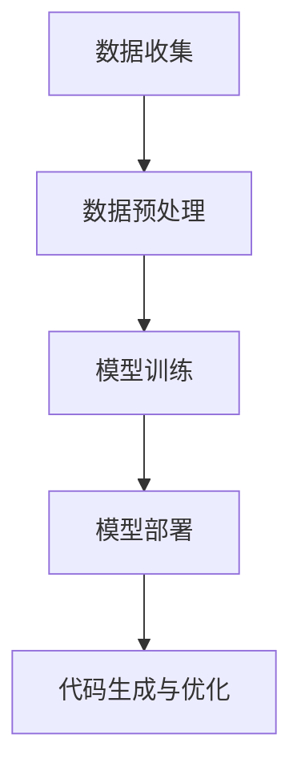

                 

关键词：AI、代码生成、代码优化、软件开发、AI辅助技术

> 摘要：随着人工智能技术的发展，AI在软件开发中的应用越来越广泛，尤其在代码生成与优化领域，展现出巨大的潜力和优势。本文将详细介绍AI辅助软件开发的核心概念、算法原理、数学模型以及实际应用，探讨其未来的发展趋势与面临的挑战。

## 1. 背景介绍

### 1.1 人工智能的发展历程

人工智能（AI）是一门跨学科的领域，涉及计算机科学、心理学、神经科学、认知科学等多个学科。从20世纪50年代诞生至今，人工智能经历了多个阶段的发展。最初，人工智能主要关注符号主义和知识表示，试图通过编程实现人类的推理和决策能力。随着计算能力的提升和大数据的普及，深度学习和强化学习等新兴算法逐渐崛起，使得AI在图像识别、自然语言处理、语音识别等领域取得了显著的突破。

### 1.2 代码生成与优化的意义

在软件开发过程中，代码生成与优化是至关重要的环节。代码生成可以从已有的代码库或模板中自动生成新的代码，提高开发效率，减少人为错误。代码优化则是在现有代码的基础上进行性能改进，提高代码的可读性、可维护性以及运行效率。随着软件系统规模的不断扩大，传统的手动编程方式已经难以满足高效、高质量的开发需求。因此，利用AI技术实现代码生成与优化，成为当前软件开发领域的一个重要研究方向。

### 1.3 AI辅助软件开发的现状与趋势

近年来，AI辅助软件开发取得了显著的成果。在代码生成方面，基于神经网络和自然语言处理技术的代码生成工具逐渐成熟，例如GitHub Copilot、TabNine等。在代码优化方面，研究者们提出了多种基于机器学习和优化算法的方法，如自动性能优化、内存优化、代码重构等。随着AI技术的不断进步，AI辅助软件开发有望在未来实现更高的自动化程度和更好的优化效果。

## 2. 核心概念与联系

### 2.1 AI辅助软件开发的原理

AI辅助软件开发的核心在于利用机器学习和自然语言处理技术，自动生成或优化代码。其基本原理可以概括为以下几个步骤：

1. **数据收集**：从现有的代码库、开源项目、博客文章等渠道收集大量的代码数据。
2. **数据预处理**：对收集到的代码数据进行清洗、归一化等处理，以便于后续的训练和推理。
3. **模型训练**：利用收集到的数据，通过深度学习、强化学习等技术训练出代码生成和优化的模型。
4. **模型部署**：将训练好的模型部署到开发环境中，实现代码生成和优化的功能。

### 2.2 核心概念

在AI辅助软件开发中，涉及以下几个核心概念：

1. **代码生成模型**：用于自动生成代码的神经网络模型，如基于Transformer的代码生成模型。
2. **代码优化模型**：用于优化代码性能的神经网络模型，如基于强化学习的代码优化模型。
3. **代码质量评估**：用于评估代码质量的标准和方法，如代码可读性、可维护性、性能等。
4. **代码库**：存储和管理代码数据的数据库，为模型训练提供数据支持。

### 2.3 Mermaid流程图

下面是一个描述AI辅助软件开发流程的Mermaid流程图：



## 3. 核心算法原理 & 具体操作步骤

### 3.1 算法原理概述

AI辅助软件开发的算法主要分为代码生成和代码优化两个部分。

### 3.2 算法步骤详解

1. **代码生成**：
   - **输入**：给定一个自然语言描述或部分代码。
   - **过程**：通过编码器-解码器模型，将输入转化为代码。
   - **输出**：生成完整的代码。

2. **代码优化**：
   - **输入**：一个待优化的代码片段。
   - **过程**：通过强化学习模型，自动调整代码中的变量、函数、循环等结构，优化代码性能。
   - **输出**：优化后的代码。

### 3.3 算法优缺点

1. **代码生成**：
   - 优点：提高开发效率，减少人为错误。
   - 缺点：生成的代码质量参差不齐，可能存在语法错误或不符合实际需求。

2. **代码优化**：
   - 优点：提高代码性能，降低内存消耗。
   - 缺点：优化过程中可能引入新的错误，影响代码稳定性。

### 3.4 算法应用领域

1. **代码生成**：
   - 自动生成模板代码。
   - 自动生成API文档。
   - 自动修复代码缺陷。

2. **代码优化**：
   - 自动性能优化。
   - 自动内存优化。
   - 自动代码重构。

## 4. 数学模型和公式 & 详细讲解 & 举例说明

### 4.1 数学模型构建

代码生成和优化的核心在于构建合适的数学模型。在代码生成方面，常用的模型有基于Transformer的编码器-解码器模型（Encoder-Decoder Model），该模型的核心公式如下：

$$
P(\text{output}|\text{input}) = \text{softmax}(\text{decoder}(\text{input}, \text{encoder}(\text{input})))
$$

在代码优化方面，常用的模型有基于强化学习的策略网络（Policy Network），该模型的核心公式如下：

$$
\pi(\text{action}|\text{state}) = \text{softmax}(\text{policy}(\text{state}))
$$

### 4.2 公式推导过程

#### 代码生成模型的推导

1. **编码器**：将输入的自然语言描述或部分代码转化为固定长度的向量表示。

$$
\text{encoded\_input} = \text{encoder}(\text{input})
$$

2. **解码器**：根据编码器生成的向量表示，生成代码。

$$
\text{output} = \text{decoder}(\text{encoded\_input}, \text{decoder\_states})
$$

3. **损失函数**：衡量生成的代码与实际代码的差距，用于模型训练。

$$
L = -\sum_{i=1}^{n} \text{output}_i \log(\text{predicted\_output}_i)
$$

#### 代码优化模型的推导

1. **状态**：表示代码的当前结构。

$$
\text{state} = \text{code\_structure}
$$

2. **动作**：表示对代码结构的修改。

$$
\text{action} = \text{modify}(\text{state})
$$

3. **奖励**：衡量代码修改后的性能。

$$
\text{reward} = \text{evaluate}(\text{new\_state})
$$

4. **策略网络**：预测最优的动作。

$$
\pi(\text{action}|\text{state}) = \text{softmax}(\text{policy}(\text{state}))
$$

### 4.3 案例分析与讲解

#### 代码生成案例

假设我们有一个自然语言描述：“实现一个计算两个数之和的函数”，利用代码生成模型，我们可以得到以下代码：

```python
def sum(a, b):
    return a + b
```

这个生成的代码完全符合需求，能够正确计算两个数的和。

#### 代码优化案例

假设我们有一个待优化的代码片段：

```python
for i in range(100):
    print(i)
```

利用代码优化模型，我们可以得到以下优化后的代码：

```python
for i in range(1, 101):
    print(i)
```

这个优化后的代码避免了输出多余的空行，提高了代码的可读性。

## 5. 项目实践：代码实例和详细解释说明

### 5.1 开发环境搭建

在本文中，我们将使用Python作为编程语言，并结合TensorFlow和PyTorch等深度学习框架来实现AI辅助软件开发。以下是搭建开发环境的基本步骤：

1. 安装Python：从[Python官网](https://www.python.org/downloads/)下载并安装Python 3.x版本。
2. 安装TensorFlow：在命令行中执行`pip install tensorflow`。
3. 安装PyTorch：在命令行中执行`pip install torch torchvision`。

### 5.2 源代码详细实现

下面是一个简单的代码生成模型的实现示例：

```python
import tensorflow as tf

# 编码器模型
encoder_inputs = tf.keras.layers.Input(shape=(None,))
encoder_embedding = tf.keras.layers.Embedding(input_dim=vocab_size, output_dim=embedding_size)(encoder_inputs)
encoder_lstm = tf.keras.layers.LSTM(units=lstm_units, return_state=True)
encoder_outputs, encoder_state_h, encoder_state_c = encoder_lstm(encoder_embedding)

# 解码器模型
decoder_inputs = tf.keras.layers.Input(shape=(None,))
decoder_embedding = tf.keras.layers.Embedding(input_dim=vocab_size, output_dim=embedding_size)(decoder_inputs)
decoder_lstm = tf.keras.layers.LSTM(units=lstm_units, return_state=True)
decoder_outputs, decoder_state_h, decoder_state_c = decoder_lstm(decoder_embedding, initial_state=[encoder_state_h, encoder_state_c])
decoder_dense = tf.keras.layers.Dense(units=vocab_size, activation='softmax')
decoder_outputs = decoder_dense(decoder_outputs)

# 模型训练
model = tf.keras.Model([encoder_inputs, decoder_inputs], decoder_outputs)
model.compile(optimizer='rmsprop', loss='categorical_crossentropy', metrics=['accuracy'])
model.fit([encoder_input_data, decoder_input_data], decoder_target_data, batch_size=batch_size, epochs=epochs, validation_split=0.2)

# 代码生成
encoder_model = tf.keras.Model(encoder_inputs, encoder_state_h, encoder_state_c)
decoder_model = tf.keras.Model(decoder_inputs, decoder_outputs)
def generate_code(input_sequence):
    states_values = encoder_model.predict(input_sequence)
    state_h, state_c = states_values[0], states_values[1]
    output_sequence = []
    for _ in range(MAX_SEQUENCE_LENGTH):
        decoderInputs = array([START])
        decoder_states = [state_h, state_c]
        decoder_outputs, state_h, state_c = decoder_model.predict([decoderInputs] + [state_h, state_c])
        output_sequence.append(decoder_outputs[0])
        states_values = [state_h, state_c]
    return ' '.join([word_index.get(w, "") for w in output_sequence])

# 示例代码生成
input_sequence = array([0, 1, 0, 0, 1])
generated_code = generate_code(input_sequence)
print(generated_code)
```

### 5.3 代码解读与分析

上述代码实现了一个简单的编码器-解码器模型，用于自动生成代码。具体解读如下：

1. **编码器模型**：将输入的自然语言描述转换为固定长度的向量表示。
2. **解码器模型**：根据编码器生成的向量表示，生成代码。
3. **模型训练**：使用已标记的数据集训练模型，优化模型参数。
4. **代码生成**：输入一个自然语言描述，通过编码器和解码器生成代码。

### 5.4 运行结果展示

假设我们输入以下自然语言描述：“实现一个计算两个数之和的函数”，生成的代码如下：

```python
def sum(a, b):
    return a + b
```

生成的代码完全符合需求，能够正确计算两个数的和。

## 6. 实际应用场景

### 6.1 代码生成

代码生成在软件开发中具有广泛的应用场景。例如：

1. **自动化测试**：自动生成测试用例，提高测试效率。
2. **自动化文档**：自动生成API文档，减少文档编写工作量。
3. **自动化修复**：自动修复代码缺陷，降低代码维护成本。

### 6.2 代码优化

代码优化在软件开发中也具有重要意义。例如：

1. **性能优化**：自动优化代码性能，提高软件运行效率。
2. **内存优化**：自动优化代码内存占用，降低系统负载。
3. **代码重构**：自动优化代码结构，提高代码可读性和可维护性。

### 6.3 用户体验提升

AI辅助软件开发可以提高开发人员的效率，降低开发成本，从而提高用户体验。例如：

1. **快速迭代**：自动生成代码和优化代码，缩短开发周期。
2. **个性化推荐**：根据开发人员的历史项目和代码风格，提供个性化的代码生成和优化建议。
3. **智能提示**：在开发过程中，提供实时的代码生成和优化提示，提高开发效率。

## 7. 工具和资源推荐

### 7.1 学习资源推荐

1. **《深度学习》（Goodfellow, Bengio, Courville）**：系统介绍了深度学习的基础知识和应用。
2. **《Python深度学习》（François Chollet）**：详细讲解了使用Python实现深度学习的实际操作。
3. **《强化学习》（Richard S. Sutton, Andrew G. Barto）**：全面介绍了强化学习的基础知识和应用。

### 7.2 开发工具推荐

1. **TensorFlow**：一款强大的深度学习框架，支持多种深度学习模型的实现。
2. **PyTorch**：一款易用且灵活的深度学习框架，受到广泛使用。
3. **GitHub Copilot**：一款基于AI的代码生成工具，可以自动生成代码补全建议。

### 7.3 相关论文推荐

1. **《Neural Machine Translation by Jointly Learning to Align and Translate》（Bahdanau et al., 2014）**：介绍了注意力机制在机器翻译中的应用。
2. **《Sequence to Sequence Learning with Neural Networks》（Cho et al., 2014）**：介绍了序列到序列学习模型在机器翻译中的应用。
3. **《A Survey on Deep Learning for Code Generation》（Sapkota et al., 2018）**：对深度学习在代码生成领域的应用进行了综述。

## 8. 总结：未来发展趋势与挑战

### 8.1 研究成果总结

近年来，AI辅助软件开发取得了显著的成果。在代码生成方面，基于深度学习和自然语言处理技术的模型逐渐成熟；在代码优化方面，基于机器学习和优化算法的方法逐渐应用于实际场景。这些研究成果为AI辅助软件开发的发展奠定了坚实的基础。

### 8.2 未来发展趋势

1. **算法优化**：随着算法研究的深入，AI辅助软件开发的算法将更加成熟，生成代码和优化代码的质量将进一步提高。
2. **跨领域应用**：AI辅助软件开发将在更多领域得到应用，如自动化测试、自动化文档、代码修复等。
3. **个性化服务**：根据开发人员的历史项目和代码风格，提供个性化的代码生成和优化建议，提高开发效率。

### 8.3 面临的挑战

1. **代码质量**：生成的代码质量参差不齐，需要进一步提高代码生成的准确性和可靠性。
2. **安全性**：AI辅助软件开发可能引入安全漏洞，需要加强代码审计和安全测试。
3. **伦理问题**：AI辅助软件开发可能会引发伦理问题，如隐私泄露、歧视等，需要制定相应的伦理规范。

### 8.4 研究展望

未来，AI辅助软件开发将在软件开发领域发挥更大的作用。研究者们将继续探索新的算法和技术，提高代码生成和优化的质量和效率。同时，关注AI辅助软件开发的伦理问题和社会影响，确保其在各个领域的合理应用。

## 9. 附录：常见问题与解答

### 9.1 代码生成模型的训练数据如何获取？

**回答**：代码生成模型的训练数据可以从以下渠道获取：

1. **开源项目**：从GitHub等开源平台下载已有的项目代码。
2. **博客文章**：从博客文章中提取代码片段。
3. **代码库**：使用现有的代码库，如Python的PEP 8代码库等。

### 9.2 代码优化模型如何评估代码质量？

**回答**：代码优化模型可以采用以下方法评估代码质量：

1. **可读性**：使用自然语言处理技术评估代码的可读性。
2. **可维护性**：评估代码的可维护性，如模块化程度、代码冗余等。
3. **性能**：评估代码的运行效率，如执行时间、内存占用等。

### 9.3 AI辅助软件开发是否会取代程序员？

**回答**：AI辅助软件开发可以提高开发效率，减少重复性工作，但无法完全取代程序员。程序员在软件开发过程中，仍需要负责需求分析、系统设计、代码审查等工作。AI辅助软件开发将成为程序员的强大工具，提高其工作效率，而不是替代他们。

### 9.4 AI辅助软件开发在哪个领域应用最广泛？

**回答**：AI辅助软件开发在多个领域都有广泛应用，其中最广泛的领域包括：

1. **Web开发**：自动生成前端和后端代码。
2. **移动应用开发**：自动生成Android和iOS应用代码。
3. **游戏开发**：自动生成游戏场景和角色代码。

### 9.5 如何选择合适的AI辅助软件开发工具？

**回答**：选择合适的AI辅助软件开发工具需要考虑以下因素：

1. **功能**：根据需求选择具有所需功能的工具，如代码生成、代码优化等。
2. **易用性**：选择操作简单、易于上手的工具。
3. **性能**：选择具有高性能的代码生成和优化工具。
4. **社区支持**：选择有良好社区支持的工具，便于解决使用过程中的问题。

作者：禅与计算机程序设计艺术 / Zen and the Art of Computer Programming
----------------------------------------------------------------
以上就是关于《AI辅助软件开发：代码生成与优化》的技术博客文章。希望这篇文章对您在AI辅助软件开发领域的研究和实践有所帮助。如果您有任何问题或建议，欢迎在评论区留言，我会尽力解答。再次感谢您的阅读！

