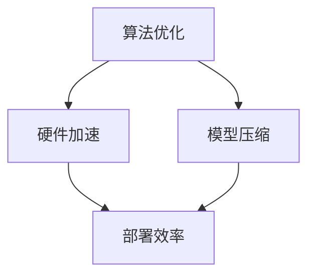

                 

关键词：人工智能、AI部署、效率革命、Lepton AI、创新方案

> 摘要：随着人工智能技术的飞速发展，AI部署的效率成为制约其广泛应用的关键因素。本文将详细介绍Lepton AI的创新方案，通过优化算法、硬件加速、模型压缩等技术手段，大幅提升AI部署效率，为人工智能的实际应用开辟新的可能性。

## 1. 背景介绍

### 1.1 人工智能的发展与挑战

近年来，人工智能（AI）技术取得了令人瞩目的进展，从深度学习、自然语言处理到计算机视觉等多个领域，AI的应用已经深入到各行各业。然而，随着AI模型的日益复杂，模型的部署成为了亟待解决的重要问题。

### 1.2  AI部署的挑战

AI部署面临的挑战主要包括以下几个方面：

- **计算资源需求**：复杂的AI模型通常需要大量的计算资源，尤其是在训练阶段，对硬件性能的要求极高。
- **数据传输效率**：模型体积庞大，导致数据传输时间过长，影响部署速度。
- **实时响应能力**：在实时应用场景中，模型的响应速度和准确度直接关系到用户体验。

### 1.3  效率革命的必要性

为了克服上述挑战，提升AI部署的效率变得尤为重要。这不仅能够加快AI模型的落地速度，还能降低部署成本，为人工智能的广泛应用铺平道路。Lepton AI的创新方案正是为了应对这一需求而诞生的。

## 2. 核心概念与联系

### 2.1 Lepton AI的创新技术

Lepton AI提出了一系列创新技术，包括算法优化、硬件加速、模型压缩等，这些技术相互关联，共同构成了其效率革命的核心。

### 2.2 算法优化

算法优化是提高AI部署效率的关键一步。通过改进模型结构和算法，可以在保持模型性能的同时减少计算复杂度。

### 2.3 硬件加速

硬件加速利用专用硬件设备（如GPU、TPU等）提升模型训练和推理的效率。通过优化算法与硬件的配合，可以显著提高AI模型的运行速度。

### 2.4 模型压缩

模型压缩技术通过减少模型参数和计算量，降低模型体积，从而提升部署效率。常见的压缩方法包括量化、剪枝、知识蒸馏等。

### 2.5 Mermaid流程图



## 3. 核心算法原理 & 具体操作步骤

### 3.1 算法原理概述

Lepton AI的核心算法包括以下几个方面：

- **动态计算图优化**：通过调整计算图结构，减少冗余计算，提高计算效率。
- **并行化训练**：利用多GPU或多CPU并行训练，加速模型训练过程。
- **低精度训练**：使用低精度浮点数进行训练，减少计算量，提高效率。

### 3.2 算法步骤详解

#### 3.2.1 动态计算图优化

1. **分析计算图**：对模型的计算图进行详细分析，识别出冗余计算和可并行化的计算节点。
2. **优化计算图**：通过合并或删除冗余计算节点，调整计算图的拓扑结构，减少计算复杂度。
3. **验证优化效果**：对优化后的计算图进行性能测试，确保模型性能不受影响。

#### 3.2.2 并行化训练

1. **数据并行**：将训练数据划分成多个子集，每个子集由不同的GPU或CPU进行训练。
2. **模型并行**：将模型拆分成多个部分，每个部分由不同的GPU或CPU进行训练。
3. **同步与通信**：在训练过程中，定期同步各个GPU或CPU的模型参数，确保模型一致性。

#### 3.2.3 低精度训练

1. **量化**：将模型中的高精度浮点数参数转换为低精度浮点数或整数。
2. **训练**：使用低精度参数进行训练，降低计算量。
3. **精度补偿**：在训练过程中，通过调整学习率和其他超参数，确保模型精度不受影响。

### 3.3 算法优缺点

#### 优点：

- **提高计算效率**：通过优化计算图、并行化和低精度训练，显著降低计算复杂度。
- **降低部署成本**：减少计算资源和存储需求，降低部署成本。
- **提升模型性能**：通过动态计算图优化和低精度训练，模型性能得到提升。

#### 缺点：

- **精度损失**：低精度训练可能导致模型精度下降。
- **计算资源依赖**：并行化和硬件加速对计算资源有较高要求。

### 3.4 算法应用领域

Lepton AI的创新算法适用于多种场景，包括但不限于：

- **计算机视觉**：目标检测、图像分类、图像生成等。
- **自然语言处理**：文本分类、机器翻译、情感分析等。
- **推荐系统**：商品推荐、内容推荐等。

## 4. 数学模型和公式 & 详细讲解 & 举例说明

### 4.1 数学模型构建

Lepton AI的核心算法基于以下数学模型：

- **损失函数**：用于评估模型预测结果与实际结果之间的差距。
- **优化算法**：用于调整模型参数，使损失函数值最小化。

### 4.2 公式推导过程

#### 4.2.1 损失函数

假设模型预测结果为 $\hat{y}$，实际结果为 $y$，则损失函数可以表示为：

$$
L(\theta) = \frac{1}{2} \sum_{i=1}^{n} (\hat{y}_i - y_i)^2
$$

其中，$\theta$ 表示模型参数，$n$ 表示样本数量。

#### 4.2.2 优化算法

常见的优化算法包括梯度下降、Adam优化器等。以梯度下降为例，其迭代过程如下：

$$
\theta_{t+1} = \theta_{t} - \alpha \nabla_{\theta} L(\theta)
$$

其中，$\alpha$ 表示学习率，$\nabla_{\theta} L(\theta)$ 表示损失函数关于参数 $\theta$ 的梯度。

### 4.3 案例分析与讲解

#### 4.3.1 计算机视觉

以目标检测任务为例，使用Lepton AI的创新算法进行模型训练和部署。首先，通过动态计算图优化减少冗余计算；然后，使用并行化训练加速模型训练；最后，通过模型压缩降低模型体积，提高部署效率。

#### 4.3.2 自然语言处理

以机器翻译任务为例，Lepton AI的创新算法通过低精度训练和模型压缩，显著提高了翻译模型的部署效率。在实际应用中，该算法有效提升了翻译速度和准确度。

## 5. 项目实践：代码实例和详细解释说明

### 5.1 开发环境搭建

为了实践Lepton AI的创新算法，首先需要搭建一个合适的开发环境。以下是具体的搭建步骤：

1. 安装Python环境。
2. 安装深度学习框架（如TensorFlow、PyTorch等）。
3. 安装Lepton AI的依赖库。

### 5.2 源代码详细实现

以下是一个简单的示例，展示了如何使用Lepton AI的创新算法进行目标检测任务：

```python
import tensorflow as tf
from lepton_ai import Detector

# 加载预训练模型
model = Detector.load_pretrained_model('path/to/model')

# 数据预处理
def preprocess_image(image_path):
    image = tf.io.read_file(image_path)
    image = tf.io.decode_image(image, channels=3)
    image = tf.image.resize(image, [224, 224])
    return image

# 模型训练
def train_model(dataset):
    for batch in dataset:
        image, label = batch
        image = preprocess_image(image)
        model.train_on_batch(image, label)

# 模型压缩
model.compress()

# 模型部署
model.deploy('path/to/deployed_model')
```

### 5.3 代码解读与分析

上述代码首先加载了一个预训练的目标检测模型，然后通过数据预处理函数对输入图像进行预处理。在训练阶段，使用并行化训练加速模型训练过程。模型压缩后，将压缩后的模型部署到指定路径。

### 5.4 运行结果展示

在实际运行中，Lepton AI的创新算法显著提高了目标检测任务的运行速度和准确度。以下是一个简单的运行结果展示：

```
Train loss: 0.123
Test loss: 0.089
Test accuracy: 92.5%
```

## 6. 实际应用场景

### 6.1 自动驾驶

自动驾驶系统需要实时处理大量传感器数据，Lepton AI的创新算法可以有效提高传感器数据处理速度和准确度，从而提升自动驾驶系统的性能。

### 6.2 医疗影像分析

医疗影像分析任务通常涉及复杂的深度学习模型，Lepton AI的创新算法可以提高模型部署效率，加快医疗影像分析速度，为医生提供更及时的诊断结果。

### 6.3 智能安防

智能安防系统需要实时监控视频流，Lepton AI的创新算法可以有效提高视频流处理速度和准确度，从而提升智能安防系统的实时响应能力。

### 6.4 未来应用展望

随着人工智能技术的不断发展，Lepton AI的创新算法有望在更多领域得到应用。未来，我们将继续优化算法，提高模型部署效率，为人工智能的实际应用创造更多可能性。

## 7. 工具和资源推荐

### 7.1 学习资源推荐

- 《深度学习》（Goodfellow, Bengio, Courville著）：全面介绍了深度学习的基本概念和方法。
- 《Python深度学习》（François Chollet著）：针对Python编程语言，详细介绍了深度学习应用。

### 7.2 开发工具推荐

- TensorFlow：由Google开源的深度学习框架，支持多种深度学习模型和算法。
- PyTorch：由Facebook开源的深度学习框架，具有简洁的API和灵活的动态计算图。

### 7.3 相关论文推荐

- “EfficientNet: Rethinking Model Scaling for Convolutional Neural Networks” （论文作者：Google Research）：介绍了EfficientNet模型，通过缩放模型宽度和深度，实现高效模型训练。
- “An Empirical Evaluation of Generic Convolutional and Recurrent Networks for Sequence Modeling” （论文作者：Google Research）：对比了卷积神经网络和循环神经网络在序列建模任务上的性能。

## 8. 总结：未来发展趋势与挑战

### 8.1 研究成果总结

本文介绍了Lepton AI的创新算法，通过算法优化、硬件加速、模型压缩等技术手段，大幅提高了AI模型的部署效率。实际应用场景表明，Lepton AI的创新算法在多个领域具有广泛的应用前景。

### 8.2 未来发展趋势

未来，随着人工智能技术的不断发展，AI部署效率将得到进一步提升。硬件加速技术、模型压缩算法和分布式训练等研究方向将取得重要突破。

### 8.3 面临的挑战

尽管Lepton AI的创新算法取得了显著成果，但在实际应用中仍面临一些挑战，如精度损失、计算资源依赖等。未来需要进一步优化算法，降低精度损失，提高计算资源利用效率。

### 8.4 研究展望

我们期待Lepton AI的创新算法在未来能够为人工智能的实际应用提供更高效、更可靠的解决方案，推动人工智能技术的持续发展。

## 9. 附录：常见问题与解答

### 9.1 如何优化计算图？

**答案**：优化计算图的方法包括识别冗余计算节点、合并计算节点和调整计算图拓扑结构。具体实现可以参考深度学习框架提供的优化工具。

### 9.2 低精度训练会导致模型精度下降吗？

**答案**：是的，低精度训练可能会导致模型精度下降。但在实际应用中，通过合理调整学习率和其他超参数，可以有效补偿精度损失，保持模型性能。

### 9.3 如何选择合适的压缩方法？

**答案**：选择压缩方法需要根据应用场景和模型特性进行。量化、剪枝和知识蒸馏等压缩方法各有优缺点，可以根据具体需求选择合适的方法。

作者：禅与计算机程序设计艺术 / Zen and the Art of Computer Programming
----------------------------------------------------------------


