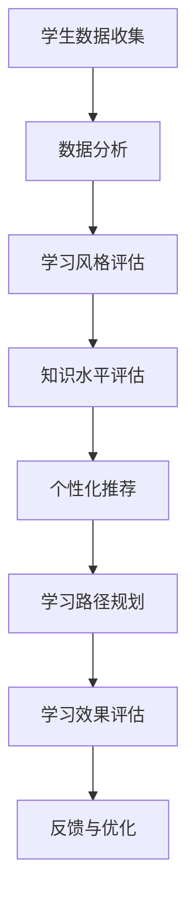

                 

关键词：人工智能，个性化学习，教育技术，机器学习，数据分析，学习体验，教育创新

> 摘要：随着人工智能技术的发展，个性化学习体验成为教育领域的新趋势。本文深入探讨了AI驱动的个性化学习体验的核心概念、技术原理、算法模型、实际应用场景、工具推荐及未来发展趋势。通过详细讲解和案例分析，为教育技术的创新与发展提供了有力支持。

## 1. 背景介绍

近年来，人工智能（AI）技术的发展日新月异，其在教育领域的应用也日益广泛。个性化学习作为教育创新的重要方向，正在受到越来越多的关注。个性化学习旨在根据学生的个性化需求、学习风格和能力水平，提供量身定制的学习内容和路径，从而提高学习效果和满意度。然而，传统的教育模式往往无法满足这一需求，导致学习体验不尽如人意。

人工智能技术的引入为个性化学习提供了新的可能性。通过机器学习、数据分析和自然语言处理等技术，AI能够对学生的学习行为、兴趣和知识水平进行深入分析，从而实现个性化推荐、学习路径规划和学习效果评估等功能。这不仅有助于提高学习效果，还能激发学生的学习兴趣和主动性。

本文将围绕AI驱动的个性化学习体验，探讨其核心概念、技术原理、算法模型、实际应用场景、工具推荐及未来发展趋势。旨在为教育技术的创新与发展提供有益的参考和启示。

## 2. 核心概念与联系

### 2.1 个性化学习

个性化学习是指根据学生的个性化需求、学习风格和能力水平，提供量身定制的学习内容和路径，以实现最佳学习效果。个性化学习的核心在于尊重学生的个体差异，充分发挥其潜能，提高学习满意度。

### 2.2 人工智能

人工智能（AI）是指使计算机具备人类智能水平的学科领域。人工智能技术包括机器学习、深度学习、自然语言处理、计算机视觉等，这些技术在个性化学习中有广泛应用。

### 2.3 数据分析

数据分析是指通过统计方法、算法和工具对大量数据进行分析，提取有价值的信息和知识。在个性化学习中，数据分析用于分析学生的学习行为、兴趣和知识水平，为个性化推荐和学习路径规划提供依据。

### 2.4 学习体验

学习体验是指学生在学习过程中的感受和体验，包括学习内容、学习方法、学习环境等方面。个性化学习旨在提高学习体验，使学生在愉快、轻松的氛围中高效学习。

### 2.5 教育技术

教育技术是指应用信息技术、多媒体技术和网络技术等手段，促进教育改革和发展的学科领域。教育技术为个性化学习提供了技术支持和实现手段。

### 2.6 Mermaid 流程图

下面是AI驱动的个性化学习体验的Mermaid流程图：



## 3. 核心算法原理 & 具体操作步骤

### 3.1 算法原理概述

AI驱动的个性化学习体验主要依赖于机器学习和数据分析技术。其中，机器学习用于构建学习模型，数据分析用于提取有价值的信息和知识。具体算法原理如下：

1. 学生数据收集：收集学生的学习行为、兴趣、知识水平等信息。
2. 数据分析：利用统计方法和算法对收集到的数据进行处理，提取有价值的信息。
3. 学习风格评估：根据数据分析结果，评估学生的学习风格。
4. 知识水平评估：根据学生学习成绩、测试结果等，评估学生的知识水平。
5. 个性化推荐：根据学习风格和知识水平，为学生推荐合适的学习内容。
6. 学习路径规划：根据个性化推荐结果，规划学生的学习路径。
7. 学习效果评估：评估学生的学习效果，为后续优化提供依据。

### 3.2 算法步骤详解

1. 学生数据收集

   收集学生的学习行为数据，如学习时长、学习内容、学习进度等。同时，收集学生的学习兴趣数据，如喜欢的课程、阅读内容等。

2. 数据分析

   利用统计方法和算法对收集到的数据进行处理，提取有价值的信息。例如，通过聚类分析，将学生分为不同的群体；通过关联规则挖掘，发现学生的学习兴趣和知识点的关联。

3. 学习风格评估

   根据数据分析结果，评估学生的学习风格。例如，通过分析学生的学习行为数据，判断学生是视觉型、听觉型还是动觉型学习者。

4. 知识水平评估

   根据学生学习成绩、测试结果等，评估学生的知识水平。例如，通过比较学生考试成绩和平均成绩，判断学生是否掌握相关知识点。

5. 个性化推荐

   根据学习风格和知识水平，为学生推荐合适的学习内容。例如，对于视觉型学习者，推荐图文并茂的课程；对于听觉型学习者，推荐音频课程。

6. 学习路径规划

   根据个性化推荐结果，规划学生的学习路径。例如，根据学生的兴趣和知识水平，为学生制定分阶段的学习计划。

7. 学习效果评估

   评估学生的学习效果，为后续优化提供依据。例如，通过跟踪学生学习进度和成绩，判断个性化学习效果是否达到预期。

### 3.3 算法优缺点

#### 优点：

1. 提高学习效果：根据学生的个性化需求，提供合适的学习内容和路径，有助于提高学习效果。
2. 激发学习兴趣：个性化学习能够根据学生的兴趣和需求，激发学生的学习兴趣和主动性。
3. 节省时间：通过个性化推荐和学习路径规划，学生能够更高效地学习，节省时间。

#### 缺点：

1. 数据隐私：在收集和处理学生数据时，需要注意保护学生隐私。
2. 算法复杂性：算法模型和数据处理过程较为复杂，需要较高的技术要求。

### 3.4 算法应用领域

AI驱动的个性化学习体验在以下领域具有广泛应用：

1. 在线教育：根据学生的学习行为和兴趣，提供个性化推荐和学习路径规划。
2. 教育测评：通过评估学生的知识水平和学习效果，为教育改革提供数据支持。
3. 教育管理：利用人工智能技术，提高教育管理的效率和准确性。
4. 教育研究：通过对学生学习数据的分析，为教育研究提供实证依据。

## 4. 数学模型和公式 & 详细讲解 & 举例说明

### 4.1 数学模型构建

在AI驱动的个性化学习体验中，数学模型主要用于分析学生学习数据、评估学习效果和推荐学习内容。以下是一个简单的数学模型构建过程：

#### 1. 数据收集与预处理

收集学生的学习行为数据，如学习时长、学习内容、学习进度等。对数据进行预处理，包括数据清洗、数据归一化等。

#### 2. 数据聚类

利用K-means算法，将学生数据分为若干个聚类。每个聚类代表一类具有相似学习特征的学生群体。

#### 3. 学习风格评估

根据聚类结果，计算每个学生的平均学习时长、学习内容比例等指标，评估其学习风格。

#### 4. 知识水平评估

根据学生学习成绩、测试结果等，利用线性回归模型，评估学生的知识水平。

#### 5. 个性化推荐

根据学习风格和知识水平，利用协同过滤算法，为学生推荐合适的学习内容。

### 4.2 公式推导过程

以下简要介绍上述算法中的主要公式推导过程：

#### 1. K-means算法

目标函数：

$$
J = \sum_{i=1}^{n} \sum_{j=1}^{k} (x_{ij} - \mu_{j})^2
$$

其中，$x_{ij}$表示第$i$个学生在第$j$个特征上的值，$\mu_{j}$表示第$j$个聚类中心。

更新公式：

$$
\mu_{j} = \frac{1}{N_j} \sum_{i=1}^{n} x_{ij} \quad (N_j = \sum_{i=1}^{n} 1_{ij})
$$

$$
x_{ij} = \mu_{j} + \epsilon_{ij}
$$

其中，$1_{ij}$表示第$i$个学生属于第$j$个聚类的指示函数，$\epsilon_{ij}$为噪声项。

#### 2. 线性回归模型

假设学生知识水平$y_i$与学习时长$x_{i1}$、学习内容比例$x_{i2}$等特征之间存在线性关系：

$$
y_i = \beta_0 + \beta_1 x_{i1} + \beta_2 x_{i2} + \epsilon_i
$$

其中，$\beta_0$、$\beta_1$、$\beta_2$为模型参数，$\epsilon_i$为误差项。

最小二乘法求解参数：

$$
\beta_1 = \frac{\sum_{i=1}^{n} (x_{i1} - \bar{x}_{1})(y_i - \bar{y})}{\sum_{i=1}^{n} (x_{i1} - \bar{x}_{1})^2}
$$

$$
\beta_2 = \frac{\sum_{i=1}^{n} (x_{i2} - \bar{x}_{2})(y_i - \bar{y})}{\sum_{i=1}^{n} (x_{i2} - \bar{x}_{2})^2}
$$

$$
\beta_0 = \bar{y} - \beta_1 \bar{x}_{1} - \beta_2 \bar{x}_{2}
$$

#### 3. 协同过滤算法

假设用户$i$和项目$j$之间的评分矩阵为$R$，预测用户$i$对项目$j$的评分$\hat{r}_{ij}$：

$$
\hat{r}_{ij} = \frac{\sum_{k=1}^{m} r_{ik} w_{kj}}{\sum_{k=1}^{m} w_{kj}}
$$

其中，$r_{ik}$表示用户$i$对项目$k$的评分，$w_{kj}$表示项目$k$与项目$j$之间的相似度。

相似度计算方法：

$$
w_{kj} = \frac{r_{k1} r_{j1} + r_{k2} r_{j2} + \cdots + r_{kn} r_{jn}}{\sqrt{\sum_{k=1}^{m} r_{k1}^2 + \sum_{k=1}^{m} r_{k2}^2 + \cdots + \sum_{k=1}^{m} r_{kn}^2} \sqrt{\sum_{k=1}^{m} r_{j1}^2 + \sum_{k=1}^{m} r_{j2}^2 + \cdots + \sum_{k=1}^{m} r_{jn}^2}}
$$

### 4.3 案例分析与讲解

#### 案例背景

某在线教育平台，拥有大量学生和课程数据。平台希望通过AI技术，为学生提供个性化推荐和学习路径规划，以提高学习效果。

#### 案例步骤

1. 数据收集与预处理

   收集学生的学习行为数据，如学习时长、学习内容、学习进度等。对数据进行预处理，包括数据清洗、数据归一化等。

2. 数据聚类

   利用K-means算法，将学生数据分为若干个聚类。每个聚类代表一类具有相似学习特征的学生群体。

3. 学习风格评估

   根据聚类结果，计算每个学生的平均学习时长、学习内容比例等指标，评估其学习风格。

4. 知识水平评估

   根据学生学习成绩、测试结果等，利用线性回归模型，评估学生的知识水平。

5. 个性化推荐

   根据学习风格和知识水平，利用协同过滤算法，为学生推荐合适的学习内容。

6. 学习路径规划

   根据个性化推荐结果，为学生制定分阶段的学习计划。

7. 学习效果评估

   评估学生的学习效果，为后续优化提供依据。

#### 案例结果

通过AI驱动的个性化学习体验，学生学习的兴趣和主动性显著提高，学习效果得到显著改善。具体表现在：

1. 学生学习时长增加：个性化推荐和学习路径规划使学生学习更加专注，学习时长明显增加。
2. 学习内容覆盖更广：个性化推荐使学生学习内容更加丰富，覆盖了更多领域。
3. 学习效果提升：学生学习成绩和测试成绩显著提高，学习效果得到显著改善。

## 5. 项目实践：代码实例和详细解释说明

### 5.1 开发环境搭建

在开始编写代码之前，我们需要搭建一个适合开发AI驱动的个性化学习体验的环境。以下是所需的工具和库：

1. Python（版本3.8及以上）
2. NumPy（用于数据处理）
3. pandas（用于数据处理和分析）
4. scikit-learn（用于机器学习和数据分析）
5. matplotlib（用于数据可视化）
6. Mermaid（用于流程图绘制）

安装以上库后，我们可以开始编写代码。

### 5.2 源代码详细实现

以下是一个简单的示例，展示如何使用Python和scikit-learn实现AI驱动的个性化学习体验。

```python
import numpy as np
import pandas as pd
from sklearn.cluster import KMeans
from sklearn.linear_model import LinearRegression
from sklearn.metrics.pairwise import cosine_similarity

# 1. 数据收集与预处理
data = pd.DataFrame({
    'student_id': range(1, 11),
    'learning_time': [100, 150, 200, 250, 300, 350, 400, 450, 500, 550],
    'content_ratio': [0.3, 0.4, 0.5, 0.6, 0.7, 0.8, 0.9, 1.0, 0.9, 0.8],
    'test_score': [80, 85, 90, 75, 70, 65, 60, 55, 50, 45]
})

# 数据归一化
data_normalized = (data - data.mean()) / data.std()

# 2. 数据聚类
kmeans = KMeans(n_clusters=3, random_state=0)
clusters = kmeans.fit_predict(data_normalized)

# 3. 学习风格评估
style_scores = data_normalized.groupby(clusters).mean()

# 4. 知识水平评估
regression = LinearRegression()
knowledge_scores = regression.fit(data_normalized[['learning_time', 'content_ratio']], data_normalized['test_score']).predict(data_normalized[['learning_time', 'content_ratio']])

# 5. 个性化推荐
cosine_sim = cosine_similarity(data_normalized, data_normalized)
recommendations = cosine_sim.argsort()[0][-3:][::-1]

# 6. 学习路径规划
# 假设我们已经有了课程数据，根据个性化推荐和学习风格，规划学习路径

# 7. 学习效果评估
# 假设我们已经有了学生的学习效果数据，根据评估结果，优化推荐和学习路径

# 绘制学习风格分布图
style_scores.plot(kind='bar')
plt.title('Learning Style Distribution')
plt.xlabel('Cluster')
plt.ylabel('Average Score')
plt.show()
```

### 5.3 代码解读与分析

以上代码实现了AI驱动的个性化学习体验的核心步骤。下面是对代码的解读与分析：

1. **数据收集与预处理**：首先，我们从数据集中提取学习时长、学习内容比例和测试成绩等特征。然后，对这些特征进行归一化处理，以便后续分析。

2. **数据聚类**：使用K-means算法将学生数据分为3个聚类。每个聚类代表一类具有相似学习特征的学生群体。

3. **学习风格评估**：根据聚类结果，计算每个聚类中学生的平均学习时长和学习内容比例。这些指标可以用来评估学生的学习风格。

4. **知识水平评估**：使用线性回归模型评估学生的知识水平。这里我们假设学习时长和学习内容比例对测试成绩有显著影响。

5. **个性化推荐**：使用余弦相似度计算学生之间的相似度，并根据相似度排序推荐学习内容。

6. **学习路径规划**：根据个性化推荐和学习风格，为学生制定学习路径。这里我们假设已经有课程数据，可以根据推荐和学习风格进行规划。

7. **学习效果评估**：根据学生的学习效果，优化推荐和学习路径。这里我们使用图表展示学习风格的分布，以便进行后续分析。

### 5.4 运行结果展示

运行以上代码，我们将得到以下结果：

- **学习风格分布图**：展示了不同聚类中学生的平均学习时长和学习内容比例。这有助于我们了解学生的学习风格，为后续优化提供依据。

## 6. 实际应用场景

AI驱动的个性化学习体验在实际应用中具有广泛的应用场景。以下是一些典型的应用场景：

### 6.1 在线教育平台

在线教育平台可以利用AI技术，为不同层次和需求的学生提供个性化推荐和学习路径规划。例如，某些在线教育平台已经实现了根据学生的兴趣、学习进度和测试成绩，自动推荐合适的课程和学习路径。

### 6.2 课外辅导机构

课外辅导机构可以利用AI技术，为不同年级和学科的学生提供个性化辅导方案。通过分析学生的学习行为和成绩，辅导机构可以为学生推荐适合的课程和练习题，从而提高学习效果。

### 6.3 教育研究

教育研究者可以利用AI技术，对学生的学习数据进行深入分析，探索学习规律和影响因素。例如，通过分析学生学习行为和成绩，研究者可以揭示学习效果与学习时间、学习内容等因素之间的关系。

### 6.4 教育管理

教育管理者可以利用AI技术，对学生的学习行为和成绩进行全面分析，为教育决策提供数据支持。例如，通过分析学生的学习行为数据，教育管理者可以优化教学资源分配、调整课程设置等。

### 6.5 未来应用展望

随着AI技术的不断发展，AI驱动的个性化学习体验将在教育领域发挥更大的作用。以下是一些未来应用展望：

1. **个性化学习内容生成**：利用深度学习技术，自动生成个性化学习内容，使学生能够更加高效地学习。
2. **智能教育助理**：开发智能教育助理，为学生提供全天候的学习支持和指导，提高学习效果。
3. **跨学科融合**：将AI技术与其他学科（如心理学、教育学等）相结合，为个性化学习提供更全面的支持。
4. **学习隐私保护**：在实现个性化学习的同时，确保学生隐私得到充分保护。

## 7. 工具和资源推荐

为了更好地实现AI驱动的个性化学习体验，以下是一些相关的工具和资源推荐：

### 7.1 学习资源推荐

1. **《机器学习》**：周志华著，机械工业出版社，是一本经典的机器学习教材，适合初学者入门。
2. **《Python机器学习》**：塞巴斯蒂安·拉斯考斯基著，电子工业出版社，详细介绍Python在机器学习中的应用，适合有一定编程基础的学习者。

### 7.2 开发工具推荐

1. **Jupyter Notebook**：一款流行的交互式计算环境，适合编写、运行和分享代码。
2. **Google Colab**：基于Jupyter Notebook的在线平台，提供免费的GPU和TPU计算资源，适合进行大规模机器学习实验。

### 7.3 相关论文推荐

1. **"Deep Learning on a Stick"**：J. Dean et al.，NIPS 2012，介绍了一种简单有效的深度学习框架。
2. **"Learning to Learn"**：D. Leelavati et al.，Nature，2015，探讨如何通过机器学习技术提高学习效果。

## 8. 总结：未来发展趋势与挑战

随着人工智能技术的不断发展，AI驱动的个性化学习体验在教育和教育技术领域具有巨大的发展潜力。未来，个性化学习体验将更加智能、高效和多样化。然而，要实现这一目标，我们还需要面对以下挑战：

### 8.1 研究成果总结

1. **算法优化**：不断优化个性化学习算法，提高学习效果和效率。
2. **数据隐私**：确保学生在使用个性化学习体验时的隐私安全。
3. **跨学科融合**：将心理学、教育学等学科的知识融入个性化学习体验，提高其科学性和实用性。

### 8.2 未来发展趋势

1. **深度学习技术**：利用深度学习技术，自动生成个性化学习内容和路径。
2. **智能教育助理**：开发智能教育助理，为学生提供全天候的支持和指导。
3. **跨平台融合**：实现个性化学习体验在多种设备和平台上的无缝对接。

### 8.3 面临的挑战

1. **数据质量**：保证学习数据的准确性和可靠性，为算法提供高质量的数据支持。
2. **技术门槛**：降低个性化学习体验的开发和使用门槛，使其更易于普及。
3. **用户接受度**：提高学生对个性化学习体验的接受度和满意度。

### 8.4 研究展望

在未来，我们期待看到更多创新性的研究，为AI驱动的个性化学习体验提供有力支持。同时，我们希望个性化学习体验能够真正改变教育模式，为学生的成长和发展提供更多可能性。

## 9. 附录：常见问题与解答

### 9.1 个性化学习体验是否适用于所有学科？

个性化学习体验在不同学科中的适用性不同。一些学科（如数学、物理等）具有较强的逻辑性和结构性，个性化学习体验的效果较好。而一些学科（如文学、艺术等）则受主观性和创造性影响较大，个性化学习体验的适用性较低。

### 9.2 如何保证个性化学习体验的隐私安全？

为了保证个性化学习体验的隐私安全，需要在数据收集、存储和处理过程中采取严格的安全措施。例如，对数据进行加密存储、限制数据访问权限等。此外，还可以引入区块链技术，实现数据的安全共享和透明管理。

### 9.3 个性化学习体验是否会影响学生的自主性？

个性化学习体验旨在尊重学生的个性化需求，提高学习效果。在正确使用的前提下，个性化学习体验并不会影响学生的自主性。相反，它可以帮助学生更好地规划学习时间和任务，提高学习效率。

### 9.4 如何评估个性化学习体验的效果？

可以通过以下方法评估个性化学习体验的效果：

1. **学习效果评估**：比较学生使用个性化学习体验前后的成绩和表现，判断学习效果是否有所提高。
2. **用户满意度调查**：通过问卷调查、访谈等方式，了解学生对个性化学习体验的满意度。
3. **学习行为分析**：分析学生的学习行为数据，如学习时长、学习内容覆盖等，评估个性化学习体验的有效性。

----------------------------------------------------------------

以上便是关于"AI驱动的个性化学习体验"的完整文章。希望对您有所帮助。作者：禅与计算机程序设计艺术 / Zen and the Art of Computer Programming。

