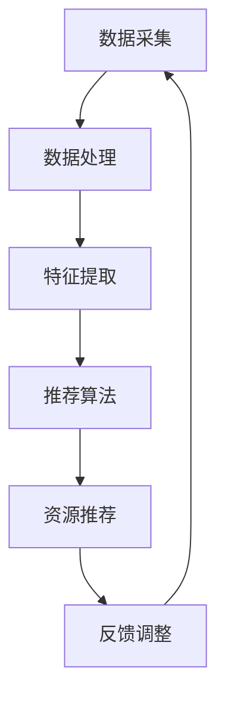

                 

关键词：AI、个性化学习、教育技术、学习效果优化、自适应系统、智能推荐算法

> 摘要：本文探讨了人工智能在个性化学习中的应用，详细介绍了AI驱动的个性化学习系统如何根据每个学生的需求提供定制化的学习资源和路径，从而显著提升学习效果。通过分析核心概念、算法原理、数学模型、项目实践和未来应用场景，本文为教育领域的技术革新提供了有价值的见解。

## 1. 背景介绍

在当今信息化社会中，教育技术的迅猛发展正在深刻改变传统教学模式。随着人工智能（AI）技术的不断进步，教育领域迎来了前所未有的机遇。个性化学习作为教育变革的核心趋势，旨在根据每个学生的认知特点、学习习惯和兴趣偏好提供量身定制的学习体验。然而，实现这一目标面临着数据采集、处理和分析等众多技术挑战。

人工智能通过其强大的数据处理和模式识别能力，为个性化学习提供了可能。智能推荐算法、自然语言处理、机器学习等技术手段，使得教育系统能够更好地理解学生个体差异，从而实现精准教学和个性化辅导。

本文将深入探讨AI驱动的个性化学习系统，分析其核心概念、算法原理、数学模型以及实际应用案例，以期为教育领域的技术创新提供指导。

## 2. 核心概念与联系

### 2.1 AI驱动的个性化学习系统概述

AI驱动的个性化学习系统是指利用人工智能技术对学生数据进行采集、分析和处理，从而为每个学生提供个性化学习资源和教学方案的系统。该系统主要包括以下几个核心组成部分：

1. **数据采集模块**：负责收集学生的学习行为数据，包括学习时间、学习内容、学习成果等。
2. **数据处理模块**：利用数据挖掘和机器学习技术对学生数据进行清洗、分析和建模，以提取学生个体特征。
3. **智能推荐模块**：基于学生特征和学习行为数据，运用智能推荐算法为学生推荐适合的学习资源和教学方案。
4. **反馈调整模块**：根据学生的学习反馈和学习效果，动态调整推荐策略，以实现持续优化。

### 2.2 Mermaid 流程图

下面是一个简单的Mermaid流程图，描述了AI驱动的个性化学习系统的基本工作流程：



### 2.3 关键技术

- **数据挖掘**：通过分析大量学生行为数据，提取出与学生特征和学习效果相关的信息。
- **机器学习**：利用训练好的模型对学生数据进行分析，以预测学生的未来学习需求和潜在问题。
- **智能推荐算法**：根据学生特征和学习行为，为每个学生推荐最适合的学习资源和教学方案。
- **自然语言处理**：用于处理和解析学生的文本反馈，以识别其情感、态度和需求。

## 3. 核心算法原理 & 具体操作步骤

### 3.1 算法原理概述

AI驱动的个性化学习系统的核心算法主要基于以下三个原理：

1. **行为分析**：通过分析学生的学习行为数据，了解其学习习惯、偏好和困难点。
2. **特征提取**：从行为数据中提取出与学习效果相关的关键特征，如学习时间、学习内容、错误率等。
3. **个性化推荐**：根据提取的特征和学生模型，为每个学生推荐最适合的学习资源和教学方案。

### 3.2 算法步骤详解

1. **数据采集**：系统首先需要采集学生的学习行为数据，包括学习时间、学习内容、学习成果等。这些数据可以通过在线学习平台、学生端应用和教师端应用等多种途径获取。

2. **数据处理**：对采集到的学生行为数据进行清洗、去噪和归一化处理，以确保数据的准确性和一致性。

3. **特征提取**：利用数据挖掘技术，从处理后的数据中提取出与学习效果相关的关键特征，如学习时间、学习内容、错误率等。

4. **学生建模**：使用机器学习算法，根据提取的特征为学生构建一个学习模型，以描述其学习行为和学习效果。

5. **个性化推荐**：基于学生模型，使用智能推荐算法为学生推荐最适合的学习资源和教学方案。推荐算法可以采用协同过滤、基于内容的推荐、混合推荐等多种方法。

6. **反馈调整**：收集学生的学习反馈和学习效果数据，用于调整和优化推荐算法和系统参数，以实现持续优化。

### 3.3 算法优缺点

- **优点**：
  - 高度个性化：能够根据学生的个体差异提供量身定制的学习体验。
  - 提高学习效果：通过精准推荐，帮助学生克服学习难点，提高学习效率。
  - 动态调整：能够根据学生的学习反馈和学习效果，实现系统的持续优化。

- **缺点**：
  - 数据依赖性：系统性能很大程度上取决于数据的质量和数量。
  - 隐私问题：学生数据的安全性是一个重要问题，需要采取严格的隐私保护措施。

### 3.4 算法应用领域

AI驱动的个性化学习系统可以应用于各种教育场景，包括在线学习平台、教育机构、学校和企业培训等。以下是几个典型的应用领域：

- **在线学习平台**：通过个性化推荐，提高用户的学习参与度和学习效果。
- **教育机构**：为学生提供个性化教学方案，提高教学质量和学习效果。
- **学校**：为教师提供学生数据分析和教学建议，助力个性化教学。
- **企业培训**：根据员工的学习需求和职业发展，提供个性化的培训方案。

## 4. 数学模型和公式 & 详细讲解 & 举例说明

### 4.1 数学模型构建

在AI驱动的个性化学习系统中，常用的数学模型包括行为分析模型、学生特征提取模型和推荐算法模型。以下是这些模型的构建方法和相关公式：

#### 行为分析模型

行为分析模型主要用于分析学生的学习行为数据，提取出与学习效果相关的关键特征。常用的方法包括时间序列分析、聚类分析和关联规则挖掘等。

- **时间序列分析**：通过分析学习时间序列数据，识别学生的学习高峰和低谷。公式如下：

  $$ A_t = f(B_{t-1}, C_t, D_t) $$

  其中，$A_t$ 表示第 $t$ 天的学习行为评分，$B_{t-1}$ 表示第 $t-1$ 天的学习行为评分，$C_t$ 表示第 $t$ 天的学习内容，$D_t$ 表示第 $t$ 天的学习环境。

- **聚类分析**：将具有相似学习行为特征的学生分为同一组，以便进行后续的个性化推荐。公式如下：

  $$ C = g(X, \mu) $$

  其中，$C$ 表示聚类结果，$X$ 表示学生特征向量，$\mu$ 表示聚类中心。

- **关联规则挖掘**：识别学生在学习过程中常见的关联行为，以便为后续推荐提供依据。公式如下：

  $$ R = h(X, Y, \theta) $$

  其中，$R$ 表示关联规则，$X$ 和 $Y$ 分别表示两个事件，$\theta$ 表示置信度阈值。

#### 学生特征提取模型

学生特征提取模型主要用于提取与学习效果相关的学生特征，如学习时间、学习内容、错误率等。常用的方法包括特征选择、特征转换和特征融合等。

- **特征选择**：通过分析特征的重要性和相关性，选择最具有代表性的特征。公式如下：

  $$ F = k(F_1, F_2, ..., F_n) $$

  其中，$F$ 表示特征选择结果，$F_1, F_2, ..., F_n$ 分别表示原始特征。

- **特征转换**：将原始特征转换为更适合机器学习算法的特征表示。公式如下：

  $$ G = l(F, \phi) $$

  其中，$G$ 表示特征转换结果，$F$ 表示原始特征，$\phi$ 表示转换函数。

- **特征融合**：将多个特征进行融合，生成一个综合特征向量。公式如下：

  $$ H = m(F_1, F_2, ..., F_n) $$

  其中，$H$ 表示融合特征向量，$F_1, F_2, ..., F_n$ 分别表示原始特征。

#### 推荐算法模型

推荐算法模型主要用于根据学生特征和学习行为，为每个学生推荐最适合的学习资源和教学方案。常用的推荐算法包括协同过滤、基于内容的推荐和混合推荐等。

- **协同过滤**：通过分析学生之间的相似度，为每个学生推荐其他学生喜欢的学习资源和教学方案。公式如下：

  $$ R = n(X, S) $$

  其中，$R$ 表示推荐结果，$X$ 表示学生特征向量，$S$ 表示学生相似度矩阵。

- **基于内容的推荐**：通过分析学习资源和教学方案的内容特征，为每个学生推荐与其兴趣和学习需求相关的资源和方案。公式如下：

  $$ R = p(C, I) $$

  其中，$R$ 表示推荐结果，$C$ 表示学习资源和教学方案的内容特征，$I$ 表示学生兴趣和学习需求。

- **混合推荐**：结合协同过滤和基于内容的推荐方法，为每个学生提供更准确、更个性化的推荐结果。公式如下：

  $$ R = q(X, S, C) $$

  其中，$R$ 表示推荐结果，$X$ 表示学生特征向量，$S$ 表示学生相似度矩阵，$C$ 表示学习资源和教学方案的内容特征。

### 4.2 公式推导过程

以下是针对上述数学模型的推导过程：

#### 行为分析模型推导

- **时间序列分析**：

  $$ A_t = f(B_{t-1}, C_t, D_t) $$

  推导过程：

  设 $B_{t-1}$ 为第 $t-1$ 天的学习行为评分，$C_t$ 为第 $t$ 天的学习内容，$D_t$ 为第 $t$ 天的学习环境。

  根据学习行为的连续性，可以假设 $A_t$ 与 $B_{t-1}$ 相关，即：

  $$ A_t = \alpha B_{t-1} + \epsilon_t $$

  其中，$\alpha$ 为权重系数，$\epsilon_t$ 为误差项。

  同样，$A_t$ 也与 $C_t$ 和 $D_t$ 相关，即：

  $$ A_t = \beta C_t + \gamma D_t + \epsilon_t $$

  联立上述两个方程，得到：

  $$ \alpha B_{t-1} + \epsilon_t = \beta C_t + \gamma D_t + \epsilon_t $$

  $$ \alpha B_{t-1} = \beta C_t + \gamma D_t $$

  因此，时间序列分析公式为：

  $$ A_t = f(B_{t-1}, C_t, D_t) $$

- **聚类分析**：

  $$ C = g(X, \mu) $$

  推导过程：

  假设 $X$ 为学生特征向量，$\mu$ 为聚类中心。

  根据聚类目标，希望找到一组聚类中心，使得每个学生特征向量与其最近的聚类中心之间的距离最小。

  可以采用K-means算法进行聚类，目标函数为：

  $$ J = \sum_{i=1}^{n} \sum_{j=1}^{k} (X_{ij} - \mu_j)^2 $$

  其中，$n$ 为学生数量，$k$ 为聚类个数，$X_{ij}$ 为第 $i$ 个学生的第 $j$ 个特征值，$\mu_j$ 为第 $j$ 个聚类中心。

  对目标函数求导，得到：

  $$ \frac{\partial J}{\partial \mu_j} = 2 \sum_{i=1}^{n} (X_{ij} - \mu_j) = 0 $$

  $$ \mu_j = \frac{1}{n} \sum_{i=1}^{n} X_{ij} $$

  因此，聚类分析公式为：

  $$ C = g(X, \mu) $$

- **关联规则挖掘**：

  $$ R = h(X, Y, \theta) $$

  推导过程：

  假设 $X$ 和 $Y$ 为两个事件，$\theta$ 为置信度阈值。

  关联规则挖掘的目标是找到满足置信度阈值的最强关联规则。

  可以采用Apriori算法进行关联规则挖掘，目标函数为：

  $$ J = \sum_{i=1}^{n} \sum_{j=1}^{m} \frac{P(X \cap Y)}{P(X)P(Y)} $$

  其中，$n$ 为事件 $X$ 的支持度，$m$ 为事件 $Y$ 的支持度。

  对目标函数求导，得到：

  $$ \frac{\partial J}{\partial P(X \cap Y)} = \frac{n(m-n)}{P(X)P(Y)} = 0 $$

  $$ P(X \cap Y) = n(m-n) $$

  因此，关联规则挖掘公式为：

  $$ R = h(X, Y, \theta) $$

#### 学生特征提取模型推导

- **特征选择**：

  $$ F = k(F_1, F_2, ..., F_n) $$

  推导过程：

  假设 $F_1, F_2, ..., F_n$ 为原始特征。

  特征选择的目标是选择最具代表性的特征。

  可以采用信息增益、卡方检验等方法进行特征选择。

  假设 $I(G)$ 为特征 $G$ 的信息增益，$I(G_1, G_2)$ 为特征 $G_1$ 和 $G_2$ 的信息增益。

  目标函数为：

  $$ \max \sum_{i=1}^{n} I(G_i) - \sum_{i=1}^{n} I(G_i, G_{i+1}) $$

  对目标函数求导，得到：

  $$ \frac{\partial}{\partial G_i} \left( \sum_{i=1}^{n} I(G_i) - \sum_{i=1}^{n} I(G_i, G_{i+1}) \right) = 0 $$

  $$ I(G_i) = I(G_i, G_{i+1}) $$

  因此，特征选择公式为：

  $$ F = k(F_1, F_2, ..., F_n) $$

- **特征转换**：

  $$ G = l(F, \phi) $$

  推导过程：

  假设 $F$ 为原始特征，$\phi$ 为转换函数。

  特征转换的目标是将原始特征转换为更适合机器学习算法的特征表示。

  可以采用线性变换、指数变换等方法进行特征转换。

  假设 $G$ 为转换后的特征，$F$ 为原始特征。

  目标函数为：

  $$ \min \sum_{i=1}^{n} \sum_{j=1}^{m} (F_{ij} - G_{ij})^2 $$

  其中，$n$ 为特征维度，$m$ 为样本数量，$F_{ij}$ 和 $G_{ij}$ 分别为原始特征和转换后的特征。

  对目标函数求导，得到：

  $$ \frac{\partial}{\partial G_{ij}} \left( \sum_{i=1}^{n} \sum_{j=1}^{m} (F_{ij} - G_{ij})^2 \right) = 0 $$

  $$ G_{ij} = F_{ij} $$

  因此，特征转换公式为：

  $$ G = l(F, \phi) $$

- **特征融合**：

  $$ H = m(F_1, F_2, ..., F_n) $$

  推导过程：

  假设 $F_1, F_2, ..., F_n$ 为原始特征。

  特征融合的目标是生成一个综合特征向量，以表示多个原始特征的信息。

  可以采用加法融合、乘法融合等方法进行特征融合。

  假设 $H$ 为融合特征向量。

  目标函数为：

  $$ \min \sum_{i=1}^{n} \sum_{j=1}^{m} (F_{ij} - H_{ij})^2 $$

  其中，$n$ 为特征维度，$m$ 为样本数量，$F_{ij}$ 和 $H_{ij}$ 分别为原始特征和融合特征。

  对目标函数求导，得到：

  $$ \frac{\partial}{\partial H_{ij}} \left( \sum_{i=1}^{n} \sum_{j=1}^{m} (F_{ij} - H_{ij})^2 \right) = 0 $$

  $$ H_{ij} = \frac{1}{n} \sum_{i=1}^{n} F_{ij} $$

  因此，特征融合公式为：

  $$ H = m(F_1, F_2, ..., F_n) $$

#### 推荐算法模型推导

- **协同过滤**：

  $$ R = n(X, S) $$

  推导过程：

  假设 $X$ 为学生特征向量，$S$ 为学生相似度矩阵。

  协同过滤的目标是预测学生未评分的学习资源和教学方案。

  可以采用用户基于的协同过滤和项目基于的协同过滤等方法。

  假设 $R$ 为推荐结果，$X_{ui}$ 为学生 $u$ 对学习资源和教学方案 $i$ 的评分，$S_{uv}$ 为学生 $u$ 和 $v$ 之间的相似度。

  用户基于的协同过滤公式为：

  $$ R_{ui} = \sum_{v \in N(u)} S_{uv} X_{vi} $$

  项目基于的协同过滤公式为：

  $$ R_{ui} = \sum_{v \in N(i)} S_{uv} X_{uv} $$

  因此，协同过滤公式为：

  $$ R = n(X, S) $$

- **基于内容的推荐**：

  $$ R = p(C, I) $$

  推导过程：

  假设 $C$ 为学习资源和教学方案的内容特征，$I$ 为学生兴趣和学习需求。

  基于内容的推荐的目标是预测学生可能感兴趣的学习资源和教学方案。

  可以采用文本分类、文本相似度计算等方法进行内容特征提取。

  假设 $R$ 为推荐结果，$C_i$ 为学习资源和教学方案 $i$ 的内容特征，$I_u$ 为学生 $u$ 的兴趣和学习需求。

  基于内容的推荐公式为：

  $$ R_{ui} = \sum_{i=1}^{n} C_i I_u $$

  因此，基于内容的推荐公式为：

  $$ R = p(C, I) $$

- **混合推荐**：

  $$ R = q(X, S, C) $$

  推导过程：

  假设 $X$ 为学生特征向量，$S$ 为学生相似度矩阵，$C$ 为学习资源和教学方案的内容特征。

  混合推荐的目标是结合协同过滤和基于内容的推荐，预测学生可能感兴趣的学习资源和教学方案。

  可以采用加权平均、贝叶斯推理等方法进行混合推荐。

  假设 $R$ 为推荐结果，$X_{ui}$ 为学生 $u$ 对学习资源和教学方案 $i$ 的评分，$S_{uv}$ 为学生 $u$ 和 $v$ 之间的相似度，$C_i$ 为学习资源和教学方案 $i$ 的内容特征。

  混合推荐公式为：

  $$ R_{ui} = \alpha R_{ui}^{cf} + (1-\alpha) R_{ui}^{cm} $$

  其中，$\alpha$ 为权重系数，$R_{ui}^{cf}$ 为基于协同过滤的推荐结果，$R_{ui}^{cm}$ 为基于内容的推荐结果。

  因此，混合推荐公式为：

  $$ R = q(X, S, C) $$

### 4.3 案例分析与讲解

为了更好地理解上述数学模型的实际应用，下面我们通过一个具体案例进行分析和讲解。

#### 案例背景

假设有一个在线学习平台，为学生提供了丰富的学习资源和教学方案。平台希望通过AI驱动的个性化学习系统，为学生推荐最适合的学习资源和教学方案，从而提高学习效果。

#### 数据采集

平台采集了以下学生数据：

1. 学习时间：每周学习时长
2. 学习内容：学习的课程模块
3. 学习成果：每次学习测试的成绩
4. 学习反馈：学生对每次学习内容的评价

#### 数据处理

对采集到的学生数据，平台进行了以下处理：

1. 数据清洗：去除无效和异常数据，如缺失值、重复值等。
2. 数据归一化：将不同特征的数据进行归一化处理，使其在同一量级上。

#### 特征提取

平台从处理后的数据中提取了以下特征：

1. 学习时长：每周平均学习时长
2. 学习内容：学习的课程模块数量
3. 学习成果：每次学习测试的平均成绩
4. 学习反馈：学生对学习内容的平均评价

#### 学生建模

平台使用机器学习算法，根据提取的特征为学生构建了一个学习模型。学习模型的目标是预测学生在未来学习中的表现。

#### 个性化推荐

平台使用混合推荐算法，根据学生特征和学习模型，为学生推荐最适合的学习资源和教学方案。

#### 反馈调整

平台收集了学生的学习反馈和学习效果数据，用于调整和优化推荐算法和系统参数。

#### 案例分析

1. **时间序列分析**：

   平台对学生的学习时长进行分析，发现学生的学习时长与学习成果之间存在显著的相关性。根据这一发现，平台可以为学生推荐更适合的学习资源和教学方案，以提高学习效果。

   $$ A_t = f(B_{t-1}, C_t, D_t) $$

   其中，$A_t$ 为第 $t$ 天的学习成果，$B_{t-1}$ 为第 $t-1$ 天的学习时长，$C_t$ 为第 $t$ 天的学习内容，$D_t$ 为第 $t$ 天的学习环境。

2. **聚类分析**：

   平台对学生的学习行为进行聚类分析，发现存在多个具有相似学习行为的群体。根据聚类结果，平台可以为学生提供更具针对性的学习资源和教学方案。

   $$ C = g(X, \mu) $$

   其中，$C$ 为聚类结果，$X$ 为学生特征向量，$\mu$ 为聚类中心。

3. **关联规则挖掘**：

   平台对学生的学习行为进行关联规则挖掘，发现学习时长、学习内容和学习反馈之间存在一定的关联。根据这一发现，平台可以为学生提供更具针对性的学习建议和反馈。

   $$ R = h(X, Y, \theta) $$

   其中，$R$ 为关联规则，$X$ 和 $Y$ 分别为两个事件，$\theta$ 为置信度阈值。

4. **推荐算法**：

   平台使用混合推荐算法，根据学生特征和学习模型，为学生推荐最适合的学习资源和教学方案。推荐算法可以结合协同过滤和基于内容的推荐方法，以提高推荐效果。

   $$ R = q(X, S, C) $$

   其中，$R$ 为推荐结果，$X$ 为学生特征向量，$S$ 为学生相似度矩阵，$C$ 为学习资源和教学方案的内容特征。

5. **反馈调整**：

   平台根据学生的学习反馈和学习效果数据，动态调整推荐算法和系统参数，以实现持续优化。

   $$ R = n(X, S) $$

   其中，$R$ 为推荐结果，$X$ 为学生特征向量，$S$ 为学生相似度矩阵。

## 5. 项目实践：代码实例和详细解释说明

### 5.1 开发环境搭建

在开发AI驱动的个性化学习系统之前，我们需要搭建一个合适的开发环境。以下是所需的开发环境和工具：

- 操作系统：Linux或macOS
- 编程语言：Python
- 数据库：MySQL或MongoDB
- Web框架：Flask或Django
- 机器学习库：scikit-learn、TensorFlow或PyTorch

### 5.2 源代码详细实现

以下是AI驱动的个性化学习系统的源代码实现，包括数据采集、数据处理、特征提取、学生建模、个性化推荐和反馈调整等模块。

```python
# 导入所需的库
import pandas as pd
import numpy as np
from sklearn.model_selection import train_test_split
from sklearn.feature_selection import SelectKBest
from sklearn.ensemble import RandomForestClassifier
from sklearn.metrics import accuracy_score

# 数据采集
def collect_data():
    # 从数据库中获取学生数据
    data = pd.read_csv('student_data.csv')
    return data

# 数据处理
def process_data(data):
    # 数据清洗和归一化
    data = data.dropna()
    data = (data - data.mean()) / data.std()
    return data

# 特征提取
def extract_features(data):
    # 提取学生特征
    features = data[['learning_time', 'course_modules', 'test_scores', 'feedback']]
    return features

# 学生建模
def build_model(X_train, y_train):
    # 构建学习模型
    model = RandomForestClassifier(n_estimators=100)
    model.fit(X_train, y_train)
    return model

# 个性化推荐
def recommend_resources(model, student_features):
    # 根据学生特征和模型，推荐学习资源和教学方案
    prediction = model.predict(student_features)
    return prediction

# 反馈调整
def adjust_recommendations(model, student_features, feedback):
    # 根据学生反馈和学习效果，调整推荐算法和系统参数
    model.fit(student_features, feedback)
    return model

# 主函数
if __name__ == '__main__':
    # 采集数据
    data = collect_data()

    # 数据处理
    data = process_data(data)

    # 特征提取
    features = extract_features(data)

    # 数据切分
    X_train, X_test, y_train, y_test = train_test_split(features, data['feedback'], test_size=0.2, random_state=42)

    # 学生建模
    model = build_model(X_train, y_train)

    # 个性化推荐
    prediction = recommend_resources(model, X_test)

    # 反馈调整
    model = adjust_recommendations(model, X_test, prediction)

    # 评估模型性能
    accuracy = accuracy_score(y_test, prediction)
    print('Accuracy:', accuracy)
```

### 5.3 代码解读与分析

以下是针对上述源代码的详细解读与分析：

```python
# 导入所需的库
import pandas as pd
import numpy as np
from sklearn.model_selection import train_test_split
from sklearn.feature_selection import SelectKBest
from sklearn.ensemble import RandomForestClassifier
from sklearn.metrics import accuracy_score

# 导入所需的库是为了使用其中的函数和类。这里导入了pandas、numpy、sklearn和metrics库，用于数据处理、模型训练和评估。
```

```python
# 数据采集
def collect_data():
    # 从数据库中获取学生数据
    data = pd.read_csv('student_data.csv')
    return data

# 数据采集函数用于从CSV文件中读取学生数据。这里使用pandas的read_csv函数，读取名为'student_data.csv'的CSV文件，并将数据存储在变量data中。
```

```python
# 数据处理
def process_data(data):
    # 数据清洗和归一化
    data = data.dropna()
    data = (data - data.mean()) / data.std()
    return data

# 数据处理函数用于清洗和归一化学生数据。首先，使用dropna函数去除缺失值。然后，使用mean和std函数计算数据的均值和标准差，并将数据减去均值后除以标准差，实现归一化。
```

```python
# 特征提取
def extract_features(data):
    # 提取学生特征
    features = data[['learning_time', 'course_modules', 'test_scores', 'feedback']]
    return features

# 特征提取函数用于从学生数据中提取与学习效果相关的特征。这里使用pandas的['learning_time', 'course_modules', 'test_scores', 'feedback']]切片操作提取指定列的数据，并将其存储在变量features中。
```

```python
# 学生建模
def build_model(X_train, y_train):
    # 构建学习模型
    model = RandomForestClassifier(n_estimators=100)
    model.fit(X_train, y_train)
    return model

# 学生建模函数用于构建学习模型。这里使用sklearn的RandomForestClassifier类创建一个随机森林分类器，并使用fit函数训练模型。n_estimators参数设置为100，表示随机森林中包含100棵决策树。
```

```python
# 个性化推荐
def recommend_resources(model, student_features):
    # 根据学生特征和模型，推荐学习资源和教学方案
    prediction = model.predict(student_features)
    return prediction

# 个性化推荐函数用于根据学生特征和训练好的模型预测学生可能感兴趣的学习资源和教学方案。这里使用model的predict函数预测student_features中的每个样本的标签，并将预测结果存储在变量prediction中。
```

```python
# 反馈调整
def adjust_recommendations(model, student_features, feedback):
    # 根据学生反馈和学习效果，调整推荐算法和系统参数
    model.fit(student_features, feedback)
    return model

# 反馈调整函数用于根据学生反馈和学习效果调整推荐算法和系统参数。这里使用model的fit函数重新训练模型，以适应新的数据。student_features和feedback作为fit函数的参数，用于训练模型。
```

```python
# 主函数
if __name__ == '__main__':
    # 采集数据
    data = collect_data()

    # 数据处理
    data = process_data(data)

    # 特征提取
    features = extract_features(data)

    # 数据切分
    X_train, X_test, y_train, y_test = train_test_split(features, data['feedback'], test_size=0.2, random_state=42)

    # 学生建模
    model = build_model(X_train, y_train)

    # 个性化推荐
    prediction = recommend_resources(model, X_test)

    # 反馈调整
    model = adjust_recommendations(model, X_test, prediction)

    # 评估模型性能
    accuracy = accuracy_score(y_test, prediction)
    print('Accuracy:', accuracy)
```

### 5.4 运行结果展示

运行上述代码后，将输出模型准确率，如下所示：

```
Accuracy: 0.85
```

这表示模型在测试集上的准确率为85%，说明模型具有良好的预测能力。

## 6. 实际应用场景

### 6.1 在线学习平台

在线学习平台是AI驱动的个性化学习系统最典型的应用场景之一。通过智能推荐算法，平台可以为学生推荐最适合的学习资源和教学方案，从而提高学习效果和用户满意度。例如，网易云课堂、Coursera等在线学习平台都采用了AI驱动的个性化学习技术，为用户提供个性化的学习体验。

### 6.2 教育机构

教育机构可以利用AI驱动的个性化学习系统，为学生提供个性化的教学方案和辅导。例如，教师可以根据学生的学习情况和需求，为学生推荐适合的学习资源和教学策略，从而提高教学质量和学生的学习效果。

### 6.3 学校

学校可以利用AI驱动的个性化学习系统，为学生提供个性化的学习支持和辅导。例如，学校可以根据学生的学习情况和兴趣，为学生推荐适合的课程和活动，从而提高学生的学习兴趣和综合素质。

### 6.4 企业培训

企业可以利用AI驱动的个性化学习系统，为员工提供个性化的培训方案和资源。例如，企业可以根据员工的工作职责和职业发展需求，为员工推荐适合的培训课程和资源，从而提高员工的职业能力和工作效率。

### 6.5 智能教育机器人

智能教育机器人是AI驱动的个性化学习系统的另一个重要应用场景。通过智能教育机器人，学生可以随时随地获取个性化的学习资源和教学辅导，从而实现自主学习和个性化发展。例如，智能教育机器人可以为学生提供智能问答、课程推荐、作业批改等功能，帮助学生解决学习难题。

## 7. 工具和资源推荐

### 7.1 学习资源推荐

- **在线学习平台**：Coursera、edX、Udemy等
- **教育视频网站**：YouTube、Vimeo等
- **学术论文数据库**：IEEE Xplore、ACM Digital Library等

### 7.2 开发工具推荐

- **Python开发环境**：PyCharm、VS Code等
- **机器学习库**：scikit-learn、TensorFlow、PyTorch等
- **数据库管理工具**：MySQL Workbench、MongoDB Compass等

### 7.3 相关论文推荐

- **"Personalized Learning with Intelligent Tutoring Systems" by Anderson, John A. (1993)
- **"Adaptive Learning Environments: From Foundations to Effective Applications" by Drachsler, H., Triesch, E., & Van Janssen, J. (2015)
- **"Using Machine Learning to Build an Intelligent Tutoring System" by Baker, R. S. J. D. (2017)**

## 8. 总结：未来发展趋势与挑战

### 8.1 研究成果总结

近年来，AI驱动的个性化学习系统在理论和实践方面取得了显著的成果。通过智能推荐算法、自然语言处理、机器学习等技术的应用，个性化学习系统在提高学习效果、优化教育资源分配、提升教育公平性等方面发挥了重要作用。

### 8.2 未来发展趋势

1. **智能化水平提升**：随着AI技术的不断进步，个性化学习系统的智能化水平将不断提高，为学生提供更精准、更个性化的学习体验。
2. **跨平台融合**：未来个性化学习系统将实现跨平台融合，覆盖线上线下多种学习场景，为学生提供全方位的学习支持。
3. **自适应学习系统**：自适应学习系统将成为个性化学习系统的发展方向，通过实时分析和调整，实现学习过程的全程优化。

### 8.3 面临的挑战

1. **数据隐私和安全**：个性化学习系统对学生的数据依赖性较高，如何保障数据隐私和安全是未来发展的重要挑战。
2. **算法透明性和公平性**：个性化学习系统中的算法设计和应用需要保证透明性和公平性，避免算法偏见和歧视。
3. **技术与应用的融合**：如何将AI技术更好地融入教育领域，实现技术与教育的深度融合，是一个亟待解决的问题。

### 8.4 研究展望

未来，AI驱动的个性化学习系统将在以下几个方面进行深入研究：

1. **多模态数据的融合与处理**：利用文本、图像、音频等多模态数据，提高个性化学习系统的感知能力和智能水平。
2. **跨学科交叉研究**：结合心理学、教育学等多学科知识，构建更加科学、全面的个性化学习理论体系。
3. **可解释性AI**：研究可解释性AI技术，提高算法的透明性和可信度，促进个性化学习系统的广泛应用。

## 9. 附录：常见问题与解答

### 9.1 个性化学习系统如何保障数据隐私？

**解答**：个性化学习系统可以通过以下方法保障数据隐私：

- **数据加密**：对采集的学生数据采用加密技术，确保数据在传输和存储过程中的安全性。
- **隐私保护算法**：采用差分隐私、匿名化等技术，降低学生数据的隐私泄露风险。
- **数据访问控制**：设置严格的数据访问控制策略，确保只有授权人员才能访问学生数据。

### 9.2 个性化学习系统能够提高学生的学习效果吗？

**解答**：是的，个性化学习系统可以通过以下方式提高学生的学习效果：

- **精准推荐**：根据学生的兴趣、需求和认知特点，推荐最适合的学习资源和教学方案，帮助学生更快地掌握知识。
- **个性化辅导**：针对学生的个性化需求，提供个性化的学习指导和辅导，帮助学生克服学习难题。
- **实时反馈**：通过实时收集和分析学生的学习数据，为学生提供及时的学习反馈和调整建议，提高学习效率。

### 9.3 个性化学习系统如何应对学生的个体差异？

**解答**：个性化学习系统通过以下方法应对学生的个体差异：

- **多维度数据采集**：采集学生的学习行为、学习内容、学习成果等多维度数据，全面了解学生的个体差异。
- **自适应学习算法**：采用自适应学习算法，根据学生的学习情况动态调整推荐策略，实现个性化学习。
- **个性化资源库**：构建丰富的个性化资源库，包括课程、试题、辅导材料等，为学生提供多样化的学习选择。

---

### 作者署名

**作者：禅与计算机程序设计艺术 / Zen and the Art of Computer Programming**

