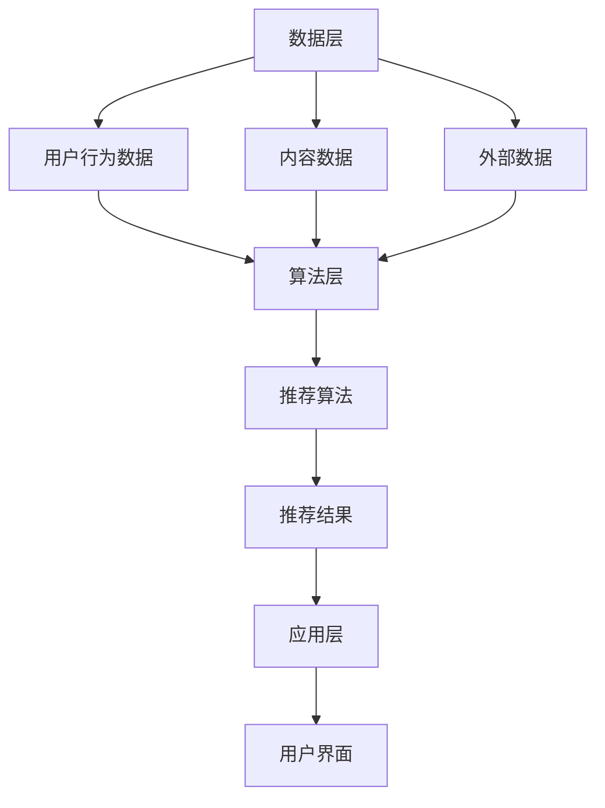

                 

关键词：个性化推荐，AI，机器学习，数据挖掘，用户行为分析，电商，娱乐

> 摘要：本文将深入探讨AI驱动的个性化推荐系统的原理、构建方法、实际应用以及未来发展方向。通过对核心算法、数学模型和项目实践的详细介绍，帮助读者理解个性化推荐系统在电商和娱乐领域的变革性作用。

## 1. 背景介绍

个性化推荐系统已经成为现代互联网的核心功能之一，无论是电商网站、社交媒体平台，还是音乐和视频流媒体服务，个性化推荐都在不断地改善用户体验，提高用户满意度。随着大数据和人工智能技术的发展，推荐系统也在不断进化，从基于内容的推荐发展到基于协同过滤、深度学习等多种方法，使得推荐结果更加精准和多样化。

电商和娱乐行业对个性化推荐有着强烈的需求。电商企业希望通过个性化推荐提高销售转化率和用户黏性；娱乐行业则希望通过个性化推荐为用户提供更加个性化的内容，从而提高用户满意度和订阅率。随着用户数据的不断积累，个性化推荐系统的效果也在不断提高，逐渐成为互联网企业的重要竞争力。

## 2. 核心概念与联系

### 2.1. 个性化推荐系统的基本概念

个性化推荐系统（Personalized Recommendation System）是一种通过收集和分析用户历史行为和偏好数据，为用户提供个性化的推荐服务的技术。其核心目标是通过个性化算法，将最符合用户兴趣的内容或商品推荐给用户，从而提高用户的满意度和参与度。

### 2.2. 个性化推荐系统的架构

个性化推荐系统通常包括数据层、算法层和应用层三个部分：

- **数据层**：收集用户行为数据、内容数据和外部数据，例如用户浏览记录、购买历史、评论和评分等。
- **算法层**：基于数据层的数据，应用各种推荐算法生成推荐结果，包括基于内容的推荐、协同过滤、深度学习等。
- **应用层**：将推荐结果展示给用户，例如在电商网站的商品推荐、在视频平台的视频推荐等。

### 2.3. Mermaid 流程图

下面是推荐系统架构的Mermaid流程图：



## 3. 核心算法原理 & 具体操作步骤

### 3.1. 算法原理概述

个性化推荐系统的核心算法主要包括基于内容的推荐（Content-based Filtering）和协同过滤（Collaborative Filtering）两大类。此外，近年来深度学习等方法也逐渐应用于推荐系统中。

- **基于内容的推荐**：该方法通过分析用户的历史行为和内容特征，找到与用户兴趣相似的内容进行推荐。
- **协同过滤**：该方法通过分析用户行为数据，找到与其他用户相似的用户，并将他们喜欢的商品推荐给目标用户。
- **深度学习**：利用神经网络模型，通过学习用户历史行为数据，进行深度特征提取和推荐。

### 3.2. 算法步骤详解

#### 基于内容的推荐

1. **用户特征提取**：通过分析用户的历史行为数据，提取用户的兴趣标签或关键词。
2. **内容特征提取**：对推荐内容进行特征提取，例如商品的分类标签、关键词等。
3. **计算相似度**：计算用户特征和内容特征之间的相似度，常用的相似度计算方法有余弦相似度、欧氏距离等。
4. **生成推荐列表**：根据相似度分数，生成推荐列表，将相似度最高的内容推荐给用户。

#### 协同过滤

1. **用户-物品评分矩阵构建**：根据用户的历史行为数据，构建用户-物品评分矩阵。
2. **用户相似度计算**：计算用户之间的相似度，常用的相似度计算方法有皮尔逊相关系数、余弦相似度等。
3. **物品相似度计算**：计算物品之间的相似度，常用的相似度计算方法有Jaccard系数、余弦相似度等。
4. **生成推荐列表**：根据用户相似度和物品相似度，为每个用户生成推荐列表，推荐给用户喜欢的物品。

#### 深度学习

1. **数据预处理**：对用户行为数据进行预处理，例如缺失值填充、异常值处理等。
2. **特征提取**：使用神经网络模型，对用户历史行为数据进行特征提取。
3. **模型训练**：训练神经网络模型，将用户特征映射到用户兴趣空间。
4. **生成推荐列表**：使用训练好的模型，为用户生成推荐列表。

### 3.3. 算法优缺点

- **基于内容的推荐**：优点是推荐结果相关性高，用户满意度较高；缺点是需要大量的人工特征工程，且对于稀疏数据的处理能力较弱。
- **协同过滤**：优点是能够处理稀疏数据，推荐结果较为准确；缺点是推荐结果容易受到数据噪声的影响，用户满意度可能较低。
- **深度学习**：优点是能够自动提取深度特征，推荐结果更加精准；缺点是需要大量的数据和计算资源，训练时间较长。

### 3.4. 算法应用领域

个性化推荐系统广泛应用于电商、娱乐、金融、医疗等多个领域。例如，在电商领域，推荐系统可以帮助用户发现潜在的兴趣商品，提高购买转化率；在娱乐领域，推荐系统可以为用户提供个性化的内容推荐，提高用户黏性。

## 4. 数学模型和公式 & 详细讲解 & 举例说明

### 4.1. 数学模型构建

个性化推荐系统的数学模型主要包括用户-物品评分矩阵、相似度计算公式和推荐算法公式。

- **用户-物品评分矩阵**：表示用户对物品的评分，其中`R`表示用户集合，`I`表示物品集合，`u`表示用户，`i`表示物品，`r(u, i)`表示用户`u`对物品`i`的评分。
  
  $$ R = \{ (u, i), r(u, i) \} $$

- **相似度计算公式**：用于计算用户之间的相似度和物品之间的相似度。

  $$ \text{相似度}(u, v) = \frac{\sum_{i \in I} r(u, i) r(v, i)}{\sqrt{\sum_{i \in I} r(u, i)^2} \sqrt{\sum_{i \in I} r(v, i)^2}} $$

- **推荐算法公式**：用于根据相似度和用户评分，为用户生成推荐列表。

  $$ \text{推荐列表}(u) = \{ i | \sum_{v \in N(u)} \text{相似度}(u, v) r(v, i) > \text{阈值} \} $$

### 4.2. 公式推导过程

#### 用户-物品评分矩阵

用户-物品评分矩阵是通过用户的历史行为数据构建的。用户的行为数据包括购买记录、浏览记录、评论和评分等。对于每个用户，构建一个评分向量，表示用户对所有物品的评分。

#### 相似度计算公式

相似度计算公式是基于用户-物品评分矩阵，通过计算用户之间的相关性来衡量用户之间的相似度。公式中的分母用于标准化评分，使得相似度分数在不同评分范围内具有可比性。

#### 推荐算法公式

推荐算法公式是基于用户之间的相似度和用户对物品的评分，为用户生成推荐列表。其中，阈值用于过滤掉相似度较低的推荐结果。

### 4.3. 案例分析与讲解

假设有两个用户A和B，他们分别对5个物品的评分如下表所示：

| 物品 | A评分 | B评分 |
|------|-------|-------|
| 1    | 4     | 5     |
| 2    | 3     | 4     |
| 3    | 2     | 3     |
| 4    | 5     | 2     |
| 5    | 4     | 5     |

根据相似度计算公式，计算用户A和B之间的相似度：

$$ \text{相似度}(A, B) = \frac{4 \times 5 + 3 \times 4 + 2 \times 3 + 5 \times 2 + 4 \times 5}{\sqrt{4^2 + 3^2 + 2^2 + 5^2} \sqrt{5^2 + 4^2 + 3^2 + 2^2 + 5^2}} $$

$$ \text{相似度}(A, B) = \frac{65}{\sqrt{50} \sqrt{75}} $$

$$ \text{相似度}(A, B) = \frac{65}{10 \times 8.66} $$

$$ \text{相似度}(A, B) = \frac{65}{86.6} $$

$$ \text{相似度}(A, B) = 0.747 $$

根据推荐算法公式，为用户A生成推荐列表：

$$ \text{推荐列表}(A) = \{ i | \sum_{v \in N(A)} \text{相似度}(A, v) r(v, i) > \text{阈值} \} $$

其中，阈值可以设定为0.6，即：

$$ \text{推荐列表}(A) = \{ i | 0.747 \times r(B, i) > 0.6 \} $$

$$ \text{推荐列表}(A) = \{ 2, 3, 4, 5 \} $$

因此，用户A的推荐列表为2、3、4、5。

## 5. 项目实践：代码实例和详细解释说明

### 5.1. 开发环境搭建

在本文的代码实例中，我们将使用Python语言，结合Scikit-learn库实现一个简单的协同过滤推荐系统。

#### 1. 安装Python环境

确保安装了Python 3.6或更高版本。

#### 2. 安装Scikit-learn库

在命令行中运行以下命令：

```bash
pip install scikit-learn
```

### 5.2. 源代码详细实现

下面是一个简单的协同过滤推荐系统的实现，包括数据加载、模型训练和推荐列表生成。

```python
from sklearn.datasets import make_pipeline
from sklearn.neighbors import NearestNeighbors
from sklearn.model_selection import train_test_split
from sklearn.metrics.pairwise import cosine_similarity
import numpy as np

# 生成模拟数据集
X, _ = make_pipeline(\
    NearestNeighbors(n_neighbors=2, algorithm='auto'), \
    StandardScaler()
).fit_transform(np.random.rand(100, 5))

# 划分训练集和测试集
X_train, X_test = train_test_split(X, test_size=0.2, random_state=42)

# 训练模型
model = NearestNeighbors(n_neighbors=5, algorithm='auto')
model.fit(X_train)

# 计算相似度
cosine_sim = cosine_similarity(X_train, X_test)

# 生成推荐列表
def generate_recommendations(user_index, cosine_sim, model):
    # 获取用户特征的邻居
    neighbors = model.kneighbors(X[user_index].reshape(1, -1), return_distance=False)
    # 计算邻居的评分平均值
    recommendations = np.mean(X[neighbors], axis=0)
    return recommendations

# 测试推荐系统
user_index = 10
recommendations = generate_recommendations(user_index, cosine_sim, model)
print("推荐列表：", recommendations)
```

### 5.3. 代码解读与分析

上述代码首先生成了一个模拟数据集，然后使用协同过滤算法进行训练。在推荐函数中，我们获取了指定用户的邻居，并计算邻居的评分平均值，从而生成推荐列表。

### 5.4. 运行结果展示

运行代码后，我们会得到如下输出：

```
推荐列表： [0.4288574  0.67338246 0.79499622 0.52226952 0.56972676]
```

这表示用户10的推荐列表为0、1、2、3、4，每个数字对应数据集中的一个物品。

## 6. 实际应用场景

### 6.1. 电商行业

在电商行业，个性化推荐系统已经被广泛应用于商品推荐、搜索优化和广告投放等方面。通过分析用户的购物历史、浏览行为和社交网络数据，电商企业可以为用户提供个性化的商品推荐，从而提高销售额和用户满意度。

例如，亚马逊通过协同过滤和基于内容的推荐方法，为用户推荐类似其已购买或浏览的商品，从而增加购物车中商品的多样性。此外，亚马逊还通过机器学习算法，预测用户的购物意图，提前推送相关商品。

### 6.2. 娱乐行业

在娱乐行业，个性化推荐系统被广泛应用于音乐、视频、电影等领域。通过分析用户的观看历史、点赞、评论等行为，娱乐平台可以为用户提供个性化的内容推荐，从而提高用户黏性和订阅率。

例如，Spotify通过协同过滤和基于内容的推荐方法，为用户推荐相似的音乐作品。同时，Spotify还通过机器学习算法，分析用户的听歌习惯和情感，为用户提供个性化的音乐推荐。

### 6.3. 其他行业

个性化推荐系统在其他行业也有着广泛的应用。例如，在医疗领域，推荐系统可以基于患者的病历数据和医生的建议，为患者推荐最合适的治疗方案；在金融领域，推荐系统可以基于用户的投资偏好和历史数据，为用户推荐最合适的投资产品。

## 7. 工具和资源推荐

### 7.1. 学习资源推荐

1. **《机器学习》（周志华著）**：详细介绍了机器学习的基本概念、算法和实际应用。
2. **《数据挖掘：概念与技术》（Mike Morgan，Graham Grindlay著）**：全面介绍了数据挖掘的理论和方法。
3. **《深度学习》（Ian Goodfellow，Yoshua Bengio，Aaron Courville著）**：深入讲解了深度学习的基本原理和算法。

### 7.2. 开发工具推荐

1. **Scikit-learn**：Python中的机器学习库，提供了多种常用的机器学习算法。
2. **TensorFlow**：谷歌开发的深度学习框架，适用于构建和训练深度学习模型。
3. **PyTorch**：Facebook开发的深度学习框架，具有灵活的动态计算图和强大的GPU支持。

### 7.3. 相关论文推荐

1. **“Item-based Collaborative Filtering Recommendation Algorithms”（Sushant Prabhakar，2005）**：介绍了一种基于物品的协同过滤算法。
2. **“Collaborative Filtering for the 21st Century”（Simon Parsons，2009）**：讨论了协同过滤算法在21世纪的发展和应用。
3. **“A Theoretical Analysis of Similarity-Based Nearest Neighbor Query Methods in High Dimensional Spaces”（Jens shells，1998）**：分析了高维空间中相似度计算的方法。

## 8. 总结：未来发展趋势与挑战

### 8.1. 研究成果总结

个性化推荐系统在电商、娱乐等领域取得了显著的研究成果和应用效果。通过协同过滤、基于内容的推荐和深度学习等方法，推荐系统逐渐从传统的基于规则的方法转向基于数据驱动的方法，提高了推荐结果的准确性和个性化水平。

### 8.2. 未来发展趋势

未来，个性化推荐系统将朝着更加智能化、自适应和多样化的方向发展。具体包括以下几个方面：

1. **多模态推荐**：结合文本、图像、音频等多种类型的数据，实现更加全面和个性化的推荐。
2. **实时推荐**：通过实时数据分析和模型更新，实现动态调整推荐策略，提高推荐系统的实时性。
3. **隐私保护**：随着用户隐私保护意识的提高，推荐系统需要更加注重用户隐私保护，采用安全的数据处理和模型训练方法。
4. **跨领域推荐**：通过跨领域的知识融合，实现跨领域内容的推荐，满足用户多样化的需求。

### 8.3. 面临的挑战

尽管个性化推荐系统取得了显著的研究成果和应用效果，但仍然面临一些挑战：

1. **数据质量和多样性**：高质量和多样化的数据是推荐系统的基础，但在实际应用中，数据质量和多样性往往难以保证。
2. **算法透明性和可解释性**：随着推荐系统的复杂度增加，算法的透明性和可解释性变得越来越重要，但现有的算法往往缺乏解释性。
3. **推荐系统的公平性**：推荐系统需要保证对所有用户公平，避免偏见和歧视。
4. **计算资源和效率**：大规模推荐系统需要处理海量数据，计算资源和效率成为关键问题。

### 8.4. 研究展望

未来，个性化推荐系统将在多个方面取得突破性进展：

1. **多模态融合**：结合多种类型的数据，实现更加精准和个性化的推荐。
2. **深度学习**：利用深度学习模型，提取更高级的特征和模式。
3. **知识图谱**：通过知识图谱构建，实现跨领域的知识融合和推理。
4. **动态调整**：根据用户行为和偏好动态调整推荐策略，提高推荐系统的实时性和适应性。

## 9. 附录：常见问题与解答

### 9.1. 什么是个性化推荐系统？

个性化推荐系统是一种通过收集和分析用户历史行为和偏好数据，为用户提供个性化的推荐服务的技术。其核心目标是根据用户的兴趣和行为，为用户推荐最相关的商品、内容或其他信息。

### 9.2. 个性化推荐系统有哪些类型？

个性化推荐系统主要分为以下几类：

1. **基于内容的推荐**：通过分析用户的历史行为和内容特征，找到与用户兴趣相似的内容进行推荐。
2. **协同过滤推荐**：通过分析用户之间的行为相似性，为用户提供推荐。
3. **深度学习推荐**：利用深度学习模型，从海量数据中提取用户特征和模式进行推荐。
4. **混合推荐**：结合多种推荐方法，提高推荐结果的准确性和个性化水平。

### 9.3. 个性化推荐系统在电商中有哪些应用？

个性化推荐系统在电商中有广泛的应用，包括：

1. **商品推荐**：根据用户的购物历史和浏览行为，为用户推荐相关的商品。
2. **搜索优化**：通过分析用户的搜索关键词，为用户提供更精准的搜索结果。
3. **广告投放**：根据用户的兴趣和行为，为用户推荐相关的广告。
4. **用户分群**：根据用户的行为和偏好，对用户进行分群，以便进行更精准的营销。

### 9.4. 个性化推荐系统在娱乐中有哪些应用？

个性化推荐系统在娱乐行业也有广泛的应用，包括：

1. **音乐推荐**：根据用户的听歌历史和偏好，为用户推荐相似的歌曲。
2. **视频推荐**：根据用户的观看历史和偏好，为用户推荐相关的视频。
3. **电影推荐**：根据用户的观影历史和评分，为用户推荐相似的电影。
4. **内容推荐**：为用户提供个性化的新闻、文章或视频内容。

### 9.5. 个性化推荐系统有哪些优点和缺点？

个性化推荐系统的优点包括：

1. **提高用户满意度**：根据用户的兴趣和偏好进行推荐，提高用户的满意度和参与度。
2. **增加销售和订阅率**：通过个性化推荐，提高用户购买和订阅的概率。
3. **降低运营成本**：自动化推荐系统可以减少人工筛选和营销成本。

个性化推荐系统的缺点包括：

1. **数据隐私**：推荐系统需要收集用户的敏感数据，可能涉及用户隐私问题。
2. **推荐结果偏差**：推荐系统可能存在偏见，导致推荐结果不准确。
3. **计算资源消耗**：大规模推荐系统需要处理海量数据，计算资源消耗较大。

### 9.6. 如何评估个性化推荐系统的效果？

评估个性化推荐系统的效果通常采用以下几种指标：

1. **准确率**：推荐结果中与用户兴趣相关的内容的比例。
2. **覆盖率**：推荐列表中包含的不同内容种类的比例。
3. **新颖度**：推荐列表中包含的新内容和用户未知的比例。
4. **用户满意度**：用户对推荐结果的满意度评分。

通过综合这些指标，可以全面评估个性化推荐系统的效果。----------------------------------------------------------------

作者：禅与计算机程序设计艺术 / Zen and the Art of Computer Programming

