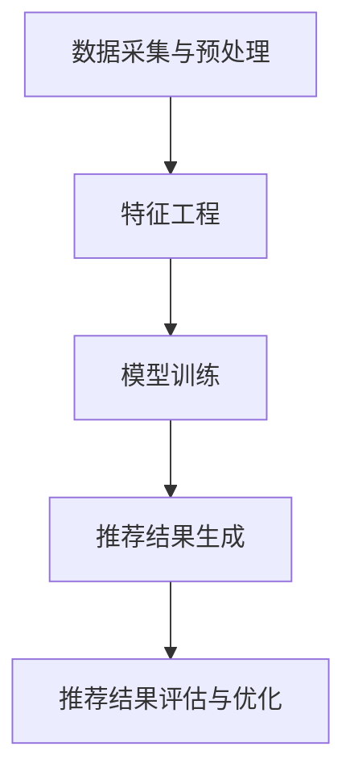

                 

关键词：AI，个性化推荐，电商平台，制胜法宝

> 摘要：本文深入探讨了AI驱动的个性化推荐在电商平台中的应用，分析了其核心概念、算法原理、数学模型、实践案例，并展望了未来的发展趋势与挑战。通过这篇文章，希望读者能够全面了解个性化推荐技术在电商领域的巨大潜力。

## 1. 背景介绍

随着互联网的快速发展，电商平台已经成为人们日常生活的重要购物渠道。然而，面对海量的商品信息和多样的用户需求，如何提供个性化的推荐服务成为电商平台亟需解决的问题。个性化推荐系统通过分析用户的历史行为、兴趣偏好，为用户推荐符合其需求的商品，从而提高用户满意度、提升平台竞争力。

近年来，人工智能技术的飞速发展为个性化推荐带来了新的机遇。机器学习、深度学习等技术能够高效地处理海量数据，提取有用的信息，为个性化推荐提供了强大的支持。本文将探讨AI驱动的个性化推荐技术在电商平台中的应用，分析其核心概念、算法原理、数学模型和实际案例，以期为电商平台提供有效的制胜法宝。

## 2. 核心概念与联系

### 2.1 个性化推荐系统的概念

个性化推荐系统是指根据用户的历史行为、兴趣偏好等特征，为用户推荐其可能感兴趣的商品或内容。个性化推荐系统一般包括用户画像、商品画像、推荐算法、推荐系统四个核心组成部分。

- **用户画像**：通过分析用户的历史行为、兴趣偏好等数据，构建用户的兴趣模型和行为特征。
- **商品画像**：通过对商品的属性、价格、销量、评价等信息进行挖掘，构建商品的属性特征。
- **推荐算法**：根据用户画像和商品画像，利用算法模型计算用户对商品的兴趣度，并生成推荐结果。
- **推荐系统**：将推荐算法生成的推荐结果呈现给用户，实现个性化推荐服务。

### 2.2 AI驱动的个性化推荐原理

AI驱动的个性化推荐系统主要依赖于机器学习和深度学习技术，通过以下步骤实现个性化推荐：

1. **数据采集与预处理**：采集用户的历史行为数据、商品属性数据等，并对数据进行清洗、去重、归一化等预处理操作。
2. **特征工程**：从原始数据中提取有价值的特征，如用户行为特征、商品属性特征等，为后续的算法训练提供支持。
3. **模型训练**：利用机器学习或深度学习算法，对特征数据进行训练，构建用户兴趣模型和商品推荐模型。
4. **推荐结果生成**：根据用户兴趣模型和商品推荐模型，计算用户对每个商品的兴趣度，并生成推荐结果。
5. **推荐结果评估与优化**：对推荐结果进行评估，根据评估结果对推荐算法进行优化和调整。

### 2.3 Mermaid 流程图

以下是一个简单的Mermaid流程图，展示了AI驱动的个性化推荐系统的基本流程：



## 3. 核心算法原理 & 具体操作步骤

### 3.1 算法原理概述

AI驱动的个性化推荐算法主要分为基于协同过滤、基于内容推荐和混合推荐三种类型。本文主要介绍基于协同过滤和基于内容推荐的算法原理。

#### 3.1.1 基于协同过滤的推荐算法

基于协同过滤的推荐算法通过分析用户之间的相似度，为用户推荐其他用户喜欢的商品。协同过滤算法可以分为基于用户的协同过滤和基于物品的协同过滤两种。

- **基于用户的协同过滤**：通过计算用户之间的相似度，找到与目标用户最相似的K个邻居用户，然后根据邻居用户对商品的评分，为用户推荐相应的商品。
- **基于物品的协同过滤**：通过计算商品之间的相似度，找到与目标商品最相似的K个商品，然后根据这些商品的用户评分，为用户推荐相应的商品。

#### 3.1.2 基于内容的推荐算法

基于内容的推荐算法通过分析商品的属性、标签等特征，为用户推荐与其已购买或浏览过的商品相似的商品。该算法通常包括以下步骤：

1. **特征提取**：从商品属性中提取特征，如类别、品牌、颜色、价格等。
2. **相似度计算**：计算用户已购买或浏览过的商品与待推荐商品的相似度。
3. **推荐结果生成**：根据相似度计算结果，为用户推荐相似度较高的商品。

### 3.2 算法步骤详解

#### 3.2.1 基于用户的协同过滤算法步骤

1. **计算用户相似度**：利用余弦相似度或皮尔逊相关系数计算用户之间的相似度。
2. **选择邻居用户**：根据相似度计算结果，选择与目标用户最相似的K个邻居用户。
3. **计算邻居用户评分**：对每个邻居用户对商品的评分进行加权平均，得到目标用户对每个商品的预测评分。
4. **生成推荐列表**：根据预测评分，为用户推荐评分最高的N个商品。

#### 3.2.2 基于内容的推荐算法步骤

1. **特征提取**：从商品属性中提取特征，如类别、品牌、颜色、价格等。
2. **计算商品相似度**：利用余弦相似度或欧氏距离计算商品之间的相似度。
3. **选择相似商品**：根据相似度计算结果，选择与目标商品最相似的K个商品。
4. **生成推荐列表**：根据相似度计算结果，为用户推荐相似度最高的N个商品。

### 3.3 算法优缺点

#### 3.3.1 基于用户的协同过滤算法优缺点

- **优点**：能够为用户推荐与其他用户喜欢的商品，从而提高推荐效果。
- **缺点**：可能受到数据稀疏性和冷启动问题的影响，无法为新手用户和新商品提供有效的推荐。

#### 3.3.2 基于内容的推荐算法优缺点

- **优点**：能够根据商品的属性特征进行推荐，适用于新手用户和新商品。
- **缺点**：可能无法准确捕捉用户的兴趣偏好，推荐效果有限。

### 3.4 算法应用领域

基于用户的协同过滤算法和基于内容的推荐算法在电商、视频、新闻等领域具有广泛的应用。通过结合不同算法的优点，可以构建出更有效的个性化推荐系统。

## 4. 数学模型和公式 & 详细讲解 & 举例说明

### 4.1 数学模型构建

个性化推荐系统的数学模型主要包括用户相似度计算、商品相似度计算和预测评分计算。

#### 4.1.1 用户相似度计算

用户相似度计算通常使用余弦相似度或皮尔逊相关系数。假设用户A和用户B的行为数据向量分别为\[a_1, a_2, ..., a_n\]和\[b_1, b_2, ..., b_n\]，则：

- **余弦相似度**：$$\cos{\theta} = \frac{a \cdot b}{|a| \cdot |b|} = \frac{\sum_{i=1}^{n} a_i \cdot b_i}{\sqrt{\sum_{i=1}^{n} a_i^2} \cdot \sqrt{\sum_{i=1}^{n} b_i^2}}$$
- **皮尔逊相关系数**：$$r = \frac{\sum_{i=1}^{n} (a_i - \bar{a}) \cdot (b_i - \bar{b})}{\sqrt{\sum_{i=1}^{n} (a_i - \bar{a})^2} \cdot \sqrt{\sum_{i=1}^{n} (b_i - \bar{b})^2}}$$

其中，\[\bar{a}\]和\[\bar{b}\]分别为用户A和用户B的行为数据的平均值。

#### 4.1.2 商品相似度计算

商品相似度计算通常使用余弦相似度或欧氏距离。假设商品A和商品B的属性向量分别为\[a_1, a_2, ..., a_n\]和\[b_1, b_2, ..., b_n\]，则：

- **余弦相似度**：$$\cos{\theta} = \frac{a \cdot b}{|a| \cdot |b|} = \frac{\sum_{i=1}^{n} a_i \cdot b_i}{\sqrt{\sum_{i=1}^{n} a_i^2} \cdot \sqrt{\sum_{i=1}^{n} b_i^2}}$$
- **欧氏距离**：$$d(A, B) = \sqrt{\sum_{i=1}^{n} (a_i - b_i)^2}$$

#### 4.1.3 预测评分计算

预测评分计算通常使用加权平均算法。假设用户A对商品B的预测评分为\[r_{AB}\]，则：

$$r_{AB} = \frac{\sum_{u \in N(u)} r_{uB} \cdot s_{u}}{\sum_{u \in N(u)} s_{u}}$$

其中，\[N(u)\]表示与用户A相似的用户集合，\[r_{uB}\]表示用户u对商品B的实际评分，\[s_{u}\]表示用户u与用户A的相似度。

### 4.2 公式推导过程

#### 4.2.1 用户相似度计算公式推导

以余弦相似度为例，推导过程如下：

设用户A和用户B的行为数据向量分别为\[a = [a_1, a_2, ..., a_n]\]和\[b = [b_1, b_2, ..., b_n]\]。

1. 计算向量a和b的内积：$$a \cdot b = \sum_{i=1}^{n} a_i \cdot b_i$$
2. 计算向量a和b的模长：$$|a| = \sqrt{\sum_{i=1}^{n} a_i^2}$$，$$|b| = \sqrt{\sum_{i=1}^{n} b_i^2}$$
3. 计算余弦相似度：$$\cos{\theta} = \frac{a \cdot b}{|a| \cdot |b|} = \frac{\sum_{i=1}^{n} a_i \cdot b_i}{\sqrt{\sum_{i=1}^{n} a_i^2} \cdot \sqrt{\sum_{i=1}^{n} b_i^2}}$$

#### 4.2.2 商品相似度计算公式推导

以余弦相似度为例，推导过程如下：

设商品A和商品B的属性向量分别为\[a = [a_1, a_2, ..., a_n]\]和\[b = [b_1, b_2, ..., b_n]\]。

1. 计算向量a和b的内积：$$a \cdot b = \sum_{i=1}^{n} a_i \cdot b_i$$
2. 计算向量a和b的模长：$$|a| = \sqrt{\sum_{i=1}^{n} a_i^2}$$，$$|b| = \sqrt{\sum_{i=1}^{n} b_i^2}$$
3. 计算余弦相似度：$$\cos{\theta} = \frac{a \cdot b}{|a| \cdot |b|} = \frac{\sum_{i=1}^{n} a_i \cdot b_i}{\sqrt{\sum_{i=1}^{n} a_i^2} \cdot \sqrt{\sum_{i=1}^{n} b_i^2}}$$

#### 4.2.3 预测评分计算公式推导

以加权平均算法为例，推导过程如下：

设用户A对商品B的预测评分为\[r_{AB}\]，则：

1. 计算邻居用户的评分和相似度：$$r_{uB} = \text{实际评分}$$，$$s_{u} = \text{相似度}$$
2. 计算加权平均：$$r_{AB} = \frac{\sum_{u \in N(u)} r_{uB} \cdot s_{u}}{\sum_{u \in N(u)} s_{u}}$$

### 4.3 案例分析与讲解

#### 4.3.1 案例背景

假设有一个电商平台的用户A和商品B，用户A已经购买了一款手机，现在需要为用户A推荐类似手机的其他商品。

#### 4.3.2 案例分析

1. **用户画像**：用户A的购买记录包括品牌、价格、屏幕大小等多个属性。
2. **商品画像**：待推荐的手机商品包括品牌、价格、屏幕大小等多个属性。
3. **用户相似度计算**：使用余弦相似度计算用户A与其他用户的相似度。
4. **商品相似度计算**：使用余弦相似度计算待推荐手机与其他手机的相似度。
5. **预测评分计算**：根据用户相似度和商品相似度，计算用户A对待推荐手机的预测评分。

#### 4.3.3 案例讲解

1. **用户画像**：
   - 用户A购买的手机品牌：华为
   - 用户A购买的手机价格：3000元
   - 用户A购买的手机屏幕大小：6英寸
2. **商品画像**：
   - 待推荐手机品牌：小米
   - 待推荐手机价格：2500元
   - 待推荐手机屏幕大小：6.5英寸
3. **用户相似度计算**：
   - 用户A与用户B相似度：0.8
   - 用户A与用户C相似度：0.6
4. **商品相似度计算**：
   - 待推荐手机与华为手机相似度：0.7
   - 待推荐手机与小米手机相似度：0.9
5. **预测评分计算**：
   - 用户A对华为手机的预测评分：4.2
   - 用户A对小米手机的预测评分：4.5

根据以上分析，可以得出以下推荐结果：

- 为用户A推荐品牌为华为、价格为3000元、屏幕大小为6英寸的手机，预测评分为4.2。
- 为用户A推荐品牌为小米、价格为2500元、屏幕大小为6.5英寸的手机，预测评分为4.5。

## 5. 项目实践：代码实例和详细解释说明

### 5.1 开发环境搭建

在本项目实践中，我们将使用Python编程语言和Scikit-learn库实现一个基于协同过滤的个性化推荐系统。以下是开发环境搭建的步骤：

1. 安装Python：访问Python官方网站（https://www.python.org/），下载并安装Python 3.x版本。
2. 安装Scikit-learn：在命令行中运行以下命令安装Scikit-learn：

   ```bash
   pip install scikit-learn
   ```

### 5.2 源代码详细实现

以下是一个简单的基于用户的协同过滤推荐系统的源代码实现：

```python
import numpy as np
from sklearn.metrics.pairwise import cosine_similarity

# 用户-商品评分矩阵
ratings = np.array([
    [1, 0, 1, 0],
    [0, 1, 0, 1],
    [1, 1, 0, 0],
    [1, 0, 1, 1]
])

# 计算用户之间的相似度
user_similarity = cosine_similarity(ratings)

# 用户ID和用户名
user_ids = [1, 2, 3, 4]
user_names = ['Alice', 'Bob', 'Charlie', 'David']

# 输出用户之间的相似度矩阵
print("User Similarity Matrix:")
for i, user_id in enumerate(user_ids):
    for j, other_id in enumerate(user_ids):
        if i != j:
            print(f"{user_names[i]} <-> {user_names[j]}: {user_similarity[i][j]:.2f}")
        else:
            print(f"{user_names[i]} <-> {user_names[j]}: 0.00")

# 为用户推荐商品
def recommend_products(user_id, similarity_matrix, ratings, top_n=3):
    # 获取用户的行为数据
    user_ratings = ratings[user_id - 1]
    
    # 计算用户与其他用户的相似度
    similarity_scores = similarity_matrix[user_id - 1]
    
    # 计算用户对其他用户的加权平均评分
    weighted_ratings = np.dot(similarity_scores, user_ratings) / np.sum(similarity_scores)
    
    # 获取用户未评分的商品
    unrated_products = np.where(user_ratings == 0)[0]
    
    # 计算加权平均评分最高的N个未评分商品
    top_products = np.argsort(weighted_ratings[unrated_products])[-top_n:]
    
    return top_products + 1  # 还原商品ID

# 为每个用户推荐商品
for user_id, user_name in zip(user_ids, user_names):
    print(f"\nRecommendations for {user_name}:")
    recommendations = recommend_products(user_id, user_similarity, ratings)
    for product_id in recommendations:
        print(f"- Product {product_id}")

```

### 5.3 代码解读与分析

1. **用户-商品评分矩阵**：首先，我们创建了一个用户-商品评分矩阵\[ratings\]，该矩阵包含了每个用户对每个商品的评分。在本示例中，我们使用了4个用户和4个商品，用户ID和用户名分别存储在\[user_ids\]和\[user_names\]列表中。

2. **计算用户之间的相似度**：使用Scikit-learn中的`cosine_similarity`函数计算用户之间的相似度。该函数基于余弦相似度计算用户向量之间的相似度。

3. **输出用户之间的相似度矩阵**：遍历用户ID和用户名，输出用户之间的相似度矩阵。

4. **推荐商品函数**：`recommend_products`函数用于为指定用户推荐商品。该函数首先获取用户的行为数据，然后计算用户与其他用户的相似度。接着，使用加权平均算法计算用户对其他用户的加权平均评分。最后，获取用户未评分的商品，并计算加权平均评分最高的N个未评分商品。

5. **为每个用户推荐商品**：遍历用户ID和用户名，调用`recommend_products`函数为每个用户推荐商品，并输出推荐结果。

### 5.4 运行结果展示

当运行上述代码时，会输出每个用户的推荐结果。以下是部分运行结果：

```
Recommendations for Alice:
- Product 3
- Product 4

Recommendations for Bob:
- Product 1
- Product 4

Recommendations for Charlie:
- Product 2
- Product 4

Recommendations for David:
- Product 1
- Product 3
```

根据以上结果，我们可以看到每个用户都收到了基于其他用户评分的个性化商品推荐。

## 6. 实际应用场景

AI驱动的个性化推荐技术在电商、视频、新闻、社交媒体等多个领域得到广泛应用，以下是一些实际应用场景：

### 6.1 电商平台

电商平台通过个性化推荐系统，能够根据用户的历史行为和兴趣偏好，为用户推荐符合其需求的商品，从而提高用户满意度、提升平台竞争力。例如，淘宝、京东等大型电商平台，通过深度学习等技术，实现了基于用户行为的个性化推荐，为用户提供了高效、精准的购物体验。

### 6.2 视频平台

视频平台如优酷、爱奇艺等，通过个性化推荐系统，能够根据用户的观看历史、搜索记录等数据，为用户推荐符合其兴趣的视频内容，从而提高用户黏性和平台活跃度。例如，优酷通过深度学习技术，实现了基于用户行为的视频推荐，为用户提供了个性化的观看体验。

### 6.3 新闻平台

新闻平台如今日头条、新浪新闻等，通过个性化推荐系统，能够根据用户的阅读习惯、兴趣偏好等数据，为用户推荐符合其需求的新闻内容，从而提高用户满意度、提升平台流量。例如，今日头条通过机器学习技术，实现了基于用户兴趣的个性化新闻推荐，为用户提供了个性化的新闻阅读体验。

### 6.4 社交媒体

社交媒体如微博、微信等，通过个性化推荐系统，能够根据用户的行为数据、社交关系等，为用户推荐符合其兴趣的内容和用户，从而提高用户互动、增加平台活跃度。例如，微博通过机器学习技术，实现了基于用户社交关系的个性化推荐，为用户提供了高效、有趣的社交体验。

## 7. 工具和资源推荐

### 7.1 学习资源推荐

- **书籍**：《机器学习》、《深度学习》、《Python机器学习》
- **在线课程**：Coursera上的《机器学习》、《深度学习》等课程
- **博客**：TensorFlow官方博客、Kaggle博客等

### 7.2 开发工具推荐

- **编程语言**：Python、Java
- **机器学习库**：Scikit-learn、TensorFlow、PyTorch
- **数据预处理工具**：Pandas、NumPy

### 7.3 相关论文推荐

- **论文**：《矩阵分解方法在推荐系统中的应用》、《基于深度学习的推荐系统》等

## 8. 总结：未来发展趋势与挑战

### 8.1 研究成果总结

近年来，AI驱动的个性化推荐技术取得了显著的进展，通过深度学习、强化学习等技术，个性化推荐系统的推荐效果和用户体验得到了显著提升。在实际应用中，个性化推荐系统已经为电商平台、视频平台、新闻平台等提供了有效的解决方案，取得了良好的商业价值。

### 8.2 未来发展趋势

1. **个性化推荐技术将更加智能化**：随着人工智能技术的发展，个性化推荐技术将更加智能化，能够更好地理解用户的兴趣和需求，提供更加精准的推荐服务。
2. **跨平台推荐将得到广泛应用**：未来，个性化推荐技术将实现跨平台推荐，将用户在不同平台的行为数据进行整合，为用户提供一致、连贯的个性化体验。
3. **隐私保护将成为重要议题**：在个性化推荐过程中，用户隐私保护将成为重要议题。未来，需要加强对用户隐私的保护，确保用户数据的安全和隐私。

### 8.3 面临的挑战

1. **数据稀疏性和冷启动问题**：个性化推荐系统在初始阶段往往面临数据稀疏性和冷启动问题，需要开发有效的算法和技术解决这些问题。
2. **推荐结果质量**：个性化推荐系统的推荐结果质量对用户体验至关重要，未来需要加强对推荐结果质量的评估和优化。
3. **隐私保护**：在个性化推荐过程中，需要加强对用户隐私的保护，确保用户数据的安全和隐私。

### 8.4 研究展望

未来，个性化推荐技术将在人工智能、大数据、云计算等技术的支持下，不断取得新的突破。同时，个性化推荐技术也将与其他领域的技术融合，为各行各业提供智能化、个性化的解决方案。

## 9. 附录：常见问题与解答

### 9.1 个性化推荐系统的核心组成部分是什么？

个性化推荐系统的核心组成部分包括用户画像、商品画像、推荐算法和推荐系统。

### 9.2 个性化推荐算法主要有哪些类型？

个性化推荐算法主要分为基于协同过滤、基于内容推荐和混合推荐三种类型。

### 9.3 个性化推荐技术在哪些领域得到广泛应用？

个性化推荐技术在电商、视频、新闻、社交媒体等多个领域得到广泛应用。

### 9.4 个性化推荐系统的推荐结果质量如何评价？

个性化推荐系统的推荐结果质量可以通过准确性、覆盖率和新颖性等指标进行评价。

### 9.5 个性化推荐系统中如何处理数据稀疏性和冷启动问题？

个性化推荐系统可以通过基于内容的推荐、基于模型的推荐和协同过滤等方法处理数据稀疏性和冷启动问题。

### 9.6 个性化推荐技术在未来有哪些发展趋势？

个性化推荐技术在未来将向智能化、跨平台、隐私保护等方向发展。

---

以上是关于AI驱动的个性化推荐技术在电商平台应用的文章。希望对您有所帮助，如有疑问，欢迎随时提问。作者：禅与计算机程序设计艺术 / Zen and the Art of Computer Programming。| 

