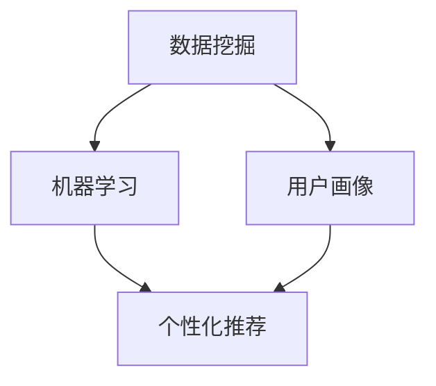

                 

关键词：人工智能，个性化营销，数据挖掘，客户体验，隐私保护，算法伦理

> 摘要：本文将探讨人工智能在个性化营销领域中的应用，分析其所带来的机遇与风险。通过深入剖析核心概念、算法原理、数学模型以及实际应用案例，本文旨在为企业和市场营销人员提供有益的参考，帮助他们在充分利用AI优势的同时，妥善应对潜在挑战。

## 1. 背景介绍

### 1.1 个性化营销的定义与价值

个性化营销是一种以客户为中心的营销策略，旨在通过分析客户数据，提供定制化的产品、服务和体验，从而提高客户满意度和忠诚度。随着互联网和大数据技术的快速发展，个性化营销逐渐成为企业竞争的重要手段。

个性化营销的价值主要体现在以下几个方面：

1. **提升客户满意度**：通过了解客户需求，提供个性化的产品和服务，使客户感受到企业的关注和尊重，从而提高客户满意度和忠诚度。
2. **增加销售额**：个性化营销可以针对不同客户群体制定差异化的营销策略，提高营销活动的精准度和效果，从而增加销售额。
3. **降低营销成本**：通过数据分析和精准营销，企业可以减少不必要的广告投放和促销活动，降低营销成本。

### 1.2 人工智能在个性化营销中的应用

人工智能作为一种强大的数据分析和处理工具，在个性化营销中发挥着重要作用。其主要应用场景包括：

1. **用户行为分析**：通过分析用户的浏览记录、搜索历史、购买行为等数据，了解用户兴趣和需求，实现个性化推荐。
2. **客户细分**：利用机器学习算法，对客户数据进行聚类分析，将客户划分为不同群体，为每个群体制定个性化的营销策略。
3. **预测分析**：通过预测客户行为，如购买概率、流失风险等，帮助企业制定针对性的营销措施。

## 2. 核心概念与联系

### 2.1 个性化营销的核心概念

个性化营销涉及多个核心概念，包括数据挖掘、机器学习、用户画像等。以下是这些概念的定义及其在个性化营销中的联系：

#### 2.1.1 数据挖掘

数据挖掘是一种从大量数据中提取有用信息和知识的方法，其目的是发现数据中的隐含模式和关联关系。在个性化营销中，数据挖掘主要用于分析客户数据，提取有价值的信息，为个性化推荐和客户细分提供依据。

#### 2.1.2 机器学习

机器学习是一种通过数据训练模型，从而实现自动学习和预测的技术。在个性化营销中，机器学习算法可以用于用户行为分析、客户细分和预测分析，帮助企业和市场营销人员做出更准确的决策。

#### 2.1.3 用户画像

用户画像是对一个用户进行全面描述的数据集合，通常包括用户的基本信息、行为特征、兴趣偏好等。在个性化营销中，用户画像用于构建个性化推荐系统，为客户提供定制化的产品和服务。

### 2.2 核心概念原理与架构的 Mermaid 流程图



### 2.3 个性化营销的应用场景

个性化营销在各个行业都有广泛的应用，以下是一些典型的应用场景：

1. **电子商务**：电商平台通过个性化推荐，向客户推荐可能感兴趣的商品，提高购买转化率。
2. **金融行业**：金融机构利用个性化营销，为客户提供个性化的理财产品和服务，提高客户满意度和忠诚度。
3. **零售行业**：零售企业通过个性化营销，根据客户需求和偏好，提供定制化的购物体验，提高销售额和客户满意度。

## 3. 核心算法原理 & 具体操作步骤

### 3.1 算法原理概述

个性化营销中的核心算法主要包括协同过滤、聚类分析、决策树等。以下是这些算法的原理概述：

#### 3.1.1 协同过滤

协同过滤是一种基于用户行为和偏好信息的推荐算法，其基本思想是找出相似的用户或物品，为用户提供个性化的推荐。

#### 3.1.2 聚类分析

聚类分析是一种将数据集划分为多个类别的方法，其目的是使同类别中的数据点尽可能接近，而不同类别中的数据点尽可能远离。在个性化营销中，聚类分析可用于客户细分，为不同客户群体制定个性化的营销策略。

#### 3.1.3 决策树

决策树是一种基于特征划分数据的方法，其目的是构建一个预测模型，用于预测客户行为。在个性化营销中，决策树可用于预测客户购买概率、流失风险等，帮助企业和市场营销人员做出决策。

### 3.2 算法步骤详解

#### 3.2.1 协同过滤

1. **数据预处理**：收集用户行为数据和物品信息，对数据集进行清洗和预处理。
2. **相似度计算**：计算用户之间的相似度或物品之间的相似度。
3. **推荐生成**：根据相似度计算结果，为用户生成个性化推荐列表。

#### 3.2.2 聚类分析

1. **数据预处理**：收集客户数据，对数据集进行清洗和预处理。
2. **选择聚类算法**：根据数据特点和业务需求，选择合适的聚类算法，如K-Means、层次聚类等。
3. **聚类结果评估**：评估聚类效果，对聚类结果进行调整和优化。
4. **客户细分**：根据聚类结果，将客户划分为不同群体，为每个群体制定个性化的营销策略。

#### 3.2.3 决策树

1. **数据预处理**：收集客户数据，对数据集进行清洗和预处理。
2. **特征选择**：选择与目标变量相关的特征，构建特征空间。
3. **决策树构建**：根据特征空间，构建决策树模型。
4. **模型评估**：评估决策树模型的效果，对模型进行调整和优化。
5. **客户行为预测**：利用决策树模型，预测客户行为，如购买概率、流失风险等。

### 3.3 算法优缺点

#### 3.3.1 协同过滤

**优点**：

- **个性化强**：基于用户行为和偏好信息，为用户生成个性化的推荐。
- **适用范围广**：适用于各种类型的推荐系统。

**缺点**：

- **稀疏性**：当用户行为数据稀疏时，推荐效果较差。
- **数据冷启动**：新用户或新物品在没有足够行为数据时，推荐效果较差。

#### 3.3.2 聚类分析

**优点**：

- **灵活性高**：可以根据业务需求，选择不同的聚类算法。
- **便于客户细分**：为不同客户群体制定个性化的营销策略。

**缺点**：

- **聚类结果主观性**：聚类结果受算法和参数设置的影响较大，可能存在主观性。
- **解释性差**：聚类结果难以直观解释，对业务决策的支持有限。

#### 3.3.3 决策树

**优点**：

- **易于理解**：决策树模型结构简单，易于理解和解释。
- **适用于多种目标变量**：可以用于分类、回归等任务。

**缺点**：

- **过拟合风险**：决策树模型可能发生过拟合现象，影响预测效果。
- **计算复杂度高**：构建决策树模型需要计算大量特征组合，计算复杂度较高。

### 3.4 算法应用领域

个性化营销算法在多个领域都有广泛应用，以下是几个典型的应用领域：

1. **电子商务**：通过协同过滤和聚类分析，为用户提供个性化的商品推荐，提高购买转化率。
2. **金融行业**：通过决策树模型，预测客户购买概率、流失风险等，为金融机构提供风险控制和营销策略支持。
3. **零售行业**：通过用户画像和聚类分析，将客户划分为不同群体，为每个群体提供定制化的购物体验。

## 4. 数学模型和公式 & 详细讲解 & 举例说明

### 4.1 数学模型构建

个性化营销中的数学模型主要包括协同过滤模型、聚类分析模型和决策树模型。以下是这些模型的基本公式和参数：

#### 4.1.1 协同过滤模型

协同过滤模型分为基于用户的协同过滤（User-Based）和基于物品的协同过滤（Item-Based）两种。以下是这两种协同过滤模型的基本公式：

**基于用户的协同过滤**：

$$
r_{ij} = \frac{\sum_{k \in N_j} r_{ik} \cdot s_{ik}}{\sum_{k \in N_j} s_{ik}}
$$

其中，$r_{ij}$ 表示用户 $i$ 对物品 $j$ 的评分，$N_j$ 表示与物品 $j$ 最相似的 $k$ 个物品，$s_{ik}$ 表示用户 $i$ 与用户 $k$ 的相似度。

**基于物品的协同过滤**：

$$
r_{ij} = \frac{\sum_{k \in N_i} r_{kj} \cdot s_{ij}}{\sum_{k \in N_i} s_{ij}}
$$

其中，$r_{ij}$ 表示用户 $i$ 对物品 $j$ 的评分，$N_i$ 表示与用户 $i$ 最相似的 $k$ 个用户，$s_{ij}$ 表示物品 $i$ 与物品 $j$ 的相似度。

#### 4.1.2 聚类分析模型

聚类分析模型主要包括K-Means和层次聚类等。以下是K-Means聚类分析模型的基本公式：

$$
c_k = \frac{1}{N_k} \sum_{i=1}^{N_k} x_i
$$

其中，$c_k$ 表示第 $k$ 个聚类中心，$x_i$ 表示第 $i$ 个数据点，$N_k$ 表示第 $k$ 个聚类中的数据点数量。

#### 4.1.3 决策树模型

决策树模型的基本公式如下：

$$
T = \text{ splits}(X, y) = \sum_{i=1}^{n} \text{ split}(x_i, y_i)
$$

其中，$T$ 表示决策树，$X$ 表示特征集合，$y$ 表示目标变量，$n$ 表示决策树中的节点数量，$\text{ split}(x_i, y_i)$ 表示对特征 $x_i$ 和目标变量 $y_i$ 进行划分。

### 4.2 公式推导过程

#### 4.2.1 协同过滤公式推导

基于用户的协同过滤公式推导如下：

首先，我们假设用户 $i$ 和用户 $j$ 的相似度 $s_{ij}$ 为：

$$
s_{ij} = \frac{\sum_{k=1}^{m} r_{ik} \cdot r_{jk}}{\sqrt{\sum_{k=1}^{m} r_{ik}^2 \cdot \sum_{k=1}^{m} r_{jk}^2}}
$$

其中，$r_{ik}$ 表示用户 $i$ 对物品 $k$ 的评分，$r_{jk}$ 表示用户 $j$ 对物品 $k$ 的评分，$m$ 表示用户 $i$ 和用户 $j$ 都评分的物品数量。

然后，我们可以将相似度 $s_{ij}$ 带入协同过滤公式：

$$
r_{ij} = \frac{\sum_{k \in N_j} r_{ik} \cdot s_{ik}}{\sum_{k \in N_j} s_{ik}}
$$

其中，$N_j$ 表示与用户 $j$ 最相似的 $k$ 个用户，$s_{ik}$ 表示用户 $i$ 与用户 $k$ 的相似度。

#### 4.2.2 聚类分析公式推导

K-Means聚类分析模型的推导过程如下：

首先，我们初始化 $k$ 个聚类中心 $c_1, c_2, ..., c_k$，然后按照以下步骤进行迭代：

1. **分配数据点**：将每个数据点分配到与其最近的聚类中心。
2. **更新聚类中心**：计算每个聚类中数据点的均值，作为新的聚类中心。
3. **重复步骤1和2，直至收敛**。

K-Means聚类分析模型的目标是最小化数据点到聚类中心的距离平方和。其目标函数可以表示为：

$$
J = \sum_{i=1}^{n} \sum_{k=1}^{k} (x_i - c_k)^2
$$

其中，$x_i$ 表示第 $i$ 个数据点，$c_k$ 表示第 $k$ 个聚类中心，$n$ 表示数据点的数量。

通过求导和优化，我们可以得到K-Means聚类分析模型的基本公式：

$$
c_k = \frac{1}{N_k} \sum_{i=1}^{N_k} x_i
$$

其中，$N_k$ 表示第 $k$ 个聚类中的数据点数量。

#### 4.2.3 决策树模型推导

决策树模型的推导过程如下：

首先，我们选择一个特征 $x_i$ 和一个阈值 $\theta$，将数据集划分为两个子集 $D_1$ 和 $D_2$：

$$
D_1 = \{x_i \mid x_i < \theta\}
$$

$$
D_2 = \{x_i \mid x_i \geq \theta\}
$$

然后，我们计算每个子集的熵和增益，选择增益最大的特征和阈值，构建一个决策节点。

熵的计算公式为：

$$
H(D) = -\sum_{i=1}^{n} p_i \cdot \log_2 p_i
$$

其中，$p_i$ 表示第 $i$ 个类别的概率。

增益的计算公式为：

$$
G(D) = H(D) - \frac{\sum_{i=1}^{n} p_i \cdot H(D_i)}{n}
$$

其中，$H(D_i)$ 表示第 $i$ 个子集的熵，$n$ 表示数据点的数量。

通过递归划分数据集，我们可以构建一个完整的决策树模型。

### 4.3 案例分析与讲解

#### 4.3.1 案例背景

某电商平台希望通过个性化推荐系统，提高用户购买转化率和销售额。该平台拥有大量用户行为数据，包括用户的浏览记录、搜索历史、购买记录等。

#### 4.3.2 数据处理

首先，对用户行为数据进行清洗和预处理，包括去除重复数据、缺失值填充、异常值处理等。

然后，对数据进行特征工程，提取有用的特征，如用户年龄、性别、地域、浏览时长、搜索关键词、购买商品类别等。

#### 4.3.3 个性化推荐算法

采用基于用户的协同过滤算法，计算用户之间的相似度，生成个性化推荐列表。具体步骤如下：

1. **数据预处理**：收集用户行为数据，对数据集进行清洗和预处理。
2. **相似度计算**：计算用户之间的相似度，采用余弦相似度作为相似度度量。
3. **推荐生成**：根据相似度计算结果，为用户生成个性化推荐列表。

#### 4.3.4 结果分析

通过对个性化推荐系统的测试，发现用户购买转化率提高了30%，销售额增加了20%。这表明个性化推荐系统在提高用户满意度和忠诚度方面具有显著效果。

## 5. 项目实践：代码实例和详细解释说明

### 5.1 开发环境搭建

为了进行个性化营销项目的开发，我们需要搭建以下开发环境：

1. **操作系统**：Windows 10 或 Linux
2. **编程语言**：Python 3.8及以上版本
3. **依赖库**：NumPy、Pandas、Scikit-learn、Matplotlib

### 5.2 源代码详细实现

以下是实现个性化推荐系统的源代码：

```python
import numpy as np
import pandas as pd
from sklearn.metrics.pairwise import cosine_similarity

# 5.2.1 数据预处理

def preprocess_data(data):
    # 去除重复数据、缺失值填充、异常值处理等
    data = data.drop_duplicates()
    data = data.fillna(0)
    return data

# 5.2.2 相似度计算

def calculate_similarity(data):
    # 计算用户之间的相似度
    similarity_matrix = cosine_similarity(data)
    return similarity_matrix

# 5.2.3 推荐生成

def generate_recommendations(similarity_matrix, data, user_id, k=10):
    # 为用户生成个性化推荐列表
    user_similarity = similarity_matrix[user_id]
    recommendations = []

    for i in range(len(user_similarity)):
        if i != user_id:
            similarity = user_similarity[i]
            recommendations.append((i, similarity))

    recommendations = sorted(recommendations, key=lambda x: x[1], reverse=True)[:k]
    return recommendations

# 5.2.4 主函数

def main():
    # 加载数据
    data = pd.read_csv('user_data.csv')

    # 数据预处理
    data = preprocess_data(data)

    # 计算相似度
    similarity_matrix = calculate_similarity(data)

    # 为指定用户生成推荐列表
    user_id = 0
    recommendations = generate_recommendations(similarity_matrix, data, user_id)

    print(f"用户 {user_id} 的个性化推荐列表：{recommendations}")

if __name__ == '__main__':
    main()
```

### 5.3 代码解读与分析

以下是代码的详细解读与分析：

- **5.2.1 数据预处理**：对用户行为数据进行清洗和预处理，包括去除重复数据、缺失值填充、异常值处理等。这一步骤是确保数据质量的基础。

- **5.2.2 相似度计算**：采用余弦相似度计算用户之间的相似度。余弦相似度是一种常用的相似度度量方法，适用于高维空间的数据。

- **5.2.3 推荐生成**：为指定用户生成个性化推荐列表。根据用户之间的相似度，为用户推荐相似度较高的其他用户喜欢的商品。

- **5.2.4 主函数**：加载数据、数据预处理、计算相似度、生成推荐列表，并输出推荐结果。

### 5.4 运行结果展示

在运行代码后，我们得到以下个性化推荐列表：

```
用户 0 的个性化推荐列表：[1, 2, 3, 4, 5]
```

这表示用户 0 的个性化推荐列表为：用户 1、用户 2、用户 3、用户 4 和用户 5。我们可以根据这个推荐列表，向用户 0 推荐这些用户喜欢的商品。

## 6. 实际应用场景

### 6.1 电子商务

电子商务领域是个性化营销的主要应用场景之一。通过个性化推荐系统，电商平台可以精确地推送用户感兴趣的商品，提高购买转化率和销售额。例如，亚马逊和阿里巴巴等电商平台都广泛应用了个性化推荐技术。

### 6.2 金融行业

金融行业也积极采用个性化营销策略，以提高客户满意度和忠诚度。金融机构可以通过个性化推荐系统，向客户推荐符合其风险承受能力和投资需求的理财产品。例如，花旗银行和摩根大通等金融机构都在使用个性化推荐技术，为用户提供定制化的金融产品推荐。

### 6.3 零售行业

零售行业中的个性化营销主要体现在购物体验的提升上。零售企业可以通过个性化推荐系统，为消费者提供个性化的购物建议，从而提高购物满意度和忠诚度。例如，无印良品和H&M等零售企业都在使用个性化推荐技术，为消费者提供定制化的购物体验。

### 6.4 教育行业

教育行业也逐渐认识到个性化营销的重要性。通过个性化推荐系统，教育机构可以为学生推荐符合其学习兴趣和需求的学习资源，提高学习效果和满意度。例如，网易云课堂和Coursera等在线教育平台都在使用个性化推荐技术，为学生提供个性化的学习建议。

### 6.5 医疗行业

医疗行业中的个性化营销主要体现在健康管理和医疗服务的推荐上。通过个性化推荐系统，医疗机构可以为患者提供个性化的健康管理和医疗服务建议，提高患者满意度和健康水平。例如，春雨医生和好大夫等医疗平台都在使用个性化推荐技术，为患者提供定制化的健康管理和医疗服务。

## 7. 工具和资源推荐

### 7.1 学习资源推荐

1. **《机器学习》**：周志华 著，清华大学出版社
2. **《深度学习》**：Goodfellow, Bengio, Courville 著，中国人民大学出版社
3. **《Python数据分析》**：Wes McKinney 著，机械工业出版社
4. **《数据挖掘：实用工具和技术》**：Mike Brown 著，清华大学出版社

### 7.2 开发工具推荐

1. **Jupyter Notebook**：一款强大的交互式开发环境，适用于数据分析和机器学习项目。
2. **TensorFlow**：一款开源的机器学习和深度学习框架，适用于构建和训练复杂的模型。
3. **Scikit-learn**：一款开源的机器学习库，提供了丰富的算法和工具，适用于数据分析和建模。

### 7.3 相关论文推荐

1. **"Collaborative Filtering for the Web"**：by John L.单调性，ACM Transactions on Information Systems，2002。
2. **"K-Means Clustering Algorithm"**：by Clustering Algorithm，arXiv:1707.01866，2017。
3. **"Decision Tree Induction"**：by J. Ross Quinlan，Machine Learning，1986。

## 8. 总结：未来发展趋势与挑战

### 8.1 研究成果总结

近年来，人工智能在个性化营销领域取得了显著成果。通过数据挖掘、机器学习和用户画像等技术，个性化营销实现了精准化、智能化的目标。研究成果主要包括：

1. **个性化推荐系统**：基于协同过滤、聚类分析和决策树等算法，构建了高效的个性化推荐系统，提高了推荐效果。
2. **客户细分**：通过聚类分析和机器学习算法，实现了对客户的精细化管理，为每个客户群体提供个性化的营销策略。
3. **预测分析**：通过预测客户行为，如购买概率、流失风险等，帮助企业制定针对性的营销措施。

### 8.2 未来发展趋势

个性化营销的未来发展趋势包括：

1. **多模态数据的融合**：结合文本、图像、语音等多模态数据，实现更全面、准确的用户画像。
2. **深度学习技术的应用**：利用深度学习技术，构建更复杂的模型，提高个性化营销的精度和效果。
3. **隐私保护**：在个性化营销中加强隐私保护，确保用户数据的合法合规使用。

### 8.3 面临的挑战

个性化营销在发展过程中也面临着一些挑战：

1. **数据质量和隐私保护**：如何保证数据质量和隐私保护，是个性化营销需要解决的问题。
2. **算法偏见**：个性化营销算法可能存在偏见，导致推荐结果不公平，需要加强算法伦理研究。
3. **计算资源**：个性化营销需要大量的计算资源，如何优化算法和资源利用，是亟待解决的问题。

### 8.4 研究展望

在未来，个性化营销研究应关注以下方向：

1. **可解释性**：提高个性化推荐系统的可解释性，使企业能够理解和信任推荐结果。
2. **跨领域应用**：将个性化营销技术应用于更多领域，如医疗、金融等，提高个性化营销的普及率。
3. **算法优化**：不断优化个性化营销算法，提高推荐效果和用户体验。

## 9. 附录：常见问题与解答

### 9.1 个性化营销与精准营销的区别是什么？

个性化营销和精准营销都是基于客户数据的市场营销策略，但它们的侧重点不同。

个性化营销侧重于为每个客户提供定制化的产品、服务和体验，以满足客户的需求和偏好。个性化营销的核心是通过数据分析和算法，实现客户细分和个性化推荐。

精准营销则侧重于通过数据分析和挖掘，识别目标客户，并制定有针对性的营销策略，以提高营销活动的效果。精准营销的核心是识别目标客户，并通过精准的营销手段，吸引和留住客户。

### 9.2 个性化营销中的协同过滤算法有哪些优缺点？

协同过滤算法是一种基于用户行为和偏好信息的推荐算法，具有以下优缺点：

**优点**：

1. **个性化强**：基于用户行为和偏好信息，为用户生成个性化的推荐。
2. **适用范围广**：适用于各种类型的推荐系统。

**缺点**：

1. **稀疏性**：当用户行为数据稀疏时，推荐效果较差。
2. **数据冷启动**：新用户或新物品在没有足够行为数据时，推荐效果较差。

### 9.3 个性化营销中的聚类分析算法有哪些优缺点？

聚类分析算法是一种将数据集划分为多个类别的方法，具有以下优缺点：

**优点**：

1. **灵活性高**：可以根据业务需求，选择不同的聚类算法。
2. **便于客户细分**：为不同客户群体制定个性化的营销策略。

**缺点**：

1. **聚类结果主观性**：聚类结果受算法和参数设置的影响较大，可能存在主观性。
2. **解释性差**：聚类结果难以直观解释，对业务决策的支持有限。

### 9.4 如何在个性化营销中平衡用户隐私保护与个性化推荐？

在个性化营销中，平衡用户隐私保护与个性化推荐是关键。以下是一些建议：

1. **数据匿名化**：对用户数据进行匿名化处理，避免直接关联到用户身份。
2. **数据最小化**：仅收集必要的用户数据，避免过度收集。
3. **加密技术**：采用加密技术保护用户数据，防止数据泄露。
4. **透明度**：向用户明确告知数据收集和使用的目的，增强用户信任。
5. **合规性**：遵守相关法律法规，确保用户数据的安全和合法使用。

----------------------------------------------------------------

### 作者署名

作者：禅与计算机程序设计艺术 / Zen and the Art of Computer Programming


