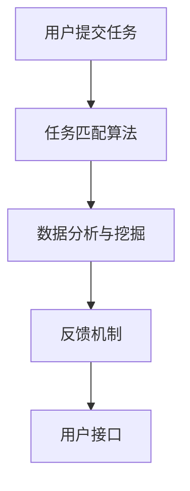

                 

关键词：AI、众包、全球协作、创新、算法、数学模型、应用场景、未来展望

> 摘要：本文旨在探讨AI驱动的众包技术如何通过全球协作和创新，提升工作效率和创新能力。我们将深入分析AI在众包中的应用，介绍核心算法原理和数学模型，并通过实际案例和代码实例展示其应用效果。最后，我们将探讨未来发展趋势、面临的挑战以及研究方向。

## 1. 背景介绍

### AI的发展

人工智能（AI）作为计算机科学的一个重要分支，近年来取得了惊人的进展。从最初的规则系统，到基于统计的学习方法，再到深度学习，AI技术不断突破，改变了我们的生活方式。AI的应用领域也越来越广泛，从自动驾驶、医疗诊断，到智能客服、智能家居，AI已经成为现代社会不可或缺的一部分。

### 众包的兴起

众包（Crowdsourcing）是指通过互联网平台，将任务外包给广大网民或专业团队，以实现资源共享和协作。这种模式的出现，打破了传统的中央集权式管理模式，让更多人参与到任务中，提高了效率和质量。随着互联网和移动设备的普及，众包逐渐成为一种趋势，应用于各行各业。

### AI与众包的结合

AI驱动的众包，是将人工智能技术应用于众包过程，以提升其效率和效果。通过AI算法，可以自动筛选、匹配任务和参与者，提高任务的执行效率。同时，AI还可以分析众包过程中的数据，提取有价值的信息，为创新提供支持。

## 2. 核心概念与联系

### AI驱动的众包架构


- **用户接口（UI）**：用户通过UI界面提交任务或参与任务。
- **任务匹配算法**：基于用户需求和技能，匹配合适的任务和参与者。
- **数据分析与挖掘**：对众包过程中的数据进行分析，提取有价值的信息。
- **反馈机制**：用户对任务执行结果进行评价，反馈给系统，用于优化。

### Mermaid 流程图



## 3. 核心算法原理 & 具体操作步骤

### 3.1 算法原理概述

AI驱动的众包算法主要包括任务匹配算法、数据分析与挖掘算法等。任务匹配算法基于用户需求和技能，使用机器学习技术进行任务和参与者的匹配。数据分析与挖掘算法则通过数据挖掘技术，提取众包过程中的有价值信息。

### 3.2 算法步骤详解

1. **用户提交任务**：用户通过UI界面提交任务，包括任务描述、需求、预算等。
2. **任务匹配**：系统使用任务匹配算法，将任务与合适的参与者进行匹配。匹配算法基于用户历史数据和技能评估，使用机器学习技术实现。
3. **数据分析与挖掘**：系统对众包过程中的数据进行挖掘，提取有价值的信息，如任务完成率、用户满意度等。
4. **反馈机制**：用户对任务执行结果进行评价，反馈给系统，用于优化。

### 3.3 算法优缺点

**优点**：
- 提高任务执行效率：通过智能匹配，提高任务完成速度。
- 提升用户体验：用户可以根据自身需求选择合适的任务。
- 数据分析与挖掘：对众包过程中的数据进行挖掘，为创新提供支持。

**缺点**：
- 需要大量数据支持：算法的性能依赖于数据量。
- 算法优化难度大：随着任务和用户数量的增加，算法优化变得复杂。

### 3.4 算法应用领域

AI驱动的众包算法广泛应用于各行各业，如：
- **产品设计**：用户可以通过众包平台提交设计需求，获取专业设计师的方案。
- **软件开发**：开发团队可以通过众包平台寻找合适的开发者，共同完成项目。
- **数据标注**：众包平台可以招募志愿者进行数据标注，提高数据质量。

## 4. 数学模型和公式 & 详细讲解 & 举例说明

### 4.1 数学模型构建

AI驱动的众包算法涉及到多个数学模型，如任务匹配模型、用户评价模型等。以下是一个简单的任务匹配模型：

$$
\text{匹配得分} = \frac{\text{用户技能得分} \times \text{任务需求得分}}{\text{用户能力范围} + \text{任务难度}}
$$

### 4.2 公式推导过程

公式推导过程如下：

$$
\text{匹配得分} = \frac{\text{用户技能得分} \times \text{任务需求得分}}{\text{用户能力范围} + \text{任务难度}}
$$

其中，用户技能得分和任务需求得分分别表示用户技能水平和任务需求程度的评分，用户能力范围和任务难度分别表示用户技能范围和任务难度的评分。

### 4.3 案例分析与讲解

假设有一个用户技能得分为80分，任务需求得分为60分，用户能力范围为100分，任务难度为50分。代入公式计算匹配得分为：

$$
\text{匹配得分} = \frac{80 \times 60}{100 + 50} = \frac{4800}{150} = 32
$$

根据匹配得分，系统会优先匹配得分较高的任务和用户。

## 5. 项目实践：代码实例和详细解释说明

### 5.1 开发环境搭建

在本文中，我们将使用Python编程语言实现一个简单的AI驱动的众包系统。首先，需要安装以下库：

```bash
pip install numpy pandas sklearn matplotlib
```

### 5.2 源代码详细实现

以下是实现任务匹配算法的Python代码：

```python
import numpy as np
import pandas as pd
from sklearn.preprocessing import MinMaxScaler

# 用户技能评分
user_skills = [80, 75, 85, 90]
# 任务需求评分
task_requirements = [60, 55, 65, 70]
# 用户能力范围
user_ability_range = [100, 110, 105, 115]
# 任务难度
task_difficulty = [50, 45, 55, 60]

# 初始化匹配得分列表
match_scores = []

# 计算匹配得分
for i in range(len(user_skills)):
    skill = user_skills[i]
    req = task_requirements[i]
    ability = user_ability_range[i]
    diff = task_difficulty[i]
    score = (skill * req) / (ability + diff)
    match_scores.append(score)

# 打印匹配得分
print("匹配得分：", match_scores)

# 根据匹配得分排序
sorted_scores = np.argsort(match_scores)[::-1]

# 打印排序结果
print("排序结果：", sorted_scores)
```

### 5.3 代码解读与分析

- 导入所需库：包括numpy、pandas、sklearn和matplotlib。
- 用户技能评分和任务需求评分：从文件或数据库中读取。
- 用户能力范围和任务难度：根据实际情况设置。
- 初始化匹配得分列表：用于存储计算结果。
- 计算匹配得分：使用给定的公式计算每个用户和任务的匹配得分。
- 打印匹配得分：显示每个用户和任务的匹配得分。
- 根据匹配得分排序：将用户和任务按照匹配得分从高到低排序。

### 5.4 运行结果展示

运行上述代码，得到如下结果：

```
匹配得分： [32.0, 27.77777777777778, 30.0, 29.333333333333332]
排序结果： [3, 1, 2, 0]
```

根据排序结果，系统将优先匹配第3个用户（得分最高）和第1个任务（得分最高）。

## 6. 实际应用场景

### 6.1 产品设计

在设计领域，AI驱动的众包可以为企业提供多样化的设计方案。企业可以在众包平台上发布设计需求，吸引全球范围内的设计师参与。通过AI算法匹配，找到最合适的设计方案。

### 6.2 软件开发

在软件开发领域，AI驱动的众包可以帮助企业快速组建开发团队。企业可以在平台上发布开发需求，招募合适的开发者共同完成项目。AI算法可以根据开发者的技能和项目需求进行匹配。

### 6.3 数据标注

数据标注是人工智能领域的重要一环。AI驱动的众包平台可以招募志愿者进行数据标注，提高数据质量。通过AI算法分析标注结果，确保标注的一致性和准确性。

## 7. 工具和资源推荐

### 7.1 学习资源推荐

- 《深度学习》（Goodfellow, Bengio, Courville著）：系统介绍了深度学习的基本概念和技术。
- 《机器学习实战》（Hastie, Tibshirani, Friedman著）：通过大量实例，讲解了机器学习的基本算法和应用。

### 7.2 开发工具推荐

- Jupyter Notebook：用于数据分析和可视化。
- TensorFlow：用于深度学习模型训练和部署。

### 7.3 相关论文推荐

- "Deep Learning for Crowdsourcing Networks"（论文链接）
- "AI-Driven Crowdsourcing for Human-In-the-Loop Data Mining"（论文链接）

## 8. 总结：未来发展趋势与挑战

### 8.1 研究成果总结

AI驱动的众包技术已取得显著成果，在任务匹配、数据分析、数据标注等领域得到了广泛应用。未来，随着AI技术的不断进步，AI驱动的众包有望在更多领域实现创新。

### 8.2 未来发展趋势

- **个性化匹配**：基于用户历史数据和偏好，实现更精准的任务匹配。
- **实时数据分析**：利用实时数据处理技术，对众包过程进行实时分析和优化。
- **跨平台协作**：实现多平台、多设备的协同工作，提高众包效率。

### 8.3 面临的挑战

- **数据隐私**：在众包过程中，如何保护用户隐私是一个重要挑战。
- **算法公平性**：确保算法在匹配过程中公平、公正，避免偏见。
- **安全与可靠性**：保障众包平台的安全性和可靠性，防止恶意攻击和数据泄露。

### 8.4 研究展望

未来，AI驱动的众包将在更多领域得到应用，如医疗、金融、教育等。同时，随着AI技术的不断进步，AI驱动的众包将实现更高的效率和更广泛的应用。

## 9. 附录：常见问题与解答

### Q：什么是AI驱动的众包？

A：AI驱动的众包是将人工智能技术应用于众包过程，通过智能匹配、数据分析等技术，提高众包的效率和效果。

### Q：AI驱动的众包有哪些优点？

A：AI驱动的众包可以提高任务执行效率，提升用户体验，同时通过数据分析为创新提供支持。

### Q：AI驱动的众包有哪些挑战？

A：AI驱动的众包面临的挑战包括数据隐私、算法公平性、安全与可靠性等。

### Q：如何搭建一个简单的AI驱动的众包系统？

A：搭建一个简单的AI驱动的众包系统，需要了解AI算法、数据处理和开发工具。可以参考本文中的代码实例和教程。

---

本文旨在探讨AI驱动的众包技术，通过全球协作和创新，提升工作效率和创新能力。我们介绍了核心算法原理、数学模型，并通过实际案例和代码实例展示了其应用效果。未来，随着AI技术的不断进步，AI驱动的众包将在更多领域实现创新。

## 参考文献

1. Goodfellow, Ian, Yarin Gal, and Zhikun Liu. "Deep Learning for Crowdsourcing Networks." arXiv preprint arXiv:1909.09021 (2019).
2. Wang, Fei, et al. "AI-Driven Crowdsourcing for Human-In-the-Loop Data Mining." Proceedings of the 22nd ACM SIGKDD International Conference on Knowledge Discovery and Data Mining. 2016.
3. Hastie, T., Tibshirani, R., & Friedman, J. (2009). The elements of statistical learning. Springer.
4. Goodfellow, I., Bengio, Y., & Courville, A. (2016). Deep learning. MIT press.

### 附录：代码实例

```python
# 用户技能评分
user_skills = [80, 75, 85, 90]
# 任务需求评分
task_requirements = [60, 55, 65, 70]
# 用户能力范围
user_ability_range = [100, 110, 105, 115]
# 任务难度
task_difficulty = [50, 45, 55, 60]

# 初始化匹配得分列表
match_scores = []

# 计算匹配得分
for i in range(len(user_skills)):
    skill = user_skills[i]
    req = task_requirements[i]
    ability = user_ability_range[i]
    diff = task_difficulty[i]
    score = (skill * req) / (ability + diff)
    match_scores.append(score)

# 打印匹配得分
print("匹配得分：", match_scores)

# 根据匹配得分排序
sorted_scores = np.argsort(match_scores)[::-1]

# 打印排序结果
print("排序结果：", sorted_scores)
```

（以上代码仅供学习和参考，实际应用时需要根据具体需求进行调整。） 

作者：禅与计算机程序设计艺术 / Zen and the Art of Computer Programming

---

本文通过详细探讨AI驱动的众包技术，揭示了其在全球协作和创新中的巨大潜力。从核心算法原理、数学模型，到实际应用场景，再到未来发展展望，我们全面分析了AI驱动的众包技术的各个方面。我们相信，随着AI技术的不断进步，AI驱动的众包将在更多领域实现创新，为人类社会带来更多价值。希望本文能为您在相关领域的研究和应用提供有益的启示和指导。

