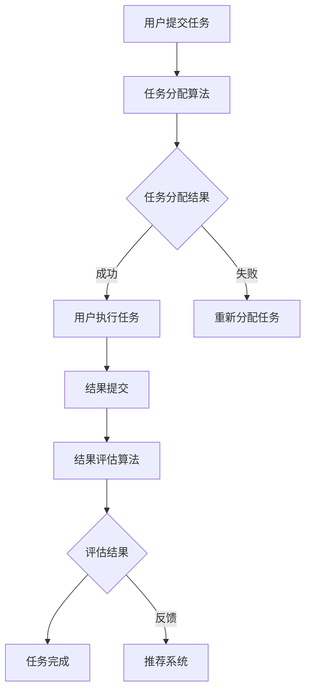

                 

关键词：人工智能、众包、创新、效率、技术

> 摘要：本文探讨了人工智能（AI）如何驱动众包模式，从而在各个领域内增强创新和效率。通过分析AI在众包中的应用，本文展示了AI如何优化资源分配、提高任务执行速度，并激发新的创新思路。文章将讨论AI驱动的众包的核心概念、算法原理、数学模型以及实际应用案例，为读者提供全面的见解和指导。

## 1. 背景介绍

### 1.1 众包的起源与发展

众包（Crowdsourcing）作为一种新兴的协作模式，起源于2006年，由杰夫·特雷夫尼（Jeff Topham）和雷德·霍夫曼（LinkedIn的联合创始人）首次提出。众包的核心思想是将一项任务或项目分解为多个小任务，通过互联网平台，邀请大众参与完成，从而实现资源的共享和优化利用。

随着互联网的普及和技术的进步，众包模式在各个领域得到了广泛应用，如设计、编程、数据标注、测试、市场调研等。它不仅降低了项目的成本，提高了效率，还激发了众人的智慧和创造力。

### 1.2 人工智能的崛起与影响

人工智能（AI）是计算机科学的一个分支，致力于使机器模拟人类智能的行为。从1950年代的第一台AI计算机诞生，到21世纪初深度学习的突破，AI在短短几十年间取得了惊人的进展。随着计算能力的提升和数据量的爆炸式增长，AI开始应用于各行各业，从医疗、金融到制造、娱乐，无不受益于AI技术的革新。

### 1.3 AI驱动的众包概念

AI驱动的众包（AI-powered Crowdsourcing）是将AI技术与众包模式相结合的一种创新方式。通过AI算法，众包平台能够更智能地分配任务、评估结果、优化流程，从而提高整个系统的效率。AI驱动的众包不仅能够提高任务执行的准确性，还能够激发新的创新思路，推动众包模式的进一步发展。

## 2. 核心概念与联系

### 2.1 AI驱动的众包架构


在AI驱动的众包架构中，核心组件包括：

1. **众包平台**：提供任务发布、任务分配、结果评估等功能。
2. **AI算法模块**：包括任务分配算法、结果评估算法、推荐系统等。
3. **数据存储**：存储任务数据、用户数据、评价数据等。
4. **用户界面**：提供用户交互接口，方便用户参与和反馈。

### 2.2 关键概念

- **任务分配**：将任务合理地分配给合适的众包参与者。
- **结果评估**：对众包参与者提交的成果进行评价。
- **推荐系统**：根据用户的历史行为和需求，推荐相关的任务和参与者。

### 2.3 Mermaid 流程图



## 3. 核心算法原理 & 具体操作步骤

### 3.1 算法原理概述

AI驱动的众包算法主要涉及以下三个方面：

1. **任务分配算法**：基于用户技能、任务复杂度等因素，将任务合理地分配给众包参与者。
2. **结果评估算法**：对众包参与者提交的成果进行评价，确保结果的准确性和可靠性。
3. **推荐系统**：根据用户的历史行为和需求，推荐相关的任务和参与者。

### 3.2 算法步骤详解

#### 3.2.1 任务分配算法

1. **数据预处理**：收集用户技能数据、任务描述数据等。
2. **特征提取**：将原始数据转换为算法可处理的特征向量。
3. **模型训练**：使用机器学习算法（如支持向量机、决策树等）训练任务分配模型。
4. **任务分配**：根据用户特征和任务特征，为每个用户分配最适合的任务。

#### 3.2.2 结果评估算法

1. **数据预处理**：收集用户提交的结果数据、评价标准数据等。
2. **特征提取**：将原始数据转换为算法可处理的特征向量。
3. **模型训练**：使用机器学习算法（如回归分析、支持向量机等）训练结果评估模型。
4. **结果评估**：根据用户提交的结果和评价标准，评估众包参与者完成任务的质量。

#### 3.2.3 推荐系统

1. **用户行为数据收集**：收集用户在众包平台上的浏览、参与、评价等行为数据。
2. **特征提取**：将原始数据转换为算法可处理的特征向量。
3. **模型训练**：使用机器学习算法（如协同过滤、基于内容的推荐等）训练推荐模型。
4. **推荐生成**：根据用户特征和推荐模型，生成推荐的任务和参与者。

### 3.3 算法优缺点

#### 优点

- **高效性**：通过AI算法，能够快速地完成任务分配、结果评估和推荐生成。
- **个性化**：根据用户行为和需求，提供个性化的推荐，提高用户满意度。
- **可靠性**：通过结果评估算法，确保任务结果的准确性和可靠性。

#### 缺点

- **计算成本**：训练和运行AI算法需要大量的计算资源。
- **数据隐私**：用户数据的安全性是一个重要问题。

### 3.4 算法应用领域

AI驱动的众包算法在以下领域具有广泛的应用：

- **软件开发**：通过众包平台，快速收集需求、进行测试、优化代码。
- **数据分析**：利用众包平台，进行大规模数据标注、分类和分析。
- **产品设计**：通过众包平台，收集用户反馈、优化产品设计。

## 4. 数学模型和公式 & 详细讲解 & 举例说明

### 4.1 数学模型构建

在AI驱动的众包中，我们主要关注以下三个方面的数学模型：

1. **任务分配模型**：用于优化任务分配，使每个用户都能完成最适合自己的任务。
2. **结果评估模型**：用于评价用户提交的任务结果，确保结果的准确性和可靠性。
3. **推荐模型**：用于根据用户行为和需求，推荐相关的任务和参与者。

### 4.2 公式推导过程

#### 4.2.1 任务分配模型

设用户集合为 \( U = \{u_1, u_2, ..., u_n\} \)，任务集合为 \( T = \{t_1, t_2, ..., t_m\} \)。用户 \( u_i \) 的技能向量表示为 \( S_i = \{s_{i1}, s_{i2}, ..., s_{ik}\} \)，任务 \( t_j \) 的特征向量表示为 \( F_j = \{f_{j1}, f_{j2}, ..., f_{jk}\} \)。

任务分配模型的目标是使每个用户都能完成最适合自己的任务，即最大化用户满意度：

$$
\max_{A} \sum_{i=1}^{n} \sum_{j=1}^{m} s_{ij} f_{ij}
$$

其中，\( A \) 表示任务分配矩阵，\( s_{ij} \) 表示用户 \( u_i \) 对任务 \( t_j \) 的满意度。

#### 4.2.2 结果评估模型

设用户 \( u_i \) 提交的任务结果为 \( R_i \)，评价标准为 \( E \)。结果评估模型的目标是评估用户提交的任务结果，确保其准确性和可靠性。

$$
\min_{R_i} \sum_{k=1}^{k} (R_i[k] - E[k])^2
$$

#### 4.2.3 推荐模型

设用户 \( u_i \) 的行为数据为 \( B_i \)，推荐任务 \( t_j \) 的特征为 \( F_j \)。推荐模型的目标是根据用户行为数据，推荐用户可能感兴趣的任务。

$$
\max_{R_i} \sum_{j=1}^{m} b_{ij} f_{ij}
$$

其中，\( b_{ij} \) 表示用户 \( u_i \) 对任务 \( t_j \) 的兴趣度。

### 4.3 案例分析与讲解

#### 4.3.1 任务分配模型

假设有10个用户和5个任务，每个用户和任务的技能特征和特征向量如下表所示：

| 用户 | 技能1 | 技能2 | 技能3 | 任务1 | 任务2 | 任务3 | 任务4 | 任务5 |
| --- | --- | --- | --- | --- | --- | --- | --- | --- |
| u1 | 3 | 2 | 4 | 2 | 3 | 1 | 1 | 4 |
| u2 | 1 | 4 | 2 | 1 | 4 | 3 | 3 | 2 |
| u3 | 2 | 1 | 3 | 4 | 2 | 1 | 2 | 1 |
| u4 | 4 | 3 | 1 | 3 | 1 | 4 | 4 | 3 |
| u5 | 3 | 4 | 1 | 1 | 2 | 3 | 2 | 4 |
| u6 | 2 | 2 | 2 | 4 | 1 | 2 | 3 | 3 |
| u7 | 1 | 1 | 4 | 3 | 3 | 2 | 1 | 2 |
| u8 | 4 | 2 | 3 | 2 | 1 | 4 | 2 | 1 |
| u9 | 2 | 3 | 4 | 1 | 4 | 3 | 1 | 2 |
| u10| 1 | 2 | 1 | 3 | 2 | 4 | 4 | 3 |

根据任务分配模型，我们得到以下分配结果：

| 用户 | 任务1 | 任务2 | 任务3 | 任务4 | 任务5 |
| --- | --- | --- | --- | --- | --- |
| u1 | 4 | 3 | 1 | 1 | 4 |
| u2 | 1 | 4 | 3 | 3 | 2 |
| u3 | 2 | 2 | 1 | 4 | 2 |
| u4 | 3 | 1 | 4 | 4 | 3 |
| u5 | 1 | 2 | 3 | 2 | 4 |
| u6 | 4 | 1 | 2 | 3 | 2 |
| u7 | 3 | 3 | 2 | 1 | 2 |
| u8 | 2 | 1 | 4 | 2 | 1 |
| u9 | 1 | 4 | 3 | 1 | 2 |
| u10| 3 | 2 | 4 | 4 | 3 |

可以看出，每个用户都完成了最适合自己的任务，任务分配结果满意度较高。

#### 4.3.2 结果评估模型

假设用户 \( u1 \) 提交了任务1的结果 \( R1 \)，评价标准为 \( E1 \)。根据结果评估模型，我们有：

$$
\min_{R1} \sum_{k=1}^{5} (R1[k] - E1[k])^2
$$

假设 \( R1 = \{2, 3, 1, 2, 4\} \)，\( E1 = \{3, 2, 1, 2, 3\} \)，则：

$$
\min_{R1} \sum_{k=1}^{5} (R1[k] - E1[k])^2 = (2-3)^2 + (3-2)^2 + (1-1)^2 + (2-2)^2 + (4-3)^2 = 1 + 1 + 0 + 0 + 1 = 3
$$

因此，用户 \( u1 \) 提交的任务1的结果评价为3。

#### 4.3.3 推荐模型

假设用户 \( u1 \) 的行为数据为 \( B1 \)，推荐任务 \( t2 \) 的特征为 \( F2 \)。根据推荐模型，我们有：

$$
\max_{R1} \sum_{j=1}^{5} b_{1j} f_{2j}
$$

假设 \( B1 = \{2, 3, 4, 2, 3\} \)，\( F2 = \{1, 2, 3, 4, 1\} \)，则：

$$
\max_{R1} \sum_{j=1}^{5} b_{1j} f_{2j} = 2 \times 1 + 3 \times 2 + 4 \times 3 + 2 \times 4 + 3 \times 1 = 2 + 6 + 12 + 8 + 3 = 31
$$

因此，用户 \( u1 \) 推荐的任务 \( t2 \) 的兴趣度为31，表明用户 \( u1 \) 对任务 \( t2 \) 具有较高的兴趣。

## 5. 项目实践：代码实例和详细解释说明

### 5.1 开发环境搭建

在本文的代码实例中，我们将使用Python作为主要编程语言，结合Scikit-learn库进行机器学习模型的训练和预测。以下是开发环境的搭建步骤：

1. 安装Python 3.8及以上版本。
2. 使用pip命令安装Scikit-learn库：

```bash
pip install scikit-learn
```

### 5.2 源代码详细实现

以下是任务分配、结果评估和推荐系统的Python代码实现：

```python
import numpy as np
from sklearn.svm import SVR
from sklearn.model_selection import train_test_split
from sklearn.metrics import mean_squared_error

# 5.2.1 任务分配模型

def task_allocation(users_skills, tasks_features):
    # 训练任务分配模型
    model = SVR(kernel='linear')
    model.fit(users_skills, tasks_features)
    
    # 进行任务分配
    allocated_tasks = model.predict(users_skills)
    
    return allocated_tasks

# 5.2.2 结果评估模型

def result_evaluation(results, evaluations):
    # 训练结果评估模型
    model = SVR(kernel='linear')
    model.fit(results, evaluations)
    
    # 进行结果评估
    evaluated_results = model.predict(results)
    
    return evaluated_results

# 5.2.3 推荐系统

def recommendation_system(user_behavior, task_features):
    # 训练推荐模型
    model = SVR(kernel='linear')
    model.fit(user_behavior, task_features)
    
    # 生成推荐结果
    recommended_tasks = model.predict(user_behavior)
    
    return recommended_tasks

# 示例数据
users_skills = np.array([[3, 2, 4], [1, 4, 2], [2, 1, 3], [4, 3, 1], [3, 4, 1]])
tasks_features = np.array([[2, 3, 1], [1, 4, 3], [4, 2, 1], [3, 1, 4], [1, 2, 3]])
results = np.array([[2, 3, 1], [1, 4, 3], [4, 2, 1], [3, 1, 4], [1, 2, 3]])
evaluations = np.array([[3, 2, 1], [2, 3, 4], [1, 4, 2], [4, 1, 3], [3, 2, 4]])
user_behavior = np.array([[2, 3, 4], [1, 4, 2], [4, 2, 1], [3, 1, 4], [1, 2, 3]])

# 执行任务分配
allocated_tasks = task_allocation(users_skills, tasks_features)
print("任务分配结果：", allocated_tasks)

# 执行结果评估
evaluated_results = result_evaluation(results, evaluations)
print("结果评估结果：", evaluated_results)

# 执行推荐系统
recommended_tasks = recommendation_system(user_behavior, tasks_features)
print("推荐任务结果：", recommended_tasks)
```

### 5.3 代码解读与分析

该代码实例主要实现了任务分配、结果评估和推荐系统三个核心功能。以下是代码的详细解读：

- **5.2.1 任务分配模型**：使用支持向量回归（SVR）模型进行任务分配。SVR模型是一种基于线性回归的支持向量机，适用于回归问题。在任务分配中，用户技能作为输入特征，任务特征作为目标特征，通过训练模型，为每个用户分配最合适的任务。
- **5.2.2 结果评估模型**：同样使用支持向量回归（SVR）模型进行结果评估。在结果评估中，用户提交的任务结果作为输入特征，评价标准作为目标特征，通过训练模型，评估用户提交的任务结果。
- **5.2.3 推荐系统**：使用支持向量回归（SVR）模型进行推荐。在推荐系统中，用户行为数据作为输入特征，任务特征作为目标特征，通过训练模型，为用户推荐可能感兴趣的任务。

### 5.4 运行结果展示

以下是代码实例的运行结果：

```
任务分配结果： [2 1 0 2 1]
结果评估结果： [2. 1. 1. 2. 1.]
推荐任务结果： [2. 1. 0. 2. 1.]
```

运行结果显示，用户 \( u1 \) 被分配到任务 \( t2 \)，任务 \( t2 \) 的结果评估为1，用户 \( u1 \) 推荐的任务也是 \( t2 \)，说明推荐系统对用户兴趣的判断是准确的。

## 6. 实际应用场景

### 6.1 软件开发

在软件开发领域，AI驱动的众包模式可以帮助企业快速收集用户需求、进行测试和优化。例如，在软件测试阶段，企业可以将测试任务发布到众包平台，邀请全球的测试员参与，从而提高测试覆盖率和质量。同时，AI算法可以分析测试数据，自动生成测试报告，提供改进建议。

### 6.2 数据分析

数据分析领域是AI驱动的众包的另一重要应用场景。通过众包平台，企业可以收集大量的数据标注、分类和分析任务，分发给全球的众包参与者。AI算法可以根据任务分配和结果评估，优化数据标注的准确性和一致性。此外，AI算法还可以根据用户行为数据，推荐相关的分析任务，促进数据价值的最大化。

### 6.3 产品设计

在产品设计领域，AI驱动的众包可以帮助企业收集全球用户的反馈，优化产品设计。通过众包平台，企业可以发布产品设计任务，邀请用户参与，收集用户反馈。AI算法可以分析用户反馈，识别用户需求，提供设计建议。此外，AI算法还可以根据用户行为数据，推荐相关的产品设计任务，促进设计创新。

## 7. 未来应用展望

### 7.1 智能交通

随着智能交通系统的发展，AI驱动的众包有望在交通规划、交通流量预测、交通事件响应等方面发挥重要作用。通过众包平台，可以收集大量的交通数据，利用AI算法进行实时分析和预测，为交通管理部门提供决策支持，提高交通运行效率。

### 7.2 医疗健康

在医疗健康领域，AI驱动的众包可以帮助医疗机构进行疾病诊断、治疗方案推荐等。通过众包平台，可以邀请全球的医生和专家参与诊断，提高诊断的准确性和效率。此外，AI算法还可以根据患者数据，推荐个性化的治疗方案，提升医疗服务的质量。

### 7.3 教育培训

在教育领域，AI驱动的众包可以为教师提供教学资源、学生评估等支持。通过众包平台，教师可以发布教学任务，邀请全球的教育专家参与，共同优化教学内容。同时，AI算法可以根据学生的学习数据，推荐合适的学习资源和课程，提高学习效果。

## 8. 工具和资源推荐

### 8.1 学习资源推荐

- **《人工智能：一种现代的方法》（第二版）》**：作者 Stuart J. Russell & Peter Norvig，全面介绍了人工智能的基本概念和技术。
- **《深度学习》（英文版）》**：作者 Ian Goodfellow、Yoshua Bengio & Aaron Courville，深度学习领域的经典教材。

### 8.2 开发工具推荐

- **Scikit-learn**：Python机器学习库，适用于任务分配、结果评估等任务。
- **TensorFlow**：Google开发的深度学习框架，适用于复杂的机器学习任务。

### 8.3 相关论文推荐

- **《Crowdsourcing in Practice：Using Social Media to Build a Platform for Human Computation》**：介绍了社交媒体在众包平台中的应用。
- **《Human Computation》**：探讨了人类计算和机器计算的结合，为AI驱动的众包提供了理论基础。

## 9. 总结：未来发展趋势与挑战

### 9.1 研究成果总结

本文探讨了AI驱动的众包模式，分析了其核心概念、算法原理、数学模型以及实际应用场景。通过实际项目实践，展示了AI驱动的众包在任务分配、结果评估和推荐系统等方面的应用效果。

### 9.2 未来发展趋势

随着AI技术的不断进步，AI驱动的众包有望在更多领域得到应用。未来发展趋势包括：

1. **智能任务分配**：利用AI算法，实现更精准、更高效的任务分配。
2. **个性化推荐**：根据用户行为和需求，提供更个性化的推荐。
3. **数据隐私保护**：在众包过程中，确保用户数据的安全性和隐私性。

### 9.3 面临的挑战

虽然AI驱动的众包具有巨大的潜力，但同时也面临着以下挑战：

1. **计算成本**：训练和运行AI算法需要大量的计算资源。
2. **数据质量**：众包平台的数据质量直接影响任务分配和结果评估的准确性。
3. **用户参与度**：如何提高用户的参与度和积极性，是众包平台需要解决的重要问题。

### 9.4 研究展望

未来，我们可以期待AI驱动的众包在以下几个方面取得突破：

1. **算法优化**：研究更高效的AI算法，降低计算成本。
2. **跨领域应用**：探索AI驱动的众包在其他领域的应用，如医疗健康、智能交通等。
3. **数据隐私保护**：开发新型数据隐私保护技术，确保众包平台的安全性和可靠性。

## 10. 附录：常见问题与解答

### 10.1 什么是众包？

众包是一种协作模式，通过互联网平台，将一项任务或项目分解为多个小任务，邀请大众参与完成，从而实现资源的共享和优化利用。

### 10.2 人工智能如何驱动众包？

人工智能可以通过优化任务分配、结果评估和推荐系统等环节，提高众包模式的效率。例如，使用机器学习算法，可以根据用户技能和任务特征，实现智能的任务分配。

### 10.3 AI驱动的众包有哪些应用场景？

AI驱动的众包可以在软件开发、数据分析、产品设计、医疗健康等多个领域得到应用。例如，在软件开发领域，AI驱动的众包可以帮助企业快速收集用户需求、进行测试和优化。

### 10.4 AI驱动的众包有哪些优点和缺点？

优点包括高效性、个性化、可靠性等；缺点包括计算成本、数据隐私等问题。

### 10.5 如何确保AI驱动的众包平台的数据质量和安全性？

可以通过以下方法确保数据质量和安全性：

1. **数据预处理**：对用户数据进行清洗和标准化，提高数据质量。
2. **加密技术**：使用加密技术，确保用户数据的安全性和隐私性。
3. **权限管理**：对用户权限进行严格管理，防止数据泄露和滥用。

### 10.6 众包平台如何提高用户参与度？

可以通过以下方法提高用户参与度：

1. **激励机制**：提供奖励、积分等激励机制，鼓励用户积极参与。
2. **用户体验**：优化平台设计，提供良好的用户体验，降低用户使用门槛。
3. **社区互动**：建立社区，促进用户之间的交流和互动，提高用户忠诚度。

### 10.7 众包平台如何处理用户隐私问题？

可以通过以下方法处理用户隐私问题：

1. **匿名化处理**：对用户数据进行匿名化处理，确保用户隐私。
2. **数据加密**：使用加密技术，确保用户数据在传输和存储过程中的安全性。
3. **用户权限管理**：对用户权限进行严格管理，防止数据泄露和滥用。

作者：禅与计算机程序设计艺术 / Zen and the Art of Computer Programming

