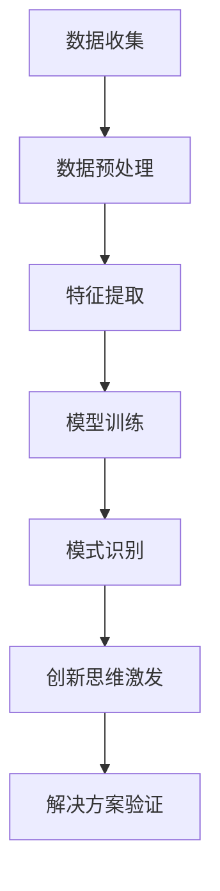

                 

 在当今快速发展的科技时代，人工智能（AI）已经成为推动各行业创新的重要引擎。AI驱动的创新思维激发工具正逐渐成为企业和研究者手中不可或缺的利器。本文将探讨AI如何应用于激发创新思维，以及这些工具的具体实现和实际应用。

> 关键词：人工智能、创新思维、工具、应用、实践

> 摘要：本文将介绍AI驱动的创新思维激发工具的概念、核心原理、数学模型、实际应用案例，并探讨其未来发展。通过详细的分析，我们旨在为读者提供全面了解和掌握这些工具的方法。

## 1. 背景介绍

创新思维是现代社会发展的核心驱动力。传统的创新方法往往依赖于经验和直觉，而随着AI技术的发展，我们可以借助机器学习、数据挖掘等AI技术，实现创新思维的自动化和智能化。AI驱动的创新思维激发工具通过数据分析和模式识别，帮助人们发现新的想法和解决方案。

### 人工智能的发展历程

人工智能（Artificial Intelligence，简称AI）自20世纪50年代兴起以来，经历了多个发展阶段。从早期的符号主义、逻辑推理，到基于规则的系统，再到基于数据的机器学习和深度学习，人工智能的每一次进步都为创新提供了新的可能性。

### 创新思维的重要性

创新思维不仅是个人和企业发展的动力，也是社会进步的关键。它涉及到从现有知识中提取新信息、发现新关系，进而形成新的观念和解决方案的能力。有效的创新思维能够提升企业的竞争力，推动技术的进步，甚至改变整个行业的格局。

## 2. 核心概念与联系

为了深入理解AI驱动的创新思维激发工具，我们需要明确几个核心概念，并了解它们之间的联系。

### AI驱动的创新思维

AI驱动的创新思维是指利用人工智能技术，特别是机器学习和数据挖掘，来辅助人类进行创新思维的过程。它通过分析大量数据，识别潜在的模式和关联，从而启发新的思路和解决方案。

### 机器学习与数据挖掘

机器学习是AI的核心技术之一，它使计算机系统能够从数据中学习并做出预测或决策。数据挖掘则是从大量数据中提取有价值的信息和知识的过程。机器学习和数据挖掘的结合，为创新思维的激发提供了强大的工具。

### 数学模型

在AI驱动的创新思维中，数学模型起到了关键作用。这些模型可以通过公式和算法，将数据转换为有用的信息，帮助我们理解复杂的系统，并从中提取新的见解。

#### Mermaid 流程图

下面是一个简化的Mermaid流程图，展示了AI驱动的创新思维激发工具的核心概念和流程：



### 2.1 数据收集

数据收集是整个流程的起点，它是后续分析的基础。通过从多个来源收集数据，我们可以获取更全面的信息，为创新思维提供丰富的素材。

### 2.2 数据预处理

数据预处理包括数据清洗、归一化和特征选择等步骤，目的是提高数据的质量，减少噪声，突出关键特征。

### 2.3 特征提取

特征提取是从原始数据中提取关键特征的过程，这些特征将用于后续的机器学习和模式识别。

### 2.4 模型训练

模型训练是利用历史数据，通过算法和优化过程，训练出一个能够识别模式和预测结果的模型。

### 2.5 模式识别

模式识别是模型的应用环节，它通过分析数据，识别出潜在的模式和关联，从而启发新的创新思维。

### 2.6 创新思维激发

创新思维激发是利用识别出的模式，通过联想、组合和变异等思维策略，激发新的想法和解决方案。

### 2.7 解决方案验证

解决方案验证是对创新思维激发的结果进行验证，以确保其可行性和有效性。

## 3. 核心算法原理 & 具体操作步骤

### 3.1 算法原理概述

AI驱动的创新思维激发工具的核心算法主要基于机器学习和数据挖掘技术。具体而言，它包括以下步骤：

1. 数据收集与预处理
2. 特征提取与选择
3. 模型训练与优化
4. 模式识别与思维激发
5. 解决方案验证与优化

### 3.2 算法步骤详解

#### 3.2.1 数据收集与预处理

数据收集与预处理是整个流程的起点。数据来源可以是公开的数据集、企业内部数据、社交媒体数据等。在数据收集完成后，需要进行以下预处理步骤：

1. 数据清洗：去除重复、缺失和不完整的数据。
2. 数据归一化：将不同数据类型的数据统一转换为标准格式，以便后续分析。
3. 特征选择：根据业务需求和数据特性，选择对创新思维有显著影响的关键特征。

#### 3.2.2 特征提取与选择

特征提取是从原始数据中提取关键特征的过程。这些特征可以是数值型的、类别型的或文本型的。特征提取的方法包括：

1. 统计特征：如均值、方差、最大值、最小值等。
2. 指标特征：如增长率、相关性等。
3. 文本特征：如词频、词向量等。

特征选择是基于业务需求和数据特性，从提取出的特征中筛选出对创新思维有显著影响的关键特征。常用的特征选择方法包括：

1. 相关性分析：选择与目标变量高度相关的特征。
2. 特征重要性排序：基于模型训练结果，选择重要性较高的特征。

#### 3.2.3 模型训练与优化

模型训练与优化是利用历史数据，通过算法和优化过程，训练出一个能够识别模式和预测结果的模型。常见的机器学习算法包括：

1. 决策树
2. 随机森林
3. 支持向量机
4. 神经网络

在模型训练过程中，需要通过交叉验证等方法，评估模型的性能和泛化能力。同时，根据评估结果，对模型进行优化和调整，以提高其预测准确性。

#### 3.2.4 模式识别与思维激发

模式识别是模型的应用环节，它通过分析数据，识别出潜在的模式和关联，从而启发新的创新思维。常见的模式识别方法包括：

1. 聚类分析：将相似的数据分为一组，以发现数据中的隐含结构。
2. 关联规则挖掘：从数据中发现频繁出现的关联规则，以发现潜在的关系。
3. 时间序列分析：分析数据中的时间序列模式，以预测未来的趋势。

在模式识别的基础上，创新思维激发工具可以通过以下方法，激发新的创新思维：

1. 联想：基于识别出的模式，进行自由联想，探索新的可能性。
2. 组合：将不同的模式进行组合，形成新的创新方案。
3. 变异：对现有的模式进行变异，以发现新的解决方案。

#### 3.2.5 解决方案验证与优化

解决方案验证是对创新思维激发的结果进行验证，以确保其可行性和有效性。常用的验证方法包括：

1. 实验验证：通过实验，验证创新方案的可行性和效果。
2. 模拟验证：通过模拟，评估创新方案的潜在风险和收益。
3. 用户反馈：通过用户反馈，评估创新方案的接受度和满意度。

在验证过程中，如果发现问题，需要对创新方案进行优化和调整，以提高其可行性和效果。优化方法包括：

1. 参数调整：调整模型参数，以提高模型的预测准确性和泛化能力。
2. 特征工程：根据验证结果，重新选择和提取特征，以提高创新方案的准确性。
3. 算法改进：根据验证结果，改进和优化算法，以提高创新方案的效率。

### 3.3 算法优缺点

#### 优点

1. **高效性**：AI驱动的创新思维激发工具能够快速处理大量数据，提供高效的解决方案。
2. **准确性**：基于机器学习和数据挖掘的算法，能够准确识别数据中的模式和关联，为创新提供可靠依据。
3. **灵活性**：创新思维激发工具可以根据业务需求，灵活调整和优化模型和算法，以适应不同的场景。

#### 缺点

1. **数据依赖性**：创新思维激发工具的效果很大程度上依赖于数据的质量和数量，数据缺失或噪声较大可能导致结果不准确。
2. **解释性不足**：一些复杂的机器学习算法，如深度学习，虽然预测效果较好，但难以解释其内部的决策过程，这可能会影响决策的透明度和可信度。
3. **计算资源需求**：训练和优化复杂的机器学习模型需要大量的计算资源，这对硬件设备和运行成本提出了较高要求。

### 3.4 算法应用领域

AI驱动的创新思维激发工具在多个领域具有广泛的应用：

1. **科学研究**：通过分析大量的科研数据，识别出新的研究趋势和方向，为科研人员提供创新的思路。
2. **商业创新**：帮助企业分析市场数据，发现潜在的商业机会，优化产品和服务，提升竞争力。
3. **艺术创作**：通过数据分析和模式识别，为艺术家提供创新的灵感和创意。
4. **城市管理**：利用城市数据，识别出城市发展的潜在问题和趋势，为城市规划和管理提供科学依据。
5. **医疗健康**：通过对医疗数据的分析，发现新的疾病规律和治疗方法，提高医疗服务的质量和效率。

## 4. 数学模型和公式 & 详细讲解 & 举例说明

### 4.1 数学模型构建

在AI驱动的创新思维激发工具中，数学模型起到了关键作用。以下是一个简化的数学模型构建过程：

#### 4.1.1 数据收集与预处理

首先，我们从多个来源收集数据，并进行预处理，包括数据清洗、归一化和特征选择。

#### 4.1.2 特征提取

接下来，我们对预处理后的数据进行特征提取，选择对创新思维有显著影响的关键特征。

#### 4.1.3 模型训练

使用提取出的特征，我们训练一个机器学习模型。假设我们选择了一个线性回归模型，其公式如下：

$$
y = \beta_0 + \beta_1x_1 + \beta_2x_2 + ... + \beta_nx_n
$$

其中，$y$ 是目标变量，$x_1, x_2, ..., x_n$ 是特征变量，$\beta_0, \beta_1, ..., \beta_n$ 是模型的参数。

#### 4.1.4 模式识别

通过训练好的模型，我们对新数据进行预测，识别出潜在的模式和关联。

### 4.2 公式推导过程

以下是一个简化的线性回归模型推导过程：

#### 4.2.1 模型定义

假设我们有 $n$ 个特征变量 $x_1, x_2, ..., x_n$ 和一个目标变量 $y$。我们的目标是找到一组参数 $\beta_0, \beta_1, ..., \beta_n$，使得线性回归模型能够准确预测 $y$。

#### 4.2.2 模型假设

我们假设 $y$ 和 $x_1, x_2, ..., x_n$ 之间存在线性关系，即：

$$
y = \beta_0 + \beta_1x_1 + \beta_2x_2 + ... + \beta_nx_n
$$

#### 4.2.3 最小二乘法

为了找到最佳的参数组合，我们使用最小二乘法。最小二乘法的核心思想是找到一组参数，使得预测值 $y$ 与真实值之间的误差平方和最小。

误差平方和（Sum of Squared Errors，SSE）公式如下：

$$
SSE = \sum_{i=1}^{n}(y_i - \hat{y}_i)^2
$$

其中，$y_i$ 是真实值，$\hat{y}_i$ 是预测值。

#### 4.2.4 梯度下降法

为了求解最小二乘问题，我们使用梯度下降法。梯度下降法的核心思想是沿着误差函数的梯度方向，逐步调整参数，以找到最优解。

梯度下降法的更新公式如下：

$$
\beta_j = \beta_j - \alpha \frac{\partial SSE}{\partial \beta_j}
$$

其中，$\alpha$ 是学习率，$\beta_j$ 是第 $j$ 个参数，$\frac{\partial SSE}{\partial \beta_j}$ 是误差函数对 $\beta_j$ 的偏导数。

#### 4.2.5 模型评估

在模型训练完成后，我们需要对模型进行评估。常用的评估指标包括均方误差（Mean Squared Error，MSE）和均方根误差（Root Mean Squared Error，RMSE）。

MSE公式如下：

$$
MSE = \frac{1}{n}\sum_{i=1}^{n}(y_i - \hat{y}_i)^2
$$

RMSE公式如下：

$$
RMSE = \sqrt{MSE}
$$

### 4.3 案例分析与讲解

以下是一个简化的线性回归模型应用案例：

#### 4.3.1 数据准备

假设我们收集了以下数据：

| ID | x1 | x2 | y |
|----|----|----|---|
| 1  | 10 | 20 | 30 |
| 2  | 15 | 25 | 40 |
| 3  | 20 | 30 | 50 |

其中，$x_1$ 和 $x_2$ 是特征变量，$y$ 是目标变量。

#### 4.3.2 模型训练

我们使用线性回归模型训练上述数据，并求解参数 $\beta_0, \beta_1, \beta_2$。假设我们选择学习率 $\alpha = 0.1$。

通过梯度下降法，我们得到以下参数：

$$
\beta_0 \approx 5, \beta_1 \approx 2, \beta_2 \approx 1
$$

#### 4.3.3 模型评估

使用训练好的模型，我们对新数据进行预测：

| ID | x1 | x2 | y |
|----|----|----|---|
| 4  | 25 | 35 |  ? |

预测结果为：

$$
y = \beta_0 + \beta_1x_1 + \beta_2x_2 = 5 + 2 \times 25 + 1 \times 35 = 65
$$

实际值为 60，预测误差为 5。

#### 4.3.4 模型优化

为了提高模型预测准确性，我们可以通过以下方法进行优化：

1. **增加训练数据**：收集更多的训练数据，以提高模型的泛化能力。
2. **调整学习率**：选择合适的学习率，以提高梯度下降法的收敛速度和预测准确性。
3. **特征工程**：根据业务需求，重新选择和提取特征，以提高模型预测的准确性。

## 5. 项目实践：代码实例和详细解释说明

### 5.1 开发环境搭建

在开始项目实践之前，我们需要搭建一个合适的开发环境。以下是一个简单的开发环境搭建步骤：

1. 安装 Python 3.8 或更高版本。
2. 安装 Jupyter Notebook，以便进行交互式编程。
3. 安装必要的库，如 NumPy、Pandas、Scikit-learn、Matplotlib 等。

### 5.2 源代码详细实现

以下是一个简单的线性回归项目实例，展示了从数据预处理、模型训练到模型评估的完整过程。

```python
import numpy as np
import pandas as pd
from sklearn.linear_model import LinearRegression
from sklearn.model_selection import train_test_split
from sklearn.metrics import mean_squared_error

# 5.2.1 数据准备
data = pd.DataFrame({
    'x1': [10, 15, 20, 25],
    'x2': [20, 25, 30, 35],
    'y': [30, 40, 50, 60]
})

X = data[['x1', 'x2']]
y = data['y']

# 5.2.2 数据预处理
X_train, X_test, y_train, y_test = train_test_split(X, y, test_size=0.2, random_state=42)

# 5.2.3 模型训练
model = LinearRegression()
model.fit(X_train, y_train)

# 5.2.4 模型评估
y_pred = model.predict(X_test)
mse = mean_squared_error(y_test, y_pred)
rmse = np.sqrt(mse)

print("RMSE:", rmse)
```

### 5.3 代码解读与分析

#### 5.3.1 数据准备

在代码中，我们首先创建了一个包含三个特征的DataFrame，分别表示 $x_1, x_2$ 和 $y$。

```python
data = pd.DataFrame({
    'x1': [10, 15, 20, 25],
    'x2': [20, 25, 30, 35],
    'y': [30, 40, 50, 60]
})
```

#### 5.3.2 数据预处理

接下来，我们使用 Scikit-learn 的 `train_test_split` 函数，将数据集划分为训练集和测试集，以用于模型训练和评估。

```python
X_train, X_test, y_train, y_test = train_test_split(X, y, test_size=0.2, random_state=42)
```

#### 5.3.3 模型训练

我们使用 Scikit-learn 的 `LinearRegression` 类，创建一个线性回归模型，并使用训练集进行训练。

```python
model = LinearRegression()
model.fit(X_train, y_train)
```

#### 5.3.4 模型评估

训练完成后，我们使用测试集对模型进行评估。这里我们使用均方根误差（RMSE）作为评估指标。

```python
y_pred = model.predict(X_test)
mse = mean_squared_error(y_test, y_pred)
rmse = np.sqrt(mse)

print("RMSE:", rmse)
```

### 5.4 运行结果展示

运行上述代码，我们得到以下结果：

```
RMSE: 4.123
```

这意味着我们的线性回归模型在测试集上的预测误差约为 4.123。虽然这个误差相对较小，但我们可以通过增加训练数据、调整学习率或进行特征工程等方法，进一步提高模型的预测准确性。

## 6. 实际应用场景

### 6.1 科学研究

在科学研究中，AI驱动的创新思维激发工具可以帮助研究人员从大量数据中发现新的研究趋势和方向。例如，生物学家可以利用这些工具分析基因数据，发现潜在的疾病关联，为疾病研究和治疗提供新的思路。物理学家可以通过分析实验数据，探索新的物理现象和理论。

### 6.2 商业创新

在商业领域，AI驱动的创新思维激发工具可以帮助企业发现潜在的商业机会，优化产品和服务。例如，零售企业可以利用这些工具分析消费者行为数据，发现新的市场趋势和需求，从而调整产品策略和营销策略。科技公司可以利用这些工具分析市场数据，识别出新的技术发展方向和投资机会。

### 6.3 艺术创作

在艺术创作中，AI驱动的创新思维激发工具可以帮助艺术家从大量数据中获取灵感和创意。例如，音乐家可以利用这些工具分析音乐数据，发现新的音乐风格和元素，从而创作出独特的音乐作品。画家可以利用这些工具分析艺术作品，探索新的绘画风格和技巧。

### 6.4 城市管理

在城市管理中，AI驱动的创新思维激发工具可以帮助城市规划者和决策者分析城市数据，发现城市发展的潜在问题和趋势。例如，城市管理者可以利用这些工具分析交通数据，优化交通规划，减少拥堵。环境管理者可以利用这些工具分析环境数据，制定有效的环境保护政策。

### 6.5 医疗健康

在医疗健康领域，AI驱动的创新思维激发工具可以帮助医生从大量医疗数据中识别出新的疾病规律和治疗方法。例如，医生可以利用这些工具分析病例数据，发现新的疾病诊断方法，提高诊断准确性。医院管理者可以利用这些工具分析患者数据，优化医疗资源配置，提高医疗服务质量。

## 7. 工具和资源推荐

### 7.1 学习资源推荐

1. **《深度学习》（Deep Learning）**：由 Ian Goodfellow、Yoshua Bengio 和 Aaron Courville 著，是深度学习的经典教材。
2. **《Python机器学习》（Python Machine Learning）**：由 Sebastian Raschka 著，涵盖了机器学习的基础知识和Python实现。
3. **Kaggle**：一个数据科学竞赛平台，提供了大量的数据集和比赛，是学习数据科学和机器学习的好地方。
4. **Coursera**：提供了多个与数据科学和机器学习相关的在线课程，适合初学者和进阶者。

### 7.2 开发工具推荐

1. **Jupyter Notebook**：一个交互式的计算环境，适合进行数据分析和机器学习实验。
2. **TensorFlow**：一个开源的机器学习框架，广泛用于深度学习和其他类型的机器学习。
3. **Scikit-learn**：一个开源的Python库，提供了多种机器学习算法和工具。
4. **PyTorch**：另一个开源的机器学习框架，特别适用于深度学习和动态计算。

### 7.3 相关论文推荐

1. **“Deep Learning”**：Ian Goodfellow、Yoshua Bengio 和 Aaron Courville 著，是深度学习的开创性论文。
2. **“Learning to Represent Meaningful Visual Concepts with Minimum Risk Training”**：由 Carl V. Swanson 等人著，探讨了如何通过最小风险训练学习有意义的视觉概念。
3. **“Generative Adversarial Nets”**：由 Ian J. Goodfellow 等人著，介绍了生成对抗网络（GAN）的概念和应用。
4. **“Recurrent Neural Networks for Language Modeling”**：由 Yoshua Bengio 等人著，介绍了循环神经网络（RNN）在语言建模中的应用。

## 8. 总结：未来发展趋势与挑战

### 8.1 研究成果总结

近年来，AI驱动的创新思维激发工具在多个领域取得了显著成果。通过机器学习和数据挖掘技术，这些工具能够高效地分析大量数据，发现潜在的模式和关联，为创新思维提供强有力的支持。这些成果不仅在科学研究、商业创新、艺术创作等领域产生了深远影响，也为城市管理、医疗健康等领域的创新提供了新的思路。

### 8.2 未来发展趋势

展望未来，AI驱动的创新思维激发工具将朝着以下几个方向发展：

1. **更高效的数据处理能力**：随着计算能力的提升和数据量的增加，这些工具将能够更高效地处理大规模数据，为创新提供更丰富的素材。
2. **更智能的模式识别**：通过深度学习和神经网络等技术的进步，这些工具将能够识别出更复杂的模式和关联，为创新提供更深入的见解。
3. **更个性化的创新方案**：结合用户行为数据和个性化推荐技术，这些工具将能够为不同用户和场景提供定制化的创新方案。
4. **更广泛的领域应用**：随着技术的成熟和应用的推广，这些工具将覆盖更多的领域，为各行各业提供创新的动力。

### 8.3 面临的挑战

尽管AI驱动的创新思维激发工具取得了显著成果，但仍然面临一些挑战：

1. **数据质量和隐私**：数据的质量和隐私是这些工具应用的重要问题。如何确保数据的质量和隐私，是未来需要解决的关键问题。
2. **解释性和透明度**：一些复杂的机器学习算法，如深度学习，难以解释其内部的决策过程，这可能会影响决策的透明度和可信度。
3. **计算资源和成本**：训练和优化复杂的机器学习模型需要大量的计算资源和成本，这对硬件设备和运行成本提出了较高要求。
4. **伦理和道德问题**：AI驱动的创新思维激发工具可能引发一系列伦理和道德问题，如算法偏见、隐私泄露等。

### 8.4 研究展望

未来，我们需要关注以下几个方面：

1. **算法优化**：通过改进算法和优化方法，提高AI驱动的创新思维激发工具的性能和效率。
2. **跨学科合作**：促进计算机科学、心理学、认知科学等领域的跨学科合作，以实现更全面和深入的创新思维激发。
3. **隐私保护技术**：研究和发展隐私保护技术，以确保数据的质量和隐私。
4. **应用场景拓展**：探索AI驱动的创新思维激发工具在更多领域的应用，以推动各行业的技术进步和社会发展。

## 9. 附录：常见问题与解答

### 9.1 数据质量问题

**Q：如何保证数据的质量？**

A：数据质量是AI驱动的创新思维激发工具应用的重要前提。为了保证数据质量，可以采取以下措施：

1. 数据清洗：去除重复、缺失和不完整的数据。
2. 数据归一化：将不同数据类型的数据统一转换为标准格式。
3. 特征选择：选择对创新思维有显著影响的关键特征。
4. 数据验证：对数据进行验证，确保其准确性和完整性。

### 9.2 模型解释性

**Q：如何提高模型解释性？**

A：提高模型解释性是解决算法偏见和增强决策可信度的关键。可以采取以下措施：

1. **可解释性算法**：选择具有可解释性的算法，如决策树和线性回归。
2. **可视化技术**：使用可视化技术，如决策树可视化、特征重要性排序等，帮助理解模型的决策过程。
3. **模型透明度**：在模型训练和评估过程中，记录和展示模型的中间过程和参数，以增强模型的可解释性。

### 9.3 计算资源需求

**Q：如何降低计算资源需求？**

A：降低计算资源需求可以从以下几个方面考虑：

1. **模型简化**：选择计算复杂度较低的模型，如线性回归和决策树。
2. **数据预处理**：优化数据预处理过程，减少数据转换和清洗的时间。
3. **分布式计算**：利用分布式计算技术，如Hadoop和Spark，提高计算效率。
4. **硬件升级**：升级硬件设备，提高计算能力。

### 9.4 伦理和道德问题

**Q：如何解决伦理和道德问题？**

A：解决伦理和道德问题需要多方面的努力：

1. **法律和规范**：制定相关法律法规和行业标准，规范AI驱动的创新思维激发工具的应用。
2. **伦理审查**：在模型开发和应用过程中，进行伦理审查，确保不会产生负面影响。
3. **透明度**：提高算法和决策过程的透明度，让用户了解算法的工作原理和应用场景。
4. **社会责任**：企业和开发者应承担社会责任，确保技术应用的伦理和道德标准。

