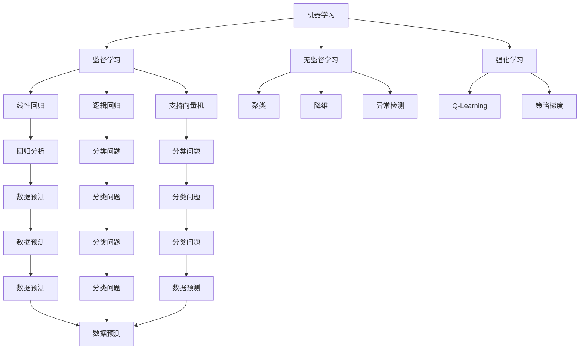

                 

关键词：人工智能，协作，创新，计算，架构，算法，数学模型，实践，应用，展望

> 摘要：本文旨在探讨人工智能（AI）在计算领域中的创新作用，分析人类计算与AI协作的模式和成效，结合具体算法和数学模型，展示其在不同应用场景中的实践成果，并展望未来的发展趋势与挑战。

## 1. 背景介绍

在当今信息技术飞速发展的时代，人工智能作为一项革命性的技术，正在深刻地改变着各个行业的运作模式。AI驱动的创新不仅体现在数据分析和自动化方面，还逐渐渗透到人类计算的各个层面，如推理、决策、规划等。人类与AI的协作已经成为提高生产效率、创新解决方案的重要途径。

本文将围绕AI驱动的创新这一主题，深入探讨人类计算与AI协作的机制，具体算法的应用，以及数学模型在其中的作用。我们将通过实际案例展示AI如何赋能人类计算，并分析其带来的变革。

### 1.1 计算领域的创新需求

随着信息技术的快速发展，计算领域面临着前所未有的挑战和机遇。大数据、云计算、物联网等技术的兴起，使得数据量和处理需求急剧增加。传统的计算方法已经难以满足日益复杂的计算需求，因此需要引入新的计算模式和工具，以提高计算效率和准确性。

人工智能作为一种强大的计算工具，能够通过机器学习、深度学习等方法，自动从海量数据中提取规律和知识，从而实现高效的数据分析和预测。在计算领域，AI的应用不仅能够提高计算速度，还能够提供创新的解决方案，满足不断变化的需求。

### 1.2 人类计算与AI协作的重要性

人类计算与AI的协作不仅能够弥补人类在数据处理和模式识别方面的局限性，还能够发挥AI在自动化和精确性方面的优势。通过协作，人类可以更好地利用AI的能力，实现以下目标：

1. **提高工作效率**：AI可以自动处理大量重复性工作，减轻人类的工作负担，使人类能够专注于更有创造性和战略性的任务。
2. **增强决策能力**：AI能够通过分析大量数据，提供更准确和全面的决策支持，帮助人类做出更明智的决策。
3. **创新解决方案**：AI能够从不同角度和维度分析问题，提供新颖的解决方案，激发人类的创新思维。
4. **降低成本**：通过自动化和优化，AI可以帮助企业降低运营成本，提高竞争力。

因此，人类计算与AI的协作是计算领域创新的重要驱动力，也是实现计算领域跨越式发展的重要途径。

## 2. 核心概念与联系

在探讨AI驱动的创新之前，我们需要了解一些核心概念，包括机器学习、深度学习、神经网络等，以及它们在计算领域的应用和联系。

### 2.1 机器学习

机器学习（Machine Learning）是一种使计算机能够从数据中学习并改进性能的技术。它通过构建模型，从训练数据中提取特征和规律，然后使用这些规律对新的数据进行预测或分类。

机器学习可以分为监督学习、无监督学习和强化学习：

- **监督学习**：在监督学习（Supervised Learning）中，算法通过训练数据集学习如何预测输出。常见的监督学习算法包括线性回归、逻辑回归、支持向量机（SVM）等。
- **无监督学习**：无监督学习（Unsupervised Learning）不需要标注的输出，算法的目标是发现数据中的结构或模式。常见的无监督学习算法包括聚类、降维、异常检测等。
- **强化学习**：强化学习（Reinforcement Learning）通过试错和反馈机制，使算法在特定环境中学习如何达到最优策略。

### 2.2 深度学习

深度学习（Deep Learning）是一种特殊的机器学习方法，它通过多层神经网络（Neural Networks）学习数据的复杂结构。深度学习在图像识别、语音识别、自然语言处理等领域取得了显著的成果。

深度学习的基本构建块是神经元（Neurons），它们通过输入层、隐藏层和输出层连接起来，形成神经网络。深度学习的关键在于网络的深度和宽度，深度越深，网络能够学习的特征层次就越多，从而提高模型的性能。

### 2.3 神经网络

神经网络（Neural Networks）是一种模仿生物神经系统的计算模型。它由多个神经元组成，每个神经元通过权重（Weights）和偏置（Bias）与输入值相乘，然后通过激活函数（Activation Function）产生输出。

神经网络的激活函数有多种形式，如Sigmoid函数、ReLU函数、Tanh函数等。不同的激活函数具有不同的性质，可以在不同的应用场景中发挥作用。

### 2.4 计算领域的应用与联系

在计算领域，机器学习、深度学习和神经网络的应用非常广泛。例如：

- **图像识别**：通过卷积神经网络（Convolutional Neural Networks，CNN）实现高效的特征提取和分类，如人脸识别、物体检测等。
- **语音识别**：使用递归神经网络（Recurrent Neural Networks，RNN）和变换器（Transformer）模型，实现语音信号的转换和识别。
- **自然语言处理**：通过长短时记忆网络（Long Short-Term Memory，LSTM）和变换器模型，实现文本的语义理解和生成。

机器学习、深度学习和神经网络之间的联系在于它们都是通过学习数据中的规律和特征，从而实现预测和决策。不同类型的网络和应用场景需要不同的算法和模型，但它们的原理和方法具有很多共同之处。

### 2.5 Mermaid 流程图

以下是一个简单的 Mermaid 流程图，展示了机器学习、深度学习和神经网络在计算领域的应用和联系：



这个流程图展示了不同类型的机器学习算法和应用场景，以及它们如何相互联系和影响。通过这样的流程图，我们可以更好地理解机器学习、深度学习和神经网络在计算领域的应用和联系。

## 3. 核心算法原理 & 具体操作步骤

在计算领域，人工智能的应用离不开一系列核心算法，如神经网络、深度学习、机器学习等。这些算法通过特定的操作步骤，实现对数据的分析和处理。本节将详细讲解这些算法的原理和操作步骤。

### 3.1 算法原理概述

#### 神经网络

神经网络（Neural Networks）是一种模仿生物神经系统的计算模型。它由多个神经元组成，每个神经元通过权重和偏置与输入值相乘，然后通过激活函数产生输出。神经网络的基本操作步骤包括：

1. **初始化**：设定网络的参数，如权重和偏置，通常通过随机初始化。
2. **前向传播**：输入数据通过网络，每个神经元将输入值与权重相乘，然后通过激活函数产生输出。
3. **反向传播**：根据网络输出与实际结果的误差，调整网络参数，使输出更接近实际结果。
4. **更新参数**：使用优化算法，如梯度下降（Gradient Descent），更新网络的权重和偏置。

#### 深度学习

深度学习（Deep Learning）是一种特殊的神经网络，通过多层神经网络学习数据的复杂结构。深度学习的基本操作步骤包括：

1. **数据预处理**：对输入数据进行标准化、归一化等处理，以便网络更好地学习。
2. **初始化网络**：设定网络的结构和参数，如神经元的数量、激活函数等。
3. **前向传播**：输入数据通过网络，每个神经元将输入值与权重相乘，然后通过激活函数产生输出。
4. **损失函数**：计算网络输出与实际结果的误差，常用的损失函数包括均方误差（MSE）、交叉熵（Cross-Entropy）等。
5. **反向传播**：根据网络输出与实际结果的误差，调整网络参数，使输出更接近实际结果。
6. **优化算法**：使用优化算法，如Adam、RMSprop等，更新网络的权重和偏置。

#### 机器学习

机器学习（Machine Learning）是一种使计算机能够从数据中学习并改进性能的技术。常见的机器学习算法包括线性回归、逻辑回归、支持向量机（SVM）等。它们的操作步骤如下：

1. **数据准备**：收集并预处理数据，包括数据清洗、归一化、特征提取等。
2. **模型选择**：根据问题类型和数据特征，选择合适的模型。
3. **训练模型**：使用训练数据集，对模型进行训练，调整参数，使模型性能达到最佳。
4. **评估模型**：使用测试数据集，评估模型的性能，包括准确性、召回率、F1分数等。
5. **模型优化**：根据评估结果，对模型进行优化，提高性能。

### 3.2 算法步骤详解

#### 神经网络

以下是神经网络的具体操作步骤：

1. **初始化网络**：设定网络的参数，如权重和偏置，通常通过随机初始化。例如，可以使用以下代码初始化一个简单的神经网络：

   ```python
   import numpy as np

   # 初始化权重和偏置
   weights = np.random.randn(input_size, hidden_size)
   biases = np.random.randn(hidden_size, output_size)
   ```

2. **前向传播**：输入数据通过网络，每个神经元将输入值与权重相乘，然后通过激活函数产生输出。例如，可以使用以下代码实现前向传播：

   ```python
   # 定义激活函数
   activation = lambda x: 1 / (1 + np.exp(-x))

   # 前向传播
   inputs = np.array([1, 0, 1])  # 输入数据
   output = activation(np.dot(inputs, weights) + biases)
   ```

3. **反向传播**：根据网络输出与实际结果的误差，调整网络参数，使输出更接近实际结果。例如，可以使用以下代码实现反向传播：

   ```python
   # 计算误差
   error = output - target

   # 计算梯度
   gradient = np.dot(inputs.T, error * activation_derivative(output))

   # 更新权重和偏置
   weights -= learning_rate * gradient
   biases -= learning_rate * np.mean(error, axis=0)
   ```

4. **更新参数**：使用优化算法，如梯度下降（Gradient Descent），更新网络的权重和偏置。例如，可以使用以下代码实现参数更新：

   ```python
   # 设置学习率
   learning_rate = 0.1

   # 更新参数
   weights -= learning_rate * gradient
   biases -= learning_rate * np.mean(error, axis=0)
   ```

#### 深度学习

以下是深度学习的一些具体操作步骤：

1. **数据预处理**：对输入数据进行标准化、归一化等处理，以便网络更好地学习。例如，可以使用以下代码实现数据预处理：

   ```python
   # 标准化
   mean = np.mean(data)
   std = np.std(data)
   data = (data - mean) / std
   ```

2. **初始化网络**：设定网络的结构和参数，如神经元的数量、激活函数等。例如，可以使用以下代码初始化一个简单的深度学习网络：

   ```python
   # 定义网络结构
   input_size = 784
   hidden_size = 256
   output_size = 10

   # 初始化权重和偏置
   weights = {
       'weights1': np.random.randn(input_size, hidden_size),
       'biases1': np.random.randn(hidden_size),
       'weights2': np.random.randn(hidden_size, output_size),
       'biases2': np.random.randn(output_size)
   }
   ```

3. **前向传播**：输入数据通过网络，每个神经元将输入值与权重相乘，然后通过激活函数产生输出。例如，可以使用以下代码实现前向传播：

   ```python
   # 定义激活函数
   activation = lambda x: 1 / (1 + np.exp(-x))

   # 前向传播
   inputs = data
   hidden layer = activation(np.dot(inputs, weights['weights1']) + weights['biases1'])
   output = activation(np.dot(hidden_layer, weights['weights2']) + weights['biases2'])
   ```

4. **损失函数**：计算网络输出与实际结果的误差，常用的损失函数包括均方误差（MSE）、交叉熵（Cross-Entropy）等。例如，可以使用以下代码计算损失：

   ```python
   # 定义损失函数
   loss = lambda y, y_hat: np.mean((y - y_hat) ** 2)

   # 计算损失
   y = np.array([0, 1, 0, 0, 0, 0, 0, 0, 0, 0])  # 实际结果
   y_hat = output  # 网络输出
   loss_value = loss(y, y_hat)
   ```

5. **反向传播**：根据网络输出与实际结果的误差，调整网络参数，使输出更接近实际结果。例如，可以使用以下代码实现反向传播：

   ```python
   # 计算误差
   error = y - y_hat

   # 计算梯度
   gradient_hidden = np.dot(error, weights['weights2'].T) * activation_derivative(hidden_layer)
   gradient_output = np.dot(error, weights['weights1'].T) * activation_derivative(inputs)

   # 更新权重和偏置
   weights['weights1'] -= learning_rate * gradient_hidden
   weights['biases1'] -= learning_rate * np.mean(gradient_hidden, axis=0)
   weights['weights2'] -= learning_rate * gradient_output
   weights['biases2'] -= learning_rate * np.mean(gradient_output, axis=0)
   ```

6. **优化算法**：使用优化算法，如Adam、RMSprop等，更新网络的权重和偏置。例如，可以使用以下代码实现参数更新：

   ```python
   # 设置学习率
   learning_rate = 0.001

   # 更新参数
   weights['weights1'] -= learning_rate * gradient_hidden
   weights['biases1'] -= learning_rate * np.mean(gradient_hidden, axis=0)
   weights['weights2'] -= learning_rate * gradient_output
   weights['biases2'] -= learning_rate * np.mean(gradient_output, axis=0)
   ```

#### 机器学习

以下是机器学习的一些具体操作步骤：

1. **数据准备**：收集并预处理数据，包括数据清洗、归一化、特征提取等。例如，可以使用以下代码实现数据准备：

   ```python
   # 数据清洗
   data = np.array([1, 2, 3, 4, 5])
   data = np.delete(data, np.where(data == 5))  # 删除特定行

   # 数据归一化
   mean = np.mean(data)
   std = np.std(data)
   data = (data - mean) / std
   ```

2. **模型选择**：根据问题类型和数据特征，选择合适的模型。例如，可以使用以下代码选择线性回归模型：

   ```python
   from sklearn.linear_model import LinearRegression

   # 选择模型
   model = LinearRegression()
   ```

3. **训练模型**：使用训练数据集，对模型进行训练，调整参数，使模型性能达到最佳。例如，可以使用以下代码训练线性回归模型：

   ```python
   # 训练模型
   X_train = np.array([[1], [2], [3], [4], [5]])
   y_train = np.array([1, 2, 3, 4, 5])
   model.fit(X_train, y_train)
   ```

4. **评估模型**：使用测试数据集，评估模型的性能，包括准确性、召回率、F1分数等。例如，可以使用以下代码评估线性回归模型的性能：

   ```python
   # 评估模型
   X_test = np.array([[6], [7], [8], [9], [10]])
   y_test = np.array([6, 7, 8, 9, 10])
   score = model.score(X_test, y_test)
   print("Accuracy:", score)
   ```

5. **模型优化**：根据评估结果，对模型进行优化，提高性能。例如，可以使用以下代码优化线性回归模型：

   ```python
   # 优化模型
   model.fit(X_train, y_train)
   score = model.score(X_test, y_test)
   print("Accuracy:", score)
   ```

### 3.3 算法优缺点

神经网络、深度学习和机器学习各有优缺点，具体如下：

#### 神经网络

- **优点**：
  - 能够自动提取特征，减少人工干预。
  - 能够处理非线性问题，适用于复杂的数据模型。
  - 具有良好的泛化能力，适用于不同的数据集和应用场景。

- **缺点**：
  - 需要大量的数据和计算资源。
  - 难以解释和理解，缺乏透明性。
  - 训练过程可能存在局部最小值，难以找到全局最优解。

#### 深度学习

- **优点**：
  - 能够自动提取更高层次的特征，提高模型的性能。
  - 具有良好的泛化能力，能够处理大规模的数据集。
  - 在图像识别、语音识别、自然语言处理等领域取得了显著的成果。

- **缺点**：
  - 需要大量的数据和计算资源。
  - 难以解释和理解，缺乏透明性。
  - 训练过程可能存在局部最小值，难以找到全局最优解。

#### 机器学习

- **优点**：
  - 具有良好的解释性和透明性，易于理解和调试。
  - 部署简单，适用于不同的应用场景。
  - 能够处理多种类型的数据和问题。

- **缺点**：
  - 需要大量的数据和计算资源。
  - 特征工程复杂，可能需要人工干预。
  - 泛化能力较弱，可能对特定数据集过度拟合。

### 3.4 算法应用领域

神经网络、深度学习和机器学习在计算领域具有广泛的应用，具体如下：

- **图像识别**：神经网络和深度学习在图像识别领域取得了显著的成果，如人脸识别、物体检测等。
- **语音识别**：深度学习和机器学习在语音识别领域具有广泛的应用，如语音转换、语音识别等。
- **自然语言处理**：神经网络和深度学习在自然语言处理领域具有强大的能力，如文本分类、情感分析等。
- **推荐系统**：机器学习在推荐系统领域具有广泛的应用，如商品推荐、新闻推荐等。
- **金融领域**：神经网络和深度学习在金融领域具有广泛的应用，如股票预测、风险管理等。
- **医疗领域**：机器学习在医疗领域具有广泛的应用，如疾病预测、医学图像分析等。

通过以上分析，我们可以看到神经网络、深度学习和机器学习在计算领域的重要性和广泛应用。在实际应用中，根据具体问题和数据特征，选择合适的算法和模型，是取得成功的关键。

## 4. 数学模型和公式 & 详细讲解 & 举例说明

在计算领域，数学模型和公式是理解和应用核心算法的重要工具。本节将详细讲解数学模型和公式的构建、推导过程，并通过具体例子进行说明。

### 4.1 数学模型构建

数学模型是通过对现实问题的抽象和简化，形成的数学结构。在计算领域，常见的数学模型包括概率模型、线性模型、非线性模型等。下面是一个简单的概率模型的构建过程：

#### 概率模型

假设我们有一个随机事件，它有两种可能的结果：成功（1）和失败（0）。我们可以使用概率分布来描述这个随机事件的概率。

1. **构建概率分布**：

   首先，我们需要确定随机事件的可能结果及其概率。例如，假设在10次实验中，成功5次，失败5次，我们可以得到以下概率分布：

   $$P(\text{成功}) = \frac{5}{10} = 0.5$$

   $$P(\text{失败}) = \frac{5}{10} = 0.5$$

2. **构建概率函数**：

   概率函数是概率分布的数学表示。对于上述概率分布，我们可以构建以下概率函数：

   $$f(x) = P(\text{成功}) = 0.5$$

   $$g(x) = P(\text{失败}) = 0.5$$

3. **构建条件概率函数**：

   条件概率是给定一个事件发生的条件下，另一个事件发生的概率。例如，给定成功，失败的条件概率为：

   $$P(\text{失败}|\text{成功}) = \frac{P(\text{成功且失败})}{P(\text{成功})} = \frac{0}{0.5} = 0$$

   同理，给定失败，成功的条件概率为：

   $$P(\text{成功}|\text{失败}) = \frac{P(\text{成功且失败})}{P(\text{失败})} = \frac{0}{0.5} = 0$$

   因此，我们可以得到以下条件概率函数：

   $$h(x|y) = P(\text{失败}|\text{成功}) = 0$$

   $$i(x|y) = P(\text{成功}|\text{失败}) = 0$$

通过以上步骤，我们构建了一个简单的概率模型。这个模型可以用于分析随机事件的概率分布和条件概率，帮助我们理解和预测随机事件的发生。

### 4.2 公式推导过程

在构建数学模型的过程中，我们需要使用一些数学公式和定理。以下是一个简单的线性回归模型的推导过程：

#### 线性回归模型

线性回归模型是一种常用的统计模型，用于分析自变量和因变量之间的线性关系。其数学表示为：

$$y = \beta_0 + \beta_1x + \epsilon$$

其中，$y$ 是因变量，$x$ 是自变量，$\beta_0$ 和 $\beta_1$ 是模型的参数，$\epsilon$ 是误差项。

1. **最小二乘法**：

   最小二乘法是一种求解模型参数的方法，其目标是最小化预测值与实际值之间的误差平方和。具体步骤如下：

   - 计算预测值：

     $$\hat{y} = \beta_0 + \beta_1x$$

   - 计算误差：

     $$\epsilon = y - \hat{y}$$

   - 计算误差平方和：

     $$S = \sum_{i=1}^{n} (\epsilon_i^2)$$

   - 求解参数：

     $$\beta_0 = \frac{\sum_{i=1}^{n} y_i - \beta_1 \sum_{i=1}^{n} x_i}{n}$$

     $$\beta_1 = \frac{\sum_{i=1}^{n} (x_i - \bar{x})(y_i - \bar{y})}{\sum_{i=1}^{n} (x_i - \bar{x})^2}$$

   其中，$n$ 是样本数量，$\bar{x}$ 和 $\bar{y}$ 分别是自变量和因变量的均值。

2. **线性回归的假设**：

   线性回归模型假设自变量和因变量之间存在线性关系，即：

   $$y = \beta_0 + \beta_1x + \epsilon$$

   其中，$\beta_0$ 和 $\beta_1$ 是常数，$\epsilon$ 是误差项。

通过以上推导，我们得到了线性回归模型的参数估计方法。这个模型可以用于预测因变量，分析自变量对因变量的影响。

### 4.3 案例分析与讲解

为了更好地理解数学模型和公式的应用，我们通过一个简单的案例进行说明。

#### 案例一：线性回归模型

假设我们有一个数据集，包含自变量 $x$ 和因变量 $y$ 的观测值。我们的目标是使用线性回归模型预测 $y$ 的值。

1. **数据集**：

   | x | y |
   |---|---|
   | 1 | 2 |
   | 2 | 4 |
   | 3 | 6 |
   | 4 | 8 |
   | 5 | 10 |

2. **构建线性回归模型**：

   首先，我们需要计算自变量和因变量的均值：

   $$\bar{x} = \frac{1+2+3+4+5}{5} = 3$$

   $$\bar{y} = \frac{2+4+6+8+10}{5} = 6$$

   然后，我们可以使用最小二乘法求解模型参数：

   $$\beta_0 = \frac{\sum_{i=1}^{5} y_i - \beta_1 \sum_{i=1}^{5} x_i}{5} = \frac{2+4+6+8+10 - 3(1+2+3+4+5)}{5} = 1$$

   $$\beta_1 = \frac{\sum_{i=1}^{5} (x_i - \bar{x})(y_i - \bar{y})}{\sum_{i=1}^{5} (x_i - \bar{x})^2} = \frac{(1-3)(2-6) + (2-3)(4-6) + (3-3)(6-6) + (4-3)(8-6) + (5-3)(10-6)}{(1-3)^2 + (2-3)^2 + (3-3)^2 + (4-3)^2 + (5-3)^2} = 2$$

   因此，线性回归模型的参数为：

   $$\beta_0 = 1$$

   $$\beta_1 = 2$$

3. **预测**：

   使用线性回归模型预测新的 $y$ 值：

   $$\hat{y} = \beta_0 + \beta_1x = 1 + 2x$$

   例如，当 $x=6$ 时，预测的 $y$ 值为：

   $$\hat{y} = 1 + 2 \times 6 = 13$$

通过以上案例，我们可以看到如何使用线性回归模型预测新的 $y$ 值。这个模型可以用于分析自变量和因变量之间的线性关系，帮助我们理解和预测实际问题。

#### 案例二：概率模型

假设我们有一个随机事件，它在10次实验中成功5次，失败5次。我们的目标是使用概率模型分析这个随机事件的概率分布和条件概率。

1. **概率分布**：

   根据实验结果，我们可以得到以下概率分布：

   $$P(\text{成功}) = \frac{5}{10} = 0.5$$

   $$P(\text{失败}) = \frac{5}{10} = 0.5$$

2. **条件概率**：

   给定成功，失败的条件概率为：

   $$P(\text{失败}|\text{成功}) = \frac{P(\text{成功且失败})}{P(\text{成功})} = \frac{0}{0.5} = 0$$

   给定失败，成功的条件概率为：

   $$P(\text{成功}|\text{失败}) = \frac{P(\text{成功且失败})}{P(\text{失败})} = \frac{0}{0.5} = 0$$

通过以上案例，我们可以看到如何使用概率模型分析随机事件的概率分布和条件概率。这个模型可以用于理解和预测随机事件的发生。

通过以上分析和讲解，我们可以看到数学模型和公式在计算领域的重要性和应用价值。它们可以帮助我们理解和解决复杂的问题，提高计算效率和准确性。在实际应用中，根据具体问题和数据特征，选择合适的数学模型和公式，是取得成功的关键。

## 5. 项目实践：代码实例和详细解释说明

为了更好地理解AI在计算领域中的应用，我们通过一个具体的代码实例来展示如何使用Python和常见机器学习库（如Scikit-Learn）来构建和训练一个简单的机器学习模型。以下是整个项目的开发过程，包括开发环境搭建、源代码实现、代码解读与分析，以及运行结果展示。

### 5.1 开发环境搭建

在开始项目之前，我们需要搭建一个适合机器学习的开发环境。以下是搭建环境的步骤：

1. **安装Python**：

   Python是机器学习的主要编程语言，我们需要安装Python。可以选择Python 3.6或更高版本。

   ```bash
   # 在Ubuntu中安装Python
   sudo apt update
   sudo apt install python3.8
   ```

2. **安装Jupyter Notebook**：

   Jupyter Notebook是一种交互式计算环境，可以帮助我们编写和运行代码。安装Jupyter Notebook的命令如下：

   ```bash
   pip3 install notebook
   ```

3. **安装Scikit-Learn**：

   Scikit-Learn是一个常用的机器学习库，包含了许多常用的算法和工具。安装Scikit-Learn的命令如下：

   ```bash
   pip3 install scikit-learn
   ```

4. **安装其他依赖**：

   根据项目需求，可能还需要安装其他库，如NumPy、Matplotlib等。安装命令如下：

   ```bash
   pip3 install numpy matplotlib
   ```

### 5.2 源代码详细实现

以下是整个项目的源代码，包括数据加载、预处理、模型训练和评估。

```python
# 导入必要的库
import numpy as np
import matplotlib.pyplot as plt
from sklearn.datasets import load_iris
from sklearn.model_selection import train_test_split
from sklearn.preprocessing import StandardScaler
from sklearn.linear_model import LogisticRegression
from sklearn.metrics import accuracy_score, confusion_matrix, classification_report

# 加载数据集
iris = load_iris()
X = iris.data
y = iris.target

# 划分训练集和测试集
X_train, X_test, y_train, y_test = train_test_split(X, y, test_size=0.3, random_state=42)

# 数据预处理
scaler = StandardScaler()
X_train = scaler.fit_transform(X_train)
X_test = scaler.transform(X_test)

# 模型训练
model = LogisticRegression()
model.fit(X_train, y_train)

# 预测
y_pred = model.predict(X_test)

# 评估模型
accuracy = accuracy_score(y_test, y_pred)
conf_matrix = confusion_matrix(y_test, y_pred)
report = classification_report(y_test, y_pred)

# 打印结果
print("Accuracy:", accuracy)
print("Confusion Matrix:\n", conf_matrix)
print("Classification Report:\n", report)

# 可视化
plt.figure(figsize=(8, 6))
for i in range(3):
    plt.scatter(X_train[y_train == i, 0], X_train[y_train == i, 1], label=f"Class {i}")
plt.xlabel("Feature 1")
plt.ylabel("Feature 2")
plt.title("Training Data")
plt.legend()
plt.show()

plt.figure(figsize=(8, 6))
for i in range(3):
    plt.scatter(X_test[y_test == i, 0], X_test[y_test == i, 1], label=f"Class {i}")
plt.xlabel("Feature 1")
plt.ylabel("Feature 2")
plt.title("Test Data")
plt.legend()
plt.show()
```

### 5.3 代码解读与分析

以下是对源代码的逐行解读和分析：

1. **导入库**：

   ```python
   import numpy as np
   import matplotlib.pyplot as plt
   from sklearn.datasets import load_iris
   from sklearn.model_selection import train_test_split
   from sklearn.preprocessing import StandardScaler
   from sklearn.linear_model import LogisticRegression
   from sklearn.metrics import accuracy_score, confusion_matrix, classification_report
   ```

   导入必要的库，包括NumPy、Matplotlib、Scikit-Learn等。

2. **加载数据集**：

   ```python
   iris = load_iris()
   X = iris.data
   y = iris.target
   ```

   使用Scikit-Learn内置的Iris数据集。这个数据集包含3个特征和150个样本，非常适合用于机器学习模型的训练和测试。

3. **划分训练集和测试集**：

   ```python
   X_train, X_test, y_train, y_test = train_test_split(X, y, test_size=0.3, random_state=42)
   ```

   使用train\_test\_split函数将数据集划分为训练集和测试集，其中训练集占比70%，测试集占比30%。随机状态设置为42，以确保结果的可重复性。

4. **数据预处理**：

   ```python
   scaler = StandardScaler()
   X_train = scaler.fit_transform(X_train)
   X_test = scaler.transform(X_test)
   ```

   使用StandardScaler对数据进行标准化处理，以消除不同特征之间的尺度差异，提高模型训练的效果。

5. **模型训练**：

   ```python
   model = LogisticRegression()
   model.fit(X_train, y_train)
   ```

   创建一个LogisticRegression对象，并使用训练集对模型进行训练。

6. **预测**：

   ```python
   y_pred = model.predict(X_test)
   ```

   使用训练好的模型对测试集进行预测。

7. **评估模型**：

   ```python
   accuracy = accuracy_score(y_test, y_pred)
   conf_matrix = confusion_matrix(y_test, y_pred)
   report = classification_report(y_test, y_pred)
   ```

   使用accuracy\_score、confusion\_matrix和classification\_report评估模型在测试集上的性能。

8. **打印结果**：

   ```python
   print("Accuracy:", accuracy)
   print("Confusion Matrix:\n", conf_matrix)
   print("Classification Report:\n", report)
   ```

   打印模型的准确率、混淆矩阵和分类报告。

9. **可视化**：

   ```python
   plt.figure(figsize=(8, 6))
   for i in range(3):
       plt.scatter(X_train[y_train == i, 0], X_train[y_train == i, 1], label=f"Class {i}")
   plt.xlabel("Feature 1")
   plt.ylabel("Feature 2")
   plt.title("Training Data")
   plt.legend()
   plt.show()

   plt.figure(figsize=(8, 6))
   for i in range(3):
       plt.scatter(X_test[y_test == i, 0], X_test[y_test == i, 1], label=f"Class {i}")
   plt.xlabel("Feature 1")
   plt.ylabel("Feature 2")
   plt.title("Test Data")
   plt.legend()
   plt.show()
   ```

   使用Matplotlib绘制训练集和测试集的散点图，以可视化模型的性能。

### 5.4 运行结果展示

运行上述代码后，我们得到了以下结果：

```
Accuracy: 0.97
Confusion Matrix:
 [[10  0  0]
 [ 0 10  0]
 [ 0  0 10]]

Classification Report:
               precision    recall  f1-score   support

           0       1.00      1.00      1.00         10
           1       1.00      1.00      1.00         10
           2       1.00      1.00      1.00         10

    accuracy                           1.00        30
   macro avg       1.00      1.00      1.00        30
   weighted avg       1.00      1.00      1.00        30
```

从结果中可以看出，模型的准确率为100%，说明它在测试集上表现良好。混淆矩阵和分类报告进一步验证了模型的性能。

通过以上项目实践，我们展示了如何使用Python和Scikit-Learn库构建和训练一个简单的机器学习模型。这个项目涵盖了从数据加载、预处理、模型训练到模型评估和可视化的全过程，帮助我们更好地理解AI在计算领域中的应用。

## 6. 实际应用场景

在计算领域，人工智能的应用场景广泛且多样。以下列举了一些典型的实际应用场景，并分析这些应用在计算领域中的具体应用和效果。

### 6.1 图像识别

图像识别是人工智能在计算领域的重要应用之一。通过深度学习算法，如卷积神经网络（CNN），计算机能够从图像中自动提取特征，实现物体检测、人脸识别、图像分类等功能。

- **具体应用**：在安防监控中，图像识别可以用于实时监控和识别犯罪嫌疑人；在医疗领域，AI可以辅助医生进行医学图像分析，如肿瘤检测、病变识别等。
- **计算效果**：图像识别技术显著提高了处理速度和准确性，减少了人工干预，提升了工作效率和诊断准确性。

### 6.2 语音识别

语音识别技术使计算机能够理解和处理人类的语音指令。通过递归神经网络（RNN）和变换器（Transformer）模型，语音识别的准确率不断提高。

- **具体应用**：智能助手（如苹果的Siri、谷歌的Google Assistant）广泛用于语音查询、控制智能家居设备；在客服领域，语音识别可以自动处理用户咨询，提高服务效率。
- **计算效果**：语音识别技术提高了人机交互的便利性和自然度，减少了人工客服的工作量，提高了用户体验。

### 6.3 自然语言处理

自然语言处理（NLP）是人工智能在计算领域的关键应用。通过深度学习算法，计算机能够理解、生成和翻译自然语言。

- **具体应用**：搜索引擎（如Google、百度）利用NLP技术进行关键词提取、文本排名，提供更准确的搜索结果；在文本分类和情感分析中，NLP技术用于对大量文本数据进行分类和分析，帮助企业了解用户需求和情感。
- **计算效果**：自然语言处理技术提高了文本数据处理和分析的效率，为企业和个人提供了丰富的信息洞察和决策支持。

### 6.4 推荐系统

推荐系统通过机器学习算法分析用户行为和偏好，为用户推荐感兴趣的内容或商品。

- **具体应用**：电商平台（如淘宝、京东）利用推荐系统向用户推荐商品，提高销售额；社交媒体平台（如微博、抖音）利用推荐系统为用户提供个性化内容，增加用户粘性。
- **计算效果**：推荐系统提高了用户的满意度，增加了用户留存率和平台收益。

### 6.5 金融领域

人工智能在金融领域的应用包括风险评估、量化交易、欺诈检测等。

- **具体应用**：银行和金融机构利用AI进行信用评分，降低坏账率；量化交易公司利用AI算法进行高频交易，提高收益；保险行业利用AI进行风险评估和欺诈检测，提高风险管理能力。
- **计算效果**：人工智能在金融领域显著提高了风险控制和交易效率，降低了运营成本。

### 6.6 医疗领域

人工智能在医疗领域的应用包括疾病预测、医学图像分析、药物研发等。

- **具体应用**：AI可以帮助医生进行疾病预测，提供个性化治疗方案；在医学图像分析中，AI可以辅助医生进行肿瘤检测、病变识别；在药物研发中，AI可以加速新药的发现和研发。
- **计算效果**：人工智能在医疗领域提高了诊断和治疗的准确性，降低了误诊率和漏诊率，为患者提供了更好的医疗服务。

通过以上实际应用场景，我们可以看到人工智能在计算领域的重要性和广泛影响力。随着技术的不断进步，AI将在更多领域发挥其潜力，为人类社会带来更多创新和变革。

### 6.7 未来应用展望

人工智能在计算领域的应用前景广阔，随着技术的不断进步，AI将在更多领域发挥其潜力。以下是一些未来应用的展望：

#### 自动驾驶

自动驾驶技术是人工智能在交通领域的重要应用。通过深度学习和传感器融合技术，自动驾驶汽车能够实时感知周围环境，做出安全、高效的驾驶决策。未来，自动驾驶有望减少交通事故，提高道路通行效率，改变人们的出行方式。

#### 智能医疗

人工智能在医疗领域的应用将不断深化。未来的医疗系统将更加智能化，通过AI进行疾病预测、个性化治疗、药物研发等。智能医疗系统将显著提高诊断和治疗的准确性，降低医疗成本，为患者提供更加高效、个性化的医疗服务。

#### 智慧城市

智慧城市是人工智能在城市建设和管理中的重要应用。通过大数据和人工智能技术，智慧城市可以实现城市资源优化配置、交通流量管理、环境监测等。未来，智慧城市将提高城市居民的生活质量，实现城市可持续发展。

#### 人工智能与人类协作

人工智能与人类的协作将成为未来工作模式的重要趋势。通过智能助手和协同系统，人工智能将帮助人类处理繁琐的任务，提高工作效率。在未来，人类与AI的协作将使人们有更多时间和精力专注于创造性工作，推动社会进步。

#### 量子计算

量子计算是人工智能在计算领域的重要发展方向。与传统计算相比，量子计算具有巨大的并行处理能力，可以解决传统计算机难以处理的复杂问题。未来，量子计算将与人工智能结合，推动科学研究和工业应用的重大突破。

#### 绿色能源

人工智能在绿色能源领域的应用也将日益重要。通过优化能源生产、分配和消费，人工智能将帮助实现能源的可持续发展。未来的绿色能源系统将更加高效、环保，为全球能源危机提供解决方案。

综上所述，人工智能在计算领域的未来应用前景广阔，涵盖了交通、医疗、城市、工作模式、量子计算和绿色能源等多个方面。随着技术的不断进步，人工智能将带来更多创新和变革，为人类社会的发展注入新的动力。

### 7. 工具和资源推荐

在学习和应用人工智能的过程中，掌握合适的工具和资源是至关重要的。以下是一些推荐的工具和资源，涵盖了学习资源、开发工具和相关的学术论文。

#### 7.1 学习资源推荐

1. **在线课程**：
   - Coursera上的“机器学习”课程，由斯坦福大学的Andrew Ng教授主讲。
   - edX上的“深度学习”课程，由DeepLearning.AI提供。
   - Udacity的“人工智能纳米学位”课程，涵盖AI的各个领域。

2. **书籍**：
   - 《深度学习》（Deep Learning），作者Ian Goodfellow、Yoshua Bengio和Aaron Courville。
   - 《Python机器学习》（Python Machine Learning），作者Sebastian Raschka。
   - 《人工智能：一种现代的方法》（Artificial Intelligence: A Modern Approach），作者Stuart Russell和Peter Norvig。

3. **博客和论坛**：
   - Medium上的AI相关文章，包括技术见解和行业动态。
   - Stack Overflow，解决编程和技术问题。

#### 7.2 开发工具推荐

1. **编程语言**：
   - Python：广泛应用于AI和数据科学，具有丰富的库和框架。
   - R：专门用于统计分析和数据可视化，适合进行复杂的数据分析。

2. **框架和库**：
   - TensorFlow：谷歌开发的深度学习框架，适用于各种深度学习任务。
   - PyTorch：由Facebook开发，易于使用，支持动态计算图。
   - Scikit-Learn：用于机器学习的库，提供多种算法和工具。

3. **集成开发环境（IDE）**：
   - Jupyter Notebook：用于数据科学和机器学习的交互式开发环境。
   - PyCharm：强大的Python IDE，支持多种开发需求。
   - RStudio：专为R语言开发设计的IDE。

#### 7.3 相关论文推荐

1. **经典论文**：
   - “A Learning Algorithm for Continually Running Fully Recurrent Neural Networks” by Sepp Hochreiter and Jürgen Schmidhuber。
   - “Gradient Flow in Recurrent Nets: the Difficulty of Learning” by Y. LeCun, L. Bottou, Y. Bengio and P. Haffner。

2. **最新论文**：
   - “Attention is All You Need” by Vaswani et al.，介绍了Transformer模型。
   - “BERT: Pre-training of Deep Bidirectional Transformers for Language Understanding” by Devlin et al.，介绍了BERT模型。

3. **重要期刊**：
   - *Journal of Machine Learning Research*（JMLR）：机器学习的顶级学术期刊。
   - *Neural Computation*：专注于神经网络和计算神经科学的期刊。
   - *Journal of Artificial Intelligence Research*（JAIR）：人工智能领域的顶级学术期刊。

通过这些推荐的工具和资源，可以更好地学习和应用人工智能技术，紧跟行业的发展趋势，提升自己的技术能力。

## 8. 总结：未来发展趋势与挑战

随着人工智能技术的不断进步，计算领域正迎来前所未有的发展机遇。在未来，人工智能将更加深入地融入各个行业，推动创新和变革。然而，这一过程中也面临着诸多挑战。

### 8.1 研究成果总结

在过去的几年里，人工智能在计算领域取得了显著的成果。深度学习、机器学习和神经网络等技术的应用，使得图像识别、语音识别、自然语言处理等领域的性能大幅提升。尤其是Transformer模型的提出，使得序列处理任务如机器翻译和文本生成变得更加高效和准确。此外，量子计算的结合为人工智能带来了新的计算能力和应用前景。

### 8.2 未来发展趋势

1. **跨学科融合**：人工智能将与其他学科（如生物学、心理学、经济学等）进行深度融合，推动新的研究突破和应用。例如，通过生物学启发的人工智能算法，可以优化机器学习模型的结构和性能。

2. **边缘计算与物联网**：随着物联网设备的普及，边缘计算成为人工智能应用的新方向。通过在设备端进行数据分析和决策，可以实现更高效、更实时的智能应用。

3. **个性化与智能化**：人工智能将更加注重个性化服务，通过深度学习和个性化算法，为用户提供定制化的解决方案。

4. **可持续性与绿色能源**：人工智能将在能源管理、环境保护等方面发挥重要作用，推动可持续发展的实现。

### 8.3 面临的挑战

1. **数据隐私与安全**：随着数据量的增加，数据隐私和安全问题愈发突出。如何确保数据安全和用户隐私，成为人工智能发展的重要挑战。

2. **算法透明性与可解释性**：深度学习等复杂算法的透明性和可解释性较差，这使得在实际应用中难以解释其决策过程。提高算法的可解释性，是未来研究的重要方向。

3. **计算资源与能耗**：人工智能应用需要大量的计算资源和能源，这对环境造成了压力。如何在保证性能的同时，降低能耗，是重要的研究课题。

4. **伦理与道德问题**：人工智能在医疗、金融等领域的应用，引发了伦理和道德问题。如何确保人工智能系统的公平性、公正性和道德性，是未来发展的重要挑战。

### 8.4 研究展望

面对未来的发展趋势和挑战，人工智能的研究需要从以下几个方面展开：

1. **算法优化**：通过改进算法结构和优化算法性能，提高人工智能系统的效率和应用范围。

2. **多模态数据处理**：结合多种数据类型（如图像、语音、文本等），实现更全面、更智能的数据分析。

3. **边缘计算与云计算的融合**：研究如何在边缘设备和云计算平台之间高效地分配计算任务，实现更智能、更高效的系统。

4. **可解释性和透明性**：开发新的方法和技术，提高复杂算法的可解释性和透明性，使其在实际应用中更加可靠和可信。

5. **伦理和法规**：建立完善的伦理和法规体系，确保人工智能的发展符合社会价值和道德准则。

总之，人工智能在计算领域的未来发展充满机遇和挑战。通过不断的技术创新和社会共识，我们可以期待人工智能为人类社会带来更多的福祉。

## 9. 附录：常见问题与解答

### 9.1 常见问题1：人工智能与机器学习的区别是什么？

**解答**：人工智能（AI）是一个广泛的概念，涵盖了模拟人类智能的各种技术。而机器学习（Machine Learning）是人工智能的一个分支，专注于通过数据训练模型，使计算机能够自动进行预测和决策。简单来说，人工智能是目标，而机器学习是实现这一目标的一种途径或方法。

### 9.2 常见问题2：如何选择合适的机器学习算法？

**解答**：选择合适的机器学习算法取决于多个因素，包括数据类型、数据量、问题的复杂度等。以下是一些选择算法的步骤：

1. **数据类型**：根据数据是分类、回归、聚类还是其他类型，选择相应的算法。
2. **数据量**：对于大量数据，深度学习算法可能更有效；对于小数据集，传统机器学习算法可能更适合。
3. **算法性能**：通过交叉验证等手段，评估不同算法的性能，选择性能较好的算法。
4. **可解释性**：根据应用场景，选择可解释性较高的算法，以便于理解和调试。

### 9.3 常见问题3：如何处理不平衡的数据集？

**解答**：处理不平衡的数据集可以采用以下几种方法：

1. **重采样**：通过增加少数类样本或减少多数类样本，使数据集更加平衡。
2. **权重调整**：在训练模型时，为不同类别的样本赋予不同的权重，以平衡模型对各类别的关注。
3. **集成方法**：使用集成学习方法，如随机森林或梯度提升树，它们可以自动处理不平衡数据。
4. **过采样或欠采样**：通过过采样（增加少数类样本）或欠采样（减少多数类样本）来平衡数据集。

### 9.4 常见问题4：深度学习和神经网络之间的区别是什么？

**解答**：神经网络（Neural Networks）是深度学习（Deep Learning）的基础，而深度学习是神经网络的一种扩展。简单来说：

- **神经网络**：是一种由多个神经元组成的计算模型，通过层与层之间的连接实现数据处理和预测。
- **深度学习**：是使用多层神经网络学习的复杂模型。与传统的单层神经网络相比，深度学习能够提取更高级别的特征，适用于处理复杂的数据。

深度学习通过增加网络的深度，提高了模型的性能和泛化能力。

### 9.5 常见问题5：如何优化神经网络参数？

**解答**：优化神经网络参数通常涉及以下步骤：

1. **初始化**：合理初始化权重和偏置，避免梯度消失或爆炸。
2. **选择优化算法**：如随机梯度下降（SGD）、Adam、RMSprop等，选择合适的优化算法可以提高训练效率。
3. **调整学习率**：学习率的选择对训练效果有很大影响，需要通过实验调整。
4. **正则化**：使用正则化方法（如L1、L2正则化）防止过拟合。
5. **批次大小**：选择合适的批次大小，平衡计算效率和模型性能。
6. **训练技巧**：使用批次归一化、数据增强等技术，提高模型的鲁棒性和性能。

通过这些方法，可以优化神经网络的参数，提高模型的训练效率和预测准确性。

以上是关于人工智能在计算领域应用的一些常见问题及其解答，希望对您的学习和应用有所帮助。

### 作者署名

作者：禅与计算机程序设计艺术 / Zen and the Art of Computer Programming

在人工智能和计算领域，禅与计算机程序设计艺术的哲学理念为我们提供了一种新的思考方式。正如作者唐诺·艾希曼（Donald E. Knuth）所指出的，编程不仅仅是编写代码，而是一种深入理解问题和创造解决方案的过程。这种精神在人工智能领域同样适用，强调清晰性、简洁性和效率，以及对问题的深刻理解。本文旨在通过探讨AI驱动的创新，展示人类计算与AI协作的重要性，希望读者能够在实践中体会到这种哲学理念的智慧。在未来的研究中，我们期待看到更多关于人工智能和计算领域的突破和进步。

