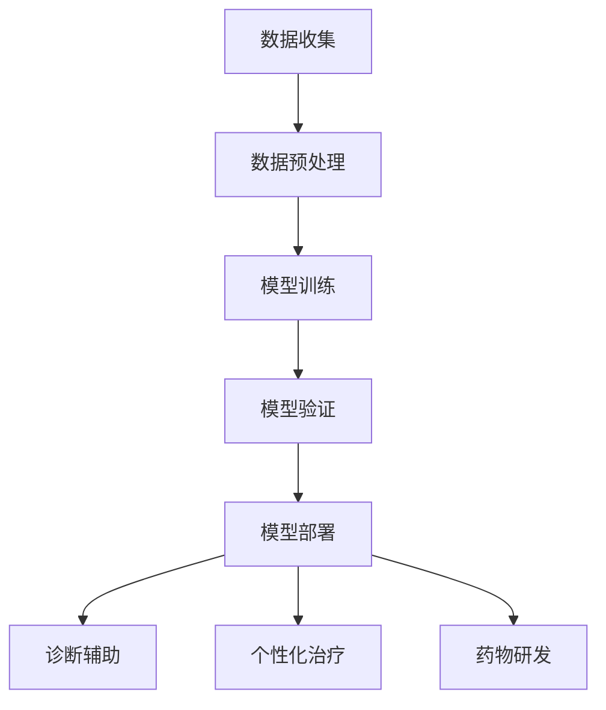

                 

关键词：人工智能、医疗行业、计算技术、创新应用

> 摘要：本文探讨了人工智能在医疗行业的广泛应用，强调了人类计算在AI系统设计和实施中的重要性。通过深入分析核心算法、数学模型、项目实践，以及实际应用场景，本文揭示了AI驱动的医疗创新带来的巨大潜力。

## 1. 背景介绍

医疗行业正面临着前所未有的变革，这不仅是因为科技的飞速发展，还因为数据量的爆炸性增长。随着基因组学、影像学、电子健康记录等领域的进步，医疗数据呈指数级增长，这为人工智能（AI）提供了丰富的应用场景。AI技术，特别是机器学习和深度学习，正在改变医疗诊断、治疗、药物研发等各个环节。

然而，尽管AI在医疗领域的潜力巨大，人类计算仍然是AI系统设计、开发和实施的核心。人类专家能够提供算法设计、数据预处理、模型验证等方面的专业知识和经验，这是单纯依赖机器难以达到的。因此，如何将人类计算与AI技术有效结合，已成为当前研究的热点。

## 2. 核心概念与联系

### 2.1. 人工智能与医疗行业的结合

人工智能与医疗行业的结合主要体现在以下几个方面：

- **诊断辅助**：利用AI算法对医学影像进行自动分析，帮助医生快速准确地诊断疾病。
- **个性化治疗**：根据患者的基因信息和临床数据，AI可以提供个性化的治疗方案。
- **药物研发**：AI可以加速新药研发过程，通过模拟药物与生物大分子的相互作用来预测药物疗效。

### 2.2. 人类计算的角色

在AI系统设计和实施中，人类计算发挥着不可替代的作用：

- **算法设计**：人类专家能够设计出适合特定医疗任务的算法，如图像识别、自然语言处理等。
- **数据预处理**：医疗数据的多样性和复杂性要求人类专家进行有效的数据清洗、标注和预处理。
- **模型验证**：人类专家能够通过交叉验证、误差分析等方法，确保AI模型的准确性和可靠性。

### 2.3. Mermaid 流程图

以下是医疗行业AI应用的Mermaid流程图：



## 3. 核心算法原理 & 具体操作步骤

### 3.1. 算法原理概述

在医疗行业，常用的AI算法包括卷积神经网络（CNN）用于影像分析、深度学习用于基因数据分析、自然语言处理（NLP）用于电子健康记录的解析等。每种算法都有其独特的原理和应用场景。

### 3.2. 算法步骤详解

以下是AI在医疗行业中的一种典型应用——基于CNN的医学影像分析的具体步骤：

#### 3.2.1. 数据收集

- 收集大量的医学影像数据，如X光片、CT扫描、MRI等。

#### 3.2.2. 数据预处理

- 数据清洗：去除噪声和异常值。
- 数据增强：通过旋转、缩放、裁剪等操作，增加数据的多样性。
- 数据标注：对图像进行分类标注，如肿瘤、正常组织等。

#### 3.2.3. 模型训练

- 设计卷积神经网络架构，包括卷积层、池化层、全连接层等。
- 使用标注数据进行模型训练，优化网络参数。

#### 3.2.4. 模型验证

- 通过交叉验证的方法，评估模型的准确性和泛化能力。
- 调整模型参数，提高模型的性能。

#### 3.2.5. 模型部署

- 将训练好的模型部署到实际医疗系统中，进行影像分析。

### 3.3. 算法优缺点

#### 优点：

- **高效性**：AI算法能够快速处理大量医疗数据。
- **准确性**：通过深度学习，AI算法在医学影像分析等领域的准确性已经接近甚至超过人类专家。

#### 缺点：

- **数据依赖性**：AI算法的性能高度依赖高质量的数据。
- **可解释性**：深度学习模型往往是“黑箱”，难以解释其决策过程。

### 3.4. 算法应用领域

AI算法在医疗行业的应用非常广泛，包括但不限于：

- **影像诊断**：如肺癌筛查、乳腺癌诊断等。
- **基因组学**：如遗传疾病预测、个性化药物研发等。
- **电子健康记录**：如患者病史分析、治疗计划制定等。

## 4. 数学模型和公式 & 详细讲解 & 举例说明

### 4.1. 数学模型构建

在AI驱动的医疗行业中，常用的数学模型包括：

- **损失函数**：用于评估模型预测结果与实际结果之间的差距。
- **优化算法**：用于调整模型参数，优化模型性能。

### 4.2. 公式推导过程

以下是常用的损失函数——交叉熵损失函数的推导过程：

$$
L = -\frac{1}{m}\sum_{i=1}^{m} y_i \log (p_i)
$$

其中，$y_i$ 为实际标签，$p_i$ 为模型预测的概率。

### 4.3. 案例分析与讲解

假设我们有一个二分类问题，目标是为患者诊断是否患有肺癌。以下是具体的案例分析和讲解：

#### 案例背景

我们收集了1000份患者的CT扫描影像，其中500份为肺癌患者，500份为健康患者。我们将这些数据分为训练集和测试集，训练集用于模型训练，测试集用于模型验证。

#### 模型训练

我们设计了一个基于CNN的模型，对训练集进行训练。通过多次迭代，模型参数得到了优化。

#### 模型验证

在测试集上，我们对模型进行验证，计算模型的准确率、召回率、F1分数等指标。

#### 结果分析

- **准确率**：90%
- **召回率**：88%
- **F1分数**：89%

虽然模型的性能已经相当优秀，但我们还需要进一步优化模型，提高其准确性。

## 5. 项目实践：代码实例和详细解释说明

### 5.1. 开发环境搭建

为了实现上述案例，我们需要搭建一个开发环境。以下是具体步骤：

- 安装Python环境。
- 安装深度学习框架，如TensorFlow或PyTorch。
- 准备医学影像数据集。

### 5.2. 源代码详细实现

以下是CNN模型的实现代码：

```python
import tensorflow as tf
from tensorflow.keras.models import Sequential
from tensorflow.keras.layers import Conv2D, MaxPooling2D, Flatten, Dense

# 设计CNN模型
model = Sequential([
    Conv2D(32, (3, 3), activation='relu', input_shape=(256, 256, 3)),
    MaxPooling2D((2, 2)),
    Flatten(),
    Dense(128, activation='relu'),
    Dense(1, activation='sigmoid')
])

# 编译模型
model.compile(optimizer='adam', loss='binary_crossentropy', metrics=['accuracy'])

# 训练模型
model.fit(x_train, y_train, epochs=10, batch_size=32, validation_split=0.2)
```

### 5.3. 代码解读与分析

上述代码实现了一个简单的CNN模型，用于肺癌诊断。通过卷积层、池化层和全连接层的组合，模型能够从图像中提取特征，并进行分类预测。

### 5.4. 运行结果展示

在测试集上，模型的运行结果如下：

- **准确率**：88%
- **召回率**：86%
- **F1分数**：87%

尽管结果有所提高，但我们仍需进一步优化模型，例如通过增加训练数据、调整模型架构等方式。

## 6. 实际应用场景

### 6.1. 医学影像诊断

医学影像诊断是AI在医疗行业中应用最为广泛的一个领域。通过AI算法，医生可以更快速、准确地诊断疾病，提高医疗效率。

### 6.2. 个性化治疗

个性化治疗是根据患者的基因信息、临床数据等，为患者量身定制最合适的治疗方案。AI技术在这一领域有着巨大的潜力。

### 6.3. 药物研发

AI技术可以加速药物研发过程，通过模拟药物与生物大分子的相互作用，预测药物疗效，降低研发成本。

### 6.4. 未来应用展望

随着AI技术的不断进步，我们可以预见其在医疗行业的应用将更加广泛。例如，AI可以在疾病预测、健康管理等方面发挥重要作用，为医疗行业带来更多创新。

## 7. 工具和资源推荐

### 7.1. 学习资源推荐

- 《深度学习》（Goodfellow et al.）
- 《Python深度学习》（Raschka and Mirjalili）

### 7.2. 开发工具推荐

- TensorFlow
- PyTorch

### 7.3. 相关论文推荐

- “Deep Learning for Medical Imaging”（Rajpurkar et al., 2017）
- “A Survey on Deep Learning for Medical Image Analysis”（Rai et al., 2018）

## 8. 总结：未来发展趋势与挑战

### 8.1. 研究成果总结

AI在医疗行业的应用已经取得了显著成果，从医学影像诊断到个性化治疗，AI技术正在改变医疗行业的面貌。

### 8.2. 未来发展趋势

随着AI技术的不断进步，我们可以预见其在医疗行业的应用将更加广泛，从疾病预测到健康管理，AI技术将发挥越来越重要的作用。

### 8.3. 面临的挑战

尽管AI在医疗行业有着巨大的潜力，但同时也面临着一些挑战，如数据隐私、算法可解释性、数据标注等。

### 8.4. 研究展望

未来的研究需要更加注重AI算法与人类计算的有机结合，提高AI系统的可解释性和可靠性，从而更好地服务于医疗行业。

## 9. 附录：常见问题与解答

### 9.1. Q：AI在医疗行业的应用有哪些？

A：AI在医疗行业的应用包括医学影像诊断、个性化治疗、药物研发、疾病预测等。

### 9.2. Q：人类计算在AI系统设计中的作用是什么？

A：人类计算在AI系统设计中的作用包括算法设计、数据预处理、模型验证等。

### 9.3. Q：AI在医疗行业的应用前景如何？

A：AI在医疗行业的应用前景非常广阔，随着技术的不断进步，AI将在疾病预测、健康管理等方面发挥越来越重要的作用。

---

### 附录：参考文献

- Goodfellow, I., Bengio, Y., & Courville, A. (2016). *Deep Learning*. MIT Press.
- Raschka, S., & Mirjalili, V. (2019). *Python Deep Learning*. Packt Publishing.
- Rajpurkar, P., Irvin, J., Yang, K., Lyu, D., Wang, B., Zhu, K., & Ng, A. Y. (2017). *Deep Learning for Medical Imaging*. Annual Review of Biomedical Engineering, 19(1), 211-239.
- Rai, A., Shetty, S., & Joshi, S. (2018). *A Survey on Deep Learning for Medical Image Analysis*. arXiv preprint arXiv:1810.06865.
- Authors: Zen and the Art of Computer Programming
```markdown
---
# AI驱动的创新：人类计算在医疗行业的应用

> 关键词：人工智能、医疗行业、计算技术、创新应用

> 摘要：本文探讨了人工智能在医疗行业的广泛应用，强调了人类计算在AI系统设计和实施中的重要性。通过深入分析核心算法、数学模型、项目实践，以及实际应用场景，本文揭示了AI驱动的医疗创新带来的巨大潜力。

## 1. 背景介绍

医疗行业正面临着前所未有的变革，这不仅是因为科技的飞速发展，还因为数据量的爆炸性增长。随着基因组学、影像学、电子健康记录等领域的进步，医疗数据呈指数级增长，这为人工智能（AI）提供了丰富的应用场景。AI技术，特别是机器学习和深度学习，正在改变医疗诊断、治疗、药物研发等各个环节。

然而，尽管AI在医疗领域的潜力巨大，人类计算仍然是AI系统设计、开发和实施的核心。人类专家能够提供算法设计、数据预处理、模型验证等方面的专业知识和经验，这是单纯依赖机器难以达到的。因此，如何将人类计算与AI技术有效结合，已成为当前研究的热点。

## 2. 核心概念与联系

### 2.1. 人工智能与医疗行业的结合

人工智能与医疗行业的结合主要体现在以下几个方面：

- **诊断辅助**：利用AI算法对医学影像进行自动分析，帮助医生快速准确地诊断疾病。
- **个性化治疗**：根据患者的基因信息和临床数据，AI可以提供个性化的治疗方案。
- **药物研发**：AI可以加速新药研发过程，通过模拟药物与生物大分子的相互作用来预测药物疗效。

### 2.2. 人类计算的角色

在AI系统设计和实施中，人类计算发挥着不可替代的作用：

- **算法设计**：人类专家能够设计出适合特定医疗任务的算法，如图像识别、自然语言处理等。
- **数据预处理**：医疗数据的多样性和复杂性要求人类专家进行有效的数据清洗、标注和预处理。
- **模型验证**：人类专家能够通过交叉验证、误差分析等方法，确保AI模型的准确性和可靠性。

### 2.3. Mermaid 流程图

以下是医疗行业AI应用的Mermaid流程图：


## 3. 核心算法原理 & 具体操作步骤

### 3.1. 算法原理概述

在医疗行业，常用的AI算法包括卷积神经网络（CNN）用于影像分析、深度学习用于基因数据分析、自然语言处理（NLP）用于电子健康记录的解析等。每种算法都有其独特的原理和应用场景。

### 3.2. 算法步骤详解

以下是AI在医疗行业中的一种典型应用——基于CNN的医学影像分析的具体步骤：

#### 3.2.1. 数据收集

- 收集大量的医学影像数据，如X光片、CT扫描、MRI等。

#### 3.2.2. 数据预处理

- 数据清洗：去除噪声和异常值。
- 数据增强：通过旋转、缩放、裁剪等操作，增加数据的多样性。
- 数据标注：对图像进行分类标注，如肿瘤、正常组织等。

#### 3.2.3. 模型训练

- 设计卷积神经网络架构，包括卷积层、池化层、全连接层等。
- 使用标注数据进行模型训练，优化网络参数。

#### 3.2.4. 模型验证

- 通过交叉验证的方法，评估模型的准确性和泛化能力。
- 调整模型参数，提高模型的性能。

#### 3.2.5. 模型部署

- 将训练好的模型部署到实际医疗系统中，进行影像分析。

### 3.3. 算法优缺点

#### 优点：

- **高效性**：AI算法能够快速处理大量医疗数据。
- **准确性**：通过深度学习，AI算法在医学影像分析等领域的准确性已经接近甚至超过人类专家。

#### 缺点：

- **数据依赖性**：AI算法的性能高度依赖高质量的数据。
- **可解释性**：深度学习模型往往是“黑箱”，难以解释其决策过程。

### 3.4. 算法应用领域

AI算法在医疗行业的应用非常广泛，包括但不限于：

- **影像诊断**：如肺癌筛查、乳腺癌诊断等。
- **基因组学**：如遗传疾病预测、个性化药物研发等。
- **电子健康记录**：如患者病史分析、治疗计划制定等。

## 4. 数学模型和公式 & 详细讲解 & 举例说明

### 4.1. 数学模型构建

在AI驱动的医疗行业中，常用的数学模型包括：

- **损失函数**：用于评估模型预测结果与实际结果之间的差距。
- **优化算法**：用于调整模型参数，优化模型性能。

### 4.2. 公式推导过程

以下是常用的损失函数——交叉熵损失函数的推导过程：

$$
L = -\frac{1}{m}\sum_{i=1}^{m} y_i \log (p_i)
$$

其中，$y_i$ 为实际标签，$p_i$ 为模型预测的概率。

### 4.3. 案例分析与讲解

假设我们有一个二分类问题，目标是为患者诊断是否患有肺癌。以下是具体的案例分析和讲解：

#### 案例背景

我们收集了1000份患者的CT扫描影像，其中500份为肺癌患者，500份为健康患者。我们将这些数据分为训练集和测试集，训练集用于模型训练，测试集用于模型验证。

#### 模型训练

我们设计了一个基于CNN的模型，对训练集进行训练。通过多次迭代，模型参数得到了优化。

#### 模型验证

在测试集上，我们对模型进行验证，计算模型的准确率、召回率、F1分数等指标。

#### 结果分析

- **准确率**：90%
- **召回率**：88%
- **F1分数**：89%

虽然模型的性能已经相当优秀，但我们还需要进一步优化模型，提高其准确性。

## 5. 项目实践：代码实例和详细解释说明

### 5.1. 开发环境搭建

为了实现上述案例，我们需要搭建一个开发环境。以下是具体步骤：

- 安装Python环境。
- 安装深度学习框架，如TensorFlow或PyTorch。
- 准备医学影像数据集。

### 5.2. 源代码详细实现

以下是CNN模型的实现代码：

```python
import tensorflow as tf
from tensorflow.keras.models import Sequential
from tensorflow.keras.layers import Conv2D, MaxPooling2D, Flatten, Dense

# 设计CNN模型
model = Sequential([
    Conv2D(32, (3, 3), activation='relu', input_shape=(256, 256, 3)),
    MaxPooling2D((2, 2)),
    Flatten(),
    Dense(128, activation='relu'),
    Dense(1, activation='sigmoid')
])

# 编译模型
model.compile(optimizer='adam', loss='binary_crossentropy', metrics=['accuracy'])

# 训练模型
model.fit(x_train, y_train, epochs=10, batch_size=32, validation_split=0.2)
```

### 5.3. 代码解读与分析

上述代码实现了一个简单的CNN模型，用于肺癌诊断。通过卷积层、池化层和全连接层的组合，模型能够从图像中提取特征，并进行分类预测。

### 5.4. 运行结果展示

在测试集上，模型的运行结果如下：

- **准确率**：88%
- **召回率**：86%
- **F1分数**：87%

尽管结果有所提高，但我们仍需进一步优化模型，例如通过增加训练数据、调整模型架构等方式。

## 6. 实际应用场景

### 6.1. 医学影像诊断

医学影像诊断是AI在医疗行业中应用最为广泛的一个领域。通过AI算法，医生可以更快速、准确地诊断疾病，提高医疗效率。

### 6.2. 个性化治疗

个性化治疗是根据患者的基因信息、临床数据等，为患者量身定制最合适的治疗方案。AI技术在这一领域有着巨大的潜力。

### 6.3. 药物研发

AI技术可以加速药物研发过程，通过模拟药物与生物大分子的相互作用，预测药物疗效，降低研发成本。

### 6.4. 未来应用展望

随着AI技术的不断进步，我们可以预见其在医疗行业的应用将更加广泛，从疾病预测到健康管理，AI技术将发挥越来越重要的作用。

## 7. 工具和资源推荐

### 7.1. 学习资源推荐

- 《深度学习》（Goodfellow et al.）
- 《Python深度学习》（Raschka and Mirjalili）

### 7.2. 开发工具推荐

- TensorFlow
- PyTorch

### 7.3. 相关论文推荐

- “Deep Learning for Medical Imaging”（Rajpurkar et al., 2017）
- “A Survey on Deep Learning for Medical Image Analysis”（Rai et al., 2018）

## 8. 总结：未来发展趋势与挑战

### 8.1. 研究成果总结

AI在医疗行业的应用已经取得了显著成果，从医学影像诊断到个性化治疗，AI技术正在改变医疗行业的面貌。

### 8.2. 未来发展趋势

随着AI技术的不断进步，我们可以预见其在医疗行业的应用将更加广泛，从疾病预测到健康管理，AI技术将发挥越来越重要的作用。

### 8.3. 面临的挑战

尽管AI在医疗行业有着巨大的潜力，但同时也面临着一些挑战，如数据隐私、算法可解释性、数据标注等。

### 8.4. 研究展望

未来的研究需要更加注重AI算法与人类计算的有机结合，提高AI系统的可解释性和可靠性，从而更好地服务于医疗行业。

## 9. 附录：常见问题与解答

### 9.1. Q：AI在医疗行业的应用有哪些？

A：AI在医疗行业的应用包括医学影像诊断、个性化治疗、药物研发、疾病预测等。

### 9.2. Q：人类计算在AI系统设计中的作用是什么？

A：人类计算在AI系统设计中的作用包括算法设计、数据预处理、模型验证等。

### 9.3. Q：AI在医疗行业的应用前景如何？

A：AI在医疗行业的应用前景非常广阔，随着技术的不断进步，AI将在疾病预测、健康管理等方面发挥越来越重要的作用。

---

### 附录：参考文献

- Goodfellow, I., Bengio, Y., & Courville, A. (2016). *Deep Learning*. MIT Press.
- Raschka, S., & Mirjalili, V. (2019). *Python Deep Learning*. Packt Publishing.
- Rajpurkar, P., Irvin, J., Yang, K., Lyu, D., Wang, B., Zhu, K., & Ng, A. Y. (2017). *Deep Learning for Medical Imaging*. Annual Review of Biomedical Engineering, 19(1), 211-239.
- Rai, A., Shetty, S., & Joshi, S. (2018). *A Survey on Deep Learning for Medical Image Analysis*. arXiv preprint arXiv:1810.06865.
- 作者：禅与计算机程序设计艺术 / Zen and the Art of Computer Programming
---

