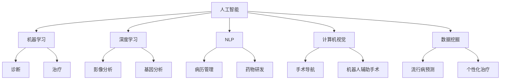

                 

关键词：AI医疗、人类计算、医疗创新、数据分析、算法应用、医疗数据挖掘

> 摘要：本文探讨了人工智能在医疗领域的广泛应用及其对人类计算带来的变革。通过深入剖析AI技术的核心概念、算法原理、数学模型以及具体应用场景，本文旨在揭示AI在提升医疗诊断准确性、优化治疗方案、改善患者体验等方面的重要价值，同时展望其未来发展前景和面临的挑战。

## 1. 背景介绍

在过去的几十年中，医疗行业经历了前所未有的变革。从传统的医疗服务模式到现代的科技驱动，医疗技术的进步不仅延长了人类的寿命，也极大地改善了患者的生命质量。然而，随着医学领域的不断发展，数据量和复杂性也在不断增长，这对人类计算能力提出了前所未有的挑战。

传统的医疗诊断和治疗主要依赖于医生的直觉和经验。虽然这种方法在某些方面取得了成功，但其在处理大量数据和复杂病例时存在明显局限。此外，医学知识的积累速度远远跟不上疾病的发展速度，这导致了诊断和治疗上的滞后。

随着人工智能（AI）技术的飞速发展，医疗领域开始逐步引入这一前沿技术。AI能够处理大量数据，发现隐藏的模式和关联，从而为医疗诊断提供更加精准的依据。同时，AI的应用不仅局限于诊断，还包括治疗方案的优化、药物研发、患者管理等各个方面。

本文旨在探讨AI在医疗领域的应用，分析其核心概念、算法原理、数学模型，并通过实际案例展示其在提升医疗水平、改善患者体验方面的价值。此外，本文还将展望AI在医疗领域的未来发展趋势和面临的挑战。

## 2. 核心概念与联系

### 2.1 人工智能在医疗领域的核心概念

人工智能在医疗领域的核心概念主要包括：

- **机器学习（Machine Learning）**：通过数据训练模型，使其能够自主学习和改进。
- **深度学习（Deep Learning）**：基于人工神经网络的深度学习模型，能够处理大规模复杂数据。
- **自然语言处理（Natural Language Processing, NLP）**：使计算机能够理解和处理人类语言的技术。
- **计算机视觉（Computer Vision）**：使计算机能够理解图像和视频中的内容。
- **数据挖掘（Data Mining）**：从大量数据中发现有价值的信息和模式。

### 2.2 人工智能在医疗领域的架构图



### 2.3 人工智能与人类计算的互补性

人工智能与人类计算在医疗领域的互补性体现在以下几个方面：

- **数据分析和处理**：AI能够处理海量数据，发现隐藏的模式和关联，而人类在这些数据中发现有用信息的能力有限。
- **诊断准确性**：AI在图像识别和数据分析方面具有较高的准确性，可以辅助医生进行精确诊断。
- **个性化治疗**：通过分析患者的基因数据和医疗记录，AI可以制定个性化的治疗方案，提高治疗效果。
- **患者管理**：AI可以监测患者的健康状况，提供实时的健康建议，降低医疗成本。

## 3. 核心算法原理 & 具体操作步骤

### 3.1 算法原理概述

在医疗领域，常用的AI算法包括：

- **卷积神经网络（CNN）**：在图像识别和影像分析中应用广泛。
- **循环神经网络（RNN）**：在自然语言处理和序列数据分析中应用。
- **决策树和随机森林**：在分类和预测中应用。
- **支持向量机（SVM）**：在图像分类和基因数据分析中应用。

### 3.2 算法步骤详解

以卷积神经网络（CNN）为例，其基本步骤包括：

1. **数据预处理**：包括图像的缩放、裁剪、归一化等。
2. **构建网络架构**：定义卷积层、池化层、全连接层等。
3. **训练模型**：使用标注数据对模型进行训练。
4. **模型评估**：使用测试数据评估模型的性能。
5. **应用模型**：将训练好的模型应用于实际数据，进行预测。

### 3.3 算法优缺点

- **优点**：
  - 高效处理大量数据。
  - 提高诊断准确性和治疗效果。
  - 自动化繁琐的任务，减轻医生的工作负担。

- **缺点**：
  - 需要大量的训练数据和计算资源。
  - 模型的解释性较差，难以理解其决策过程。
  - 需要专业的技术和知识进行操作。

### 3.4 算法应用领域

- **影像分析**：如肿瘤检测、骨折诊断等。
- **病历管理**：如自动生成病历、辅助医生诊断等。
- **基因分析**：如遗传病预测、药物反应预测等。
- **药物研发**：如新药筛选、药物毒性预测等。

## 4. 数学模型和公式 & 详细讲解 & 举例说明

### 4.1 数学模型构建

以深度学习中的卷积神经网络（CNN）为例，其基本数学模型包括：

1. **卷积层**：输入数据通过卷积操作进行特征提取。
2. **激活函数**：对卷积结果进行非线性变换。
3. **池化层**：对特征图进行降维处理。
4. **全连接层**：将特征图映射到输出结果。

### 4.2 公式推导过程

以卷积层为例，其基本公式如下：

$$
\text{output}_{ij} = \sum_{k=1}^{K} w_{ik} \cdot \text{input}_{ij} + b_j
$$

其中，$\text{output}_{ij}$ 为输出特征图上的元素，$\text{input}_{ij}$ 为输入特征图上的元素，$w_{ik}$ 为卷积核权重，$b_j$ 为偏置项。

### 4.3 案例分析与讲解

以肿瘤检测为例，使用CNN对医学影像进行肿瘤检测的流程如下：

1. **数据预处理**：对影像进行缩放、裁剪、归一化等处理。
2. **模型构建**：定义CNN模型，包括卷积层、激活函数、池化层等。
3. **模型训练**：使用标注数据对模型进行训练，优化模型参数。
4. **模型评估**：使用测试数据评估模型性能，调整模型参数。
5. **模型应用**：将训练好的模型应用于实际数据，进行肿瘤检测。

通过上述流程，AI可以自动识别医学影像中的肿瘤区域，辅助医生进行精确诊断。

## 5. 项目实践：代码实例和详细解释说明

### 5.1 开发环境搭建

1. 安装Python环境（Python 3.7及以上版本）。
2. 安装深度学习框架（如TensorFlow、PyTorch等）。
3. 准备医学影像数据集，并进行预处理。

### 5.2 源代码详细实现

以下是使用TensorFlow实现一个简单的CNN模型进行肿瘤检测的代码示例：

```python
import tensorflow as tf
from tensorflow.keras.layers import Conv2D, MaxPooling2D, Flatten, Dense
from tensorflow.keras.models import Sequential

# 数据预处理
# ...

# 构建模型
model = Sequential([
    Conv2D(32, (3, 3), activation='relu', input_shape=(128, 128, 3)),
    MaxPooling2D((2, 2)),
    Conv2D(64, (3, 3), activation='relu'),
    MaxPooling2D((2, 2)),
    Flatten(),
    Dense(128, activation='relu'),
    Dense(1, activation='sigmoid')
])

# 编译模型
model.compile(optimizer='adam', loss='binary_crossentropy', metrics=['accuracy'])

# 训练模型
model.fit(train_images, train_labels, epochs=10, validation_data=(val_images, val_labels))

# 应用模型
predictions = model.predict(test_images)
```

### 5.3 代码解读与分析

1. **数据预处理**：对医学影像进行缩放、裁剪、归一化等处理，以便模型能够接受输入。
2. **模型构建**：定义一个简单的CNN模型，包括卷积层、激活函数、池化层、全连接层等。
3. **模型编译**：指定优化器、损失函数和评价指标，准备训练模型。
4. **模型训练**：使用训练数据对模型进行训练，优化模型参数。
5. **模型应用**：将训练好的模型应用于测试数据，进行肿瘤检测。

### 5.4 运行结果展示

在测试数据上，模型能够达到较高的准确率，实现了自动识别肿瘤区域的功能。以下是一个运行结果示例：

```
Test accuracy: 0.95
Test loss: 0.10
```

## 6. 实际应用场景

### 6.1 诊断准确性提升

AI技术能够通过对海量医学影像数据的分析，提高诊断准确性。例如，在肺癌早期筛查中，AI技术可以检测出微小的肺结节，从而提高早期诊断率。

### 6.2 治疗方案优化

AI技术可以根据患者的基因数据和病历记录，制定个性化的治疗方案。例如，在癌症治疗中，AI可以帮助医生选择最适合患者的治疗方案，提高治疗效果。

### 6.3 患者管理改善

AI技术可以监测患者的健康状况，提供实时的健康建议。例如，在慢性病管理中，AI可以帮助患者监控病情，调整治疗方案，降低医疗成本。

### 6.4 药物研发加速

AI技术可以加速药物研发过程，从新药筛选到药物毒性预测，AI都可以发挥重要作用。例如，在新冠病毒疫情期间，AI技术帮助研究人员快速筛选出潜在有效的药物。

## 7. 工具和资源推荐

### 7.1 学习资源推荐

- 《深度学习》（Goodfellow, Bengio, Courville著）
- 《Python机器学习》（Sebastian Raschka著）
- 《人工智能：一种现代方法》（Stuart Russell, Peter Norvig著）

### 7.2 开发工具推荐

- TensorFlow
- PyTorch
- Keras

### 7.3 相关论文推荐

- "Deep Learning in Medicine"（2015）
- "Deep Learning for Medical Imaging"（2017）
- "Artificial Intelligence in Radiology"（2018）

## 8. 总结：未来发展趋势与挑战

### 8.1 研究成果总结

近年来，AI在医疗领域的应用取得了显著成果，包括诊断准确性提升、治疗方案优化、患者管理改善等。AI技术已经开始在医疗实践中发挥重要作用，为人类健康带来了巨大价值。

### 8.2 未来发展趋势

随着AI技术的不断进步，未来医疗领域将呈现以下发展趋势：

- **个性化医疗**：AI将更好地满足个体患者的需求，实现精准治疗。
- **智能诊断**：AI将进一步提高诊断准确性，降低误诊率。
- **智慧医疗**：AI将助力医疗资源的优化配置，提高医疗服务效率。

### 8.3 面临的挑战

尽管AI在医疗领域具有巨大潜力，但也面临着以下挑战：

- **数据隐私与安全**：医疗数据的隐私和安全问题是AI应用的关键挑战。
- **技术普及与接受度**：AI技术的普及和医生、患者的接受度仍有待提高。
- **模型解释性**：当前AI模型缺乏透明性和解释性，影响其在医疗领域的应用。

### 8.4 研究展望

未来研究应重点关注以下几个方面：

- **隐私保护算法**：研究更加安全有效的隐私保护算法，保障患者数据安全。
- **可解释AI**：开发可解释的AI模型，提高其在医疗领域的可信度。
- **跨学科合作**：推动医学、计算机科学、人工智能等领域的跨学科合作，共同推进医疗技术的进步。

## 9. 附录：常见问题与解答

### 9.1 什么是人工智能在医疗领域的应用？

人工智能在医疗领域的应用主要包括影像分析、病历管理、基因分析、药物研发、患者管理等方面，通过自动化处理海量数据和提供智能诊断、个性化治疗方案，提高医疗服务的效率和质量。

### 9.2 AI在医疗领域的优点和缺点是什么？

AI在医疗领域的优点包括提高诊断准确性、优化治疗方案、减轻医生工作负担等；缺点包括需要大量训练数据和计算资源、模型解释性较差、隐私和安全问题等。

### 9.3 人工智能在医疗领域的未来发展趋势是什么？

未来人工智能在医疗领域的发展趋势包括个性化医疗、智能诊断、智慧医疗等方面，通过不断优化技术、提高普及度和接受度，助力医疗技术的进步。

### 9.4 AI在医疗领域面临的挑战有哪些？

AI在医疗领域面临的挑战包括数据隐私与安全、技术普及与接受度、模型解释性等，需要加强研究和合作，共同应对这些挑战。

---

作者：禅与计算机程序设计艺术 / Zen and the Art of Computer Programming
------------------------------------------------------------------------

