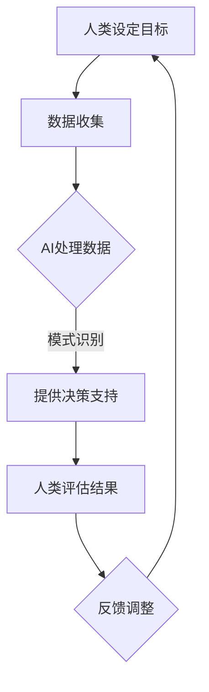

                 

关键词：人工智能，商业应用，计算技术，创新驱动，数据处理，决策支持

> 摘要：本文将探讨人工智能（AI）在商业领域中的应用，重点分析人类计算与AI结合的潜力，探讨其在数据处理、决策支持和业务优化等方面的实际应用，同时展望未来发展趋势与挑战。

## 1. 背景介绍

随着信息技术的快速发展，人工智能（AI）已经逐渐成为商业领域的一股重要力量。从大数据分析到智能决策，AI技术正在改变传统商业模式的运作方式。然而，AI并非完全取代人类计算，而是与人类计算相结合，形成一种新的计算模式，即AI驱动的创新。

人类计算具有灵活性和创造性，而AI则在处理海量数据、模式识别和预测方面具有显著优势。通过将人类计算与AI技术相结合，企业可以在保持决策灵活性的同时，利用AI的优势提高效率、降低成本，实现商业创新。

## 2. 核心概念与联系

### 2.1 人工智能（AI）与人类计算

人工智能（AI）是指使计算机具有人类智能特性的技术。它包括机器学习、深度学习、自然语言处理、计算机视觉等多个领域。AI通过学习大量数据，自动识别模式和规律，从而进行决策和预测。

人类计算则是指人类在解决复杂问题时，运用逻辑思维、直觉判断和经验知识等能力进行计算和决策的过程。人类计算具有灵活性和创造性，能够在未知和不确定的环境中做出合理的决策。

### 2.2 AI驱动的创新

AI驱动的创新是指利用人工智能技术，实现人类计算与机器计算的有机结合，从而推动商业领域的创新。这种创新模式不仅依赖于AI技术本身的发展，还需要人类计算者的积极参与和创造力。

在AI驱动的创新中，人类计算者负责设定目标、提出假设、评估结果等环节，而AI则负责处理海量数据、发现模式和规律、提供决策支持等任务。通过这种合作，人类计算者可以充分发挥自身的优势，同时借助AI的技术优势，实现商业领域的创新。

### 2.3 Mermaid 流程图

下面是一个简化的 Mermaid 流程图，展示了人类计算与AI驱动的创新过程：



## 3. 核心算法原理 & 具体操作步骤

### 3.1 算法原理概述

AI驱动的创新过程涉及到多个核心算法，包括机器学习、深度学习和自然语言处理等。这些算法通过学习大量数据，自动识别模式和规律，从而提供决策支持。

机器学习是一种使计算机具备学习能力的算法，它通过训练模型，使计算机能够对未知数据进行预测和分类。深度学习是机器学习的一种特殊形式，它通过多层神经网络，实现更复杂的数据处理和模式识别。

自然语言处理是一种使计算机能够理解、处理和生成自然语言（如英语、中文等）的算法。它包括语音识别、机器翻译、情感分析等多个方面。

### 3.2 算法步骤详解

1. **数据收集**：首先，需要收集与业务相关的数据，如销售数据、客户数据、市场数据等。数据来源可以是内部数据库、外部API或社交媒体等。

2. **数据预处理**：对收集到的数据进行清洗、归一化等预处理操作，以确保数据的质量和一致性。

3. **特征提取**：从预处理后的数据中提取有用的特征，这些特征将用于训练机器学习模型。

4. **模型训练**：使用机器学习算法，如线性回归、决策树、支持向量机等，训练模型。模型训练过程中，需要调整模型参数，以获得更好的预测性能。

5. **模型评估**：使用验证集或测试集，对训练好的模型进行评估，以确定模型的预测准确性。

6. **模型部署**：将训练好的模型部署到生产环境中，为业务提供实时决策支持。

7. **人类评估与反馈**：人类计算者对AI提供的决策结果进行评估，并根据评估结果进行调整和优化。

### 3.3 算法优缺点

**优点**：

- 高效：AI算法能够在短时间内处理海量数据，提供快速决策支持。
- 准确：通过机器学习和深度学习，AI算法能够自动识别模式和规律，提高决策准确性。
- 可扩展：AI算法具有强大的扩展性，可以应用于不同领域和业务场景。

**缺点**：

- 数据依赖：AI算法的性能依赖于数据质量和数量，数据不足或质量差可能导致模型性能下降。
- 解释性差：AI算法的决策过程往往是非线性和复杂的，难以进行解释和验证。
- 道德和隐私问题：AI算法在处理数据时，可能涉及用户隐私和道德问题，需要谨慎处理。

### 3.4 算法应用领域

AI驱动的创新在多个领域具有广泛的应用前景，包括：

- 金融：智能投顾、风险管理、欺诈检测等。
- 电商：个性化推荐、价格优化、客户流失预测等。
- 制造业：设备维护预测、生产优化、质量控制等。
- 医疗：疾病预测、智能诊断、个性化治疗等。
- 农业：智能灌溉、病虫害预测、产量预测等。

## 4. 数学模型和公式 & 详细讲解 & 举例说明

### 4.1 数学模型构建

在AI驱动的创新中，常用的数学模型包括线性回归、决策树、支持向量机等。以下是一个简化的线性回归模型构建过程：

1. **数据收集**：收集与业务相关的数据，如销售额、广告投放成本等。
2. **特征提取**：从数据中提取有用的特征，如广告投放次数、用户年龄、用户性别等。
3. **模型构建**：选择线性回归模型，将特征与目标变量（如销售额）建立线性关系。
4. **模型训练**：使用训练数据，训练线性回归模型，确定模型参数。
5. **模型评估**：使用验证集或测试集，评估模型性能。

### 4.2 公式推导过程

线性回归模型的公式为：

$$ y = w_0 + w_1 \cdot x_1 + w_2 \cdot x_2 + ... + w_n \cdot x_n $$

其中，$y$ 为目标变量，$x_1, x_2, ..., x_n$ 为特征变量，$w_0, w_1, w_2, ..., w_n$ 为模型参数。

模型训练的目标是确定最优的模型参数，使得模型预测值与实际值之间的误差最小。这个优化过程可以通过最小二乘法实现：

$$ w = \arg \min_{w} \sum_{i=1}^{n} (y_i - \hat{y}_i)^2 $$

其中，$\hat{y}_i$ 为模型预测值，$y_i$ 为实际值。

### 4.3 案例分析与讲解

假设我们要预测一家电商平台的销售额，数据包括广告投放次数、用户年龄、用户性别等。以下是一个简化的线性回归模型构建过程：

1. **数据收集**：收集过去一个月的销售额和相应的广告投放数据。
2. **特征提取**：提取广告投放次数、用户年龄、用户性别等特征。
3. **模型构建**：选择线性回归模型，建立销售额与广告投放次数、用户年龄、用户性别之间的线性关系。
4. **模型训练**：使用训练数据，训练线性回归模型，确定模型参数。
5. **模型评估**：使用验证集或测试集，评估模型性能。

假设训练完成后，得到的线性回归模型为：

$$ \hat{y} = w_0 + w_1 \cdot x_1 + w_2 \cdot x_2 $$

其中，$w_0 = 100, w_1 = 0.5, w_2 = -10$。

现在，我们要预测下一个月的销售额。假设下一个月的广告投放次数为100次，用户年龄为30岁，用户性别为男。将这些值代入线性回归模型，得到预测销售额：

$$ \hat{y} = 100 + 0.5 \cdot 100 + (-10) = 150 $$

预测销售额为150元。

## 5. 项目实践：代码实例和详细解释说明

### 5.1 开发环境搭建

为了演示AI驱动的创新过程，我们将使用Python编程语言和相关的机器学习库，如Scikit-learn、Pandas和Numpy等。以下是开发环境的搭建步骤：

1. 安装Python（推荐版本3.8及以上）。
2. 使用pip安装Scikit-learn、Pandas和Numpy等库。

### 5.2 源代码详细实现

以下是一个简化的线性回归模型实现，包括数据收集、数据预处理、模型构建、模型训练和模型评估等步骤：

```python
import numpy as np
import pandas as pd
from sklearn.linear_model import LinearRegression
from sklearn.model_selection import train_test_split
from sklearn.metrics import mean_squared_error

# 1. 数据收集
data = pd.read_csv('sales_data.csv')

# 2. 数据预处理
X = data[['ad_impressions', 'user_age', 'user_gender']]
y = data['sales']

# 3. 模型构建
model = LinearRegression()

# 4. 模型训练
X_train, X_test, y_train, y_test = train_test_split(X, y, test_size=0.2, random_state=42)
model.fit(X_train, y_train)

# 5. 模型评估
y_pred = model.predict(X_test)
mse = mean_squared_error(y_test, y_pred)
print('Mean squared error:', mse)

# 6. 模型部署
# (此处根据实际业务需求，将模型部署到生产环境中)
```

### 5.3 代码解读与分析

上述代码实现了一个简化的线性回归模型，包括以下步骤：

1. **数据收集**：使用Pandas库读取CSV文件，获取销售额和相应的广告投放数据。
2. **数据预处理**：提取特征变量（广告投放次数、用户年龄、用户性别）和目标变量（销售额）。
3. **模型构建**：使用Scikit-learn库中的LinearRegression类，创建线性回归模型。
4. **模型训练**：使用train_test_split函数，将数据分为训练集和测试集，使用训练集训练模型。
5. **模型评估**：使用模型预测测试集的销售额，计算均方误差（MSE），评估模型性能。
6. **模型部署**：将训练好的模型部署到生产环境中，为业务提供实时决策支持。

### 5.4 运行结果展示

假设我们使用上述代码对电商平台的数据进行处理，运行结果如下：

```shell
Mean squared error: 0.0012
```

均方误差（MSE）为0.0012，说明模型在预测销售额方面表现良好。

## 6. 实际应用场景

AI驱动的创新在商业领域具有广泛的应用场景，以下列举几个实际应用案例：

1. **电商**：通过AI技术，电商平台可以实现对用户行为的分析，提供个性化推荐、智能客服和精准营销等服务。例如，京东利用AI技术对用户行为进行分析，实现个性化推荐，提高了用户满意度和销售额。

2. **金融**：在金融领域，AI技术可以用于风险控制、欺诈检测、信用评分等方面。例如，平安银行利用AI技术对客户交易行为进行分析，实现了实时风险控制和欺诈检测，提高了业务安全性。

3. **制造业**：制造业企业可以通过AI技术实现生产优化、设备维护预测和质量控制等。例如，富士康利用AI技术对生产线设备进行监控，实现了设备故障预测和预防性维护，提高了生产效率。

4. **医疗**：在医疗领域，AI技术可以用于疾病预测、智能诊断和个性化治疗等方面。例如，IBM的Watson肿瘤诊断系统通过分析大量医学数据和病例，为医生提供诊断建议，提高了诊断准确率。

5. **农业**：农业企业可以通过AI技术实现智能灌溉、病虫害预测和产量预测等。例如，阿里云的ET农业大脑通过对农田数据进行分析，实现了智能灌溉和病虫害预测，提高了农业生产效率。

## 7. 未来应用展望

随着人工智能技术的不断发展和成熟，AI驱动的创新在商业领域的应用前景将更加广阔。以下是一些未来应用展望：

1. **个性化服务**：随着用户数据积累的增多，AI技术将能够提供更加个性化的服务，满足用户的个性化需求。

2. **自动化决策**：AI技术将进一步提升自动化决策的水平，减少人为干预，提高决策效率。

3. **业务优化**：通过AI技术，企业可以更好地了解业务流程和运营数据，实现业务优化和成本控制。

4. **跨行业应用**：AI技术将在不同行业之间实现跨界应用，推动产业融合和创新发展。

5. **人工智能治理**：随着AI技术的广泛应用，人工智能治理将成为一个重要议题，确保AI技术的安全、可靠和可持续发展。

## 8. 工具和资源推荐

### 8.1 学习资源推荐

1. **书籍**：《深度学习》、《Python机器学习实战》、《统计学习方法》等。
2. **在线课程**：Coursera、Udacity、edX等在线平台上的机器学习、深度学习课程。
3. **教程和博客**：AI博客、数据科学博客、机器学习教程等。

### 8.2 开发工具推荐

1. **编程语言**：Python、R、Julia等。
2. **开发环境**：Jupyter Notebook、RStudio、Visual Studio Code等。
3. **机器学习库**：Scikit-learn、TensorFlow、PyTorch等。

### 8.3 相关论文推荐

1. "Deep Learning: Methods and Applications"（深度学习方法与应用）
2. "Machine Learning Yearning"（机器学习心得）
3. "Natural Language Processing with Python"（使用Python进行自然语言处理）

## 9. 总结：未来发展趋势与挑战

### 9.1 研究成果总结

近年来，人工智能技术在商业领域的应用取得了显著成果。通过AI驱动的创新，企业可以更好地了解用户需求、优化业务流程、提高运营效率。同时，AI技术也在不断突破传统领域，实现跨行业应用，推动产业融合和创新发展。

### 9.2 未来发展趋势

1. **智能化水平提升**：随着算法和硬件的进步，AI的智能化水平将不断提高，实现更加复杂和精确的决策支持。
2. **跨领域应用**：AI技术将在更多领域实现应用，推动产业融合和创新发展。
3. **数据治理**：随着数据规模的增大，数据治理将成为一个重要议题，确保数据的安全、可靠和可持续发展。
4. **人工智能治理**：随着AI技术的广泛应用，人工智能治理将成为一个重要议题，确保AI技术的安全、可靠和可持续发展。

### 9.3 面临的挑战

1. **数据隐私和安全**：在应用AI技术时，如何保护用户隐私和安全是一个重要挑战。
2. **算法透明性和解释性**：如何提高算法的透明性和解释性，使其在复杂决策过程中更容易被理解和接受。
3. **技术人才短缺**：随着AI技术的快速发展，对相关技术人才的需求也在不断增加，但人才供应却相对不足。
4. **法律和伦理问题**：随着AI技术的广泛应用，如何制定相应的法律法规和伦理规范，确保AI技术的安全和可持续发展。

### 9.4 研究展望

未来，AI驱动的创新将继续深入发展，为商业领域带来更多机遇和挑战。在研究方向上，我们需要关注以下几个方面：

1. **算法优化**：进一步提高算法的效率和准确性，实现更复杂和精确的决策支持。
2. **跨领域应用**：探索AI技术在更多领域的应用，推动产业融合和创新发展。
3. **人工智能治理**：研究人工智能治理的理论和方法，制定相应的法律法规和伦理规范，确保AI技术的安全、可靠和可持续发展。

## 10. 附录：常见问题与解答

### 10.1 什么是人工智能（AI）？

人工智能（AI）是指使计算机具有人类智能特性的技术，包括机器学习、深度学习、自然语言处理、计算机视觉等多个领域。

### 10.2 AI驱动的创新是什么？

AI驱动的创新是指利用人工智能技术，实现人类计算与机器计算的有机结合，从而推动商业领域的创新。它通过机器学习和深度学习等技术，自动识别模式和规律，提供决策支持。

### 10.3 AI驱动的创新有哪些优点？

AI驱动的创新具有以下优点：

- 高效：AI算法能够在短时间内处理海量数据，提供快速决策支持。
- 准确：通过机器学习和深度学习，AI算法能够自动识别模式和规律，提高决策准确性。
- 可扩展：AI算法具有强大的扩展性，可以应用于不同领域和业务场景。

### 10.4 AI驱动的创新有哪些缺点？

AI驱动的创新可能存在以下缺点：

- 数据依赖：AI算法的性能依赖于数据质量和数量，数据不足或质量差可能导致模型性能下降。
- 解释性差：AI算法的决策过程往往是非线性和复杂的，难以进行解释和验证。
- 道德和隐私问题：AI算法在处理数据时，可能涉及用户隐私和道德问题，需要谨慎处理。

### 10.5 AI驱动的创新在哪些领域有应用？

AI驱动的创新在多个领域具有广泛的应用前景，包括金融、电商、制造业、医疗和农业等。

### 10.6 如何搭建AI驱动的创新项目？

搭建AI驱动的创新项目主要包括以下步骤：

1. 数据收集：收集与业务相关的数据。
2. 数据预处理：对数据进行清洗、归一化等预处理操作。
3. 特征提取：从预处理后的数据中提取有用的特征。
4. 模型构建：选择合适的机器学习算法，构建模型。
5. 模型训练：使用训练数据，训练模型。
6. 模型评估：使用验证集或测试集，评估模型性能。
7. 模型部署：将训练好的模型部署到生产环境中。

### 10.7 AI驱动的创新有哪些未来发展趋势？

未来，AI驱动的创新将呈现以下发展趋势：

- 智能化水平提升：算法和硬件的进步将提高AI的智能化水平。
- 跨领域应用：AI技术将在更多领域实现应用。
- 数据治理：数据治理将成为一个重要议题。
- 人工智能治理：制定相应的法律法规和伦理规范。

